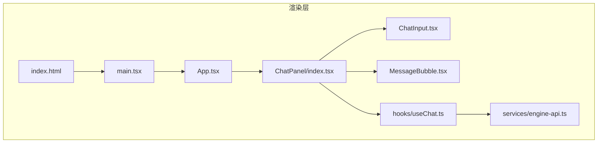
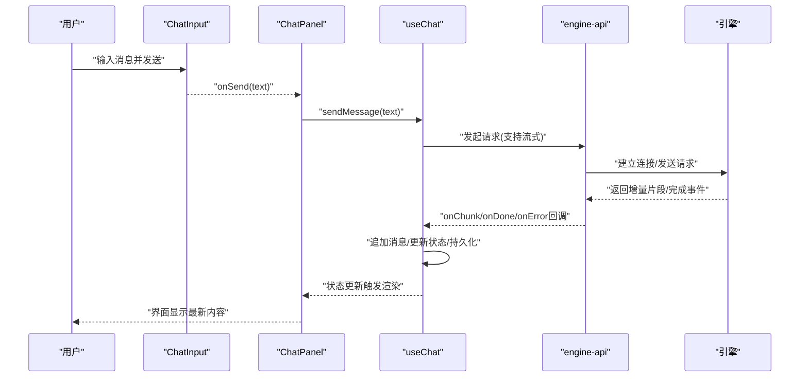
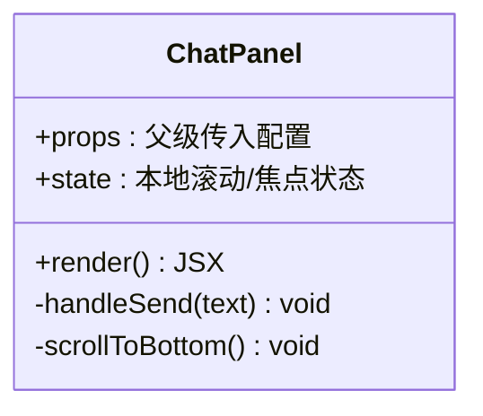
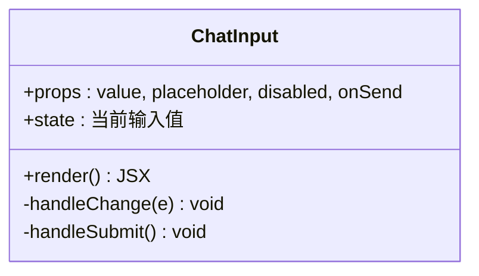
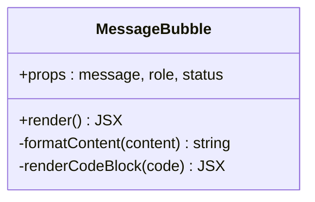
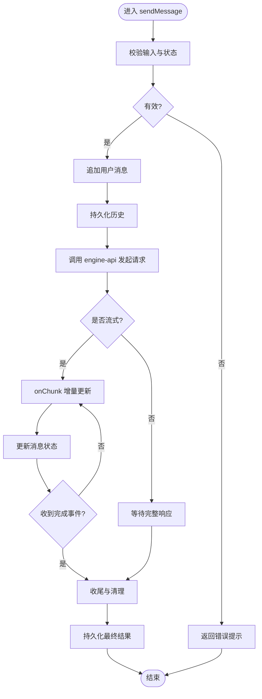
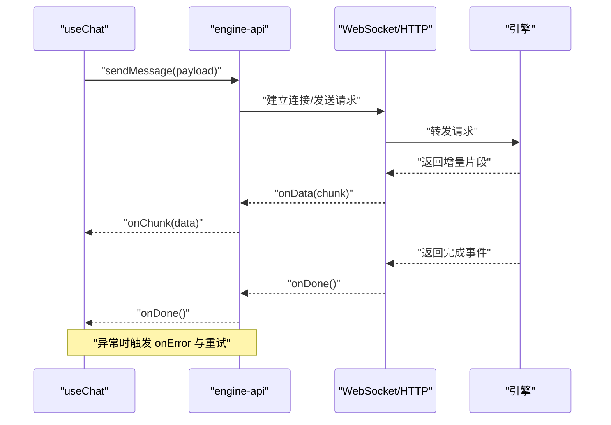
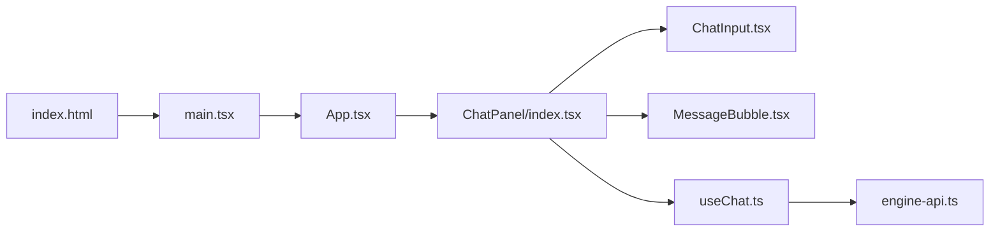

# AI对话系统

<cite>
**本文引用的文件**   
- [ChatPanel/index.tsx](file://app/renderer/src/components/ChatPanel/index.tsx)
- [ChatInput.tsx](file://app/renderer/src/components/ChatPanel/ChatInput.tsx)
- [MessageBubble.tsx](file://app/renderer/src/components/ChatPanel/MessageBubble.tsx)
- [useChat.ts](file://app/renderer/src/hooks/useChat.ts)
- [engine-api.ts](file://app/renderer/src/services/engine-api.ts)
- [App.tsx](file://app/renderer/src/App.tsx)
- [main.tsx](file://app/renderer/src/main.tsx)
- [index.html](file://app/renderer/index.html)
</cite>

## 目录
1. [简介](#简介)
2. [项目结构](#项目结构)
3. [核心组件](#核心组件)
4. [架构总览](#架构总览)
5. [详细组件分析](#详细组件分析)
6. [依赖关系分析](#依赖关系分析)
7. [性能考虑](#性能考虑)
8. [故障排查指南](#故障排查指南)
9. [结论](#结论)
10. [附录](#附录)

## 简介
本技术文档面向KCoder的AI对话系统，聚焦于聊天界面与消息处理链路。文档将深入解析以下方面：
- 聊天界面组件架构：ChatPanel、ChatInput、MessageBubble等核心组件的职责与协作方式
- 消息处理流程：从用户输入到AI响应的完整数据流
- 流式响应机制：WebSocket连接管理、实时数据传输、错误重试策略
- 历史消息管理与持久化存储
- useChat自定义钩子的状态管理与业务逻辑封装
- 与引擎API的集成方式：请求格式、响应处理、错误处理
- 组件使用示例与最佳实践
- 性能优化技巧与用户体验改进建议

## 项目结构
前端渲染层位于 app/renderer/src，包含UI组件、自定义钩子与服务模块；引擎层位于 engine 目录，提供AI能力与工具链。本文档主要关注渲染层的AI对话实现。

图表来源
- [App.tsx](file://app/renderer/src/App.tsx)
- [ChatPanel/index.tsx](file://app/renderer/src/components/ChatPanel/index.tsx)
- [ChatInput.tsx](file://app/renderer/src/components/ChatPanel/ChatInput.tsx)
- [MessageBubble.tsx](file://app/renderer/src/components/ChatPanel/MessageBubble.tsx)
- [useChat.ts](file://app/renderer/src/hooks/useChat.ts)
- [engine-api.ts](file://app/renderer/src/services/engine-api.ts)
- [main.tsx](file://app/renderer/src/main.tsx)
- [index.html](file://app/renderer/index.html)

章节来源
- [App.tsx](file://app/renderer/src/App.tsx)
- [ChatPanel/index.tsx](file://app/renderer/src/components/ChatPanel/index.tsx)
- [ChatInput.tsx](file://app/renderer/src/components/ChatPanel/ChatInput.tsx)
- [MessageBubble.tsx](file://app/renderer/src/components/ChatPanel/MessageBubble.tsx)
- [useChat.ts](file://app/renderer/src/hooks/useChat.ts)
- [engine-api.ts](file://app/renderer/src/services/engine-api.ts)
- [main.tsx](file://app/renderer/src/main.tsx)
- [index.html](file://app/renderer/index.html)

## 核心组件
- ChatPanel：负责会话容器、消息列表展示、滚动定位、布局与交互协调
- ChatInput：负责用户输入、发送触发、基础校验与占位提示
- MessageBubble：负责单条消息的渲染（文本、代码块、状态指示）
- useChat：封装会话状态、消息增删改查、流式接收、错误与重试、历史持久化
- engine-api：封装与引擎的通信协议（HTTP/WebSocket）、请求构造、响应解析、错误映射

章节来源
- [ChatPanel/index.tsx](file://app/renderer/src/components/ChatPanel/index.tsx)
- [ChatInput.tsx](file://app/renderer/src/components/ChatPanel/ChatInput.tsx)
- [MessageBubble.tsx](file://app/renderer/src/components/ChatPanel/MessageBubble.tsx)
- [useChat.ts](file://app/renderer/src/hooks/useChat.ts)
- [engine-api.ts](file://app/renderer/src/services/engine-api.ts)

## 架构总览
整体架构采用“组件-钩子-服务”分层：
- UI层：ChatPanel组合ChatInput与MessageBubble，呈现对话界面
- 状态层：useChat集中管理消息、加载态、错误、重连、历史
- 服务层：engine-api统一与引擎交互，屏蔽底层传输细节

图表来源
- [ChatInput.tsx](file://app/renderer/src/components/ChatPanel/ChatInput.tsx)
- [ChatPanel/index.tsx](file://app/renderer/src/components/ChatPanel/index.tsx)
- [useChat.ts](file://app/renderer/src/hooks/useChat.ts)
- [engine-api.ts](file://app/renderer/src/services/engine-api.ts)

## 详细组件分析

### ChatPanel组件
职责与行为
- 作为会话容器，聚合消息列表与输入框
- 维护滚动位置，确保新消息可见
- 向useChat派发发送动作，订阅状态变化以驱动渲染

关键设计点
- 将发送逻辑委托给useChat，保持UI与业务解耦
- 通过ref或滚动监听保证长列表体验
- 对空状态、加载中、错误状态进行友好展示

章节来源
- [ChatPanel/index.tsx](file://app/renderer/src/components/ChatPanel/index.tsx)

#### 类图（概念性）

[此图为概念示意，不直接映射具体源码结构]

### ChatInput组件
职责与行为
- 提供文本输入区域与发送按钮
- 执行基础输入校验（非空、长度限制）
- 触发onSend回调并将输入清空

关键设计点
- 键盘快捷键（如Enter发送）提升效率
- 禁用态控制防止重复提交
- 占位符与提示文案增强可用性

章节来源
- [ChatInput.tsx](file://app/renderer/src/components/ChatPanel/ChatInput.tsx)

#### 类图（概念性）

[此图为概念示意，不直接映射具体源码结构]

### MessageBubble组件
职责与行为
- 渲染单条消息，区分用户与AI角色
- 支持富文本与代码块高亮
- 显示加载指示器与错误信息

关键设计点
- 根据消息类型选择不同渲染路径
- 对超长内容进行截断或折叠
- 可复制、展开等交互增强

章节来源
- [MessageBubble.tsx](file://app/renderer/src/components/ChatPanel/MessageBubble.tsx)

#### 类图（概念性）

[此图为概念示意，不直接映射具体源码结构]

### useChat自定义钩子
职责与行为
- 管理消息列表、加载态、错误态、重连计数
- 提供sendMessage、clearHistory、retry等方法
- 处理流式增量更新、完成事件与错误回调
- 负责历史消息的持久化与恢复

关键设计点
- 幂等性：避免重复发送导致重复消息
- 流式合并：按顺序拼接增量片段，避免闪烁
- 错误重试：指数退避与最大重试次数
- 持久化：在内存与本地存储之间同步

章节来源
- [useChat.ts](file://app/renderer/src/hooks/useChat.ts)

#### 流程图（消息发送与流式更新）

图表来源
- [useChat.ts](file://app/renderer/src/hooks/useChat.ts)
- [engine-api.ts](file://app/renderer/src/services/engine-api.ts)

### engine-api服务
职责与行为
- 封装与引擎的通信协议（HTTP/WebSocket）
- 构造请求体、设置超时与重试
- 解析响应（包括流式分片），映射错误码

关键设计点
- 统一错误模型，便于上层处理
- 连接池与心跳保活
- 可插拔适配器（未来扩展多后端）

章节来源
- [engine-api.ts](file://app/renderer/src/services/engine-api.ts)

#### 序列图（与引擎交互）

图表来源
- [useChat.ts](file://app/renderer/src/hooks/useChat.ts)
- [engine-api.ts](file://app/renderer/src/services/engine-api.ts)

## 依赖关系分析
组件与钩子、服务的依赖关系如下：

图表来源
- [App.tsx](file://app/renderer/src/App.tsx)
- [ChatPanel/index.tsx](file://app/renderer/src/components/ChatPanel/index.tsx)
- [ChatInput.tsx](file://app/renderer/src/components/ChatPanel/ChatInput.tsx)
- [MessageBubble.tsx](file://app/renderer/src/components/ChatPanel/MessageBubble.tsx)
- [useChat.ts](file://app/renderer/src/hooks/useChat.ts)
- [engine-api.ts](file://app/renderer/src/services/engine-api.ts)
- [main.tsx](file://app/renderer/src/main.tsx)
- [index.html](file://app/renderer/index.html)

章节来源
- [App.tsx](file://app/renderer/src/App.tsx)
- [ChatPanel/index.tsx](file://app/renderer/src/components/ChatPanel/index.tsx)
- [ChatInput.tsx](file://app/renderer/src/components/ChatPanel/ChatInput.tsx)
- [MessageBubble.tsx](file://app/renderer/src/components/ChatPanel/MessageBubble.tsx)
- [useChat.ts](file://app/renderer/src/hooks/useChat.ts)
- [engine-api.ts](file://app/renderer/src/services/engine-api.ts)
- [main.tsx](file://app/renderer/src/main.tsx)
- [index.html](file://app/renderer/index.html)

## 性能考虑
- 列表渲染优化：对长消息列表使用虚拟滚动或分页加载，减少DOM节点数量
- 增量更新：流式响应按最小粒度更新，避免整段重绘
- 防抖与节流：输入框与滚动事件去抖，降低频繁计算
- 资源懒加载：代码块与图片按需渲染
- 连接复用：WebSocket连接池与心跳保活，减少握手开销
- 错误快速失败：超时与重试策略平衡用户体验与稳定性

## 故障排查指南
常见问题与定位步骤
- 无法建立连接：检查网络、代理与引擎地址；查看engine-api的错误映射与日志
- 流式中断：确认心跳与重连逻辑；观察onError与重试计数
- 消息丢失：核对持久化写入时机与幂等键；对比本地存储与内存状态
- 渲染卡顿：检查消息列表渲染策略与代码块高亮成本；必要时启用虚拟化

章节来源
- [useChat.ts](file://app/renderer/src/hooks/useChat.ts)
- [engine-api.ts](file://app/renderer/src/services/engine-api.ts)

## 结论
本系统通过清晰的组件分层与统一的钩子封装，实现了稳定高效的AI对话体验。ChatPanel、ChatInput、MessageBubble各司其职，useChat集中管理状态与业务逻辑，engine-api屏蔽底层传输差异。结合流式响应、错误重试与持久化策略，系统在可用性与性能上取得良好平衡。后续可在连接池、错误观测与国际化等方面持续优化。

## 附录

### 组件使用示例与最佳实践
- 在页面中引入ChatPanel，并通过props注入主题与尺寸
- 使用useChat提供的sendMessage方法发送消息，避免在组件内直接操作状态
- 为MessageBubble定制渲染器以适配特定内容类型
- 在engine-api中配置超时与重试参数，适应不同网络环境

章节来源
- [ChatPanel/index.tsx](file://app/renderer/src/components/ChatPanel/index.tsx)
- [ChatInput.tsx](file://app/renderer/src/components/ChatPanel/ChatInput.tsx)
- [MessageBubble.tsx](file://app/renderer/src/components/ChatPanel/MessageBubble.tsx)
- [useChat.ts](file://app/renderer/src/hooks/useChat.ts)
- [engine-api.ts](file://app/renderer/src/services/engine-api.ts)

### 与引擎API集成要点
- 请求格式：统一payload结构，包含上下文、工具调用与用户消息
- 响应处理：支持流式分片与完成事件，错误事件需映射为统一错误对象
- 错误处理：网络错误、引擎错误、超时与限流分别处理，提供重试与降级策略

章节来源
- [engine-api.ts](file://app/renderer/src/services/engine-api.ts)
- [useChat.ts](file://app/renderer/src/hooks/useChat.ts)