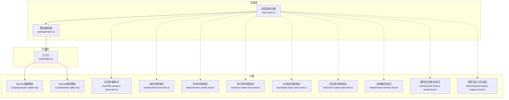
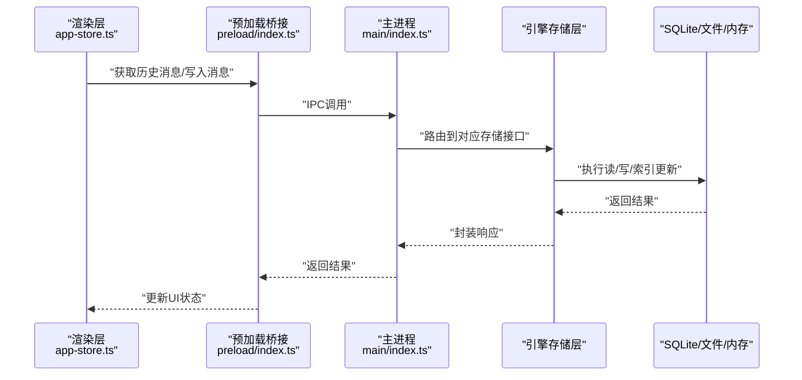
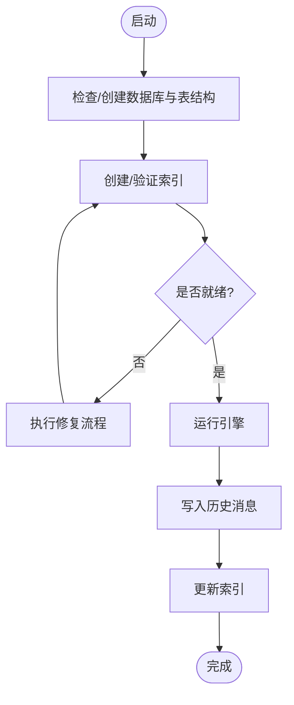
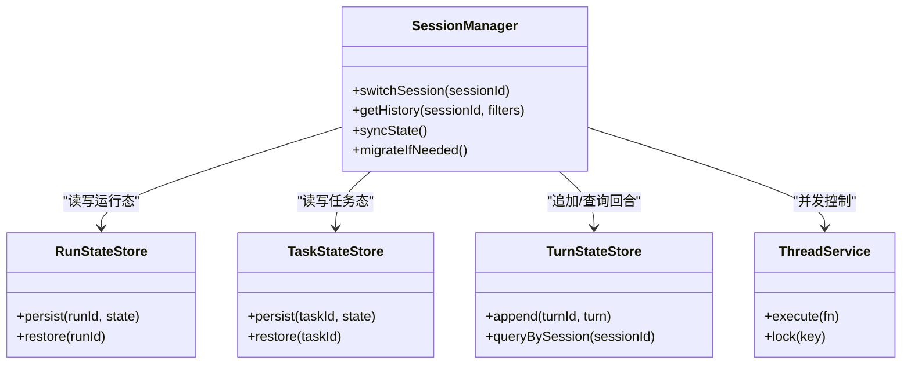
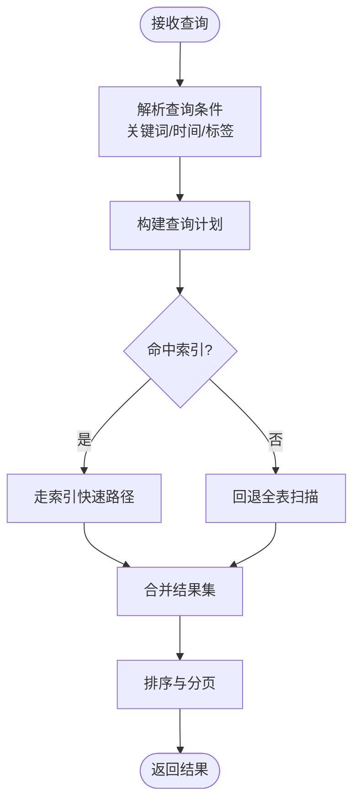
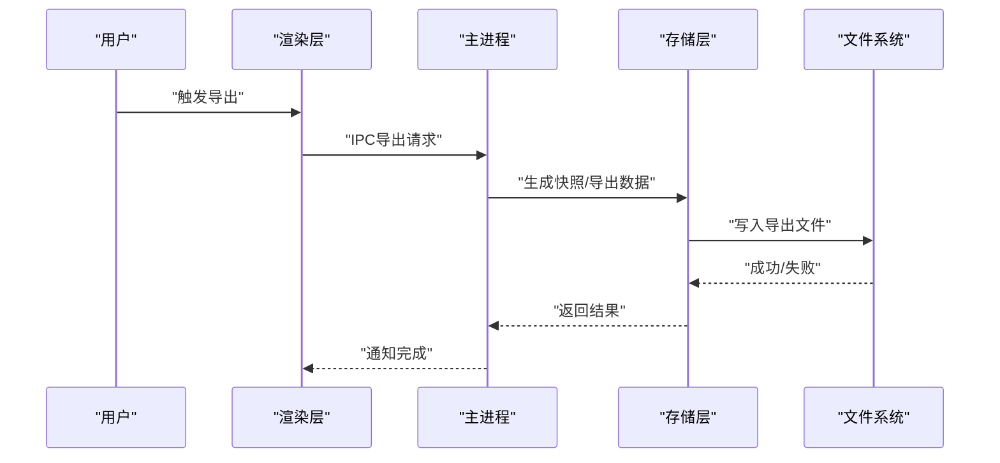
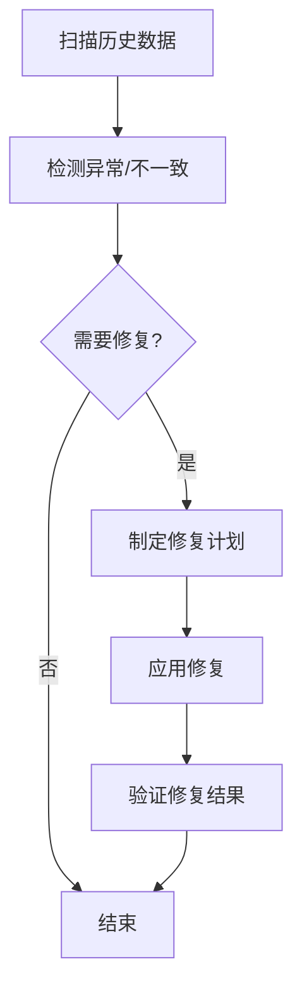
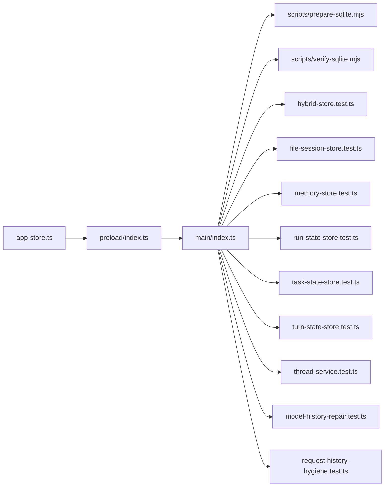

# 历史消息管理

<cite>
**本文引用的文件**   
- [app/main/index.ts](file://app/main/index.ts)
- [app/preload/index.ts](file://app/preload/index.ts)
- [app/renderer/src/stores/app-store.ts](file://app/renderer/src/stores/app-store.ts)
- [engine/scripts/prepare-sqlite.mjs](file://engine/scripts/prepare-sqlite.mjs)
- [engine/scripts/verify-sqlite.mjs](file://engine/scripts/verify-sqlite.mjs)
- [engine/tests/file-session-store.test.ts](file://engine/tests/file-session-store.test.ts)
- [engine/tests/hybrid-store.test.ts](file://engine/tests/hybrid-store.test.ts)
- [engine/tests/memory-store.test.ts](file://engine/tests/memory-store.test.ts)
- [engine/tests/run-state-store.test.ts](file://engine/tests/run-state-store.test.ts)
- [engine/tests/task-state-store.test.ts](file://engine/tests/task-state-store.test.ts)
- [engine/tests/turn-state-store.test.ts](file://engine/tests/turn-state-store.test.ts)
- [engine/tests/model-history-repair.test.ts](file://engine/tests/model-history-repair.test.ts)
- [engine/tests/request-history-hygiene.test.ts](file://engine/tests/request-history-hygiene.test.ts)
- [engine/tests/thread-service.test.ts](file://engine/tests/thread-service.test.ts)
</cite>

## 目录
1. [简介](#简介)
2. [项目结构](#项目结构)
3. [核心组件](#核心组件)
4. [架构总览](#架构总览)
5. [详细组件分析](#详细组件分析)
6. [依赖关系分析](#依赖关系分析)
7. [性能考虑](#性能考虑)
8. [故障排查指南](#故障排查指南)
9. [结论](#结论)
10. [附录](#附录)

## 简介
本技术文档围绕KCoder的历史消息管理，系统性阐述以下方面：
- 持久化存储机制：本地存储、数据库设计与索引优化
- 会话管理与上下文保持：会话切换、状态同步与数据迁移
- 检索与搜索：全文检索、时间筛选、标签分类
- 备份与恢复：导出、导入与版本兼容
- 性能优化：分页加载、懒加载、缓存策略
- 数据清理与存储空间管理最佳实践

为便于不同背景读者理解，文档采用“从概念到实现”的渐进式结构，并在涉及具体代码时提供“章节来源”和“图示来源”。

## 项目结构
KCoder由前端渲染层（Electron Renderer）、主进程（Electron Main）以及引擎（Engine）组成。历史消息相关能力主要位于引擎侧的持久化与存储模块，并通过预加载脚本暴露给渲染层使用。

**图示来源**
- [app/main/index.ts](file://app/main/index.ts)
- [app/preload/index.ts](file://app/preload/index.ts)
- [app/renderer/src/stores/app-store.ts](file://app/renderer/src/stores/app-store.ts)
- [engine/scripts/prepare-sqlite.mjs](file://engine/scripts/prepare-sqlite.mjs)
- [engine/scripts/verify-sqlite.mjs](file://engine/scripts/verify-sqlite.mjs)
- [engine/tests/file-session-store.test.ts](file://engine/tests/file-session-store.test.ts)
- [engine/tests/hybrid-store.test.ts](file://engine/tests/hybrid-store.test.ts)
- [engine/tests/memory-store.test.ts](file://engine/tests/memory-store.test.ts)
- [engine/tests/run-state-store.test.ts](file://engine/tests/run-state-store.test.ts)
- [engine/tests/task-state-store.test.ts](file://engine/tests/task-state-store.test.ts)
- [engine/tests/turn-state-store.test.ts](file://engine/tests/turn-state-store.test.ts)
- [engine/tests/thread-service.test.ts](file://engine/tests/thread-service.test.ts)
- [engine/tests/model-history-repair.test.ts](file://engine/tests/model-history-repair.test.ts)
- [engine/tests/request-history-hygiene.test.ts](file://engine/tests/request-history-hygiene.test.ts)

**章节来源**
- [app/main/index.ts](file://app/main/index.ts)
- [app/preload/index.ts](file://app/preload/index.ts)
- [app/renderer/src/stores/app-store.ts](file://app/renderer/src/stores/app-store.ts)
- [engine/scripts/prepare-sqlite.mjs](file://engine/scripts/prepare-sqlite.mjs)
- [engine/scripts/verify-sqlite.mjs](file://engine/scripts/verify-sqlite.mjs)

## 核心组件
- 渲染层状态存储：负责UI侧对历史消息的读取、展示与交互；通过IPC调用引擎能力。
- 预加载桥接：将引擎提供的API安全地暴露给渲染层。
- 主进程入口：初始化引擎、配置持久化后端（如SQLite），并协调各子系统。
- 引擎持久化与存储：
  - SQLite准备与校验脚本：确保数据库存在、表结构与索引就绪。
  - 多种存储实现：文件会话存储、混合存储、内存存储等，适配不同场景。
  - 运行态/任务态/回合态存储：分别承载会话生命周期中的不同维度状态。
  - 线程服务：用于并发访问与一致性保障。
  - 历史修复与卫生检查：保证历史数据的完整性与一致性。

**章节来源**
- [app/renderer/src/stores/app-store.ts](file://app/renderer/src/stores/app-store.ts)
- [app/preload/index.ts](file://app/preload/index.ts)
- [app/main/index.ts](file://app/main/index.ts)
- [engine/scripts/prepare-sqlite.mjs](file://engine/scripts/prepare-sqlite.mjs)
- [engine/scripts/verify-sqlite.mjs](file://engine/scripts/verify-sqlite.mjs)
- [engine/tests/file-session-store.test.ts](file://engine/tests/file-session-store.test.ts)
- [engine/tests/hybrid-store.test.ts](file://engine/tests/hybrid-store.test.ts)
- [engine/tests/memory-store.test.ts](file://engine/tests/memory-store.test.ts)
- [engine/tests/run-state-store.test.ts](file://engine/tests/run-state-store.test.ts)
- [engine/tests/task-state-store.test.ts](file://engine/tests/task-state-store.test.ts)
- [engine/tests/turn-state-store.test.ts](file://engine/tests/turn-state-store.test.ts)
- [engine/tests/thread-service.test.ts](file://engine/tests/thread-service.test.ts)
- [engine/tests/model-history-repair.test.ts](file://engine/tests/model-history-repair.test.ts)
- [engine/tests/request-history-hygiene.test.ts](file://engine/tests/request-history-hygiene.test.ts)

## 架构总览
历史消息管理的整体流程如下：渲染层发起查询或写入请求，经预加载桥接进入主进程，再由主进程调度至引擎的存储层。存储层根据配置选择合适后端（如SQLite），完成读写操作，并通过线程服务保证并发安全。

**图示来源**
- [app/renderer/src/stores/app-store.ts](file://app/renderer/src/stores/app-store.ts)
- [app/preload/index.ts](file://app/preload/index.ts)
- [app/main/index.ts](file://app/main/index.ts)
- [engine/scripts/prepare-sqlite.mjs](file://engine/scripts/prepare-sqlite.mjs)
- [engine/scripts/verify-sqlite.mjs](file://engine/scripts/verify-sqlite.mjs)

## 详细组件分析

### 持久化存储机制（本地存储、数据库设计、索引优化）
- 本地存储与数据库
  - 通过SQLite准备脚本进行数据库初始化与结构校验，确保表与索引在启动时可用。
  - 提供多种存储实现以适配不同场景：文件会话存储、混合存储、内存存储。
- 索引优化
  - 针对高频查询字段建立索引，例如时间戳、会话ID、消息类型等，以提升检索性能。
  - 混合存储可在热路径使用内存缓存，冷数据落盘，兼顾速度与容量。
- 数据一致性
  - 通过事务与原子写入保证历史消息的强一致性与幂等性。
  - 结合线程服务避免并发写入冲突。

**图示来源**
- [engine/scripts/prepare-sqlite.mjs](file://engine/scripts/prepare-sqlite.mjs)
- [engine/scripts/verify-sqlite.mjs](file://engine/scripts/verify-sqlite.mjs)
- [engine/tests/hybrid-store.test.ts](file://engine/tests/hybrid-store.test.ts)
- [engine/tests/file-session-store.test.ts](file://engine/tests/file-session-store.test.ts)
- [engine/tests/memory-store.test.ts](file://engine/tests/memory-store.test.ts)

**章节来源**
- [engine/scripts/prepare-sqlite.mjs](file://engine/scripts/prepare-sqlite.mjs)
- [engine/scripts/verify-sqlite.mjs](file://engine/scripts/verify-sqlite.mjs)
- [engine/tests/hybrid-store.test.ts](file://engine/tests/hybrid-store.test.ts)
- [engine/tests/file-session-store.test.ts](file://engine/tests/file-session-store.test.ts)
- [engine/tests/memory-store.test.ts](file://engine/tests/memory-store.test.ts)

### 会话管理与上下文保持（会话切换、状态同步、数据迁移）
- 会话切换
  - 基于会话ID进行上下文隔离，切换会话时仅加载目标会话的状态与历史。
  - 支持多会话并行，通过线程服务保证并发访问安全。
- 状态同步
  - 运行态、任务态、回合态分别维护不同粒度的状态，确保UI与引擎状态一致。
  - 变更事件驱动UI刷新，减少不必要的重绘。
- 数据迁移
  - 在数据库升级时执行迁移脚本，保证旧版本数据结构平滑过渡。
  - 提供迁移回滚与校验机制，防止数据损坏。

**图示来源**
- [engine/tests/run-state-store.test.ts](file://engine/tests/run-state-store.test.ts)
- [engine/tests/task-state-store.test.ts](file://engine/tests/task-state-store.test.ts)
- [engine/tests/turn-state-store.test.ts](file://engine/tests/turn-state-store.test.ts)
- [engine/tests/thread-service.test.ts](file://engine/tests/thread-service.test.ts)

**章节来源**
- [engine/tests/run-state-store.test.ts](file://engine/tests/run-state-store.test.ts)
- [engine/tests/task-state-store.test.ts](file://engine/tests/task-state-store.test.ts)
- [engine/tests/turn-state-store.test.ts](file://engine/tests/turn-state-store.test.ts)
- [engine/tests/thread-service.test.ts](file://engine/tests/thread-service.test.ts)

### 消息检索与搜索（全文搜索、时间筛选、标签分类）
- 全文搜索
  - 利用倒排索引或FTS扩展实现关键词检索，支持分词与权重排序。
- 时间筛选
  - 基于时间戳索引快速过滤范围查询，支持按会话聚合。
- 标签分类
  - 为消息附加标签元数据，支持多标签组合查询与分组统计。
- 复合查询
  - 支持条件组合（时间+标签+关键词），通过查询计划优化提升性能。

**图示来源**
- [engine/tests/hybrid-store.test.ts](file://engine/tests/hybrid-store.test.ts)
- [engine/tests/file-session-store.test.ts](file://engine/tests/file-session-store.test.ts)

**章节来源**
- [engine/tests/hybrid-store.test.ts](file://engine/tests/hybrid-store.test.ts)
- [engine/tests/file-session-store.test.ts](file://engine/tests/file-session-store.test.ts)

### 备份与恢复（数据导出、导入、版本兼容）
- 数据导出
  - 支持按会话或时间范围导出历史消息，格式可配置（JSON/CSV）。
- 数据导入
  - 导入时进行结构校验与去重，避免重复写入。
- 版本兼容
  - 通过迁移脚本与兼容性矩阵，确保新旧版本数据互通。
- 一致性保障
  - 导出/导入过程使用事务与快照，保证中间状态不污染生产数据。

**图示来源**
- [engine/scripts/prepare-sqlite.mjs](file://engine/scripts/prepare-sqlite.mjs)
- [engine/scripts/verify-sqlite.mjs](file://engine/scripts/verify-sqlite.mjs)

**章节来源**
- [engine/scripts/prepare-sqlite.mjs](file://engine/scripts/prepare-sqlite.mjs)
- [engine/scripts/verify-sqlite.mjs](file://engine/scripts/verify-sqlite.mjs)

### 历史数据修复与卫生检查
- 模型历史修复
  - 检测并修复不一致的消息序列，确保对话连续性。
- 请求历史卫生
  - 清理无效或冗余的请求记录，保证历史整洁。
- 自动修复策略
  - 在启动或定期任务中执行修复，必要时提示用户确认。

**图示来源**
- [engine/tests/model-history-repair.test.ts](file://engine/tests/model-history-repair.test.ts)
- [engine/tests/request-history-hygiene.test.ts](file://engine/tests/request-history-hygiene.test.ts)

**章节来源**
- [engine/tests/model-history-repair.test.ts](file://engine/tests/model-history-repair.test.ts)
- [engine/tests/request-history-hygiene.test.ts](file://engine/tests/request-history-hygiene.test.ts)

## 依赖关系分析
历史消息管理涉及的模块耦合度较低，职责清晰：
- 渲染层仅关注UI状态与交互，通过预加载桥接调用引擎。
- 主进程负责初始化与路由，不直接处理业务逻辑。
- 引擎存储层抽象出统一接口，内部可替换不同后端实现。
- 线程服务作为横切关注点，贯穿所有存储操作。

**图示来源**
- [app/renderer/src/stores/app-store.ts](file://app/renderer/src/stores/app-store.ts)
- [app/preload/index.ts](file://app/preload/index.ts)
- [app/main/index.ts](file://app/main/index.ts)
- [engine/scripts/prepare-sqlite.mjs](file://engine/scripts/prepare-sqlite.mjs)
- [engine/scripts/verify-sqlite.mjs](file://engine/scripts/verify-sqlite.mjs)
- [engine/tests/hybrid-store.test.ts](file://engine/tests/hybrid-store.test.ts)
- [engine/tests/file-session-store.test.ts](file://engine/tests/file-session-store.test.ts)
- [engine/tests/memory-store.test.ts](file://engine/tests/memory-store.test.ts)
- [engine/tests/run-state-store.test.ts](file://engine/tests/run-state-store.test.ts)
- [engine/tests/task-state-store.test.ts](file://engine/tests/task-state-store.test.ts)
- [engine/tests/turn-state-store.test.ts](file://engine/tests/turn-state-store.test.ts)
- [engine/tests/thread-service.test.ts](file://engine/tests/thread-service.test.ts)
- [engine/tests/model-history-repair.test.ts](file://engine/tests/model-history-repair.test.ts)
- [engine/tests/request-history-hygiene.test.ts](file://engine/tests/request-history-hygiene.test.ts)

**章节来源**
- [app/renderer/src/stores/app-store.ts](file://app/renderer/src/stores/app-store.ts)
- [app/preload/index.ts](file://app/preload/index.ts)
- [app/main/index.ts](file://app/main/index.ts)
- [engine/scripts/prepare-sqlite.mjs](file://engine/scripts/prepare-sqlite.mjs)
- [engine/scripts/verify-sqlite.mjs](file://engine/scripts/verify-sqlite.mjs)
- [engine/tests/hybrid-store.test.ts](file://engine/tests/hybrid-store.test.ts)
- [engine/tests/file-session-store.test.ts](file://engine/tests/file-session-store.test.ts)
- [engine/tests/memory-store.test.ts](file://engine/tests/memory-store.test.ts)
- [engine/tests/run-state-store.test.ts](file://engine/tests/run-state-store.test.ts)
- [engine/tests/task-state-store.test.ts](file://engine/tests/task-state-store.test.ts)
- [engine/tests/turn-state-store.test.ts](file://engine/tests/turn-state-store.test.ts)
- [engine/tests/thread-service.test.ts](file://engine/tests/thread-service.test.ts)
- [engine/tests/model-history-repair.test.ts](file://engine/tests/model-history-repair.test.ts)
- [engine/tests/request-history-hygiene.test.ts](file://engine/tests/request-history-hygiene.test.ts)

## 性能考虑
- 分页加载
  - 默认按页拉取历史消息，避免一次性加载大量数据导致卡顿。
- 懒加载
  - 对非首屏内容采用按需加载，降低初始渲染开销。
- 缓存策略
  - 热点会话与最近消息放入内存缓存，配合失效策略平衡命中率与内存占用。
- 索引与查询优化
  - 针对常用查询路径建立复合索引，减少回表与扫描成本。
- 并发与锁粒度
  - 细粒度锁减少阻塞，提高吞吐。

[本节为通用性能指导，无需特定文件来源]

## 故障排查指南
- 启动阶段问题
  - 检查SQLite准备与校验脚本是否成功执行，确认表结构与索引是否存在。
- 历史不一致
  - 运行历史修复与卫生检查，定位并修复异常记录。
- 并发冲突
  - 查看线程服务日志，确认锁竞争与死锁情况。
- 性能退化
  - 分析慢查询与索引命中情况，调整查询计划与索引策略。

**章节来源**
- [engine/scripts/prepare-sqlite.mjs](file://engine/scripts/prepare-sqlite.mjs)
- [engine/scripts/verify-sqlite.mjs](file://engine/scripts/verify-sqlite.mjs)
- [engine/tests/model-history-repair.test.ts](file://engine/tests/model-history-repair.test.ts)
- [engine/tests/request-history-hygiene.test.ts](file://engine/tests/request-history-hygiene.test.ts)
- [engine/tests/thread-service.test.ts](file://engine/tests/thread-service.test.ts)

## 结论
KCoder的历史消息管理通过清晰的层次划分与灵活的存储抽象，实现了高可靠、高性能的数据持久化与检索。借助SQLite与多线程服务，系统在并发与一致性之间取得良好平衡；同时，通过修复与卫生检查机制，保障了长期运行的数据健康。建议在生产环境中持续监控索引命中率、查询延迟与存储增长，并结合业务需求优化分页与缓存策略。

[本节为总结性内容，无需特定文件来源]

## 附录
- 术语说明
  - 会话：一次完整的对话上下文，包含多条消息与状态。
  - 回合：会话内的一次交互轮次，通常包含用户输入与系统回复。
  - 运行态：当前运行任务的运行时信息。
  - 任务态：任务维度的状态与进度。
- 参考实现路径
  - 存储接口与实现：见引擎测试用例中的各类存储实现。
  - 线程服务：见线程服务测试用例。
  - 历史修复：见模型历史修复与请求历史卫生测试用例。

[本节为补充说明，无需特定文件来源]