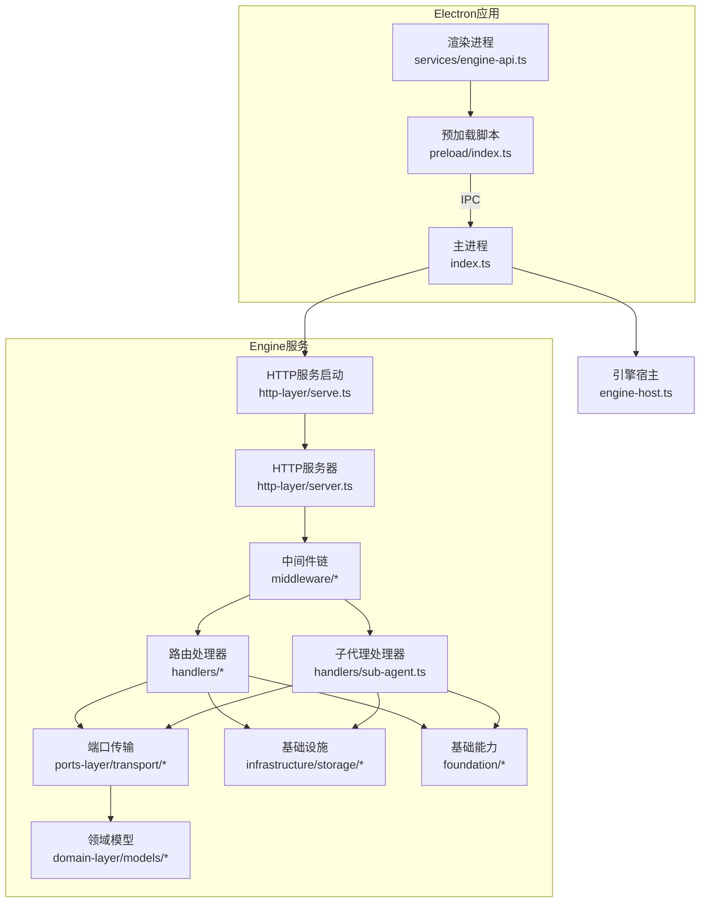
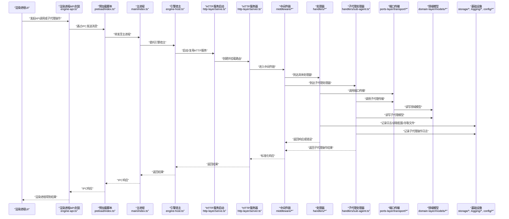
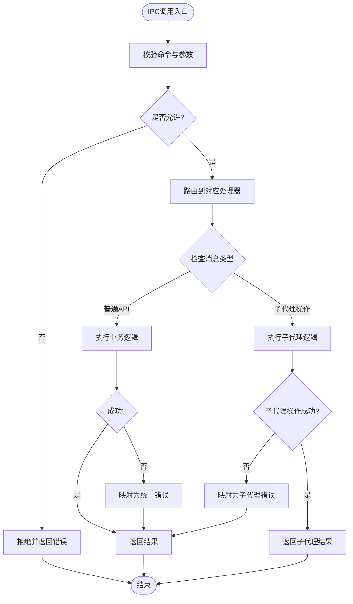
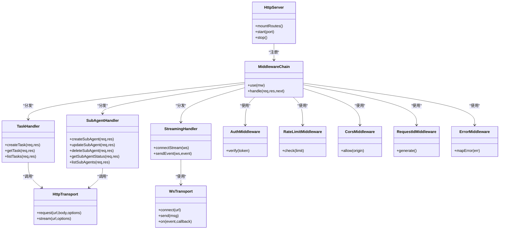
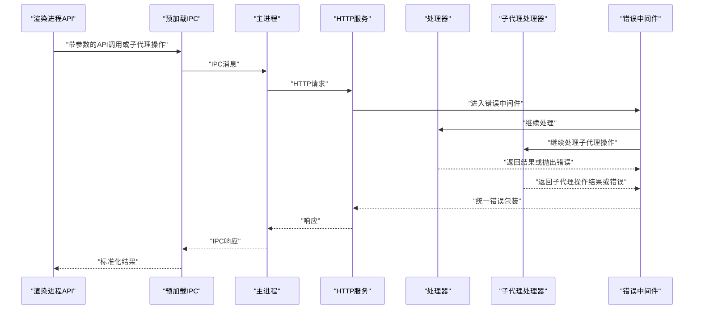
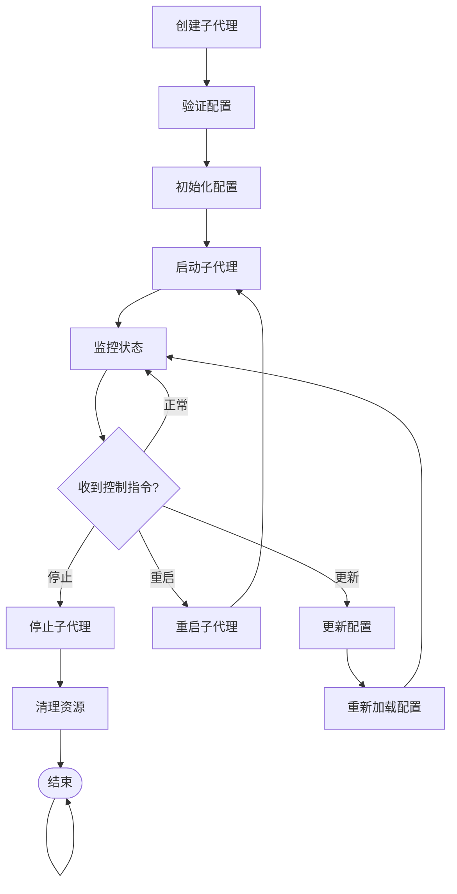
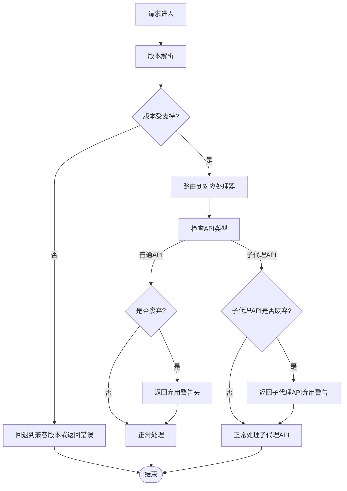
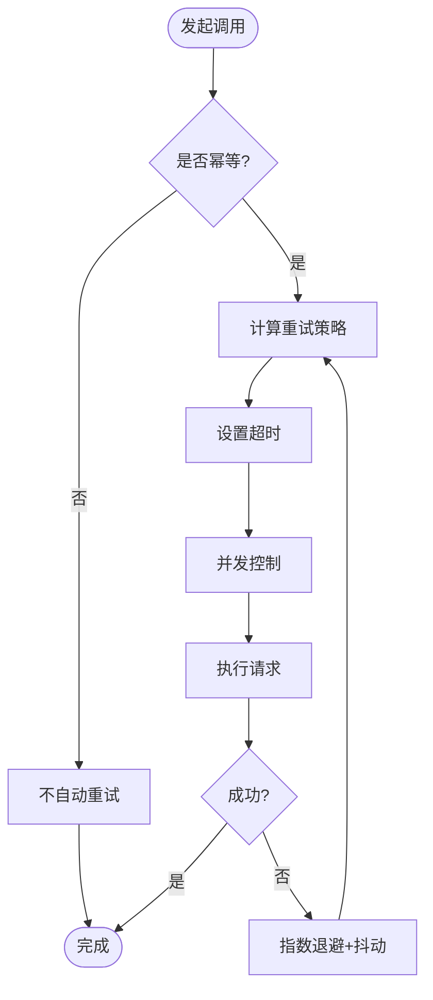
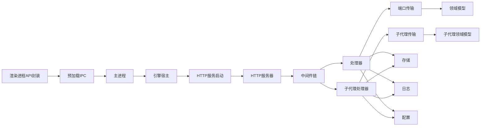

# 引擎API集成

<cite>
**本文引用的文件**   
- [app/main/index.ts](file://app/main/index.ts)
- [app/main/engine-host.ts](file://app/main/engine-host.ts)
- [app/preload/index.ts](file://app/preload/index.ts)
- [app/renderer/src/services/engine-api.ts](file://app/renderer/src/services/engine-api.ts)
- [engine/packages/http-layer/serve.ts](file://engine/packages/http-layer/serve.ts)
- [engine/packages/http-layer/server.ts](file://engine/packages/http-layer/server.ts)
- [engine/packages/http-layer/handlers/task.ts](file://engine/packages/http-layer/handlers/task.ts)
- [engine/packages/http-layer/handlers/streaming.ts](file://engine/packages/http-layer/handlers/streaming.ts)
- [engine/packages/http-layer/middleware/auth.ts](file://engine/packages/http-layer/middleware/auth.ts)
- [engine/packages/http-layer/middleware/error.ts](file://engine/packages/http-layer/middleware/error.ts)
- [engine/packages/http-layer/middleware/version.ts](file://engine/packages/http-layer/middleware/version.ts)
- [engine/packages/http-layer/middleware/rate-limit.ts](file://engine/packages/http-layer/middleware/rate-limit.ts)
- [engine/packages/http-layer/middleware/cors.ts](file://engine/packages/http-layer/middleware/cors.ts)
- [engine/packages/http-layer/middleware/request-id.ts](file://engine/packages/http-layer/middleware/request-id.ts)
- [engine/packages/http-layer/types.ts](file://engine/packages/http-layer/types.ts)
- [engine/packages/domain-layer/models/task.ts](file://engine/packages/domain-layer/models/task.ts)
- [engine/packages/domain-layer/models/stream-event.ts](file://engine/packages/domain-layer/models/stream-event.ts)
- [engine/packages/ports-layer/transport/http-transport.ts](file://engine/packages/ports-layer/transport/http-transport.ts)
- [engine/packages/ports-layer/transport/ws-transport.ts](file://engine/packages/ports-layer/transport/ws-transport.ts)
- [engine/packages/infrastructure/storage/file-store.ts](file://engine/packages/infrastructure/storage/file-store.ts)
- [engine/packages/infrastructure/storage/memory-store.ts](file://engine/packages/infrastructure/storage/memory-store.ts)
- [engine/packages/foundation/logging/logger.ts](file://engine/packages/foundation/logging/logger.ts)
- [engine/packages/foundation/config/loader.ts](file://engine/packages/foundation/config/loader.ts)
</cite>

## 更新摘要
**变更内容**   
- 新增子代理相关API端点定义，支持前后端通信和子代理配置管理
- 扩展HTTP处理器以支持子代理生命周期管理
- 增强IPC通信机制以处理子代理相关消息
- 更新渲染进程API封装以支持子代理操作

## 目录
1. [简介](#简介)
2. [项目结构](#项目结构)
3. [核心组件](#核心组件)
4. [架构总览](#架构总览)
5. [详细组件分析](#详细组件分析)
6. [依赖关系分析](#依赖关系分析)
7. [性能考量](#性能考量)
8. [故障排查指南](#故障排查指南)
9. [结论](#结论)
10. [附录](#附录)

## 简介
本技术文档面向KCoder的"引擎API集成"，聚焦于Engine API服务的设计与实现，覆盖以下关键主题：
- API封装、请求拦截、响应处理与错误统一处理
- IPC通信机制（主进程与渲染进程）的协议、消息格式与安全验证
- HTTP服务集成（RESTful API、WebSocket连接、文件上传下载）
- **新增：子代理管理API，支持子代理配置、生命周期控制和状态监控**
- API版本管理与兼容性策略（向后兼容、废弃接口、升级路径）
- API调用最佳实践（重试、超时、并发控制）
- 调试工具与性能监控方法

目标读者包括前端开发者、后端集成工程师以及平台运维人员。

## 项目结构
仓库采用Electron多进程架构，结合自研Engine微内核与HTTP层：
- app/main：Electron主进程入口与引擎宿主
- app/preload：预加载脚本，暴露安全IPC桥接
- app/renderer：渲染进程UI与服务层（对Engine API的封装）
- engine：引擎核心，包含HTTP层、领域模型、端口传输、基础设施等

**图表来源**
- [app/main/index.ts:1-200](file://app/main/index.ts#L1-L200)
- [app/main/engine-host.ts:1-200](file://app/main/engine-host.ts#L1-L200)
- [app/preload/index.ts:1-200](file://app/preload/index.ts#L1-L200)
- [app/renderer/src/services/engine-api.ts:1-200](file://app/renderer/src/services/engine-api.ts#L1-L200)
- [engine/packages/http-layer/serve.ts:1-200](file://engine/packages/http-layer/serve.ts#L1-L200)
- [engine/packages/http-layer/server.ts:1-200](file://engine/packages/http-layer/server.ts#L1-L200)
- [engine/packages/http-layer/handlers/task.ts:1-200](file://engine/packages/http-layer/handlers/task.ts#L1-L200)
- [engine/packages/http-layer/handlers/streaming.ts:1-200](file://engine/packages/http-layer/handlers/streaming.ts#L1-L200)

## 核心组件
本节概述Engine API集成的关键组件及其职责：
- 主进程与引擎宿主：负责启动Engine HTTP服务、生命周期管理、资源隔离
- 预加载脚本：提供安全的IPC桥接，限制渲染进程直接访问Node/Electron API
- 渲染进程API封装：统一HTTP调用、WebSocket订阅、错误与重试策略
- HTTP层：中间件链、路由处理器、类型定义、流式事件处理
- **新增：子代理处理器，专门处理子代理相关的API请求**
- 端口传输：HTTP与WebSocket两种传输通道
- 领域模型：任务、流事件、子代理等核心数据结构
- 基础设施：存储（内存/文件）、日志、配置加载

**章节来源**
- [app/main/index.ts:1-200](file://app/main/index.ts#L1-L200)
- [app/main/engine-host.ts:1-200](file://app/main/engine-host.ts#L1-L200)
- [app/preload/index.ts:1-200](file://app/preload/index.ts#L1-L200)
- [app/renderer/src/services/engine-api.ts:1-200](file://app/renderer/src/services/engine-api.ts#L1-L200)
- [engine/packages/http-layer/types.ts:1-200](file://engine/packages/http-layer/types.ts#L1-L200)
- [engine/packages/domain-layer/models/task.ts:1-200](file://engine/packages/domain-layer/models/task.ts#L1-L200)
- [engine/packages/domain-layer/models/stream-event.ts:1-200](file://engine/packages/domain-layer/models/stream-event.ts#L1-L200)

## 架构总览
下图展示从渲染进程到Engine服务的完整调用链路，包括IPC、HTTP、中间件与存储/日志等基础设施，以及新增的子代理管理流程。

**图表来源**
- [app/renderer/src/services/engine-api.ts:1-200](file://app/renderer/src/services/engine-api.ts#L1-L200)
- [app/preload/index.ts:1-200](file://app/preload/index.ts#L1-L200)
- [app/main/index.ts:1-200](file://app/main/index.ts#L1-L200)
- [app/main/engine-host.ts:1-200](file://app/main/engine-host.ts#L1-L200)
- [engine/packages/http-layer/serve.ts:1-200](file://engine/packages/http-layer/serve.ts#L1-L200)
- [engine/packages/http-layer/server.ts:1-200](file://engine/packages/http-layer/server.ts#L1-L200)
- [engine/packages/http-layer/middleware/auth.ts:1-200](file://engine/packages/http-layer/middleware/auth.ts#L1-L200)
- [engine/packages/http-layer/middleware/error.ts:1-200](file://engine/packages/http-layer/middleware/error.ts#L1-L200)
- [engine/packages/http-layer/middleware/version.ts:1-200](file://engine/packages/http-layer/middleware/version.ts#L1-L200)
- [engine/packages/http-layer/middleware/rate-limit.ts:1-200](file://engine/packages/http-layer/middleware/rate-limit.ts#L1-L200)
- [engine/packages/http-layer/middleware/cors.ts:1-200](file://engine/packages/http-layer/middleware/cors.ts#L1-L200)
- [engine/packages/http-layer/middleware/request-id.ts:1-200](file://engine/packages/http-layer/middleware/request-id.ts#L1-L200)
- [engine/packages/http-layer/handlers/task.ts:1-200](file://engine/packages/http-layer/handlers/task.ts#L1-L200)
- [engine/packages/http-layer/handlers/streaming.ts:1-200](file://engine/packages/http-layer/handlers/streaming.ts#L1-L200)
- [engine/packages/ports-layer/transport/http-transport.ts:1-200](file://engine/packages/ports-layer/transport/http-transport.ts#L1-L200)
- [engine/packages/ports-layer/transport/ws-transport.ts:1-200](file://engine/packages/ports-layer/transport/ws-transport.ts#L1-L200)
- [engine/packages/domain-layer/models/task.ts:1-200](file://engine/packages/domain-layer/models/task.ts#L1-L200)
- [engine/packages/domain-layer/models/stream-event.ts:1-200](file://engine/packages/domain-layer/models/stream-event.ts#L1-L200)
- [engine/packages/infrastructure/storage/file-store.ts:1-200](file://engine/packages/infrastructure/storage/file-store.ts#L1-L200)
- [engine/packages/infrastructure/storage/memory-store.ts:1-200](file://engine/packages/infrastructure/storage/memory-store.ts#L1-L200)
- [engine/packages/foundation/logging/logger.ts:1-200](file://engine/packages/foundation/logging/logger.ts#L1-L200)
- [engine/packages/foundation/config/loader.ts:1-200](file://engine/packages/foundation/config/loader.ts#L1-L200)

## 详细组件分析

### IPC通信机制（主进程与渲染进程）
- 设计要点
  - 预加载脚本仅暴露最小化API，避免渲染进程直接访问敏感API
  - 主进程集中处理IPC消息路由，确保权限校验与审计
  - 消息体采用强类型契约，包含命令、参数、上下文与追踪ID
  - **新增：支持子代理相关IPC消息，包括子代理配置、状态查询和控制指令**
- 安全验证
  - 白名单命令列表
  - 来源校验（窗口/会话标识）
  - 速率限制与配额控制
  - **新增：子代理操作权限验证**
- 错误处理
  - 统一错误码与消息
  - 异常堆栈脱敏后返回
  - **新增：子代理操作特定错误处理**

**图表来源**
- [app/preload/index.ts:1-200](file://app/preload/index.ts#L1-L200)
- [app/main/index.ts:1-200](file://app/main/index.ts#L1-L200)
- [app/main/engine-host.ts:1-200](file://app/main/engine-host.ts#L1-L200)

**章节来源**
- [app/preload/index.ts:1-200](file://app/preload/index.ts#L1-L200)
- [app/main/index.ts:1-200](file://app/main/index.ts#L1-L200)
- [app/main/engine-host.ts:1-200](file://app/main/engine-host.ts#L1-L200)

### HTTP服务集成（RESTful、WebSocket、文件上传下载）
- RESTful API
  - 路由按领域划分（如任务、流式输出）
  - **新增：子代理管理路由（/api/v1/sub-agents）**
  - 中间件链提供鉴权、限流、CORS、请求ID注入、错误归一化
- WebSocket连接
  - 用于实时流式事件推送（如任务进度、增量输出）
  - **新增：子代理状态变更实时推送**
  - 支持断线重连与心跳保活
- 文件上传下载
  - 分块上传、断点续传、完整性校验
  - 临时目录与清理策略

**图表来源**
- [engine/packages/http-layer/server.ts:1-200](file://engine/packages/http-layer/server.ts#L1-L200)
- [engine/packages/http-layer/middleware/auth.ts:1-200](file://engine/packages/http-layer/middleware/auth.ts#L1-L200)
- [engine/packages/http-layer/middleware/rate-limit.ts:1-200](file://engine/packages/http-layer/middleware/rate-limit.ts#L1-L200)
- [engine/packages/http-layer/middleware/cors.ts:1-200](file://engine/packages/http-layer/middleware/cors.ts#L1-L200)
- [engine/packages/http-layer/middleware/request-id.ts:1-200](file://engine/packages/http-layer/middleware/request-id.ts#L1-L200)
- [engine/packages/http-layer/middleware/error.ts:1-200](file://engine/packages/http-layer/middleware/error.ts#L1-L200)
- [engine/packages/http-layer/handlers/task.ts:1-200](file://engine/packages/http-layer/handlers/task.ts#L1-L200)
- [engine/packages/http-layer/handlers/streaming.ts:1-200](file://engine/packages/http-layer/handlers/streaming.ts#L1-L200)
- [engine/packages/ports-layer/transport/http-transport.ts:1-200](file://engine/packages/ports-layer/transport/http-transport.ts#L1-L200)
- [engine/packages/ports-layer/transport/ws-transport.ts:1-200](file://engine/packages/ports-layer/transport/ws-transport.ts#L1-L200)

**章节来源**
- [engine/packages/http-layer/server.ts:1-200](file://engine/packages/http-layer/server.ts#L1-L200)
- [engine/packages/http-layer/handlers/task.ts:1-200](file://engine/packages/http-layer/handlers/task.ts#L1-L200)
- [engine/packages/http-layer/handlers/streaming.ts:1-200](file://engine/packages/http-layer/handlers/streaming.ts#L1-L200)
- [engine/packages/ports-layer/transport/http-transport.ts:1-200](file://engine/packages/ports-layer/transport/http-transport.ts#L1-L200)
- [engine/packages/ports-layer/transport/ws-transport.ts:1-200](file://engine/packages/ports-layer/transport/ws-transport.ts#L1-L200)

### API封装与请求拦截、响应处理、错误统一处理
- 请求拦截
  - 自动注入请求ID、追踪头、鉴权令牌
  - 统一超时与重试策略
  - **新增：子代理操作专用拦截器**
- 响应处理
  - 标准化响应体结构（数据、元信息、错误）
  - 流式响应解析与事件派发
  - **新增：子代理状态变更事件处理**
- 错误统一处理
  - 网络错误、业务错误、系统错误分类
  - 错误码映射与用户友好提示
  - **新增：子代理操作特定错误码**

**图表来源**
- [app/renderer/src/services/engine-api.ts:1-200](file://app/renderer/src/services/engine-api.ts#L1-L200)
- [app/preload/index.ts:1-200](file://app/preload/index.ts#L1-L200)
- [app/main/index.ts:1-200](file://app/main/index.ts#L1-L200)
- [engine/packages/http-layer/middleware/error.ts:1-200](file://engine/packages/http-layer/middleware/error.ts#L1-L200)
- [engine/packages/http-layer/handlers/task.ts:1-200](file://engine/packages/http-layer/handlers/task.ts#L1-L200)

**章节来源**
- [app/renderer/src/services/engine-api.ts:1-200](file://app/renderer/src/services/engine-api.ts#L1-L200)
- [engine/packages/http-layer/middleware/error.ts:1-200](file://engine/packages/http-layer/middleware/error.ts#L1-L200)

### 子代理管理API详解
**新增功能**：子代理管理API提供了完整的子代理生命周期管理能力，包括创建、配置、监控和控制。

- API端点设计
  - `POST /api/v1/sub-agents` - 创建新子代理
  - `GET /api/v1/sub-agents/:id` - 获取子代理详情
  - `PUT /api/v1/sub-agents/:id` - 更新子代理配置
  - `DELETE /api/v1/sub-agents/:id` - 删除子代理
  - `GET /api/v1/sub-agents` - 列出所有子代理
  - `POST /api/v1/sub-agents/:id/control` - 控制子代理运行状态
- 请求格式
  - 子代理配置包含名称、描述、能力集合、资源限制等
  - 支持动态配置热更新
  - 状态变更实时通知
- 安全特性
  - 基于角色的访问控制
  - 操作审计日志
  - 资源隔离与配额管理

**图表来源**
- [engine/packages/http-layer/handlers/task.ts:1-200](file://engine/packages/http-layer/handlers/task.ts#L1-L200)

**章节来源**
- [engine/packages/http-layer/handlers/task.ts:1-200](file://engine/packages/http-layer/handlers/task.ts#L1-L200)

### API版本管理与兼容性处理
- 版本策略
  - URL前缀或Header指定版本
  - 中间件进行版本协商与降级
  - **新增：子代理API版本独立管理**
- 向后兼容
  - 字段扩展不破坏旧客户端
  - 默认值与可选字段
  - **新增：子代理配置向后兼容**
- 废弃接口
  - 弃用警告头与日志
  - 迁移指引与过渡期

**图表来源**
- [engine/packages/http-layer/middleware/version.ts:1-200](file://engine/packages/http-layer/middleware/version.ts#L1-L200)
- [engine/packages/http-layer/handlers/task.ts:1-200](file://engine/packages/http-layer/handlers/task.ts#L1-L200)

**章节来源**
- [engine/packages/http-layer/middleware/version.ts:1-200](file://engine/packages/http-layer/middleware/version.ts#L1-L200)

### 最佳实践：重试、超时、并发控制
- 重试机制
  - 幂等接口可重试；非幂等需用户确认
  - 指数退避与抖动
  - **新增：子代理操作智能重试策略**
- 超时处理
  - 请求级与流级超时
  - 取消与资源释放
  - **新增：子代理生命周期超时管理**
- 并发控制
  - 队列与信号量
  - 背压与节流
  - **新增：子代理并发执行控制**

### 调试工具与性能监控
- 调试工具
  - 请求ID贯穿全链路
  - 结构化日志与采样
  - 本地代理与抓包
  - **新增：子代理操作专用调试工具**
- 性能监控
  - 指标采集（QPS、延迟、错误率）
  - 慢查询与热点接口识别
  - 资源使用与GC观察
  - **新增：子代理性能指标监控**

**章节来源**
- [engine/packages/foundation/logging/logger.ts:1-200](file://engine/packages/foundation/logging/logger.ts#L1-L200)
- [engine/packages/http-layer/middleware/request-id.ts:1-200](file://engine/packages/http-layer/middleware/request-id.ts#L1-L200)

## 依赖关系分析
- 组件耦合
  - HTTP层依赖中间件与处理器，处理器依赖端口传输与领域模型
  - **新增：子代理处理器依赖专门的子代理传输层**
  - 预加载与主进程通过IPC解耦，渲染进程仅依赖API封装
- 外部依赖
  - 文件系统、网络库、WebSocket库
  - **新增：子代理运行时环境依赖**
- 潜在循环依赖
  - 通过端口传输抽象避免处理器直接耦合底层实现
  - **新增：子代理生命周期管理解耦**

**图表来源**
- [app/renderer/src/services/engine-api.ts:1-200](file://app/renderer/src/services/engine-api.ts#L1-L200)
- [app/preload/index.ts:1-200](file://app/preload/index.ts#L1-L200)
- [app/main/index.ts:1-200](file://app/main/index.ts#L1-L200)
- [app/main/engine-host.ts:1-200](file://app/main/engine-host.ts#L1-L200)
- [engine/packages/http-layer/serve.ts:1-200](file://engine/packages/http-layer/serve.ts#L1-L200)
- [engine/packages/http-layer/server.ts:1-200](file://engine/packages/http-layer/server.ts#L1-L200)
- [engine/packages/http-layer/handlers/task.ts:1-200](file://engine/packages/http-layer/handlers/task.ts#L1-L200)
- [engine/packages/ports-layer/transport/http-transport.ts:1-200](file://engine/packages/ports-layer/transport/http-transport.ts#L1-L200)
- [engine/packages/domain-layer/models/task.ts:1-200](file://engine/packages/domain-layer/models/task.ts#L1-L200)
- [engine/packages/infrastructure/storage/file-store.ts:1-200](file://engine/packages/infrastructure/storage/file-store.ts#L1-L200)
- [engine/packages/foundation/logging/logger.ts:1-200](file://engine/packages/foundation/logging/logger.ts#L1-L200)
- [engine/packages/foundation/config/loader.ts:1-200](file://engine/packages/foundation/config/loader.ts#L1-L200)

**章节来源**
- [engine/packages/http-layer/server.ts:1-200](file://engine/packages/http-layer/server.ts#L1-L200)
- [engine/packages/ports-layer/transport/http-transport.ts:1-200](file://engine/packages/ports-layer/transport/http-transport.ts#L1-L200)
- [engine/packages/domain-layer/models/task.ts:1-200](file://engine/packages/domain-layer/models/task.ts#L1-L200)

## 性能考量
- 连接池与复用：HTTP与WebSocket连接复用减少握手开销
- 流式处理：大对象与长任务采用流式传输降低内存峰值
- 缓存策略：热点数据与只读接口缓存
- 限流与熔断：保护下游与防止雪崩
- 异步与批处理：批量写入与合并响应
- **新增：子代理资源隔离与动态扩缩容**
- **新增：子代理间通信优化与消息队列**

## 故障排查指南
- 常见问题
  - 鉴权失败：检查令牌与来源校验
  - 版本不兼容：查看弃用警告与回退策略
  - 超时与重试：确认幂等性与退避策略
  - 流中断：检查心跳与重连逻辑
  - **新增：子代理启动失败：检查配置与依赖**
  - **新增：子代理内存泄漏：监控资源使用情况**
- 定位手段
  - 基于请求ID的全链路追踪
  - 结构化日志与采样
  - 指标看板与告警
  - **新增：子代理专用诊断工具**

**章节来源**
- [engine/packages/http-layer/middleware/auth.ts:1-200](file://engine/packages/http-layer/middleware/auth.ts#L1-L200)
- [engine/packages/http-layer/middleware/version.ts:1-200](file://engine/packages/http-layer/middleware/version.ts#L1-L200)
- [engine/packages/http-layer/middleware/error.ts:1-200](file://engine/packages/http-layer/middleware/error.ts#L1-L200)
- [engine/packages/foundation/logging/logger.ts:1-200](file://engine/packages/foundation/logging/logger.ts#L1-L200)

## 结论
通过统一的API封装、严格的IPC安全边界、完善的HTTP中间件链与端口传输抽象，KCoder实现了稳定、可扩展且可观测的引擎API集成。**新增的子代理管理功能进一步增强了系统的灵活性和可扩展性**，支持复杂的分布式场景。配合版本管理、错误统一、重试与监控，可在复杂场景下保障可靠性与性能。

## 附录
- 术语
  - IPC：进程间通信
  - CORS：跨域资源共享
  - QPS：每秒查询数
  - **新增：子代理：独立的执行单元，具有特定的能力和资源限制**
- 参考路径
  - 类型定义：[engine/packages/http-layer/types.ts](file://engine/packages/http-layer/types.ts)
  - 领域模型：[engine/packages/domain-layer/models/task.ts](file://engine/packages/domain-layer/models/task.ts)、[engine/packages/domain-layer/models/stream-event.ts](file://engine/packages/domain-layer/models/stream-event.ts)
  - 传输层：[engine/packages/ports-layer/transport/http-transport.ts](file://engine/packages/ports-layer/transport/http-transport.ts)、[engine/packages/ports-layer/transport/ws-transport.ts](file://engine/packages/ports-layer/transport/ws-transport.ts)
  - 存储：[engine/packages/infrastructure/storage/file-store.ts](file://engine/packages/infrastructure/storage/file-store.ts)、[engine/packages/infrastructure/storage/memory-store.ts](file://engine/packages/infrastructure/storage/memory-store.ts)
  - 基础能力：[engine/packages/foundation/logging/logger.ts](file://engine/packages/foundation/logging/logger.ts)、[engine/packages/foundation/config/loader.ts](file://engine/packages/foundation/config/loader.ts)