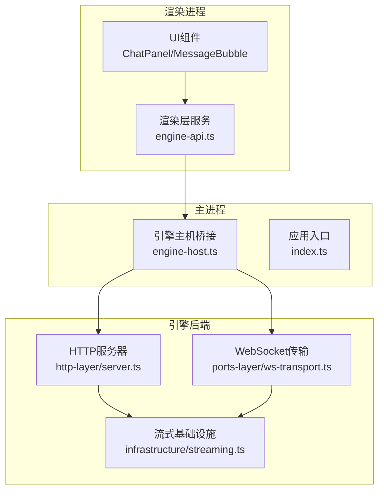
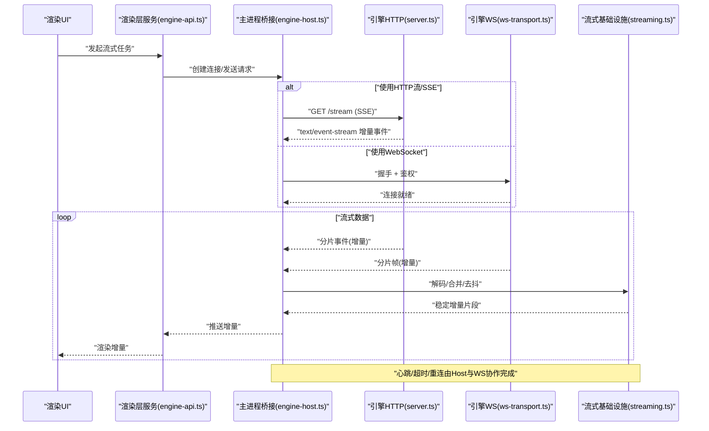
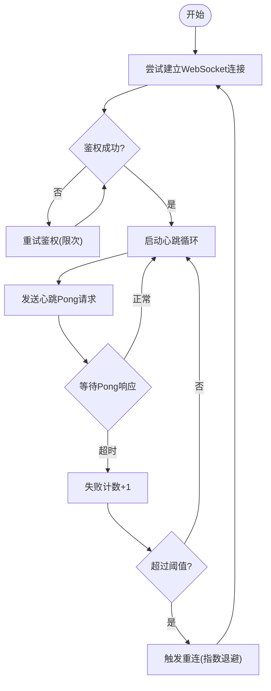
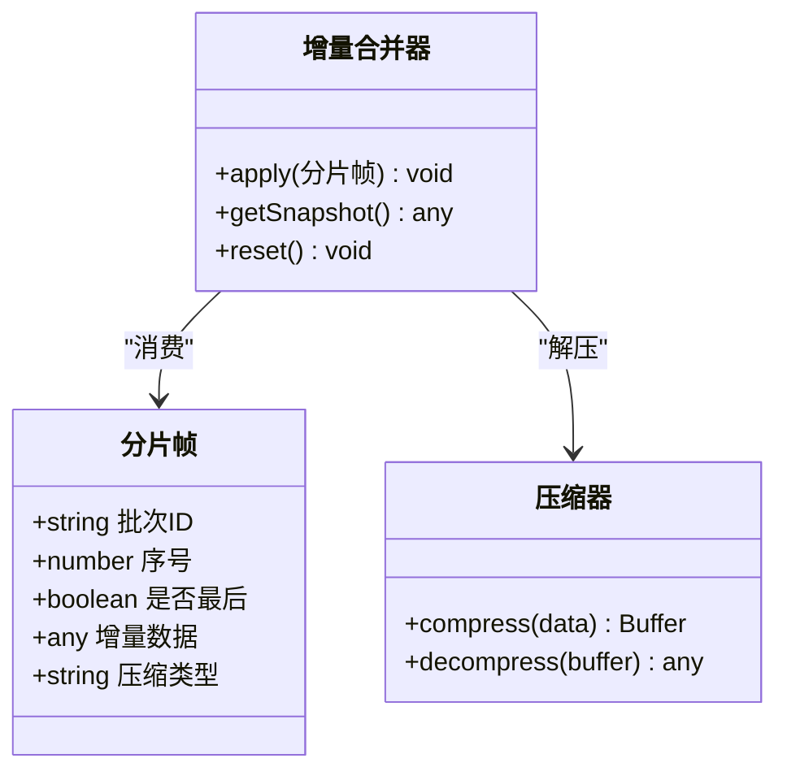
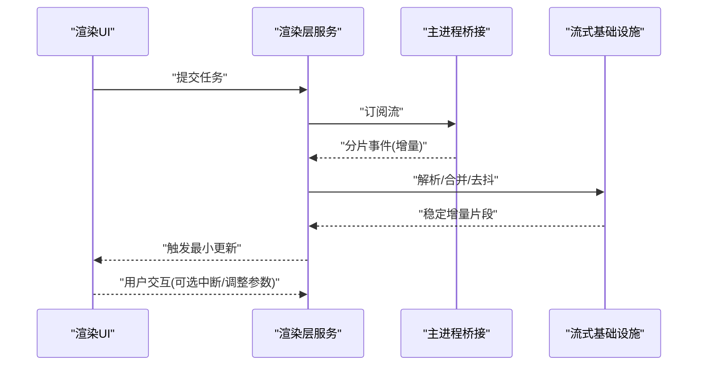
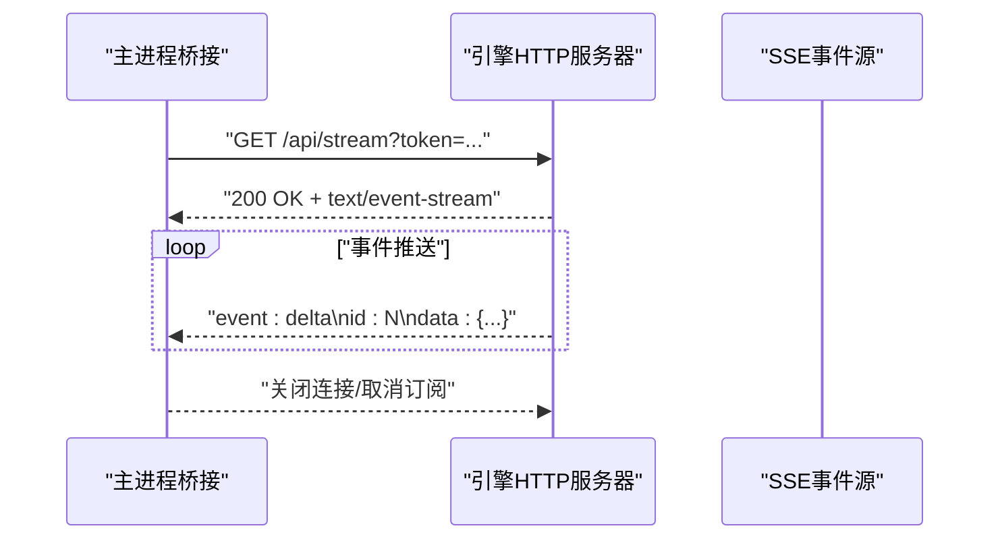
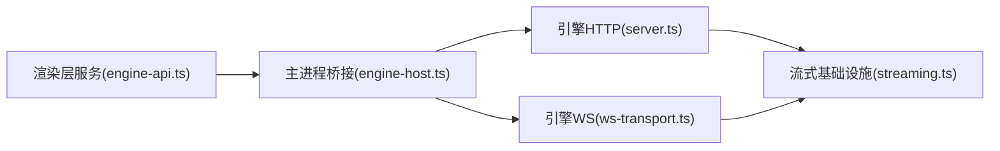

# 流式响应实现

<cite>
**本文引用的文件**   
- [app/main/engine-host.ts](file://app/main/engine-host.ts)
- [app/main/index.ts](file://app/main/index.ts)
- [app/renderer/src/services/engine-api.ts](file://app/renderer/src/services/engine-api.ts)
- [engine/packages/http-layer/src/server.ts](file://engine/packages/http-layer/src/server.ts)
- [engine/packages/ports-layer/src/ws-transport.ts](file://engine/packages/ports-layer/src/ws-transport.ts)
- [engine/packages/infrastructure/src/streaming.ts](file://engine/packages/infrastructure/src/streaming.ts)
</cite>

## 目录
1. [简介](#简介)
2. [项目结构](#项目结构)
3. [核心组件](#核心组件)
4. [架构总览](#架构总览)
5. [详细组件分析](#详细组件分析)
6. [依赖关系分析](#依赖关系分析)
7. [性能考量](#性能考量)
8. [故障排查指南](#故障排查指南)
9. [结论](#结论)
10. [附录](#附录)

## 简介
本文件面向KCoder的“流式响应”能力，系统性阐述从渲染层到引擎后端的完整链路：WebSocket连接管理（建立、心跳、断线重连、错误处理）、实时数据传输协议（消息分片、增量更新、压缩与传输优化）、客户端实现（接收、解析、渲染、缓存策略），以及与引擎后端的集成方式（HTTP流式接口、SSE支持）。同时提供性能监控与调试方法、网络异常处理与用户体验优化策略。

## 项目结构
KCoder采用Electron多进程架构：主进程负责与引擎后端通信，渲染进程通过服务层发起请求并消费流式数据；引擎侧提供HTTP与WebSocket/SSE等传输能力。

图表来源
- [app/main/engine-host.ts](file://app/main/engine-host.ts)
- [app/main/index.ts](file://app/main/index.ts)
- [app/renderer/src/services/engine-api.ts](file://app/renderer/src/services/engine-api.ts)
- [engine/packages/http-layer/src/server.ts](file://engine/packages/http-layer/src/server.ts)
- [engine/packages/ports-layer/src/ws-transport.ts](file://engine/packages/ports-layer/src/ws-transport.ts)
- [engine/packages/infrastructure/src/streaming.ts](file://engine/packages/infrastructure/src/streaming.ts)

章节来源
- [app/main/index.ts](file://app/main/index.ts)
- [app/main/engine-host.ts](file://app/main/engine-host.ts)
- [app/renderer/src/services/engine-api.ts](file://app/renderer/src/services/engine-api.ts)
- [engine/packages/http-layer/src/server.ts](file://engine/packages/http-layer/src/server.ts)
- [engine/packages/ports-layer/src/ws-transport.ts](file://engine/packages/ports-layer/src/ws-transport.ts)
- [engine/packages/infrastructure/src/streaming.ts](file://engine/packages/infrastructure/src/streaming.ts)

## 核心组件
- 渲染层服务（engine-api.ts）：封装对主进程的调用，统一暴露流式API（如发送任务、订阅增量结果、取消任务）。
- 主进程桥接（engine-host.ts）：维护与引擎后端的长连接（HTTP流或WebSocket），转发消息、处理心跳与重连。
- 引擎HTTP服务器（server.ts）：提供HTTP流式接口与SSE端点，承载任务调度与事件推送。
- WebSocket传输（ws-transport.ts）：实现双向通道、心跳检测、断线重连、消息分片与合并。
- 流式基础设施（streaming.ts）：定义流式协议、增量更新模型、压缩策略与背压控制。

章节来源
- [app/renderer/src/services/engine-api.ts](file://app/renderer/src/services/engine-api.ts)
- [app/main/engine-host.ts](file://app/main/engine-host.ts)
- [engine/packages/http-layer/src/server.ts](file://engine/packages/http-layer/src/server.ts)
- [engine/packages/ports-layer/src/ws-transport.ts](file://engine/packages/ports-layer/src/ws-transport.ts)
- [engine/packages/infrastructure/src/streaming.ts](file://engine/packages/infrastructure/src/streaming.ts)

## 架构总览
整体采用“渲染层→主进程→引擎后端”的分层设计，流式数据在两端以分片形式传输，结合心跳与重连保障稳定性，并通过压缩与增量更新降低带宽占用。

图表来源
- [app/renderer/src/services/engine-api.ts](file://app/renderer/src/services/engine-api.ts)
- [app/main/engine-host.ts](file://app/main/engine-host.ts)
- [engine/packages/http-layer/src/server.ts](file://engine/packages/http-layer/src/server.ts)
- [engine/packages/ports-layer/src/ws-transport.ts](file://engine/packages/ports-layer/src/ws-transport.ts)
- [engine/packages/infrastructure/src/streaming.ts](file://engine/packages/infrastructure/src/streaming.ts)

## 详细组件分析

### 组件A：WebSocket连接管理（建立、心跳、断线重连、错误处理）
- 连接建立
  - 渲染层通过服务层发起请求，主进程根据配置选择HTTP流或WebSocket。
  - WebSocket握手阶段携带会话标识与鉴权信息，成功后进入空闲监听。
- 心跳检测
  - 客户端周期性发送心跳帧，服务端回显；若连续N次未收到响应则判定为异常。
- 断线重连
  - 指数退避策略：初始间隔、最大间隔、抖动因子可配置；重连前清理未完成的分片缓冲。
- 错误处理
  - 区分网络错误、协议错误、业务错误；记录上下文（会话ID、时间戳、错误码）以便追踪。

图表来源
- [app/main/engine-host.ts](file://app/main/engine-host.ts)
- [engine/packages/ports-layer/src/ws-transport.ts](file://engine/packages/ports-layer/src/ws-transport.ts)

章节来源
- [app/main/engine-host.ts](file://app/main/engine-host.ts)
- [engine/packages/ports-layer/src/ws-transport.ts](file://engine/packages/ports-layer/src/ws-transport.ts)

### 组件B：实时数据传输协议（消息分片、增量更新、压缩、传输优化）
- 消息分片
  - 将大对象拆分为有序片段，附带序列号与批次ID，便于乱序到达时的重组。
- 增量更新
  - 每个事件仅包含差异字段，客户端基于本地状态进行Patch合并，避免全量覆盖。
- 数据压缩
  - 对文本型增量内容启用轻量压缩（如gzip/deflate），在CPU与带宽之间权衡。
- 传输优化
  - 背压控制：当接收端处理慢时，暂停上游推送；节流与去抖：合并短时间内的多次增量。

图表来源
- [engine/packages/infrastructure/src/streaming.ts](file://engine/packages/infrastructure/src/streaming.ts)
- [engine/packages/ports-layer/src/ws-transport.ts](file://engine/packages/ports-layer/src/ws-transport.ts)

章节来源
- [engine/packages/infrastructure/src/streaming.ts](file://engine/packages/infrastructure/src/streaming.ts)
- [engine/packages/ports-layer/src/ws-transport.ts](file://engine/packages/ports-layer/src/ws-transport.ts)

### 组件C：流式响应的客户端实现（接收、解析、渲染、缓存策略）
- 数据接收
  - 渲染层服务统一接入主进程桥接，屏蔽底层传输差异（HTTP流/SSE vs WebSocket）。
- 解析与合并
  - 按批次ID与序号重组分片，执行增量Patch，生成稳定的中间态快照。
- 渲染
  - 将增量片段映射到UI组件的最小更新单元，避免整页重绘。
- 缓存策略
  - 内存中维护最近N个快照与增量日志；必要时持久化关键状态用于恢复。

图表来源
- [app/renderer/src/services/engine-api.ts](file://app/renderer/src/services/engine-api.ts)
- [app/main/engine-host.ts](file://app/main/engine-host.ts)
- [engine/packages/infrastructure/src/streaming.ts](file://engine/packages/infrastructure/src/streaming.ts)

章节来源
- [app/renderer/src/services/engine-api.ts](file://app/renderer/src/services/engine-api.ts)
- [app/main/engine-host.ts](file://app/main/engine-host.ts)
- [engine/packages/infrastructure/src/streaming.ts](file://engine/packages/infrastructure/src/streaming.ts)

### 组件D：与引擎后端的集成（HTTP流式接口、SSE支持）
- HTTP流式接口
  - 提供RESTful端点，返回持续的事件流；适用于浏览器环境或受限网络。
- SSE支持
  - 遵循Server-Sent Events规范，自动重连与事件ID机制简化客户端实现。
- 路由与鉴权
  - 统一鉴权中间件校验令牌与会话，路由分发至具体处理器。

图表来源
- [engine/packages/http-layer/src/server.ts](file://engine/packages/http-layer/src/server.ts)

章节来源
- [engine/packages/http-layer/src/server.ts](file://engine/packages/http-layer/src/server.ts)

## 依赖关系分析
- 耦合与内聚
  - 渲染层服务与主进程桥接解耦于具体传输协议；桥接层对HTTP与WS抽象一致。
  - 引擎侧HTTP与WS共享流式基础设施，保证协议一致性。
- 外部依赖
  - 网络库（HTTP/SSE、WebSocket）、压缩库、事件总线。
- 潜在循环依赖
  - 通过分层与接口隔离避免循环引用；所有跨层调用均经明确接口。

图表来源
- [app/renderer/src/services/engine-api.ts](file://app/renderer/src/services/engine-api.ts)
- [app/main/engine-host.ts](file://app/main/engine-host.ts)
- [engine/packages/http-layer/src/server.ts](file://engine/packages/http-layer/src/server.ts)
- [engine/packages/ports-layer/src/ws-transport.ts](file://engine/packages/ports-layer/src/ws-transport.ts)
- [engine/packages/infrastructure/src/streaming.ts](file://engine/packages/infrastructure/src/streaming.ts)

章节来源
- [app/renderer/src/services/engine-api.ts](file://app/renderer/src/services/engine-api.ts)
- [app/main/engine-host.ts](file://app/main/engine-host.ts)
- [engine/packages/http-layer/src/server.ts](file://engine/packages/http-layer/src/server.ts)
- [engine/packages/ports-layer/src/ws-transport.ts](file://engine/packages/ports-layer/src/ws-transport.ts)
- [engine/packages/infrastructure/src/streaming.ts](file://engine/packages/infrastructure/src/streaming.ts)

## 性能考量
- 带宽优化
  - 优先使用增量更新与压缩；对热点字段做差分编码。
- CPU与内存
  - 合理设置分片大小与合并窗口，避免频繁GC；限制快照数量与日志长度。
- 背压与节流
  - 接收端处理慢时主动暂停上游；UI渲染采用批处理与防抖。
- 连接复用
  - 复用WebSocket连接，减少握手开销；HTTP流按需创建与释放。

[本节为通用指导，不直接分析具体文件]

## 故障排查指南
- 常见问题定位
  - 连接失败：检查鉴权、端口与防火墙；查看握手日志与错误码。
  - 心跳超时：确认服务端存活与网络延迟；调整心跳间隔与阈值。
  - 数据错乱：核对批次ID与序号；检查分片重组逻辑与压缩/解压一致性。
  - 渲染卡顿：观察增量合并频率与UI更新粒度；增大批处理窗口。
- 监控与调试
  - 启用详细日志（连接状态、事件统计、错误堆栈）。
  - 导出最近N条增量日志与快照摘要，便于复现问题。
  - 使用网络抓包工具验证SSE/WS帧结构与时序。

章节来源
- [app/main/engine-host.ts](file://app/main/engine-host.ts)
- [engine/packages/ports-layer/src/ws-transport.ts](file://engine/packages/ports-layer/src/ws-transport.ts)
- [engine/packages/infrastructure/src/streaming.ts](file://engine/packages/infrastructure/src/streaming.ts)

## 结论
KCoder的流式响应通过分层设计与协议抽象，实现了高可用、低延迟的实时交互体验。WebSocket与HTTP流/SSE双通道适配不同场景，配合分片、增量、压缩与背压控制，兼顾性能与稳定性。完善的错误处理与监控手段有助于快速定位与修复问题，提升用户体验。

[本节为总结性内容，不直接分析具体文件]

## 附录
- 术语
  - 分片：将大数据切分为有序片段，便于可靠传输与重组。
  - 增量更新：仅传输变化部分，客户端合并到本地状态。
  - 背压：下游处理能力不足时，上游主动降速或暂停。
- 最佳实践
  - 小步快跑：保持增量片段小而频，利于即时反馈。
  - 幂等设计：允许重复事件安全合并。
  - 优雅降级：在网络不佳时切换至HTTP流/SSE或降低刷新频率。

[本节为概念性说明，不直接分析具体文件]