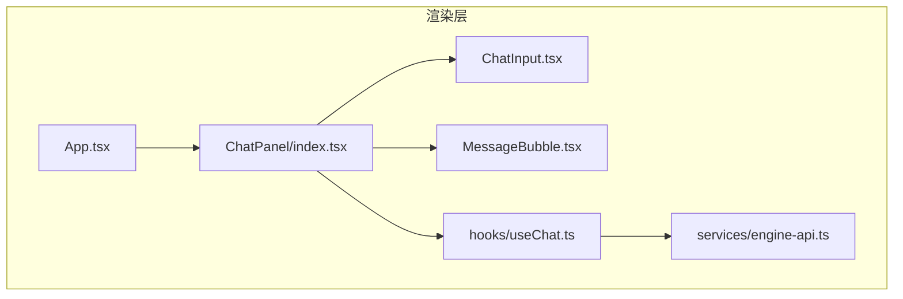
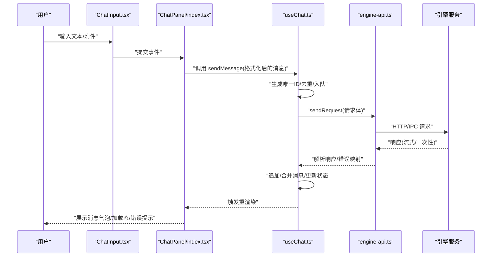
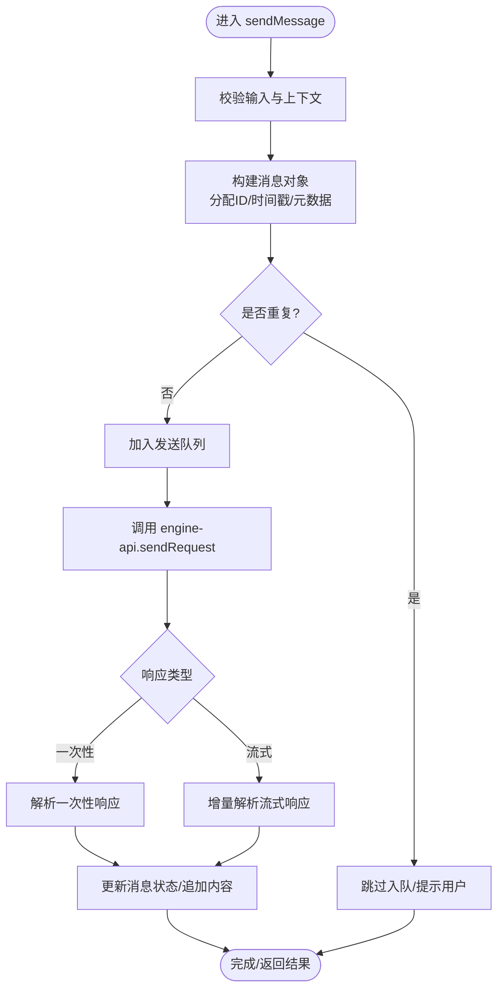
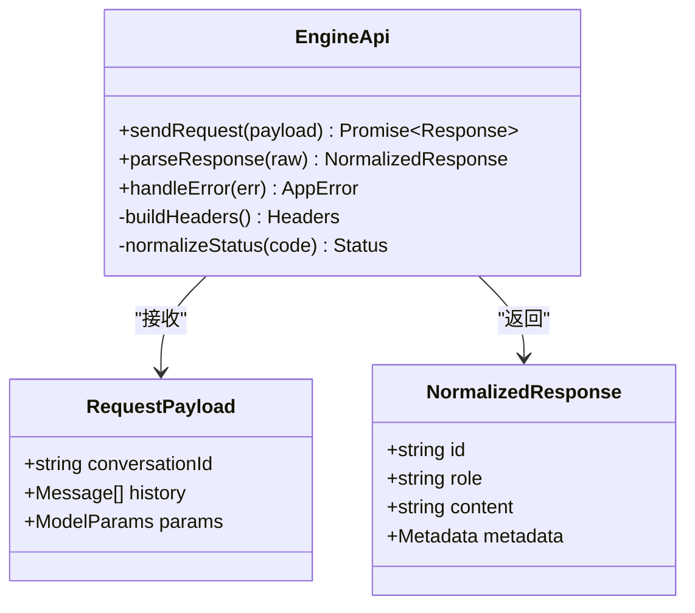
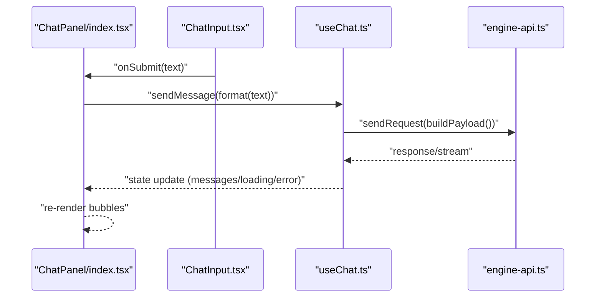
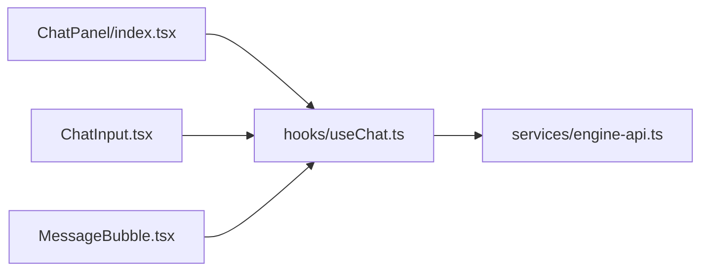

# 消息处理流程

<cite>
**本文引用的文件**   
- [useChat.ts](file://app/renderer/src/hooks/useChat.ts)
- [engine-api.ts](file://app/renderer/src/services/engine-api.ts)
- [App.tsx](file://app/renderer/src/App.tsx)
- [index.tsx](file://app/renderer/src/components/ChatPanel/index.tsx)
- [ChatInput.tsx](file://app/renderer/src/components/ChatPanel/ChatInput.tsx)
- [MessageBubble.tsx](file://app/renderer/src/components/ChatPanel/MessageBubble.tsx)
</cite>

## 目录
1. [简介](#简介)
2. [项目结构](#项目结构)
3. [核心组件](#核心组件)
4. [架构总览](#架构总览)
5. [详细组件分析](#详细组件分析)
6. [依赖关系分析](#依赖关系分析)
7. [性能考虑](#性能考虑)
8. [故障排查指南](#故障排查指南)
9. [结论](#结论)
10. [附录](#附录)

## 简介
本技术文档聚焦于KCoder前端渲染层中的消息处理流程，围绕 useChat 钩子展开，系统阐述从用户输入到AI响应的完整数据流、消息状态管理、异步与错误恢复机制、消息生命周期（发送、接收、存储、显示）、以及去重、排序、过滤等高级能力。同时给出性能优化策略、内存管理最佳实践与调试排障建议，帮助读者快速定位问题并提升稳定性与体验。

## 项目结构
本次文档关注渲染层中与聊天消息相关的模块：
- hooks/useChat.ts：封装消息状态与交互逻辑的核心钩子
- services/engine-api.ts：与引擎服务通信的HTTP/IPC接口封装
- components/ChatPanel/*：消息面板相关UI组件（输入、气泡、容器）
- App.tsx：应用入口，挂载聊天面板

图表来源
- [App.tsx](file://app/renderer/src/App.tsx)
- [index.tsx](file://app/renderer/src/components/ChatPanel/index.tsx)
- [ChatInput.tsx](file://app/renderer/src/components/ChatPanel/ChatInput.tsx)
- [MessageBubble.tsx](file://app/renderer/src/components/ChatPanel/MessageBubble.tsx)
- [useChat.ts](file://app/renderer/src/hooks/useChat.ts)
- [engine-api.ts](file://app/renderer/src/services/engine-api.ts)

章节来源
- [App.tsx](file://app/renderer/src/App.tsx)
- [index.tsx](file://app/renderer/src/components/ChatPanel/index.tsx)
- [ChatInput.tsx](file://app/renderer/src/components/ChatPanel/ChatInput.tsx)
- [MessageBubble.tsx](file://app/renderer/src/components/ChatPanel/MessageBubble.tsx)
- [useChat.ts](file://app/renderer/src/hooks/useChat.ts)
- [engine-api.ts](file://app/renderer/src/services/engine-api.ts)

## 核心组件
- useChat 钩子
  - 职责：维护消息列表、加载态、错误态；提供发送、重试、清空等操作；协调请求构建与响应解析；实现消息去重、排序、过滤等高级功能。
  - 关键状态：messages、loading、error、filters、searchText 等。
  - 关键方法：sendMessage、retryLast、clearMessages、setFilters、setSearchText 等。
- engine-api 服务
  - 职责：封装与后端引擎的通信细节（URL、超时、重试、鉴权、错误映射）。
  - 关键方法：sendRequest、parseResponse、handleError 等。
- ChatPanel 组件族
  - ChatPanel/index.tsx：组合输入、消息列表与滚动区域，订阅 useChat 状态。
  - ChatInput.tsx：负责用户输入收集与触发发送。
  - MessageBubble.tsx：渲染单条消息，支持复制、折叠、代码块高亮等。

章节来源
- [useChat.ts](file://app/renderer/src/hooks/useChat.ts)
- [engine-api.ts](file://app/renderer/src/services/engine-api.ts)
- [index.tsx](file://app/renderer/src/components/ChatPanel/index.tsx)
- [ChatInput.tsx](file://app/renderer/src/components/ChatPanel/ChatInput.tsx)
- [MessageBubble.tsx](file://app/renderer/src/components/ChatPanel/MessageBubble.tsx)

## 架构总览
下图展示了从用户输入到AI响应的端到端流程，包括消息格式化、请求构建、网络传输、响应解析、状态更新与UI渲染。

图表来源
- [ChatInput.tsx](file://app/renderer/src/components/ChatPanel/ChatInput.tsx)
- [index.tsx](file://app/renderer/src/components/ChatPanel/index.tsx)
- [useChat.ts](file://app/renderer/src/hooks/useChat.ts)
- [engine-api.ts](file://app/renderer/src/services/engine-api.ts)

## 详细组件分析

### useChat 钩子实现原理
- 消息状态管理
  - 使用本地状态保存 messages 数组，每条消息包含 id、role、content、status、createdAt、updatedAt、metadata 等字段。
  - 通过 loading/error 控制全局加载与错误提示。
  - 提供 filters/searchText 以支持按角色、时间、关键词筛选。
- 异步操作处理
  - sendMessage 内部执行：
    - 校验输入、构造消息对象、分配唯一ID、插入待发送队列。
    - 调用 engine-api.sendRequest 发起请求。
    - 根据响应类型（一次性或流式）增量更新消息内容。
    - 最终将消息状态置为成功或失败。
  - 对网络异常、超时、服务端错误进行统一捕获与降级。
- 错误恢复机制
  - 自动重试：对可重试错误（如网络抖动、限流）采用指数退避重试。
  - 局部失败：仅标记对应消息为失败，不影响其他消息。
  - 用户手动重试：提供 retryLast 或针对单条消息的重试入口。
  - 持久化兜底：在崩溃或刷新后尝试恢复未完成的会话（若启用）。
- 消息去重、排序、过滤
  - 去重：基于 content hash 或业务ID去重，避免重复发送。
  - 排序：默认按创建时间升序，支持按更新时间倒序。
  - 过滤：按角色（user/assistant/system）、关键词搜索、时间范围筛选。
- 性能与内存
  - 虚拟滚动：长列表场景下按需渲染可见区域。
  - 增量更新：流式响应时仅更新变更片段，减少重渲染。
  - 防抖/节流：输入框与搜索框防抖，降低频繁状态更新。
  - 大对象裁剪：截断超长内容或延迟加载附件预览。

图表来源
- [useChat.ts](file://app/renderer/src/hooks/useChat.ts)
- [engine-api.ts](file://app/renderer/src/services/engine-api.ts)

章节来源
- [useChat.ts](file://app/renderer/src/hooks/useChat.ts)

### engine-api 服务
- 请求构建
  - 统一组装请求头（鉴权、追踪ID、版本信息）。
  - 序列化请求体（含消息历史、工具调用上下文、模型参数）。
- 网络传输
  - 支持超时控制、取消令牌（AbortController）。
  - 可选重试策略（幂等性判断、退避算法）。
- 响应解析
  - 区分一次性JSON与SSE/流式分片。
  - 标准化响应结构，映射为前端消息模型。
- 错误处理
  - 网络错误、超时、HTTP状态码、业务错误码的统一映射。
  - 抛出结构化错误对象，便于上层恢复与提示。

图表来源
- [engine-api.ts](file://app/renderer/src/services/engine-api.ts)

章节来源
- [engine-api.ts](file://app/renderer/src/services/engine-api.ts)

### ChatPanel 组件族
- ChatPanel/index.tsx
  - 订阅 useChat 的状态与方法，渲染消息列表与输入区。
  - 处理滚动到底部、新消息到达时的自动滚动。
  - 暴露 clearMessages、setFilters 等方法给外部。
- ChatInput.tsx
  - 管理本地输入状态，支持多行输入、快捷键发送。
  - 触发 onSubmit 回调，将格式化后的内容交给 useChat.sendMessage。
- MessageBubble.tsx
  - 根据消息角色渲染不同样式。
  - 支持代码块高亮、链接点击、复制文本、折叠长内容。
  - 在失败状态下显示重试按钮与错误摘要。

图表来源
- [index.tsx](file://app/renderer/src/components/ChatPanel/index.tsx)
- [ChatInput.tsx](file://app/renderer/src/components/ChatPanel/ChatInput.tsx)
- [useChat.ts](file://app/renderer/src/hooks/useChat.ts)
- [engine-api.ts](file://app/renderer/src/services/engine-api.ts)

章节来源
- [index.tsx](file://app/renderer/src/components/ChatPanel/index.tsx)
- [ChatInput.tsx](file://app/renderer/src/components/ChatPanel/ChatInput.tsx)
- [MessageBubble.tsx](file://app/renderer/src/components/ChatPanel/MessageBubble.tsx)

## 依赖关系分析
- 组件耦合
  - ChatPanel 强依赖 useChat 提供的状态与方法。
  - useChat 依赖 engine-api 进行网络通信。
  - ChatInput 与 MessageBubble 为纯展示与交互组件，低耦合。
- 外部依赖
  - HTTP/IPC 客户端库（由 engine-api 封装）。
  - 可能的流式解析库（SSE/ReadableStream）。
  - 可选的持久化存储（IndexedDB/LocalStorage）用于会话恢复。

图表来源
- [index.tsx](file://app/renderer/src/components/ChatPanel/index.tsx)
- [ChatInput.tsx](file://app/renderer/src/components/ChatPanel/ChatInput.tsx)
- [MessageBubble.tsx](file://app/renderer/src/components/ChatPanel/MessageBubble.tsx)
- [useChat.ts](file://app/renderer/src/hooks/useChat.ts)
- [engine-api.ts](file://app/renderer/src/services/engine-api.ts)

章节来源
- [index.tsx](file://app/renderer/src/components/ChatPanel/index.tsx)
- [ChatInput.tsx](file://app/renderer/src/components/ChatPanel/ChatInput.tsx)
- [MessageBubble.tsx](file://app/renderer/src/components/ChatPanel/MessageBubble.tsx)
- [useChat.ts](file://app/renderer/src/hooks/useChat.ts)
- [engine-api.ts](file://app/renderer/src/services/engine-api.ts)

## 性能考虑
- 列表渲染
  - 使用虚拟滚动或分页加载，避免一次性渲染大量消息。
  - 对长文本进行截断与懒加载，减少DOM节点数量。
- 状态更新
  - 使用不可变更新与浅比较，避免不必要的重渲染。
  - 对高频输入与搜索进行防抖/节流。
- 网络与解析
  - 合理设置超时与重试次数，避免雪崩。
  - 流式响应增量更新，减少整段替换带来的闪烁。
- 内存管理
  - 及时释放不再使用的引用（如 AbortController、定时器）。
  - 清理大对象（图片、附件）的临时缓存，必要时使用弱引用。
- 计算优化
  - 去重与过滤逻辑尽量前置，减少后续处理成本。
  - 对复杂排序/过滤使用索引或缓存结果。

[本节为通用指导，不直接分析具体文件]

## 故障排查指南
- 常见问题
  - 消息未显示：检查 useChat 是否正确追加消息、ChatPanel 是否订阅了最新状态。
  - 重复发送：确认去重逻辑是否生效（content hash/业务ID）。
  - 网络错误：查看 engine-api 的错误映射与重试策略，确认超时配置。
  - 流式中断：检查流式解析器是否处理了中止信号与异常分支。
  - 内存泄漏：排查未清理的监听器、定时器、AbortController。
- 调试技巧
  - 在 useChat 的关键路径添加日志（入队、请求、响应、状态更新）。
  - 使用浏览器开发者工具的Network面板观察请求与响应。
  - 对长列表开启只渲染可见区域的开关，验证性能变化。
  - 模拟极端场景（超大消息、高频输入、弱网）验证健壮性。
- 恢复策略
  - 启用会话持久化，在刷新后恢复未完成的对话。
  - 对失败消息提供一键重试，并记录重试次数与原因。

章节来源
- [useChat.ts](file://app/renderer/src/hooks/useChat.ts)
- [engine-api.ts](file://app/renderer/src/services/engine-api.ts)

## 结论
useChat 作为消息处理的核心，串联了UI交互、状态管理与网络通信，实现了从用户输入到AI响应的完整闭环。通过合理的去重、排序、过滤与错误恢复机制，结合虚拟滚动、增量更新与内存管理策略，可在保证用户体验的同时提升系统的稳定性与性能。建议在长期演进中持续完善监控与可观测性，以便快速定位与解决问题。

[本节为总结性内容，不直接分析具体文件]

## 附录
- 术语
  - 消息：一次对话单元，包含角色、内容与元数据。
  - 流式响应：服务端逐步推送的响应片段，前端增量渲染。
  - 去重：基于内容或业务标识避免重复消息。
- 参考实现位置
  - 消息状态与方法定义：[useChat.ts](file://app/renderer/src/hooks/useChat.ts)
  - 网络通信封装：[engine-api.ts](file://app/renderer/src/services/engine-api.ts)
  - 消息面板与输入组件：[index.tsx](file://app/renderer/src/components/ChatPanel/index.tsx)、[ChatInput.tsx](file://app/renderer/src/components/ChatPanel/ChatInput.tsx)、[MessageBubble.tsx](file://app/renderer/src/components/ChatPanel/MessageBubble.tsx)