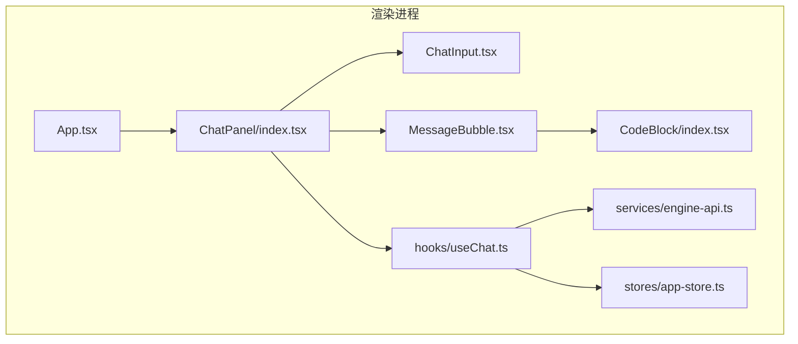
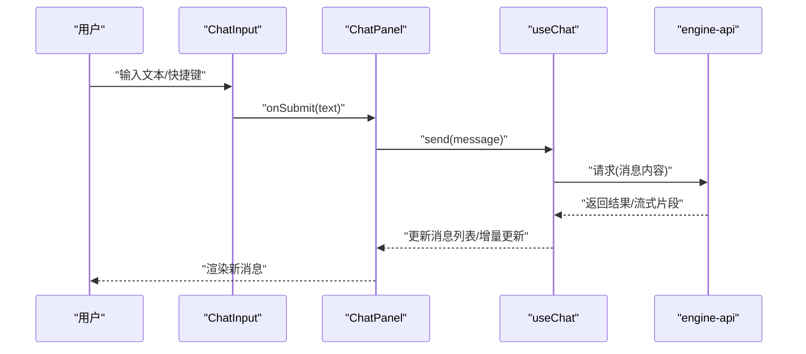
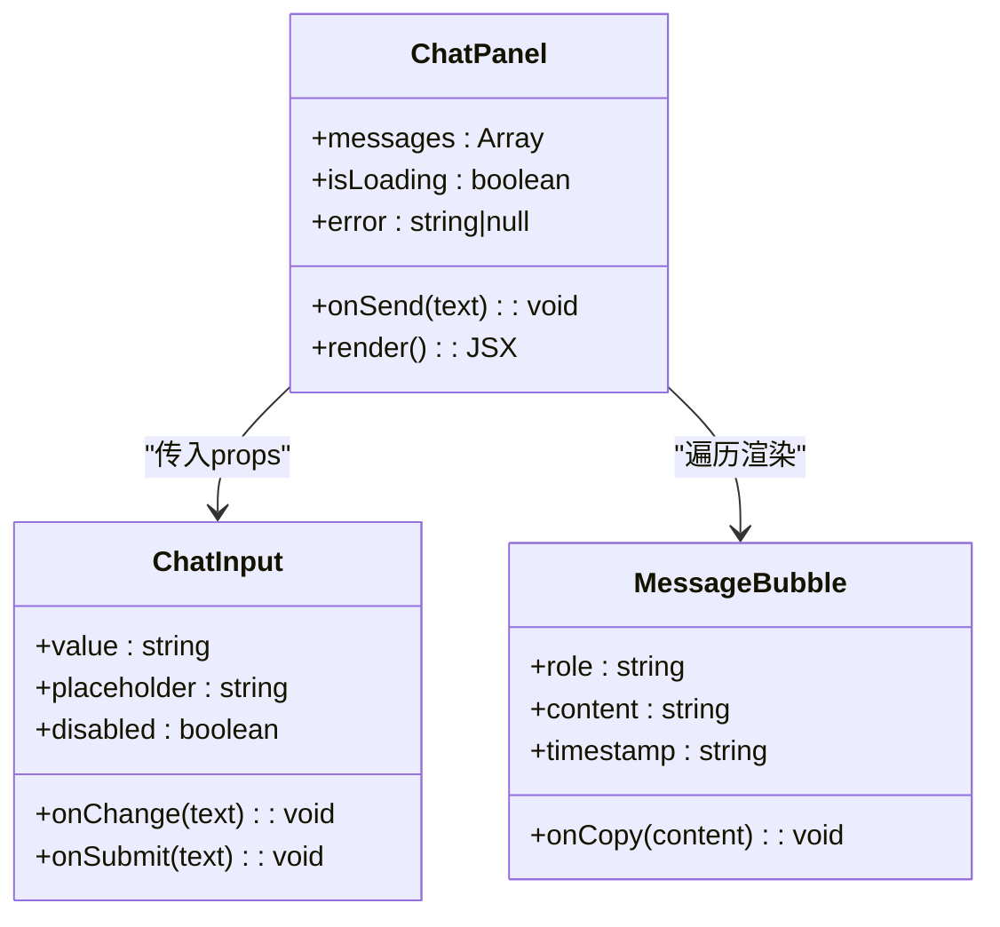
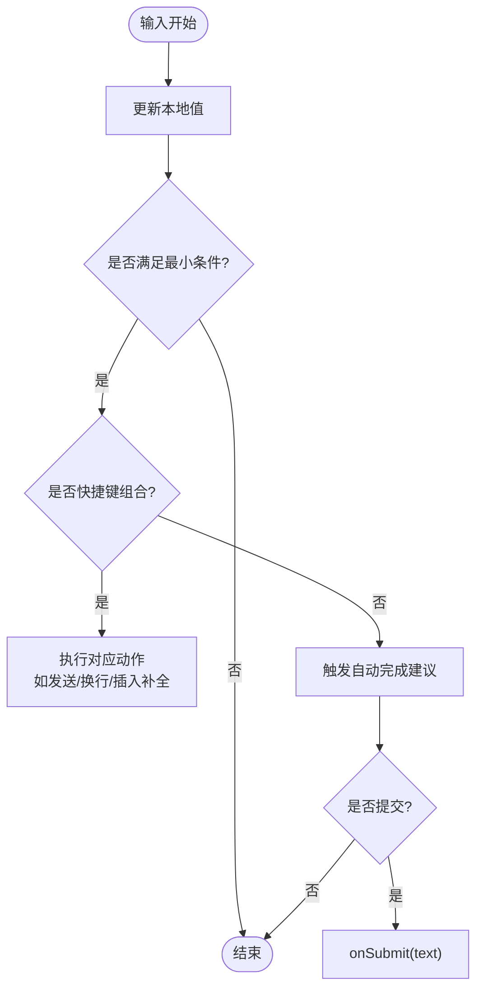
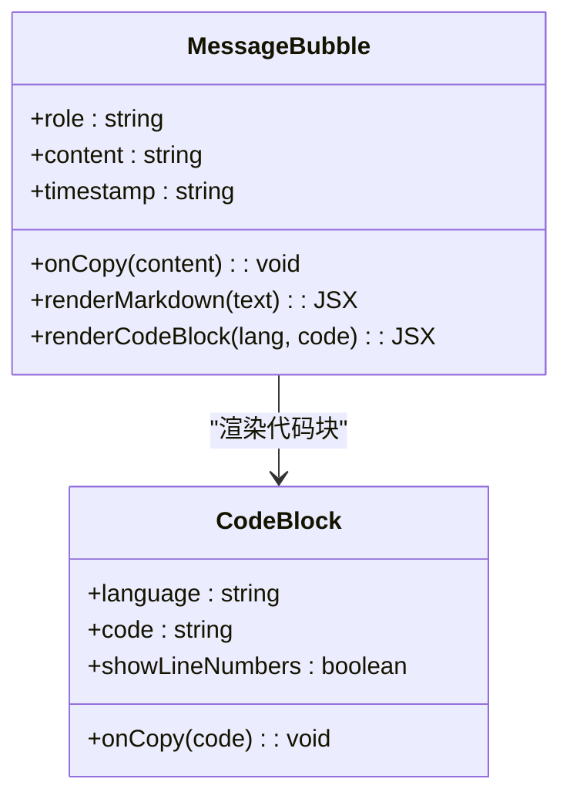
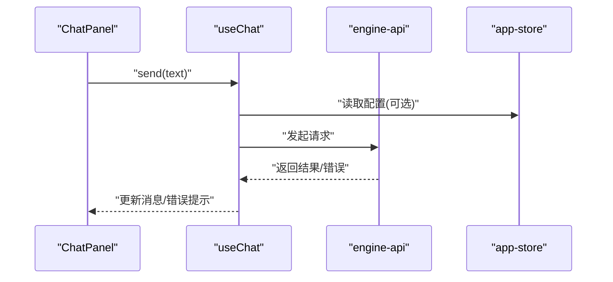
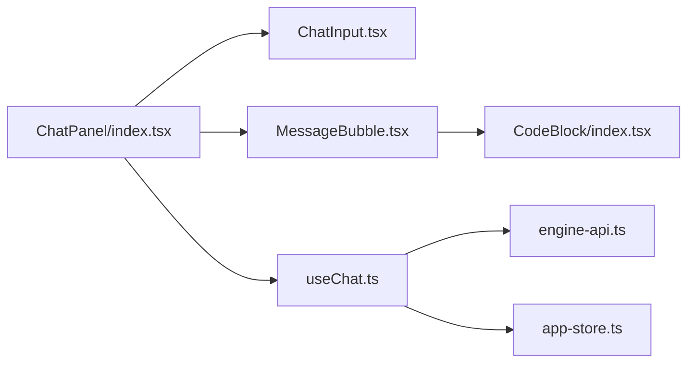

# 聊天界面组件

<cite>
**本文引用的文件**   
- [ChatPanel/index.tsx](file://app/renderer/src/components/ChatPanel/index.tsx)
- [ChatInput.tsx](file://app/renderer/src/components/ChatPanel/ChatInput.tsx)
- [MessageBubble.tsx](file://app/renderer/src/components/ChatPanel/MessageBubble.tsx)
- [CodeBlock/index.tsx](file://app/renderer/src/components/CodeBlock/index.tsx)
- [useChat.ts](file://app/renderer/src/hooks/useChat.ts)
- [engine-api.ts](file://app/renderer/src/services/engine-api.ts)
- [app-store.ts](file://app/renderer/src/stores/app-store.ts)
- [App.tsx](file://app/renderer/src/App.tsx)
</cite>

## 目录
1. [简介](#简介)
2. [项目结构](#项目结构)
3. [核心组件](#核心组件)
4. [架构总览](#架构总览)
5. [详细组件分析](#详细组件分析)
6. [依赖关系分析](#依赖关系分析)
7. [性能考虑](#性能考虑)
8. [故障排查指南](#故障排查指南)
9. [结论](#结论)
10. [附录](#附录)

## 简介
本技术文档聚焦于KCoder渲染进程中的聊天界面组件，围绕以下目标展开：
- ChatPanel主组件的架构设计：组件层次、状态管理、事件处理机制
- ChatInput输入组件：用户输入处理、快捷键支持、输入验证、自动完成
- MessageBubble消息气泡：消息渲染逻辑、Markdown支持、代码高亮、复制功能
- 组件间通信与props传递模式
- 使用示例与自定义扩展方法
- 响应式设计与可访问性支持

## 项目结构
聊天相关的前端实现位于渲染进程的src目录下，采用按功能域组织的方式。关键文件如下：
- components/ChatPanel：聊天面板主容器与子组件（输入框、消息气泡）
- components/CodeBlock：代码块渲染与高亮
- hooks/useChat：聊天业务状态与交互逻辑
- services/engine-api：与引擎服务通信的API封装
- stores/app-store：全局应用状态（可选）
- App.tsx：根组件挂载点

图表来源
- [App.tsx](file://app/renderer/src/App.tsx)
- [ChatPanel/index.tsx](file://app/renderer/src/components/ChatPanel/index.tsx)
- [ChatInput.tsx](file://app/renderer/src/components/ChatPanel/ChatInput.tsx)
- [MessageBubble.tsx](file://app/renderer/src/components/ChatPanel/MessageBubble.tsx)
- [CodeBlock/index.tsx](file://app/renderer/src/components/CodeBlock/index.tsx)
- [useChat.ts](file://app/renderer/src/hooks/useChat.ts)
- [engine-api.ts](file://app/renderer/src/services/engine-api.ts)
- [app-store.ts](file://app/renderer/src/stores/app-store.ts)

章节来源
- [App.tsx](file://app/renderer/src/App.tsx)
- [ChatPanel/index.tsx](file://app/renderer/src/components/ChatPanel/index.tsx)
- [ChatInput.tsx](file://app/renderer/src/components/ChatPanel/ChatInput.tsx)
- [MessageBubble.tsx](file://app/renderer/src/components/ChatPanel/MessageBubble.tsx)
- [CodeBlock/index.tsx](file://app/renderer/src/components/CodeBlock/index.tsx)
- [useChat.ts](file://app/renderer/src/hooks/useChat.ts)
- [engine-api.ts](file://app/renderer/src/services/engine-api.ts)
- [app-store.ts](file://app/renderer/src/stores/app-store.ts)

## 核心组件
本节概述三个核心组件的职责与协作方式：
- ChatPanel：作为聊天界面的容器，负责维护会话列表、滚动定位、发送/接收消息流程编排，并向下分发props给子组件
- ChatInput：负责用户文本输入、快捷键处理、输入校验、触发发送回调
- MessageBubble：负责单条消息的渲染，包括Markdown解析、代码块高亮、复制按钮等

章节来源
- [ChatPanel/index.tsx](file://app/renderer/src/components/ChatPanel/index.tsx)
- [ChatInput.tsx](file://app/renderer/src/components/ChatPanel/ChatInput.tsx)
- [MessageBubble.tsx](file://app/renderer/src/components/ChatPanel/MessageBubble.tsx)

## 架构总览
聊天界面采用“容器-展示”分层：
- 容器层：ChatPanel集中管理会话数据与交互流程，调用useChat获取或更新状态
- 展示层：ChatInput与MessageBubble为无状态或轻状态UI组件，通过props与回调与父组件通信
- 数据层：useChat封装与engine-api的通信，必要时读写app-store

图表来源
- [ChatInput.tsx](file://app/renderer/src/components/ChatPanel/ChatInput.tsx)
- [ChatPanel/index.tsx](file://app/renderer/src/components/ChatPanel/index.tsx)
- [useChat.ts](file://app/renderer/src/hooks/useChat.ts)
- [engine-api.ts](file://app/renderer/src/services/engine-api.ts)

## 详细组件分析

### ChatPanel主组件
职责与要点：
- 组件层次：包含消息列表区域与输入区域；消息项由MessageBubble渲染
- 状态管理：通过useChat管理消息集合、加载态、错误态；必要时与app-store联动
- 事件处理：转发ChatInput的提交事件；处理滚动到底部、自动聚焦等
- 渲染策略：对长列表进行虚拟滚动或分页加载（若实现）；对增量消息进行稳定key与滚动锚定

图表来源
- [ChatPanel/index.tsx](file://app/renderer/src/components/ChatPanel/index.tsx)
- [ChatInput.tsx](file://app/renderer/src/components/ChatPanel/ChatInput.tsx)
- [MessageBubble.tsx](file://app/renderer/src/components/ChatPanel/MessageBubble.tsx)

章节来源
- [ChatPanel/index.tsx](file://app/renderer/src/components/ChatPanel/index.tsx)

### ChatInput输入组件
功能范围：
- 用户输入处理：受控值绑定、变更回调、清空与聚焦控制
- 快捷键支持：回车发送、Shift+Enter换行、可能的命令前缀识别（如以特定字符开头进入命令模式）
- 输入验证：空内容拦截、长度限制、敏感词或格式校验（若实现）
- 自动完成：基于已输入前缀提供候选项（如命令、文件名、变量名），键盘导航选择

图表来源
- [ChatInput.tsx](file://app/renderer/src/components/ChatPanel/ChatInput.tsx)

章节来源
- [ChatInput.tsx](file://app/renderer/src/components/ChatPanel/ChatInput.tsx)

### MessageBubble消息气泡
渲染能力：
- Markdown支持：将原始文本解析为富文本结构，处理标题、列表、链接、粗体斜体等
- 代码高亮：识别代码块语言，交由CodeBlock进行语法着色与行号显示
- 复制功能：提供一键复制按钮，支持整段或仅代码块复制
- 时间戳与角色标识：区分用户与助手消息，显示时间信息

图表来源
- [MessageBubble.tsx](file://app/renderer/src/components/ChatPanel/MessageBubble.tsx)
- [CodeBlock/index.tsx](file://app/renderer/src/components/CodeBlock/index.tsx)

章节来源
- [MessageBubble.tsx](file://app/renderer/src/components/ChatPanel/MessageBubble.tsx)
- [CodeBlock/index.tsx](file://app/renderer/src/components/CodeBlock/index.tsx)

### 状态管理与数据流
- useChat：封装消息生命周期（新增、追加、错误处理）、与engine-api交互、节流/防抖、流式更新
- engine-api：统一网络请求封装，处理重试、超时、错误映射
- app-store：可选的全局配置或主题、语言、快捷键设置等

图表来源
- [useChat.ts](file://app/renderer/src/hooks/useChat.ts)
- [engine-api.ts](file://app/renderer/src/services/engine-api.ts)
- [app-store.ts](file://app/renderer/src/stores/app-store.ts)

章节来源
- [useChat.ts](file://app/renderer/src/hooks/useChat.ts)
- [engine-api.ts](file://app/renderer/src/services/engine-api.ts)
- [app-store.ts](file://app/renderer/src/stores/app-store.ts)

### 组件通信与Props传递模式
- 自上而下：ChatPanel向ChatInput与MessageBubble传递值与回调
- 自下而上：子组件通过回调函数通知父组件（如onSubmit、onCopy）
- 共享状态：useChat作为单一事实源，避免分散状态导致不一致

章节来源
- [ChatPanel/index.tsx](file://app/renderer/src/components/ChatPanel/index.tsx)
- [ChatInput.tsx](file://app/renderer/src/components/ChatPanel/ChatInput.tsx)
- [MessageBubble.tsx](file://app/renderer/src/components/ChatPanel/MessageBubble.tsx)
- [useChat.ts](file://app/renderer/src/hooks/useChat.ts)

### 使用示例与自定义扩展
- 基本用法：在页面中引入ChatPanel，按需传入初始消息、占位符文案、禁用态等
- 自定义输入行为：通过覆写onSubmit或在useChat中注入自定义发送逻辑
- 扩展消息类型：在MessageBubble中增加新的渲染分支（如图片、卡片）
- 主题与样式：通过CSS变量或Tailwind类名覆盖默认样式

章节来源
- [ChatPanel/index.tsx](file://app/renderer/src/components/ChatPanel/index.tsx)
- [ChatInput.tsx](file://app/renderer/src/components/ChatPanel/ChatInput.tsx)
- [MessageBubble.tsx](file://app/renderer/src/components/ChatPanel/MessageBubble.tsx)

### 响应式设计实现
- 布局适配：在小屏设备上调整内边距、字号、按钮尺寸，保证触控友好
- 输入区自适应：高度随内容增长，最大高度限制后内部滚动
- 代码块横向滚动：在窄屏下启用水平滚动，避免破坏整体布局

章节来源
- [ChatInput.tsx](file://app/renderer/src/components/ChatPanel/ChatInput.tsx)
- [MessageBubble.tsx](file://app/renderer/src/components/ChatPanel/MessageBubble.tsx)
- [CodeBlock/index.tsx](file://app/renderer/src/components/CodeBlock/index.tsx)

### 可访问性支持
- 语义化标签：使用合适的ARIA角色与属性，如aria-live用于动态消息播报
- 键盘可达：确保所有操作可通过键盘完成，焦点顺序合理
- 对比度与字体：遵循WCAG对比度要求，允许用户放大字体
- 屏幕阅读器：为图标按钮提供alt或aria-label，为代码块提供语言说明

章节来源
- [ChatInput.tsx](file://app/renderer/src/components/ChatPanel/ChatInput.tsx)
- [MessageBubble.tsx](file://app/renderer/src/components/ChatPanel/MessageBubble.tsx)

## 依赖关系分析
组件与模块之间的依赖关系如下：

图表来源
- [ChatPanel/index.tsx](file://app/renderer/src/components/ChatPanel/index.tsx)
- [ChatInput.tsx](file://app/renderer/src/components/ChatPanel/ChatInput.tsx)
- [MessageBubble.tsx](file://app/renderer/src/components/ChatPanel/MessageBubble.tsx)
- [CodeBlock/index.tsx](file://app/renderer/src/components/CodeBlock/index.tsx)
- [useChat.ts](file://app/renderer/src/hooks/useChat.ts)
- [engine-api.ts](file://app/renderer/src/services/engine-api.ts)
- [app-store.ts](file://app/renderer/src/stores/app-store.ts)

章节来源
- [ChatPanel/index.tsx](file://app/renderer/src/components/ChatPanel/index.tsx)
- [ChatInput.tsx](file://app/renderer/src/components/ChatPanel/ChatInput.tsx)
- [MessageBubble.tsx](file://app/renderer/src/components/ChatPanel/MessageBubble.tsx)
- [CodeBlock/index.tsx](file://app/renderer/src/components/CodeBlock/index.tsx)
- [useChat.ts](file://app/renderer/src/hooks/useChat.ts)
- [engine-api.ts](file://app/renderer/src/services/engine-api.ts)
- [app-store.ts](file://app/renderer/src/stores/app-store.ts)

## 性能考虑
- 列表渲染优化：对长消息列表使用虚拟滚动或分页加载，减少DOM节点数量
- 增量更新：对流式输出采用增量追加而非全量重渲染
- 代码高亮延迟：仅在可见区域内进行高亮计算，避免阻塞主线程
- 防抖与节流：对输入与搜索建议进行防抖，降低频繁计算开销
- 资源懒加载：按需加载Markdown解析器与语法高亮库

[本节为通用指导，不直接分析具体文件]

## 故障排查指南
常见问题与定位思路：
- 消息未更新：检查useChat是否正确调用engine-api并更新状态；确认ChatPanel订阅了状态变化
- 输入无法发送：验证ChatInput的onSubmit是否被正确触发；检查禁用态与输入校验
- 代码块未高亮：确认MessageBubble是否正确识别代码块语言并传递给CodeBlock
- 复制失败：检查浏览器剪贴板权限与异步复制API的使用

章节来源
- [useChat.ts](file://app/renderer/src/hooks/useChat.ts)
- [ChatInput.tsx](file://app/renderer/src/components/ChatPanel/ChatInput.tsx)
- [MessageBubble.tsx](file://app/renderer/src/components/ChatPanel/MessageBubble.tsx)
- [CodeBlock/index.tsx](file://app/renderer/src/components/CodeBlock/index.tsx)

## 结论
本组件体系以ChatPanel为核心，结合useChat的状态管理与engine-api的数据交互，实现了可扩展、可维护的聊天界面。通过合理的组件拆分、清晰的props传递与回调机制，以及Markdown与代码高亮的渲染能力，满足了开发者日常对话与代码协作的需求。后续可在虚拟滚动、流式渲染与可访问性方面持续优化。

[本节为总结，不直接分析具体文件]

## 附录
- 术语说明：
  - 容器组件：负责状态与流程编排
  - 展示组件：负责UI呈现与用户交互
  - 钩子：封装可复用的状态与副作用逻辑
- 相关文件路径索引：
  - 聊天面板：components/ChatPanel
  - 代码块渲染：components/CodeBlock
  - 状态与API：hooks/useChat、services/engine-api、stores/app-store

[本节为补充信息，不直接分析具体文件]