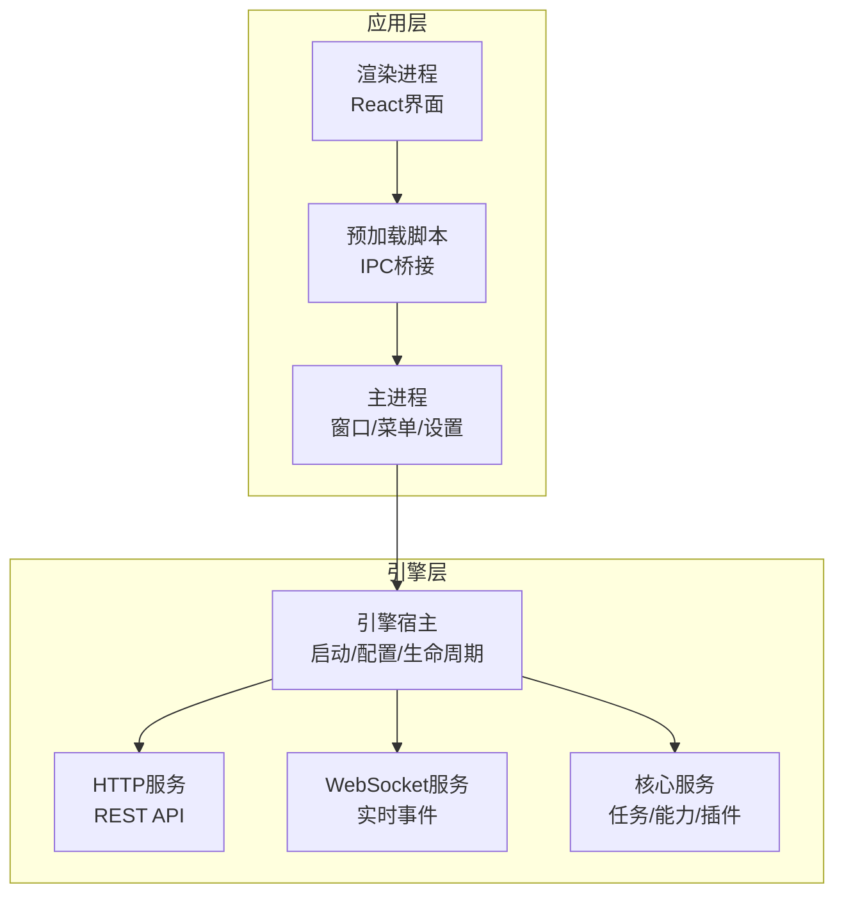
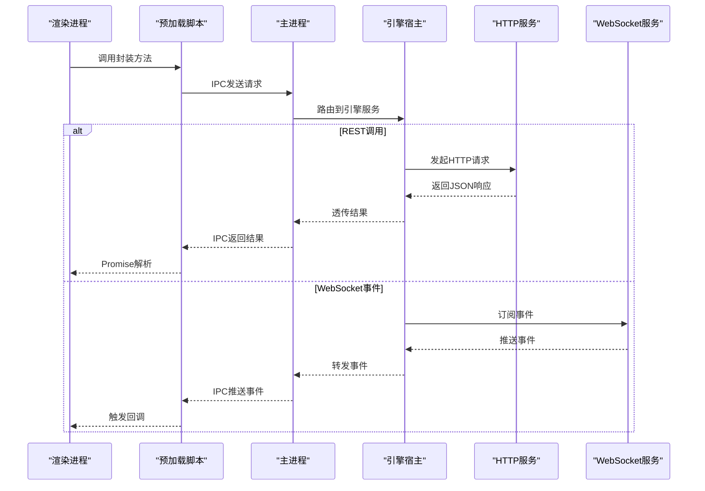
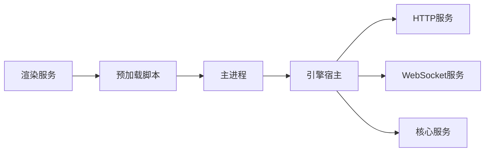

# API参考

<cite>
**本文引用的文件**   
- [app/main/index.ts](file://app/main/index.ts)
- [app/main/engine-host.ts](file://app/main/engine-host.ts)
- [app/preload/index.ts](file://app/preload/index.ts)
- [app/renderer/src/services/engine-api.ts](file://app/renderer/src/services/engine-api.ts)
- [engine/package.json](file://engine/package.json)
- [engine/README.md](file://engine/README.md)
</cite>

## 目录
1. [简介](#简介)
2. [项目结构](#项目结构)
3. [核心组件](#核心组件)
4. [架构总览](#架构总览)
5. [详细组件分析](#详细组件分析)
6. [依赖关系分析](#依赖关系分析)
7. [性能考虑](#性能考虑)
8. [故障排查指南](#故障排查指南)
9. [结论](#结论)
10. [附录](#附录)

## 简介
本文件为KCoder的API参考文档，覆盖以下方面：
- REST API接口：HTTP方法、URL模式、请求与响应格式、认证方式
- WebSocket API：连接处理、消息格式、事件类型、实时交互模式
- IPC通信：主进程与渲染进程的通信协议、数据传递、进程同步
- 引擎内部API：核心服务接口、插件接口、回调函数
- SDK使用：客户端初始化、方法调用、错误处理
- 接口规范：参数定义、返回值格式、错误码说明
- 版本管理与向后兼容策略
- 安全考虑：认证授权、限流控制、审计日志
- 测试工具与调试方法
- 常见示例与最佳实践

## 项目结构
KCoder采用Electron多进程架构，结合自研Engine内核。关键目录与职责如下：
- app/main：Electron主进程入口、窗口管理、菜单、设置、引擎宿主
- app/preload：预加载脚本，暴露安全的IPC桥接给渲染进程
- app/renderer：前端渲染层，包含UI组件、状态管理、与引擎的交互服务
- engine：引擎核心，提供HTTP服务、任务执行、能力注册、插件机制等

图表来源
- [app/main/index.ts:1-200](file://app/main/index.ts#L1-L200)
- [app/main/engine-host.ts:1-200](file://app/main/engine-host.ts#L1-L200)
- [app/preload/index.ts:1-200](file://app/preload/index.ts#L1-L200)
- [app/renderer/src/services/engine-api.ts:1-200](file://app/renderer/src/services/engine-api.ts#L1-L200)

章节来源
- [app/main/index.ts:1-200](file://app/main/index.ts#L1-L200)
- [app/main/engine-host.ts:1-200](file://app/main/engine-host.ts#L1-L200)
- [app/preload/index.ts:1-200](file://app/preload/index.ts#L1-L200)
- [app/renderer/src/services/engine-api.ts:1-200](file://app/renderer/src/services/engine-api.ts#L1-L200)

## 核心组件
- 主进程（Main）：负责应用生命周期、窗口与菜单管理、与引擎宿主的对接
- 引擎宿主（Engine Host）：负责引擎实例化、配置注入、HTTP/WebSocket服务启动、核心服务编排
- 预加载（Preload）：在渲染进程中暴露受控的IPC通道，屏蔽底层实现细节
- 渲染服务（Renderer Service）：封装对引擎的调用，统一错误处理与重试策略
- 引擎核心（Engine Core）：提供HTTP API、WebSocket事件总线、任务调度、能力与插件注册

章节来源
- [app/main/index.ts:1-200](file://app/main/index.ts#L1-L200)
- [app/main/engine-host.ts:1-200](file://app/main/engine-host.ts#L1-L200)
- [app/preload/index.ts:1-200](file://app/preload/index.ts#L1-L200)
- [app/renderer/src/services/engine-api.ts:1-200](file://app/renderer/src/services/engine-api.ts#L1-L200)

## 架构总览
整体架构遵循“分层+可插拔”的设计：
- 表现层：React UI通过预加载脚本与主进程通信
- 控制层：主进程协调引擎宿主，转发请求并管理生命周期
- 服务层：引擎提供HTTP与WebSocket服务，承载业务逻辑
- 扩展层：能力与插件通过注册表接入，支持动态扩展

图表来源
- [app/main/index.ts:1-200](file://app/main/index.ts#L1-L200)
- [app/main/engine-host.ts:1-200](file://app/main/engine-host.ts#L1-L200)
- [app/preload/index.ts:1-200](file://app/preload/index.ts#L1-L200)
- [app/renderer/src/services/engine-api.ts:1-200](file://app/renderer/src/services/engine-api.ts#L1-L200)

## 详细组件分析

### REST API
- 基础路径：由引擎HTTP服务决定，通常以根路径或特定前缀暴露
- 通用请求头：
  - Content-Type: application/json
  - Authorization: Bearer <token>（若启用认证）
- 通用响应体：
  - success: boolean
  - data: any（具体业务数据）
  - error: object（错误信息，含code、message）
- 典型端点（示例，实际以引擎实现为准）：
  - GET /api/status：查询引擎健康状态
  - POST /api/tasks：创建任务
  - GET /api/tasks/:id：获取任务详情
  - DELETE /api/tasks/:id：取消或删除任务
  - GET /api/capabilities：列出可用能力
  - POST /api/plugins/register：注册插件
- 认证方式：
  - 可选JWT或会话令牌，需在Authorization头中携带
  - 未认证访问将返回401；权限不足返回403
- 错误码：
  - 200：成功
  - 400：请求参数错误
  - 401：未认证
  - 403：无权限
  - 404：资源不存在
  - 429：限流
  - 500：服务器内部错误

章节来源
- [engine/README.md:1-200](file://engine/README.md#L1-L200)
- [engine/package.json:1-200](file://engine/package.json#L1-L200)

### WebSocket API
- 连接建立：
  - URL：ws(s)://host/ws（端口与协议由引擎配置）
  - 握手阶段可携带认证头或查询参数
- 消息格式：
  - 入站消息：{ type, payload }
  - 出站事件：{ event, data, meta }
- 事件类型（示例）：
  - task.created：任务创建完成
  - task.progress：任务进度更新
  - task.completed：任务完成
  - plugin.registered：插件注册成功
  - capability.updated：能力变更
- 实时交互模式：
  - 客户端订阅事件后，服务端持续推送
  - 支持断线重连与幂等恢复（基于事件ID或时间戳）
- 错误处理：
  - 连接失败：指数退避重连
  - 消息校验失败：关闭连接并记录审计日志

章节来源
- [engine/README.md:1-200](file://engine/README.md#L1-L200)

### IPC通信（主进程与渲染进程）
- 通道命名：
  - 建议按功能域划分，如 ipc:tasks、ipc:plugins、ipc:capabilities
- 协议约定：
  - 单向：渲染进程发送请求，主进程返回Promise结果
  - 双向：主进程主动推送事件，渲染进程监听回调
- 数据传递：
  - 仅传递可序列化的数据结构（对象、数组、基本类型）
  - 大对象建议分片或流式传输
- 进程同步：
  - 使用唯一请求ID关联请求与响应
  - 超时与重试策略由渲染服务统一封装

章节来源
- [app/preload/index.ts:1-200](file://app/preload/index.ts#L1-L200)
- [app/renderer/src/services/engine-api.ts:1-200](file://app/renderer/src/services/engine-api.ts#L1-L200)

### 引擎内部API（核心服务、插件、回调）
- 核心服务接口：
  - 任务管理：创建、查询、取消、列表
  - 能力注册：声明能力元数据与实现
  - 配置管理：读取与热更新
- 插件接口：
  - 注册钩子：生命周期回调（onStart、onStop、onError）
  - 暴露工具：供任务与能力调用的外部工具集
- 回调函数：
  - 异步事件：通过事件总线分发
  - 错误回调：统一错误上报与审计

章节来源
- [engine/README.md:1-200](file://engine/README.md#L1-L200)
- [engine/package.json:1-200](file://engine/package.json#L1-L200)

### SDK使用方法
- 客户端初始化：
  - 传入基础URL、认证令牌、重试策略
  - 可选开启WebSocket实时订阅
- 方法调用：
  - 提供Promise风格与回调风格的API
  - 支持批量操作与分页查询
- 错误处理：
  - 网络错误：自动重试与降级
  - 业务错误：根据错误码分支处理
  - 超时错误：可配置超时阈值与取消信号

章节来源
- [app/renderer/src/services/engine-api.ts:1-200](file://app/renderer/src/services/engine-api.ts#L1-L200)

## 依赖关系分析
- 模块耦合：
  - 渲染服务依赖预加载IPC桥接
  - 主进程依赖引擎宿主进行服务编排
  - 引擎内部HTTP与WebSocket服务解耦于核心业务
- 外部依赖：
  - Electron运行时
  - Node.js标准库与第三方HTTP/WS库
  - 可选OpenTelemetry用于可观测性

图表来源
- [app/main/index.ts:1-200](file://app/main/index.ts#L1-L200)
- [app/main/engine-host.ts:1-200](file://app/main/engine-host.ts#L1-L200)
- [app/preload/index.ts:1-200](file://app/preload/index.ts#L1-L200)
- [app/renderer/src/services/engine-api.ts:1-200](file://app/renderer/src/services/engine-api.ts#L1-L200)

章节来源
- [app/main/index.ts:1-200](file://app/main/index.ts#L1-L200)
- [app/main/engine-host.ts:1-200](file://app/main/engine-host.ts#L1-L200)
- [app/preload/index.ts:1-200](file://app/preload/index.ts#L1-L200)
- [app/renderer/src/services/engine-api.ts:1-200](file://app/renderer/src/services/engine-api.ts#L1-L200)

## 性能考虑
- 连接复用：HTTP保持长连接，WebSocket避免频繁握手
- 批处理：合并小请求，减少IPC与网络开销
- 缓存：热点数据本地缓存，降低重复计算
- 限流：服务端对高频接口实施令牌桶或滑动窗口限流
- 监控：集成指标采集与链路追踪，定位瓶颈

[本节为通用指导，不直接分析具体文件]

## 故障排查指南
- 常见问题：
  - 连接失败：检查端口、防火墙、证书配置
  - 认证失败：确认令牌有效期与作用域
  - 事件丢失：核对事件ID与重连策略
- 诊断步骤：
  - 查看引擎日志与审计日志
  - 使用浏览器开发者工具或curl/WSCat验证接口
  - 启用调试模式输出详细请求与响应
- 回滚策略：
  - 保留上一版本配置与数据迁移脚本
  - 灰度发布与快速回滚开关

章节来源
- [engine/README.md:1-200](file://engine/README.md#L1-L200)

## 结论
KCoder通过分层架构与可插拔设计，提供了清晰的REST与WebSocket接口，以及稳定的IPC桥接。建议在开发中遵循统一的错误码与认证规范，结合限流与审计提升系统健壮性与安全性。

[本节为总结，不直接分析具体文件]

## 附录

### 接口规范模板
- 请求：
  - 方法：GET/POST/PUT/DELETE
  - URL：/api/<domain>/<resource>[/:id]
  - 头部：Content-Type、Authorization
  - 主体：JSON结构，字段需标注必填与类型
- 响应：
  - 成功：{ success: true, data: ... }
  - 失败：{ success: false, error: { code, message } }
- 错误码：
  - 业务错误码与HTTP状态码映射清晰
  - 新增错误码需维护变更日志

[本节为通用模板，不直接分析具体文件]

### 版本管理与向后兼容
- 版本号策略：语义化版本（主.次.修订）
- 兼容性：
  - 次版本增加新字段但不破坏现有消费者
  - 主版本可能引入破坏性变更，需提供迁移指南
- 废弃策略：
  - 标记废弃字段与端点，保留至少两个次版本
  - 提供替代方案与过渡期

[本节为通用策略，不直接分析具体文件]

### 安全考虑
- 认证与授权：
  - 使用强令牌的短期有效令牌
  - 最小权限原则与角色绑定
- 限流与熔断：
  - 针对敏感接口实施严格限流
  - 异常时快速失败与降级
- 审计日志：
  - 记录关键操作与异常事件
  - 脱敏敏感信息，集中存储与分析

[本节为通用安全建议，不直接分析具体文件]

### 测试工具与调试方法
- 单元测试：针对核心服务与插件钩子编写用例
- 集成测试：模拟HTTP与WebSocket端到端流程
- 压测工具：使用负载生成器评估吞吐与延迟
- 调试技巧：
  - 启用详细日志与Trace ID
  - 使用断点与快照对比问题复现

[本节为通用测试建议，不直接分析具体文件]

### 常见示例与最佳实践
- 示例：
  - 创建任务并轮询进度
  - 订阅实时事件并在UI中增量渲染
  - 注册自定义插件并暴露工具
- 最佳实践：
  - 统一错误处理与用户提示
  - 合理拆分请求与事件，避免阻塞
  - 对敏感操作进行二次确认与审计

[本节为通用示例与建议，不直接分析具体文件]