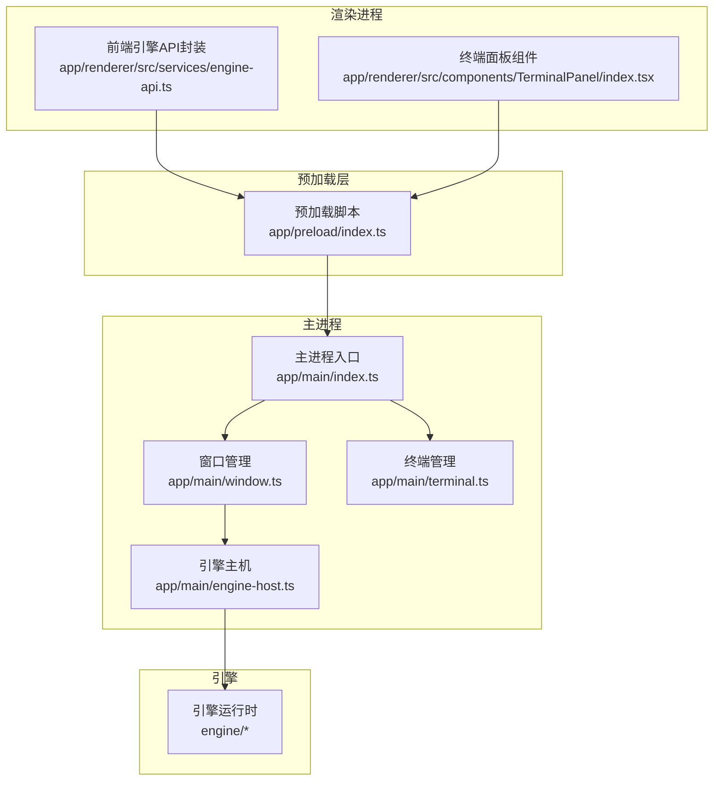
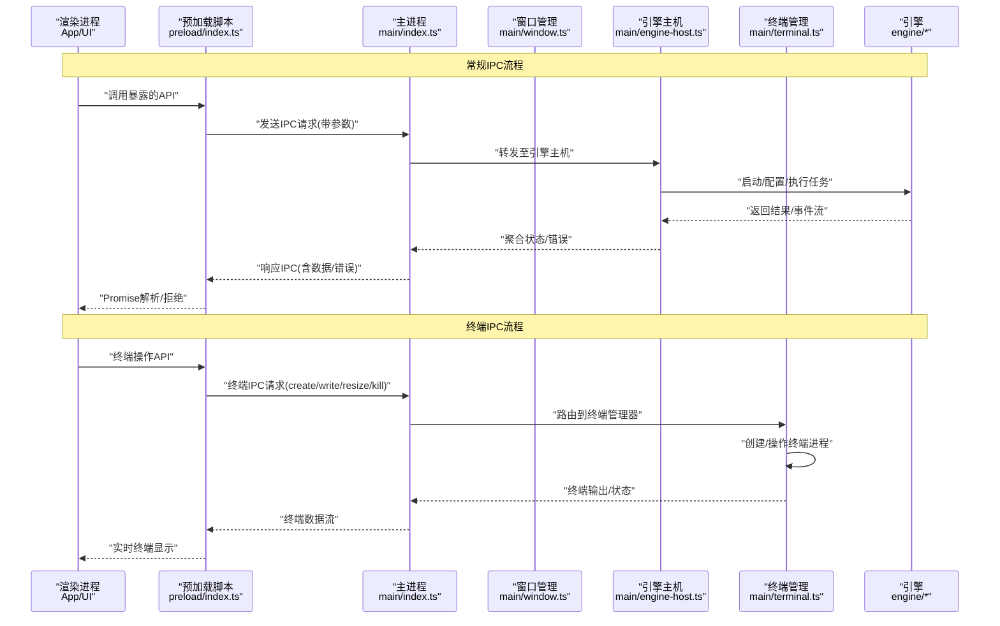
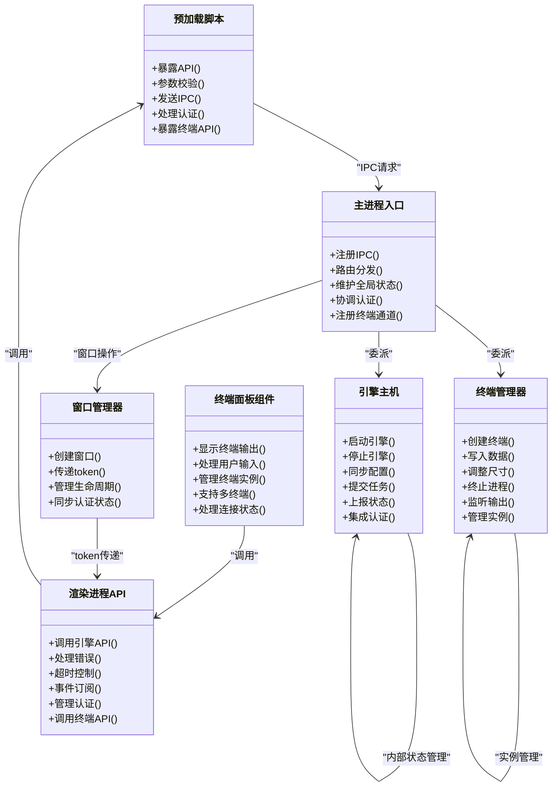

# IPC进程间通信

<cite>
**本文引用的文件**   
- [app/main/index.ts](file://app/main/index.ts)
- [app/main/window.ts](file://app/main/window.ts)
- [app/main/engine-host.ts](file://app/main/engine-host.ts)
- [app/main/terminal.ts](file://app/main/terminal.ts)
- [app/preload/index.ts](file://app/preload/index.ts)
- [app/renderer/src/services/engine-api.ts](file://app/renderer/src/services/engine-api.ts)
- [app/renderer/src/components/TerminalPanel/index.tsx](file://app/renderer/src/components/TerminalPanel/index.tsx)
</cite>

## 更新摘要
**变更内容**   
- 新增终端系统IPC通信机制，支持create/write/resize/kill等操作的消息传递
- 扩展主进程终端管理模块以处理终端生命周期和I/O操作
- 增强预加载脚本以暴露终端相关API给渲染进程
- 更新渲染进程终端面板组件以集成新的IPC通信接口
- 完善异步消息处理机制以支持终端流式数据传输

## 目录
1. [简介](#简介)
2. [项目结构](#项目结构)
3. [核心组件](#核心组件)
4. [架构总览](#架构总览)
5. [详细组件分析](#详细组件分析)
6. [依赖关系分析](#依赖关系分析)
7. [性能考虑](#性能考虑)
8. [故障排查指南](#故障排查指南)
9. [结论](#结论)
10. [附录](#附录)

## 简介
本文件面向KCoder的IPC（进程间通信）机制，系统性说明Electron主进程与渲染进程之间的通信架构、预加载脚本的职责与安全隔离策略，并记录引擎主机与前端应用之间的通信协议。文档覆盖以下要点：
- 主进程与渲染进程的IPC通道、消息格式与调用方式
- 预加载脚本在安全沙箱中的桥接作用
- 引擎启动、配置同步、任务执行的状态同步流程
- **新增：终端系统进程间通信机制，支持create/write/resize/kill等操作**
- 异步消息处理机制（Promise封装、错误传播、超时控制）
- 示例代码路径（主进程监听器、渲染进程调用者）
- 安全最佳实践（权限控制、输入验证、敏感信息保护）
- 调试方法与常见问题排查

## 项目结构
KCoder采用Electron多进程架构，关键目录与职责如下：
- app/main：主进程入口与宿主逻辑，负责引擎生命周期管理、系统菜单、窗口管理、终端管理等
- app/preload：预加载脚本，暴露受限API给渲染进程，实现安全桥接
- app/renderer：前端应用，通过预加载暴露的API与主进程/引擎交互
- engine：独立可复用的引擎模块，由主进程以子进程或本地服务形式运行，并通过IPC与前端同步状态



图表来源
- [app/main/index.ts](file://app/main/index.ts)
- [app/main/window.ts](file://app/main/window.ts)
- [app/main/engine-host.ts](file://app/main/engine-host.ts)
- [app/main/terminal.ts](file://app/main/terminal.ts)
- [app/preload/index.ts](file://app/preload/index.ts)
- [app/renderer/src/services/engine-api.ts](file://app/renderer/src/services/engine-api.ts)
- [app/renderer/src/components/TerminalPanel/index.tsx](file://app/renderer/src/components/TerminalPanel/index.tsx)

章节来源
- [app/main/index.ts](file://app/main/index.ts)
- [app/main/window.ts](file://app/main/window.ts)
- [app/main/engine-host.ts](file://app/main/engine-host.ts)
- [app/main/terminal.ts](file://app/main/terminal.ts)
- [app/preload/index.ts](file://app/preload/index.ts)
- [app/renderer/src/services/engine-api.ts](file://app/renderer/src/services/engine-api.ts)
- [app/renderer/src/components/TerminalPanel/index.tsx](file://app/renderer/src/components/TerminalPanel/index.tsx)

## 核心组件
- 主进程入口：初始化窗口、注册IPC通道、协调引擎主机和终端管理
- 窗口管理器：管理渲染窗口的创建和销毁，支持认证状态传递
- 引擎主机：负责引擎实例的生命周期（启动、停止）、配置下发、任务调度与状态上报
- **终端管理器：新增的终端系统IPC处理器，负责终端进程的生命周期管理和I/O操作**
- 预加载脚本：在渲染进程的安全沙箱中暴露受控API，屏蔽原生能力直连
- 渲染进程API封装：为业务组件提供统一的IPC调用接口，统一错误与超时处理
- **终端面板组件：新增的前端终端界面，通过IPC与主进程终端管理器通信**

章节来源
- [app/main/index.ts](file://app/main/index.ts)
- [app/main/window.ts](file://app/main/window.ts)
- [app/main/engine-host.ts](file://app/main/engine-host.ts)
- [app/main/terminal.ts](file://app/main/terminal.ts)
- [app/preload/index.ts](file://app/preload/index.ts)
- [app/renderer/src/services/engine-api.ts](file://app/renderer/src/services/engine-api.ts)
- [app/renderer/src/components/TerminalPanel/index.tsx](file://app/renderer/src/components/TerminalPanel/index.tsx)

## 架构总览
下图展示从渲染进程发起请求到引擎执行并回传状态的端到端流程，包括新增的终端IPC通信机制。



图表来源
- [app/preload/index.ts](file://app/preload/index.ts)
- [app/main/index.ts](file://app/main/index.ts)
- [app/main/window.ts](file://app/main/window.ts)
- [app/main/engine-host.ts](file://app/main/engine-host.ts)
- [app/main/terminal.ts](file://app/main/terminal.ts)
- [app/renderer/src/services/engine-api.ts](file://app/renderer/src/services/engine-api.ts)
- [app/renderer/src/components/TerminalPanel/index.tsx](file://app/renderer/src/components/TerminalPanel/index.tsx)

## 详细组件分析

### 预加载脚本（安全桥接）
- 职责
  - 在渲染进程沙箱内暴露最小化API集合
  - 将渲染进程调用转换为对主进程的IPC请求
  - 统一进行参数校验、错误包装与超时控制
  - **新增：暴露终端相关API，包括create、write、resize、kill操作**
- 安全策略
  - 仅暴露必要方法名，避免直接访问Node/Electron原生对象
  - 对入参进行白名单/类型校验，拒绝非法值
  - 不传递敏感上下文（如文件系统路径、密钥等），如需则通过主进程代理
  - **新增：终端操作的权限控制和输入验证**
- 典型暴露接口
  - 引擎相关：启动、停止、配置同步、任务提交、状态订阅
  - 系统相关：窗口操作、日志输出（受限）
  - **新增：终端相关：create、write、resize、kill、onOutput等**

章节来源
- [app/preload/index.ts](file://app/preload/index.ts)

### 主进程入口（IPC路由与资源管理）
- 职责
  - 创建并管理渲染窗口
  - 注册IPC通道处理器，按通道名分发到具体业务逻辑
  - 维护全局状态（如当前引擎实例、会话上下文）
  - **新增：注册终端相关的IPC通道处理器**
- IPC设计
  - 使用命名通道区分不同领域（如"engine:*"、"ui:*"、"auth:*"、"terminal:*"）
  - 请求体包含命令、参数、可选的超时时间
  - 响应体包含成功数据或结构化错误对象
  - **新增：终端通道用于create、write、resize、kill等操作**
- 与引擎主机协作
  - 将引擎相关的IPC请求委派给引擎主机
  - 将引擎事件广播给所有已订阅的渲染进程
  - **新增：将终端相关的IPC请求委派给终端管理器**

章节来源
- [app/main/index.ts](file://app/main/index.ts)

### 窗口管理器（认证状态传递）
- 职责
  - 管理渲染窗口的创建和销毁
  - 处理token在窗口间的传递机制
  - 维护窗口生命周期和资源管理
  - 确保认证状态在不同窗口间的一致性
- Token传递机制
  - 通过查询参数安全传递认证token
  - 支持窗口间认证状态同步
  - 提供token验证和过期处理
- 安全考虑
  - token在URL中的安全编码
  - 防止token泄露和重放攻击
  - 窗口关闭时清理敏感信息

章节来源
- [app/main/window.ts](file://app/main/window.ts)

### 引擎主机（引擎生命周期与状态同步）
- 职责
  - 启动/停止引擎进程或服务
  - 接收并应用配置变更
  - 提交任务并跟踪执行状态
  - 向主进程上报引擎事件（进度、完成、失败）
  - 集成认证状态到引擎通信
- 状态同步
  - 使用事件总线或IPC广播将引擎状态推送给渲染进程
  - 支持增量更新与去抖合并，减少UI抖动
  - 认证状态与引擎状态的联合同步
- 错误处理
  - 捕获引擎异常，转换为标准错误对象
  - 支持重试与降级策略（如重启引擎）
  - 认证失败的优雅处理和恢复机制

章节来源
- [app/main/engine-host.ts](file://app/main/engine-host.ts)

### 终端管理器（新增组件）
- 职责
  - **新增：管理终端进程的生命周期**
  - **新增：处理终端I/O操作（输入/输出）**
  - **新增：维护多个终端实例的状态**
  - **新增：处理终端尺寸调整和进程终止**
- 终端操作
  - create：创建新的终端进程实例
  - write：向终端写入数据
  - resize：调整终端尺寸
  - kill：终止终端进程
  - onOutput：监听终端输出事件
- 状态管理
  - 维护活跃终端实例的映射表
  - 跟踪每个终端的运行状态和资源使用情况
  - 支持终端实例的自动清理和垃圾回收
- 错误处理
  - 捕获终端进程异常和I/O错误
  - 提供终端崩溃后的自动恢复机制
  - 记录详细的终端操作日志

章节来源
- [app/main/terminal.ts](file://app/main/terminal.ts)

### 渲染进程API封装（统一调用与错误处理）
- 职责
  - 为业务组件提供简洁的异步API
  - 封装IPC调用细节（通道名、消息格式、重试、超时）
  - 将底层错误映射为业务友好的错误类型
  - **新增：封装终端相关的API调用**
- 异步模型
  - 基于Promise封装，支持async/await
  - 提供取消与超时控制
  - 支持事件订阅（如任务进度）
  - **新增：终端输出的流式事件订阅**
- 认证集成
  - 自动附加token到引擎请求
  - 处理认证过期和重新登录流程
  - 提供认证状态的全局管理

章节来源
- [app/renderer/src/services/engine-api.ts](file://app/renderer/src/services/engine-api.ts)

### 终端面板组件（新增组件）
- 职责
  - **新增：提供用户友好的终端界面**
  - **新增：处理用户输入和终端输出显示**
  - **新增：管理终端实例的生命周期**
  - **新增：支持终端尺寸调整和样式定制**
- 用户交互
  - 接收用户键盘输入并发送到对应终端
  - 实时显示终端输出内容
  - 支持终端切换和多实例管理
  - 提供终端搜索和历史记录功能
- 状态同步
  - 与主进程保持终端状态同步
  - 处理终端连接断开和重连
  - 支持终端配置的持久化存储

章节来源
- [app/renderer/src/components/TerminalPanel/index.tsx](file://app/renderer/src/components/TerminalPanel/index.tsx)

#### 类与方法关系图（概念映射）


图表来源
- [app/preload/index.ts](file://app/preload/index.ts)
- [app/main/index.ts](file://app/main/index.ts)
- [app/main/window.ts](file://app/main/window.ts)
- [app/main/engine-host.ts](file://app/main/engine-host.ts)
- [app/main/terminal.ts](file://app/main/terminal.ts)
- [app/renderer/src/services/engine-api.ts](file://app/renderer/src/services/engine-api.ts)
- [app/renderer/src/components/TerminalPanel/index.tsx](file://app/renderer/src/components/TerminalPanel/index.tsx)

## 依赖关系分析
- 耦合度
  - 渲染进程仅依赖预加载脚本暴露的API，降低与主进程的直接耦合
  - 主进程集中管理IPC路由，便于扩展新通道
  - 引擎主机作为引擎与主进程的适配层，屏蔽引擎差异
  - **新增：终端管理器作为终端系统的专门适配器**
  - **新增：终端面板组件作为终端功能的UI层**
- 外部依赖
  - Electron IPC（主/渲染）
  - 引擎运行时（可能为子进程或本地服务）
  - **新增：终端子系统（可能是pty.js或其他终端库）**
  - **新增：认证服务和token管理机制**
- 潜在循环依赖
  - 通过分层与接口抽象避免循环引用
  - **新增：认证状态管理的单向依赖**
  - **新增：终端组件与API层的清晰分离**

```mermaid
graph LR
R["渲染进程API<br/>renderer/services/engine-api.ts"] --> P["预加载脚本<br/>preload/index.ts"]
RT["终端面板组件<br/>renderer/components/TerminalPanel/index.tsx"] --> P
P --> M["主进程入口<br/>main/index.ts"]
M --> W["窗口管理器<br/>main/window.ts"]
M --> H["引擎主机<br/>main/engine-host.ts"]
M --> T["终端管理器<br/>main/terminal.ts"]
W --> R : "token传递"
H --> E["引擎<br/>engine/*"]
T --> TS["终端子系统<br/>外部依赖"]
```

图表来源
- [app/renderer/src/services/engine-api.ts](file://app/renderer/src/services/engine-api.ts)
- [app/renderer/src/components/TerminalPanel/index.tsx](file://app/renderer/src/components/TerminalPanel/index.tsx)
- [app/preload/index.ts](file://app/preload/index.ts)
- [app/main/index.ts](file://app/main/index.ts)
- [app/main/window.ts](file://app/main/window.ts)
- [app/main/engine-host.ts](file://app/main/engine-host.ts)
- [app/main/terminal.ts](file://app/main/terminal.ts)

章节来源
- [app/renderer/src/services/engine-api.ts](file://app/renderer/src/services/engine-api.ts)
- [app/renderer/src/components/TerminalPanel/index.tsx](file://app/renderer/src/components/TerminalPanel/index.tsx)
- [app/preload/index.ts](file://app/preload/index.ts)
- [app/main/index.ts](file://app/main/index.ts)
- [app/main/window.ts](file://app/main/window.ts)
- [app/main/engine-host.ts](file://app/main/engine-host.ts)
- [app/main/terminal.ts](file://app/main/terminal.ts)

## 性能考虑
- 批量与去抖
  - 对高频状态更新（如任务进度）进行合并与去抖，减少IPC频率
  - **新增：终端输出的批量处理和虚拟滚动优化**
  - **新增：认证状态更新的批量处理**
- 超时与重试
  - 为长耗时操作设置合理超时；对瞬时错误实施有限次重试
  - **新增：终端I/O操作的专用超时策略**
  - **新增：认证请求的重试和超时策略**
- 背压与限流
  - 当引擎负载过高时，限制新任务提交速率，避免阻塞
  - **新增：终端输入的限流保护，防止大量数据阻塞**
  - **新增：认证请求的限流保护**
- 内存与资源
  - 及时释放订阅与事件监听，避免泄漏
  - 大对象传输尽量分片或使用共享内存（若适用）
  - **新增：终端实例的资源管理和自动清理**
  - **新增：token的安全存储和及时清理**

[本节为通用指导，无需源码引用]

## 故障排查指南
- 常见症状
  - 渲染进程无法收到IPC响应：检查通道名是否一致、主进程是否注册监听器
  - 引擎未启动或崩溃：查看引擎主机日志与退出码，确认启动参数与依赖
  - 超时频繁：评估任务复杂度、网络延迟与超时阈值
  - **新增：终端操作失败或无响应**
  - **新增：认证失败或token失效问题**
- 定位步骤
  - 在主进程与预加载层增加结构化日志（包含通道名、请求ID、耗时）
  - 在引擎主机侧记录任务生命周期事件（开始、进度、结束、错误）
  - 使用浏览器开发者工具观察渲染进程网络与控制台输出
  - **新增：检查终端IPC链路和终端进程状态**
  - **新增：检查token传递链路和认证状态同步**
- 恢复策略
  - 自动重启引擎（带退避）
  - 清理无效会话与缓存
  - 降级模式：禁用非关键功能，保障核心可用性
  - **新增：终端实例的自动恢复和清理机制**
  - **新增：认证状态的自动恢复和重新登录流程**

章节来源
- [app/main/index.ts](file://app/main/index.ts)
- [app/main/window.ts](file://app/main/window.ts)
- [app/main/engine-host.ts](file://app/main/engine-host.ts)
- [app/main/terminal.ts](file://app/main/terminal.ts)
- [app/preload/index.ts](file://app/preload/index.ts)
- [app/renderer/src/services/engine-api.ts](file://app/renderer/src/services/engine-api.ts)
- [app/renderer/src/components/TerminalPanel/index.tsx](file://app/renderer/src/components/TerminalPanel/index.tsx)

## 结论
KCoder的IPC体系通过"渲染进程→预加载脚本→主进程→引擎主机→引擎"的分层架构，实现了清晰的责任边界与良好的可扩展性。**新增的终端系统IPC通信机制进一步增强了系统的功能完整性，提供了完整的终端操作能力**。预加载脚本承担安全桥接与参数校验职责，主进程负责路由与资源管理，窗口管理器专门处理认证状态传递，引擎主机专注引擎生命周期与状态同步，**终端管理器专门处理终端进程的生命周期和I/O操作**，渲染进程API封装简化了上层调用，**终端面板组件提供了用户友好的终端界面**。配合合理的超时、重试与错误处理策略，可在保证安全性的同时获得稳定的用户体验。

[本节为总结，无需源码引用]

## 附录

### IPC通道与消息格式（约定）
- 通道命名建议
  - 引擎域：engine.start、engine.stop、engine.config.sync、engine.task.submit、engine.status.subscribe
  - UI域：ui.window.minimize、ui.window.maximize、ui.log.info
  - **新增：终端域：terminal.create、terminal.write、terminal.resize、terminal.kill、terminal.output**
  - **新增：认证域：auth.token.get、auth.session.check、auth.login、auth.logout**
- 请求体字段
  - command：字符串，命令名
  - params：对象，参数集（需遵循白名单与类型约束）
  - timeoutMs：数字，可选，默认值由服务端定义
  - **新增：终端请求包含terminalId、data、rows、cols等参数**
  - **新增：认证请求包含token和会话信息**
- 响应体字段
  - ok：布尔，是否成功
  - data：任意，成功时的数据
  - error：对象，失败时的错误信息（code、message、details）
  - **新增：终端响应包含terminalId、output、status等信息**
  - **新增：认证响应包含新的token和会话状态**
- 事件体字段
  - type：字符串，事件类型
  - payload：对象，事件载荷
  - seq：数字，序列号（用于去重与排序）
  - **新增：终端输出事件包含terminalId、content、timestamp等**
  - **新增：认证状态变化事件**

[本节为约定说明，无需源码引用]

### 异步消息处理机制
- Promise封装
  - 渲染进程API将IPC调用封装为Promise，支持async/await
- 错误传播
  - 主进程将引擎错误标准化后回传，渲染进程将其映射为业务错误类型
  - **新增：终端错误的特殊处理和用户提示**
  - **新增：认证错误的特殊处理和用户提示**
- 超时处理
  - 预加载脚本或渲染进程API在发送前注入超时控制，超时即拒绝Promise并上报错误
  - **新增：终端I/O操作的专用超时策略**
  - **新增：认证请求的专用超时策略**

章节来源
- [app/preload/index.ts](file://app/preload/index.ts)
- [app/renderer/src/services/engine-api.ts](file://app/renderer/src/services/engine-api.ts)

### 终端IPC通信机制（新增）
- 终端操作流程
  - 创建终端：通过terminal.create建立新的终端进程实例
  - 写入数据：通过terminal.write向终端发送输入数据
  - 调整尺寸：通过terminal.resize更新终端行列数
  - 终止进程：通过terminal.kill关闭指定终端实例
  - 监听输出：通过terminal.output事件接收终端输出
- 状态管理
  - 每个终端实例都有唯一的terminalId标识
  - 主进程维护活跃终端实例的映射表
  - 支持终端实例的自动清理和资源回收
- 安全措施
  - 终端输入数据的白名单验证
  - 终端输出的大小限制和过滤
  - 终端进程的权限隔离和资源限制

章节来源
- [app/main/terminal.ts](file://app/main/terminal.ts)
- [app/preload/index.ts](file://app/preload/index.ts)
- [app/renderer/src/components/TerminalPanel/index.tsx](file://app/renderer/src/components/TerminalPanel/index.tsx)

### 认证状态传递机制
- Token传递流程
  - 主进程创建窗口时通过查询参数传递token
  - 渲染进程接收并验证token有效性
  - 预加载脚本安全地存储和管理token
- 状态同步
  - 认证状态变化时通知所有相关组件
  - 支持多窗口间的认证状态同步
- 安全措施
  - token在URL中的安全编码
  - 防止token泄露和重放攻击
  - 自动清理过期的认证信息

章节来源
- [app/main/window.ts](file://app/main/window.ts)
- [app/preload/index.ts](file://app/preload/index.ts)

### 调用示例（路径指引）
- 主进程监听器示例
  - 参考：[app/main/index.ts](file://app/main/index.ts)
- 渲染进程调用者示例
  - 参考：[app/renderer/src/services/engine-api.ts](file://app/renderer/src/services/engine-api.ts)
- 预加载桥接示例
  - 参考：[app/preload/index.ts](file://app/preload/index.ts)
- **新增：终端相关调用示例**
  - 终端创建和写入：[app/main/terminal.ts](file://app/main/terminal.ts)
  - 终端面板组件：[app/renderer/src/components/TerminalPanel/index.tsx](file://app/renderer/src/components/TerminalPanel/index.tsx)
- **新增：认证相关调用示例**
  - 窗口创建带token：[app/main/window.ts](file://app/main/window.ts)
  - 认证状态管理：[app/renderer/src/hooks/useAuth.ts](file://app/renderer/src/hooks/useAuth.ts)

章节来源
- [app/main/index.ts](file://app/main/index.ts)
- [app/main/window.ts](file://app/main/window.ts)
- [app/main/terminal.ts](file://app/main/terminal.ts)
- [app/preload/index.ts](file://app/preload/index.ts)
- [app/renderer/src/services/engine-api.ts](file://app/renderer/src/services/engine-api.ts)
- [app/renderer/src/components/TerminalPanel/index.tsx](file://app/renderer/src/components/TerminalPanel/index.tsx)

### 安全最佳实践
- 权限控制
  - 预加载脚本仅暴露最小API集合，禁止直接访问Node/Electron原生能力
  - 主进程对每个IPC通道进行鉴权与审计
  - **新增：终端操作的严格权限控制**
  - **新增：认证通道的严格权限控制**
- 输入验证
  - 对所有入参进行类型、范围与白名单校验，拒绝非法值
  - **新增：终端输入数据的严格验证**
  - **新增：token格式和有效性的严格验证**
- 敏感信息保护
  - 不在IPC中传输密钥、令牌等敏感数据；如需，使用主进程代理并在内存中安全持有
  - **新增：token的安全存储和传输机制**
  - **新增：终端输出的敏感信息过滤**
- 日志脱敏
  - 避免在日志中输出用户隐私与敏感信息
  - **新增：认证相关日志的脱敏处理**
  - **新增：终端操作日志的脱敏处理**

[本节为通用指导，无需源码引用]

### 调试方法
- 启用详细日志
  - 在主进程与引擎主机开启结构化日志，记录通道名、请求ID、耗时与错误堆栈
  - **新增：终端IPC操作的详细日志**
  - **新增：认证流程和token传递的详细日志**
- 断点与追踪
  - 在预加载脚本与主进程IPC处理器处设置断点，逐步验证消息流转
  - **新增：终端管理器的断点调试**
  - **新增：认证状态变化的断点调试**
- 模拟与回放
  - 录制IPC请求与响应，用于回归测试与问题复现
  - **新增：终端操作的模拟测试**
  - **新增：认证场景的模拟测试**

章节来源
- [app/main/index.ts](file://app/main/index.ts)
- [app/main/window.ts](file://app/main/window.ts)
- [app/main/engine-host.ts](file://app/main/engine-host.ts)
- [app/main/terminal.ts](file://app/main/terminal.ts)
- [app/preload/index.ts](file://app/preload/index.ts)
- [app/renderer/src/services/engine-api.ts](file://app/renderer/src/services/engine-api.ts)
- [app/renderer/src/components/TerminalPanel/index.tsx](file://app/renderer/src/components/TerminalPanel/index.tsx)