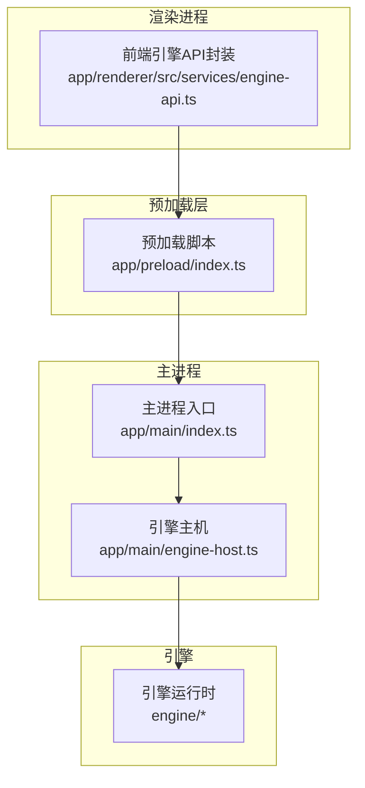
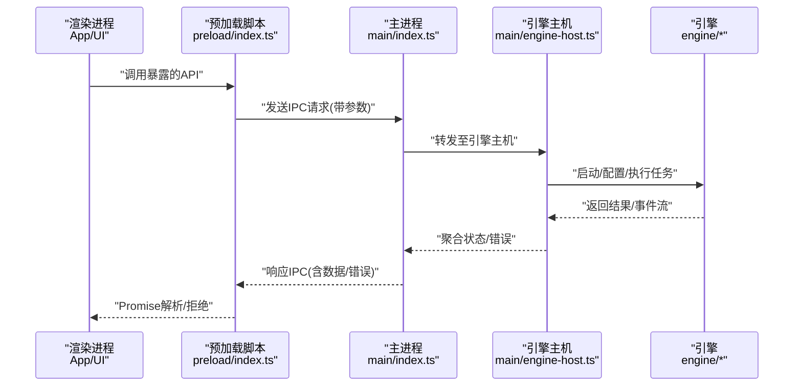
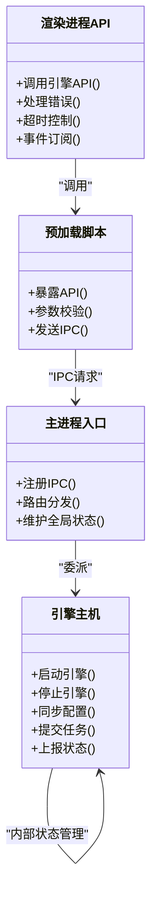
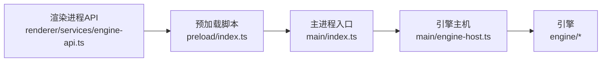

# IPC进程间通信

<cite>
**本文引用的文件**   
- [app/main/index.ts](file://app/main/index.ts)
- [app/main/engine-host.ts](file://app/main/engine-host.ts)
- [app/preload/index.ts](file://app/preload/index.ts)
- [app/renderer/src/services/engine-api.ts](file://app/renderer/src/services/engine-api.ts)
</cite>

## 目录
1. [简介](#简介)
2. [项目结构](#项目结构)
3. [核心组件](#核心组件)
4. [架构总览](#架构总览)
5. [详细组件分析](#详细组件分析)
6. [依赖关系分析](#依赖关系分析)
7. [性能考虑](#性能考虑)
8. [故障排查指南](#故障排查指南)
9. [结论](#结论)
10. [附录](#附录)

## 简介
本文件面向KCoder的IPC（进程间通信）机制，系统性说明Electron主进程与渲染进程之间的通信架构、预加载脚本的职责与安全隔离策略，并记录引擎主机与前端应用之间的通信协议。文档覆盖以下要点：
- 主进程与渲染进程的IPC通道、消息格式与调用方式
- 预加载脚本在安全沙箱中的桥接作用
- 引擎启动、配置同步、任务执行的状态同步流程
- 异步消息处理机制（Promise封装、错误传播、超时控制）
- 示例代码路径（主进程监听器、渲染进程调用者）
- 安全最佳实践（权限控制、输入验证、敏感信息保护）
- 调试方法与常见问题排查

## 项目结构
KCoder采用Electron多进程架构，关键目录与职责如下：
- app/main：主进程入口与宿主逻辑，负责引擎生命周期管理、系统菜单、窗口管理等
- app/preload：预加载脚本，暴露受限API给渲染进程，实现安全桥接
- app/renderer：前端应用，通过预加载暴露的API与主进程/引擎交互
- engine：独立可复用的引擎模块，由主进程以子进程或本地服务形式运行，并通过IPC与前端同步状态

图表来源
- [app/main/index.ts](file://app/main/index.ts)
- [app/main/engine-host.ts](file://app/main/engine-host.ts)
- [app/preload/index.ts](file://app/preload/index.ts)
- [app/renderer/src/services/engine-api.ts](file://app/renderer/src/services/engine-api.ts)

章节来源
- [app/main/index.ts](file://app/main/index.ts)
- [app/main/engine-host.ts](file://app/main/engine-host.ts)
- [app/preload/index.ts](file://app/preload/index.ts)
- [app/renderer/src/services/engine-api.ts](file://app/renderer/src/services/engine-api.ts)

## 核心组件
- 主进程入口：初始化窗口、注册IPC通道、协调引擎主机
- 引擎主机：负责引擎实例的生命周期（启动、停止）、配置下发、任务调度与状态上报
- 预加载脚本：在渲染进程的安全沙箱中暴露受控API，屏蔽原生能力直连
- 渲染进程API封装：为业务组件提供统一的IPC调用接口，统一错误与超时处理

章节来源
- [app/main/index.ts](file://app/main/index.ts)
- [app/main/engine-host.ts](file://app/main/engine-host.ts)
- [app/preload/index.ts](file://app/preload/index.ts)
- [app/renderer/src/services/engine-api.ts](file://app/renderer/src/services/engine-api.ts)

## 架构总览
下图展示从渲染进程发起请求到引擎执行并回传状态的端到端流程。

图表来源
- [app/preload/index.ts](file://app/preload/index.ts)
- [app/main/index.ts](file://app/main/index.ts)
- [app/main/engine-host.ts](file://app/main/engine-host.ts)
- [app/renderer/src/services/engine-api.ts](file://app/renderer/src/services/engine-api.ts)

## 详细组件分析

### 预加载脚本（安全桥接）
- 职责
  - 在渲染进程沙箱内暴露最小化API集合
  - 将渲染进程调用转换为对主进程的IPC请求
  - 统一进行参数校验、错误包装与超时控制
- 安全策略
  - 仅暴露必要方法名，避免直接访问Node/Electron原生对象
  - 对入参进行白名单/类型校验，拒绝非法值
  - 不传递敏感上下文（如文件系统路径、密钥等），如需则通过主进程代理
- 典型暴露接口
  - 引擎相关：启动、停止、配置同步、任务提交、状态订阅
  - 系统相关：窗口操作、日志输出（受限）

章节来源
- [app/preload/index.ts](file://app/preload/index.ts)

### 主进程入口（IPC路由与资源管理）
- 职责
  - 创建并管理渲染窗口
  - 注册IPC通道处理器，按通道名分发到具体业务逻辑
  - 维护全局状态（如当前引擎实例、会话上下文）
- IPC设计
  - 使用命名通道区分不同领域（如“engine:*”、“ui:*”）
  - 请求体包含命令、参数、可选的超时时间
  - 响应体包含成功数据或结构化错误对象
- 与引擎主机协作
  - 将引擎相关的IPC请求委派给引擎主机
  - 将引擎事件广播给所有已订阅的渲染进程

章节来源
- [app/main/index.ts](file://app/main/index.ts)

### 引擎主机（引擎生命周期与状态同步）
- 职责
  - 启动/停止引擎进程或服务
  - 接收并应用配置变更
  - 提交任务并跟踪执行状态
  - 向主进程上报引擎事件（进度、完成、失败）
- 状态同步
  - 使用事件总线或IPC广播将引擎状态推送给渲染进程
  - 支持增量更新与去抖合并，减少UI抖动
- 错误处理
  - 捕获引擎异常，转换为标准错误对象
  - 支持重试与降级策略（如重启引擎）

章节来源
- [app/main/engine-host.ts](file://app/main/engine-host.ts)

### 渲染进程API封装（统一调用与错误处理）
- 职责
  - 为业务组件提供简洁的异步API
  - 封装IPC调用细节（通道名、消息格式、重试、超时）
  - 将底层错误映射为业务友好的错误类型
- 异步模型
  - 基于Promise封装，支持async/await
  - 提供取消与超时控制
  - 支持事件订阅（如任务进度）

章节来源
- [app/renderer/src/services/engine-api.ts](file://app/renderer/src/services/engine-api.ts)

#### 类与方法关系图（概念映射）

图表来源
- [app/preload/index.ts](file://app/preload/index.ts)
- [app/main/index.ts](file://app/main/index.ts)
- [app/main/engine-host.ts](file://app/main/engine-host.ts)
- [app/renderer/src/services/engine-api.ts](file://app/renderer/src/services/engine-api.ts)

## 依赖关系分析
- 耦合度
  - 渲染进程仅依赖预加载脚本暴露的API，降低与主进程的直接耦合
  - 主进程集中管理IPC路由，便于扩展新通道
  - 引擎主机作为引擎与主进程的适配层，屏蔽引擎差异
- 外部依赖
  - Electron IPC（主/渲染）
  - 引擎运行时（可能为子进程或本地服务）
- 潜在循环依赖
  - 通过分层与接口抽象避免循环引用

图表来源
- [app/renderer/src/services/engine-api.ts](file://app/renderer/src/services/engine-api.ts)
- [app/preload/index.ts](file://app/preload/index.ts)
- [app/main/index.ts](file://app/main/index.ts)
- [app/main/engine-host.ts](file://app/main/engine-host.ts)

章节来源
- [app/renderer/src/services/engine-api.ts](file://app/renderer/src/services/engine-api.ts)
- [app/preload/index.ts](file://app/preload/index.ts)
- [app/main/index.ts](file://app/main/index.ts)
- [app/main/engine-host.ts](file://app/main/engine-host.ts)

## 性能考虑
- 批量与去抖
  - 对高频状态更新（如任务进度）进行合并与去抖，减少IPC频率
- 超时与重试
  - 为长耗时操作设置合理超时；对瞬时错误实施有限次重试
- 背压与限流
  - 当引擎负载过高时，限制新任务提交速率，避免阻塞
- 内存与资源
  - 及时释放订阅与事件监听，避免泄漏
  - 大对象传输尽量分片或使用共享内存（若适用）

[本节为通用指导，无需源码引用]

## 故障排查指南
- 常见症状
  - 渲染进程无法收到IPC响应：检查通道名是否一致、主进程是否注册监听器
  - 引擎未启动或崩溃：查看引擎主机日志与退出码，确认启动参数与依赖
  - 超时频繁：评估任务复杂度、网络延迟与超时阈值
- 定位步骤
  - 在主进程与预加载层增加结构化日志（包含通道名、请求ID、耗时）
  - 在引擎主机侧记录任务生命周期事件（开始、进度、结束、错误）
  - 使用浏览器开发者工具观察渲染进程网络与控制台输出
- 恢复策略
  - 自动重启引擎（带退避）
  - 清理无效会话与缓存
  - 降级模式：禁用非关键功能，保障核心可用性

章节来源
- [app/main/index.ts](file://app/main/index.ts)
- [app/main/engine-host.ts](file://app/main/engine-host.ts)
- [app/preload/index.ts](file://app/preload/index.ts)
- [app/renderer/src/services/engine-api.ts](file://app/renderer/src/services/engine-api.ts)

## 结论
KCoder的IPC体系通过“渲染进程→预加载脚本→主进程→引擎主机→引擎”的分层架构，实现了清晰的责任边界与良好的可扩展性。预加载脚本承担安全桥接与参数校验职责，主进程负责路由与资源管理，引擎主机专注引擎生命周期与状态同步，渲染进程API封装简化了上层调用。配合合理的超时、重试与错误处理策略，可在保证安全性的同时获得稳定的用户体验。

[本节为总结，无需源码引用]

## 附录

### IPC通道与消息格式（约定）
- 通道命名建议
  - 引擎域：engine.start、engine.stop、engine.config.sync、engine.task.submit、engine.status.subscribe
  - UI域：ui.window.minimize、ui.window.maximize、ui.log.info
- 请求体字段
  - command：字符串，命令名
  - params：对象，参数集（需遵循白名单与类型约束）
  - timeoutMs：数字，可选，默认值由服务端定义
- 响应体字段
  - ok：布尔，是否成功
  - data：任意，成功时的数据
  - error：对象，失败时的错误信息（code、message、details）
- 事件体字段
  - type：字符串，事件类型
  - payload：对象，事件载荷
  - seq：数字，序列号（用于去重与排序）

[本节为约定说明，无需源码引用]

### 异步消息处理机制
- Promise封装
  - 渲染进程API将IPC调用封装为Promise，支持async/await
- 错误传播
  - 主进程将引擎错误标准化后回传，渲染进程将其映射为业务错误类型
- 超时处理
  - 预加载脚本或渲染进程API在发送前注入超时控制，超时即拒绝Promise并上报错误

章节来源
- [app/preload/index.ts](file://app/preload/index.ts)
- [app/renderer/src/services/engine-api.ts](file://app/renderer/src/services/engine-api.ts)

### 调用示例（路径指引）
- 主进程监听器示例
  - 参考：[app/main/index.ts](file://app/main/index.ts)
- 渲染进程调用者示例
  - 参考：[app/renderer/src/services/engine-api.ts](file://app/renderer/src/services/engine-api.ts)
- 预加载桥接示例
  - 参考：[app/preload/index.ts](file://app/preload/index.ts)

章节来源
- [app/main/index.ts](file://app/main/index.ts)
- [app/preload/index.ts](file://app/preload/index.ts)
- [app/renderer/src/services/engine-api.ts](file://app/renderer/src/services/engine-api.ts)

### 安全最佳实践
- 权限控制
  - 预加载脚本仅暴露最小API集合，禁止直接访问Node/Electron原生能力
  - 主进程对每个IPC通道进行鉴权与审计
- 输入验证
  - 对所有入参进行类型、范围与白名单校验，拒绝非法值
- 敏感信息保护
  - 不在IPC中传输密钥、令牌等敏感数据；如需，使用主进程代理并在内存中安全持有
- 日志脱敏
  - 避免在日志中输出用户隐私与敏感信息

[本节为通用指导，无需源码引用]

### 调试方法
- 启用详细日志
  - 在主进程与引擎主机开启结构化日志，记录通道名、请求ID、耗时与错误堆栈
- 断点与追踪
  - 在预加载脚本与主进程IPC处理器处设置断点，逐步验证消息流转
- 模拟与回放
  - 录制IPC请求与响应，用于回归测试与问题复现

章节来源
- [app/main/index.ts](file://app/main/index.ts)
- [app/main/engine-host.ts](file://app/main/engine-host.ts)
- [app/preload/index.ts](file://app/preload/index.ts)
- [app/renderer/src/services/engine-api.ts](file://app/renderer/src/services/engine-api.ts)