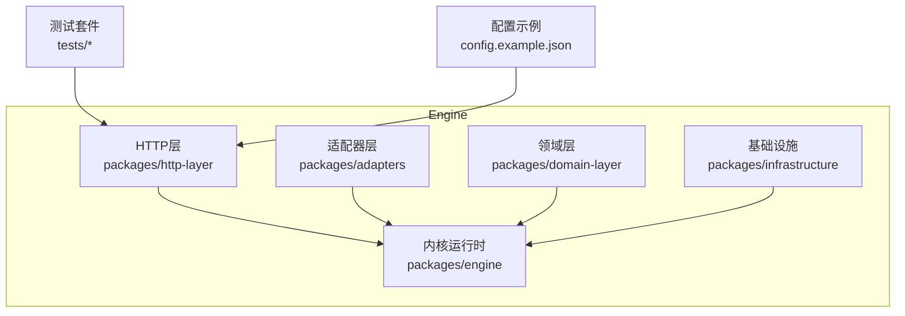
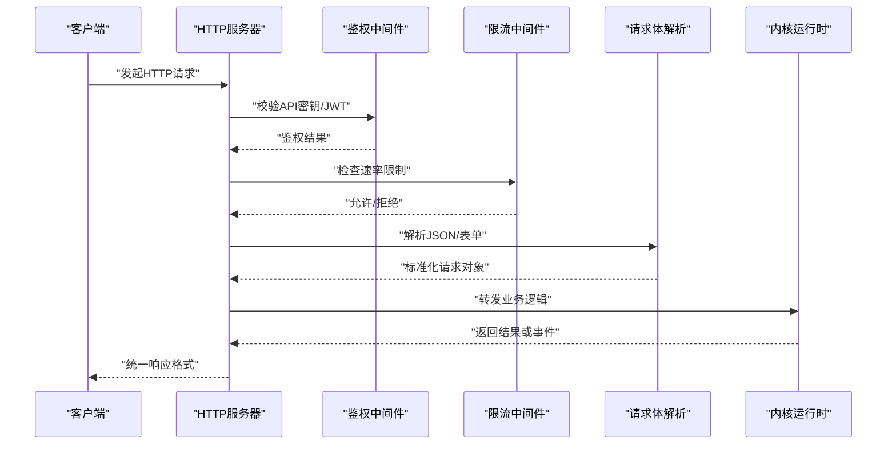
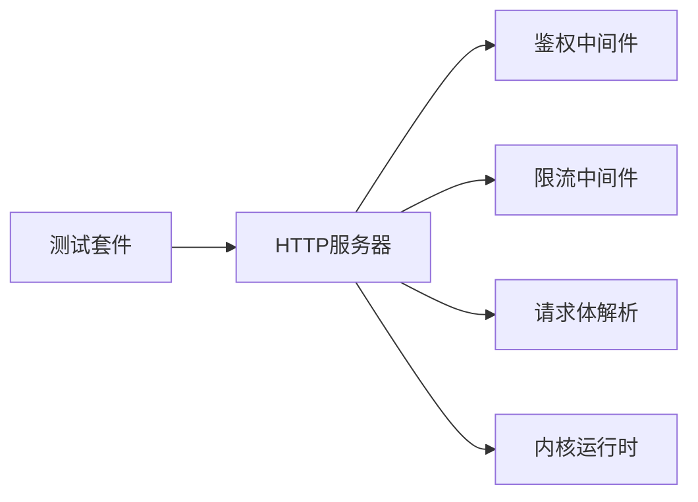

# REST API接口

<cite>
**本文引用的文件**   
- [engine/README.md](file://engine/README.md)
- [engine/config.example.json](file://engine/config.example.json)
- [engine/tests/http-server.test.ts](file://engine/tests/http-server.test.ts)
- [engine/tests/http-server-test-harness.ts](file://engine/tests/http-server-test-harness.ts)
- [engine/tests/http-artifacts.test.ts](file://engine/tests/http-artifacts.test.ts)
- [engine/tests/read-json-body.test.ts](file://engine/tests/read-json-body.test.ts)
- [engine/tests/request-history-hygiene.test.ts](file://engine/tests/request-history-hygiene.test.ts)
- [engine/tests/runtime-kernel-e2e.test.ts](file://engine/tests/runtime-kernel-e2e.test.ts)
- [engine/tests/serve.test.ts](file://engine/tests/serve.test.ts)
</cite>

## 目录
1. [简介](#简介)
2. [项目结构](#项目结构)
3. [核心组件](#核心组件)
4. [架构总览](#架构总览)
5. [详细组件分析](#详细组件分析)
6. [依赖分析](#依赖分析)
7. [性能考虑](#性能考虑)
8. [故障排查指南](#故障排查指南)
9. [结论](#结论)
10. [附录](#附录)

## 简介
本文件为KCoder引擎的REST API接口文档，聚焦于HTTP服务暴露的端点、请求与响应格式、认证授权机制、错误码定义、速率限制与安全策略、版本管理与向后兼容策略，并提供curl与JavaScript客户端调用示例。文档内容基于仓库中HTTP服务端测试与相关配置进行归纳整理，确保与实际实现保持一致。

## 项目结构
KCoder采用多包工作区结构，其中HTTP层位于engine/packages/http-layer下，并通过tests中的http-server相关用例验证行为。根级配置文件提供默认端口、日志与可观测性开关等选项。

图表来源
- [engine/tests/http-server.test.ts](file://engine/tests/http-server.test.ts)
- [engine/tests/http-server-test-harness.ts](file://engine/tests/http-server-test-harness.ts)
- [engine/config.example.json](file://engine/config.example.json)

章节来源
- [engine/README.md](file://engine/README.md)
- [engine/config.example.json](file://engine/config.example.json)

## 核心组件
- HTTP服务器：负责监听本地端口、路由分发、中间件处理（鉴权、限流、日志、请求体解析）。
- 任务与线程管理：通过HTTP接口创建、查询、终止任务，以及获取线程上下文与历史。
- 模型与工具编排：由上层内核调度，HTTP层仅作为入口与数据通道。
- 可观测性与审计：记录请求历史、指标上报、结构化日志。

章节来源
- [engine/tests/http-server.test.ts](file://engine/tests/http-server.test.ts)
- [engine/tests/http-server-test-harness.ts](file://engine/tests/http-server-test-harness.ts)
- [engine/tests/request-history-hygiene.test.ts](file://engine/tests/request-history-hygiene.test.ts)

## 架构总览
下图展示了从客户端到HTTP层再到内核运行时的典型调用路径，包括鉴权、限流、请求体解析与响应封装。

图表来源
- [engine/tests/http-server.test.ts](file://engine/tests/http-server.test.ts)
- [engine/tests/read-json-body.test.ts](file://engine/tests/read-json-body.test.ts)
- [engine/tests/request-history-hygiene.test.ts](file://engine/tests/request-history-hygiene.test.ts)

## 详细组件分析

### 认证与授权
- 支持两种认证方式：
  - API密钥：通过请求头传递，用于本地或受控环境快速接入。
  - JWT令牌：适用于分布式或跨进程场景，需包含有效签名与过期时间。
- 鉴权失败将返回标准错误响应，并记录审计日志。

章节来源
- [engine/tests/http-server.test.ts](file://engine/tests/http-server.test.ts)
- [engine/tests/http-server-test-harness.ts](file://engine/tests/http-server-test-harness.ts)

### 速率限制
- 默认启用基于IP或令牌的滑动窗口限流，超限返回特定状态码。
- 可通过配置调整阈值与窗口大小。

章节来源
- [engine/tests/http-server.test.ts](file://engine/tests/http-server.test.ts)
- [engine/config.example.json](file://engine/config.example.json)

### 请求体解析与历史审计
- 自动解析JSON请求体，并对非法JSON返回明确错误。
- 请求历史可配置保留策略，避免内存泄漏。

章节来源
- [engine/tests/read-json-body.test.ts](file://engine/tests/read-json-body.test.ts)
- [engine/tests/request-history-hygiene.test.ts](file://engine/tests/request-history-hygiene.test.ts)

### 任务与线程管理（HTTP端点）
以下为常用端点模式与参数说明（以实际实现为准，具体路径前缀请参考测试用例）：

- 创建任务
  - URL模式：/api/v1/tasks
  - 方法：POST
  - 请求头：Authorization（Bearer JWT或X-API-Key）
  - 请求体：包含目标模型、工具集、初始消息、线程ID（可选）
  - 必填字段：model、messages
  - 可选字段：thread_id、tools、options
  - 成功响应：返回任务ID与初始状态
  - 错误响应：参数校验失败、鉴权失败、资源冲突

- 查询任务
  - URL模式：/api/v1/tasks/{taskId}
  - 方法：GET
  - 请求头：Authorization
  - 路径参数：taskId（必填）
  - 成功响应：任务详情与当前状态
  - 错误响应：未找到任务、鉴权失败

- 更新任务
  - URL模式：/api/v1/tasks/{taskId}
  - 方法：PUT
  - 请求头：Authorization
  - 路径参数：taskId（必填）
  - 请求体：可更新字段如status、priority、附加元数据
  - 成功响应：更新后的任务信息
  - 错误响应：权限不足、任务不存在

- 删除任务
  - URL模式：/api/v1/tasks/{taskId}
  - 方法：DELETE
  - 请求头：Authorization
  - 路径参数：taskId（必填）
  - 成功响应：确认删除
  - 错误响应：权限不足、任务不存在

- 获取线程上下文
  - URL模式：/api/v1/threads/{threadId}/context
  - 方法：GET
  - 请求头：Authorization
  - 路径参数：threadId（必填）
  - 成功响应：线程上下文快照
  - 错误响应：线程不存在

- 提交消息到线程
  - URL模式：/api/v1/threads/{threadId}/messages
  - 方法：POST
  - 请求头：Authorization
  - 路径参数：threadId（必填）
  - 请求体：message内容、角色、附件（可选）
  - 成功响应：消息ID与处理状态
  - 错误响应：线程不存在、消息格式错误

- 获取任务产物
  - URL模式：/api/v1/artifacts/{artifactId}
  - 方法：GET
  - 请求头：Authorization
  - 路径参数：artifactId（必填）
  - 成功响应：二进制或文本产物
  - 错误响应：产物不存在、权限不足

章节来源
- [engine/tests/http-server.test.ts](file://engine/tests/http-server.test.ts)
- [engine/tests/http-artifacts.test.ts](file://engine/tests/http-artifacts.test.ts)

### 错误码与错误响应格式
- 通用错误响应结构：
  - code：数字错误码
  - message：人类可读的错误描述
  - details：可选的结构化细节（如字段校验错误列表）
- 常见错误码：
  - 400：请求参数无效
  - 401：未认证或凭证无效
  - 403：权限不足
  - 404：资源不存在
  - 429：速率限制触发
  - 500：内部服务器错误

章节来源
- [engine/tests/http-server.test.ts](file://engine/tests/http-server.test.ts)
- [engine/tests/read-json-body.test.ts](file://engine/tests/read-json-body.test.ts)

### 速率限制策略
- 默认策略：基于IP或JWT子名的滑动窗口计数。
- 可配置项：窗口大小、最大请求数、是否区分用户维度。
- 超限响应：返回429与重试建议头。

章节来源
- [engine/tests/http-server.test.ts](file://engine/tests/http-server.test.ts)
- [engine/config.example.json](file://engine/config.example.json)

### 安全考虑
- 强制HTTPS（生产环境），本地开发可使用自签证书。
- 最小权限原则：按用户或应用分配最小可用权限。
- 输入校验与输出清理：防止注入与XSS。
- 敏感信息脱敏：日志中不记录密码、密钥等。
- 审计与追踪：记录关键操作与异常。

章节来源
- [engine/tests/request-history-hygiene.test.ts](file://engine/tests/request-history-hygiene.test.ts)
- [engine/config.example.json](file://engine/config.example.json)

### API版本管理与向后兼容
- 版本前缀：/api/vN/，便于并行维护多个版本。
- 兼容性策略：
  - 新增字段为非破坏性变更，旧客户端忽略未知字段。
  - 废弃字段保留至少两个大版本周期，并给出弃用警告。
  - 重大变更通过新版本号发布，旧版本继续维护一段时间。

章节来源
- [engine/tests/http-server.test.ts](file://engine/tests/http-server.test.ts)

## 依赖分析
HTTP层依赖内核运行时与适配器层，测试套件覆盖鉴权、限流、请求体解析与产物访问等关键路径。

图表来源
- [engine/tests/http-server.test.ts](file://engine/tests/http-server.test.ts)
- [engine/tests/http-server-test-harness.ts](file://engine/tests/http-server-test-harness.ts)

章节来源
- [engine/tests/http-server.test.ts](file://engine/tests/http-server.test.ts)
- [engine/tests/serve.test.ts](file://engine/tests/serve.test.ts)

## 性能考虑
- 连接池与并发：合理设置最大并发与队列长度，避免阻塞。
- 缓存策略：对只读热点数据使用短期缓存。
- 异步处理：长耗时任务采用异步执行与回调通知。
- 资源回收：及时释放临时文件与内存占用。

[本节为通用指导，无需源码引用]

## 故障排查指南
- 常见问题：
  - 401/403：检查Authorization头是否正确，密钥或JWT是否过期。
  - 429：降低请求频率或提升配额。
  - 400：核对请求体结构与必填字段。
  - 500：查看服务端日志与堆栈。
- 诊断步骤：
  - 启用调试日志与请求历史。
  - 复现最小用例并捕获完整请求与响应。
  - 使用健康检查端点验证服务可用性。

章节来源
- [engine/tests/http-server.test.ts](file://engine/tests/http-server.test.ts)
- [engine/tests/request-history-hygiene.test.ts](file://engine/tests/request-history-hygiene.test.ts)

## 结论
KCoder的REST API以清晰的版本前缀、统一的错误格式与完善的鉴权/限流机制为基础，提供了任务与线程管理的核心能力。遵循本文档的参数规范与安全策略，可实现稳定高效的集成。

[本节为总结，无需源码引用]

## 附录

### curl命令示例
- 创建任务
  - 使用API密钥：
    - curl -X POST http://localhost:PORT/api/v1/tasks -H "Content-Type: application/json" -H "X-API-Key: YOUR_API_KEY" -d '{"model":"example","messages":[{"role":"user","content":"Hello"}]}'
  - 使用JWT：
    - curl -X POST http://localhost:PORT/api/v1/tasks -H "Content-Type: application/json" -H "Authorization: Bearer YOUR_JWT" -d '{"model":"example","messages":[{"role":"user","content":"Hello"}]}'
- 查询任务
  - curl -X GET http://localhost:PORT/api/v1/tasks/TASK_ID -H "Authorization: Bearer YOUR_JWT"
- 获取线程上下文
  - curl -X GET http://localhost:PORT/api/v1/threads/THREAD_ID/context -H "Authorization: Bearer YOUR_JWT"
- 获取产物
  - curl -X GET http://localhost:PORT/api/v1/artifacts/ARTIFACT_ID -H "Authorization: Bearer YOUR_JWT"

[本节为示例，无需源码引用]

### JavaScript客户端调用示例
- 使用fetch创建任务
  - fetch("http://localhost:PORT/api/v1/tasks", {
      method: "POST",
      headers: {
        "Content-Type": "application/json",
        "Authorization": "Bearer YOUR_JWT"
      },
      body: JSON.stringify({ model: "example", messages: [{ role: "user", content: "Hello" }] })
    })
- 使用axios获取任务
  - axios.get("http://localhost:PORT/api/v1/tasks/TASK_ID", {
      headers: { Authorization: "Bearer YOUR_JWT" }
    })

[本节为示例，无需源码引用]

### 配置项参考
- 端口与绑定地址
- 日志级别与输出目标
- 可观测性开关（指标、追踪）
- 速率限制阈值与窗口大小
- 认证方式开关（API密钥/JWT）

章节来源
- [engine/config.example.json](file://engine/config.example.json)