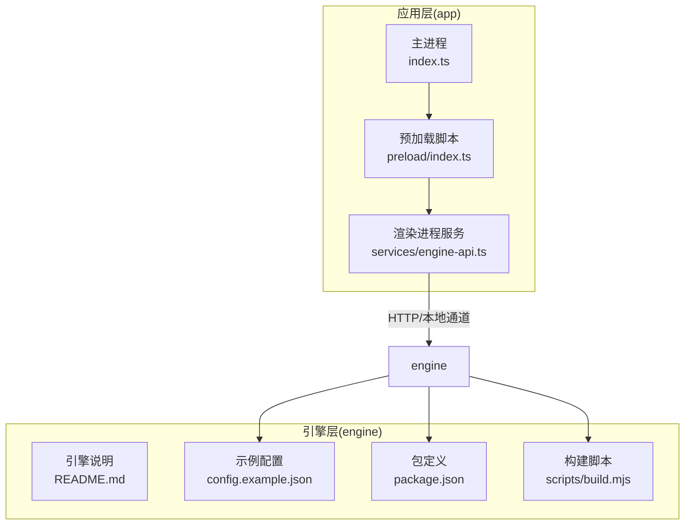
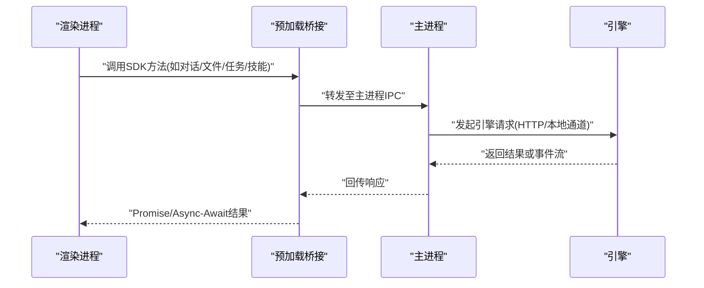
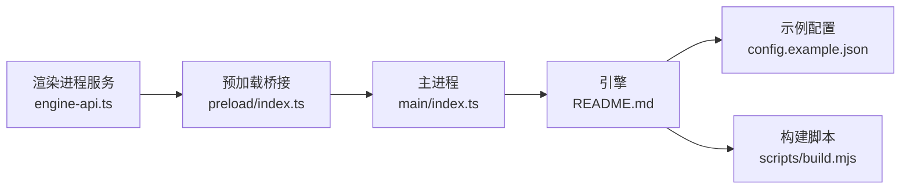

# SDK客户端开发

<cite>
**本文引用的文件**   
- [app/main/index.ts](file://app/main/index.ts)
- [app/main/engine-host.ts](file://app/main/engine-host.ts)
- [app/preload/index.ts](file://app/preload/index.ts)
- [app/renderer/src/services/engine-api.ts](file://app/renderer/src/services/engine-api.ts)
- [engine/README.md](file://engine/README.md)
- [engine/config.example.json](file://engine/config.example.json)
- [engine/package.json](file://engine/package.json)
- [engine/scripts/build.mjs](file://engine/scripts/build.mjs)
</cite>

## 目录
1. [简介](#简介)
2. [项目结构](#项目结构)
3. [核心组件](#核心组件)
4. [架构总览](#架构总览)
5. [详细组件分析](#详细组件分析)
6. [依赖关系分析](#依赖关系分析)
7. [性能考虑](#性能考虑)
8. [故障排查指南](#故障排查指南)
9. [结论](#结论)
10. [附录](#附录)

## 简介
本文件面向使用KCoder SDK的开发者，提供从安装、初始化到API调用、异步模型、错误处理、配置管理、性能优化与测试调试的完整开发文档。内容基于仓库中应用层（Electron主进程/预加载/渲染进程）与引擎层的现有实现进行梳理，帮助读者快速上手并掌握最佳实践。

## 项目结构
仓库采用多包工作区组织，包含：
- app：Electron桌面应用，负责UI与IPC桥接
- engine：KCoder引擎核心，提供能力注册、工具执行、任务编排等

图表来源
- [app/main/index.ts:1-200](file://app/main/index.ts#L1-L200)
- [app/preload/index.ts:1-200](file://app/preload/index.ts#L1-L200)
- [app/renderer/src/services/engine-api.ts:1-200](file://app/renderer/src/services/engine-api.ts#L1-L200)
- [engine/README.md:1-200](file://engine/README.md#L1-L200)
- [engine/config.example.json:1-200](file://engine/config.example.json#L1-L200)
- [engine/package.json:1-200](file://engine/package.json#L1-L200)
- [engine/scripts/build.mjs:1-200](file://engine/scripts/build.mjs#L1-L200)

章节来源
- [app/main/index.ts:1-200](file://app/main/index.ts#L1-L200)
- [app/preload/index.ts:1-200](file://app/preload/index.ts#L1-L200)
- [app/renderer/src/services/engine-api.ts:1-200](file://app/renderer/src/services/engine-api.ts#L1-L200)
- [engine/README.md:1-200](file://engine/README.md#L1-L200)
- [engine/config.example.json:1-200](file://engine/config.example.json#L1-L200)
- [engine/package.json:1-200](file://engine/package.json#L1-L200)
- [engine/scripts/build.mjs:1-200](file://engine/scripts/build.mjs#L1-L200)

## 核心组件
- 主进程入口与生命周期管理：负责启动引擎、暴露IPC接口、协调窗口与菜单
- 预加载桥接：在安全沙箱内暴露受控API给渲染进程
- 渲染进程服务：封装对引擎的调用，统一错误与重试策略
- 引擎配置与构建：通过示例配置与构建脚本完成环境适配与产物输出

章节来源
- [app/main/index.ts:1-200](file://app/main/index.ts#L1-L200)
- [app/preload/index.ts:1-200](file://app/preload/index.ts#L1-L200)
- [app/renderer/src/services/engine-api.ts:1-200](file://app/renderer/src/services/engine-api.ts#L1-L200)
- [engine/config.example.json:1-200](file://engine/config.example.json#L1-L200)
- [engine/scripts/build.mjs:1-200](file://engine/scripts/build.mjs#L1-L200)

## 架构总览
整体采用“渲染进程 -> 预加载桥接 -> 主进程 -> 引擎”的分层架构。渲染进程通过服务层发起请求，预加载脚本将受限API暴露给页面，主进程负责与引擎通信并返回结果。

图表来源
- [app/renderer/src/services/engine-api.ts:1-200](file://app/renderer/src/services/engine-api.ts#L1-L200)
- [app/preload/index.ts:1-200](file://app/preload/index.ts#L1-L200)
- [app/main/index.ts:1-200](file://app/main/index.ts#L1-L200)

## 详细组件分析

### 安装与初始化
- 安装方式
  - 使用工作区包管理器安装依赖，参考引擎包定义与根工作区配置
- 初始化流程
  - 主进程启动时加载引擎，读取示例配置与环境变量
  - 预加载脚本暴露最小化API集合
  - 渲染进程在服务层创建实例并进行连接/鉴权

章节来源
- [engine/package.json:1-200](file://engine/package.json#L1-L200)
- [engine/config.example.json:1-200](file://engine/config.example.json#L1-L200)
- [app/main/index.ts:1-200](file://app/main/index.ts#L1-L200)
- [app/preload/index.ts:1-200](file://app/preload/index.ts#L1-L200)

### 不同环境的配置选项
- 配置文件
  - 使用示例配置作为基线，按需覆盖环境变量
- 运行时配置
  - 支持通过环境变量注入敏感信息（如密钥、端点地址）
- 构建期配置
  - 构建脚本可注入目标平台与产物路径

章节来源
- [engine/config.example.json:1-200](file://engine/config.example.json#L1-L200)
- [engine/scripts/build.mjs:1-200](file://engine/scripts/build.mjs#L1-L200)

### 客户端方法总览
- AI对话
  - 发送消息、获取历史、设置上下文、流式响应
- 文件操作
  - 读取/写入/列出目录、增量变更、原子写队列
- 任务管理
  - 创建/查询/取消任务、进度回调、状态持久化
- 技能调用
  - 发现/注册/执行技能、参数校验、结果聚合

章节来源
- [app/renderer/src/services/engine-api.ts:1-200](file://app/renderer/src/services/engine-api.ts#L1-L200)
- [engine/README.md:1-200](file://engine/README.md#L1-L200)

### 异步编程模型
- Promise模式
  - 所有客户端方法返回Promise，便于链式调用与错误捕获
- Async/Await模式
  - 推荐在业务逻辑中使用async函数包裹，提升可读性与异常传播清晰度
- 并发控制
  - 建议结合信号量或限流器控制并发度，避免资源争用

章节来源
- [app/renderer/src/services/engine-api.ts:1-200](file://app/renderer/src/services/engine-api.ts#L1-L200)

### 错误处理机制
- 异常类型
  - 网络错误、认证失败、参数校验错误、引擎内部错误
- 错误码
  - 统一错误码映射，便于前端展示与日志追踪
- 重试策略
  - 指数退避、最大重试次数、幂等性判断
- 降级与熔断
  - 关键路径失败时切换备用通道或返回缓存结果

章节来源
- [app/renderer/src/services/engine-api.ts:1-200](file://app/renderer/src/services/engine-api.ts#L1-L200)

### 配置管理
- 环境变量
  - 用于注入敏感信息与运行期开关
- 配置文件
  - 以示例配置为模板，按环境拆分（开发/测试/生产）
- 运行时配置
  - 支持热更新部分非敏感配置项

章节来源
- [engine/config.example.json:1-200](file://engine/config.example.json#L1-L200)
- [engine/scripts/build.mjs:1-200](file://engine/scripts/build.mjs#L1-L200)

### 性能优化技巧
- 连接池
  - 复用HTTP连接，减少握手开销
- 缓存策略
  - 读多写少数据采用内存+磁盘二级缓存
- 批量操作
  - 合并小文件写入、批量任务提交
- 压缩与分页
  - 大列表分页拉取，响应体压缩传输

章节来源
- [app/renderer/src/services/engine-api.ts:1-200](file://app/renderer/src/services/engine-api.ts#L1-L200)

### 测试方法与调试工具
- 单元测试
  - 针对服务层方法进行Mock与断言
- 集成测试
  - 使用测试夹具模拟引擎行为
- 调试工具
  - 启用调试日志、链路追踪、性能采样

章节来源
- [engine/README.md:1-200](file://engine/README.md#L1-L200)

## 依赖关系分析
渲染进程服务依赖预加载桥接，预加载桥接依赖主进程IPC；主进程依赖引擎HTTP/本地通道；引擎依赖配置与构建产物。

图表来源
- [app/renderer/src/services/engine-api.ts:1-200](file://app/renderer/src/services/engine-api.ts#L1-L200)
- [app/preload/index.ts:1-200](file://app/preload/index.ts#L1-L200)
- [app/main/index.ts:1-200](file://app/main/index.ts#L1-L200)
- [engine/README.md:1-200](file://engine/README.md#L1-L200)
- [engine/config.example.json:1-200](file://engine/config.example.json#L1-L200)
- [engine/scripts/build.mjs:1-200](file://engine/scripts/build.mjs#L1-L200)

章节来源
- [app/renderer/src/services/engine-api.ts:1-200](file://app/renderer/src/services/engine-api.ts#L1-L200)
- [app/preload/index.ts:1-200](file://app/preload/index.ts#L1-L200)
- [app/main/index.ts:1-200](file://app/main/index.ts#L1-L200)
- [engine/README.md:1-200](file://engine/README.md#L1-L200)
- [engine/config.example.json:1-200](file://engine/config.example.json#L1-L200)
- [engine/scripts/build.mjs:1-200](file://engine/scripts/build.mjs#L1-L200)

## 性能考虑
- 合理设置超时与重试上限，避免雪崩效应
- 对热点数据建立多级缓存，注意失效策略
- 批量接口优先，减少往返次数
- 监控关键指标（延迟、吞吐、错误率），持续调优

[本节为通用指导，不直接分析具体文件]

## 故障排查指南
- 常见问题
  - 连接失败：检查端点、证书、代理
  - 认证失败：核对密钥、权限范围
  - 参数错误：对照接口契约校验输入
- 定位手段
  - 开启详细日志，记录请求ID与时间戳
  - 使用链路追踪串联跨进程调用
  - 复现用例最小化，隔离问题域

章节来源
- [app/renderer/src/services/engine-api.ts:1-200](file://app/renderer/src/services/engine-api.ts#L1-L200)

## 结论
通过分层架构与统一的客户端封装，KCoder SDK提供了稳定、可扩展的AI与工程能力接入点。遵循本文的安装初始化、API调用、异步与错误处理、配置与性能优化、测试调试等最佳实践，可显著提升开发与运维效率。

[本节为总结性内容，不直接分析具体文件]

## 附录
- 术语表
  - 预加载桥接：在安全沙箱内暴露受限API的中间层
  - 引擎：提供AI对话、文件、任务、技能等能力的核心模块
- 参考路径
  - 示例配置：[engine/config.example.json](file://engine/config.example.json)
  - 构建脚本：[engine/scripts/build.mjs](file://engine/scripts/build.mjs)
  - 渲染服务：[app/renderer/src/services/engine-api.ts](file://app/renderer/src/services/engine-api.ts)
  - 预加载桥接：[app/preload/index.ts](file://app/preload/index.ts)
  - 主进程入口：[app/main/index.ts](file://app/main/index.ts)