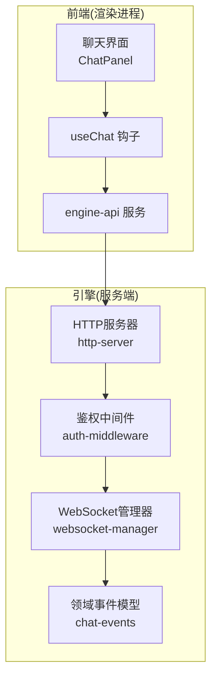
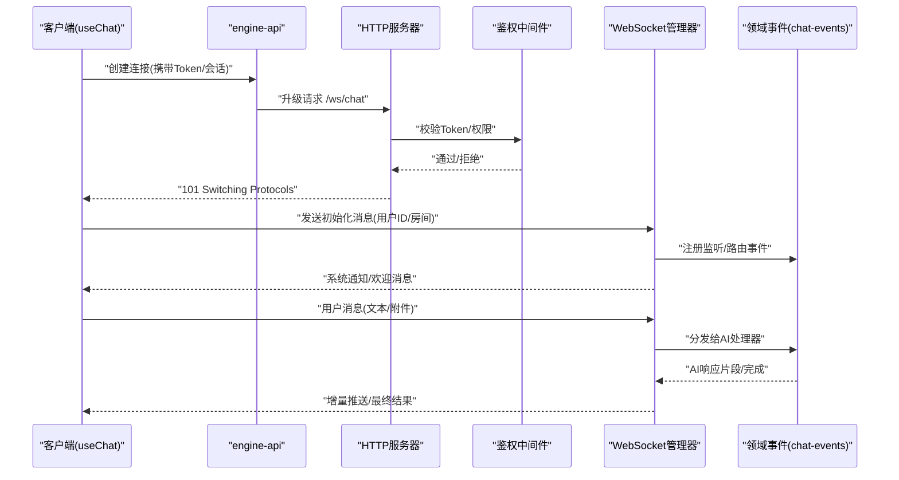
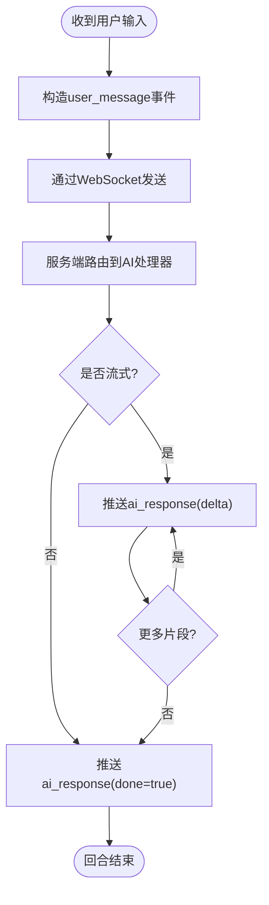
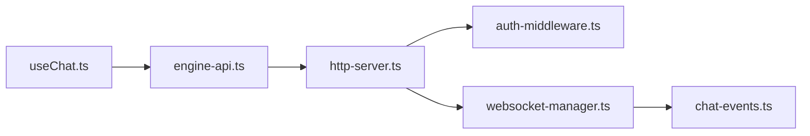

# WebSocket实时通信

<cite>
**本文引用的文件**   
- [app/renderer/src/hooks/useChat.ts](file://app/renderer/src/hooks/useChat.ts)
- [app/renderer/src/services/engine-api.ts](file://app/renderer/src/services/engine-api.ts)
- [engine/packages/ports-layer/http-server.ts](file://engine/packages/ports-layer/http-server.ts)
- [engine/packages/infrastructure/websocket-manager.ts](file://engine/packages/infrastructure/websocket-manager.ts)
- [engine/packages/domain-layer/chat-events.ts](file://engine/packages/domain-layer/chat-events.ts)
- [engine/packages/ports-layer/auth-middleware.ts](file://engine/packages/ports-layer/auth-middleware.ts)
</cite>

## 目录
1. [简介](#简介)
2. [项目结构](#项目结构)
3. [核心组件](#核心组件)
4. [架构总览](#架构总览)
5. [详细组件分析](#详细组件分析)
6. [依赖关系分析](#依赖关系分析)
7. [性能考虑](#性能考虑)
8. [故障排查指南](#故障排查指南)
9. [结论](#结论)
10. [附录](#附录)

## 简介
本文件为KCoder的WebSocket实时通信提供完整的技术文档，覆盖连接建立、握手与认证、消息格式规范、实时聊天事件模型、连接管理（重连、心跳、状态同步）、客户端示例、安全策略以及调试与性能监控建议。目标是帮助前端与后端开发者快速集成并稳定运行基于WebSocket的实时聊天能力。

## 项目结构
KCoder采用前后端分离与分层架构：
- 前端渲染层（Electron Renderer）通过hooks与服务层发起WebSocket连接、收发消息、维护连接状态。
- 引擎侧提供HTTP服务与WebSocket桥接，负责鉴权、路由、会话管理与事件分发。
- 领域层定义聊天事件类型与消息契约，确保前后端一致。

图表来源
- [app/renderer/src/hooks/useChat.ts](file://app/renderer/src/hooks/useChat.ts)
- [app/renderer/src/services/engine-api.ts](file://app/renderer/src/services/engine-api.ts)
- [engine/packages/ports-layer/http-server.ts](file://engine/packages/ports-layer/http-server.ts)
- [engine/packages/infrastructure/websocket-manager.ts](file://engine/packages/infrastructure/websocket-manager.ts)
- [engine/packages/domain-layer/chat-events.ts](file://engine/packages/domain-layer/chat-events.ts)

章节来源
- [app/renderer/src/hooks/useChat.ts](file://app/renderer/src/hooks/useChat.ts)
- [app/renderer/src/services/engine-api.ts](file://app/renderer/src/services/engine-api.ts)
- [engine/packages/ports-layer/http-server.ts](file://engine/packages/ports-layer/http-server.ts)
- [engine/packages/infrastructure/websocket-manager.ts](file://engine/packages/infrastructure/websocket-manager.ts)
- [engine/packages/domain-layer/chat-events.ts](file://engine/packages/domain-layer/chat-events.ts)

## 核心组件
- useChat 钩子：封装WebSocket生命周期、消息订阅、错误处理与重连逻辑，暴露给UI组件使用。
- engine-api 服务：统一网络访问入口，负责构建连接URL、携带认证信息、序列化消息。
- http-server：对外暴露HTTP与WebSocket端点，挂载鉴权中间件，转发到WS管理器。
- websocket-manager：维护连接池、心跳检测、断线重连、广播与定向推送。
- chat-events：定义聊天相关的事件类型与消息结构，作为前后端契约。
- auth-middleware：校验Token或会话，拒绝非法连接。

章节来源
- [app/renderer/src/hooks/useChat.ts](file://app/renderer/src/hooks/useChat.ts)
- [app/renderer/src/services/engine-api.ts](file://app/renderer/src/services/engine-api.ts)
- [engine/packages/ports-layer/http-server.ts](file://engine/packages/ports-layer/http-server.ts)
- [engine/packages/infrastructure/websocket-manager.ts](file://engine/packages/infrastructure/websocket-manager.ts)
- [engine/packages/domain-layer/chat-events.ts](file://engine/packages/domain-layer/chat-events.ts)
- [engine/packages/ports-layer/auth-middleware.ts](file://engine/packages/ports-layer/auth-middleware.ts)

## 架构总览
下图展示从浏览器到引擎的端到端交互流程，包括握手、鉴权、消息路由与事件分发。

图表来源
- [app/renderer/src/hooks/useChat.ts](file://app/renderer/src/hooks/useChat.ts)
- [app/renderer/src/services/engine-api.ts](file://app/renderer/src/services/engine-api.ts)
- [engine/packages/ports-layer/http-server.ts](file://engine/packages/ports-layer/http-server.ts)
- [engine/packages/infrastructure/websocket-manager.ts](file://engine/packages/infrastructure/websocket-manager.ts)
- [engine/packages/domain-layer/chat-events.ts](file://engine/packages/domain-layer/chat-events.ts)

## 详细组件分析

### 连接建立与握手协议
- 连接URL
  - 路径：/ws/chat
  - 查询参数：token（鉴权令牌）、room_id（可选，用于分组或会话隔离）
  - 传输：建议使用wss（TLS加密），生产环境强制HTTPS/WSS
- 握手流程
  - 客户端发起HTTP Upgrade请求，携带Authorization头或Cookie中的token
  - 服务端鉴权中间件验证token有效性及权限范围
  - 鉴权通过后返回101切换协议，建立WebSocket通道
- 认证流程
  - Token来源：登录接口返回的短期有效令牌
  - 校验内容：签名、过期时间、作用域（如是否允许写入聊天）
  - 失败处理：直接关闭连接并返回标准错误码

章节来源
- [app/renderer/src/services/engine-api.ts](file://app/renderer/src/services/engine-api.ts)
- [engine/packages/ports-layer/http-server.ts](file://engine/packages/ports-layer/http-server.ts)
- [engine/packages/ports-layer/auth-middleware.ts](file://engine/packages/ports-layer/auth-middleware.ts)

### 消息格式规范
- 通用消息结构
  - type：事件类型字符串
  - id：消息唯一标识（客户端生成，便于去重与追踪）
  - ts：时间戳（毫秒）
  - payload：业务数据对象，按type定义
- 序列化方式
  - 二进制帧：JSON字符串化后发送
  - 压缩：大消息可启用gzip压缩（可选）
- 事件类型与payload约定
  - user_message：用户消息
    - payload.text：消息文本
    - payload.attachments：附件列表（可选）
  - ai_response：AI响应
    - payload.content：响应内容
    - payload.delta：增量片段（流式场景）
    - payload.done：是否结束
  - system_notification：系统通知
    - payload.code：通知代码
    - payload.message：人类可读提示
  - heartbeat：心跳
    - payload.ping：ping标记
    - payload.pong：pong标记
- 错误消息
  - type：error
  - payload.code：错误码
  - payload.message：错误描述
  - payload.retryable：是否可重试

章节来源
- [engine/packages/domain-layer/chat-events.ts](file://engine/packages/domain-layer/chat-events.ts)

### 实时聊天功能的消息传递机制
- 用户消息
  - 客户端发送user_message事件，包含文本与可选附件
  - 服务端路由至AI处理器，返回ai_response事件
- AI响应
  - 支持流式delta推送，客户端逐步渲染
  - done=true表示一次对话回合结束
- 系统通知
  - 连接建立后的欢迎消息、限流提示、错误告警等
  - 客户端根据code进行差异化处理（如弹窗、静默重试）

图表来源
- [app/renderer/src/hooks/useChat.ts](file://app/renderer/src/hooks/useChat.ts)
- [engine/packages/infrastructure/websocket-manager.ts](file://engine/packages/infrastructure/websocket-manager.ts)
- [engine/packages/domain-layer/chat-events.ts](file://engine/packages/domain-layer/chat-events.ts)

### 连接管理（重连、心跳、状态同步）
- 心跳机制
  - 客户端周期性发送heartbeat.ping
  - 服务端回复heartbeat.pong，超时未收到则判定断开
- 重连策略
  - 指数退避：初始间隔1s，最大间隔30s，抖动±20%
  - 最大重试次数：默认5次，超过则提示用户手动刷新
  - 条件重连：仅对网络异常与临时错误；鉴权失败不自动重连
- 连接状态同步
  - 客户端维护状态机：connecting、connected、reconnecting、disconnected
  - 状态变更触发UI更新与日志上报
  - 断线恢复时，客户端可选择拉取最近N条消息以补齐上下文

章节来源
- [app/renderer/src/hooks/useChat.ts](file://app/renderer/src/hooks/useChat.ts)
- [engine/packages/infrastructure/websocket-manager.ts](file://engine/packages/infrastructure/websocket-manager.ts)

### 客户端连接示例（步骤说明）
- 连接建立
  - 调用engine-api.createConnection(token, room_id)
  - 监听onOpen、onMessage、onError、onClose回调
- 消息发送接收
  - 发送：sendMessage(type, payload)
  - 接收：根据type分支处理user_message、ai_response、system_notification
- 错误处理
  - 捕获网络错误与协议错误，记录日志并触发重连
  - 鉴权错误直接提示用户重新登录
- 资源清理
  - 组件卸载时主动close连接，避免内存泄漏

章节来源
- [app/renderer/src/services/engine-api.ts](file://app/renderer/src/services/engine-api.ts)
- [app/renderer/src/hooks/useChat.ts](file://app/renderer/src/hooks/useChat.ts)

### 安全考虑
- 连接加密
  - 生产环境强制wss，禁用明文ws
  - 证书与域名白名单校验
- 访问控制
  - 鉴权中间件校验token签名、有效期与作用域
  - 支持IP白名单与速率限制
- 消息验证
  - 服务端校验payload结构与字段类型
  - 对超大消息进行大小限制与防注入检查
  - 敏感字段脱敏与审计日志

章节来源
- [engine/packages/ports-layer/auth-middleware.ts](file://engine/packages/ports-layer/auth-middleware.ts)
- [engine/packages/ports-layer/http-server.ts](file://engine/packages/ports-layer/http-server.ts)

## 依赖关系分析
- 前端依赖
  - useChat依赖engine-api提供的连接与消息方法
  - ChatPanel消费useChat暴露的状态与回调
- 后端依赖
  - http-server依赖auth-middleware进行鉴权
  - websocket-manager依赖chat-events定义的事件模型进行路由与分发

图表来源
- [app/renderer/src/hooks/useChat.ts](file://app/renderer/src/hooks/useChat.ts)
- [app/renderer/src/services/engine-api.ts](file://app/renderer/src/services/engine-api.ts)
- [engine/packages/ports-layer/http-server.ts](file://engine/packages/ports-layer/http-server.ts)
- [engine/packages/infrastructure/websocket-manager.ts](file://engine/packages/infrastructure/websocket-manager.ts)
- [engine/packages/domain-layer/chat-events.ts](file://engine/packages/domain-layer/chat-events.ts)
- [engine/packages/ports-layer/auth-middleware.ts](file://engine/packages/ports-layer/auth-middleware.ts)

章节来源
- [app/renderer/src/hooks/useChat.ts](file://app/renderer/src/hooks/useChat.ts)
- [app/renderer/src/services/engine-api.ts](file://app/renderer/src/services/engine-api.ts)
- [engine/packages/ports-layer/http-server.ts](file://engine/packages/ports-layer/http-server.ts)
- [engine/packages/infrastructure/websocket-manager.ts](file://engine/packages/infrastructure/websocket-manager.ts)
- [engine/packages/domain-layer/chat-events.ts](file://engine/packages/domain-layer/chat-events.ts)
- [engine/packages/ports-layer/auth-middleware.ts](file://engine/packages/ports-layer/auth-middleware.ts)

## 性能考虑
- 批量与节流
  - 高频消息合并发送，减少帧数量
  - 前端渲染节流，避免频繁DOM更新
- 压缩与分片
  - 大附件分片上传，先传元数据再传二进制块
  - 启用gzip压缩，权衡CPU与带宽
- 连接复用
  - 多Tab共享同一连接（需服务端会话映射）
- 监控指标
  - 连接成功率、平均延迟、丢包率、重连次数
  - 服务端QPS、内存占用、GC停顿

[本节为通用指导，无需源码引用]

## 故障排查指南
- 常见问题
  - 连接被拒绝：检查token是否过期、作用域是否包含chat.write
  - 心跳超时：检查网络质量与服务端负载
  - 消息乱序：客户端维护序列号，丢弃重复与乱序帧
- 诊断工具
  - 浏览器开发者工具Network面板查看Upgrade与帧
  - 服务端日志输出鉴权结果、路由路径与错误堆栈
- 定位步骤
  - 复现最小用例，确认问题在客户端或服务端
  - 开启详细日志，抓取握手与关键事件
  - 对比chat-events契约，确认前后端结构一致

章节来源
- [engine/packages/ports-layer/auth-middleware.ts](file://engine/packages/ports-layer/auth-middleware.ts)
- [engine/packages/ports-layer/http-server.ts](file://engine/packages/ports-layer/http-server.ts)
- [engine/packages/domain-layer/chat-events.ts](file://engine/packages/domain-layer/chat-events.ts)

## 结论
通过统一的连接管理、清晰的消息契约与严格的安全策略，KCoder的WebSocket实时通信能够稳定支撑聊天、AI响应与系统通知等场景。建议在生产环境启用wss、完善鉴权与限流，并结合监控与日志持续优化性能与可靠性。

[本节为总结性内容，无需源码引用]

## 附录
- 术语表
  - wss：基于TLS的WebSocket
  - delta：增量数据片段
  - 指数退避：重连间隔随尝试次数呈指数增长
- 参考实现位置
  - 前端连接与消息：见useChat与engine-api
  - 服务端握手与鉴权：见http-server与auth-middleware
  - 事件模型：见chat-events

[本节为补充信息，无需源码引用]