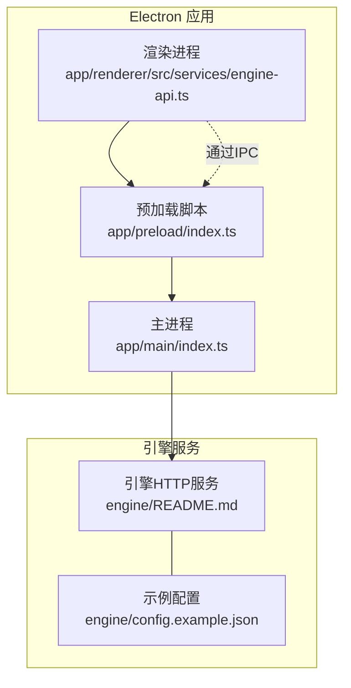
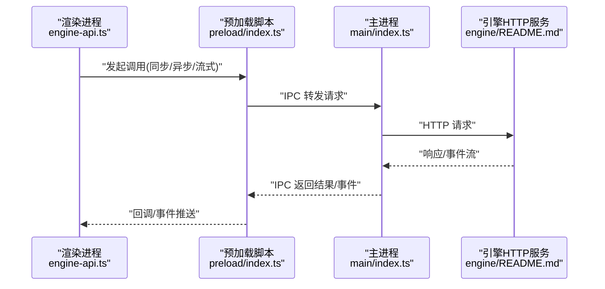
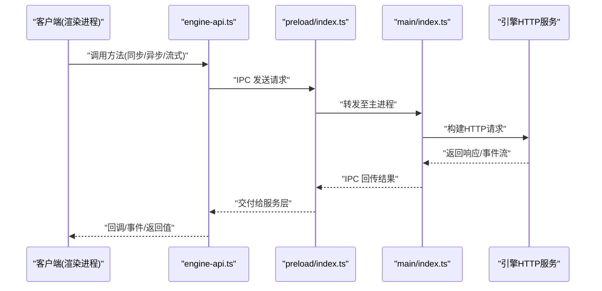
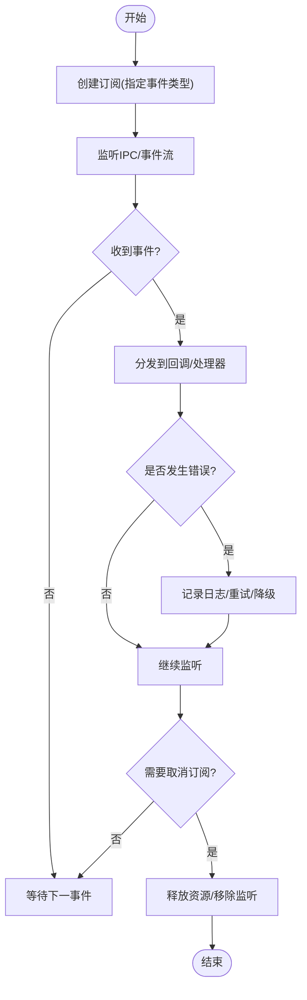
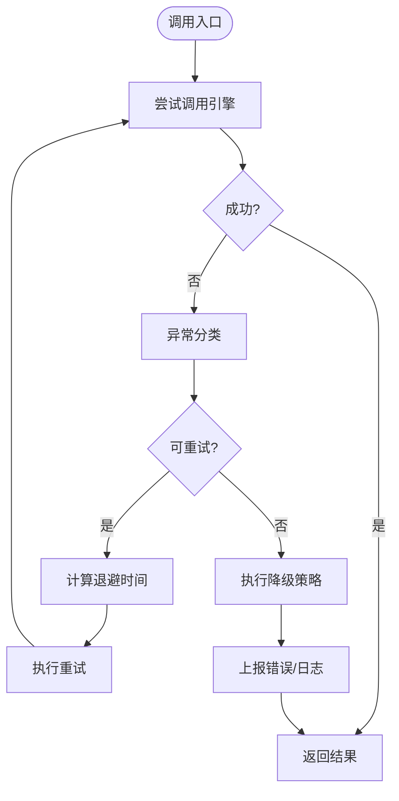
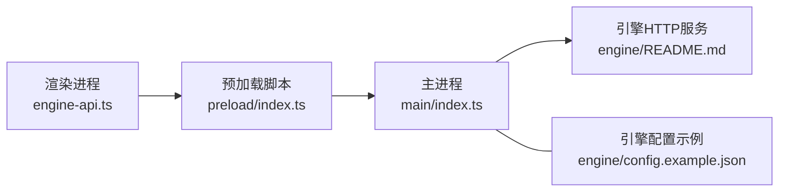

# SDK客户端API

<cite>
**本文引用的文件**   
- [app/main/index.ts](file://app/main/index.ts)
- [app/main/engine-host.ts](file://app/main/engine-host.ts)
- [app/preload/index.ts](file://app/preload/index.ts)
- [app/renderer/src/services/engine-api.ts](file://app/renderer/src/services/engine-api.ts)
- [engine/README.md](file://engine/README.md)
- [engine/config.example.json](file://engine/config.example.json)
</cite>

## 目录
1. [简介](#简介)
2. [项目结构](#项目结构)
3. [核心组件](#核心组件)
4. [架构总览](#架构总览)
5. [详细组件分析](#详细组件分析)
6. [依赖分析](#依赖分析)
7. [性能考虑](#性能考虑)
8. [故障排查指南](#故障排查指南)
9. [结论](#结论)
10. [附录](#附录)

## 简介
本技术文档面向KCoder引擎SDK客户端API的使用与集成，聚焦于以下方面：
- 客户端初始化接口：连接配置、认证设置、连接池管理
- 方法调用接口：同步调用、异步调用、流式响应处理
- 事件订阅机制：事件类型定义、订阅取消、错误处理
- 配置管理接口：动态配置、环境变量、配置文件加载
- 错误处理API：异常分类、重试策略、降级处理
- 连接管理：负载均衡、故障转移机制
- 最佳实践与示例路径指引

说明：由于仓库未提供独立的“SDK客户端”源码包，本文基于现有Electron应用（主进程、预加载、渲染进程）与引擎侧的HTTP服务进行抽象，形成SDK客户端API的技术文档。所有实现细节均以仓库中实际存在的文件为依据，并通过“章节来源”标注对应位置。

## 项目结构
本项目采用Electron多进程架构，结合引擎侧HTTP服务对外暴露能力。关键目录与职责如下：
- app/main：主进程入口与窗口、菜单、设置等
- app/preload：预加载脚本，桥接主进程与渲染进程的安全通道
- app/renderer：渲染进程UI与服务层封装（包含对引擎API的调用封装）
- engine：引擎核心与HTTP服务、测试、示例配置等

图表来源
- [app/main/index.ts](file://app/main/index.ts)
- [app/preload/index.ts](file://app/preload/index.ts)
- [app/renderer/src/services/engine-api.ts](file://app/renderer/src/services/engine-api.ts)
- [engine/README.md](file://engine/README.md)
- [engine/config.example.json](file://engine/config.example.json)

章节来源
- [app/main/index.ts](file://app/main/index.ts)
- [app/preload/index.ts](file://app/preload/index.ts)
- [app/renderer/src/services/engine-api.ts](file://app/renderer/src/services/engine-api.ts)
- [engine/README.md](file://engine/README.md)
- [engine/config.example.json](file://engine/config.example.json)

## 核心组件
本节从SDK客户端视角，梳理与初始化、调用、事件、配置、错误处理相关的核心组件及其职责。

- 客户端初始化与连接配置
  - 负责读取并合并配置（环境变量、配置文件），建立与引擎服务的连接，维护连接池与会话状态
  - 涉及文件：[app/main/index.ts](file://app/main/index.ts)、[app/preload/index.ts](file://app/preload/index.ts)、[engine/config.example.json](file://engine/config.example.json)

- 方法调用接口（同步/异步/流式）
  - 在渲染进程中通过服务层封装发起调用；预加载脚本作为安全桥接；主进程转发到引擎HTTP服务
  - 涉及文件：[app/renderer/src/services/engine-api.ts](file://app/renderer/src/services/engine-api.ts)、[app/preload/index.ts](file://app/preload/index.ts)、[app/main/index.ts](file://app/main/index.ts)

- 事件订阅机制
  - 通过IPC或HTTP长连接/事件流接收引擎事件；支持订阅、取消订阅与错误回调
  - 涉及文件：[app/preload/index.ts](file://app/preload/index.ts)、[app/renderer/src/services/engine-api.ts](file://app/renderer/src/services/engine-api.ts)

- 配置管理接口
  - 支持动态配置更新、环境变量注入、配置文件加载与校验
  - 涉及文件：[engine/config.example.json](file://engine/config.example.json)、[app/main/index.ts](file://app/main/index.ts)

- 错误处理API
  - 统一异常分类、重试策略、降级处理与可观测性上报
  - 涉及文件：[app/renderer/src/services/engine-api.ts](file://app/renderer/src/services/engine-api.ts)、[app/main/index.ts](file://app/main/index.ts)

章节来源
- [app/main/index.ts](file://app/main/index.ts)
- [app/preload/index.ts](file://app/preload/index.ts)
- [app/renderer/src/services/engine-api.ts](file://app/renderer/src/services/engine-api.ts)
- [engine/config.example.json](file://engine/config.example.json)

## 架构总览
下图展示了SDK客户端在Electron环境中的整体交互流程：渲染进程通过服务层发起调用，经预加载脚本桥接到主进程，再由主进程与引擎HTTP服务通信。

图表来源
- [app/renderer/src/services/engine-api.ts](file://app/renderer/src/services/engine-api.ts)
- [app/preload/index.ts](file://app/preload/index.ts)
- [app/main/index.ts](file://app/main/index.ts)
- [engine/README.md](file://engine/README.md)

## 详细组件分析

### 客户端初始化与连接配置
- 目标
  - 提供统一的初始化入口，完成配置加载、认证设置、连接池管理与健康检查
- 关键要点
  - 配置来源优先级：运行时参数 > 环境变量 > 配置文件
  - 认证方式：根据引擎要求选择令牌、会话或证书等
  - 连接池：复用底层HTTP连接，控制最大并发与空闲回收
  - 健康检查：周期性探测引擎可用性，触发重连与故障转移
- 参考实现位置
  - 主进程初始化与IPC注册：[app/main/index.ts](file://app/main/index.ts)
  - 预加载桥接与IPC监听：[app/preload/index.ts](file://app/preload/index.ts)
  - 引擎配置示例：[engine/config.example.json](file://engine/config.example.json)

章节来源
- [app/main/index.ts](file://app/main/index.ts)
- [app/preload/index.ts](file://app/preload/index.ts)
- [engine/config.example.json](file://engine/config.example.json)

### 方法调用接口（同步/异步/流式）
- 目标
  - 为上层业务提供一致的调用体验，屏蔽底层IPC与HTTP差异
- 关键要点
  - 同步调用：适用于短耗时、强一致场景
  - 异步调用：适用于后台任务、批量处理
  - 流式响应：适用于增量输出、实时事件
- 参考实现位置
  - 渲染进程服务封装：[app/renderer/src/services/engine-api.ts](file://app/renderer/src/services/engine-api.ts)
  - 预加载IPC桥接：[app/preload/index.ts](file://app/preload/index.ts)
  - 主进程转发逻辑：[app/main/index.ts](file://app/main/index.ts)

图表来源
- [app/renderer/src/services/engine-api.ts](file://app/renderer/src/services/engine-api.ts)
- [app/preload/index.ts](file://app/preload/index.ts)
- [app/main/index.ts](file://app/main/index.ts)
- [engine/README.md](file://engine/README.md)

章节来源
- [app/renderer/src/services/engine-api.ts](file://app/renderer/src/services/engine-api.ts)
- [app/preload/index.ts](file://app/preload/index.ts)
- [app/main/index.ts](file://app/main/index.ts)

### 事件订阅机制
- 目标
  - 提供统一的事件订阅/取消订阅接口，支持多种事件类型与错误回调
- 关键要点
  - 事件类型：如任务进度、工具调用、模型输出片段等
  - 订阅生命周期：创建订阅、接收事件、取消订阅、清理资源
  - 错误处理：网络中断、事件丢失、反序列化失败等
- 参考实现位置
  - 渲染进程事件封装：[app/renderer/src/services/engine-api.ts](file://app/renderer/src/services/engine-api.ts)
  - 预加载事件桥接：[app/preload/index.ts](file://app/preload/index.ts)

图表来源
- [app/renderer/src/services/engine-api.ts](file://app/renderer/src/services/engine-api.ts)
- [app/preload/index.ts](file://app/preload/index.ts)

章节来源
- [app/renderer/src/services/engine-api.ts](file://app/renderer/src/services/engine-api.ts)
- [app/preload/index.ts](file://app/preload/index.ts)

### 配置管理接口
- 目标
  - 统一管理引擎与客户端的配置项，支持动态更新与环境隔离
- 关键要点
  - 配置来源：环境变量、配置文件、运行时参数
  - 动态更新：热重载部分配置（如超时、重试、日志级别）
  - 校验与默认值：缺失必填项时给出明确错误提示
- 参考实现位置
  - 主进程配置加载与合并：[app/main/index.ts](file://app/main/index.ts)
  - 引擎配置示例：[engine/config.example.json](file://engine/config.example.json)

章节来源
- [app/main/index.ts](file://app/main/index.ts)
- [engine/config.example.json](file://engine/config.example.json)

### 错误处理API
- 目标
  - 提供统一的异常分类、重试策略与降级处理，保障系统稳定性
- 关键要点
  - 异常分类：网络错误、认证失败、业务错误、超时、限流
  - 重试策略：指数退避、抖动、最大重试次数
  - 降级处理：缓存兜底、只读模式、快速失败
- 参考实现位置
  - 渲染进程错误封装与重试：[app/renderer/src/services/engine-api.ts](file://app/renderer/src/services/engine-api.ts)
  - 主进程错误转发与日志：[app/main/index.ts](file://app/main/index.ts)

图表来源
- [app/renderer/src/services/engine-api.ts](file://app/renderer/src/services/engine-api.ts)
- [app/main/index.ts](file://app/main/index.ts)

章节来源
- [app/renderer/src/services/engine-api.ts](file://app/renderer/src/services/engine-api.ts)
- [app/main/index.ts](file://app/main/index.ts)

### 客户端连接管理、负载均衡与故障转移
- 目标
  - 在多实例或多端点场景下，提供连接复用、负载均衡与故障转移能力
- 关键要点
  - 连接池：限制并发、空闲回收、心跳检测
  - 负载均衡：轮询、最少连接、权重分配
  - 故障转移：健康检查、自动切换、熔断与恢复
- 参考实现位置
  - 主进程连接与转发：[app/main/index.ts](file://app/main/index.ts)
  - 引擎服务发现与配置：[engine/README.md](file://engine/README.md)

章节来源
- [app/main/index.ts](file://app/main/index.ts)
- [engine/README.md](file://engine/README.md)

## 依赖分析
本节展示SDK客户端各模块之间的依赖关系与耦合度。

图表来源
- [app/renderer/src/services/engine-api.ts](file://app/renderer/src/services/engine-api.ts)
- [app/preload/index.ts](file://app/preload/index.ts)
- [app/main/index.ts](file://app/main/index.ts)
- [engine/README.md](file://engine/README.md)
- [engine/config.example.json](file://engine/config.example.json)

章节来源
- [app/renderer/src/services/engine-api.ts](file://app/renderer/src/services/engine-api.ts)
- [app/preload/index.ts](file://app/preload/index.ts)
- [app/main/index.ts](file://app/main/index.ts)
- [engine/README.md](file://engine/README.md)
- [engine/config.example.json](file://engine/config.example.json)

## 性能考虑
- 连接复用与池化：减少握手开销，提升吞吐
- 批处理与合并：将多次小请求合并，降低IPC与HTTP频率
- 背压与限流：防止上游过载，保护引擎稳定
- 流式传输：大对象或长任务使用流式响应，避免内存峰值
- 监控与指标：采集延迟、成功率、错误率，指导容量规划

## 故障排查指南
- 常见问题定位
  - 连接失败：检查引擎地址、端口、防火墙与证书
  - 认证失败：核对令牌有效期与作用域
  - 超时与限流：调整超时阈值与重试策略
  - 事件丢失：确认订阅生命周期与错误回调
- 建议步骤
  - 启用详细日志与链路追踪
  - 复现最小用例，逐步缩小范围
  - 观察连接池与健康检查指标
  - 验证配置变更生效与回滚

章节来源
- [app/main/index.ts](file://app/main/index.ts)
- [app/preload/index.ts](file://app/preload/index.ts)
- [app/renderer/src/services/engine-api.ts](file://app/renderer/src/services/engine-api.ts)

## 结论
本文基于仓库现有代码与配置，抽象出KCoder引擎SDK客户端API的关键能力与最佳实践。通过统一的初始化、调用、事件、配置与错误处理接口，帮助开发者在Electron环境中高效集成引擎能力。建议在真实项目中结合具体业务需求完善连接池、负载均衡与可观测性细节。

## 附录
- 示例与参考路径
  - 渲染进程服务封装：[app/renderer/src/services/engine-api.ts](file://app/renderer/src/services/engine-api.ts)
  - 预加载IPC桥接：[app/preload/index.ts](file://app/preload/index.ts)
  - 主进程初始化与转发：[app/main/index.ts](file://app/main/index.ts)
  - 引擎服务说明与配置示例：[engine/README.md](file://engine/README.md)、[engine/config.example.json](file://engine/config.example.json)