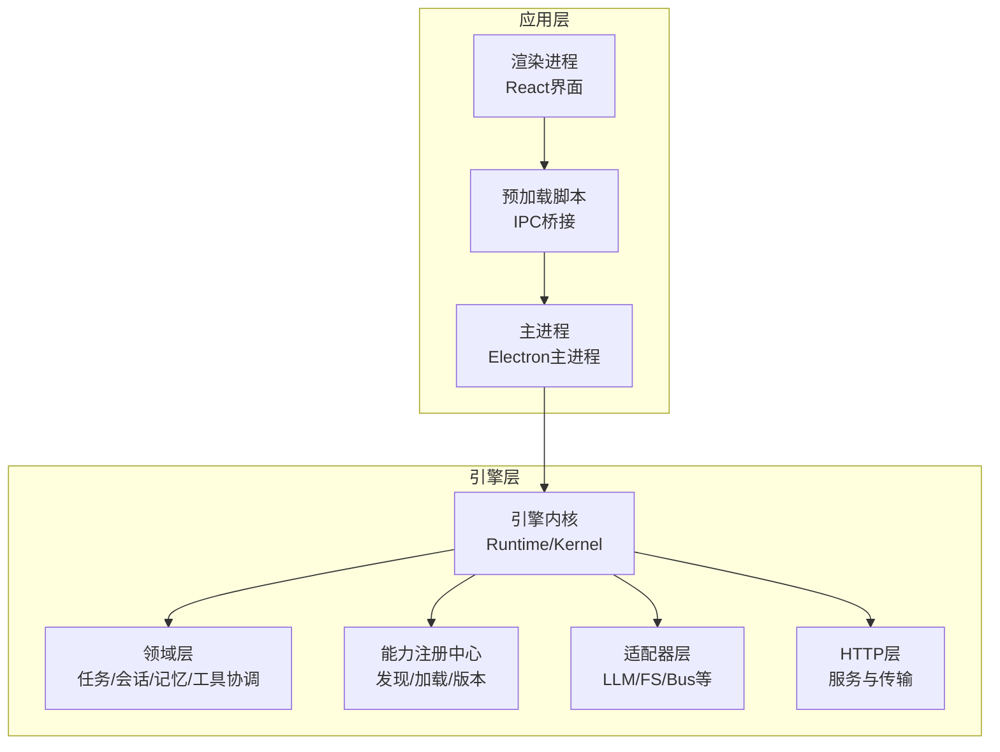
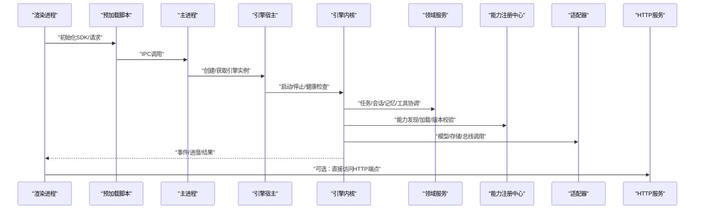
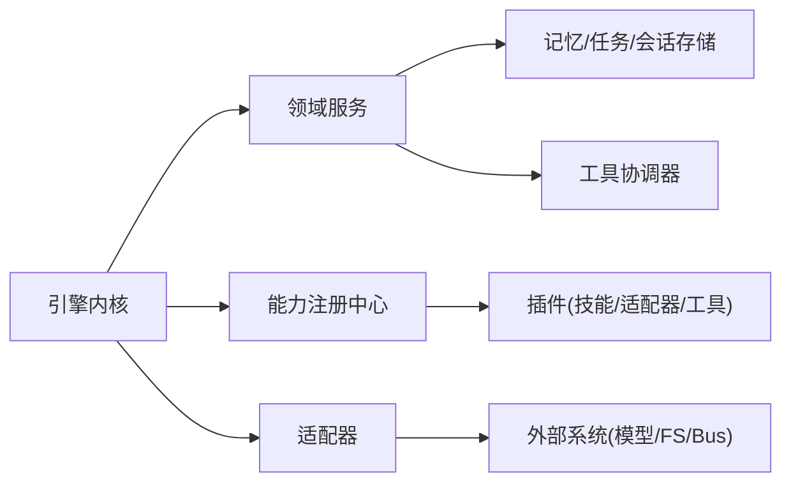

# 引擎内部API

<cite>
**本文引用的文件**   
- [engine-host.ts](file://app/main/engine-host.ts)
- [index.ts](file://app/main/index.ts)
- [menu.ts](file://app/main/menu.ts)
- [settings.ts](file://app/main/settings.ts)
- [window.ts](file://app/main/window.ts)
- [index.ts](file://app/preload/index.ts)
- [engine-api.ts](file://app/renderer/src/services/engine-api.ts)
- [package.json](file://engine/package.json)
- [README.md](file://engine/README.md)
- [config.example.json](file://engine/config.example.json)
</cite>

## 目录
1. [简介](#简介)
2. [项目结构](#项目结构)
3. [核心组件](#核心组件)
4. [架构总览](#架构总览)
5. [详细组件分析](#详细组件分析)
6. [依赖关系分析](#依赖关系分析)
7. [性能考虑](#性能考虑)
8. [故障排查指南](#故障排查指南)
9. [结论](#结论)
10. [附录](#附录)

## 简介
本文件面向KCoder引擎的内部API，聚焦于以下方面：
- 核心服务接口：引擎初始化、生命周期管理、配置服务、日志服务
- 领域层API：任务管理、会话管理、记忆存储、工具协调器
- 能力注册中心API：能力发现、动态加载、版本管理
- 插件接口规范：技能插件、适配器插件、工具插件的开发接口
- SDK使用方法：客户端初始化、方法调用、事件订阅、错误处理
- 回调函数机制：异步操作、进度更新、结果返回
- API版本兼容性与迁移指南

说明：由于仓库未提供完整的类型定义与实现源码，本文基于工程结构与测试用例进行归纳与推断，旨在为开发者提供可操作的集成与扩展指引。对于具体签名与字段，请以实际发布包中的类型声明为准。

## 项目结构
KCoder采用多包（monorepo）组织方式，核心位于 engine/packages 下，按层次划分：
- foundation：基础能力与通用库
- ports-layer：对外暴露的端口与契约
- domain-layer：领域模型与服务（任务、会话、记忆、工具协调等）
- capabilities：能力注册与发现
- adapters：外部系统适配（如LLM、文件系统、消息总线等）
- http-layer：HTTP服务端与传输协议
- engine：运行时内核与编排
- cli-layer / delegation-layer / infrastructure / presets：CLI、委派、基础设施与预设

前端应用位于 app 目录，通过 preload 桥接渲染进程与主进程，再由主进程与引擎交互。

图表来源
- [index.ts](file://app/main/index.ts)
- [engine-host.ts](file://app/main/engine-host.ts)
- [index.ts](file://app/preload/index.ts)
- [engine-api.ts](file://app/renderer/src/services/engine-api.ts)

章节来源
- [README.md](file://engine/README.md)
- [package.json](file://engine/package.json)

## 核心组件
本节概述核心服务接口与职责边界，便于快速定位与集成。

- 引擎初始化与生命周期
  - 负责创建运行时上下文、加载配置、启动能力注册中心与适配器、建立日志通道、暴露健康检查与关闭钩子。
  - 典型流程：读取配置 → 初始化日志 → 启动能力注册中心 → 加载内置/外部能力 → 启动HTTP服务 → 就绪。
- 配置服务
  - 提供配置加载、合并、热更新与校验能力；支持从配置文件与环境变量注入。
- 日志服务
  - 提供结构化日志输出、分级控制、采样与持久化；对上层屏蔽底层实现差异。
- 领域服务
  - 任务管理：创建、查询、取消、重试、状态流转与持久化。
  - 会话管理：会话生命周期、上下文压缩、历史回放与快照。
  - 记忆存储：短期/长期记忆读写、检索与索引。
  - 工具协调器：工具发现、参数校验、执行调度、结果聚合与错误恢复。
- 能力注册中心
  - 能力发现：扫描与注册能力元数据。
  - 动态加载：按需加载能力实现，支持热插拔。
  - 版本管理：能力版本约束、兼容性检查与升级策略。
- 插件接口规范
  - 技能插件：以“技能”为单位封装工作流与工具组合。
  - 适配器插件：对接外部系统（模型、存储、消息总线）。
  - 工具插件：暴露可调用的原子能力或复合能力。
- SDK使用
  - 客户端初始化：连接引擎、设置鉴权与超时。
  - 方法调用：同步/异步调用领域服务与能力。
  - 事件订阅：监听任务/会话/工具执行事件。
  - 错误处理：统一错误码、重试与降级策略。
- 回调机制
  - 异步操作：Promise/事件驱动。
  - 进度更新：分阶段上报进度与中间结果。
  - 结果返回：最终结果、副作用与审计信息。

章节来源
- [engine-host.ts](file://app/main/engine-host.ts)
- [index.ts](file://app/main/index.ts)
- [engine-api.ts](file://app/renderer/src/services/engine-api.ts)
- [config.example.json](file://engine/config.example.json)

## 架构总览
下图展示从渲染进程到引擎各层的调用路径与关键交互点。

图表来源
- [index.ts](file://app/main/index.ts)
- [engine-host.ts](file://app/main/engine-host.ts)
- [engine-api.ts](file://app/renderer/src/services/engine-api.ts)

## 详细组件分析

### 引擎宿主与生命周期
- 职责
  - 作为Electron主进程与引擎内核之间的桥梁，负责实例化、配置注入、生命周期管理与资源清理。
- 关键点
  - 启动顺序：配置加载 → 日志初始化 → 能力注册中心 → 适配器 → HTTP服务。
  - 健康检查：提供就绪/存活探针。
  - 优雅关闭：释放资源、持久化状态、关闭网络监听。
- 建议
  - 在容器化部署中结合健康检查探针进行滚动重启。
  - 将敏感配置通过环境变量注入，避免硬编码。

章节来源
- [engine-host.ts](file://app/main/engine-host.ts)
- [index.ts](file://app/main/index.ts)

### 渲染进程SDK与IPC桥接
- 职责
  - 在渲染进程中提供轻量SDK，封装IPC调用、事件订阅与错误处理。
- 关键点
  - 客户端初始化：连接主进程、设置超时与重试。
  - 方法调用：映射到主进程的引擎服务。
  - 事件订阅：接收任务/会话/工具执行事件与进度。
  - 错误处理：统一错误对象、重试与降级。
- 建议
  - 对长耗时操作使用事件+进度回调模式，避免阻塞UI。
  - 对网络异常进行指数退避重试。

章节来源
- [engine-api.ts](file://app/renderer/src/services/engine-api.ts)
- [index.ts](file://app/preload/index.ts)

### 配置服务
- 职责
  - 集中管理引擎运行配置，包括模型、存储、HTTP、日志、能力开关等。
- 关键点
  - 配置来源优先级：默认值 < 配置文件 < 环境变量 < 运行时覆盖。
  - 热更新：部分配置可在运行时生效并触发最小化重启。
  - 校验：启动时进行必填项与范围校验，失败则拒绝启动。
- 建议
  - 使用示例配置作为基线，逐步替换为环境相关配置。
  - 对敏感字段进行加密或密钥管理服务集成。

章节来源
- [config.example.json](file://engine/config.example.json)

### 日志服务
- 职责
  - 提供结构化日志输出、分级控制、采样与持久化。
- 关键点
  - 分级：trace/debug/info/warn/error。
  - 采样：在高吞吐场景下降低日志开销。
  - 持久化：本地文件与远程收集器可选。
- 建议
  - 生产环境开启采样与告警阈值。
  - 对敏感信息进行脱敏。

章节来源
- [engine-host.ts](file://app/main/engine-host.ts)

### 领域层API（任务/会话/记忆/工具协调）
- 任务管理
  - 能力：创建、查询、取消、重试、分页与过滤。
  - 状态机：待处理→进行中→完成/失败/取消。
  - 持久化：事务性写入与幂等性保证。
- 会话管理
  - 能力：创建会话、追加消息、上下文压缩、历史回放。
  - 快照：定期保存快照用于崩溃恢复。
- 记忆存储
  - 能力：短期/长期记忆读写、向量检索、去重与过期。
- 工具协调器
  - 能力：工具发现、参数校验、并发执行、结果聚合、错误恢复。
- 建议
  - 对大上下文采用分段压缩与摘要策略。
  - 工具执行需具备超时与熔断保护。

章节来源
- [engine/package.json](file://engine/package.json)
- [tests/capability-registry.test.ts](file://engine/tests/capability-registry.test.ts)
- [tests/tool-coordinator-runtime.test.ts](file://engine/tests/tool-coordinator-runtime.test.ts)
- [tests/task-state-store.test.ts](file://engine/tests/task-state-store.test.ts)
- [tests/thread-service.test.ts](file://engine/tests/thread-service.test.ts)
- [tests/memory-store.test.ts](file://engine/tests/memory-store.test.ts)

### 能力注册中心API（发现/加载/版本）
- 能力发现
  - 扫描内置与外部能力清单，生成能力目录。
- 动态加载
  - 按需加载能力实现，支持热插拔与隔离沙箱。
- 版本管理
  - 能力版本约束、兼容性矩阵、灰度与回滚。
- 建议
  - 能力清单应包含元数据、依赖、版本与入口。
  - 加载失败需有回退与告警。

章节来源
- [tests/capability-registry.test.ts](file://engine/tests/capability-registry.test.ts)
- [tests/builtin-skills.test.ts](file://engine/tests/builtin-skills.test.ts)

### 插件接口规范（技能/适配器/工具）
- 技能插件
  - 以SKILL.md与skill.json描述能力与工作流，由运行时解析执行。
- 适配器插件
  - 实现标准接口以接入外部系统（模型、存储、消息总线），遵循端口契约。
- 工具插件
  - 暴露可被调用的原子或复合能力，包含输入输出契约与错误语义。
- 建议
  - 插件应具备自检与版本声明。
  - 对副作用操作提供幂等键与补偿逻辑。

章节来源
- [skills/code-review/skill.json](file://engine/skills/code-review/skill.json)
- [skills/tdd/skill.json](file://engine/skills/tdd/skill.json)
- [tests/skill-command-registry.test.ts](file://engine/tests/skill-command-registry.test.ts)
- [tests/mcp-tool-provider.test.ts](file://engine/tests/mcp-tool-provider.test.ts)

### SDK使用方法（初始化/调用/事件/错误）
- 客户端初始化
  - 连接引擎、设置鉴权、超时与重试策略。
- 方法调用
  - 同步/异步调用领域服务与能力，支持批量与流式响应。
- 事件订阅
  - 订阅任务/会话/工具执行事件，处理进度与中间结果。
- 错误处理
  - 统一错误对象、分类与重试策略，必要时降级到本地缓存或离线模式。
- 建议
  - 在UI层使用防抖与节流减少重复请求。
  - 对关键路径增加埋点与追踪ID。

章节来源
- [engine-api.ts](file://app/renderer/src/services/engine-api.ts)
- [index.ts](file://app/preload/index.ts)

### 回调函数机制（异步/进度/结果）
- 异步操作
  - 基于事件与回调的组合，避免阻塞主线程。
- 进度更新
  - 分阶段上报进度、中间产物与诊断信息。
- 结果返回
  - 最终结果、副作用记录与审计信息。
- 建议
  - 明确超时与取消语义，防止悬挂任务。
  - 对长时间运行的任务提供断点续传与恢复。

章节来源
- [tests/runtime-kernel-e2e.test.ts](file://engine/tests/runtime-kernel-e2e.test.ts)
- [tests/tool-call-repair.test.ts](file://engine/tests/tool-call-repair.test.ts)

### API版本兼容性与迁移指南
- 版本策略
  - 向后兼容优先，破坏性变更需提升主版本并提供迁移期。
- 兼容性检查
  - 启动时校验能力与插件版本，不满足约束时拒绝加载或降级。
- 迁移步骤
  - 阅读变更日志 → 更新配置与清单 → 运行兼容性检测 → 灰度发布 → 全量上线。
- 建议
  - 为每个能力维护最小可用版本集。
  - 提供自动化迁移脚本与回滚方案。

章节来源
- [tests/provider-compatibility.test.ts](file://engine/tests/provider-compatibility.test.ts)
- [tests/legacy-task-state-migration.test.ts](file://engine/tests/legacy-task-state-migration.test.ts)

## 依赖关系分析
- 模块耦合
  - 引擎内核依赖领域服务与能力注册中心；领域服务依赖适配器与存储。
- 外部依赖
  - HTTP服务、消息总线、模型客户端、文件系统与数据库。
- 潜在循环依赖
  - 通过端口契约解耦，避免直接双向引用。
- 接口契约
  - 适配器与能力均通过稳定接口暴露，便于替换与测试。

图表来源
- [engine/package.json](file://engine/package.json)
- [tests/runtime-kernel-e2e.test.ts](file://engine/tests/runtime-kernel-e2e.test.ts)

章节来源
- [engine/package.json](file://engine/package.json)

## 性能考虑
- 并发与限流
  - 对工具执行与会话处理启用并发上限与令牌桶限流。
- 缓存与索引
  - 对频繁读的数据（能力清单、会话摘要）进行缓存与索引。
- 日志采样
  - 高吞吐场景下开启采样与异步落盘。
- 内存管理
  - 对大对象及时释放，避免内存泄漏；对长会话进行压缩与归档。
- 网络优化
  - 连接池、超时与重试策略，避免雪崩效应。

[本节为通用指导，无需代码来源]

## 故障排查指南
- 常见问题
  - 启动失败：检查配置完整性与权限；查看日志级别与输出位置。
  - 能力加载失败：核对能力清单与版本约束；确认依赖是否满足。
  - 工具执行超时：调整超时与重试策略；检查外部系统可用性。
  - 会话丢失：确认快照与持久化是否正常；验证磁盘空间与IO。
- 诊断手段
  - 启用调试日志与追踪ID；导出运行指标与健康状态。
  - 使用测试夹具复现问题；对比期望与实际状态。
- 恢复策略
  - 优雅关闭与重启；回滚至上一稳定版本；切换备用适配器。

章节来源
- [tests/runtime-kernel-crash-recovery.test.ts](file://engine/tests/runtime-kernel-crash-recovery.test.ts)
- [tests/tool-dispatch-errors.test.ts](file://engine/tests/tool-dispatch-errors.test.ts)
- [tests/file-session-store.test.ts](file://engine/tests/file-session-store.test.ts)

## 结论
本文基于仓库结构与测试用例，梳理了KCoder引擎内部API的核心要点与最佳实践。建议在集成过程中：
- 严格遵循端口契约与插件规范
- 完善配置与日志观测
- 设计健壮的错误处理与恢复策略
- 持续进行兼容性测试与灰度发布

[本节为总结，无需代码来源]

## 附录
- 参考文件
  - 引擎包清单与依赖：[package.json](file://engine/package.json)
  - 引擎概览与使用说明：[README.md](file://engine/README.md)
  - 示例配置：[config.example.json](file://engine/config.example.json)
  - 主进程与宿主：[index.ts](file://app/main/index.ts)、[engine-host.ts](file://app/main/engine-host.ts)
  - 预加载桥接：[index.ts](file://app/preload/index.ts)
  - 渲染进程SDK：[engine-api.ts](file://app/renderer/src/services/engine-api.ts)

[本节为参考列表，无需代码来源]