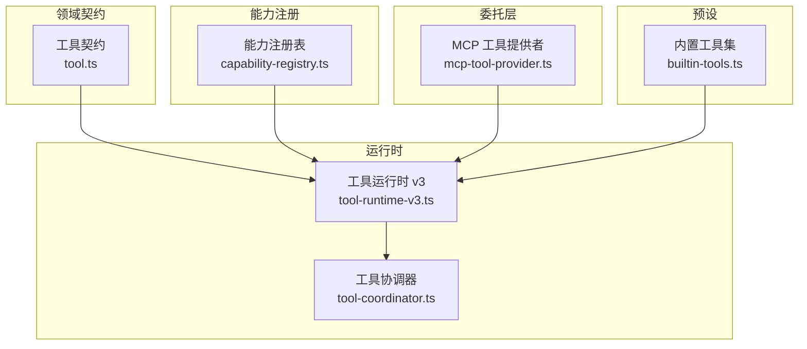
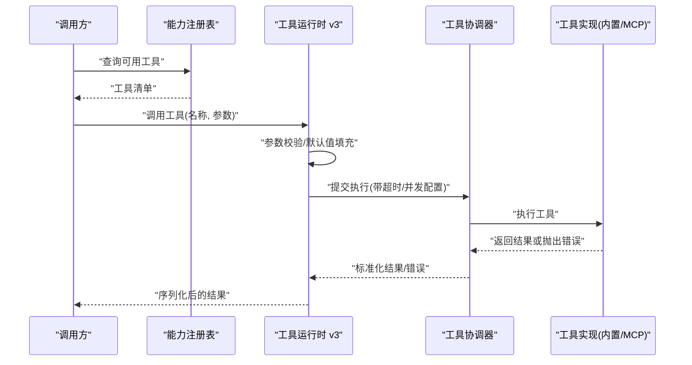
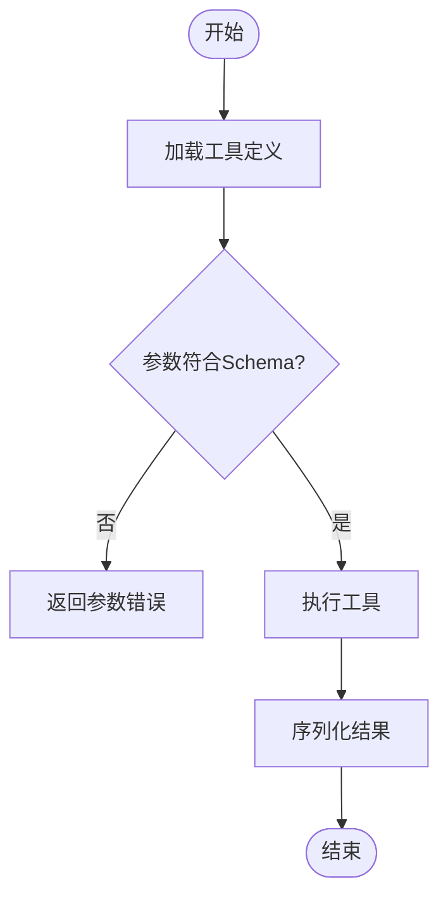
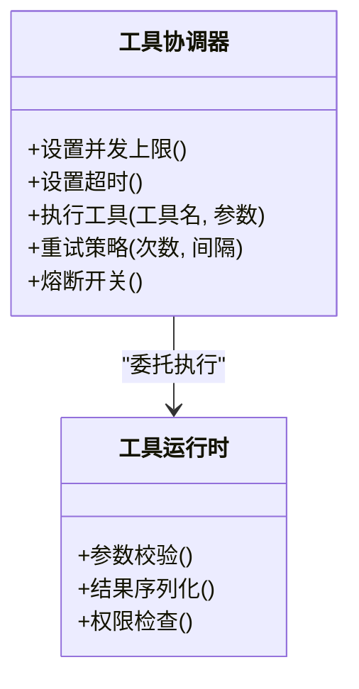
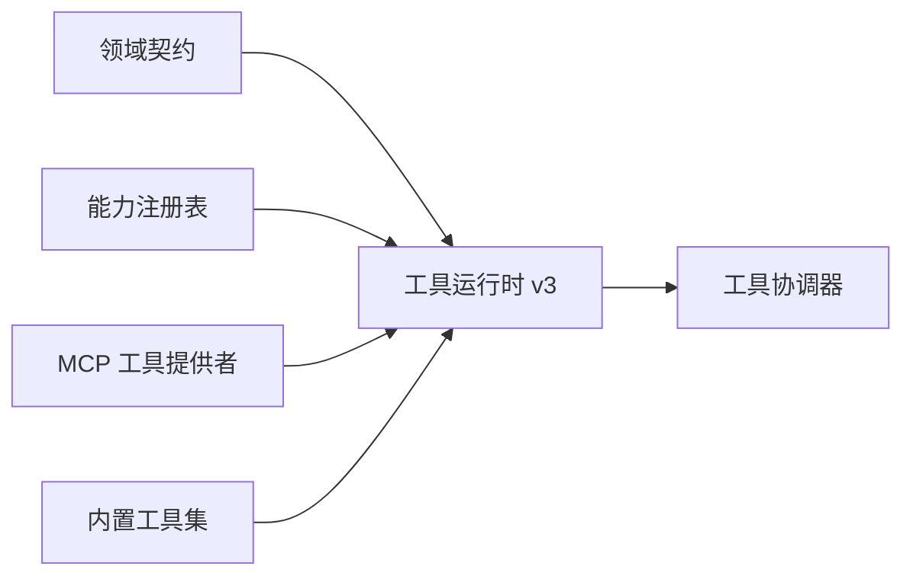

# 工具插件接口

<cite>
**本文引用的文件**   
- [engine/packages/engine/src/tool-coordinator.ts](file://engine/packages/engine/src/tool-coordinator.ts)
- [engine/packages/engine/src/tool-runtime-v3.ts](file://engine/packages/engine/src/tool-runtime-v3.ts)
- [engine/packages/domain-layer/src/contracts/tool.ts](file://engine/packages/domain-layer/src/contracts/tool.ts)
- [engine/packages/capabilities/src/capability-registry.ts](file://engine/packages/capabilities/src/capability-registry.ts)
- [engine/packages/delegation-layer/src/mcp-tool-provider.ts](file://engine/packages/delegation-layer/src/mcp-tool-provider.ts)
- [engine/packages/presets/src/builtin-tools.ts](file://engine/packages/presets/src/builtin-tools.ts)
- [engine/tests/tool-coordinator-runtime.test.ts](file://engine/tests/tool-coordinator-runtime.test.ts)
- [engine/tests/tool-runtime-v3.test.ts](file://engine/tests/tool-runtime-v3.test.ts)
- [engine/tests/builtin-tools.test.ts](file://engine/tests/builtin-tools.test.ts)
- [engine/tests/tool-dispatch-errors.test.ts](file://engine/tests/tool-dispatch-errors.test.ts)
- [engine/tests/tool-result-budget.test.ts](file://engine/tests/tool-result-budget.test.ts)
- [engine/tests/command-audit.test.ts](file://engine/tests/command-audit.test.ts)
</cite>

## 目录
1. [简介](#简介)
2. [项目结构](#项目结构)
3. [核心组件](#核心组件)
4. [架构总览](#架构总览)
5. [详细组件分析](#详细组件分析)
6. [依赖关系分析](#依赖关系分析)
7. [性能考量](#性能考量)
8. [故障排查指南](#故障排查指南)
9. [结论](#结论)
10. [附录](#附录)

## 简介
本技术文档面向KCoder工具插件接口的开发者与集成者，系统性说明以下能力：
- 工具注册接口：工具定义格式、参数校验、返回值序列化
- 工具执行上下文：文件系统访问、网络请求、数据库操作权限边界
- 工具协调器接口：并发控制、超时管理、错误恢复机制
- 工具开发模板：内置工具实现示例与测试方法
- 安全沙箱机制：权限隔离、资源限制、审计日志

目标是帮助读者快速理解并安全地扩展KCoder的工具生态。

## 项目结构
围绕“工具”相关能力，仓库采用多包分层组织：
- 领域契约层：定义工具类型、调用协议、结果模型等
- 运行时层：负责工具调度、参数校验、结果序列化、预算与限流
- 协调器层：提供并发控制、超时、重试与错误恢复
- 能力注册表：集中管理可用能力（含工具）的声明与发现
- 委托层：桥接外部工具提供者（如MCP）
- 预设层：内置工具实现集合
- 测试层：覆盖关键路径与异常场景

图表来源
- [engine/packages/domain-layer/src/contracts/tool.ts](file://engine/packages/domain-layer/src/contracts/tool.ts)
- [engine/packages/engine/src/tool-runtime-v3.ts](file://engine/packages/engine/src/tool-runtime-v3.ts)
- [engine/packages/engine/src/tool-coordinator.ts](file://engine/packages/engine/src/tool-coordinator.ts)
- [engine/packages/capabilities/src/capability-registry.ts](file://engine/packages/capabilities/src/capability-registry.ts)
- [engine/packages/delegation-layer/src/mcp-tool-provider.ts](file://engine/packages/delegation-layer/src/mcp-tool-provider.ts)
- [engine/packages/presets/src/builtin-tools.ts](file://engine/packages/presets/src/builtin-tools.ts)

章节来源
- [engine/packages/domain-layer/src/contracts/tool.ts](file://engine/packages/domain-layer/src/contracts/tool.ts)
- [engine/packages/engine/src/tool-runtime-v3.ts](file://engine/packages/engine/src/tool-runtime-v3.ts)
- [engine/packages/engine/src/tool-coordinator.ts](file://engine/packages/engine/src/tool-coordinator.ts)
- [engine/packages/capabilities/src/capability-registry.ts](file://engine/packages/capabilities/src/capability-registry.ts)
- [engine/packages/delegation-layer/src/mcp-tool-provider.ts](file://engine/packages/delegation-layer/src/mcp-tool-provider.ts)
- [engine/packages/presets/src/builtin-tools.ts](file://engine/packages/presets/src/builtin-tools.ts)

## 核心组件
- 工具契约（领域层）
  - 定义工具元数据、输入参数模式、输出结果结构与错误模型
  - 为参数校验与结果序列化提供统一规范
- 工具运行时（v3）
  - 负责加载工具、解析参数、执行工具函数、捕获异常、序列化结果
  - 与能力注册表协作，完成工具发现与权限检查
- 工具协调器
  - 提供并发度控制、超时与重试策略、错误分类与恢复
  - 对上层屏蔽底层工具差异，暴露一致的调用语义
- 能力注册表
  - 维护能力清单与版本兼容信息，支持动态注册与热更新
- 委托层（MCP）
  - 将外部MCP工具映射为内部工具契约，统一接入运行时
- 内置工具集
  - 提供常用能力（如文件、搜索、命令等）参考实现

章节来源
- [engine/packages/domain-layer/src/contracts/tool.ts](file://engine/packages/domain-layer/src/contracts/tool.ts)
- [engine/packages/engine/src/tool-runtime-v3.ts](file://engine/packages/engine/src/tool-runtime-v3.ts)
- [engine/packages/engine/src/tool-coordinator.ts](file://engine/packages/engine/src/tool-coordinator.ts)
- [engine/packages/capabilities/src/capability-registry.ts](file://engine/packages/capabilities/src/capability-registry.ts)
- [engine/packages/delegation-layer/src/mcp-tool-provider.ts](file://engine/packages/delegation-layer/src/mcp-tool-provider.ts)
- [engine/packages/presets/src/builtin-tools.ts](file://engine/packages/presets/src/builtin-tools.ts)

## 架构总览
下图展示了从调用方到工具执行的端到端流程，包括参数校验、权限检查、执行与结果序列化。

图表来源
- [engine/packages/capabilities/src/capability-registry.ts](file://engine/packages/capabilities/src/capability-registry.ts)
- [engine/packages/engine/src/tool-runtime-v3.ts](file://engine/packages/engine/src/tool-runtime-v3.ts)
- [engine/packages/engine/src/tool-coordinator.ts](file://engine/packages/engine/src/tool-coordinator.ts)
- [engine/packages/delegation-layer/src/mcp-tool-provider.ts](file://engine/packages/delegation-layer/src/mcp-tool-provider.ts)
- [engine/packages/presets/src/builtin-tools.ts](file://engine/packages/presets/src/builtin-tools.ts)

## 详细组件分析

### 工具注册接口
- 工具定义格式
  - 包含标识、描述、版本、输入参数Schema、输出Schema、错误模型、权限标签等
  - 通过能力注册表进行集中管理与发现
- 参数验证
  - 基于输入Schema进行严格校验，缺失必填项或类型不匹配时拒绝执行
  - 支持默认值填充与可选字段处理
- 返回值序列化
  - 输出按Schema序列化为稳定结构，确保跨进程/跨语言可消费
  - 错误以统一错误模型返回，便于上层统一处理

图表来源
- [engine/packages/domain-layer/src/contracts/tool.ts](file://engine/packages/domain-layer/src/contracts/tool.ts)
- [engine/packages/engine/src/tool-runtime-v3.ts](file://engine/packages/engine/src/tool-runtime-v3.ts)
- [engine/packages/capabilities/src/capability-registry.ts](file://engine/packages/capabilities/src/capability-registry.ts)

章节来源
- [engine/packages/domain-layer/src/contracts/tool.ts](file://engine/packages/domain-layer/src/contracts/tool.ts)
- [engine/packages/engine/src/tool-runtime-v3.ts](file://engine/packages/engine/src/tool-runtime-v3.ts)
- [engine/packages/capabilities/src/capability-registry.ts](file://engine/packages/capabilities/src/capability-registry.ts)

### 工具执行上下文
- 文件系统访问
  - 仅允许在受控目录范围内读写，禁止越权访问系统敏感路径
  - 所有文件变更需记录审计日志，支持回滚与快照
- 网络请求
  - 白名单域名与协议控制，禁止内网穿透与代理滥用
  - 请求大小、连接数、超时时间受限，失败自动重试策略可控
- 数据库操作
  - 只读优先；写操作需显式授权，且限定库/表范围
  - 事务边界清晰，长事务会被强制中断

章节来源
- [engine/packages/engine/src/tool-runtime-v3.ts](file://engine/packages/engine/src/tool-runtime-v3.ts)
- [engine/packages/engine/src/tool-coordinator.ts](file://engine/packages/engine/src/tool-coordinator.ts)

### 工具协调器接口
- 并发控制
  - 全局与工具级并发上限，避免资源争用与雪崩
- 超时管理
  - 支持整体超时与子任务超时，防止长时间阻塞
- 错误恢复
  - 错误分类（参数错误、执行错误、超时、权限不足等）
  - 重试策略（指数退避、最大次数）、熔断与降级
  - 幂等性保障与补偿逻辑

图表来源
- [engine/packages/engine/src/tool-coordinator.ts](file://engine/packages/engine/src/tool-coordinator.ts)
- [engine/packages/engine/src/tool-runtime-v3.ts](file://engine/packages/engine/src/tool-runtime-v3.ts)

章节来源
- [engine/packages/engine/src/tool-coordinator.ts](file://engine/packages/engine/src/tool-coordinator.ts)
- [engine/packages/engine/src/tool-runtime-v3.ts](file://engine/packages/engine/src/tool-runtime-v3.ts)

### 工具开发模板
- 推荐步骤
  - 在领域契约中声明工具定义（名称、描述、输入/输出Schema、错误模型）
  - 在预设或自定义包中实现工具函数，遵循上下文约束
  - 使用能力注册表注册工具，暴露给运行时
  - 编写单元测试覆盖正常路径与异常分支
- 内置工具示例
  - 文件类、搜索类、命令类等常见能力的实现可作为参考
- 测试方法
  - 使用运行时测试套件模拟参数校验、权限拦截、超时与错误恢复
  - 使用协调器测试套件验证并发与重试行为

章节来源
- [engine/packages/presets/src/builtin-tools.ts](file://engine/packages/presets/src/builtin-tools.ts)
- [engine/tests/builtin-tools.test.ts](file://engine/tests/builtin-tools.test.ts)
- [engine/tests/tool-runtime-v3.test.ts](file://engine/tests/tool-runtime-v3.test.ts)
- [engine/tests/tool-coordinator-runtime.test.ts](file://engine/tests/tool-coordinator-runtime.test.ts)

### 安全沙箱机制
- 权限隔离
  - 基于能力注册表的权限标签进行最小授权
  - 工具间状态隔离，避免共享可变状态
- 资源限制
  - CPU/内存/IO配额，超限自动终止
  - 网络与文件系统访问白名单
- 审计日志
  - 记录工具调用、参数摘要、结果摘要、耗时与错误码
  - 支持导出与告警，便于事后追溯

章节来源
- [engine/packages/capabilities/src/capability-registry.ts](file://engine/packages/capabilities/src/capability-registry.ts)
- [engine/packages/engine/src/tool-runtime-v3.ts](file://engine/packages/engine/src/tool-runtime-v3.ts)
- [engine/tests/command-audit.test.ts](file://engine/tests/command-audit.test.ts)

## 依赖关系分析
- 直接依赖
  - 运行时依赖领域契约与能力注册表
  - 协调器依赖运行时与策略配置
  - 委托层依赖运行时以适配外部工具
- 间接依赖
  - 内置工具集依赖运行时与协调器
- 潜在循环
  - 通过分层与接口解耦避免循环依赖

图表来源
- [engine/packages/domain-layer/src/contracts/tool.ts](file://engine/packages/domain-layer/src/contracts/tool.ts)
- [engine/packages/engine/src/tool-runtime-v3.ts](file://engine/packages/engine/src/tool-runtime-v3.ts)
- [engine/packages/engine/src/tool-coordinator.ts](file://engine/packages/engine/src/tool-coordinator.ts)
- [engine/packages/capabilities/src/capability-registry.ts](file://engine/packages/capabilities/src/capability-registry.ts)
- [engine/packages/delegation-layer/src/mcp-tool-provider.ts](file://engine/packages/delegation-layer/src/mcp-tool-provider.ts)
- [engine/packages/presets/src/builtin-tools.ts](file://engine/packages/presets/src/builtin-tools.ts)

章节来源
- [engine/packages/domain-layer/src/contracts/tool.ts](file://engine/packages/domain-layer/src/contracts/tool.ts)
- [engine/packages/engine/src/tool-runtime-v3.ts](file://engine/packages/engine/src/tool-runtime-v3.ts)
- [engine/packages/engine/src/tool-coordinator.ts](file://engine/packages/engine/src/tool-coordinator.ts)
- [engine/packages/capabilities/src/capability-registry.ts](file://engine/packages/capabilities/src/capability-registry.ts)
- [engine/packages/delegation-layer/src/mcp-tool-provider.ts](file://engine/packages/delegation-layer/src/mcp-tool-provider.ts)
- [engine/packages/presets/src/builtin-tools.ts](file://engine/packages/presets/src/builtin-tools.ts)

## 性能考量
- 合理设置并发上限与队列长度，避免线程风暴
- 启用结果缓存与去重，减少重复计算
- 对I/O密集型工具使用异步与批处理
- 监控关键指标：P95/P99延迟、错误率、重试率、超时率

[本节为通用指导，无需源码引用]

## 故障排查指南
- 常见问题
  - 参数校验失败：检查输入Schema与必填项
  - 权限不足：确认能力标签与白名单配置
  - 超时与重试：调整超时阈值与重试策略
  - 结果过大：启用分页或压缩
- 定位手段
  - 查看审计日志与错误分类
  - 使用运行时与协调器测试用例复现问题
  - 针对MCP工具，核对桥接映射与协议兼容性

章节来源
- [engine/tests/tool-dispatch-errors.test.ts](file://engine/tests/tool-dispatch-errors.test.ts)
- [engine/tests/tool-result-budget.test.ts](file://engine/tests/tool-result-budget.test.ts)
- [engine/tests/command-audit.test.ts](file://engine/tests/command-audit.test.ts)

## 结论
KCoder工具插件体系通过清晰的契约、严格的运行时校验与强大的协调器，提供了可扩展、可观测、可治理的工具生态。建议开发者遵循最小权限原则与可观测性要求，结合内置工具与测试套件，快速构建高质量的工具插件。

[本节为总结，无需源码引用]

## 附录
- 术语
  - 工具：具备明确输入/输出的可执行单元
  - 能力：工具及其权限的组合抽象
  - 协调器：负责并发、超时、重试与错误恢复的执行编排
- 最佳实践
  - 保持工具幂等与短事务
  - 明确错误语义与可恢复性
  - 完善审计与监控

[本节为补充信息，无需源码引用]