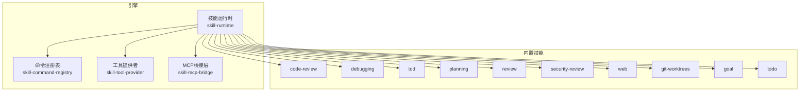
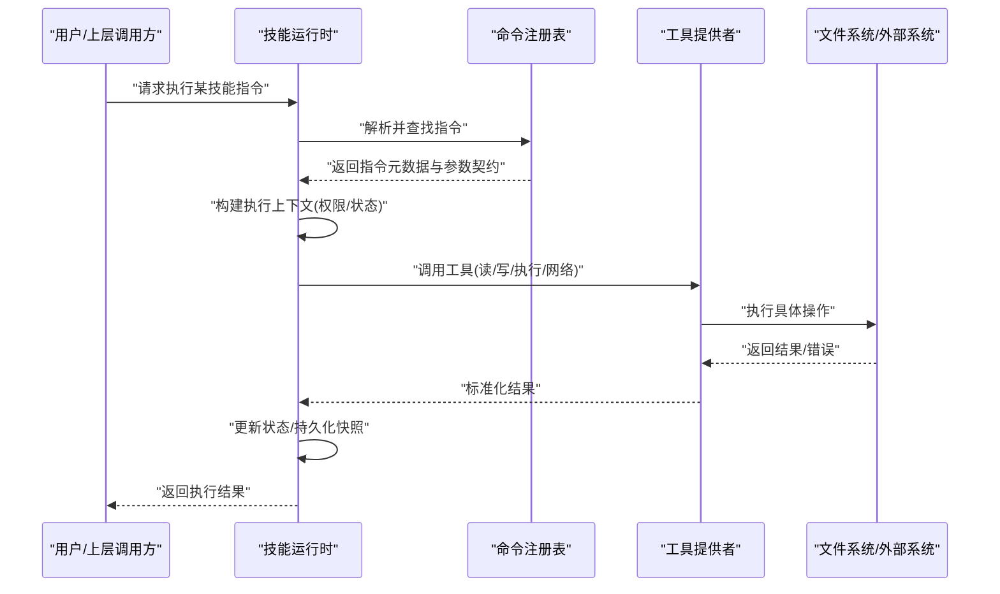
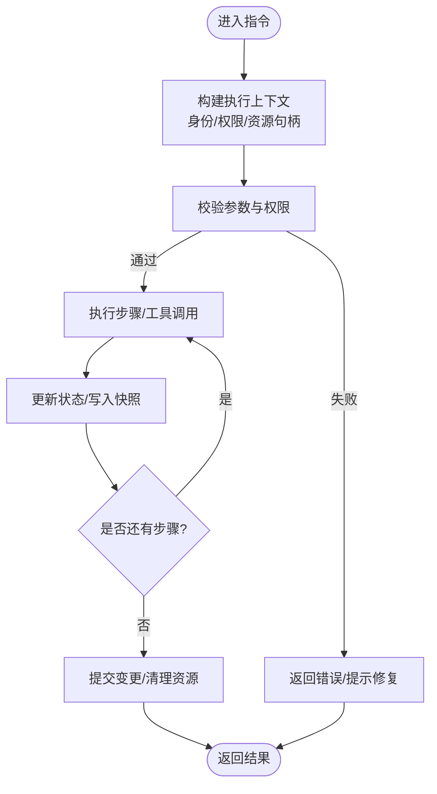
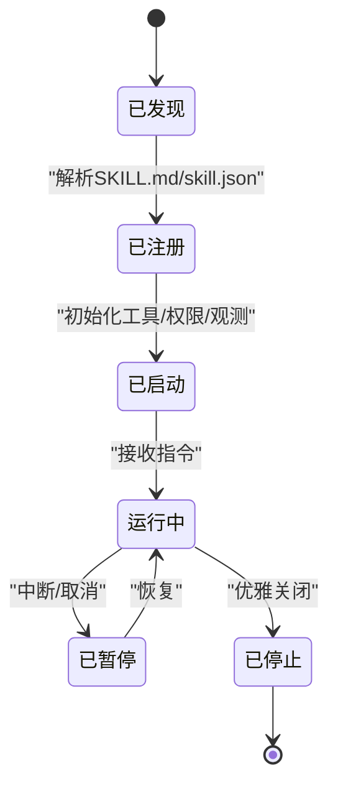
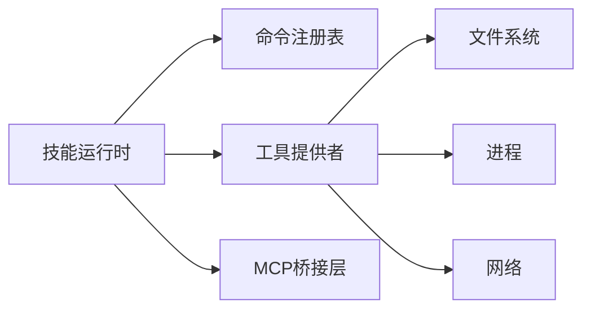

# 技能插件接口

<cite>
**本文引用的文件**   
- [engine/skills/code-review/SKILL.md](file://engine/skills/code-review/SKILL.md)
- [engine/skills/code-review/skill.json](file://engine/skills/code-review/skill.json)
- [engine/skills/debugging/SKILL.md](file://engine/skills/debugging/SKILL.md)
- [engine/skills/debugging/skill.json](file://engine/skills/debugging/skill.json)
- [engine/skills/tdd/SKILL.md](file://engine/skills/tdd/SKILL.md)
- [engine/skills/tdd/skill.json](file://engine/skills/tdd/skill.json)
- [engine/skills/tdd/tdd-cycle.md](file://engine/skills/tdd/tdd-cycle.md)
- [engine/skills/planning/SKILL.md](file://engine/skills/planning/SKILL.md)
- [engine/skills/planning/skill.json](file://engine/skills/planning/skill.json)
- [engine/skills/review/SKILL.md](file://engine/skills/review/SKILL.md)
- [engine/skills/review/skill.json](file://engine/skills/review/skill.json)
- [engine/skills/security-review/SKILL.md](file://engine/skills/security-review/SKILL.md)
- [engine/skills/security-review/skill.json](file://engine/skills/security-review/skill.json)
- [engine/skills/web/SKILL.md](file://engine/skills/web/SKILL.md)
- [engine/skills/web/skill.json](file://engine/skills/web/skill.json)
- [engine/skills/git-worktrees/SKILL.md](file://engine/skills/git-worktrees/SKILL.md)
- [engine/skills/git-worktrees/skill.json](file://engine/skills/git-worktrees/skill.json)
- [engine/skills/goal/SKILL.md](file://engine/skills/goal/SKILL.md)
- [engine/skills/goal/skill.json](file://engine/skills/goal/skill.json)
- [engine/skills/todo/SKILL.md](file://engine/skills/todo/SKILL.md)
- [engine/skills/todo/skill.json](file://engine/skills/todo/skill.json)
- [engine/tests/builtin-skills.test.ts](file://engine/tests/builtin-skills.test.ts)
- [engine/tests/skill-command-registry.test.ts](file://engine/tests/skill-command-registry.test.ts)
- [engine/tests/skill-runtime.test.ts](file://engine/tests/skill-runtime.test.ts)
- [engine/tests/skill-tool-provider.test.ts](file://engine/tests/skill-tool-provider.test.ts)
- [engine/tests/skill-mcp-bridge.test.ts](file://engine/tests/skill-mcp-bridge.test.ts)
- [engine/tests/work-mode-skill-runtime.test.ts](file://engine/tests/work-mode-skill-runtime.test.ts)
</cite>

## 目录
1. [简介](#简介)
2. [项目结构](#项目结构)
3. [核心组件](#核心组件)
4. [架构总览](#架构总览)
5. [详细组件分析](#详细组件分析)
6. [依赖关系分析](#依赖关系分析)
7. [性能考虑](#性能考虑)
8. [故障排查指南](#故障排查指南)
9. [结论](#结论)
10. [附录](#附录)

## 简介
本文件面向KCoder“技能”插件接口的开发者与使用者，系统化说明：
- SKILL.md 文件格式规范（元数据、指令语法、参数配置）
- skill.json 配置文件结构（版本管理、依赖声明、权限设置）
- 技能执行上下文（文件访问权限、工具调用接口、状态管理）
- 技能开发模板与最佳实践（代码审查、调试、TDD等内置技能的实现示例）
- 技能注册机制、生命周期管理与错误处理策略

目标是帮助读者快速理解并高质量地开发可复用、可测试、可治理的技能。

## 项目结构
KCoder引擎将“技能”以包的形式组织在 engine/skills 目录下，每个技能包含：
- SKILL.md：描述性规范文档，定义元数据、指令、参数与行为约定
- skill.json：运行时配置，定义版本、依赖、权限、入口等
- 可选的辅助文档或脚本（如 tdd-cycle.md）

图表来源
- [engine/tests/skill-runtime.test.ts](file://engine/tests/skill-runtime.test.ts)
- [engine/tests/skill-command-registry.test.ts](file://engine/tests/skill-command-registry.test.ts)
- [engine/tests/skill-tool-provider.test.ts](file://engine/tests/skill-tool-provider.test.ts)
- [engine/tests/skill-mcp-bridge.test.ts](file://engine/tests/skill-mcp-bridge.test.ts)

章节来源
- [engine/tests/builtin-skills.test.ts](file://engine/tests/builtin-skills.test.ts)
- [engine/tests/skill-runtime.test.ts](file://engine/tests/skill-runtime.test.ts)

## 核心组件
- 技能运行时（Skill Runtime）
  - 负责加载、解析、编排与执行技能
  - 维护执行上下文、状态机、资源隔离与生命周期钩子
- 命令注册表（Command Registry）
  - 提供指令发现、注册、路由与校验能力
- 工具提供者（Tool Provider）
  - 暴露文件系统、进程、网络等系统能力给技能安全调用
- MCP桥接层（MCP Bridge）
  - 将技能能力映射为MCP协议，便于外部集成与扩展

章节来源
- [engine/tests/skill-runtime.test.ts](file://engine/tests/skill-runtime.test.ts)
- [engine/tests/skill-command-registry.test.ts](file://engine/tests/skill-command-registry.test.ts)
- [engine/tests/skill-tool-provider.test.ts](file://engine/tests/skill-tool-provider.test.ts)
- [engine/tests/skill-mcp-bridge.test.ts](file://engine/tests/skill-mcp-bridge.test.ts)

## 架构总览
下图展示了从用户触发到技能执行的端到端流程，包括注册、解析、上下文构建、工具调用与结果回传。

图表来源
- [engine/tests/skill-runtime.test.ts](file://engine/tests/skill-runtime.test.ts)
- [engine/tests/skill-tool-provider.test.ts](file://engine/tests/skill-tool-provider.test.ts)

## 详细组件分析

### SKILL.md 格式规范
SKILL.md 是技能的“契约式”描述文件，用于向运行时和使用者声明：
- 元数据：名称、版本、作者、摘要、许可证等
- 指令集：可用指令名、用途、参数模式、返回值约定
- 行为约束：前置条件、副作用、幂等性、重试策略
- 安全边界：所需权限、敏感操作白名单、沙箱限制
- 关联资源：依赖的外部服务、模型、工具清单

建议字段类别
- 基础信息：标题、描述、版本、作者、联系方式
- 指令定义：指令名、参数Schema、示例、错误码
- 权限声明：文件读写范围、网络访问、进程执行
- 依赖声明：外部工具、环境变量、模型提供方
- 运行约束：超时、重试、并发度、资源配额

章节来源
- [engine/skills/code-review/SKILL.md](file://engine/skills/code-review/SKILL.md)
- [engine/skills/debugging/SKILL.md](file://engine/skills/debugging/SKILL.md)
- [engine/skills/tdd/SKILL.md](file://engine/skills/tdd/SKILL.md)
- [engine/skills/planning/SKILL.md](file://engine/skills/planning/SKILL.md)
- [engine/skills/review/SKILL.md](file://engine/skills/review/SKILL.md)
- [engine/skills/security-review/SKILL.md](file://engine/skills/security-review/SKILL.md)
- [engine/skills/web/SKILL.md](file://engine/skills/web/SKILL.md)
- [engine/skills/git-worktrees/SKILL.md](file://engine/skills/git-worktrees/SKILL.md)
- [engine/skills/goal/SKILL.md](file://engine/skills/goal/SKILL.md)
- [engine/skills/todo/SKILL.md](file://engine/skills/todo/SKILL.md)

### skill.json 配置结构
skill.json 是技能的运行时装配文件，典型职责包括：
- 版本管理：语义化版本、兼容性矩阵、升级迁移策略
- 依赖声明：内部技能依赖、外部工具、环境变量、模型配置
- 权限设置：文件路径白名单、网络域名白名单、进程命令白名单
- 入口与路由：指令到处理器映射、默认工作流、并行/串行策略
- 运行时策略：超时、重试、熔断、日志级别、审计开关

建议字段类别
- 标识与版本：id、version、compatibility
- 依赖：tools、env、models、skills
- 权限：fs、net、proc、sandbox
- 入口：handlers、routes、default_flow
- 运行时：timeout、retry、circuit_breaker、audit

章节来源
- [engine/skills/code-review/skill.json](file://engine/skills/code-review/skill.json)
- [engine/skills/debugging/skill.json](file://engine/skills/debugging/skill.json)
- [engine/skills/tdd/skill.json](file://engine/skills/tdd/skill.json)
- [engine/skills/planning/skill.json](file://engine/skills/planning/skill.json)
- [engine/skills/review/skill.json](file://engine/skills/review/skill.json)
- [engine/skills/security-review/skill.json](file://engine/skills/security-review/skill.json)
- [engine/skills/web/skill.json](file://engine/skills/web/skill.json)
- [engine/skills/git-worktrees/skill.json](file://engine/skills/git-worktrees/skill.json)
- [engine/skills/goal/skill.json](file://engine/skills/goal/skill.json)
- [engine/skills/todo/skill.json](file://engine/skills/todo/skill.json)

### 技能执行上下文
执行上下文贯穿一次指令调用的完整生命周期，关键要素包括：
- 身份与权限：当前会话主体、最小权限原则、作用域隔离
- 资源句柄：只读/可写文件句柄、临时目录、缓存空间
- 工具接口：统一封装的文件系统、进程、网络、消息总线
- 状态管理：步骤级状态、事务型提交、断点续跑、快照恢复
- 观测性：结构化日志、指标上报、追踪ID、审计事件

图表来源
- [engine/tests/skill-runtime.test.ts](file://engine/tests/skill-runtime.test.ts)
- [engine/tests/skill-tool-provider.test.ts](file://engine/tests/skill-tool-provider.test.ts)

章节来源
- [engine/tests/skill-runtime.test.ts](file://engine/tests/skill-runtime.test.ts)
- [engine/tests/work-mode-skill-runtime.test.ts](file://engine/tests/work-mode-skill-runtime.test.ts)

### 技能注册机制与生命周期
- 注册阶段
  - 扫描技能包，解析 SKILL.md 与 skill.json
  - 注册指令到命令注册表，建立路由与参数契约
- 启动阶段
  - 初始化工具提供者、权限策略、审计与观测
  - 预加载依赖、校验环境、预热缓存
- 运行阶段
  - 接收指令请求，构建上下文，调度处理器
  - 支持中断、取消、重试、补偿
- 关闭阶段
  - 持久化状态、释放资源、上报指标与审计事件

图表来源
- [engine/tests/skill-command-registry.test.ts](file://engine/tests/skill-command-registry.test.ts)
- [engine/tests/skill-runtime.test.ts](file://engine/tests/skill-runtime.test.ts)

章节来源
- [engine/tests/skill-command-registry.test.ts](file://engine/tests/skill-command-registry.test.ts)
- [engine/tests/skill-runtime.test.ts](file://engine/tests/skill-runtime.test.ts)

### 错误处理策略
- 分类与传播
  - 参数错误、权限拒绝、工具异常、超时、网络错误
  - 错误码与消息规范化，向上游透传
- 重试与补偿
  - 指数退避、最大重试次数、幂等键
  - 补偿动作与事务回滚
- 降级与熔断
  - 依赖不可用时降级策略
  - 熔断阈值与恢复探测
- 观测与审计
  - 错误堆栈脱敏、关键事件审计、指标采集

章节来源
- [engine/tests/skill-runtime.test.ts](file://engine/tests/skill-runtime.test.ts)
- [engine/tests/skill-tool-provider.test.ts](file://engine/tests/skill-tool-provider.test.ts)

### 内置技能示例与最佳实践
以下内置技能可作为开发模板参考：
- 代码审查（code-review）
  - 关注静态检查、规则注入、报告生成
  - 建议：幂等输出、增量对比、差异归档
- 调试（debugging）
  - 关注日志收集、断点定位、变量抓取
  - 建议：最小权限读取、临时文件清理
- TDD（tdd）
  - 关注测试驱动循环、用例生成、覆盖率统计
  - 建议：与测试框架集成、失败快速反馈
- 规划（planning）、评审（review）、安全评审（security-review）、Web（web）、Git工作树（git-worktrees）、目标（goal）、待办（todo）

章节来源
- [engine/skills/code-review/SKILL.md](file://engine/skills/code-review/SKILL.md)
- [engine/skills/code-review/skill.json](file://engine/skills/code-review/skill.json)
- [engine/skills/debugging/SKILL.md](file://engine/skills/debugging/SKILL.md)
- [engine/skills/debugging/skill.json](file://engine/skills/debugging/skill.json)
- [engine/skills/tdd/SKILL.md](file://engine/skills/tdd/SKILL.md)
- [engine/skills/tdd/skill.json](file://engine/skills/tdd/skill.json)
- [engine/skills/tdd/tdd-cycle.md](file://engine/skills/tdd/tdd-cycle.md)
- [engine/skills/planning/SKILL.md](file://engine/skills/planning/SKILL.md)
- [engine/skills/planning/skill.json](file://engine/skills/planning/skill.json)
- [engine/skills/review/SKILL.md](file://engine/skills/review/SKILL.md)
- [engine/skills/review/skill.json](file://engine/skills/review/skill.json)
- [engine/skills/security-review/SKILL.md](file://engine/skills/security-review/SKILL.md)
- [engine/skills/security-review/skill.json](file://engine/skills/security-review/skill.json)
- [engine/skills/web/SKILL.md](file://engine/skills/web/SKILL.md)
- [engine/skills/web/skill.json](file://engine/skills/web/skill.json)
- [engine/skills/git-worktrees/SKILL.md](file://engine/skills/git-worktrees/SKILL.md)
- [engine/skills/git-worktrees/skill.json](file://engine/skills/git-worktrees/skill.json)
- [engine/skills/goal/SKILL.md](file://engine/skills/goal/SKILL.md)
- [engine/skills/goal/skill.json](file://engine/skills/goal/skill.json)
- [engine/skills/todo/SKILL.md](file://engine/skills/todo/SKILL.md)
- [engine/skills/todo/skill.json](file://engine/skills/todo/skill.json)

## 依赖关系分析
- 组件耦合
  - 运行时强依赖命令注册表与工具提供者
  - MCP桥接层作为对外适配面，降低上游耦合
- 直接依赖
  - 运行时 -> 命令注册表、工具提供者、MCP桥接层
  - 工具提供者 -> 文件系统、进程、网络等子系统
- 间接依赖
  - 技能包通过 skill.json 声明对工具与环境变量的依赖
- 潜在环依赖
  - 应避免技能间互相强引用，使用共享工具与事件总线解耦

图表来源
- [engine/tests/skill-runtime.test.ts](file://engine/tests/skill-runtime.test.ts)
- [engine/tests/skill-command-registry.test.ts](file://engine/tests/skill-command-registry.test.ts)
- [engine/tests/skill-tool-provider.test.ts](file://engine/tests/skill-tool-provider.test.ts)
- [engine/tests/skill-mcp-bridge.test.ts](file://engine/tests/skill-mcp-bridge.test.ts)

章节来源
- [engine/tests/skill-runtime.test.ts](file://engine/tests/skill-runtime.test.ts)
- [engine/tests/skill-command-registry.test.ts](file://engine/tests/skill-command-registry.test.ts)
- [engine/tests/skill-tool-provider.test.ts](file://engine/tests/skill-tool-provider.test.ts)
- [engine/tests/skill-mcp-bridge.test.ts](file://engine/tests/skill-mcp-bridge.test.ts)

## 性能考虑
- 指令批处理与流水线化，减少上下文切换
- 工具调用合并与去重，避免重复IO
- 缓存热点数据（AST、规则、索引），注意失效策略
- 异步与并发控制，防止雪崩
- 资源限额与背压，保障稳定性

[本节为通用指导，不直接分析具体文件]

## 故障排查指南
- 常见问题
  - 指令未注册：检查 SKILL.md 指令定义与注册表映射
  - 权限拒绝：核对 skill.json 权限白名单与作用域
  - 工具调用失败：查看工具提供者日志与外部系统健康状态
  - 状态不一致：检查快照与事务提交顺序
- 诊断手段
  - 启用审计与追踪，定位调用链
  - 回放最近快照，复现问题
  - 隔离依赖，逐步缩小范围

章节来源
- [engine/tests/skill-runtime.test.ts](file://engine/tests/skill-runtime.test.ts)
- [engine/tests/skill-tool-provider.test.ts](file://engine/tests/skill-tool-provider.test.ts)

## 结论
通过统一的 SKILL.md 契约与 skill.json 配置，结合健壮的运行时、注册表、工具提供者与MCP桥接层，KCoder实现了高内聚、低耦合、可扩展的技能生态。遵循本文档的规范与最佳实践，可显著提升技能的可维护性与可靠性。

[本节为总结性内容，不直接分析具体文件]

## 附录
- 术语
  - 技能：一组可被运行时编排的指令集合
  - 指令：技能对外暴露的最小可执行单元
  - 工具：由运行时提供的系统能力封装
  - 上下文：单次指令执行的运行环境与状态
- 参考
  - 内置技能示例：参见各技能目录下的 SKILL.md 与 skill.json
  - 测试用例：参见 tests 下相关测试文件，了解运行时行为与边界条件

[本节为补充信息，不直接分析具体文件]