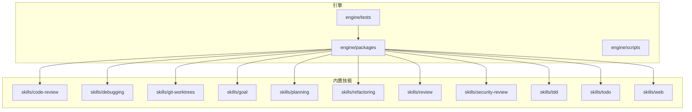
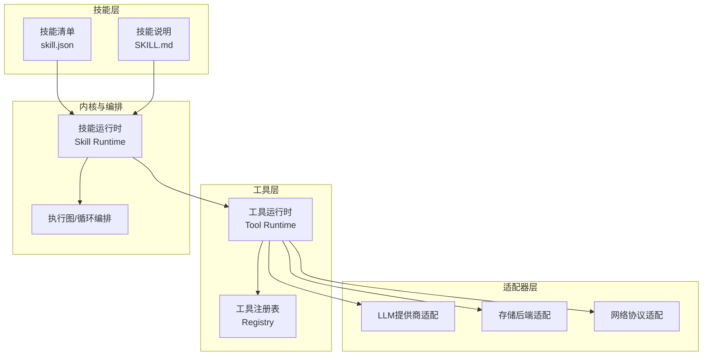
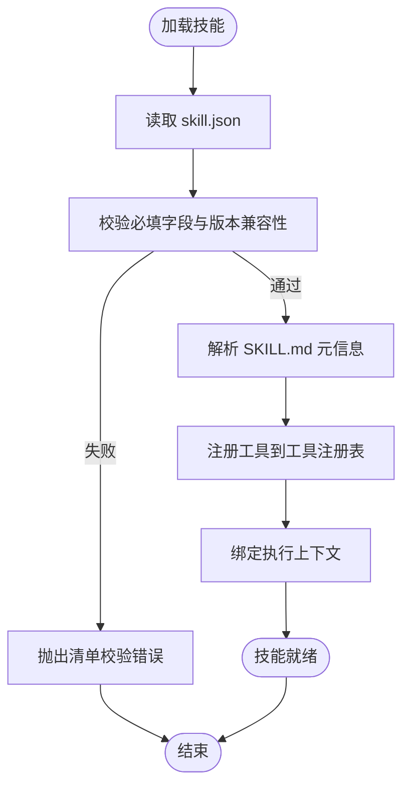
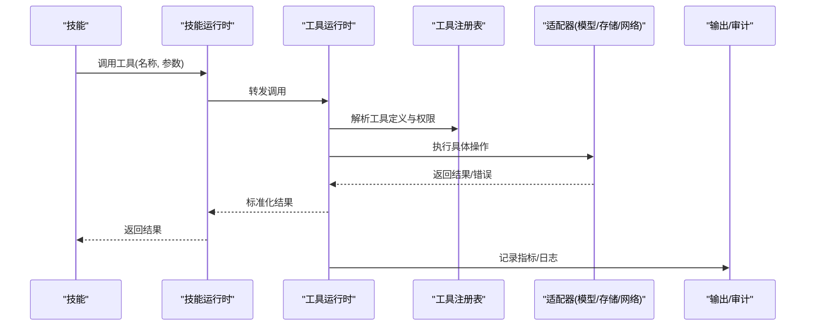
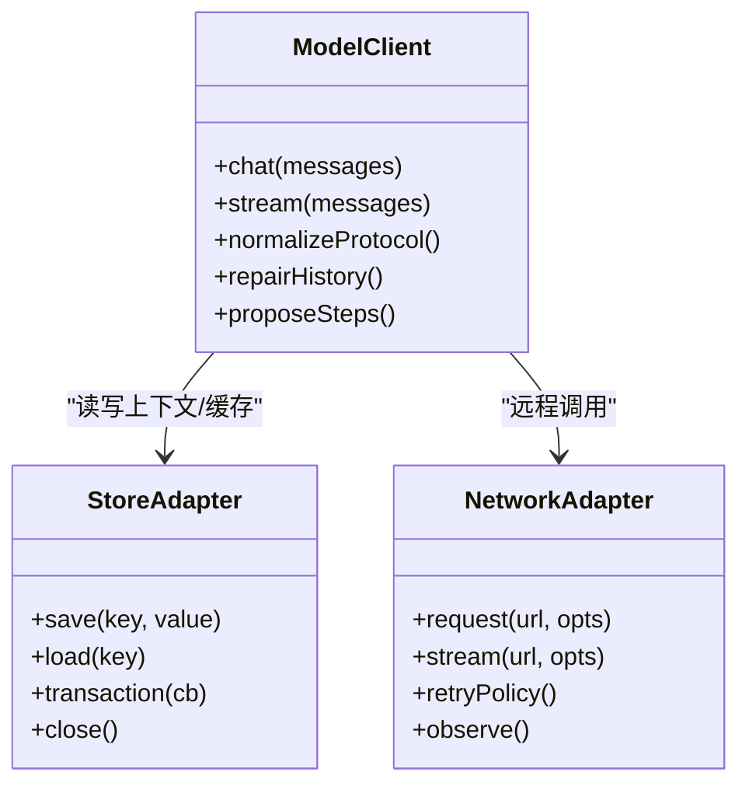
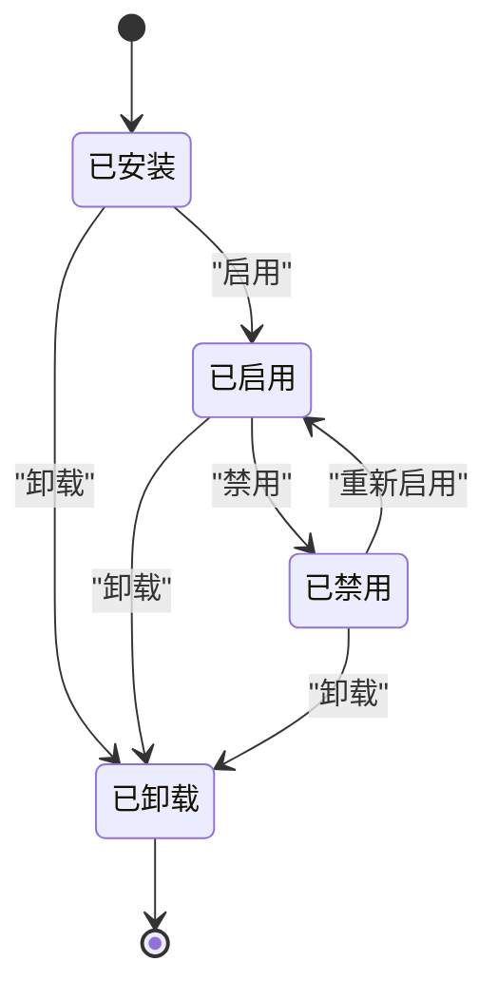
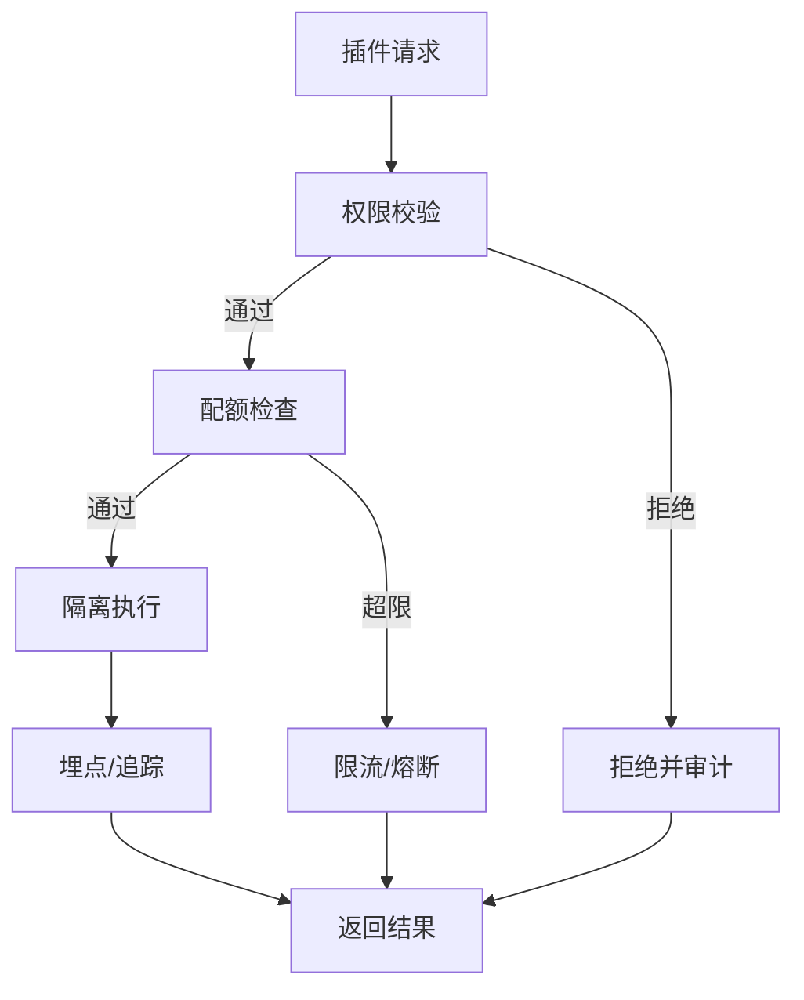
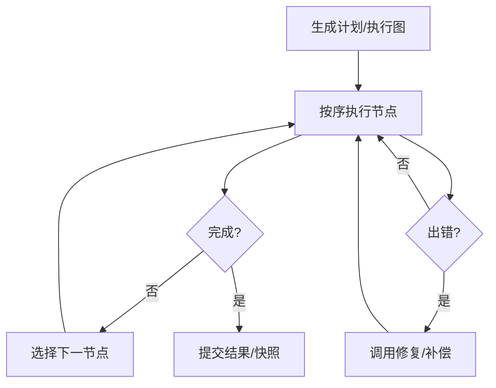
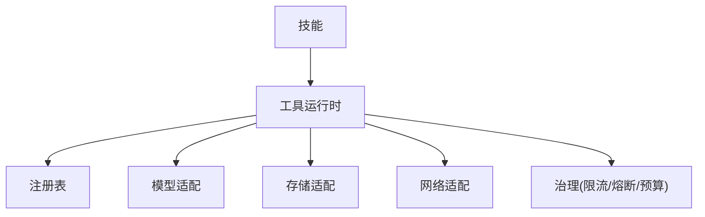

# 插件接口规范

<cite>
**本文引用的文件**   
- [engine/skills/code-review/SKILL.md](file://engine/skills/code-review/SKILL.md)
- [engine/skills/code-review/skill.json](file://engine/skills/code-review/skill.json)
- [engine/skills/debugging/SKILL.md](file://engine/skills/debugging/SKILL.md)
- [engine/skills/debugging/skill.json](file://engine/skills/debugging/skill.json)
- [engine/skills/git-worktrees/SKILL.md](file://engine/skills/git-worktrees/SKILL.md)
- [engine/skills/git-worktrees/skill.json](file://engine/skills/git-worktrees/skill.json)
- [engine/skills/goal/SKILL.md](file://engine/skills/goal/SKILL.md)
- [engine/skills/goal/skill.json](file://engine/skills/goal/skill.json)
- [engine/skills/planning/SKILL.md](file://engine/skills/planning/SKILL.md)
- [engine/skills/planning/skill.json](file://engine/skills/planning/skill.json)
- [engine/skills/refactoring/SKILL.md](file://engine/skills/refactoring/SKILL.md)
- [engine/skills/refactoring/skill.json](file://engine/skills/refactoring/skill.json)
- [engine/skills/review/SKILL.md](file://engine/skills/review/SKILL.md)
- [engine/skills/review/skill.json](file://engine/skills/review/skill.json)
- [engine/skills/security-review/SKILL.md](file://engine/skills/security-review/SKILL.md)
- [engine/skills/security-review/skill.json](file://engine/skills/security-review/skill.json)
- [engine/skills/tdd/SKILL.md](file://engine/skills/tdd/SKILL.md)
- [engine/skills/tdd/skill.json](file://engine/skills/tdd/skill.json)
- [engine/skills/todo/SKILL.md](file://engine/skills/todo/SKILL.md)
- [engine/skills/todo/skill.json](file://engine/skills/todo/skill.json)
- [engine/skills/web/SKILL.md](file://engine/skills/web/SKILL.md)
- [engine/skills/web/skill.json](file://engine/skills/web/skill.json)
- [engine/tests/builtin-skills.test.ts](file://engine/tests/builtin-skills.test.ts)
- [engine/tests/skill-command-registry.test.ts](file://engine/tests/skill-command-registry.test.ts)
- [engine/tests/skill-mcp-bridge.test.ts](file://engine/tests/skill-mcp-bridge.test.ts)
- [engine/tests/skill-runtime.test.ts](file://engine/tests/skill-runtime.test.ts)
- [engine/tests/skill-tool-provider.test.ts](file://engine/tests/skill-tool-provider.test.ts)
- [engine/tests/work-mode-skill-runtime.test.ts](file://engine/tests/work-mode-skill-runtime.test.ts)
- [engine/tests/tool-runtime-v3.test.ts](file://engine/tests/tool-runtime-v3.test.ts)
- [engine/tests/tool-dispatch-errors.test.ts](file://engine/tests/tool-dispatch-errors.test.ts)
- [engine/tests/tool-result-budget.test.ts](file://engine/tests/tool-result-budget.test.ts)
- [engine/tests/mcp-tool-provider.test.ts](file://engine/tests/mcp-tool-provider.test.ts)
- [engine/tests/web-tool-provider.test.ts](file://engine/tests/web-tool-provider.test.ts)
- [engine/tests/plugin-host.test.ts](file://engine/tests/plugin-host.test.ts)
- [engine/tests/runtime-kernel-isolation.test.ts](file://engine/tests/runtime-kernel-isolation.test.ts)
- [engine/tests/loop-runner.test.ts](file://engine/tests/loop-runner.test.ts)
- [engine/tests/execution-graph.test.ts](file://engine/tests/execution-graph.test.ts)
- [engine/tests/capability-registry.test.ts](file://engine/tests/capability-registry.test.ts)
- [engine/tests/capabilities.test.ts](file://engine/tests/capabilities.test.ts)
- [engine/tests/model-client.test.ts](file://engine/tests/model-client.test.ts)
- [engine/tests/model-history-repair.test.ts](file://engine/tests/model-history-repair.test.ts)
- [engine/tests/model-proposal.test.ts](file://engine/tests/model-proposal.test.ts)
- [engine/tests/model-step-runner.test.ts](file://engine/tests/model-step-runner.test.ts)
- [engine/tests/model-protocol-normalizer.test.ts](file://engine/tests/model-protocol-normalizer.test.ts)
- [engine/tests/provider-compatibility.test.ts](file://engine/tests/provider-compatibility.test.ts)
- [engine/tests/http-server.test.ts](file://engine/tests/http-server.test.ts)
- [engine/tests/http-peer-transport.test.ts](file://engine/tests/http-peer-transport.test.ts)
- [engine/tests/memory-store.test.ts](file://engine/tests/memory-store.test.ts)
- [engine/tests/hybrid-store.test.ts](file://engine/tests/hybrid-store.test.ts)
- [engine/tests/file-session-store.test.ts](file://engine/tests/file-session-store.test.ts)
- [engine/tests/run-state-store.test.ts](file://engine/tests/run-state-store.test.ts)
- [engine/tests/task-state-store.test.ts](file://engine/tests/task-state-store.test.ts)
- [engine/tests/delegation-runtime.test.ts](file://engine/tests/delegation-runtime.test.ts)
- [engine/tests/delegation-terminal-state.test.ts](file://engine/tests/delegation-terminal-state.test.ts)
- [engine/tests/tool-coordinator-runtime.test.ts](file://engine/tests/tool-coordinator-runtime.test.ts)
- [engine/tests/tool-storm-breaker.test.ts](file://engine/tests/tool-storm-breaker.test.ts)
- [engine/tests/tool-call-repair.test.ts](file://engine/tests/tool-call-repair.test.ts)
- [engine/tests/compaction-governor.test.ts](file://engine/tests/compaction-governor.test.ts)
- [engine/tests/context-compactor.test.ts](file://engine/tests/context-compactor.test.ts)
- [engine/tests/token-economy.test.ts](file://engine/tests/token-economy.test.ts)
- [engine/tests/usage-service.test.ts](file://engine/tests/usage-service.test.ts)
- [engine/tests/opentelemetry.test.ts](file://engine/tests/opentelemetry.test.ts)
- [engine/tests/contracts.test.ts](file://engine/tests/contracts.test.ts)
- [engine/tests/manifest.test.ts](file://engine/tests/manifest.test.ts)
- [engine/tests/marketplace.test.ts](file://engine/tests/marketplace.test.ts)
- [engine/tests/mcp-config.test.ts](file://engine/tests/mcp-config.test.ts)
- [engine/tests/qiongqi-config.test.ts](file://engine/tests/qiongqi-config.test.ts)
</cite>

## 目录
1. [简介](#简介)
2. [项目结构](#项目结构)
3. [核心组件](#核心组件)
4. [架构总览](#架构总览)
5. [详细组件分析](#详细组件分析)
6. [依赖关系分析](#依赖关系分析)
7. [性能考量](#性能考量)
8. [故障排查指南](#故障排查指南)
9. [结论](#结论)
10. [附录](#附录)

## 简介
本规范面向KCoder引擎的插件体系，覆盖以下能力：
- 技能插件接口：SKILL.md描述、skill.json配置、工具定义与执行上下文。
- 适配器插件接口：LLM提供商适配、存储后端适配、网络协议适配。
- 工具插件接口：注册方式、参数与返回值约定、错误码规范。
- 插件生命周期：安装、启用、禁用、卸载。
- 安全沙箱：权限控制、资源限制、隔离策略。
- 开发模板、测试框架与打包发布流程指引。

该文档以仓库中内置技能与相关测试为依据，提炼出稳定可复用的接口契约与最佳实践，帮助开发者快速构建高质量插件。

## 项目结构
仓库采用多包工作区组织，引擎核心位于 engine 目录，内置技能位于 engine/skills，测试用例位于 engine/tests。

图表来源
- [engine/skills/code-review/skill.json](file://engine/skills/code-review/skill.json)
- [engine/skills/debugging/skill.json](file://engine/skills/debugging/skill.json)
- [engine/skills/git-worktrees/skill.json](file://engine/skills/git-worktrees/skill.json)
- [engine/skills/goal/skill.json](file://engine/skills/goal/skill.json)
- [engine/skills/planning/skill.json](file://engine/skills/planning/skill.json)
- [engine/skills/refactoring/skill.json](file://engine/skills/refactoring/skill.json)
- [engine/skills/review/skill.json](file://engine/skills/review/skill.json)
- [engine/skills/security-review/skill.json](file://engine/skills/security-review/skill.json)
- [engine/skills/tdd/skill.json](file://engine/skills/tdd/skill.json)
- [engine/skills/todo/skill.json](file://engine/skills/todo/skill.json)
- [engine/skills/web/skill.json](file://engine/skills/web/skill.json)

章节来源
- [engine/tests/builtin-skills.test.ts](file://engine/tests/builtin-skills.test.ts)
- [engine/tests/skill-runtime.test.ts](file://engine/tests/skill-runtime.test.ts)

## 核心组件
本节聚焦技能插件的核心要素：SKILL.md、skill.json、工具定义与执行上下文。

- SKILL.md（技能说明）
  - 用于描述技能的用途、触发条件、输入输出约定、注意事项等，供人类与系统共同理解。
  - 建议包含：名称、版本、适用场景、前置条件、典型用法、示例、约束与风险提示。
  - 参考路径：[engine/skills/*/SKILL.md](file://engine/skills/code-review/SKILL.md)

- skill.json（技能清单）
  - 声明技能元数据、工具列表、依赖能力、运行模式、权限范围等。
  - 关键字段通常包括：id、name、version、description、tools[]、capabilities[]、mode、permissions、entrypoint等。
  - 参考路径：[engine/skills/*/skill.json](file://engine/skills/code-review/skill.json)

- 工具定义（Tools）
  - 每个工具需定义：名称、描述、参数schema、返回类型、错误码、是否幂等、超时与重试策略等。
  - 工具通过命令或函数形式暴露给技能运行时调用。
  - 参考路径：[engine/skills/*/skill.json](file://engine/skills/debugging/skill.json)

- 执行上下文（Context）
  - 运行时注入到工具调用的上下文，包含任务ID、会话信息、用户身份、工作空间路径、可用能力、配额与预算等。
  - 参考路径：[engine/tests/skill-runtime.test.ts](file://engine/tests/skill-runtime.test.ts)

章节来源
- [engine/skills/code-review/SKILL.md](file://engine/skills/code-review/SKILL.md)
- [engine/skills/code-review/skill.json](file://engine/skills/code-review/skill.json)
- [engine/skills/debugging/SKILL.md](file://engine/skills/debugging/SKILL.md)
- [engine/skills/debugging/skill.json](file://engine/skills/debugging/skill.json)
- [engine/skills/web/SKILL.md](file://engine/skills/web/SKILL.md)
- [engine/skills/web/skill.json](file://engine/skills/web/skill.json)
- [engine/tests/skill-runtime.test.ts](file://engine/tests/skill-runtime.test.ts)

## 架构总览
下图展示技能、工具、适配器与运行时之间的交互关系。

图表来源
- [engine/tests/skill-runtime.test.ts](file://engine/tests/skill-runtime.test.ts)
- [engine/tests/tool-runtime-v3.test.ts](file://engine/tests/tool-runtime-v3.test.ts)
- [engine/tests/loop-runner.test.ts](file://engine/tests/loop-runner.test.ts)
- [engine/tests/execution-graph.test.ts](file://engine/tests/execution-graph.test.ts)
- [engine/tests/model-client.test.ts](file://engine/tests/model-client.test.ts)
- [engine/tests/memory-store.test.ts](file://engine/tests/memory-store.test.ts)
- [engine/tests/http-peer-transport.test.ts](file://engine/tests/http-peer-transport.test.ts)

## 详细组件分析

### 技能插件接口（SKILL.md + skill.json）
- 目标
  - 以声明式方式描述技能的能力边界与使用方式，便于引擎发现、加载与编排。
- 关键约定
  - 唯一标识与版本：确保升级兼容与回滚。
  - 工具清单：列出技能可用的工具集合及入口。
  - 能力依赖：声明所需能力（如模型调用、文件系统访问、网络访问）。
  - 运行模式：如“计划”、“执行”、“审查”等，影响调度策略。
  - 权限范围：最小权限原则，仅申请必要权限。
- 参考实现
  - 代码审查、调试、Git工作树、目标管理、规划、重构、评审、安全审查、TDD、待办、Web等技能均提供标准清单与说明。

图表来源
- [engine/tests/builtin-skills.test.ts](file://engine/tests/builtin-skills.test.ts)
- [engine/tests/skill-command-registry.test.ts](file://engine/tests/skill-command-registry.test.ts)

章节来源
- [engine/skills/code-review/SKILL.md](file://engine/skills/code-review/SKILL.md)
- [engine/skills/code-review/skill.json](file://engine/skills/code-review/skill.json)
- [engine/skills/debugging/SKILL.md](file://engine/skills/debugging/SKILL.md)
- [engine/skills/debugging/skill.json](file://engine/skills/debugging/skill.json)
- [engine/skills/git-worktrees/SKILL.md](file://engine/skills/git-worktrees/SKILL.md)
- [engine/skills/git-worktrees/skill.json](file://engine/skills/git-worktrees/skill.json)
- [engine/skills/goal/SKILL.md](file://engine/skills/goal/SKILL.md)
- [engine/skills/goal/skill.json](file://engine/skills/goal/skill.json)
- [engine/skills/planning/SKILL.md](file://engine/skills/planning/SKILL.md)
- [engine/skills/planning/skill.json](file://engine/skills/planning/skill.json)
- [engine/skills/refactoring/SKILL.md](file://engine/skills/refactoring/SKILL.md)
- [engine/skills/refactoring/skill.json](file://engine/skills/refactoring/skill.json)
- [engine/skills/review/SKILL.md](file://engine/skills/review/SKILL.md)
- [engine/skills/review/skill.json](file://engine/skills/review/skill.json)
- [engine/skills/security-review/SKILL.md](file://engine/skills/security-review/SKILL.md)
- [engine/skills/security-review/skill.json](file://engine/skills/security-review/skill.json)
- [engine/skills/tdd/SKILL.md](file://engine/skills/tdd/SKILL.md)
- [engine/skills/tdd/skill.json](file://engine/skills/tdd/skill.json)
- [engine/skills/todo/SKILL.md](file://engine/skills/todo/SKILL.md)
- [engine/skills/todo/skill.json](file://engine/skills/todo/skill.json)
- [engine/skills/web/SKILL.md](file://engine/skills/web/SKILL.md)
- [engine/skills/web/skill.json](file://engine/skills/web/skill.json)
- [engine/tests/builtin-skills.test.ts](file://engine/tests/builtin-skills.test.ts)
- [engine/tests/skill-command-registry.test.ts](file://engine/tests/skill-command-registry.test.ts)

### 工具插件接口（注册、参数、返回、错误码）
- 目标
  - 为技能提供可组合、可观测、可治理的工具能力。
- 关键约定
  - 注册：在技能清单中声明工具，或在运行时动态注册。
  - 参数：基于JSON Schema或等价结构定义，支持必填/可选、默认值、枚举、范围等。
  - 返回：结构化结果，包含成功数据与状态码；支持流式输出。
  - 错误码：统一错误域与编码，区分客户端错误、服务端错误、资源错误、限流等。
  - 可观测性：埋点、指标、追踪ID透传。
- 参考实现
  - 工具运行时v3、工具协调器、风暴熔断、调用修复、结果预算等测试覆盖了工具生命周期与异常路径。

图表来源
- [engine/tests/tool-runtime-v3.test.ts](file://engine/tests/tool-runtime-v3.test.ts)
- [engine/tests/tool-coordinator-runtime.test.ts](file://engine/tests/tool-coordinator-runtime.test.ts)
- [engine/tests/tool-dispatch-errors.test.ts](file://engine/tests/tool-dispatch-errors.test.ts)
- [engine/tests/tool-result-budget.test.ts](file://engine/tests/tool-result-budget.test.ts)
- [engine/tests/mcp-tool-provider.test.ts](file://engine/tests/mcp-tool-provider.test.ts)
- [engine/tests/web-tool-provider.test.ts](file://engine/tests/web-tool-provider.test.ts)

章节来源
- [engine/tests/tool-runtime-v3.test.ts](file://engine/tests/tool-runtime-v3.test.ts)
- [engine/tests/tool-dispatch-errors.test.ts](file://engine/tests/tool-dispatch-errors.test.ts)
- [engine/tests/tool-result-budget.test.ts](file://engine/tests/tool-result-budget.test.ts)
- [engine/tests/mcp-tool-provider.test.ts](file://engine/tests/mcp-tool-provider.test.ts)
- [engine/tests/web-tool-provider.test.ts](file://engine/tests/web-tool-provider.test.ts)

### 适配器插件接口（LLM/存储/网络）
- 目标
  - 将外部能力抽象为统一接口，屏蔽底层差异。
- 关键约定
  - LLM提供商适配：统一的对话/补全/流式接口、消息格式归一化、历史修复、提案生成、步骤执行。
  - 存储后端适配：内存/混合/持久化会话与运行态存储，事务与一致性保障。
  - 网络协议适配：HTTP/对端传输、鉴权、重试、熔断、可观测性。
- 参考实现
  - 模型客户端、历史修复、协议归一化、提供者兼容性、HTTP服务器与对端传输、内存/混合/文件会话存储等测试验证了适配契约。

图表来源
- [engine/tests/model-client.test.ts](file://engine/tests/model-client.test.ts)
- [engine/tests/model-history-repair.test.ts](file://engine/tests/model-history-repair.test.ts)
- [engine/tests/model-protocol-normalizer.test.ts](file://engine/tests/model-protocol-normalizer.test.ts)
- [engine/tests/provider-compatibility.test.ts](file://engine/tests/provider-compatibility.test.ts)
- [engine/tests/http-server.test.ts](file://engine/tests/http-server.test.ts)
- [engine/tests/http-peer-transport.test.ts](file://engine/tests/http-peer-transport.test.ts)
- [engine/tests/memory-store.test.ts](file://engine/tests/memory-store.test.ts)
- [engine/tests/hybrid-store.test.ts](file://engine/tests/hybrid-store.test.ts)
- [engine/tests/file-session-store.test.ts](file://engine/tests/file-session-store.test.ts)

章节来源
- [engine/tests/model-client.test.ts](file://engine/tests/model-client.test.ts)
- [engine/tests/model-history-repair.test.ts](file://engine/tests/model-history-repair.test.ts)
- [engine/tests/model-protocol-normalizer.test.ts](file://engine/tests/model-protocol-normalizer.test.ts)
- [engine/tests/provider-compatibility.test.ts](file://engine/tests/provider-compatibility.test.ts)
- [engine/tests/http-server.test.ts](file://engine/tests/http-server.test.ts)
- [engine/tests/http-peer-transport.test.ts](file://engine/tests/http-peer-transport.test.ts)
- [engine/tests/memory-store.test.ts](file://engine/tests/memory-store.test.ts)
- [engine/tests/hybrid-store.test.ts](file://engine/tests/hybrid-store.test.ts)
- [engine/tests/file-session-store.test.ts](file://engine/tests/file-session-store.test.ts)

### 插件生命周期接口（安装、启用、禁用、卸载）
- 目标
  - 提供一致的插件生命周期钩子，保证状态一致性与可恢复性。
- 关键约定
  - 安装：校验清单、解析依赖、写入元数据、初始化存储。
  - 启用：注册工具、建立连接、预热资源、上报能力。
  - 禁用：优雅关闭、释放资源、保存状态。
  - 卸载：清理元数据、删除数据、解除依赖。
- 参考实现
  - 插件宿主、委托运行时、终端状态、运行态存储、任务状态存储等测试覆盖生命周期与状态迁移。

图表来源
- [engine/tests/plugin-host.test.ts](file://engine/tests/plugin-host.test.ts)
- [engine/tests/delegation-runtime.test.ts](file://engine/tests/delegation-runtime.test.ts)
- [engine/tests/delegation-terminal-state.test.ts](file://engine/tests/delegation-terminal-state.test.ts)
- [engine/tests/run-state-store.test.ts](file://engine/tests/run-state-store.test.ts)
- [engine/tests/task-state-store.test.ts](file://engine/tests/task-state-store.test.ts)

章节来源
- [engine/tests/plugin-host.test.ts](file://engine/tests/plugin-host.test.ts)
- [engine/tests/delegation-runtime.test.ts](file://engine/tests/delegation-runtime.test.ts)
- [engine/tests/delegation-terminal-state.test.ts](file://engine/tests/delegation-terminal-state.test.ts)
- [engine/tests/run-state-store.test.ts](file://engine/tests/run-state-store.test.ts)
- [engine/tests/task-state-store.test.ts](file://engine/tests/task-state-store.test.ts)

### 安全沙箱机制（权限、资源、隔离）
- 目标
  - 在不可信插件环境下保障系统稳定性与安全性。
- 关键要点
  - 权限控制：基于能力的白名单与最小权限原则。
  - 资源限制：CPU/内存/IO/网络配额与超时熔断。
  - 隔离策略：进程/线程/命名空间隔离，跨插件通信受控。
  - 可观测与审计：全链路追踪、事件回放、合规审计。
- 参考实现
  - 运行时内核隔离、循环治理、上下文压缩、令牌经济、OpenTelemetry等测试体现安全与治理策略。

图表来源
- [engine/tests/runtime-kernel-isolation.test.ts](file://engine/tests/runtime-kernel-isolation.test.ts)
- [engine/tests/loop-runner.test.ts](file://engine/tests/loop-runner.test.ts)
- [engine/tests/compaction-governor.test.ts](file://engine/tests/compaction-governor.test.ts)
- [engine/tests/context-compactor.test.ts](file://engine/tests/context-compactor.test.ts)
- [engine/tests/token-economy.test.ts](file://engine/tests/token-economy.test.ts)
- [engine/tests/opentelemetry.test.ts](file://engine/tests/opentelemetry.test.ts)

章节来源
- [engine/tests/runtime-kernel-isolation.test.ts](file://engine/tests/runtime-kernel-isolation.test.ts)
- [engine/tests/loop-runner.test.ts](file://engine/tests/loop-runner.test.ts)
- [engine/tests/compaction-governor.test.ts](file://engine/tests/compaction-governor.test.ts)
- [engine/tests/context-compactor.test.ts](file://engine/tests/context-compactor.test.ts)
- [engine/tests/token-economy.test.ts](file://engine/tests/token-economy.test.ts)
- [engine/tests/opentelemetry.test.ts](file://engine/tests/opentelemetry.test.ts)

### 编排与执行（循环、图、补偿）
- 目标
  - 将技能与工具编排为可执行的计划，支持循环、补偿与容错。
- 关键要点
  - 执行图：有向无环图/带环图，节点为工具或子任务。
  - 循环治理：步数上限、收敛判定、风暴熔断。
  - 补偿与修复：调用修复、断点续跑、状态快照。
- 参考实现
  - 执行图、循环运行器、风暴熔断、调用修复、契约校验等测试。

图表来源
- [engine/tests/execution-graph.test.ts](file://engine/tests/execution-graph.test.ts)
- [engine/tests/loop-runner.test.ts](file://engine/tests/loop-runner.test.ts)
- [engine/tests/tool-storm-breaker.test.ts](file://engine/tests/tool-storm-breaker.test.ts)
- [engine/tests/tool-call-repair.test.ts](file://engine/tests/tool-call-repair.test.ts)
- [engine/tests/contracts.test.ts](file://engine/tests/contracts.test.ts)

章节来源
- [engine/tests/execution-graph.test.ts](file://engine/tests/execution-graph.test.ts)
- [engine/tests/loop-runner.test.ts](file://engine/tests/loop-runner.test.ts)
- [engine/tests/tool-storm-breaker.test.ts](file://engine/tests/tool-storm-breaker.test.ts)
- [engine/tests/tool-call-repair.test.ts](file://engine/tests/tool-call-repair.test.ts)
- [engine/tests/contracts.test.ts](file://engine/tests/contracts.test.ts)

### 能力与清单（Capabilities & Manifest）
- 目标
  - 通过能力注册与清单校验，确保插件能力与依赖一致。
- 关键要点
  - 能力注册：声明可用能力，供运行时决策。
  - 清单校验：版本、签名、依赖完整性。
  - 市场与分发：清单与市场服务集成。
- 参考实现
  - 能力注册、能力集、清单、市场、MCP配置、QiongQi配置等测试。

图表来源
- [engine/tests/capability-registry.test.ts](file://engine/tests/capability-registry.test.ts)
- [engine/tests/capabilities.test.ts](file://engine/tests/capabilities.test.ts)
- [engine/tests/manifest.test.ts](file://engine/tests/manifest.test.ts)
- [engine/tests/marketplace.test.ts](file://engine/tests/marketplace.test.ts)
- [engine/tests/mcp-config.test.ts](file://engine/tests/mcp-config.test.ts)
- [engine/tests/qiongqi-config.test.ts](file://engine/tests/qiongqi-config.test.ts)

章节来源
- [engine/tests/capability-registry.test.ts](file://engine/tests/capability-registry.test.ts)
- [engine/tests/capabilities.test.ts](file://engine/tests/capabilities.test.ts)
- [engine/tests/manifest.test.ts](file://engine/tests/manifest.test.ts)
- [engine/tests/marketplace.test.ts](file://engine/tests/marketplace.test.ts)
- [engine/tests/mcp-config.test.ts](file://engine/tests/mcp-config.test.ts)
- [engine/tests/qiongqi-config.test.ts](file://engine/tests/qiongqi-config.test.ts)

## 依赖关系分析
- 耦合与内聚
  - 技能层与工具层通过注册表解耦；适配器层通过统一接口屏蔽差异；运行时负责编排与治理。
- 外部依赖
  - 模型客户端对接多种LLM；存储适配内存/混合/文件；网络适配HTTP/对端传输。
- 潜在环路
  - 通过执行图与循环治理避免无限循环；风暴熔断保护系统。

图表来源
- [engine/tests/skill-tool-provider.test.ts](file://engine/tests/skill-tool-provider.test.ts)
- [engine/tests/tool-coordinator-runtime.test.ts](file://engine/tests/tool-coordinator-runtime.test.ts)
- [engine/tests/tool-storm-breaker.test.ts](file://engine/tests/tool-storm-breaker.test.ts)
- [engine/tests/tool-result-budget.test.ts](file://engine/tests/tool-result-budget.test.ts)

章节来源
- [engine/tests/skill-tool-provider.test.ts](file://engine/tests/skill-tool-provider.test.ts)
- [engine/tests/tool-coordinator-runtime.test.ts](file://engine/tests/tool-coordinator-runtime.test.ts)
- [engine/tests/tool-storm-breaker.test.ts](file://engine/tests/tool-storm-breaker.test.ts)
- [engine/tests/tool-result-budget.test.ts](file://engine/tests/tool-result-budget.test.ts)

## 性能考量
- 批处理与合并：批量工具调用减少往返开销。
- 流式输出：长耗时任务分片返回，提升响应性。
- 缓存与复用：热点结果缓存、会话上下文复用。
- 预算与节流：令牌经济、速率限制、熔断降级。
- 压缩与裁剪：上下文压缩、历史修复优化。

## 故障排查指南
- 常见问题定位
  - 清单校验失败：核对skill.json必填字段与版本兼容。
  - 工具调用失败：检查参数Schema、权限、错误码映射。
  - 适配器异常：确认模型/存储/网络适配器的配置与连通性。
  - 循环与风暴：查看循环治理与熔断日志，调整阈值。
  - 资源不足：监控令牌经济与预算，扩容或降配。
- 参考测试
  - 工具分发错误、结果预算、风暴熔断、调用修复、契约校验、OpenTelemetry埋点等。

章节来源
- [engine/tests/tool-dispatch-errors.test.ts](file://engine/tests/tool-dispatch-errors.test.ts)
- [engine/tests/tool-result-budget.test.ts](file://engine/tests/tool-result-budget.test.ts)
- [engine/tests/tool-storm-breaker.test.ts](file://engine/tests/tool-storm-breaker.test.ts)
- [engine/tests/tool-call-repair.test.ts](file://engine/tests/tool-call-repair.test.ts)
- [engine/tests/contracts.test.ts](file://engine/tests/contracts.test.ts)
- [engine/tests/opentelemetry.test.ts](file://engine/tests/opentelemetry.test.ts)

## 结论
本规范从技能、工具、适配器、生命周期、安全与编排六个维度，系统化梳理了KCoder引擎的插件接口与实现要点。通过清单驱动、注册表解耦、适配器抽象与运行时治理，形成高内聚、低耦合、可扩展的插件生态。建议遵循最小权限、可观测与可恢复原则，持续完善测试与发布流程，保障插件质量与系统稳定性。

## 附录
- 开发模板
  - 新建技能目录，提供SKILL.md与skill.json，并在清单中声明工具与能力。
  - 参考路径：[engine/skills/*](file://engine/skills/code-review/skill.json)
- 测试框架
  - 使用现有测试套件进行单元与集成测试，覆盖工具调用、适配器、编排与治理。
  - 参考路径：[engine/tests/skill-runtime.test.ts](file://engine/tests/skill-runtime.test.ts)、[engine/tests/tool-runtime-v3.test.ts](file://engine/tests/tool-runtime-v3.test.ts)
- 打包与发布
  - 清单校验、签名与依赖解析通过后，接入市场分发。
  - 参考路径：[engine/tests/manifest.test.ts](file://engine/tests/manifest.test.ts)、[engine/tests/marketplace.test.ts](file://engine/tests/marketplace.test.ts)