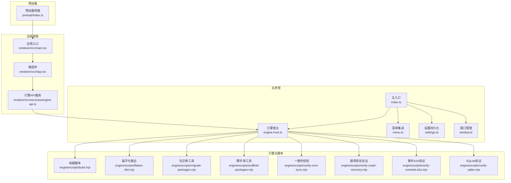
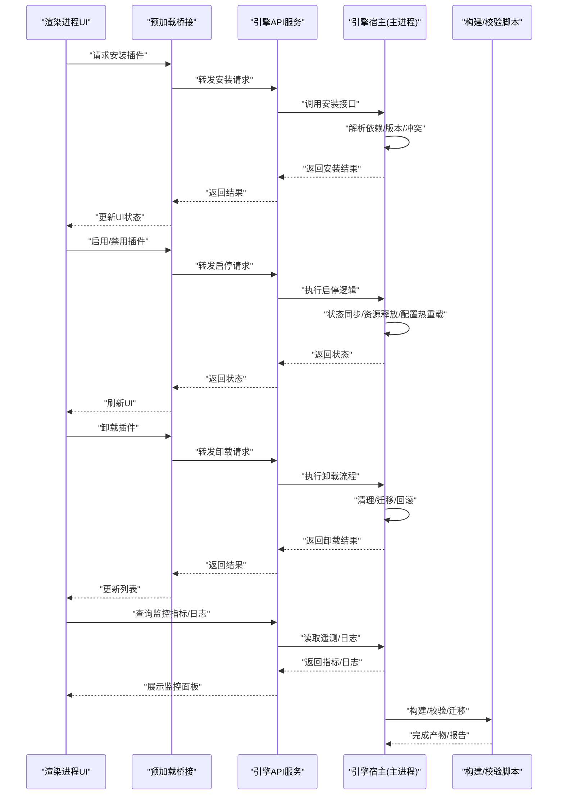
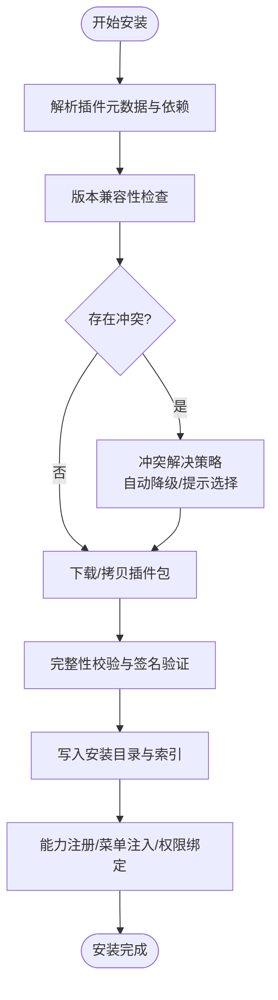
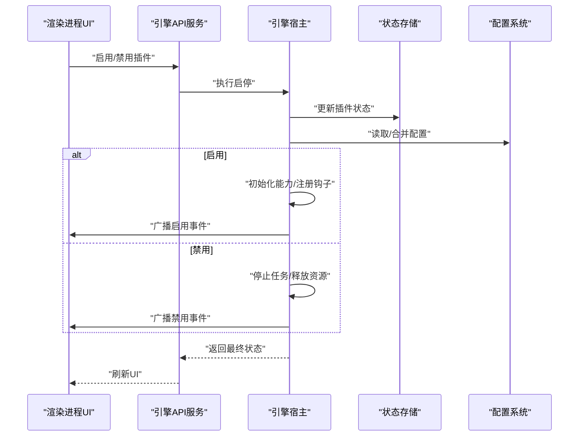
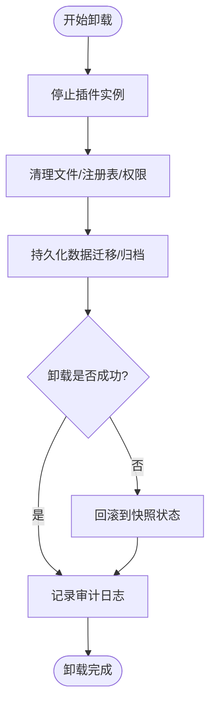
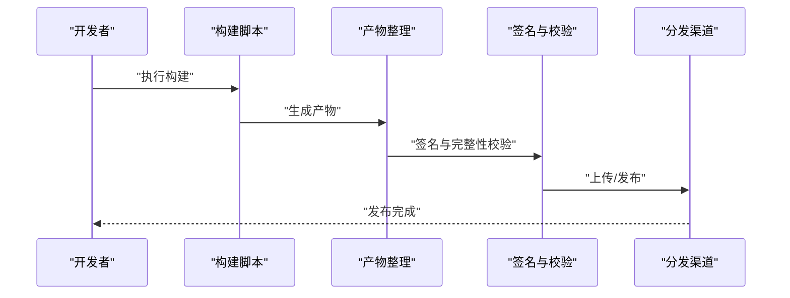
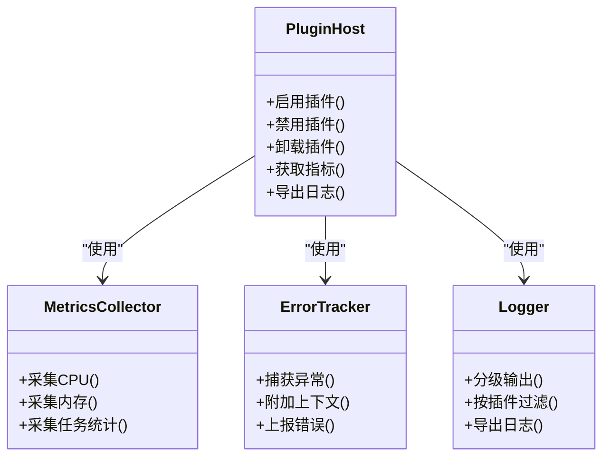
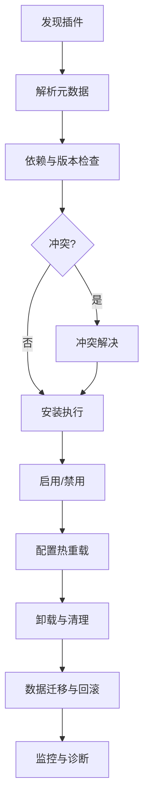
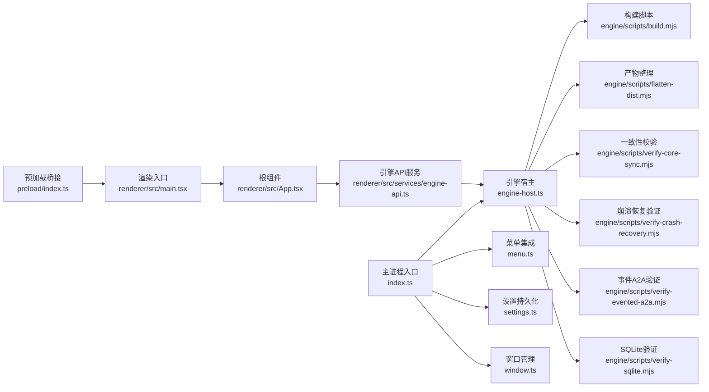

# 插件生命周期管理

<cite>
**本文引用的文件**   
- [engine-host.ts](file://app/main/engine-host.ts)
- [index.ts](file://app/main/index.ts)
- [menu.ts](file://app/main/menu.ts)
- [settings.ts](file://app/main/settings.ts)
- [window.ts](file://app/main/window.ts)
- [index.ts](file://app/preload/index.ts)
- [App.tsx](file://app/renderer/src/App.tsx)
- [main.tsx](file://app/renderer/src/main.tsx)
- [engine-api.ts](file://app/renderer/src/services/engine-api.ts)
- [package.json](file://app/package.json)
- [electron-builder.yml](file://app/electron-builder.yml)
- [build.mjs](file://engine/scripts/build.mjs)
- [flatten-dist.mjs](file://engine/scripts/flatten-dist.mjs)
- [migrate-packages.mjs](file://engine/scripts/migrate-packages.mjs)
- [scaffold-packages.mjs](file://engine/scripts/scaffold-packages.mjs)
- [verify-core-sync.mjs](file://engine/scripts/verify-core-sync.mjs)
- [verify-crash-recovery.mjs](file://engine/scripts/verify-crash-recovery.mjs)
- [verify-evented-a2a.mjs](file://engine/scripts/verify-evented-a2a.mjs)
- [verify-sqlite.mjs](file://engine/scripts/verify-sqlite.mjs)
- [plugin-host.test.ts](file://engine/tests/plugin-host.test.ts)
- [marketplace.test.ts](file://engine/tests/marketplace.test.ts)
- [manifest.test.ts](file://engine/tests/manifest.test.ts)
- [http-server.test.ts](file://engine/tests/http-server.test.ts)
- [opentelemetry.test.ts](file://engine/tests/opentelemetry.test.ts)
</cite>

## 目录
1. [简介](#简介)
2. [项目结构](#项目结构)
3. [核心组件](#核心组件)
4. [架构总览](#架构总览)
5. [详细组件分析](#详细组件分析)
6. [依赖分析](#依赖分析)
7. [性能考虑](#性能考虑)
8. [故障排查指南](#故障排查指南)
9. [结论](#结论)
10. [附录](#附录)

## 简介
本技术文档围绕KCoder的“插件生命周期管理”展开，覆盖以下关键主题：
- 插件安装流程：依赖解析、版本检查、冲突解决
- 插件启用/禁用机制：状态同步、资源释放、配置热重载
- 插件卸载过程：清理操作、数据迁移、回滚策略
- 插件打包与发布：构建脚本、签名验证、分发渠道
- 插件监控与诊断：性能指标、错误追踪、日志收集

本文面向开发者与维护者，既提供高层架构视图，也给出代码级实现要点与可视化图示，帮助读者快速理解并扩展KCoder的插件体系。

## 项目结构
仓库采用多包工作区组织，主应用位于 app/，引擎与插件生态位于 engine/。与插件生命周期直接相关的模块主要分布在：
- 主进程侧：负责插件宿主、菜单集成、设置持久化、窗口生命周期等
- 渲染进程侧：通过服务层调用引擎API，驱动UI展示与交互
- 引擎侧：包含插件宿主测试、市场/清单校验、HTTP服务器与可观测性相关测试与脚本

图表来源
- [index.ts](file://app/main/index.ts)
- [engine-host.ts](file://app/main/engine-host.ts)
- [menu.ts](file://app/main/menu.ts)
- [settings.ts](file://app/main/settings.ts)
- [window.ts](file://app/main/window.ts)
- [index.ts](file://app/preload/index.ts)
- [main.tsx](file://app/renderer/src/main.tsx)
- [App.tsx](file://app/renderer/src/App.tsx)
- [engine-api.ts](file://app/renderer/src/services/engine-api.ts)
- [build.mjs](file://engine/scripts/build.mjs)
- [flatten-dist.mjs](file://engine/scripts/flatten-dist.mjs)
- [migrate-packages.mjs](file://engine/scripts/migrate-packages.mjs)
- [scaffold-packages.mjs](file://engine/scripts/scaffold-packages.mjs)
- [verify-core-sync.mjs](file://engine/scripts/verify-core-sync.mjs)
- [verify-crash-recovery.mjs](file://engine/scripts/verify-crash-recovery.mjs)
- [verify-evented-a2a.mjs](file://engine/scripts/verify-evented-a2a.mjs)
- [verify-sqlite.mjs](file://engine/scripts/verify-sqlite.mjs)

章节来源
- [index.ts](file://app/main/index.ts)
- [engine-host.ts](file://app/main/engine-host.ts)
- [menu.ts](file://app/main/menu.ts)
- [settings.ts](file://app/main/settings.ts)
- [window.ts](file://app/main/window.ts)
- [index.ts](file://app/preload/index.ts)
- [main.tsx](file://app/renderer/src/main.tsx)
- [App.tsx](file://app/renderer/src/App.tsx)
- [engine-api.ts](file://app/renderer/src/services/engine-api.ts)
- [build.mjs](file://engine/scripts/build.mjs)
- [flatten-dist.mjs](file://engine/scripts/flatten-dist.mjs)
- [migrate-packages.mjs](file://engine/scripts/migrate-packages.mjs)
- [scaffold-packages.mjs](file://engine/scripts/scaffold-packages.mjs)
- [verify-core-sync.mjs](file://engine/scripts/verify-core-sync.mjs)
- [verify-crash-recovery.mjs](file://engine/scripts/verify-crash-recovery.mjs)
- [verify-evented-a2a.mjs](file://engine/scripts/verify-evented-a2a.mjs)
- [verify-sqlite.mjs](file://engine/scripts/verify-sqlite.mjs)

## 核心组件
- 主进程入口与初始化：负责启动引擎宿主、注册菜单项、加载设置、创建窗口，并在合适时机触发插件系统的初始化与就绪回调。
- 引擎宿主（Plugin Host）：作为插件运行时的核心，负责插件发现、加载、启停、隔离、通信桥接、能力暴露与生命周期钩子。
- 渲染进程服务层：封装对引擎API的调用，将插件状态、配置变更、事件通知以统一接口暴露给UI。
- 预加载桥接：在安全沙箱中向渲染进程暴露必要的IPC通道，用于插件控制面与渲染层的通信。
- 构建与发布脚本：提供构建、产物整理、包迁移、一致性校验、崩溃恢复与数据库验证等工程化能力。

章节来源
- [index.ts](file://app/main/index.ts)
- [engine-host.ts](file://app/main/engine-host.ts)
- [engine-api.ts](file://app/renderer/src/services/engine-api.ts)
- [index.ts](file://app/preload/index.ts)
- [build.mjs](file://engine/scripts/build.mjs)
- [flatten-dist.mjs](file://engine/scripts/flatten-dist.mjs)
- [migrate-packages.mjs](file://engine/scripts/migrate-packages.mjs)
- [scaffold-packages.mjs](file://engine/scripts/scaffold-packages.mjs)
- [verify-core-sync.mjs](file://engine/scripts/verify-core-sync.mjs)
- [verify-crash-recovery.mjs](file://engine/scripts/verify-crash-recovery.mjs)
- [verify-evented-a2a.mjs](file://engine/scripts/verify-evented-a2a.mjs)
- [verify-sqlite.mjs](file://engine/scripts/verify-sqlite.mjs)

## 架构总览
下图展示了从渲染进程到引擎宿主的插件生命周期关键路径，包括安装、启用/禁用、卸载以及监控与诊断的接入点。

图表来源
- [engine-host.ts](file://app/main/engine-host.ts)
- [engine-api.ts](file://app/renderer/src/services/engine-api.ts)
- [index.ts](file://app/preload/index.ts)
- [build.mjs](file://engine/scripts/build.mjs)
- [verify-core-sync.mjs](file://engine/scripts/verify-core-sync.mjs)
- [verify-crash-recovery.mjs](file://engine/scripts/verify-crash-recovery.mjs)
- [verify-evented-a2a.mjs](file://engine/scripts/verify-evented-a2a.mjs)
- [verify-sqlite.mjs](file://engine/scripts/verify-sqlite.mjs)

## 详细组件分析

### 插件安装流程（依赖解析、版本检查、冲突解决）
- 依赖解析：在安装前对插件元数据与依赖声明进行解析，识别必要依赖、可选依赖与运行时要求。
- 版本检查：对比目标版本与当前环境兼容范围，确保满足最低/最高版本约束。
- 冲突解决：检测已安装插件或内置能力的命名空间、API版本、端口占用等冲突，并提供自动降级或提示用户选择。
- 安装执行：下载/拷贝插件包，校验完整性，写入安装目录，更新索引与缓存。
- 安装后处理：触发能力注册、菜单注入、权限绑定与初始配置合并。

图表来源
- [engine-host.ts](file://app/main/engine-host.ts)
- [manifest.test.ts](file://engine/tests/manifest.test.ts)
- [marketplace.test.ts](file://engine/tests/marketplace.test.ts)

章节来源
- [engine-host.ts](file://app/main/engine-host.ts)
- [manifest.test.ts](file://engine/tests/manifest.test.ts)
- [marketplace.test.ts](file://engine/tests/marketplace.test.ts)

### 插件启用/禁用机制（状态同步、资源释放、配置热重载）
- 状态同步：启用/禁用时更新插件状态存储，广播状态变更事件，确保UI与后端一致。
- 资源释放：禁用时停止定时器、关闭连接、释放内存句柄与外部资源，避免泄漏。
- 配置热重载：在不重启宿主的前提下，重新加载插件配置并应用变更，必要时触发增量重建。
- 幂等与回退：启停操作需具备幂等性；失败时回退至上一稳定状态。

图表来源
- [engine-host.ts](file://app/main/engine-host.ts)
- [engine-api.ts](file://app/renderer/src/services/engine-api.ts)
- [settings.ts](file://app/main/settings.ts)

章节来源
- [engine-host.ts](file://app/main/engine-host.ts)
- [engine-api.ts](file://app/renderer/src/services/engine-api.ts)
- [settings.ts](file://app/main/settings.ts)

### 插件卸载过程（清理操作、数据迁移、回滚策略）
- 清理操作：移除插件文件、清理注册表、撤销菜单与快捷键、解除权限与订阅。
- 数据迁移：若插件产生持久化数据，卸载时需按策略迁移或归档，避免破坏其他插件或宿主数据。
- 回滚策略：卸载失败时回滚到卸载前的快照状态，保证宿主稳定性。
- 审计与日志：记录卸载动作、影响范围与异常信息，便于问题定位。

图表来源
- [engine-host.ts](file://app/main/engine-host.ts)
- [migrate-packages.mjs](file://engine/scripts/migrate-packages.mjs)

章节来源
- [engine-host.ts](file://app/main/engine-host.ts)
- [migrate-packages.mjs](file://engine/scripts/migrate-packages.mjs)

### 插件打包与发布（构建脚本、签名验证、分发渠道）
- 构建脚本：统一编译、依赖树整理、产物输出与版本标记。
- 产物整理：扁平化输出、去重与最小化，生成可分发包。
- 签名验证：对产物进行签名与校验，确保来源可信与完整性。
- 分发渠道：支持本地目录、私有仓库或市场平台，提供安装器与更新机制。

图表来源
- [build.mjs](file://engine/scripts/build.mjs)
- [flatten-dist.mjs](file://engine/scripts/flatten-dist.mjs)
- [verify-core-sync.mjs](file://engine/scripts/verify-core-sync.mjs)
- [verify-crash-recovery.mjs](file://engine/scripts/verify-crash-recovery.mjs)
- [verify-evented-a2a.mjs](file://engine/scripts/verify-evented-a2a.mjs)
- [verify-sqlite.mjs](file://engine/scripts/verify-sqlite.mjs)
- [package.json](file://app/package.json)
- [electron-builder.yml](file://app/electron-builder.yml)

章节来源
- [build.mjs](file://engine/scripts/build.mjs)
- [flatten-dist.mjs](file://engine/scripts/flatten-dist.mjs)
- [verify-core-sync.mjs](file://engine/scripts/verify-core-sync.mjs)
- [verify-crash-recovery.mjs](file://engine/scripts/verify-crash-recovery.mjs)
- [verify-evented-a2a.mjs](file://engine/scripts/verify-evented-a2a.mjs)
- [verify-sqlite.mjs](file://engine/scripts/verify-sqlite.mjs)
- [package.json](file://app/package.json)
- [electron-builder.yml](file://app/electron-builder.yml)

### 插件监控与诊断（性能指标、错误追踪、日志收集）
- 性能指标：采集插件启停耗时、资源占用、任务吞吐与延迟分布。
- 错误追踪：捕获异常堆栈、上下文信息与关联事件，聚合上报。
- 日志收集：结构化日志分级输出，支持按插件维度过滤与导出。
- 可观测性集成：对接OpenTelemetry等标准，统一Trace/Metric/Log。

图表来源
- [engine-host.ts](file://app/main/engine-host.ts)
- [opentelemetry.test.ts](file://engine/tests/opentelemetry.test.ts)
- [http-server.test.ts](file://engine/tests/http-server.test.ts)

章节来源
- [engine-host.ts](file://app/main/engine-host.ts)
- [opentelemetry.test.ts](file://engine/tests/opentelemetry.test.ts)
- [http-server.test.ts](file://engine/tests/http-server.test.ts)

### 概念总览
以下为插件生命周期的概念流程图，不直接映射具体源码文件，用于帮助理解整体步骤与决策点。

[此图为概念图，无需图表来源]

## 依赖分析
- 主进程与渲染进程通过预加载桥接进行通信，渲染进程的服务层封装了引擎API调用，降低耦合度。
- 引擎宿主依赖构建与校验脚本，确保插件产物的一致性与可靠性。
- 测试用例覆盖插件宿主、市场、清单、HTTP服务器与可观测性等关键路径，保障质量。

图表来源
- [index.ts](file://app/main/index.ts)
- [engine-host.ts](file://app/main/engine-host.ts)
- [menu.ts](file://app/main/menu.ts)
- [settings.ts](file://app/main/settings.ts)
- [window.ts](file://app/main/window.ts)
- [index.ts](file://app/preload/index.ts)
- [main.tsx](file://app/renderer/src/main.tsx)
- [App.tsx](file://app/renderer/src/App.tsx)
- [engine-api.ts](file://app/renderer/src/services/engine-api.ts)
- [build.mjs](file://engine/scripts/build.mjs)
- [flatten-dist.mjs](file://engine/scripts/flatten-dist.mjs)
- [verify-core-sync.mjs](file://engine/scripts/verify-core-sync.mjs)
- [verify-crash-recovery.mjs](file://engine/scripts/verify-crash-recovery.mjs)
- [verify-evented-a2a.mjs](file://engine/scripts/verify-evented-a2a.mjs)
- [verify-sqlite.mjs](file://engine/scripts/verify-sqlite.mjs)

章节来源
- [index.ts](file://app/main/index.ts)
- [engine-host.ts](file://app/main/engine-host.ts)
- [menu.ts](file://app/main/menu.ts)
- [settings.ts](file://app/main/settings.ts)
- [window.ts](file://app/main/window.ts)
- [index.ts](file://app/preload/index.ts)
- [main.tsx](file://app/renderer/src/main.tsx)
- [App.tsx](file://app/renderer/src/App.tsx)
- [engine-api.ts](file://app/renderer/src/services/engine-api.ts)
- [build.mjs](file://engine/scripts/build.mjs)
- [flatten-dist.mjs](file://engine/scripts/flatten-dist.mjs)
- [verify-core-sync.mjs](file://engine/scripts/verify-core-sync.mjs)
- [verify-crash-recovery.mjs](file://engine/scripts/verify-crash-recovery.mjs)
- [verify-evented-a2a.mjs](file://engine/scripts/verify-evented-a2a.mjs)
- [verify-sqlite.mjs](file://engine/scripts/verify-sqlite.mjs)

## 性能考虑
- 插件加载应异步化与懒加载，减少主线程阻塞时间。
- 资源释放需在禁用与卸载时严格回收，避免内存泄漏。
- 配置热重载应增量生效，避免全量重建带来的抖动。
- 监控与日志采样需可控，避免高负载下I/O放大。
- 构建与校验脚本应并行化与缓存命中，缩短CI/CD周期。

[本节为通用指导，无需章节来源]

## 故障排查指南
- 安装失败：检查依赖解析与版本约束，查看冲突解决日志与签名校验结果。
- 启用/禁用异常：确认状态同步是否落盘，核对资源释放顺序与配置热重载路径。
- 卸载回滚：比对快照差异，定位未清理的资源或锁持有者。
- 监控缺失：验证指标采集链路、错误上报通道与日志导出配置。
- 构建问题：运行一致性校验与崩溃恢复验证，确认产物结构与依赖树正确。

章节来源
- [plugin-host.test.ts](file://engine/tests/plugin-host.test.ts)
- [marketplace.test.ts](file://engine/tests/marketplace.test.ts)
- [manifest.test.ts](file://engine/tests/manifest.test.ts)
- [http-server.test.ts](file://engine/tests/http-server.test.ts)
- [opentelemetry.test.ts](file://engine/tests/opentelemetry.test.ts)

## 结论
KCoder的插件生命周期管理在主进程与渲染进程之间形成清晰的职责边界：渲染层负责交互与服务封装，主进程承载宿主与资源治理，引擎脚本提供构建与校验支撑。通过完善的安装、启停、卸载流程与监控诊断能力，系统在可扩展性与稳定性之间取得平衡。建议持续完善冲突解决策略、回滚机制与可观测性指标，以提升用户体验与运维效率。

[本节为总结，无需章节来源]

## 附录
- 构建与发布参考：
  - 构建脚本：[build.mjs](file://engine/scripts/build.mjs)
  - 产物整理：[flatten-dist.mjs](file://engine/scripts/flatten-dist.mjs)
  - 包迁移工具：[migrate-packages.mjs](file://engine/scripts/migrate-packages.mjs)
  - 脚手架工具：[scaffold-packages.mjs](file://engine/scripts/scaffold-packages.mjs)
  - 一致性校验：[verify-core-sync.mjs](file://engine/scripts/verify-core-sync.mjs)
  - 崩溃恢复验证：[verify-crash-recovery.mjs](file://engine/scripts/verify-crash-recovery.mjs)
  - 事件A2A验证：[verify-evented-a2a.mjs](file://engine/scripts/verify-evented-a2a.mjs)
  - SQLite验证：[verify-sqlite.mjs](file://engine/scripts/verify-sqlite.mjs)
- 应用打包配置：
  - 应用包描述：[package.json](file://app/package.json)
  - Electron构建配置：[electron-builder.yml](file://app/electron-builder.yml)

[本节为附录，无需章节来源]