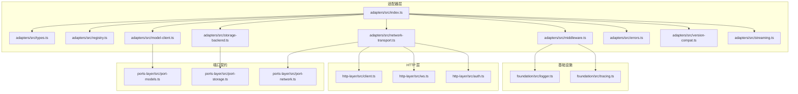
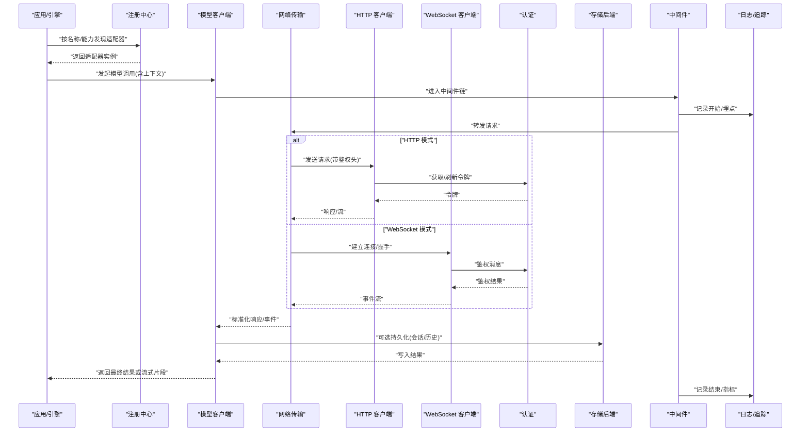
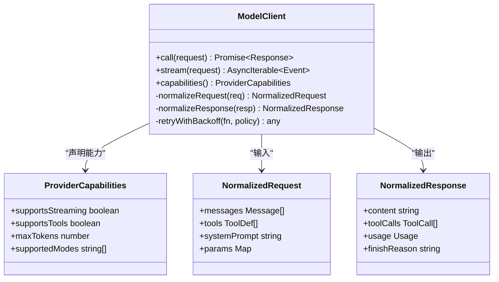
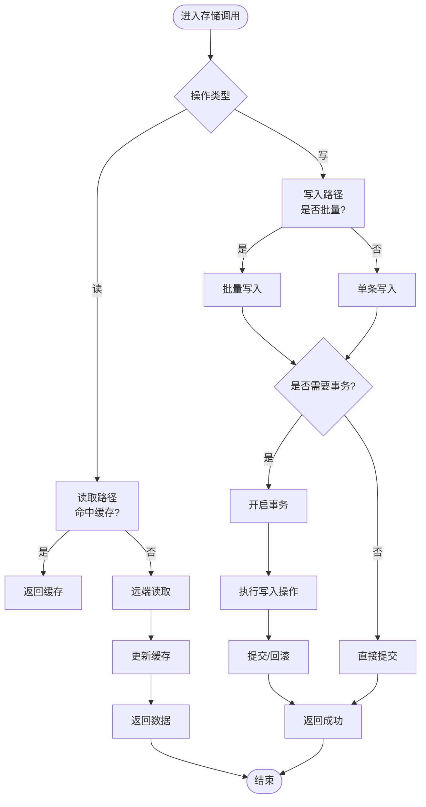
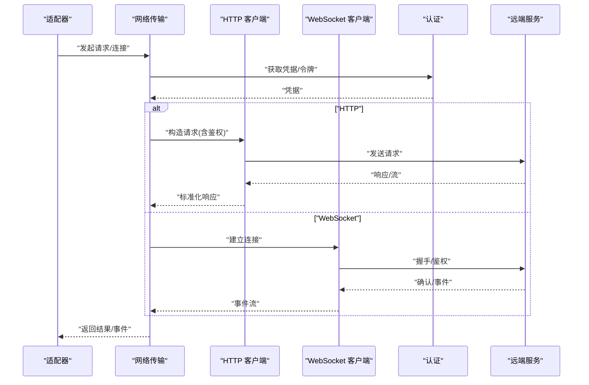
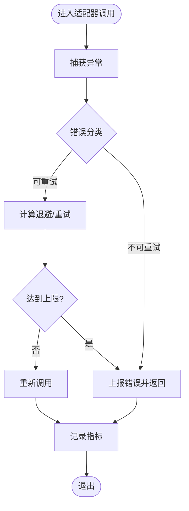
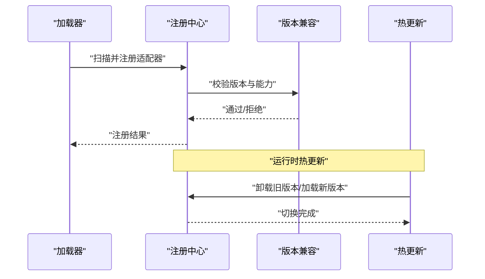
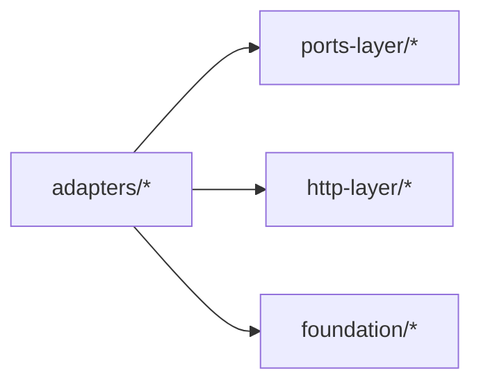

# 适配器插件接口

<cite>
**本文引用的文件**   
- [engine/packages/adapters/README.md](file://engine/packages/adapters/README.md)
- [engine/packages/adapters/src/index.ts](file://engine/packages/adapters/src/index.ts)
- [engine/packages/adapters/src/types.ts](file://engine/packages/adapters/src/types.ts)
- [engine/packages/adapters/src/registry.ts](file://engine/packages/adapters/src/registry.ts)
- [engine/packages/adapters/src/model-client.ts](file://engine/packages/adapters/src/model-client.ts)
- [engine/packages/adapters/src/storage-backend.ts](file://engine/packages/adapters/src/storage-backend.ts)
- [engine/packages/adapters/src/network-transport.ts](file://engine/packages/adapters/src/network-transport.ts)
- [engine/packages/adapters/src/errors.ts](file://engine/packages/adapters/src/errors.ts)
- [engine/packages/adapters/src/middleware.ts](file://engine/packages/adapters/src/middleware.ts)
- [engine/packages/adapters/src/version-compat.ts](file://engine/packages/adapters/src/version-compat.ts)
- [engine/packages/adapters/src/streaming.ts](file://engine/packages/adapters/src/streaming.ts)
- [engine/packages/http-layer/src/client.ts](file://engine/packages/http-layer/src/client.ts)
- [engine/packages/http-layer/src/ws.ts](file://engine/packages/http-layer/src/ws.ts)
- [engine/packages/http-layer/src/auth.ts](file://engine/packages/http-layer/src/auth.ts)
- [engine/packages/foundation/src/logger.ts](file://engine/packages/foundation/src/logger.ts)
- [engine/packages/foundation/src/tracing.ts](file://engine/packages/foundation/src/tracing.ts)
- [engine/packages/ports-layer/src/port-models.ts](file://engine/packages/ports-layer/src/port-models.ts)
- [engine/packages/ports-layer/src/port-storage.ts](file://engine/packages/ports-layer/src/port-storage.ts)
- [engine/packages/ports-layer/src/port-network.ts](file://engine/packages/ports-layer/src/port-network.ts)
</cite>

## 目录
1. [简介](#简介)
2. [项目结构](#项目结构)
3. [核心组件](#核心组件)
4. [架构总览](#架构总览)
5. [详细组件分析](#详细组件分析)
6. [依赖分析](#依赖分析)
7. [性能考虑](#性能考虑)
8. [故障排查指南](#故障排查指南)
9. [结论](#结论)
10. [附录](#附录)

## 简介
本文件为 KCoder 引擎的“适配器插件接口”技术文档，面向需要扩展 LLM 提供商、存储后端与网络传输的开发者。文档覆盖以下能力：
- LLM 提供商适配接口：模型客户端实现、请求响应格式、流式处理机制
- 存储后端适配接口：持久化操作、查询优化、事务支持
- 网络协议适配接口：HTTP 客户端、WebSocket 连接、认证机制
- 适配器开发指南：错误处理、重试策略、性能监控
- 适配器注册发现机制、版本兼容性检查与热更新支持

## 项目结构
KCoder 引擎采用多包（monorepo）组织，适配器相关代码集中在 engine/packages/adapters 下，并通过 ports-layer 定义对外契约，foundation 提供通用基础设施，http-layer 提供 HTTP/WebSocket 抽象。

图表来源
- [engine/packages/adapters/src/index.ts](file://engine/packages/adapters/src/index.ts)
- [engine/packages/adapters/src/types.ts](file://engine/packages/adapters/src/types.ts)
- [engine/packages/adapters/src/registry.ts](file://engine/packages/adapters/src/registry.ts)
- [engine/packages/adapters/src/model-client.ts](file://engine/packages/adapters/src/model-client.ts)
- [engine/packages/adapters/src/storage-backend.ts](file://engine/packages/adapters/src/storage-backend.ts)
- [engine/packages/adapters/src/network-transport.ts](file://engine/packages/adapters/src/network-transport.ts)
- [engine/packages/adapters/src/middleware.ts](file://engine/packages/adapters/src/middleware.ts)
- [engine/packages/adapters/src/errors.ts](file://engine/packages/adapters/src/errors.ts)
- [engine/packages/adapters/src/version-compat.ts](file://engine/packages/adapters/src/version-compat.ts)
- [engine/packages/adapters/src/streaming.ts](file://engine/packages/adapters/src/streaming.ts)
- [engine/packages/ports-layer/src/port-models.ts](file://engine/packages/ports-layer/src/port-models.ts)
- [engine/packages/ports-layer/src/port-storage.ts](file://engine/packages/ports-layer/src/port-storage.ts)
- [engine/packages/ports-layer/src/port-network.ts](file://engine/packages/ports-layer/src/port-network.ts)
- [engine/packages/http-layer/src/client.ts](file://engine/packages/http-layer/src/client.ts)
- [engine/packages/http-layer/src/ws.ts](file://engine/packages/http-layer/src/ws.ts)
- [engine/packages/http-layer/src/auth.ts](file://engine/packages/http-layer/src/auth.ts)
- [engine/packages/foundation/src/logger.ts](file://engine/packages/foundation/src/logger.ts)
- [engine/packages/foundation/src/tracing.ts](file://engine/packages/foundation/src/tracing.ts)

章节来源
- [engine/packages/adapters/README.md](file://engine/packages/adapters/README.md)
- [engine/packages/adapters/src/index.ts](file://engine/packages/adapters/src/index.ts)

## 核心组件
- 适配器类型与契约：在 types.ts 中定义统一的适配器接口，包括模型调用、存储访问、网络传输等；ports-layer 中的 port-* 文件进一步固化跨模块契约。
- 注册中心：registry.ts 负责适配器的注册、发现、生命周期管理与元数据校验。
- 模型客户端：model-client.ts 封装对 LLM 提供商的统一调用入口，屏蔽不同厂商差异。
- 存储后端：storage-backend.ts 提供键值/关系型/对象存储的统一抽象，支持事务与查询优化。
- 网络传输：network-transport.ts 统一 HTTP/WebSocket 通道，集成认证与重试。
- 中间件与可观测性：middleware.ts 串联日志、追踪、指标采集与错误归一化。
- 版本兼容：version-compat.ts 提供语义化版本检查与降级策略。
- 流式处理：streaming.ts 提供 SSE/WS 流式事件管道与背压控制。

章节来源
- [engine/packages/adapters/src/types.ts](file://engine/packages/adapters/src/types.ts)
- [engine/packages/adapters/src/registry.ts](file://engine/packages/adapters/src/registry.ts)
- [engine/packages/adapters/src/model-client.ts](file://engine/packages/adapters/src/model-client.ts)
- [engine/packages/adapters/src/storage-backend.ts](file://engine/packages/adapters/src/storage-backend.ts)
- [engine/packages/adapters/src/network-transport.ts](file://engine/packages/adapters/src/network-transport.ts)
- [engine/packages/adapters/src/middleware.ts](file://engine/packages/adapters/src/middleware.ts)
- [engine/packages/adapters/src/version-compat.ts](file://engine/packages/adapters/src/version-compat.ts)
- [engine/packages/adapters/src/streaming.ts](file://engine/packages/adapters/src/streaming.ts)
- [engine/packages/ports-layer/src/port-models.ts](file://engine/packages/ports-layer/src/port-models.ts)
- [engine/packages/ports-layer/src/port-storage.ts](file://engine/packages/ports-layer/src/port-storage.ts)
- [engine/packages/ports-layer/src/port-network.ts](file://engine/packages/ports-layer/src/port-network.ts)

## 架构总览
适配器层通过 ports-layer 暴露稳定契约，内部由 http-layer 完成具体网络实现，foundation 提供日志与追踪。注册中心统一管理适配器实例，运行时根据配置动态选择并注入。

图表来源
- [engine/packages/adapters/src/registry.ts](file://engine/packages/adapters/src/registry.ts)
- [engine/packages/adapters/src/model-client.ts](file://engine/packages/adapters/src/model-client.ts)
- [engine/packages/adapters/src/network-transport.ts](file://engine/packages/adapters/src/network-transport.ts)
- [engine/packages/http-layer/src/client.ts](file://engine/packages/http-layer/src/client.ts)
- [engine/packages/http-layer/src/ws.ts](file://engine/packages/http-layer/src/ws.ts)
- [engine/packages/http-layer/src/auth.ts](file://engine/packages/http-layer/src/auth.ts)
- [engine/packages/adapters/src/storage-backend.ts](file://engine/packages/adapters/src/storage-backend.ts)
- [engine/packages/adapters/src/middleware.ts](file://engine/packages/adapters/src/middleware.ts)
- [engine/packages/foundation/src/logger.ts](file://engine/packages/foundation/src/logger.ts)
- [engine/packages/foundation/src/tracing.ts](file://engine/packages/foundation/src/tracing.ts)

## 详细组件分析

### LLM 提供商适配接口
- 模型客户端职责
  - 统一入参：消息序列、工具定义、系统提示、参数与预算约束
  - 统一出参：结构化响应、函数调用、流式增量
  - 自动重试与退避：针对瞬时失败进行指数退避与熔断
  - 计费与用量统计：token 计数、成本估算、配额控制
- 请求响应格式
  - 标准化消息体与工具调用协议，屏蔽各厂商差异
  - 支持非流式与流式两种模式，流式以事件为单位推送
- 流式处理机制
  - 基于 streaming.ts 的事件管道，支持背压与取消
  - 将下游 SSE/WS 事件转换为统一增量事件

图表来源
- [engine/packages/adapters/src/model-client.ts](file://engine/packages/adapters/src/model-client.ts)
- [engine/packages/adapters/src/types.ts](file://engine/packages/adapters/src/types.ts)
- [engine/packages/adapters/src/streaming.ts](file://engine/packages/adapters/src/streaming.ts)
- [engine/packages/ports-layer/src/port-models.ts](file://engine/packages/ports-layer/src/port-models.ts)

章节来源
- [engine/packages/adapters/src/model-client.ts](file://engine/packages/adapters/src/model-client.ts)
- [engine/packages/adapters/src/types.ts](file://engine/packages/adapters/src/types.ts)
- [engine/packages/adapters/src/streaming.ts](file://engine/packages/adapters/src/streaming.ts)
- [engine/packages/ports-layer/src/port-models.ts](file://engine/packages/ports-layer/src/port-models.ts)

### 存储后端适配接口
- 持久化操作
  - 键值/文档/关系表等多形态抽象，提供 get/set/delete/list/query 等基础方法
  - 批量写入与幂等键设计，避免重复写入
- 查询优化
  - 索引建议与分页游标，支持前缀扫描与范围查询
  - 缓存层与热点键本地缓存，降低远端压力
- 事务支持
  - 原子写组、回滚与隔离级别控制
  - 长事务保护与超时中断

图表来源
- [engine/packages/adapters/src/storage-backend.ts](file://engine/packages/adapters/src/storage-backend.ts)
- [engine/packages/ports-layer/src/port-storage.ts](file://engine/packages/ports-layer/src/port-storage.ts)

章节来源
- [engine/packages/adapters/src/storage-backend.ts](file://engine/packages/adapters/src/storage-backend.ts)
- [engine/packages/ports-layer/src/port-storage.ts](file://engine/packages/ports-layer/src/port-storage.ts)

### 网络协议适配接口
- HTTP 客户端
  - 统一请求构建、重试与超时、连接池与并发限制
  - 响应解码与错误映射，支持分块下载
- WebSocket 连接
  - 连接管理、心跳保活、断线重连与状态机
  - 事件分发与去抖合并
- 认证机制
  - Token 获取/刷新、签名与鉴权头注入
  - 凭据安全存储与最小权限原则

图表来源
- [engine/packages/adapters/src/network-transport.ts](file://engine/packages/adapters/src/network-transport.ts)
- [engine/packages/http-layer/src/client.ts](file://engine/packages/http-layer/src/client.ts)
- [engine/packages/http-layer/src/ws.ts](file://engine/packages/http-layer/src/ws.ts)
- [engine/packages/http-layer/src/auth.ts](file://engine/packages/http-layer/src/auth.ts)

章节来源
- [engine/packages/adapters/src/network-transport.ts](file://engine/packages/adapters/src/network-transport.ts)
- [engine/packages/http-layer/src/client.ts](file://engine/packages/http-layer/src/client.ts)
- [engine/packages/http-layer/src/ws.ts](file://engine/packages/http-layer/src/ws.ts)
- [engine/packages/http-layer/src/auth.ts](file://engine/packages/http-layer/src/auth.ts)

### 适配器开发指南
- 错误处理
  - 使用 errors.ts 定义统一错误码与异常层次，区分可重试与不可重试错误
  - 在中间件中捕获并上报，附带上下文与链路 ID
- 重试策略
  - 指数退避、抖动、最大重试次数与熔断阈值
  - 针对幂等操作启用重试，非幂等需用户显式授权
- 性能监控
  - 通过 middleware.ts 接入 foundation 的 logger 与 tracing，记录耗时、吞吐与错误率
  - 关键路径埋点：网络往返、序列化、流式增量、存储读写

图表来源
- [engine/packages/adapters/src/errors.ts](file://engine/packages/adapters/src/errors.ts)
- [engine/packages/adapters/src/middleware.ts](file://engine/packages/adapters/src/middleware.ts)
- [engine/packages/foundation/src/logger.ts](file://engine/packages/foundation/src/logger.ts)
- [engine/packages/foundation/src/tracing.ts](file://engine/packages/foundation/src/tracing.ts)

章节来源
- [engine/packages/adapters/src/errors.ts](file://engine/packages/adapters/src/errors.ts)
- [engine/packages/adapters/src/middleware.ts](file://engine/packages/adapters/src/middleware.ts)
- [engine/packages/foundation/src/logger.ts](file://engine/packages/foundation/src/logger.ts)
- [engine/packages/foundation/src/tracing.ts](file://engine/packages/foundation/src/tracing.ts)

### 适配器注册发现机制、版本兼容与热更新
- 注册与发现
  - registry.ts 维护适配器清单、能力标签与元数据，支持按名称/能力检索
  - 启动时加载内置与外部适配器，运行时可动态注册
- 版本兼容性检查
  - version-compat.ts 基于语义化版本进行兼容矩阵校验，不满足条件则拒绝加载或降级
- 热更新支持
  - 支持在不重启进程的情况下卸载旧版本、加载新版本，保持活跃请求不受影响
  - 切换时进行优雅过渡：流量灰度与回滚策略

图表来源
- [engine/packages/adapters/src/registry.ts](file://engine/packages/adapters/src/registry.ts)
- [engine/packages/adapters/src/version-compat.ts](file://engine/packages/adapters/src/version-compat.ts)

章节来源
- [engine/packages/adapters/src/registry.ts](file://engine/packages/adapters/src/registry.ts)
- [engine/packages/adapters/src/version-compat.ts](file://engine/packages/adapters/src/version-compat.ts)

## 依赖分析
- 适配器层依赖 ports-layer 的契约定义，确保跨模块一致性
- 网络传输依赖 http-layer 的具体实现，屏蔽底层细节
- 可观测性依赖 foundation 的日志与追踪模块
- 注册中心与版本兼容模块为横切关注点，被所有适配器共享

图表来源
- [engine/packages/adapters/src/index.ts](file://engine/packages/adapters/src/index.ts)
- [engine/packages/ports-layer/src/port-models.ts](file://engine/packages/ports-layer/src/port-models.ts)
- [engine/packages/ports-layer/src/port-storage.ts](file://engine/packages/ports-layer/src/port-storage.ts)
- [engine/packages/ports-layer/src/port-network.ts](file://engine/packages/ports-layer/src/port-network.ts)
- [engine/packages/http-layer/src/client.ts](file://engine/packages/http-layer/src/client.ts)
- [engine/packages/http-layer/src/ws.ts](file://engine/packages/http-layer/src/ws.ts)
- [engine/packages/http-layer/src/auth.ts](file://engine/packages/http-layer/src/auth.ts)
- [engine/packages/foundation/src/logger.ts](file://engine/packages/foundation/src/logger.ts)
- [engine/packages/foundation/src/tracing.ts](file://engine/packages/foundation/src/tracing.ts)

章节来源
- [engine/packages/adapters/src/index.ts](file://engine/packages/adapters/src/index.ts)
- [engine/packages/ports-layer/src/port-models.ts](file://engine/packages/ports-layer/src/port-models.ts)
- [engine/packages/ports-layer/src/port-storage.ts](file://engine/packages/ports-layer/src/port-storage.ts)
- [engine/packages/ports-layer/src/port-network.ts](file://engine/packages/ports-layer/src/port-network.ts)
- [engine/packages/http-layer/src/client.ts](file://engine/packages/http-layer/src/client.ts)
- [engine/packages/http-layer/src/ws.ts](file://engine/packages/http-layer/src/ws.ts)
- [engine/packages/http-layer/src/auth.ts](file://engine/packages/http-layer/src/auth.ts)
- [engine/packages/foundation/src/logger.ts](file://engine/packages/foundation/src/logger.ts)
- [engine/packages/foundation/src/tracing.ts](file://engine/packages/foundation/src/tracing.ts)

## 性能考虑
- 流式优先：尽可能使用流式接口减少首字节延迟与内存占用
- 连接复用：HTTP 连接池与 WS 长连接，避免频繁握手
- 批量化：存储写入尽量批量与合并，减少 I/O 次数
- 缓存策略：热点数据本地缓存，设置合理 TTL 与失效策略
- 限流与背压：上游速率控制与下游消费速度匹配，防止雪崩
- 可观测性：关键路径埋点，结合 tracing 定位瓶颈

[本节为通用指导，无需源码引用]

## 故障排查指南
- 常见问题
  - 认证失败：检查令牌有效期、签名算法与凭据来源
  - 超时与重试风暴：调整超时、退避与熔断参数
  - 流式中断：检查 WS 心跳与网络抖动，启用断线重连
  - 存储不一致：确认事务边界与幂等键
- 诊断手段
  - 使用中间件输出的日志与追踪 ID 关联全链路
  - 收集错误分类与堆栈，定位可重试与不可重试场景
  - 对比不同版本的兼容性矩阵，必要时回滚

章节来源
- [engine/packages/adapters/src/errors.ts](file://engine/packages/adapters/src/errors.ts)
- [engine/packages/adapters/src/middleware.ts](file://engine/packages/adapters/src/middleware.ts)
- [engine/packages/foundation/src/logger.ts](file://engine/packages/foundation/src/logger.ts)
- [engine/packages/foundation/src/tracing.ts](file://engine/packages/foundation/src/tracing.ts)

## 结论
通过统一的适配器接口与清晰的契约分层，KCoder 能够灵活接入多种 LLM 提供商、存储后端与网络协议。配合注册发现、版本兼容与热更新机制，系统在可扩展性与稳定性之间取得良好平衡。建议在开发过程中严格遵循错误分类、重试策略与可观测性规范，以获得更好的用户体验与运维体验。

[本节为总结性内容，无需源码引用]

## 附录
- 术语
  - 适配器：对特定第三方能力的封装实现
  - 端口契约：跨模块的稳定接口定义
  - 中间件：横切逻辑的插拔式处理单元
- 参考文件
  - 适配器说明：[engine/packages/adapters/README.md](file://engine/packages/adapters/README.md)
  - 适配器入口与类型：[engine/packages/adapters/src/index.ts](file://engine/packages/adapters/src/index.ts)、[engine/packages/adapters/src/types.ts](file://engine/packages/adapters/src/types.ts)
  - 注册与兼容：[engine/packages/adapters/src/registry.ts](file://engine/packages/adapters/src/registry.ts)、[engine/packages/adapters/src/version-compat.ts](file://engine/packages/adapters/src/version-compat.ts)
  - 模型客户端与流式：[engine/packages/adapters/src/model-client.ts](file://engine/packages/adapters/src/model-client.ts)、[engine/packages/adapters/src/streaming.ts](file://engine/packages/adapters/src/streaming.ts)
  - 存储后端：[engine/packages/adapters/src/storage-backend.ts](file://engine/packages/adapters/src/storage-backend.ts)
  - 网络传输与 HTTP 层：[engine/packages/adapters/src/network-transport.ts](file://engine/packages/adapters/src/network-transport.ts)、[engine/packages/http-layer/src/client.ts](file://engine/packages/http-layer/src/client.ts)、[engine/packages/http-layer/src/ws.ts](file://engine/packages/http-layer/src/ws.ts)、[engine/packages/http-layer/src/auth.ts](file://engine/packages/http-layer/src/auth.ts)
  - 中间件与可观测性：[engine/packages/adapters/src/middleware.ts](file://engine/packages/adapters/src/middleware.ts)、[engine/packages/foundation/src/logger.ts](file://engine/packages/foundation/src/logger.ts)、[engine/packages/foundation/src/tracing.ts](file://engine/packages/foundation/src/tracing.ts)
  - 端口契约：[engine/packages/ports-layer/src/port-models.ts](file://engine/packages/ports-layer/src/port-models.ts)、[engine/packages/ports-layer/src/port-storage.ts](file://engine/packages/ports-layer/src/port-storage.ts)、[engine/packages/ports-layer/src/port-network.ts](file://engine/packages/ports-layer/src/port-network.ts)