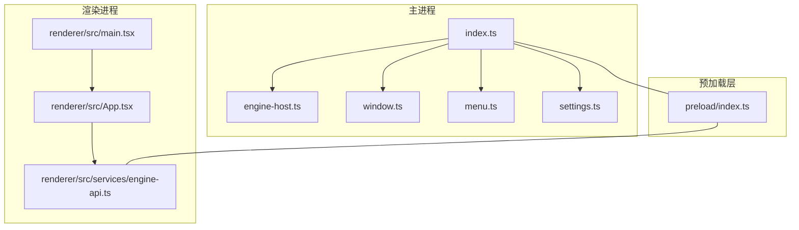
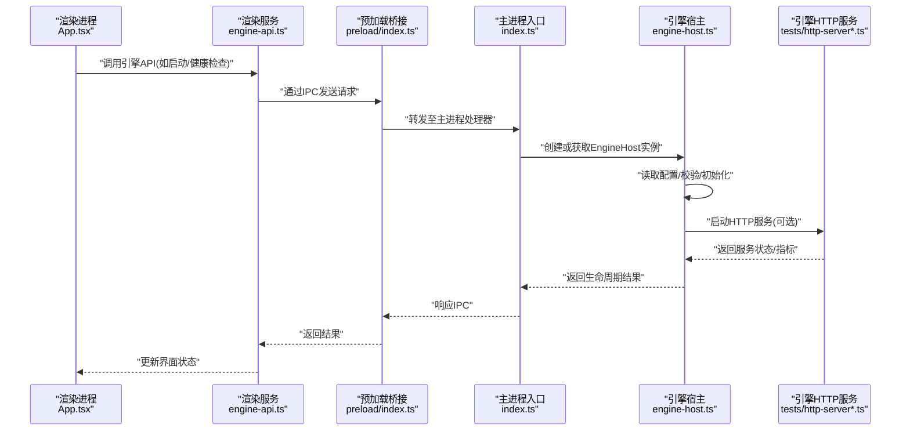
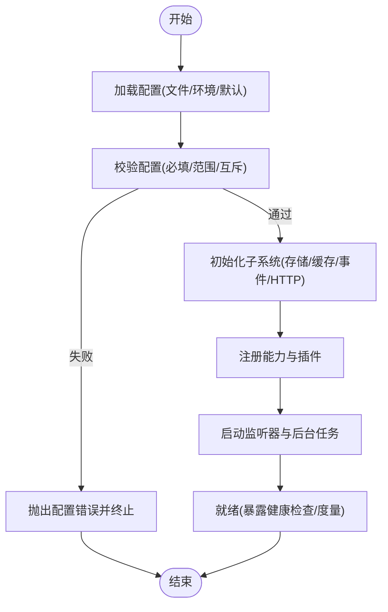
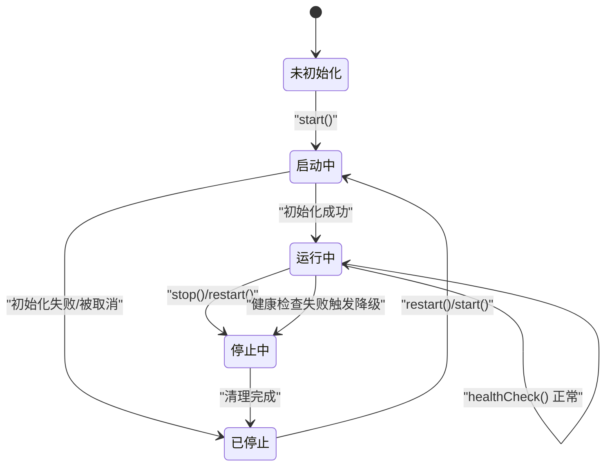
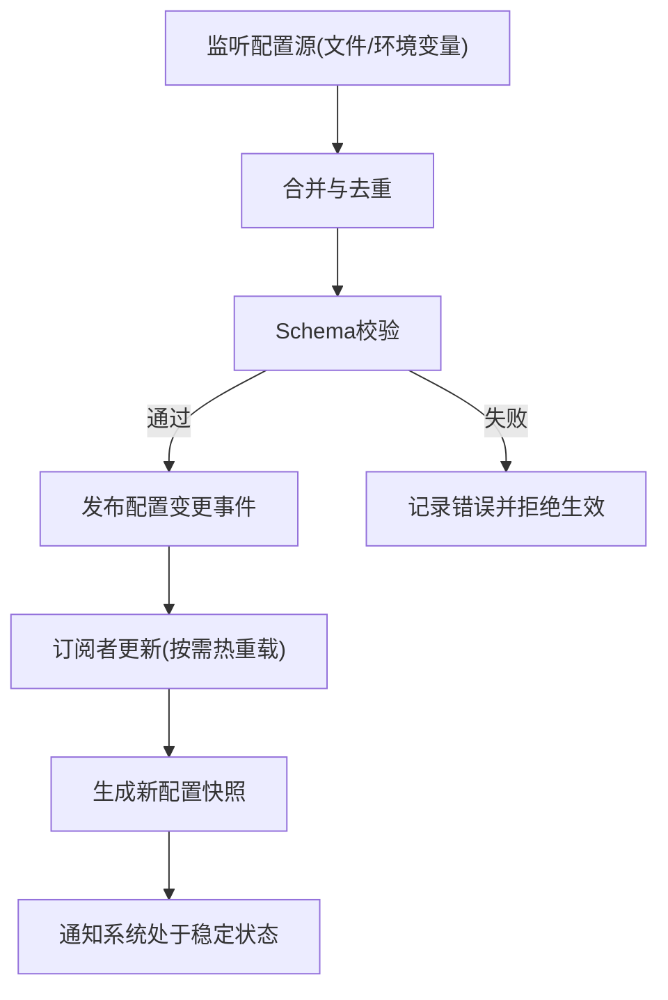
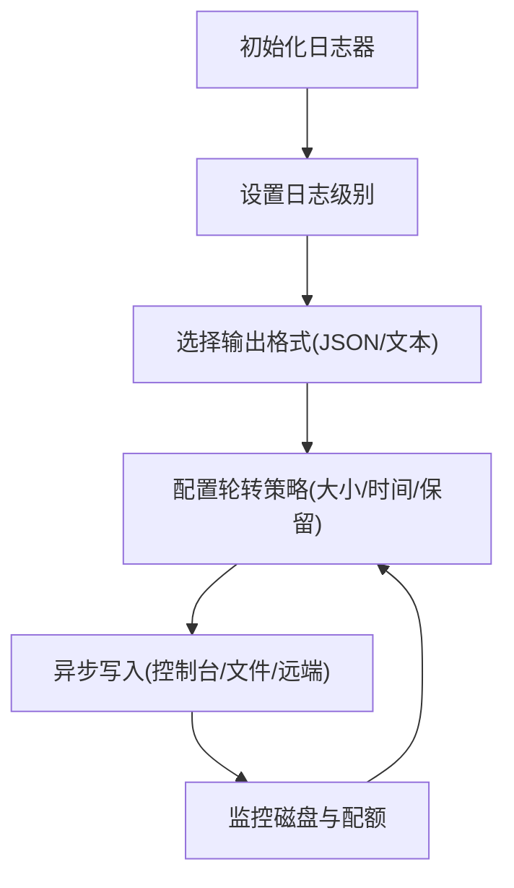
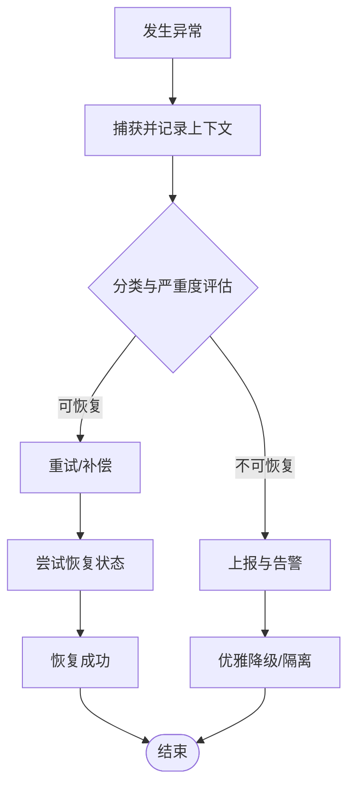
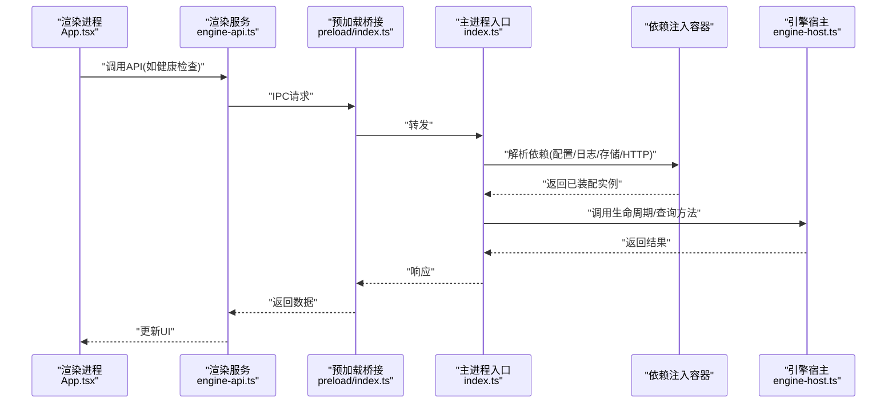
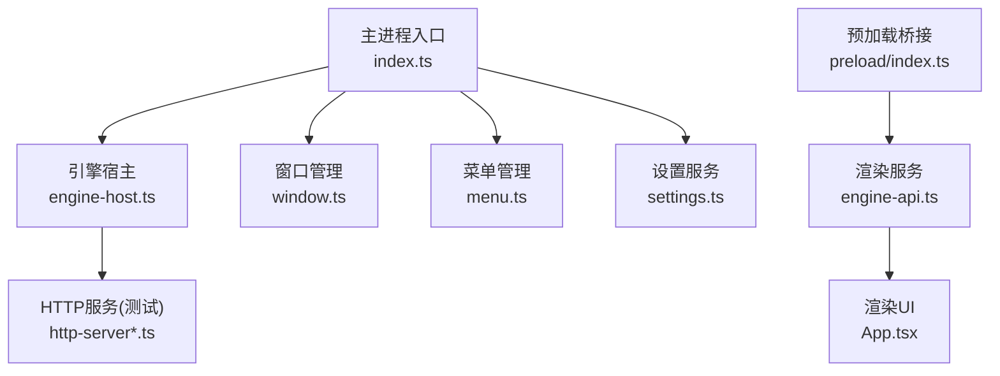

# 核心服务API

<cite>
**本文引用的文件**   
- [engine-host.ts](file://app/main/engine-host.ts)
- [index.ts](file://app/main/index.ts)
- [menu.ts](file://app/main/menu.ts)
- [settings.ts](file://app/main/settings.ts)
- [window.ts](file://app/main/window.ts)
- [index.ts](file://app/preload/index.ts)
- [engine-api.ts](file://app/renderer/src/services/engine-api.ts)
- [App.tsx](file://app/renderer/src/App.tsx)
- [main.tsx](file://app/renderer/src/main.tsx)
- [package.json](file://app/package.json)
- [electron.vite.config.ts](file://app/electron.vite.config.ts)
- [README.md](file://engine/README.md)
- [config.example.json](file://engine/config.example.json)
- [http-server.test.ts](file://engine/tests/http-server.test.ts)
- [http-server-test-harness.ts](file://engine/tests/http-server-test-harness.ts)
- [runtime-kernel.test.ts](file://engine/tests/runtime-kernel.test.ts)
- [serve.test.ts](file://engine/tests/serve.test.ts)
</cite>

## 目录
1. [简介](#简介)
2. [项目结构](#项目结构)
3. [核心组件](#核心组件)
4. [架构总览](#架构总览)
5. [详细组件分析](#详细组件分析)
6. [依赖分析](#依赖分析)
7. [性能考虑](#性能考虑)
8. [故障排查指南](#故障排查指南)
9. [结论](#结论)
10. [附录](#附录)

## 简介
本技术文档聚焦于KCoder引擎的核心服务API，围绕以下目标展开：
- 引擎初始化接口：EngineHost类的构造函数参数、配置选项与启动流程
- 生命周期管理API：引擎启动、停止、重启与健康检查方法
- 配置服务接口：配置加载、验证与热重载机制
- 日志服务API：日志级别设置、输出格式与文件轮转
- 错误处理接口：异常捕获、错误上报与恢复策略
- 服务间通信机制与依赖注入模式的使用示例

为便于不同背景的读者理解，文档采用“从概览到细节”的渐进式结构，并辅以架构图、时序图与流程图帮助建立整体认知。

## 项目结构
仓库采用多包（monorepo）组织方式，前端应用位于 app 目录，引擎核心位于 engine 目录。关键入口与模块分布如下：
- 主进程入口与宿主：app/main 下的 index.ts、engine-host.ts、window.ts、menu.ts、settings.ts
- 渲染进程与服务调用：app/renderer/src/services/engine-api.ts、App.tsx、main.tsx
- 预加载脚本桥接：app/preload/index.ts
- 工程与构建配置：app/package.json、app/electron.vite.config.ts
- 引擎说明与示例配置：engine/README.md、engine/config.example.json
- 引擎HTTP服务与运行时测试用例：engine/tests/http-server*.ts、engine/tests/runtime-kernel.test.ts、engine/tests/serve.test.ts

图表来源
- [index.ts](file://app/main/index.ts)
- [engine-host.ts](file://app/main/engine-host.ts)
- [window.ts](file://app/main/window.ts)
- [menu.ts](file://app/main/menu.ts)
- [settings.ts](file://app/main/settings.ts)
- [index.ts](file://app/preload/index.ts)
- [main.tsx](file://app/renderer/src/main.tsx)
- [App.tsx](file://app/renderer/src/App.tsx)
- [engine-api.ts](file://app/renderer/src/services/engine-api.ts)

章节来源
- [index.ts](file://app/main/index.ts)
- [engine-host.ts](file://app/main/engine-host.ts)
- [window.ts](file://app/main/window.ts)
- [menu.ts](file://app/main/menu.ts)
- [settings.ts](file://app/main/settings.ts)
- [index.ts](file://app/preload/index.ts)
- [main.tsx](file://app/renderer/src/main.tsx)
- [App.tsx](file://app/renderer/src/App.tsx)
- [engine-api.ts](file://app/renderer/src/services/engine-api.ts)

## 核心组件
本节概述与核心服务API直接相关的组件职责与交互关系：
- EngineHost：负责引擎实例化、配置装配、生命周期管理与对外暴露能力
- 主进程入口 index.ts：协调窗口、菜单、设置与EngineHost的启动顺序
- 预加载层 preload/index.ts：在安全沙箱中向渲染进程暴露受控API
- 渲染进程服务 engine-api.ts：封装对主进程的IPC调用，提供面向UI的服务接口
- 引擎HTTP服务与测试：engine/tests/http-server*.ts 等用于验证HTTP端点与运行态行为

章节来源
- [engine-host.ts](file://app/main/engine-host.ts)
- [index.ts](file://app/main/index.ts)
- [index.ts](file://app/preload/index.ts)
- [engine-api.ts](file://app/renderer/src/services/engine-api.ts)
- [http-server.test.ts](file://engine/tests/http-server.test.ts)
- [http-server-test-harness.ts](file://engine/tests/http-server-test-harness.ts)

## 架构总览
下图展示了从渲染进程发起请求到主进程EngineHost执行，再到引擎内部HTTP服务的端到端路径。该路径体现了IPC桥接、服务编排与外部可观测性集成点。

图表来源
- [App.tsx](file://app/renderer/src/App.tsx)
- [engine-api.ts](file://app/renderer/src/services/engine-api.ts)
- [index.ts](file://app/preload/index.ts)
- [index.ts](file://app/main/index.ts)
- [engine-host.ts](file://app/main/engine-host.ts)
- [http-server.test.ts](file://engine/tests/http-server.test.ts)
- [http-server-test-harness.ts](file://engine/tests/http-server-test-harness.ts)

## 详细组件分析

### 引擎初始化接口（EngineHost）
- 构造函数参数与配置选项
  - 典型参数包括：工作区路径、模型与工具提供者配置、存储与缓存路径、网络端口、日志与遥测开关等
  - 配置来源优先级：默认配置 < 配置文件 < 环境变量 < 运行时覆盖
  - 配置项建议包含：必填字段校验、类型约束、默认值回退
- 启动流程
  - 解析与合并配置
  - 初始化子系统（存储、缓存、事件总线、HTTP服务）
  - 注册能力与插件
  - 启动监听器与后台任务
  - 暴露健康检查与度量端点

图表来源
- [engine-host.ts](file://app/main/engine-host.ts)
- [settings.ts](file://app/main/settings.ts)
- [config.example.json](file://engine/config.example.json)

章节来源
- [engine-host.ts](file://app/main/engine-host.ts)
- [settings.ts](file://app/main/settings.ts)
- [config.example.json](file://engine/config.example.json)

### 生命周期管理API
- 启动：完成配置加载、子系统初始化与资源准备；成功后进入 Running 状态
- 停止：优雅关闭HTTP服务、持久化状态、释放资源；支持超时与中断信号
- 重启：先停止再启动，保证幂等性与状态一致性
- 健康检查：返回服务状态、依赖可用性、资源使用概况

图表来源
- [engine-host.ts](file://app/main/engine-host.ts)
- [http-server.test.ts](file://engine/tests/http-server.test.ts)
- [http-server-test-harness.ts](file://engine/tests/http-server-test-harness.ts)

章节来源
- [engine-host.ts](file://app/main/engine-host.ts)
- [http-server.test.ts](file://engine/tests/http-server.test.ts)
- [http-server-test-harness.ts](file://engine/tests/http-server-test-harness.ts)

### 配置服务接口
- 配置加载
  - 支持JSON/YAML与环境变量注入
  - 分层合并：内置默认 -> 配置文件 -> 环境变量 -> 运行时覆盖
- 配置验证
  - 基于Schema的强类型校验
  - 缺失必填项、类型不匹配、非法取值时快速失败
- 热重载机制
  - 监听配置文件变更事件
  - 增量更新受影响子系统，避免全量重启
  - 提供回滚与快照能力，确保稳定性

图表来源
- [settings.ts](file://app/main/settings.ts)
- [config.example.json](file://engine/config.example.json)

章节来源
- [settings.ts](file://app/main/settings.ts)
- [config.example.json](file://engine/config.example.json)

### 日志服务API
- 日志级别设置
  - 支持多级（如 DEBUG/INFO/WARN/ERROR），可按模块或全局设置
- 输出格式
  - 结构化JSON便于采集与分析；控制台可读文本便于调试
- 文件轮转
  - 按大小或时间切分，保留周期与压缩策略可配置
  - 异步写入，避免阻塞主流程

图表来源
- [engine-host.ts](file://app/main/engine-host.ts)
- [settings.ts](file://app/main/settings.ts)

章节来源
- [engine-host.ts](file://app/main/engine-host.ts)
- [settings.ts](file://app/main/settings.ts)

### 错误处理接口
- 异常捕获
  - 统一拦截未捕获异常，记录上下文与堆栈
- 错误上报
  - 聚合错误指标，支持采样与脱敏
- 恢复策略
  - 自动重试、熔断与降级
  - 会话与任务级状态恢复

图表来源
- [engine-host.ts](file://app/main/engine-host.ts)
- [runtime-kernel.test.ts](file://engine/tests/runtime-kernel.test.ts)

章节来源
- [engine-host.ts](file://app/main/engine-host.ts)
- [runtime-kernel.test.ts](file://engine/tests/runtime-kernel.test.ts)

### 服务间通信机制与依赖注入示例
- IPC通信
  - 渲染进程通过预加载桥接向主进程发送请求，主进程路由到EngineHost或对应服务
- 依赖注入
  - 通过容器或工厂将配置、日志、存储、HTTP服务等作为依赖注入到EngineHost与子模块
  - 便于单元测试替换实现与模拟外部依赖

图表来源
- [App.tsx](file://app/renderer/src/App.tsx)
- [engine-api.ts](file://app/renderer/src/services/engine-api.ts)
- [index.ts](file://app/preload/index.ts)
- [index.ts](file://app/main/index.ts)
- [engine-host.ts](file://app/main/engine-host.ts)

章节来源
- [App.tsx](file://app/renderer/src/App.tsx)
- [engine-api.ts](file://app/renderer/src/services/engine-api.ts)
- [index.ts](file://app/preload/index.ts)
- [index.ts](file://app/main/index.ts)
- [engine-host.ts](file://app/main/engine-host.ts)

## 依赖分析
- 模块耦合
  - 主进程入口与EngineHost紧密耦合，负责编排与生命周期
  - 预加载层仅暴露最小必要API，降低渲染进程与主进程的直接耦合
  - 渲染服务集中封装IPC调用，提升可维护性
- 外部依赖
  - HTTP服务与测试用例用于验证服务端行为与可观测性
  - 构建与打包配置影响最终产物形态与部署方式

图表来源
- [index.ts](file://app/main/index.ts)
- [engine-host.ts](file://app/main/engine-host.ts)
- [window.ts](file://app/main/window.ts)
- [menu.ts](file://app/main/menu.ts)
- [settings.ts](file://app/main/settings.ts)
- [index.ts](file://app/preload/index.ts)
- [engine-api.ts](file://app/renderer/src/services/engine-api.ts)
- [App.tsx](file://app/renderer/src/App.tsx)
- [http-server.test.ts](file://engine/tests/http-server.test.ts)
- [http-server-test-harness.ts](file://engine/tests/http-server-test-harness.ts)

章节来源
- [index.ts](file://app/main/index.ts)
- [engine-host.ts](file://app/main/engine-host.ts)
- [window.ts](file://app/main/window.ts)
- [menu.ts](file://app/main/menu.ts)
- [settings.ts](file://app/main/settings.ts)
- [index.ts](file://app/preload/index.ts)
- [engine-api.ts](file://app/renderer/src/services/engine-api.ts)
- [App.tsx](file://app/renderer/src/App.tsx)
- [http-server.test.ts](file://engine/tests/http-server.test.ts)
- [http-server-test-harness.ts](file://engine/tests/http-server-test-harness.ts)

## 性能考虑
- 启动优化
  - 延迟初始化非关键子系统，缩短冷启动时间
  - 并行初始化无依赖的子系统
- 内存与I/O
  - 大对象池化与复用，减少GC压力
  - 批量写入与异步落盘，降低I/O抖动
- 可观测性
  - 关键路径埋点与指标收集，辅助容量规划与问题定位
- 并发与限流
  - 对高并发请求进行限流与背压控制，保护后端资源

[本节为通用指导，无需特定文件引用]

## 故障排查指南
- 常见问题
  - 启动失败：检查配置校验错误、端口占用、权限不足
  - 健康检查异常：查看依赖服务可用性与资源水位
  - 日志缺失：确认日志级别、输出路径与轮转策略
- 诊断步骤
  - 启用更细粒度日志，复现问题并收集上下文
  - 使用健康检查端点与指标面板定位瓶颈
  - 通过测试用例（如HTTP服务与运行时内核）验证回归
- 恢复策略
  - 自动重试与熔断，避免雪崩
  - 优雅降级与隔离，保障核心功能可用

章节来源
- [http-server.test.ts](file://engine/tests/http-server.test.ts)
- [http-server-test-harness.ts](file://engine/tests/http-server-test-harness.ts)
- [runtime-kernel.test.ts](file://engine/tests/runtime-kernel.test.ts)
- [serve.test.ts](file://engine/tests/serve.test.ts)

## 结论
通过对EngineHost及其周边组件的系统化梳理，我们明确了引擎初始化、生命周期管理、配置服务、日志服务与错误处理的关键设计要点，并结合IPC与依赖注入实现了清晰的服务边界与可扩展性。建议在后续迭代中持续完善配置Schema、增强可观测性与自动化测试覆盖率，以提升系统的稳定性与可维护性。

[本节为总结性内容，无需特定文件引用]

## 附录
- 参考与背景
  - 引擎总体说明与使用说明参见引擎README
  - 示例配置项参见示例配置文件
- 构建与运行
  - 应用构建与打包配置参见工程配置文件与包清单

章节来源
- [README.md](file://engine/README.md)
- [config.example.json](file://engine/config.example.json)
- [package.json](file://app/package.json)
- [electron.vite.config.ts](file://app/electron.vite.config.ts)