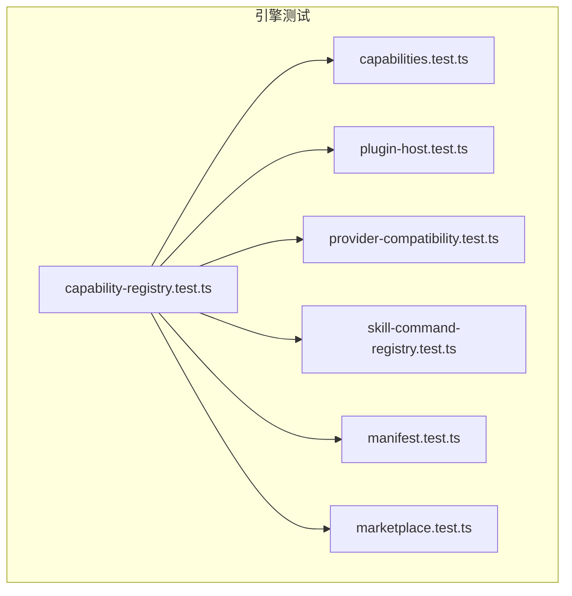
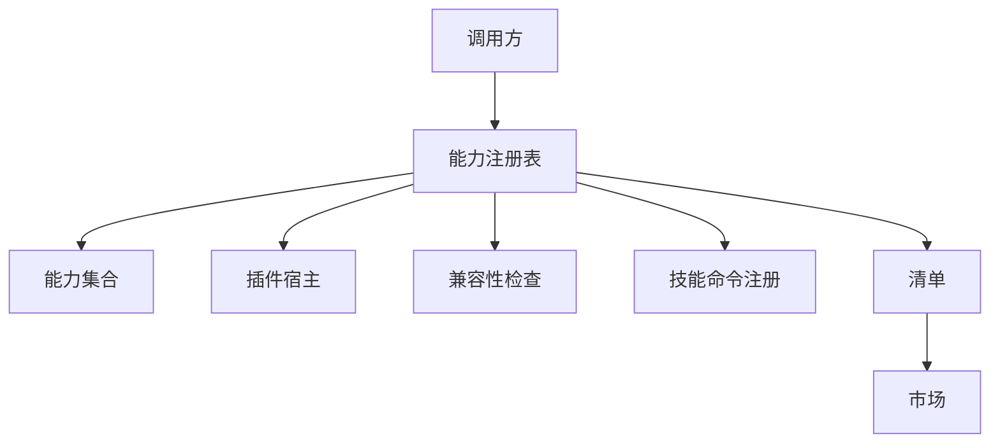
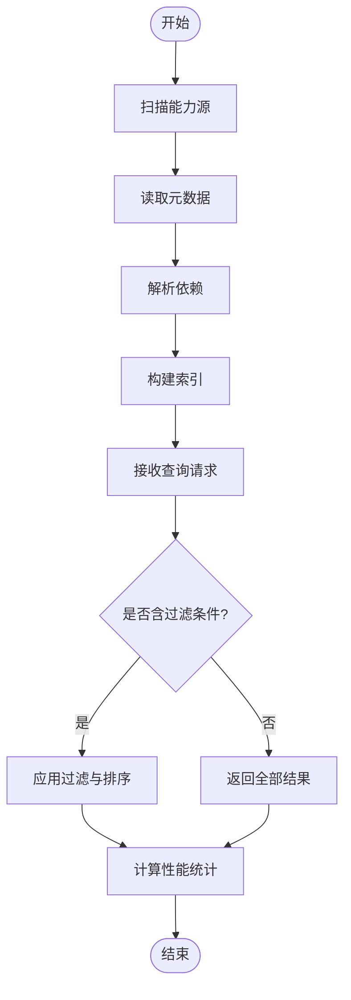
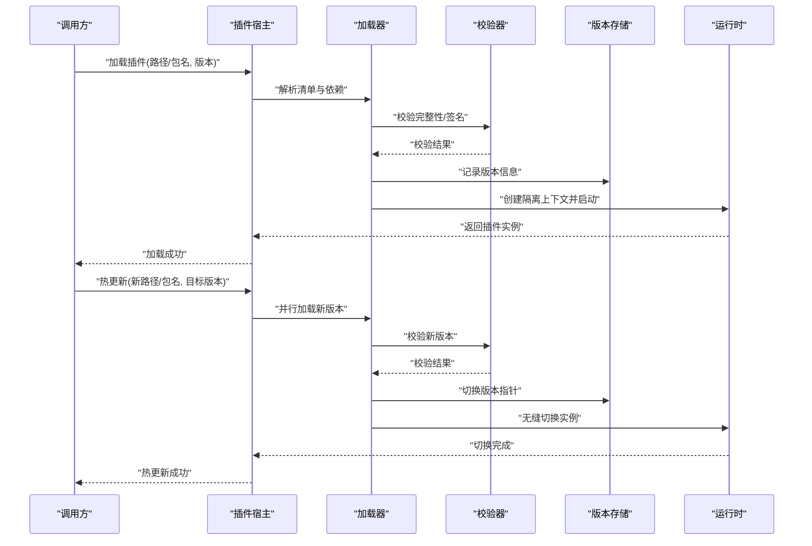
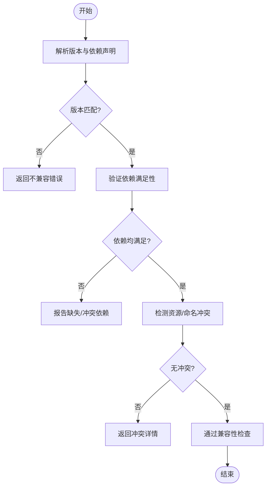
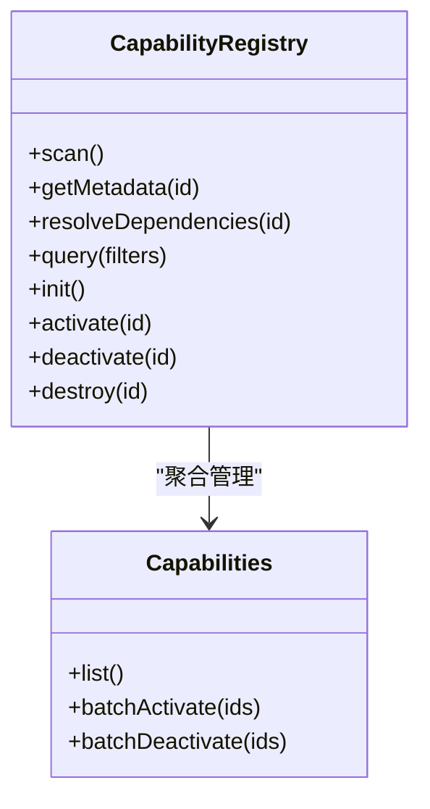
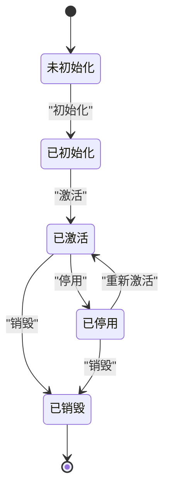
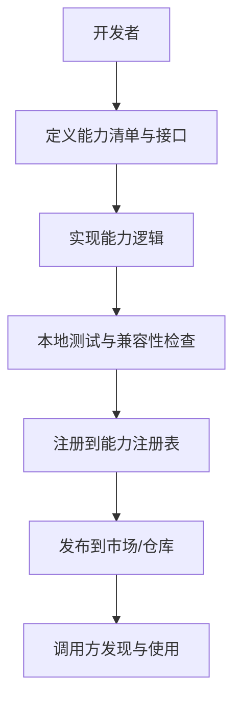
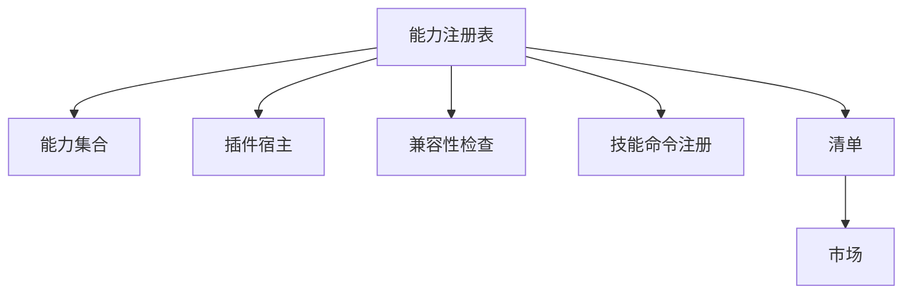

# 能力注册中心API

<cite>
**本文引用的文件**   
- [capability-registry.test.ts](file://engine/tests/capability-registry.test.ts)
- [capabilities.test.ts](file://engine/tests/capabilities.test.ts)
- [plugin-host.test.ts](file://engine/tests/plugin-host.test.ts)
- [provider-compatibility.test.ts](file://engine/tests/provider-compatibility.test.ts)
- [skill-command-registry.test.ts](file://engine/tests/skill-command-registry.test.ts)
- [manifest.test.ts](file://engine/tests/manifest.test.ts)
- [marketplace.test.ts](file://engine/tests/marketplace.test.ts)
</cite>

## 目录
1. [简介](#简介)
2. [项目结构](#项目结构)
3. [核心组件](#核心组件)
4. [架构总览](#架构总览)
5. [详细组件分析](#详细组件分析)
6. [依赖分析](#依赖分析)
7. [性能考虑](#性能考虑)
8. [故障排查指南](#故障排查指南)
9. [结论](#结论)
10. [附录](#附录)

## 简介
本技术文档围绕KCoder引擎的“能力注册中心”相关API进行系统化说明，覆盖以下关键主题：
- 能力发现接口：能力扫描、元数据获取、依赖解析
- 动态加载API：插件加载、卸载、版本管理、热更新机制
- 能力生命周期接口：初始化、激活、停用、销毁
- 兼容性检查API：版本匹配、依赖验证、冲突检测
- 能力查询接口：按类型过滤、条件搜索、性能统计
- 扩展点定义与自定义能力开发指南

为便于读者快速定位实现细节，文档在涉及具体代码逻辑时提供“章节来源”，并在可视化图中标注“图示来源”。

## 项目结构
从仓库结构看，能力注册中心相关的测试用例集中于 engine/tests 目录。这些测试覆盖了能力注册、能力集合、插件宿主、兼容性检查、技能命令注册、清单与市场等关键路径，是理解能力注册中心API行为与边界的重要入口。

**图示来源**
- [capability-registry.test.ts](file://engine/tests/capability-registry.test.ts)
- [capabilities.test.ts](file://engine/tests/capabilities.test.ts)
- [plugin-host.test.ts](file://engine/tests/plugin-host.test.ts)
- [provider-compatibility.test.ts](file://engine/tests/provider-compatibility.test.ts)
- [skill-command-registry.test.ts](file://engine/tests/skill-command-registry.test.ts)
- [manifest.test.ts](file://engine/tests/manifest.test.ts)
- [marketplace.test.ts](file://engine/tests/marketplace.test.ts)

**章节来源**
- [capability-registry.test.ts](file://engine/tests/capability-registry.test.ts)
- [capabilities.test.ts](file://engine/tests/capabilities.test.ts)
- [plugin-host.test.ts](file://engine/tests/plugin-host.test.ts)
- [provider-compatibility.test.ts](file://engine/tests/provider-compatibility.test.ts)
- [skill-command-registry.test.ts](file://engine/tests/skill-command-registry.test.ts)
- [manifest.test.ts](file://engine/tests/manifest.test.ts)
- [marketplace.test.ts](file://engine/tests/marketplace.test.ts)

## 核心组件
基于测试用例的组织与命名，可将能力注册中心的核心组件抽象为如下模块：
- 能力注册表（Capability Registry）：负责能力的注册、发现、查询、生命周期管理与元数据维护
- 能力集合（Capabilities）：对一组能力进行聚合管理，支持批量操作与组合查询
- 插件宿主（Plugin Host）：承载插件的动态加载、卸载、版本控制与热更新
- 兼容性检查（Provider Compatibility）：校验能力/提供者之间的版本兼容、依赖满足与冲突检测
- 技能命令注册（Skill Command Registry）：将技能（Skill）暴露为可执行命令的能力桥接层
- 清单与市场（Manifest & Marketplace）：描述能力清单、来源与分发信息，支撑能力发现与安装

上述组件通过清晰的职责划分，共同构成能力注册中心的完整闭环。

**章节来源**
- [capability-registry.test.ts](file://engine/tests/capability-registry.test.ts)
- [capabilities.test.ts](file://engine/tests/capabilities.test.ts)
- [plugin-host.test.ts](file://engine/tests/plugin-host.test.ts)
- [provider-compatibility.test.ts](file://engine/tests/provider-compatibility.test.ts)
- [skill-command-registry.test.ts](file://engine/tests/skill-command-registry.test.ts)
- [manifest.test.ts](file://engine/tests/manifest.test.ts)
- [marketplace.test.ts](file://engine/tests/marketplace.test.ts)

## 架构总览
下图展示了能力注册中心的高层交互关系：外部调用方通过注册表访问能力；插件宿主管控插件生命周期；兼容性检查贯穿加载与运行期；清单与市场提供能力元数据与来源信息。

[此图为概念性架构图，不直接映射到具体源文件，故不提供图示来源]

## 详细组件分析

### 能力注册表（Capability Registry）
- 能力发现接口
  - 能力扫描：遍历已注册或可发现的能力源，收集能力条目并构建索引
  - 元数据获取：返回能力的标识、版本、描述、输入输出契约、资源需求等
  - 依赖解析：根据能力声明的依赖项，解析可用版本与约束，生成依赖图
- 能力查询接口
  - 按类型过滤：支持按能力类别（如工具、技能、服务）筛选
  - 条件搜索：支持按名称、标签、版本范围、状态等多维条件检索
  - 性能统计：返回查询耗时、命中数量、缓存命中率等指标
- 能力生命周期接口
  - 初始化：完成能力上下文准备、资源预取、依赖预解析
  - 激活：将能力置为可用状态，注册路由/处理器/事件监听
  - 停用：暂停能力对外暴露，释放部分资源但不销毁实例
  - 销毁：彻底释放资源，清理内部状态与外部引用

**章节来源**
- [capability-registry.test.ts](file://engine/tests/capability-registry.test.ts)
- [capabilities.test.ts](file://engine/tests/capabilities.test.ts)

### 动态加载API（插件宿主）
- 插件加载
  - 加载流程：解析插件清单、校验签名/完整性、创建隔离上下文、注入依赖
  - 版本管理：记录插件版本、支持多版本并存、选择策略（默认/指定）
- 卸载与热更新
  - 卸载：安全停止插件任务、释放句柄、清理注册项
  - 热更新：在不重启宿主的前提下替换插件二进制/配置，保持会话连续性
- 错误恢复
  - 崩溃隔离：捕获插件异常，避免影响宿主稳定性
  - 回滚策略：更新失败自动回滚至上一稳定版本

**图示来源**
- [plugin-host.test.ts](file://engine/tests/plugin-host.test.ts)

**章节来源**
- [plugin-host.test.ts](file://engine/tests/plugin-host.test.ts)

### 兼容性检查API
- 版本匹配
  - 语义化版本比较：支持主/次/补丁级别匹配与范围约束
  - 向后兼容策略：允许小版本升级，阻止破坏性变更
- 依赖验证
  - 静态依赖检查：在加载前验证所有依赖是否满足
  - 动态依赖检查：在运行期按需校验可用性与健康度
- 冲突检测
  - 命名空间冲突：同一能力ID的多版本共存策略
  - 资源冲突：端口、文件句柄、全局状态等资源的独占性检查

**图示来源**
- [provider-compatibility.test.ts](file://engine/tests/provider-compatibility.test.ts)

**章节来源**
- [provider-compatibility.test.ts](file://engine/tests/provider-compatibility.test.ts)

### 能力查询接口（按类型过滤、条件搜索、性能统计）
- 按类型过滤：支持以能力类别为维度进行筛选
- 条件搜索：支持多字段组合查询与分页
- 性能统计：返回查询耗时、结果集大小、缓存命中情况

**图示来源**
- [capability-registry.test.ts](file://engine/tests/capability-registry.test.ts)
- [capabilities.test.ts](file://engine/tests/capabilities.test.ts)

**章节来源**
- [capability-registry.test.ts](file://engine/tests/capability-registry.test.ts)
- [capabilities.test.ts](file://engine/tests/capabilities.test.ts)

### 能力声明周期接口（初始化、激活、停用、销毁）
- 初始化：准备上下文、建立连接、预热缓存
- 激活：注册路由/处理器、开启事件订阅
- 停用：暂停对外服务、保留状态以便快速恢复
- 销毁：释放资源、清理状态、断开外部连接

**章节来源**
- [capability-registry.test.ts](file://engine/tests/capability-registry.test.ts)

### 能力扩展点定义与自定义能力开发指南
- 扩展点定义
  - 能力元数据规范：标识、版本、描述、输入输出契约、资源需求、权限要求
  - 插件接口契约：生命周期钩子、错误处理约定、日志与观测上报
  - 命令桥接：技能到命令的映射规则与参数绑定
- 自定义能力开发步骤
  - 编写能力清单：声明能力基本信息与依赖
  - 实现能力逻辑：遵循接口契约，处理输入输出与错误
  - 注册与发布：通过注册表注册能力，提交至市场或私有仓库
  - 测试与验收：使用兼容性检查与集成测试确保稳定

**章节来源**
- [skill-command-registry.test.ts](file://engine/tests/skill-command-registry.test.ts)
- [manifest.test.ts](file://engine/tests/manifest.test.ts)
- [marketplace.test.ts](file://engine/tests/marketplace.test.ts)

## 依赖分析
能力注册中心各组件之间存在明确的依赖关系：注册表作为中枢协调能力集合、插件宿主、兼容性检查、技能命令注册、清单与市场。

**图示来源**
- [capability-registry.test.ts](file://engine/tests/capability-registry.test.ts)
- [capabilities.test.ts](file://engine/tests/capabilities.test.ts)
- [plugin-host.test.ts](file://engine/tests/plugin-host.test.ts)
- [provider-compatibility.test.ts](file://engine/tests/provider-compatibility.test.ts)
- [skill-command-registry.test.ts](file://engine/tests/skill-command-registry.test.ts)
- [manifest.test.ts](file://engine/tests/manifest.test.ts)
- [marketplace.test.ts](file://engine/tests/marketplace.test.ts)

**章节来源**
- [capability-registry.test.ts](file://engine/tests/capability-registry.test.ts)
- [capabilities.test.ts](file://engine/tests/capabilities.test.ts)
- [plugin-host.test.ts](file://engine/tests/plugin-host.test.ts)
- [provider-compatibility.test.ts](file://engine/tests/provider-compatibility.test.ts)
- [skill-command-registry.test.ts](file://engine/tests/skill-command-registry.test.ts)
- [manifest.test.ts](file://engine/tests/manifest.test.ts)
- [marketplace.test.ts](file://engine/tests/marketplace.test.ts)

## 性能考虑
- 查询优化
  - 索引与缓存：对常用查询字段建立索引，结合内存缓存提升命中率
  - 分页与限流：对大规模结果集采用分页与速率限制，避免过载
- 加载与热更新
  - 并行加载：在安全前提下并行解析与校验，缩短冷启动时间
  - 增量更新：仅替换变更部分，减少停机窗口
- 监控与观测
  - 指标上报：记录加载时长、错误率、资源占用等关键指标
  - 告警策略：对异常波动设置阈值告警，及时介入

[本节为通用性能建议，不直接分析具体文件，故不提供章节来源]

## 故障排查指南
- 常见问题定位
  - 加载失败：检查清单格式、签名校验、依赖版本是否满足
  - 热更新失败：确认新版本兼容性、资源冲突与回滚策略
  - 查询超时：评估索引有效性、缓存命中率与并发压力
- 诊断手段
  - 启用详细日志：记录关键路径的输入输出与异常堆栈
  - 兼容性报告：输出详细的依赖树与冲突位置
  - 性能剖析：采集热点函数与I/O瓶颈

**章节来源**
- [plugin-host.test.ts](file://engine/tests/plugin-host.test.ts)
- [provider-compatibility.test.ts](file://engine/tests/provider-compatibility.test.ts)
- [capability-registry.test.ts](file://engine/tests/capability-registry.test.ts)

## 结论
能力注册中心通过清晰的组件划分与严格的兼容性检查，实现了能力的可发现、可加载、可治理与可扩展。借助完善的生命周期管理与热更新机制，系统能够在保证稳定性的同时提供灵活的演进能力。建议在开发与集成过程中严格遵循清单规范与接口契约，并结合监控与告警体系保障生产环境的可靠性。

[本节为总结性内容，不直接分析具体文件，故不提供章节来源]

## 附录
- 术语表
  - 能力：具备明确输入输出契约的可复用功能单元
  - 插件：以独立进程或沙箱形式运行的能力载体
  - 清单：描述能力元数据与依赖的结构化文件
  - 市场：能力分发与发现的渠道
- 参考测试用例
  - 能力注册与查询：[capability-registry.test.ts](file://engine/tests/capability-registry.test.ts)
  - 能力集合管理：[capabilities.test.ts](file://engine/tests/capabilities.test.ts)
  - 插件宿主与热更新：[plugin-host.test.ts](file://engine/tests/plugin-host.test.ts)
  - 兼容性检查：[provider-compatibility.test.ts](file://engine/tests/provider-compatibility.test.ts)
  - 技能命令桥接：[skill-command-registry.test.ts](file://engine/tests/skill-command-registry.test.ts)
  - 清单与市场：[manifest.test.ts](file://engine/tests/manifest.test.ts)、[marketplace.test.ts](file://engine/tests/marketplace.test.ts)