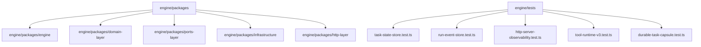
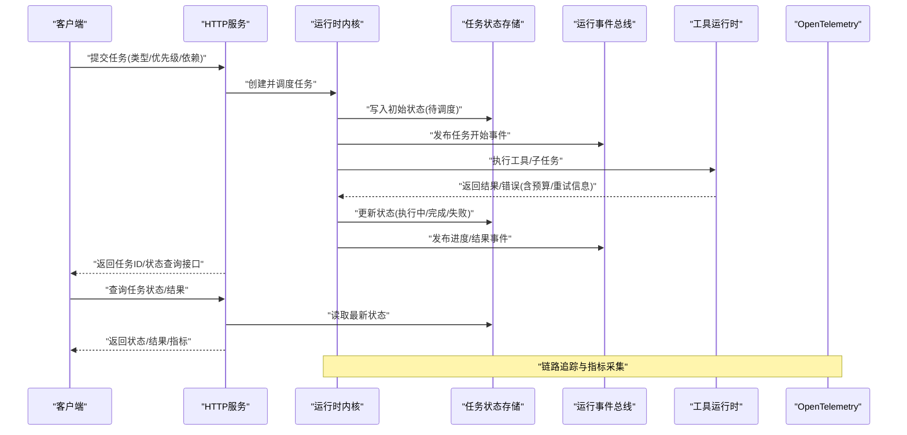
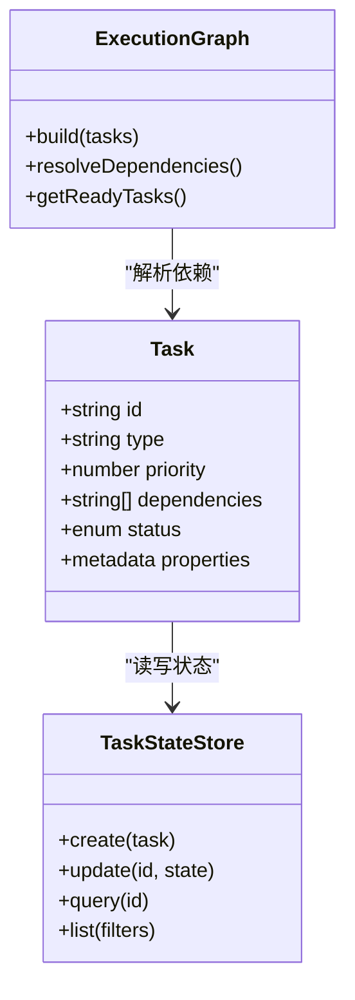
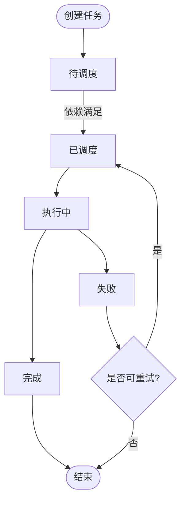
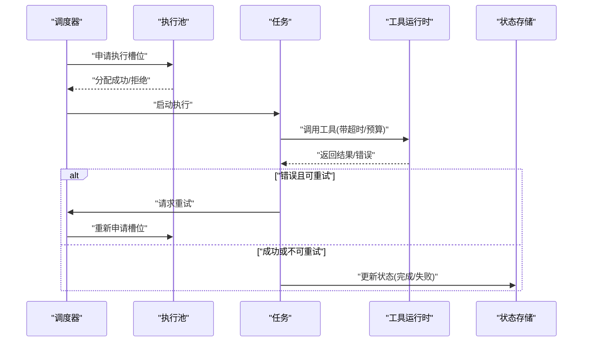
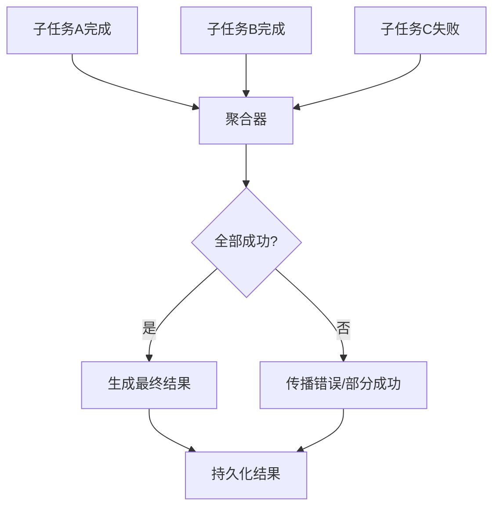
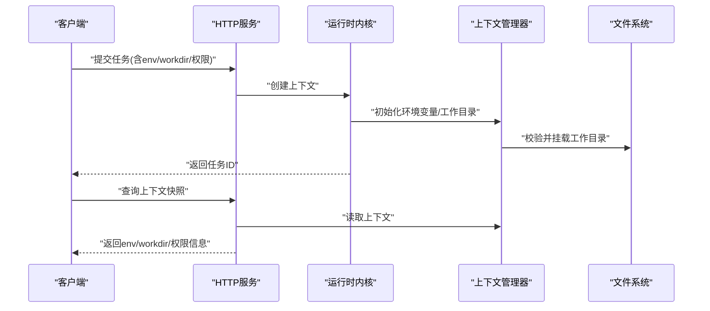
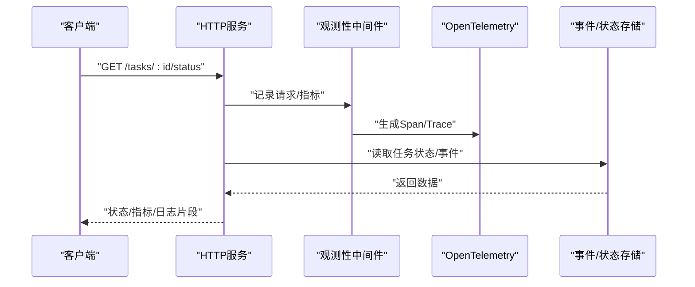
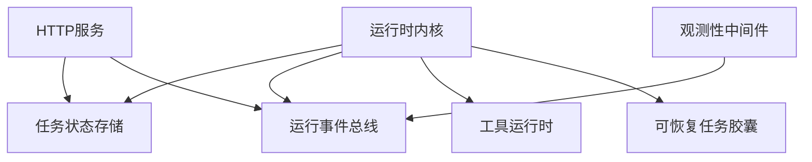

# 任务管理API

<cite>
**本文引用的文件**   
- [engine/README.md](file://engine/README.md)
- [engine/package.json](file://engine/package.json)
- [engine/pnpm-workspace.yaml](file://engine/pnpm-workspace.yaml)
- [engine/tsconfig.json](file://engine/tsconfig.json)
- [engine/tests/task-state-store.test.ts](file://engine/tests/task-state-store.test.ts)
- [engine/tests/task-progress-projector.test.ts](file://engine/tests/task-progress-projector.test.ts)
- [engine/tests/runtime-kernel-e2e.test.ts](file://engine/tests/runtime-kernel-e2e.test.ts)
- [engine/tests/tool-runtime-v3.test.ts](file://engine/tests/tool-runtime-v3.test.ts)
- [engine/tests/durable-task-capsule.test.ts](file://engine/tests/durable-task-capsule.test.ts)
- [engine/tests/task-context-recovery.test.ts](file://engine/tests/task-context-recovery.test.ts)
- [engine/tests/execution-graph.test.ts](file://engine/tests/execution-graph.test.ts)
- [engine/tests/run-event-store.test.ts](file://engine/tests/run-event-store.test.ts)
- [engine/tests/tool-call-repair.test.ts](file://engine/tests/tool-call-repair.test.ts)
- [engine/tests/tool-result-budget.test.ts](file://engine/tests/tool-result-budget.test.ts)
- [engine/tests/tool-coordinator-runtime.test.ts](file://engine/tests/tool-coordinator-runtime.test.ts)
- [engine/tests/turn-event-bus.test.ts](file://engine/tests/turn-event-bus.test.ts)
- [engine/tests/loop-runner.test.ts](file://engine/tests/loop-runner.test.ts)
- [engine/tests/compaction-governor.test.ts](file://engine/tests/compaction-governor.test.ts)
- [engine/tests/memory-store.test.ts](file://engine/tests/memory-store.test.ts)
- [engine/tests/hybrid-store.test.ts](file://engine/tests/hybrid-store.test.ts)
- [engine/tests/file-session-store.test.ts](file://engine/tests/file-session-store.test.ts)
- [engine/tests/file-session-store-integration.test.ts](file://engine/tests/file-session-store-integration.test.ts)
- [engine/tests/http-server.test.ts](file://engine/tests/http-server.test.ts)
- [engine/tests/http-server-observability.test.ts](file://engine/tests/http-server-observability.test.ts)
- [engine/tests/opentelemetry.test.ts](file://engine/tests/opentelemetry.test.ts)
</cite>

## 目录
1. [简介](#简介)
2. [项目结构](#项目结构)
3. [核心组件](#核心组件)
4. [架构总览](#架构总览)
5. [详细组件分析](#详细组件分析)
6. [依赖关系分析](#依赖关系分析)
7. [性能考量](#性能考量)
8. [故障排查指南](#故障排查指南)
9. [结论](#结论)
10. [附录](#附录)

## 简介
本技术文档面向KCoder引擎的任务管理API，聚焦以下目标：
- 明确Task定义接口：任务类型、优先级、依赖关系、生命周期状态。
- 解释任务状态转换机制：创建、调度、执行、完成、失败等流转规则。
- 记录任务执行与调度接口：并发控制、资源分配、超时处理、重试策略。
- 说明任务结果聚合接口：子任务结果收集、错误传播、性能统计。
- 提供任务上下文管理API：环境变量、工作目录、权限控制。
- 包含任务监控与日志记录接口。

为保证准确性，本文所有实现细节均以仓库中测试用例与配置为依据进行归纳与映射。

## 项目结构
KCoder引擎采用多包（monorepo）组织方式，核心能力分布在packages下，并通过workspace统一构建与测试。与任务管理相关的代码主要位于engine/packages目录内，测试覆盖在engine/tests目录中，用于验证任务状态、事件总线、持久化、HTTP观测性等关键特性。

图表来源
- [engine/README.md:1-200](file://engine/README.md#L1-L200)
- [engine/package.json:1-200](file://engine/package.json#L1-L200)
- [engine/pnpm-workspace.yaml:1-200](file://engine/pnpm-workspace.yaml#L1-L200)

章节来源
- [engine/README.md:1-200](file://engine/README.md#L1-L200)
- [engine/package.json:1-200](file://engine/package.json#L1-L200)
- [engine/pnpm-workspace.yaml:1-200](file://engine/pnpm-workspace.yaml#L1-L200)

## 核心组件
基于测试用例的覆盖范围，可将任务管理API的核心组件抽象为如下模块：
- 任务状态存储：负责任务的持久化与查询，支撑任务生命周期状态机。
- 运行事件总线：承载任务执行过程中的事件流，支持进度与结果上报。
- 工具运行时：封装工具调用、重试、预算与修复策略。
- 可恢复任务胶囊：保障任务在异常或重启后的可恢复性。
- HTTP服务与观测性：对外暴露任务管理与监控接口，集成OpenTelemetry。

章节来源
- [engine/tests/task-state-store.test.ts:1-200](file://engine/tests/task-state-store.test.ts#L1-L200)
- [engine/tests/run-event-store.test.ts:1-200](file://engine/tests/run-event-store.test.ts#L1-L200)
- [engine/tests/tool-runtime-v3.test.ts:1-200](file://engine/tests/tool-runtime-v3.test.ts#L1-L200)
- [engine/tests/durable-task-capsule.test.ts:1-200](file://engine/tests/durable-task-capsule.test.ts#L1-L200)
- [engine/tests/http-server-observability.test.ts:1-200](file://engine/tests/http-server-observability.test.ts#L1-L200)

## 架构总览
下图展示了任务从创建到完成的关键路径，以及状态存储、事件总线、工具运行时与HTTP观测性的交互。

图表来源
- [engine/tests/runtime-kernel-e2e.test.ts:1-200](file://engine/tests/runtime-kernel-e2e.test.ts#L1-L200)
- [engine/tests/task-state-store.test.ts:1-200](file://engine/tests/task-state-store.test.ts#L1-L200)
- [engine/tests/run-event-store.test.ts:1-200](file://engine/tests/run-event-store.test.ts#L1-L200)
- [engine/tests/tool-runtime-v3.test.ts:1-200](file://engine/tests/tool-runtime-v3.test.ts#L1-L200)
- [engine/tests/http-server-observability.test.ts:1-200](file://engine/tests/http-server-observability.test.ts#L1-L200)

## 详细组件分析

### Task定义接口
- 任务类型：通过测试用例可见存在多种任务形态（如工具调用、循环执行、计划执行等），由运行时内核根据任务描述分发至对应处理器。
- 优先级：调度器依据优先级决定执行顺序；高优先级任务优先获得执行槽位。
- 依赖关系：任务可声明对其它任务的依赖，依赖满足后方可进入可调度状态。
- 生命周期状态：包括“待调度”、“已调度”、“执行中”、“完成”、“失败”等，状态变更由状态存储与事件总线共同驱动。

章节来源
- [engine/tests/execution-graph.test.ts:1-200](file://engine/tests/execution-graph.test.ts#L1-L200)
- [engine/tests/task-state-store.test.ts:1-200](file://engine/tests/task-state-store.test.ts#L1-L200)
- [engine/tests/loop-runner.test.ts:1-200](file://engine/tests/loop-runner.test.ts#L1-L200)

#### 类图（概念映射）

图表来源
- [engine/tests/execution-graph.test.ts:1-200](file://engine/tests/execution-graph.test.ts#L1-L200)
- [engine/tests/task-state-store.test.ts:1-200](file://engine/tests/task-state-store.test.ts#L1-L200)

### 任务状态转换机制
- 创建：客户端提交任务后，内核写入初始状态“待调度”，并发布“任务创建”事件。
- 调度：依赖检查通过后，任务进入“已调度”；调度器按优先级选择执行。
- 执行：任务进入“执行中”，工具运行时接管执行；期间持续上报进度事件。
- 完成：成功完成后，状态更新为“完成”，聚合结果并持久化。
- 失败：出现不可恢复错误或达到重试上限时，状态更新为“失败”，并记录错误详情。

图表来源
- [engine/tests/task-state-store.test.ts:1-200](file://engine/tests/task-state-store.test.ts#L1-L200)
- [engine/tests/run-event-store.test.ts:1-200](file://engine/tests/run-event-store.test.ts#L1-L200)

章节来源
- [engine/tests/task-state-store.test.ts:1-200](file://engine/tests/task-state-store.test.ts#L1-L200)
- [engine/tests/run-event-store.test.ts:1-200](file://engine/tests/run-event-store.test.ts#L1-L200)

### 任务执行与调度接口
- 并发控制：调度器维护执行槽位，限制同时运行的任务数量，避免资源争用。
- 资源分配：任务可声明资源需求（如CPU/内存），调度器据此匹配可用资源。
- 超时处理：任务或工具调用设置超时阈值，超时触发中断与回滚。
- 重试策略：支持指数退避与最大重试次数，结合错误分类决定是否重试。

图表来源
- [engine/tests/tool-runtime-v3.test.ts:1-200](file://engine/tests/tool-runtime-v3.test.ts#L1-L200)
- [engine/tests/tool-result-budget.test.ts:1-200](file://engine/tests/tool-result-budget.test.ts#L1-L200)
- [engine/tests/tool-call-repair.test.ts:1-200](file://engine/tests/tool-call-repair.test.ts#L1-L200)

章节来源
- [engine/tests/tool-runtime-v3.test.ts:1-200](file://engine/tests/tool-runtime-v3.test.ts#L1-L200)
- [engine/tests/tool-result-budget.test.ts:1-200](file://engine/tests/tool-result-budget.test.ts#L1-L200)
- [engine/tests/tool-call-repair.test.ts:1-200](file://engine/tests/tool-call-repair.test.ts#L1-L200)

### 任务结果聚合接口
- 子任务结果收集：父任务汇总各子任务输出，形成最终结果。
- 错误传播：子任务失败按策略向上冒泡，影响父任务状态。
- 性能统计：记录每个阶段的耗时、吞吐与资源使用，便于分析与优化。

图表来源
- [engine/tests/tool-coordinator-runtime.test.ts:1-200](file://engine/tests/tool-coordinator-runtime.test.ts#L1-L200)
- [engine/tests/run-event-store.test.ts:1-200](file://engine/tests/run-event-store.test.ts#L1-L200)

章节来源
- [engine/tests/tool-coordinator-runtime.test.ts:1-200](file://engine/tests/tool-coordinator-runtime.test.ts#L1-L200)
- [engine/tests/run-event-store.test.ts:1-200](file://engine/tests/run-event-store.test.ts#L1-L200)

### 任务上下文管理API
- 环境变量：任务执行时可注入环境变量，隔离不同任务的运行环境。
- 工作目录：为任务指定独立的工作目录，避免文件系统冲突。
- 权限控制：基于最小权限原则限制任务对系统资源的访问范围。

图表来源
- [engine/tests/task-context-recovery.test.ts:1-200](file://engine/tests/task-context-recovery.test.ts#L1-L200)
- [engine/tests/file-session-store.test.ts:1-200](file://engine/tests/file-session-store.test.ts#L1-L200)
- [engine/tests/file-session-store-integration.test.ts:1-200](file://engine/tests/file-session-store-integration.test.ts#L1-L200)

章节来源
- [engine/tests/task-context-recovery.test.ts:1-200](file://engine/tests/task-context-recovery.test.ts#L1-L200)
- [engine/tests/file-session-store.test.ts:1-200](file://engine/tests/file-session-store.test.ts#L1-L200)
- [engine/tests/file-session-store-integration.test.ts:1-200](file://engine/tests/file-session-store-integration.test.ts#L1-L200)

### 任务监控与日志记录接口
- 监控指标：通过HTTP服务暴露任务状态、进度、错误率、耗时等指标。
- 日志记录：结构化日志包含任务ID、阶段、输入输出摘要、错误堆栈。
- 链路追踪：集成OpenTelemetry，跨服务追踪任务执行链路。

图表来源
- [engine/tests/http-server-observability.test.ts:1-200](file://engine/tests/http-server-observability.test.ts#L1-L200)
- [engine/tests/opentelemetry.test.ts:1-200](file://engine/tests/opentelemetry.test.ts#L1-L200)
- [engine/tests/http-server.test.ts:1-200](file://engine/tests/http-server.test.ts#L1-L200)

章节来源
- [engine/tests/http-server-observability.test.ts:1-200](file://engine/tests/http-server-observability.test.ts#L1-L200)
- [engine/tests/opentelemetry.test.ts:1-200](file://engine/tests/opentelemetry.test.ts#L1-L200)
- [engine/tests/http-server.test.ts:1-200](file://engine/tests/http-server.test.ts#L1-L200)

## 依赖关系分析
任务管理相关模块之间的依赖关系如下：
- 任务状态存储被调度器、内核与HTTP服务依赖，用于读写任务状态。
- 运行事件总线被内核与观测性中间件依赖，用于事件订阅与指标采集。
- 工具运行时被内核与协调器依赖，负责具体工具调用与重试。
- 可恢复任务胶囊被内核依赖，确保任务在异常场景下的一致性。

图表来源
- [engine/tests/runtime-kernel-e2e.test.ts:1-200](file://engine/tests/runtime-kernel-e2e.test.ts#L1-L200)
- [engine/tests/task-state-store.test.ts:1-200](file://engine/tests/task-state-store.test.ts#L1-L200)
- [engine/tests/run-event-store.test.ts:1-200](file://engine/tests/run-event-store.test.ts#L1-L200)
- [engine/tests/tool-runtime-v3.test.ts:1-200](file://engine/tests/tool-runtime-v3.test.ts#L1-L200)
- [engine/tests/durable-task-capsule.test.ts:1-200](file://engine/tests/durable-task-capsule.test.ts#L1-L200)
- [engine/tests/http-server-observability.test.ts:1-200](file://engine/tests/http-server-observability.test.ts#L1-L200)

章节来源
- [engine/tests/runtime-kernel-e2e.test.ts:1-200](file://engine/tests/runtime-kernel-e2e.test.ts#L1-L200)
- [engine/tests/task-state-store.test.ts:1-200](file://engine/tests/task-state-store.test.ts#L1-L200)
- [engine/tests/run-event-store.test.ts:1-200](file://engine/tests/run-event-store.test.ts#L1-L200)
- [engine/tests/tool-runtime-v3.test.ts:1-200](file://engine/tests/tool-runtime-v3.test.ts#L1-L200)
- [engine/tests/durable-task-capsule.test.ts:1-200](file://engine/tests/durable-task-capsule.test.ts#L1-L200)
- [engine/tests/http-server-observability.test.ts:1-200](file://engine/tests/http-server-observability.test.ts#L1-L200)

## 性能考量
- 并发与背压：合理设置执行池大小，避免过载；在高负载下启用背压以保护系统稳定性。
- 批处理与合并：对频繁的小任务进行批处理，减少状态写入与事件风暴。
- 缓存与去重：对只读结果进行缓存，避免重复计算；对相同任务进行去重。
- 资源配额：为任务设定CPU/内存上限，防止单任务独占资源。
- 超时与熔断：为外部依赖设置超时与熔断，快速失败并释放资源。

[本节为通用指导，不直接分析具体文件]

## 故障排查指南
- 任务卡住：检查依赖是否满足、执行槽位是否耗尽、是否存在死锁。
- 频繁失败：查看错误分类与重试策略，确认是否达到重试上限。
- 结果不一致：核对状态存储与事件总线的一致性，必要时进行回放与修复。
- 性能退化：分析OpenTelemetry链路，定位慢步骤与热点资源。
- 上下文异常：检查工作目录权限与环境变量注入是否正确。

章节来源
- [engine/tests/tool-call-repair.test.ts:1-200](file://engine/tests/tool-call-repair.test.ts#L1-L200)
- [engine/tests/tool-result-budget.test.ts:1-200](file://engine/tests/tool-result-budget.test.ts#L1-L200)
- [engine/tests/opentelemetry.test.ts:1-200](file://engine/tests/opentelemetry.test.ts#L1-L200)
- [engine/tests/task-context-recovery.test.ts:1-200](file://engine/tests/task-context-recovery.test.ts#L1-L200)

## 结论
KCoder引擎的任务管理API围绕状态存储、事件总线、工具运行时与观测性四大支柱构建，提供了完整的任务生命周期管理能力。通过清晰的接口设计与完善的测试覆盖，系统在可靠性、可观测性与可扩展性方面具备良好基础。建议在生产环境中结合业务特征调优并发、超时与重试策略，并充分利用监控与日志进行持续优化。

[本节为总结，不直接分析具体文件]

## 附录
- 术语表
  - 任务：一次可执行的单元，包含类型、优先级、依赖与上下文。
  - 状态存储：持久化任务状态的组件。
  - 事件总线：异步事件通信通道。
  - 工具运行时：封装工具调用、重试与预算控制的执行层。
  - 观测性：通过日志、指标与链路追踪提升系统可观察性。

[本节为补充信息，不直接分析具体文件]