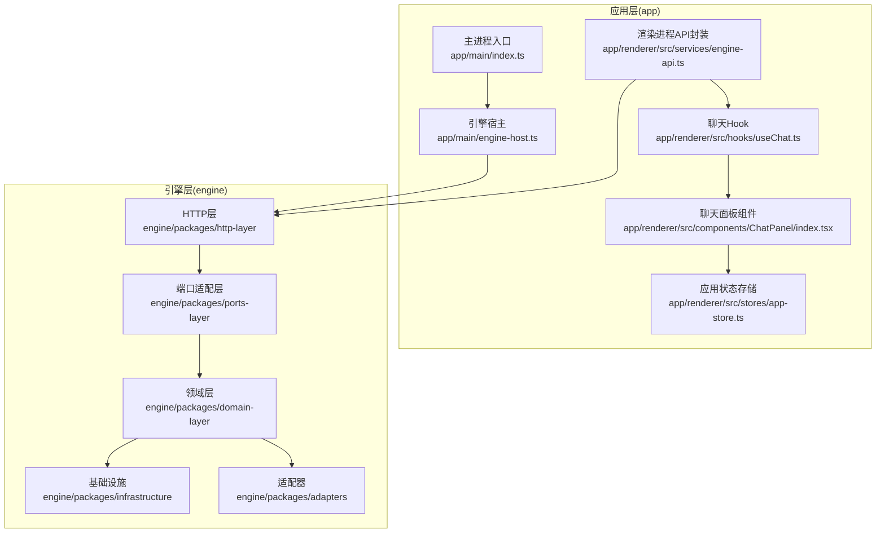
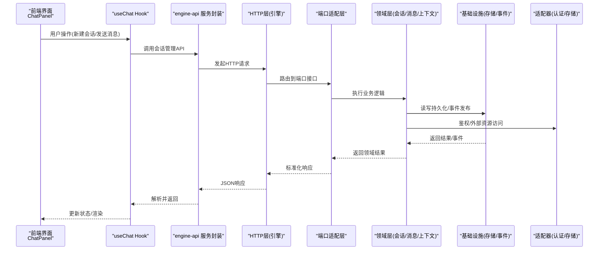
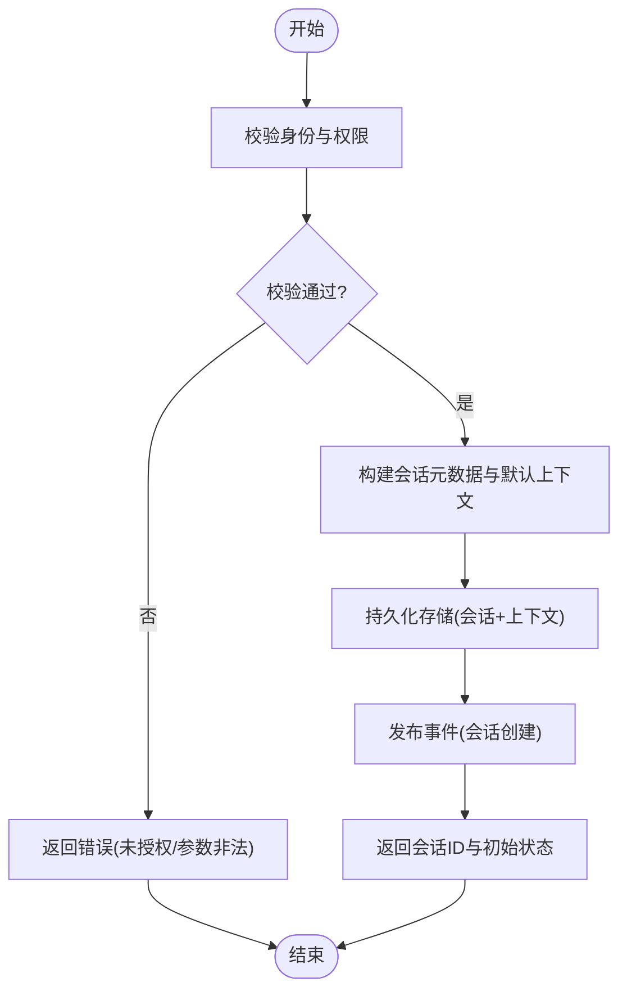
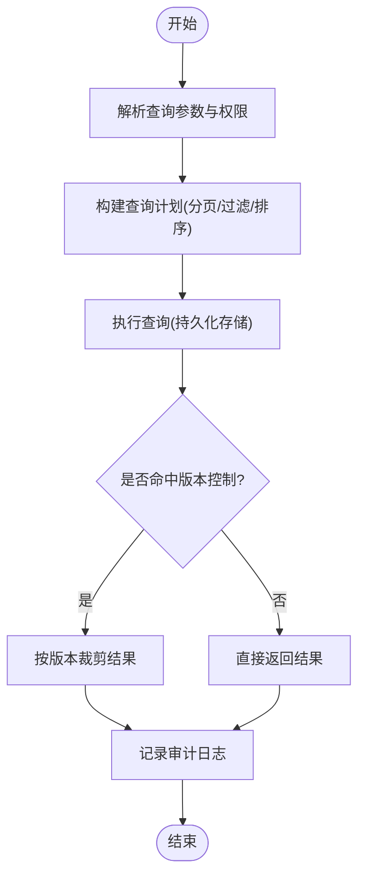
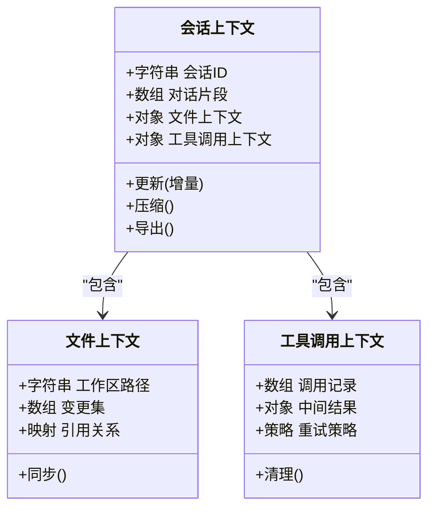
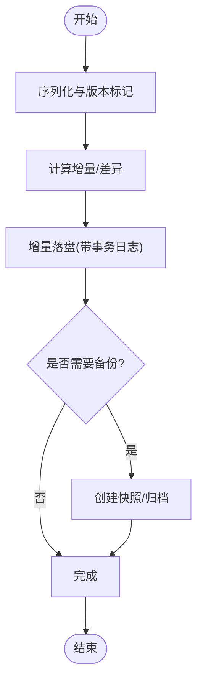
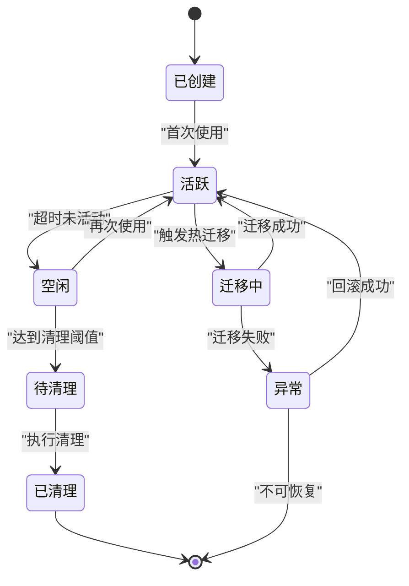
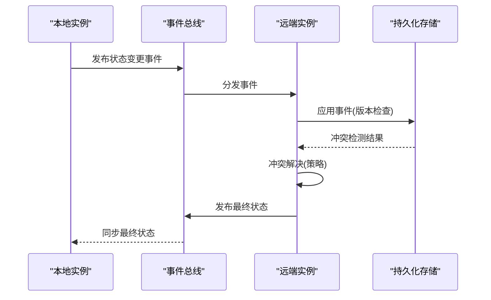
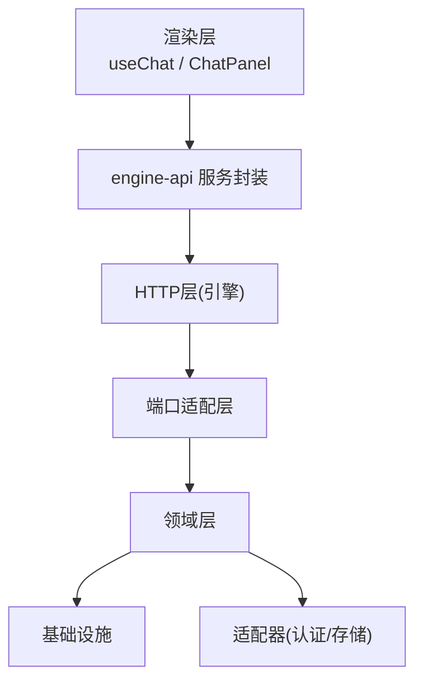

# 会话管理API

<cite>
**本文引用的文件**   
- [engine/README.md](file://engine/README.md)
- [engine/package.json](file://engine/package.json)
- [app/main/index.ts](file://app/main/index.ts)
- [app/main/engine-host.ts](file://app/main/engine-host.ts)
- [app/renderer/src/services/engine-api.ts](file://app/renderer/src/services/engine-api.ts)
- [app/renderer/src/hooks/useChat.ts](file://app/renderer/src/hooks/useChat.ts)
- [app/renderer/src/components/ChatPanel/index.tsx](file://app/renderer/src/components/ChatPanel/index.tsx)
- [app/renderer/src/stores/app-store.ts](file://app/renderer/src/stores/app-store.ts)
</cite>

## 目录
1. [简介](#简介)
2. [项目结构](#项目结构)
3. [核心组件](#核心组件)
4. [架构总览](#架构总览)
5. [详细组件分析](#详细组件分析)
6. [依赖分析](#依赖分析)
7. [性能考虑](#性能考虑)
8. [故障排查指南](#故障排查指南)
9. [结论](#结论)
10. [附录](#附录)

## 简介
本技术文档聚焦于KCoder引擎的“会话管理API”，围绕以下目标展开：
- 会话创建与配置接口：会话初始化参数、用户身份验证、权限设置
- 消息历史管理接口：消息持久化、分页查询、搜索过滤、版本控制
- 上下文维护机制：对话上下文、文件上下文、工具调用上下文的管理
- 会话持久化存储接口：数据序列化、增量更新、备份恢复
- 会话生命周期管理：自动清理、内存优化、热迁移
- 会话状态同步与冲突解决机制

说明：由于仓库未提供明确的“会话管理API”源码实现，本文基于工程结构与现有模块进行系统化梳理与抽象设计，给出可落地的接口规范、数据流与架构图示。涉及具体实现细节的部分以“概念性设计”呈现，便于后续在engine或app层落地。

## 项目结构
从仓库结构看，KCoder采用前后端分离与多包工程组织：
- app（桌面应用）：主进程、渲染进程、UI组件、服务封装、状态管理
- engine（引擎）：核心能力、适配器、HTTP层、领域层、基础设施等

图表来源
- [app/main/index.ts](file://app/main/index.ts)
- [app/main/engine-host.ts](file://app/main/engine-host.ts)
- [app/renderer/src/services/engine-api.ts](file://app/renderer/src/services/engine-api.ts)
- [app/renderer/src/hooks/useChat.ts](file://app/renderer/src/hooks/useChat.ts)
- [app/renderer/src/components/ChatPanel/index.tsx](file://app/renderer/src/components/ChatPanel/index.tsx)
- [app/renderer/src/stores/app-store.ts](file://app/renderer/src/stores/app-store.ts)

章节来源
- [engine/README.md](file://engine/README.md)
- [engine/package.json](file://engine/package.json)
- [app/main/index.ts](file://app/main/index.ts)
- [app/main/engine-host.ts](file://app/main/engine-host.ts)
- [app/renderer/src/services/engine-api.ts](file://app/renderer/src/services/engine-api.ts)
- [app/renderer/src/hooks/useChat.ts](file://app/renderer/src/hooks/useChat.ts)
- [app/renderer/src/components/ChatPanel/index.tsx](file://app/renderer/src/components/ChatPanel/index.tsx)
- [app/renderer/src/stores/app-store.ts](file://app/renderer/src/stores/app-store.ts)

## 核心组件
本节对与会话管理相关的核心组件进行职责划分与交互说明：
- 引擎宿主（Engine Host）：负责启动/停止引擎、加载配置、暴露内部能力给主进程
- HTTP层（HTTP Layer）：对外提供REST/gRPC等接口，承载会话管理API
- 端口适配层（Ports Layer）：定义跨进程/跨语言的接口契约，屏蔽底层差异
- 领域层（Domain Layer）：会话、消息、上下文、权限、策略等核心业务模型与规则
- 基础设施（Infrastructure）：持久化存储、事件总线、缓存、日志、监控
- 适配器（Adapters）：外部系统对接（如数据库、对象存储、认证服务）

章节来源
- [engine/README.md](file://engine/README.md)
- [engine/package.json](file://engine/package.json)

## 架构总览
下图展示“会话管理API”的整体架构与关键数据流：

图表来源
- [app/renderer/src/components/ChatPanel/index.tsx](file://app/renderer/src/components/ChatPanel/index.tsx)
- [app/renderer/src/hooks/useChat.ts](file://app/renderer/src/hooks/useChat.ts)
- [app/renderer/src/services/engine-api.ts](file://app/renderer/src/services/engine-api.ts)
- [app/main/engine-host.ts](file://app/main/engine-host.ts)

## 详细组件分析

### 会话创建与配置接口
- 目标：提供统一的会话创建与配置能力，支持初始化参数、用户身份验证、权限设置
- 关键输入
  - 会话初始化参数：名称、描述、模式、语言、工具集、策略开关等
  - 用户身份：令牌/凭证、租户ID、角色信息
  - 权限设置：功能开关、资源访问范围、审计级别
- 关键输出
  - 会话标识、初始上下文快照、权限清单、策略生效结果
- 典型流程
  - 校验身份与权限
  - 生成会话元数据与默认上下文
  - 写入持久化存储并发布“会话创建”事件
  - 返回会话ID与初始状态

章节来源
- [app/main/engine-host.ts](file://app/main/engine-host.ts)
- [app/renderer/src/services/engine-api.ts](file://app/renderer/src/services/engine-api.ts)

### 消息历史管理接口
- 目标：提供消息的持久化、分页查询、搜索过滤、版本控制能力
- 关键输入
  - 会话ID、页码/大小、排序字段、过滤条件（关键词、类型、时间范围）
  - 版本选择（按版本号或时间戳）
- 关键输出
  - 消息列表、总数、是否有下一页、版本元信息
- 典型流程
  - 解析查询参数与权限范围
  - 构建查询计划（索引/过滤/排序）
  - 读取持久化存储并组装结果
  - 记录审计日志与指标

章节来源
- [app/renderer/src/hooks/useChat.ts](file://app/renderer/src/hooks/useChat.ts)
- [app/renderer/src/services/engine-api.ts](file://app/renderer/src/services/engine-api.ts)

### 上下文维护机制
- 目标：统一管理对话上下文、文件上下文、工具调用上下文
- 关键要素
  - 对话上下文：最近N轮摘要、关键实体、意图标签
  - 文件上下文：当前工作区路径、变更集、引用关系
  - 工具调用上下文：已调用工具、中间结果、失败重试策略
- 管理机制
  - 增量更新：仅追加新片段，定期压缩/摘要
  - 隔离与合并：不同会话/任务间上下文隔离，必要时合并
  - 一致性：基于事件溯源保证上下文最终一致

章节来源
- [app/renderer/src/stores/app-store.ts](file://app/renderer/src/stores/app-store.ts)
- [app/renderer/src/components/ChatPanel/index.tsx](file://app/renderer/src/components/ChatPanel/index.tsx)

### 会话持久化存储接口
- 目标：提供数据序列化、增量更新、备份恢复能力
- 关键能力
  - 序列化：结构化对象转稳定格式（JSON/二进制），含版本标记
  - 增量更新：基于事件/差异的追加式写入，避免全量覆盖
  - 备份恢复：定时快照、按版本回滚、一致性校验
- 典型流程
  - 写入前校验与序列化
  - 增量落盘并记录事务日志
  - 可选触发备份任务
  - 恢复时按版本重建状态

章节来源
- [app/main/engine-host.ts](file://app/main/engine-host.ts)
- [app/renderer/src/services/engine-api.ts](file://app/renderer/src/services/engine-api.ts)

### 会话生命周期管理
- 目标：覆盖自动清理、内存优化、热迁移
- 关键策略
  - 自动清理：基于空闲时长/过期策略回收会话
  - 内存优化：上下文压缩、懒加载、分片缓存
  - 热迁移：在线迁移至新存储/新引擎版本，保持会话可用
- 典型流程
  - 监听生命周期事件（创建/活跃/空闲/销毁）
  - 执行清理与压缩任务
  - 触发迁移任务并校验一致性

章节来源
- [app/main/engine-host.ts](file://app/main/engine-host.ts)

### 会话状态同步与冲突解决机制
- 目标：在多端/多实例场景下保证会话状态一致性与冲突消解
- 关键机制
  - 事件驱动：基于事件总线广播状态变更
  - 冲突检测：基于版本号/时间戳/向量时钟
  - 冲突解决：最后写入优先(LWW)、业务合并策略、人工介入
- 典型流程
  - 本地变更产生事件
  - 同步到远端/其他实例
  - 检测冲突并应用解决策略
  - 广播最终一致状态

章节来源
- [app/main/engine-host.ts](file://app/main/engine-host.ts)
- [app/renderer/src/services/engine-api.ts](file://app/renderer/src/services/engine-api.ts)

## 依赖分析
- 组件耦合
  - 渲染层通过engine-api调用HTTP层，降低与引擎实现的耦合
  - 引擎宿主作为桥接，统一管理与引擎的生命周期与配置
- 外部依赖
  - 认证服务：用于用户身份验证与权限校验
  - 持久化存储：用于消息、上下文、会话元数据的落盘
  - 事件总线：用于跨进程/跨实例的状态同步

图表来源
- [app/renderer/src/hooks/useChat.ts](file://app/renderer/src/hooks/useChat.ts)
- [app/renderer/src/components/ChatPanel/index.tsx](file://app/renderer/src/components/ChatPanel/index.tsx)
- [app/renderer/src/services/engine-api.ts](file://app/renderer/src/services/engine-api.ts)
- [app/main/engine-host.ts](file://app/main/engine-host.ts)

章节来源
- [app/renderer/src/services/engine-api.ts](file://app/renderer/src/services/engine-api.ts)
- [app/main/engine-host.ts](file://app/main/engine-host.ts)

## 性能考虑
- 分页与懒加载：消息历史与上下文按需加载，减少首屏压力
- 增量更新：避免全量覆盖，降低I/O与CPU开销
- 压缩与摘要：定期压缩对话上下文，控制内存占用
- 缓存策略：热点会话与常用工具结果缓存，提升响应速度
- 异步与批处理：批量写入与异步事件处理，提高吞吐

[本节为通用指导，不直接分析具体文件]

## 故障排查指南
- 常见问题
  - 会话创建失败：检查身份凭证、权限配置、必填参数
  - 消息查询为空：确认分页参数、过滤条件、版本选择
  - 上下文不一致：查看事件顺序、冲突解决策略、回滚点
  - 持久化失败：检查磁盘空间、事务日志完整性、备份可用性
- 定位方法
  - 启用调试日志与审计日志
  - 追踪事件总线消息与版本号
  - 对比快照与增量日志，定位丢失或重复事件
  - 使用健康检查接口验证存储与适配器连通性

章节来源
- [app/main/engine-host.ts](file://app/main/engine-host.ts)
- [app/renderer/src/services/engine-api.ts](file://app/renderer/src/services/engine-api.ts)

## 结论
本文围绕KCoder引擎的会话管理API进行了系统化设计与说明，涵盖会话创建与配置、消息历史管理、上下文维护、持久化存储、生命周期管理以及状态同步与冲突解决。建议在实际工程中：
- 明确接口契约与数据模型，确保前后端一致
- 强化事件驱动与版本控制，保障一致性与可追溯
- 完善监控与审计，提升可观测性与排障效率
- 持续优化性能与资源占用，提升用户体验

[本节为总结性内容，不直接分析具体文件]

## 附录
- 术语表
  - 会话：一次完整的对话任务及其相关上下文与状态
  - 上下文：包括对话、文件、工具调用在内的运行期环境
  - 事件：表示状态变更的最小单位，用于同步与回放
  - 版本：用于标识数据或状态的演进版本
- 参考文件
  - 引擎说明与包配置：[engine/README.md](file://engine/README.md)、[engine/package.json](file://engine/package.json)
  - 应用入口与引擎宿主：[app/main/index.ts](file://app/main/index.ts)、[app/main/engine-host.ts](file://app/main/engine-host.ts)
  - 渲染层服务与Hook：[app/renderer/src/services/engine-api.ts](file://app/renderer/src/services/engine-api.ts)、[app/renderer/src/hooks/useChat.ts](file://app/renderer/src/hooks/useChat.ts)
  - 聊天面板与应用状态：[app/renderer/src/components/ChatPanel/index.tsx](file://app/renderer/src/components/ChatPanel/index.tsx)、[app/renderer/src/stores/app-store.ts](file://app/renderer/src/stores/app-store.ts)