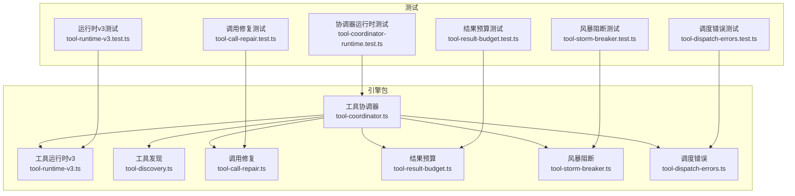
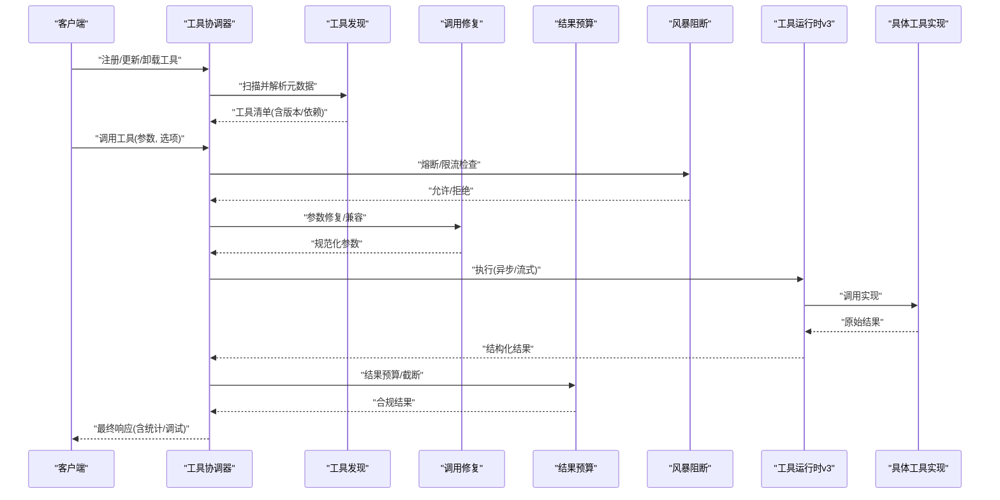
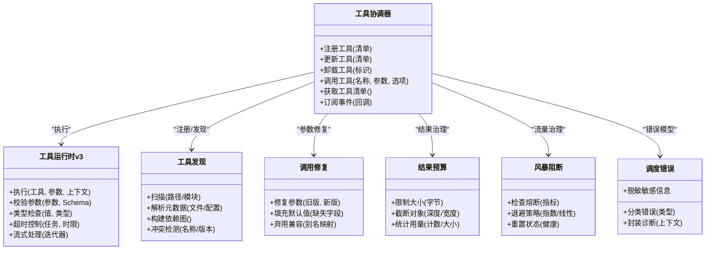
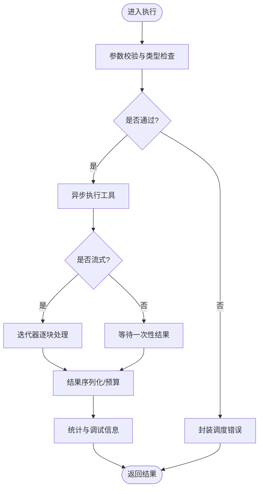
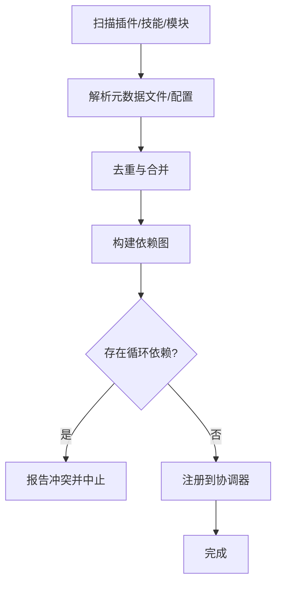
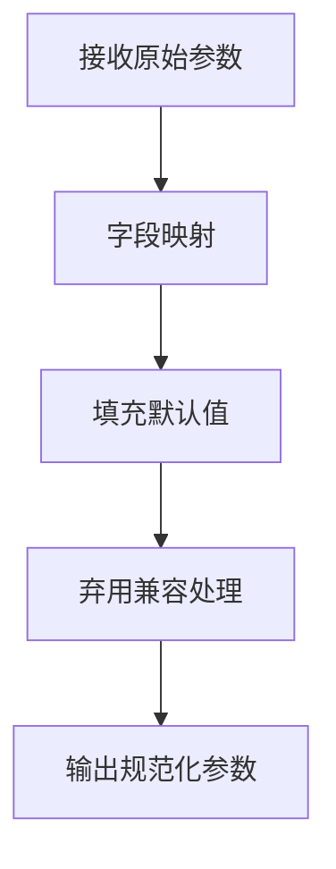
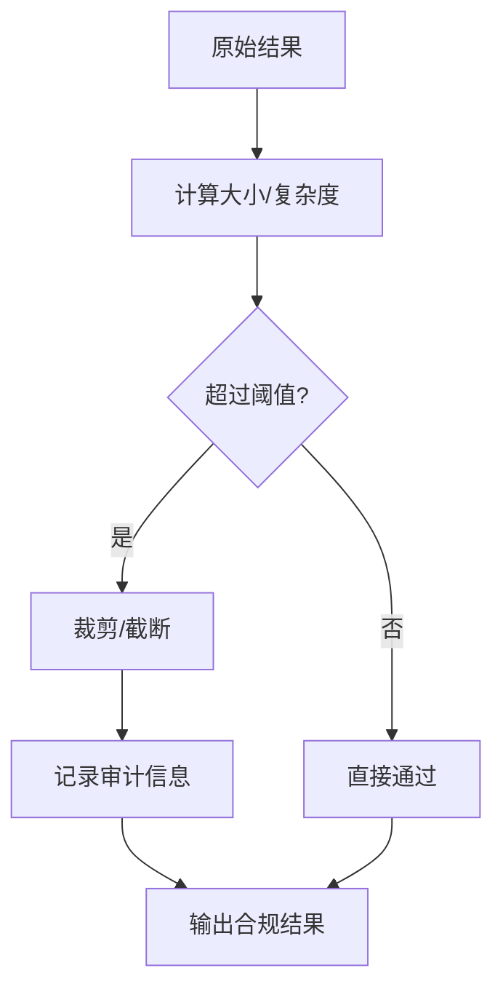
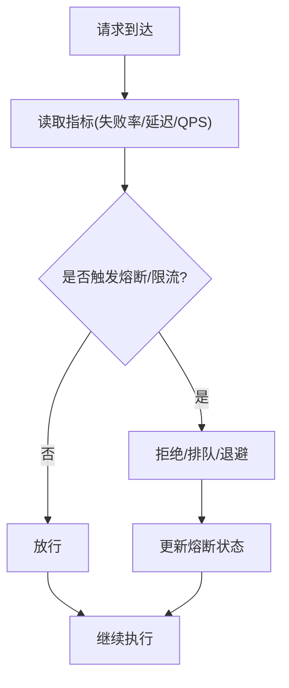
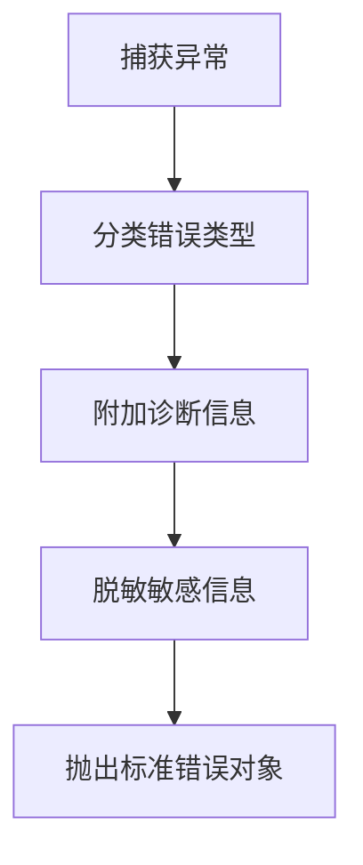
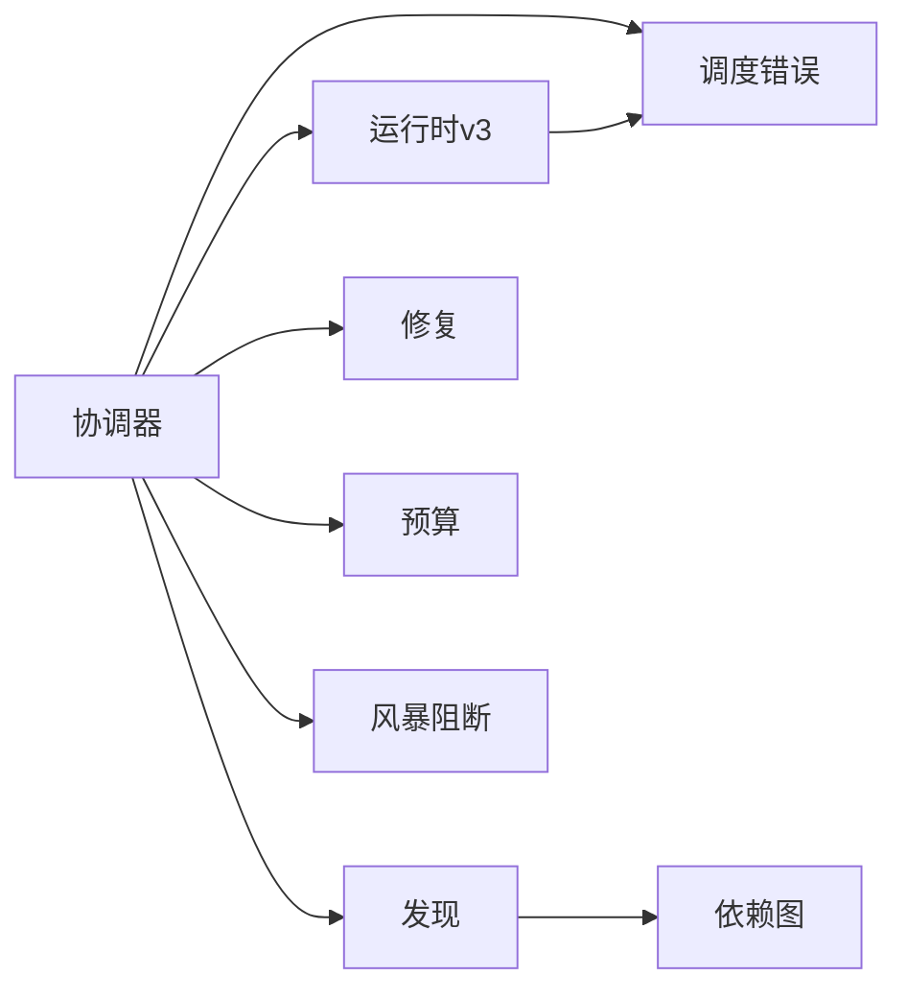

# 工具协调器API

<cite>
**本文引用的文件**   
- [engine/packages/engine/src/tool-coordinator.ts](file://engine/packages/engine/src/tool-coordinator.ts)
- [engine/packages/engine/src/tool-discovery.ts](file://engine/packages/engine/src/tool-discovery.ts)
- [engine/packages/engine/src/tool-runtime-v3.ts](file://engine/packages/engine/src/tool-runtime-v3.ts)
- [engine/packages/engine/src/tool-call-repair.ts](file://engine/packages/engine/src/tool-call-repair.ts)
- [engine/packages/engine/src/tool-result-budget.ts](file://engine/packages/engine/src/tool-result-budget.ts)
- [engine/packages/engine/src/tool-storm-breaker.ts](file://engine/packages/engine/src/tool-storm-breaker.ts)
- [engine/packages/engine/src/tool-dispatch-errors.ts](file://engine/packages/engine/src/tool-dispatch-errors.ts)
- [engine/tests/tool-coordinator-runtime.test.ts](file://engine/tests/tool-coordinator-runtime.test.ts)
- [engine/tests/tool-runtime-v3.test.ts](file://engine/tests/tool-runtime-v3.test.ts)
- [engine/tests/tool-call-repair.test.ts](file://engine/tests/tool-call-repair.test.ts)
- [engine/tests/tool-result-budget.test.ts](file://engine/tests/tool-result-budget.test.ts)
- [engine/tests/tool-storm-breaker.test.ts](file://engine/tests/tool-storm-breaker.test.ts)
- [engine/tests/tool-dispatch-errors.test.ts](file://engine/tests/tool-dispatch-errors.test.ts)
</cite>

## 目录
1. [简介](#简介)
2. [项目结构](#项目结构)
3. [核心组件](#核心组件)
4. [架构总览](#架构总览)
5. [详细组件分析](#详细组件分析)
6. [依赖关系分析](#依赖关系分析)
7. [性能考量](#性能考量)
8. [故障排查指南](#故障排查指南)
9. [结论](#结论)
10. [附录](#附录)

## 简介
本技术文档面向KCoder引擎的工具协调器API，聚焦以下目标：
- 工具注册接口：工具发现、元数据定义、版本管理、依赖声明
- 工具调用协议：参数验证、类型检查、异步执行、流式响应
- 生命周期管理：动态加载、热重载、卸载清理、资源释放
- 执行环境：沙箱隔离、权限控制、资源限制、安全策略
- 结果处理：格式转换、错误包装、性能统计、调试信息
- 监控与恢复：可观测性、熔断/限流、崩溃恢复

## 项目结构
围绕“工具协调器”的核心代码位于 engine/packages/engine 下，测试用例位于 engine/tests。关键文件包括：
- 工具协调器与运行时：tool-coordinator.ts、tool-runtime-v3.ts
- 工具发现与修复：tool-discovery.ts、tool-call-repair.ts
- 结果预算与风暴保护：tool-result-budget.ts、tool-storm-breaker.ts
- 调度错误模型：tool-dispatch-errors.ts
- 对应测试：tool-*-runtime.test.ts、tool-*-test.ts

图表来源
- [engine/packages/engine/src/tool-coordinator.ts](file://engine/packages/engine/src/tool-coordinator.ts)
- [engine/packages/engine/src/tool-runtime-v3.ts](file://engine/packages/engine/src/tool-runtime-v3.ts)
- [engine/packages/engine/src/tool-discovery.ts](file://engine/packages/engine/src/tool-discovery.ts)
- [engine/packages/engine/src/tool-call-repair.ts](file://engine/packages/engine/src/tool-call-repair.ts)
- [engine/packages/engine/src/tool-result-budget.ts](file://engine/packages/engine/src/tool-result-budget.ts)
- [engine/packages/engine/src/tool-storm-breaker.ts](file://engine/packages/engine/src/tool-storm-breaker.ts)
- [engine/packages/engine/src/tool-dispatch-errors.ts](file://engine/packages/engine/src/tool-dispatch-errors.ts)
- [engine/tests/tool-coordinator-runtime.test.ts](file://engine/tests/tool-coordinator-runtime.test.ts)
- [engine/tests/tool-runtime-v3.test.ts](file://engine/tests/tool-runtime-v3.test.ts)
- [engine/tests/tool-call-repair.test.ts](file://engine/tests/tool-call-repair.test.ts)
- [engine/tests/tool-result-budget.test.ts](file://engine/tests/tool-result-budget.test.ts)
- [engine/tests/tool-storm-breaker.test.ts](file://engine/tests/tool-storm-breaker.test.ts)
- [engine/tests/tool-dispatch-errors.test.ts](file://engine/tests/tool-dispatch-errors.test.ts)

章节来源
- [engine/packages/engine/src/tool-coordinator.ts](file://engine/packages/engine/src/tool-coordinator.ts)
- [engine/packages/engine/src/tool-runtime-v3.ts](file://engine/packages/engine/src/tool-runtime-v3.ts)
- [engine/packages/engine/src/tool-discovery.ts](file://engine/packages/engine/src/tool-discovery.ts)
- [engine/packages/engine/src/tool-call-repair.ts](file://engine/packages/engine/src/tool-call-repair.ts)
- [engine/packages/engine/src/tool-result-budget.ts](file://engine/packages/engine/src/tool-result-budget.ts)
- [engine/packages/engine/src/tool-storm-breaker.ts](file://engine/packages/engine/src/tool-storm-breaker.ts)
- [engine/packages/engine/src/tool-dispatch-errors.ts](file://engine/packages/engine/src/tool-dispatch-errors.ts)
- [engine/tests/tool-coordinator-runtime.test.ts](file://engine/tests/tool-coordinator-runtime.test.ts)
- [engine/tests/tool-runtime-v3.test.ts](file://engine/tests/tool-runtime-v3.test.ts)
- [engine/tests/tool-call-repair.test.ts](file://engine/tests/tool-call-repair.test.ts)
- [engine/tests/tool-result-budget.test.ts](file://engine/tests/tool-result-budget.test.ts)
- [engine/tests/tool-storm-breaker.test.ts](file://engine/tests/tool-storm-breaker.test.ts)
- [engine/tests/tool-dispatch-errors.test.ts](file://engine/tests/tool-dispatch-errors.test.ts)

## 核心组件
- 工具协调器（ToolCoordinator）
  - 职责：统一注册/发现工具、编排调用流程、注入中间件（修复、预算、风暴阻断）、维护版本与依赖图、暴露调用入口
  - 能力：动态加载、热重载、卸载清理、资源回收；提供同步/异步/流式调用语义
- 工具运行时 v3（ToolRuntimeV3）
  - 职责：具体执行工具函数、参数校验与类型检查、超时与重试、上下文传递、结果序列化
- 工具发现（ToolDiscovery）
  - 职责：扫描插件/技能/模块，解析元数据（名称、描述、版本、输入输出Schema、依赖），去重与冲突检测
- 调用修复（ToolCallRepair）
  - 职责：对不兼容或过时的调用进行自动修正（字段映射、默认值填充、弃用兼容）
- 结果预算（ToolResultBudget）
  - 职责：限制返回体大小、截断大对象、计数与配额控制，防止OOM
- 风暴阻断（ToolStormBreaker）
  - 职责：基于QPS/并发/失败率等指标做熔断与退避，保护系统稳定性
- 调度错误（ToolDispatchErrors）
  - 职责：标准化错误模型、错误分类、诊断信息与堆栈脱敏

章节来源
- [engine/packages/engine/src/tool-coordinator.ts](file://engine/packages/engine/src/tool-coordinator.ts)
- [engine/packages/engine/src/tool-runtime-v3.ts](file://engine/packages/engine/src/tool-runtime-v3.ts)
- [engine/packages/engine/src/tool-discovery.ts](file://engine/packages/engine/src/tool-discovery.ts)
- [engine/packages/engine/src/tool-call-repair.ts](file://engine/packages/engine/src/tool-call-repair.ts)
- [engine/packages/engine/src/tool-result-budget.ts](file://engine/packages/engine/src/tool-result-budget.ts)
- [engine/packages/engine/src/tool-storm-breaker.ts](file://engine/packages/engine/src/tool-storm-breaker.ts)
- [engine/packages/engine/src/tool-dispatch-errors.ts](file://engine/packages/engine/src/tool-dispatch-errors.ts)

## 架构总览
工具协调器作为中枢，串联发现、运行时、修复、预算、熔断与错误模型，形成“注册—发现—校验—执行—治理—结果处理”的闭环。

图表来源
- [engine/packages/engine/src/tool-coordinator.ts](file://engine/packages/engine/src/tool-coordinator.ts)
- [engine/packages/engine/src/tool-discovery.ts](file://engine/packages/engine/src/tool-discovery.ts)
- [engine/packages/engine/src/tool-call-repair.ts](file://engine/packages/engine/src/tool-call-repair.ts)
- [engine/packages/engine/src/tool-result-budget.ts](file://engine/packages/engine/src/tool-result-budget.ts)
- [engine/packages/engine/src/tool-storm-breaker.ts](file://engine/packages/engine/src/tool-storm-breaker.ts)
- [engine/packages/engine/src/tool-runtime-v3.ts](file://engine/packages/engine/src/tool-runtime-v3.ts)

## 详细组件分析

### 工具协调器（ToolCoordinator）
- 功能要点
  - 注册接口：支持批量注册、按命名空间分组、版本覆盖策略
  - 发现机制：从插件/技能/模块中读取元数据，构建依赖图，检测循环依赖
  - 调用协议：统一入口，支持同步/异步/流式三种模式
  - 生命周期：动态加载、热重载（增量更新）、卸载清理（关闭句柄/释放内存）
  - 中间件链：在调用前后注入修复、预算、熔断、审计等逻辑
- 关键交互
  - 与运行时v3协作完成参数校验、类型检查、超时控制
  - 与风暴阻断协作实现快速失败与退避
  - 与结果预算协作保证返回体可控
- 典型流程
  - 注册→发现→校验→执行→治理→结果处理→返回

图表来源
- [engine/packages/engine/src/tool-coordinator.ts](file://engine/packages/engine/src/tool-coordinator.ts)
- [engine/packages/engine/src/tool-runtime-v3.ts](file://engine/packages/engine/src/tool-runtime-v3.ts)
- [engine/packages/engine/src/tool-discovery.ts](file://engine/packages/engine/src/tool-discovery.ts)
- [engine/packages/engine/src/tool-call-repair.ts](file://engine/packages/engine/src/tool-call-repair.ts)
- [engine/packages/engine/src/tool-result-budget.ts](file://engine/packages/engine/src/tool-result-budget.ts)
- [engine/packages/engine/src/tool-storm-breaker.ts](file://engine/packages/engine/src/tool-storm-breaker.ts)
- [engine/packages/engine/src/tool-dispatch-errors.ts](file://engine/packages/engine/src/tool-dispatch-errors.ts)

章节来源
- [engine/packages/engine/src/tool-coordinator.ts](file://engine/packages/engine/src/tool-coordinator.ts)
- [engine/tests/tool-coordinator-runtime.test.ts](file://engine/tests/tool-coordinator-runtime.test.ts)

### 工具运行时v3（ToolRuntimeV3）
- 功能要点
  - 参数验证与类型检查：基于Schema与类型系统进行严格校验
  - 异步执行：Promise/AsyncIterator双模支持，统一错误边界
  - 流式响应：支持分块返回，便于长耗时任务的进度反馈
  - 上下文传递：携带追踪ID、租户、权限、配额等上下文
- 关键流程
  - 入参校验→类型转换→执行→结果序列化→统计埋点

图表来源
- [engine/packages/engine/src/tool-runtime-v3.ts](file://engine/packages/engine/src/tool-runtime-v3.ts)
- [engine/tests/tool-runtime-v3.test.ts](file://engine/tests/tool-runtime-v3.test.ts)

章节来源
- [engine/packages/engine/src/tool-runtime-v3.ts](file://engine/packages/engine/src/tool-runtime-v3.ts)
- [engine/tests/tool-runtime-v3.test.ts](file://engine/tests/tool-runtime-v3.test.ts)

### 工具发现（ToolDiscovery）
- 功能要点
  - 元数据定义：名称、描述、版本、输入/输出Schema、依赖列表、能力标签
  - 版本管理：主/次/补丁语义化版本，兼容矩阵与降级策略
  - 依赖声明：显式声明外部工具/服务依赖，构建有向无环图
  - 冲突检测：同名不同版本、重复注册、循环依赖告警
- 典型行为
  - 扫描→解析→去重→校验→注册

图表来源
- [engine/packages/engine/src/tool-discovery.ts](file://engine/packages/engine/src/tool-discovery.ts)

章节来源
- [engine/packages/engine/src/tool-discovery.ts](file://engine/packages/engine/src/tool-discovery.ts)

### 调用修复（ToolCallRepair）
- 功能要点
  - 字段映射：将旧版字段名映射至新版
  - 默认值填充：为可选字段补全默认值
  - 弃用兼容：对已弃用API提供平滑过渡
- 适用场景
  - 跨版本升级、第三方工具适配、历史遗留参数兼容

图表来源
- [engine/packages/engine/src/tool-call-repair.ts](file://engine/packages/engine/src/tool-call-repair.ts)
- [engine/tests/tool-call-repair.test.ts](file://engine/tests/tool-call-repair.test.ts)

章节来源
- [engine/packages/engine/src/tool-call-repair.ts](file://engine/packages/engine/src/tool-call-repair.ts)
- [engine/tests/tool-call-repair.test.ts](file://engine/tests/tool-call-repair.test.ts)

### 结果预算（ToolResultBudget）
- 功能要点
  - 大小限制：按字节数限制返回体
  - 结构裁剪：限制对象深度/宽度，避免超大JSON
  - 统计与审计：记录实际大小、被截断位置、触发原因
- 使用建议
  - 结合流式处理，边生成边预算，降低峰值内存

图表来源
- [engine/packages/engine/src/tool-result-budget.ts](file://engine/packages/engine/src/tool-result-budget.ts)
- [engine/tests/tool-result-budget.test.ts](file://engine/tests/tool-result-budget.test.ts)

章节来源
- [engine/packages/engine/src/tool-result-budget.ts](file://engine/packages/engine/src/tool-result-budget.ts)
- [engine/tests/tool-result-budget.test.ts](file://engine/tests/tool-result-budget.test.ts)

### 风暴阻断（ToolStormBreaker）
- 功能要点
  - 熔断：基于失败率/延迟阈值快速失败
  - 限流：基于QPS/并发上限进行排队或拒绝
  - 退避：指数/线性退避，逐步恢复
- 指标来源
  - 运行时统计、错误码分布、下游健康探针

图表来源
- [engine/packages/engine/src/tool-storm-breaker.ts](file://engine/packages/engine/src/tool-storm-breaker.ts)
- [engine/tests/tool-storm-breaker.test.ts](file://engine/tests/tool-storm-breaker.test.ts)

章节来源
- [engine/packages/engine/src/tool-storm-breaker.ts](file://engine/packages/engine/src/tool-storm-breaker.ts)
- [engine/tests/tool-storm-breaker.test.ts](file://engine/tests/tool-storm-breaker.test.ts)

### 调度错误（ToolDispatchErrors）
- 功能要点
  - 错误分类：参数错误、执行错误、超时、熔断、预算超限等
  - 诊断信息：包含调用链路、上下文快照、时间戳
  - 安全策略：脱敏敏感字段，避免泄露密钥/路径
- 使用方式
  - 在各层捕获异常后统一封装，向上抛出标准错误对象

图表来源
- [engine/packages/engine/src/tool-dispatch-errors.ts](file://engine/packages/engine/src/tool-dispatch-errors.ts)
- [engine/tests/tool-dispatch-errors.test.ts](file://engine/tests/tool-dispatch-errors.test.ts)

章节来源
- [engine/packages/engine/src/tool-dispatch-errors.ts](file://engine/packages/engine/src/tool-dispatch-errors.ts)
- [engine/tests/tool-dispatch-errors.test.ts](file://engine/tests/tool-dispatch-errors.test.ts)

## 依赖关系分析
- 内部依赖
  - 协调器依赖运行时、发现、修复、预算、熔断、错误模型
  - 运行时依赖错误模型与统计基础设施
  - 发现依赖元数据解析与依赖图算法
- 外部依赖
  - 插件/技能/模块文件系统或远程仓库
  - 日志/追踪/度量系统（由上层集成）
- 潜在风险
  - 循环依赖：由发现阶段检测并阻止
  - 版本冲突：通过兼容矩阵与降级策略缓解
  - 资源泄漏：通过卸载清理与预算控制规避

图表来源
- [engine/packages/engine/src/tool-coordinator.ts](file://engine/packages/engine/src/tool-coordinator.ts)
- [engine/packages/engine/src/tool-runtime-v3.ts](file://engine/packages/engine/src/tool-runtime-v3.ts)
- [engine/packages/engine/src/tool-discovery.ts](file://engine/packages/engine/src/tool-discovery.ts)
- [engine/packages/engine/src/tool-call-repair.ts](file://engine/packages/engine/src/tool-call-repair.ts)
- [engine/packages/engine/src/tool-result-budget.ts](file://engine/packages/engine/src/tool-result-budget.ts)
- [engine/packages/engine/src/tool-storm-breaker.ts](file://engine/packages/engine/src/tool-storm-breaker.ts)
- [engine/packages/engine/src/tool-dispatch-errors.ts](file://engine/packages/engine/src/tool-dispatch-errors.ts)

章节来源
- [engine/packages/engine/src/tool-coordinator.ts](file://engine/packages/engine/src/tool-coordinator.ts)
- [engine/packages/engine/src/tool-runtime-v3.ts](file://engine/packages/engine/src/tool-runtime-v3.ts)
- [engine/packages/engine/src/tool-discovery.ts](file://engine/packages/engine/src/tool-discovery.ts)
- [engine/packages/engine/src/tool-call-repair.ts](file://engine/packages/engine/src/tool-call-repair.ts)
- [engine/packages/engine/src/tool-result-budget.ts](file://engine/packages/engine/src/tool-result-budget.ts)
- [engine/packages/engine/src/tool-storm-breaker.ts](file://engine/packages/engine/src/tool-storm-breaker.ts)
- [engine/packages/engine/src/tool-dispatch-errors.ts](file://engine/packages/engine/src/tool-dispatch-errors.ts)

## 性能考量
- 流式处理优先：对大数据集/长任务采用迭代器分块返回，降低峰值内存
- 预算前置：在生成过程中应用预算，避免构造完整大对象后再裁剪
- 熔断与限流：在高负载时快速失败，减少无效CPU与I/O消耗
- 缓存与复用：对只读工具结果进行短期缓存，减少重复计算
- 统计与采样：对高频路径采样统计，避免过度埋点影响性能

[本节为通用指导，无需源码引用]

## 故障排查指南
- 常见问题定位
  - 参数校验失败：查看参数Schema与修复日志，确认字段映射与默认值
  - 类型不匹配：检查运行时类型检查日志与输入源
  - 超时/熔断：观察熔断指标与退避策略，评估下游健康度
  - 结果过大：调整预算阈值，启用流式输出
  - 循环依赖：根据发现阶段的冲突报告修正依赖声明
- 调试信息
  - 启用追踪ID与上下文快照，关联上下游日志
  - 收集错误分类与诊断摘要，辅助根因分析
- 恢复策略
  - 自动重试与退避：针对瞬时错误
  - 降级与回滚：版本切换与热重载失败时的回退
  - 隔离与熔断：保护核心路径，隔离问题工具

章节来源
- [engine/tests/tool-dispatch-errors.test.ts](file://engine/tests/tool-dispatch-errors.test.ts)
- [engine/tests/tool-storm-breaker.test.ts](file://engine/tests/tool-storm-breaker.test.ts)
- [engine/tests/tool-result-budget.test.ts](file://engine/tests/tool-result-budget.test.ts)
- [engine/tests/tool-call-repair.test.ts](file://engine/tests/tool-call-repair.test.ts)
- [engine/tests/tool-runtime-v3.test.ts](file://engine/tests/tool-runtime-v3.test.ts)
- [engine/tests/tool-coordinator-runtime.test.ts](file://engine/tests/tool-coordinator-runtime.test.ts)

## 结论
工具协调器API以“注册—发现—校验—执行—治理—结果处理”为主线，提供了完整的工具生命周期管理与健壮的执行保障。通过运行时v3的参数校验与流式支持、发现阶段的元数据与依赖管理、修复/预算/熔断的治理中间件以及标准化的错误模型，系统能够在复杂环境下保持高可用与高性能。建议在生产环境中结合监控与审计，持续优化预算与熔断阈值，确保工具生态的稳定演进。

[本节为总结性内容，无需源码引用]

## 附录
- 术语
  - 元数据：工具的名称、描述、版本、输入/输出Schema、依赖、能力标签等
  - 流式响应：以迭代器形式分块返回结果，适合大数据与长任务
  - 熔断：当失败率/延迟超阈时快速失败，避免雪崩
  - 预算：对返回体大小/复杂度进行限制，防止OOM
- 最佳实践
  - 明确声明依赖与版本范围，避免隐式耦合
  - 使用流式接口处理大数据，配合预算控制
  - 对易错操作设置合理超时与重试策略
  - 在修复层集中处理兼容性问题，保持调用方稳定

[本节为概念性内容，无需源码引用]