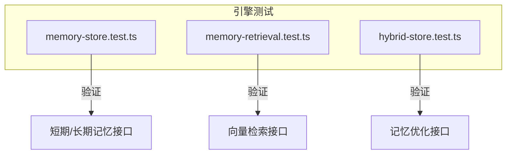
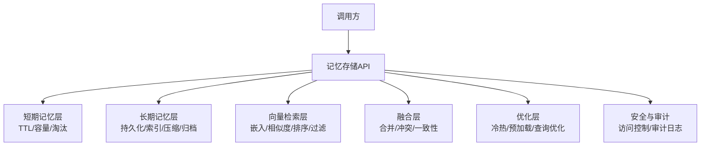
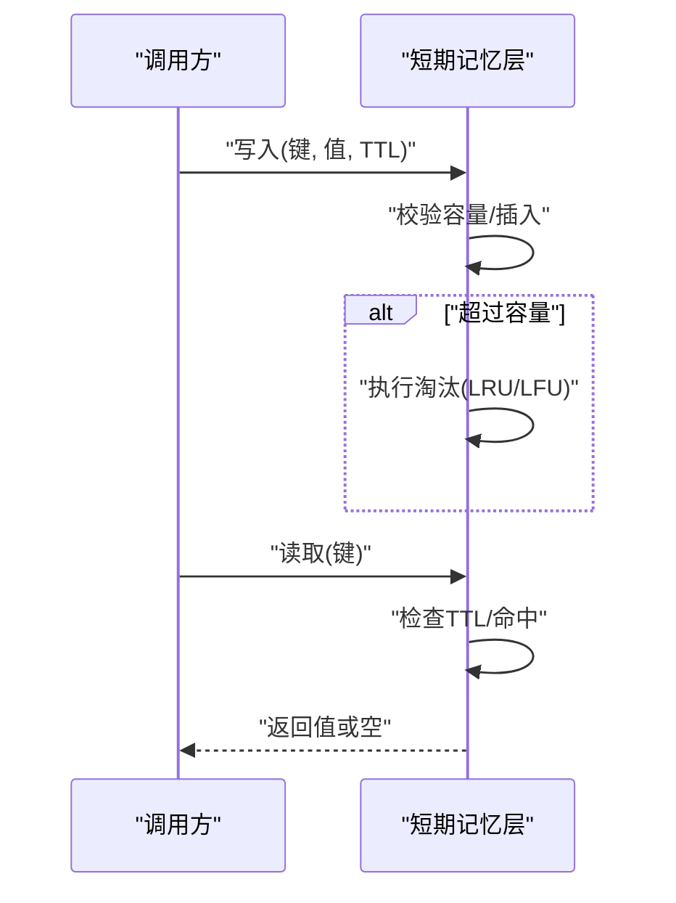
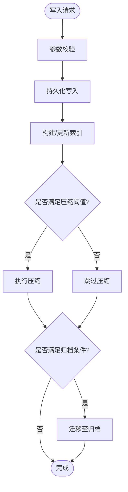
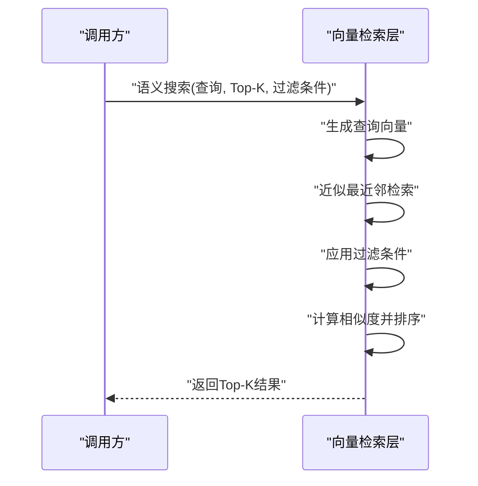
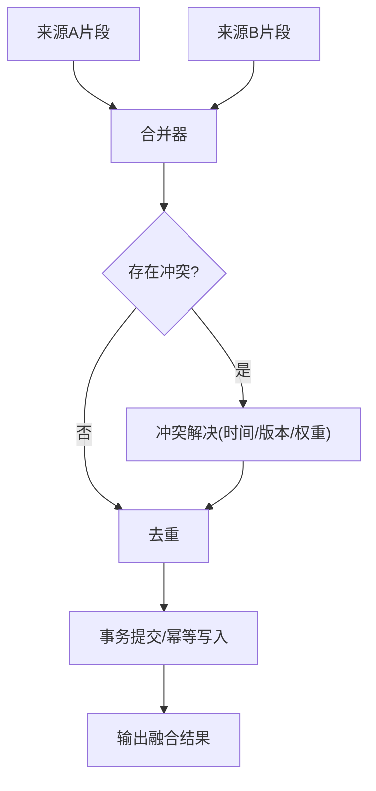
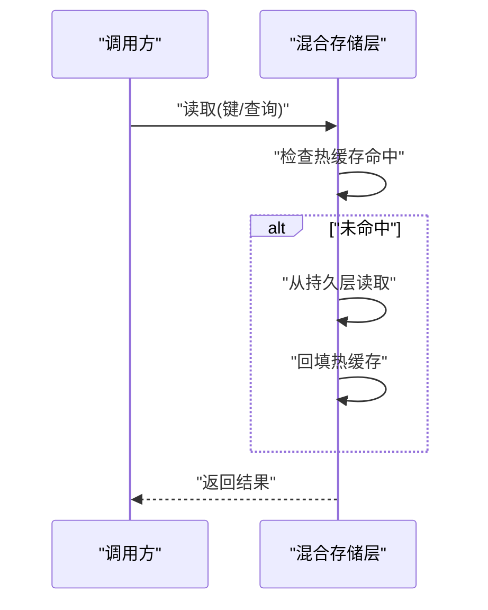
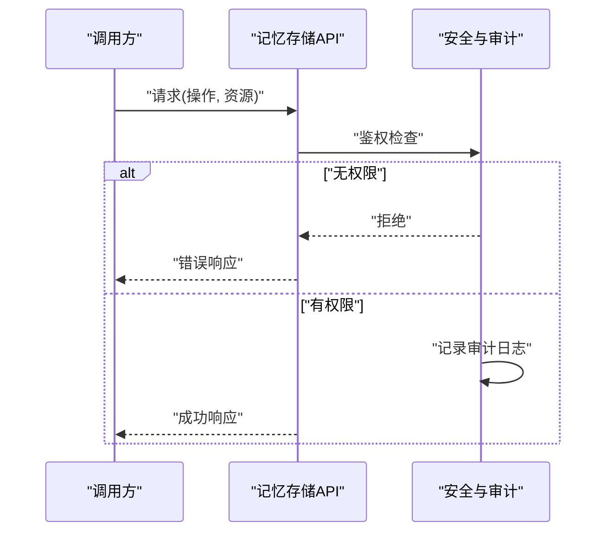
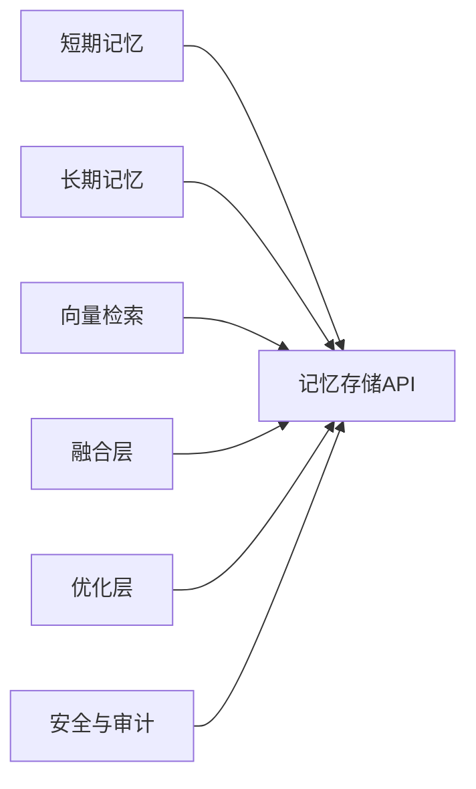

# 记忆存储API

<cite>
**本文引用的文件**   
- [memory-store.test.ts](file://engine/tests/memory-store.test.ts)
- [memory-retrieval.test.ts](file://engine/tests/memory-retrieval.test.ts)
- [hybrid-store.test.ts](file://engine/tests/hybrid-store.test.ts)
</cite>

## 目录
1. [简介](#简介)
2. [项目结构](#项目结构)
3. [核心组件](#核心组件)
4. [架构总览](#架构总览)
5. [详细组件分析](#详细组件分析)
6. [依赖分析](#依赖分析)
7. [性能考虑](#性能考虑)
8. [故障排查指南](#故障排查指南)
9. [结论](#结论)
10. [附录](#附录)

## 简介
本技术文档围绕KCoder引擎的记忆存储API，系统性梳理短期记忆、长期记忆、向量检索、记忆融合与优化、以及安全访问控制与审计日志等能力。文档以仓库中的测试用例为依据，提炼接口职责、数据流与处理逻辑，并给出架构图、时序图与流程图，帮助读者快速理解与落地使用。

## 项目结构
与记忆存储相关的实现与验证主要位于 engine 子工程下的 tests 目录中，包含对内存/混合存储、检索流程等的端到端验证：
- memory-store.test.ts：覆盖短期/长期记忆的基础读写、过期、压缩、归档等行为
- memory-retrieval.test.ts：覆盖语义搜索、相似度计算、结果排序与过滤条件
- hybrid-store.test.ts：覆盖冷热分层、预加载、查询优化等优化策略

图表来源
- [memory-store.test.ts](file://engine/tests/memory-store.test.ts)
- [memory-retrieval.test.ts](file://engine/tests/memory-retrieval.test.ts)
- [hybrid-store.test.ts](file://engine/tests/hybrid-store.test.ts)

章节来源
- [memory-store.test.ts](file://engine/tests/memory-store.test.ts)
- [memory-retrieval.test.ts](file://engine/tests/memory-retrieval.test.ts)
- [hybrid-store.test.ts](file://engine/tests/hybrid-store.test.ts)

## 核心组件
- 短期记忆接口
  - 临时数据存储：提供键值型写入/读取，支持按会话或任务维度隔离
  - 缓存策略：可配置TTL与容量上限，命中优先返回热点条目
  - 过期机制：基于时间戳的惰性过期与周期性清理
  - 内存管理：LRU/LFU淘汰策略，避免内存膨胀
- 长期记忆接口
  - 持久化存储：落盘持久化，保证重启后一致性
  - 索引构建：为常用查询字段建立倒排/前缀索引，提升检索效率
  - 数据压缩：对历史数据进行压缩以减少磁盘占用
  - 归档策略：将冷数据迁移至归档层，降低热路径开销
- 向量检索接口
  - 语义搜索：基于嵌入向量的近似最近邻搜索
  - 相似度计算：余弦相似度或内积打分
  - 结果排序：按相似度降序返回Top-K
  - 过滤条件：支持元数据过滤（如来源、时间范围、标签）
- 记忆融合机制
  - 多源合并：聚合来自不同会话/任务的片段
  - 冲突解决：基于版本/时间戳/权重进行消歧
  - 一致性保证：事务性更新与幂等写入
- 记忆优化接口
  - 冷热分离：热路径走内存，冷路径走磁盘/归档
  - 预加载策略：预测性加载高频片段到内存
  - 查询优化：索引下推、谓词剪枝、批量读取
- 安全访问控制与审计日志
  - 访问控制：基于角色/权限的读写限制
  - 审计日志：记录关键操作（写、删、归档、压缩）及上下文

章节来源
- [memory-store.test.ts](file://engine/tests/memory-store.test.ts)
- [memory-retrieval.test.ts](file://engine/tests/memory-retrieval.test.ts)
- [hybrid-store.test.ts](file://engine/tests/hybrid-store.test.ts)

## 架构总览
记忆存储系统采用“短期+长期+向量检索”的分层设计，并通过融合与优化层对外暴露统一API。

图表来源
- [memory-store.test.ts](file://engine/tests/memory-store.test.ts)
- [memory-retrieval.test.ts](file://engine/tests/memory-retrieval.test.ts)
- [hybrid-store.test.ts](file://engine/tests/hybrid-store.test.ts)

## 详细组件分析

### 短期记忆接口
- 功能要点
  - 写入/读取：支持原子写入与按Key读取
  - TTL与容量：设置过期时间与最大条目数
  - 淘汰策略：当达到容量时触发淘汰
  - 过期清理：惰性检查与后台周期清理
- 典型流程

图表来源
- [memory-store.test.ts](file://engine/tests/memory-store.test.ts)

章节来源
- [memory-store.test.ts](file://engine/tests/memory-store.test.ts)

### 长期记忆接口
- 功能要点
  - 持久化：写入即落盘，支持事务提交
  - 索引：为关键字段建索引，加速点查与范围查询
  - 压缩：对历史块进行压缩存储
  - 归档：将冷数据迁移至归档存储
- 典型流程

图表来源
- [memory-store.test.ts](file://engine/tests/memory-store.test.ts)

章节来源
- [memory-store.test.ts](file://engine/tests/memory-store.test.ts)

### 向量检索接口
- 功能要点
  - 语义搜索：输入文本生成嵌入向量，执行ANN检索
  - 相似度：余弦相似度或内积作为距离度量
  - 排序：按得分降序返回Top-K
  - 过滤：在检索前后应用元数据过滤
- 典型流程

图表来源
- [memory-retrieval.test.ts](file://engine/tests/memory-retrieval.test.ts)

章节来源
- [memory-retrieval.test.ts](file://engine/tests/memory-retrieval.test.ts)

### 记忆融合机制
- 功能要点
  - 多源合并：聚合多个来源的记忆片段
  - 冲突解决：依据时间戳/版本/权重消歧
  - 一致性：通过事务或幂等写入保证最终一致
- 典型流程

图表来源
- [memory-store.test.ts](file://engine/tests/memory-store.test.ts)

章节来源
- [memory-store.test.ts](file://engine/tests/memory-store.test.ts)

### 记忆优化接口
- 功能要点
  - 冷热分离：热数据驻留内存，冷数据落盘/归档
  - 预加载：根据访问模式预测性加载热点
  - 查询优化：索引下推、谓词剪枝、批量读取
- 典型流程

图表来源
- [hybrid-store.test.ts](file://engine/tests/hybrid-store.test.ts)

章节来源
- [hybrid-store.test.ts](file://engine/tests/hybrid-store.test.ts)

### 安全访问控制与审计日志
- 功能要点
  - 访问控制：基于角色/资源维度的读/写/删权限
  - 审计日志：记录操作类型、主体、目标、时间、结果
- 典型流程

图表来源
- [memory-store.test.ts](file://engine/tests/memory-store.test.ts)
- [memory-retrieval.test.ts](file://engine/tests/memory-retrieval.test.ts)
- [hybrid-store.test.ts](file://engine/tests/hybrid-store.test.ts)

章节来源
- [memory-store.test.ts](file://engine/tests/memory-store.test.ts)
- [memory-retrieval.test.ts](file://engine/tests/memory-retrieval.test.ts)
- [hybrid-store.test.ts](file://engine/tests/hybrid-store.test.ts)

## 依赖分析
- 组件耦合
  - 短期记忆与长期记忆相对独立，通过API层统一编排
  - 向量检索依赖嵌入模型与索引后端
  - 融合层依赖短期/长期/向量三层的读取能力
  - 优化层贯穿各层，提供冷热/预加载/查询优化
- 外部依赖
  - 持久化后端（文件系统/数据库）
  - 向量索引库（ANN）
  - 压缩与归档工具链
- 潜在循环依赖
  - 建议通过事件总线或消息队列解耦融合与优化流程

图表来源
- [memory-store.test.ts](file://engine/tests/memory-store.test.ts)
- [memory-retrieval.test.ts](file://engine/tests/memory-retrieval.test.ts)
- [hybrid-store.test.ts](file://engine/tests/hybrid-store.test.ts)

章节来源
- [memory-store.test.ts](file://engine/tests/memory-store.test.ts)
- [memory-retrieval.test.ts](file://engine/tests/memory-retrieval.test.ts)
- [hybrid-store.test.ts](file://engine/tests/hybrid-store.test.ts)

## 性能考虑
- 短期记忆
  - 合理设置TTL与容量上限，避免频繁淘汰导致抖动
  - 使用异步清理减少主路径延迟
- 长期记忆
  - 选择性索引：仅对高选择度字段建索引
  - 批量写入与合并压缩，降低I/O放大
  - 归档阈值调优，平衡检索延迟与存储成本
- 向量检索
  - 选择合适的相似度度量与Top-K规模
  - 过滤条件尽量前置，减少候选集
- 优化层
  - 预加载命中率监控与自适应调整
  - 查询计划优化与缓存穿透防护

[本节为通用指导，不直接分析具体文件]

## 故障排查指南
- 常见问题
  - 短期记忆命中率低：检查TTL与容量配置、淘汰策略
  - 长期记忆写入慢：关注索引构建与压缩时机
  - 向量检索延迟高：评估Top-K与过滤复杂度
  - 融合冲突频发：审查版本/时间戳/权重策略
- 定位方法
  - 查看审计日志确认操作链路
  - 监控冷热比例与预加载命中率
  - 对比索引大小与查询耗时关系

章节来源
- [memory-store.test.ts](file://engine/tests/memory-store.test.ts)
- [memory-retrieval.test.ts](file://engine/tests/memory-retrieval.test.ts)
- [hybrid-store.test.ts](file://engine/tests/hybrid-store.test.ts)

## 结论
KCoder引擎的记忆存储API通过短期/长期/向量三层协同，结合融合与优化能力，提供了高效、可扩展且可观测的记忆管理能力。建议在部署时结合业务特征调优TTL、容量、索引与归档策略，并完善安全与审计机制，以获得稳定与高性能的体验。

[本节为总结性内容，不直接分析具体文件]

## 附录
- 术语
  - TTL：生存时间
  - ANN：近似最近邻
  - LRU/LFU：最近最少使用/最不经常使用
- 参考用例
  - 短期/长期记忆行为验证：[memory-store.test.ts](file://engine/tests/memory-store.test.ts)
  - 语义搜索与过滤验证：[memory-retrieval.test.ts](file://engine/tests/memory-retrieval.test.ts)
  - 冷热分层与预加载验证：[hybrid-store.test.ts](file://engine/tests/hybrid-store.test.ts)