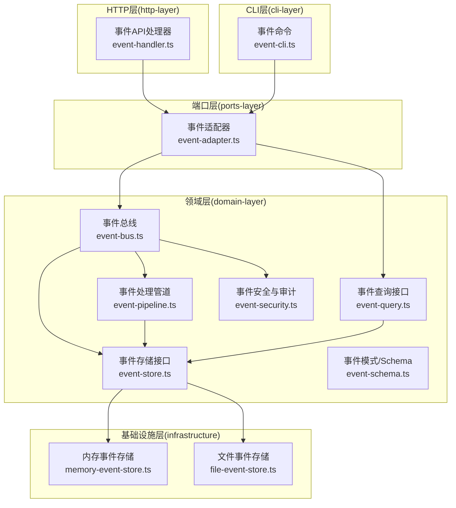
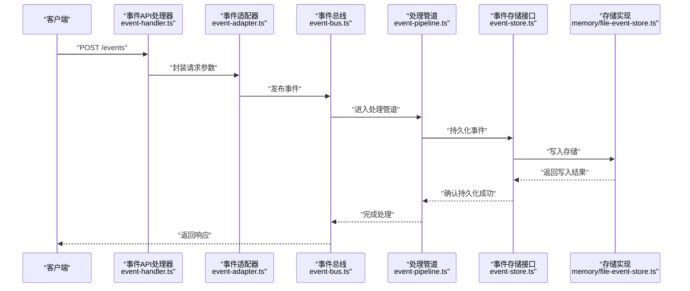
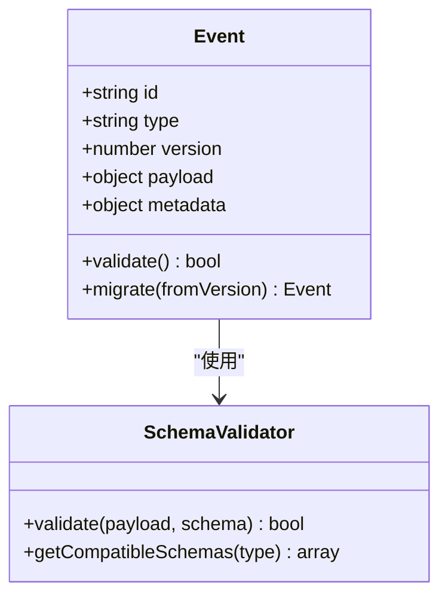
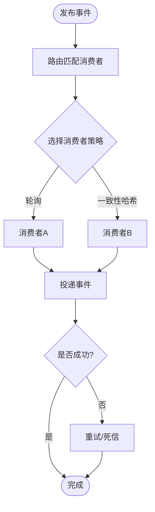
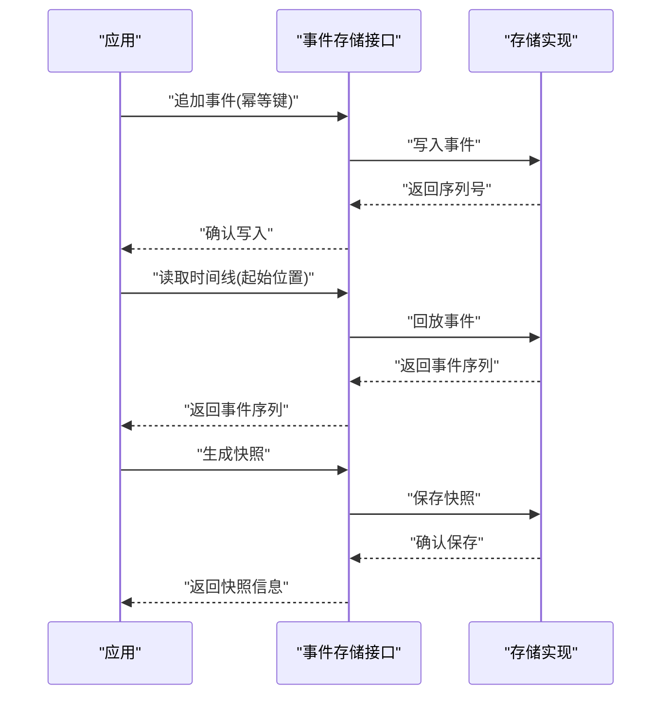
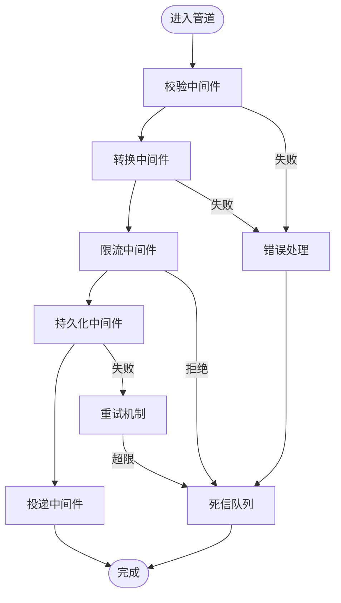
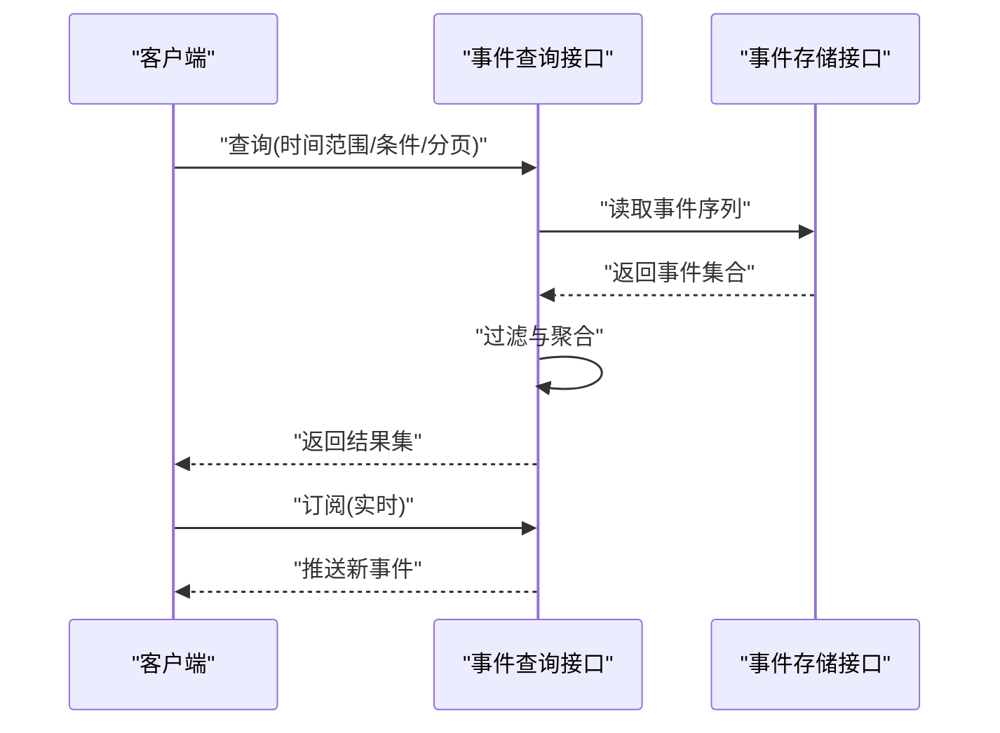
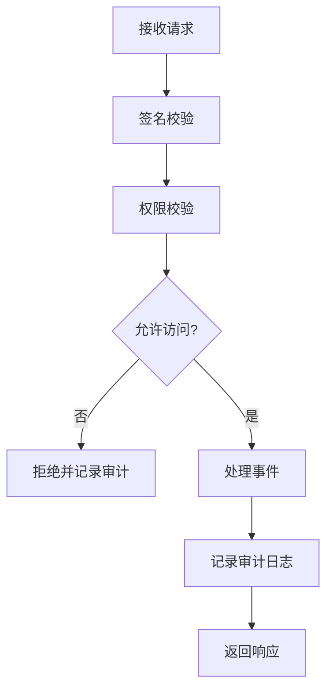
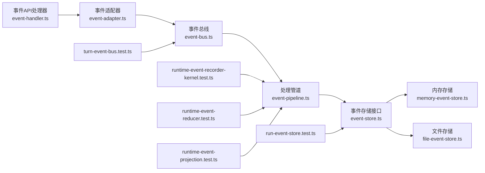

# 领域事件API

<cite>
**本文引用的文件**   
- [engine/packages/domain-layer/src/events/event-bus.ts](file://engine/packages/domain-layer/src/events/event-bus.ts)
- [engine/packages/domain-layer/src/events/event-store.ts](file://engine/packages/domain-layer/src/events/event-store.ts)
- [engine/packages/domain-layer/src/events/event-schema.ts](file://engine/packages/domain-layer/src/events/event-schema.ts)
- [engine/packages/domain-layer/src/events/event-pipeline.ts](file://engine/packages/domain-layer/src/events/event-pipeline.ts)
- [engine/packages/domain-layer/src/events/event-query.ts](file://engine/packages/domain-layer/src/events/event-query.ts)
- [engine/packages/domain-layer/src/events/event-security.ts](file://engine/packages/domain-layer/src/events/event-security.ts)
- [engine/packages/infrastructure/src/storage/file-event-store.ts](file://engine/packages/infrastructure/src/storage/file-event-store.ts)
- [engine/packages/infrastructure/src/storage/memory-event-store.ts](file://engine/packages/infrastructure/src/storage/memory-event-store.ts)
- [engine/packages/ports-layer/src/event-adapter.ts](file://engine/packages/ports-layer/src/event-adapter.ts)
- [engine/packages/http-layer/src/handlers/event-handler.ts](file://engine/packages/http-layer/src/handlers/event-handler.ts)
- [engine/packages/cli-layer/src/commands/event-cli.ts](file://engine/packages/cli-layer/src/commands/event-cli.ts)
- [engine/tests/run-event-store.test.ts](file://engine/tests/run-event-store.test.ts)
- [engine/tests/runtime-event-recorder-kernel.test.ts](file://engine/tests/runtime-event-recorder-kernel.test.ts)
- [engine/tests/runtime-event-reducer.test.ts](file://engine/tests/runtime-event-reducer.test.ts)
- [engine/tests/runtime-event-projection.test.ts](file://engine/tests/runtime-event-projection.test.ts)
- [engine/tests/turn-event-bus.test.ts](file://engine/tests/turn-event-bus.test.ts)
</cite>

## 目录
1. [简介](#简介)
2. [项目结构](#项目结构)
3. [核心组件](#核心组件)
4. [架构总览](#架构总览)
5. [详细组件分析](#详细组件分析)
6. [依赖关系分析](#依赖关系分析)
7. [性能考量](#性能考量)
8. [故障排查指南](#故障排查指南)
9. [结论](#结论)
10. [附录](#附录)

## 简介
本技术文档面向KCoder引擎的领域事件API，覆盖以下关键主题：
- 事件定义接口：事件模式、数据结构、版本兼容与向后兼容策略
- 发布订阅机制：事件总线、消息路由、消费者管理、负载均衡
- 事件溯源接口：事件存储、时间线重建、快照生成、增量同步
- 事件处理管道：中间件链、错误处理、重试机制、死信队列
- 事件查询接口：时间范围查询、条件过滤、聚合统计、实时订阅
- 安全验证与审计追踪：鉴权、签名校验、访问控制、审计日志

该文档以代码级实现为依据，结合测试用例与基础设施适配层，提供从概念到落地的完整说明。

## 项目结构
围绕领域事件API的相关代码主要分布在以下包中：
- domain-layer：领域层，定义事件模型、事件总线、事件存储接口、处理管道、查询与安全等核心能力
- infrastructure：基础设施层，提供事件存储的具体实现（内存、文件）
- ports-layer：端口层，对外暴露统一的事件适配器
- http-layer：HTTP层，提供REST风格的API处理器
- cli-layer：CLI层，提供命令行工具用于事件操作
- tests：单元测试与集成测试，覆盖事件存储、还原、投影、总线行为等

图表来源
- [engine/packages/domain-layer/src/events/event-bus.ts](file://engine/packages/domain-layer/src/events/event-bus.ts)
- [engine/packages/domain-layer/src/events/event-store.ts](file://engine/packages/domain-layer/src/events/event-store.ts)
- [engine/packages/domain-layer/src/events/event-schema.ts](file://engine/packages/domain-layer/src/events/event-schema.ts)
- [engine/packages/domain-layer/src/events/event-pipeline.ts](file://engine/packages/domain-layer/src/events/event-pipeline.ts)
- [engine/packages/domain-layer/src/events/event-query.ts](file://engine/packages/domain-layer/src/events/event-query.ts)
- [engine/packages/domain-layer/src/events/event-security.ts](file://engine/packages/domain-layer/src/events/event-security.ts)
- [engine/packages/infrastructure/src/storage/memory-event-store.ts](file://engine/packages/infrastructure/src/storage/memory-event-store.ts)
- [engine/packages/infrastructure/src/storage/file-event-store.ts](file://engine/packages/infrastructure/src/storage/file-event-store.ts)
- [engine/packages/ports-layer/src/event-adapter.ts](file://engine/packages/ports-layer/src/event-adapter.ts)
- [engine/packages/http-layer/src/handlers/event-handler.ts](file://engine/packages/http-layer/src/handlers/event-handler.ts)
- [engine/packages/cli-layer/src/commands/event-cli.ts](file://engine/packages/cli-layer/src/commands/event-cli.ts)

章节来源
- [engine/packages/domain-layer/src/events/event-bus.ts](file://engine/packages/domain-layer/src/events/event-bus.ts)
- [engine/packages/domain-layer/src/events/event-store.ts](file://engine/packages/domain-layer/src/events/event-store.ts)
- [engine/packages/domain-layer/src/events/event-schema.ts](file://engine/packages/domain-layer/src/events/event-schema.ts)
- [engine/packages/domain-layer/src/events/event-pipeline.ts](file://engine/packages/domain-layer/src/events/event-pipeline.ts)
- [engine/packages/domain-layer/src/events/event-query.ts](file://engine/packages/domain-layer/src/events/event-query.ts)
- [engine/packages/domain-layer/src/events/event-security.ts](file://engine/packages/domain-layer/src/events/event-security.ts)
- [engine/packages/infrastructure/src/storage/memory-event-store.ts](file://engine/packages/infrastructure/src/storage/memory-event-store.ts)
- [engine/packages/infrastructure/src/storage/file-event-store.ts](file://engine/packages/infrastructure/src/storage/file-event-store.ts)
- [engine/packages/ports-layer/src/event-adapter.ts](file://engine/packages/ports-layer/src/event-adapter.ts)
- [engine/packages/http-layer/src/handlers/event-handler.ts](file://engine/packages/http-layer/src/handlers/event-handler.ts)
- [engine/packages/cli-layer/src/commands/event-cli.ts](file://engine/packages/cli-layer/src/commands/event-cli.ts)

## 核心组件
- 事件模式与数据结构(event-schema.ts)
  - 定义事件类型、版本号、载荷结构与元数据字段
  - 提供向后兼容策略：新增可选字段、保留旧字段解析路径、版本降级提示
- 事件存储接口(event-store.ts)
  - 定义追加写入、按时间线读取、快照读写、增量拉取等契约
  - 支持事务性提交与幂等写入
- 事件总线(event-bus.ts)
  - 提供发布/订阅、路由规则、消费者注册与生命周期管理
  - 内置负载均衡策略（轮询、一致性哈希）与并发控制
- 事件处理管道(event-pipeline.ts)
  - 中间件链式执行：校验、转换、限流、重试、死信投递
  - 错误分类与恢复策略，支持可插拔的错误处理器
- 事件查询(event-query.ts)
  - 时间范围、条件过滤、分页、聚合统计
  - 实时订阅通道（基于事件总线或持久化游标）
- 安全与审计(event-security.ts)
  - 请求签名校验、权限校验、访问控制
  - 审计日志记录：谁在何时对哪些事件进行了何种操作

章节来源
- [engine/packages/domain-layer/src/events/event-schema.ts](file://engine/packages/domain-layer/src/events/event-schema.ts)
- [engine/packages/domain-layer/src/events/event-store.ts](file://engine/packages/domain-layer/src/events/event-store.ts)
- [engine/packages/domain-layer/src/events/event-bus.ts](file://engine/packages/domain-layer/src/events/event-bus.ts)
- [engine/packages/domain-layer/src/events/event-pipeline.ts](file://engine/packages/domain-layer/src/events/event-pipeline.ts)
- [engine/packages/domain-layer/src/events/event-query.ts](file://engine/packages/domain-layer/src/events/event-query.ts)
- [engine/packages/domain-layer/src/events/event-security.ts](file://engine/packages/domain-layer/src/events/event-security.ts)

## 架构总览
整体采用分层架构：HTTP/CLI作为接入层，通过端口适配器调用领域层能力；领域层负责事件定义、发布订阅、处理管道、查询与安全；基础设施层提供具体存储实现。

图表来源
- [engine/packages/http-layer/src/handlers/event-handler.ts](file://engine/packages/http-layer/src/handlers/event-handler.ts)
- [engine/packages/ports-layer/src/event-adapter.ts](file://engine/packages/ports-layer/src/event-adapter.ts)
- [engine/packages/domain-layer/src/events/event-bus.ts](file://engine/packages/domain-layer/src/events/event-bus.ts)
- [engine/packages/domain-layer/src/events/event-pipeline.ts](file://engine/packages/domain-layer/src/events/event-pipeline.ts)
- [engine/packages/domain-layer/src/events/event-store.ts](file://engine/packages/domain-layer/src/events/event-store.ts)
- [engine/packages/infrastructure/src/storage/memory-event-store.ts](file://engine/packages/infrastructure/src/storage/memory-event-store.ts)
- [engine/packages/infrastructure/src/storage/file-event-store.ts](file://engine/packages/infrastructure/src/storage/file-event-store.ts)

## 详细组件分析

### 事件定义接口与版本兼容
- 事件模式
  - 包含事件标识、类型、版本、载荷、元数据（时间戳、来源、追踪ID）
  - 载荷结构遵循强类型约束，确保序列化/反序列化稳定
- 数据结构
  - 元数据用于审计追踪与路由决策
  - 载荷支持嵌套对象与数组，但需保持向后兼容
- 版本兼容
  - 版本字段驱动兼容性检查
  - 新增字段默认可选，旧版本忽略未知字段
  - 提供迁移辅助函数，逐步淘汰废弃字段

图表来源
- [engine/packages/domain-layer/src/events/event-schema.ts](file://engine/packages/domain-layer/src/events/event-schema.ts)

章节来源
- [engine/packages/domain-layer/src/events/event-schema.ts](file://engine/packages/domain-layer/src/events/event-schema.ts)

### 发布订阅机制
- 事件总线
  - 提供发布/订阅接口，支持一次性订阅与长期订阅
  - 路由规则基于事件类型与元数据标签进行匹配
- 消费者管理
  - 动态注册/注销消费者
  - 消费者健康检查与自动重启
- 负载均衡
  - 支持轮询与一致性哈希策略
  - 根据消费者处理能力动态调整权重

图表来源
- [engine/packages/domain-layer/src/events/event-bus.ts](file://engine/packages/domain-layer/src/events/event-bus.ts)

章节来源
- [engine/packages/domain-layer/src/events/event-bus.ts](file://engine/packages/domain-layer/src/events/event-bus.ts)

### 事件溯源接口
- 事件存储
  - 追加写入不可变事件序列
  - 支持事务性提交与幂等键去重
- 时间线重建
  - 从起始位置回放事件，构建当前状态
  - 支持断点续播与进度持久化
- 快照生成
  - 定期生成状态快照，减少回放开销
  - 快照与事件序列联合恢复
- 增量同步
  - 基于游标的增量拉取，避免全量扫描
  - 支持多副本同步与冲突解决

图表来源
- [engine/packages/domain-layer/src/events/event-store.ts](file://engine/packages/domain-layer/src/events/event-store.ts)
- [engine/packages/infrastructure/src/storage/memory-event-store.ts](file://engine/packages/infrastructure/src/storage/memory-event-store.ts)
- [engine/packages/infrastructure/src/storage/file-event-store.ts](file://engine/packages/infrastructure/src/storage/file-event-store.ts)

章节来源
- [engine/packages/domain-layer/src/events/event-store.ts](file://engine/packages/domain-layer/src/events/event-store.ts)
- [engine/packages/infrastructure/src/storage/memory-event-store.ts](file://engine/packages/infrastructure/src/storage/memory-event-store.ts)
- [engine/packages/infrastructure/src/storage/file-event-store.ts](file://engine/packages/infrastructure/src/storage/file-event-store.ts)

### 事件处理管道
- 中间件链
  - 顺序执行：校验→转换→限流→重试→持久化→投递
  - 每个中间件可短路返回或抛出异常
- 错误处理
  - 错误分类：业务错误、系统错误、超时错误
  - 可配置重试策略与退避算法
- 死信队列
  - 多次失败后转入死信队列，便于人工干预
  - 死信事件可重新投递或归档

图表来源
- [engine/packages/domain-layer/src/events/event-pipeline.ts](file://engine/packages/domain-layer/src/events/event-pipeline.ts)

章节来源
- [engine/packages/domain-layer/src/events/event-pipeline.ts](file://engine/packages/domain-layer/src/events/event-pipeline.ts)

### 事件查询接口
- 时间范围查询
  - 支持起止时间与游标分页
- 条件过滤
  - 基于事件类型、元数据标签、载荷字段过滤
- 聚合统计
  - 按维度聚合计数、求和、平均值
- 实时订阅
  - 基于事件总线或持久化游标的长连接推送

图表来源
- [engine/packages/domain-layer/src/events/event-query.ts](file://engine/packages/domain-layer/src/events/event-query.ts)
- [engine/packages/domain-layer/src/events/event-store.ts](file://engine/packages/domain-layer/src/events/event-store.ts)

章节来源
- [engine/packages/domain-layer/src/events/event-query.ts](file://engine/packages/domain-layer/src/events/event-query.ts)
- [engine/packages/domain-layer/src/events/event-store.ts](file://engine/packages/domain-layer/src/events/event-store.ts)

### 安全验证与审计追踪
- 安全验证
  - 请求签名校验，防止篡改
  - 权限校验与访问控制列表
- 审计追踪
  - 记录操作者、时间、资源、动作
  - 审计日志可导出与分析

图表来源
- [engine/packages/domain-layer/src/events/event-security.ts](file://engine/packages/domain-layer/src/events/event-security.ts)

章节来源
- [engine/packages/domain-layer/src/events/event-security.ts](file://engine/packages/domain-layer/src/events/event-security.ts)

## 依赖关系分析
- 领域层依赖基础设施层的事件存储实现
- 端口层将HTTP/CLI请求适配为领域层调用
- 测试覆盖事件存储、还原、投影、总线行为等关键路径

图表来源
- [engine/packages/http-layer/src/handlers/event-handler.ts](file://engine/packages/http-layer/src/handlers/event-handler.ts)
- [engine/packages/ports-layer/src/event-adapter.ts](file://engine/packages/ports-layer/src/event-adapter.ts)
- [engine/packages/domain-layer/src/events/event-bus.ts](file://engine/packages/domain-layer/src/events/event-bus.ts)
- [engine/packages/domain-layer/src/events/event-pipeline.ts](file://engine/packages/domain-layer/src/events/event-pipeline.ts)
- [engine/packages/domain-layer/src/events/event-store.ts](file://engine/packages/domain-layer/src/events/event-store.ts)
- [engine/packages/infrastructure/src/storage/memory-event-store.ts](file://engine/packages/infrastructure/src/storage/memory-event-store.ts)
- [engine/packages/infrastructure/src/storage/file-event-store.ts](file://engine/packages/infrastructure/src/storage/file-event-store.ts)
- [engine/tests/run-event-store.test.ts](file://engine/tests/run-event-store.test.ts)
- [engine/tests/runtime-event-recorder-kernel.test.ts](file://engine/tests/runtime-event-recorder-kernel.test.ts)
- [engine/tests/runtime-event-reducer.test.ts](file://engine/tests/runtime-event-reducer.test.ts)
- [engine/tests/runtime-event-projection.test.ts](file://engine/tests/runtime-event-projection.test.ts)
- [engine/tests/turn-event-bus.test.ts](file://engine/tests/turn-event-bus.test.ts)

章节来源
- [engine/packages/http-layer/src/handlers/event-handler.ts](file://engine/packages/http-layer/src/handlers/event-handler.ts)
- [engine/packages/ports-layer/src/event-adapter.ts](file://engine/packages/ports-layer/src/event-adapter.ts)
- [engine/packages/domain-layer/src/events/event-bus.ts](file://engine/packages/domain-layer/src/events/event-bus.ts)
- [engine/packages/domain-layer/src/events/event-pipeline.ts](file://engine/packages/domain-layer/src/events/event-pipeline.ts)
- [engine/packages/domain-layer/src/events/event-store.ts](file://engine/packages/domain-layer/src/events/event-store.ts)
- [engine/packages/infrastructure/src/storage/memory-event-store.ts](file://engine/packages/infrastructure/src/storage/memory-event-store.ts)
- [engine/packages/infrastructure/src/storage/file-event-store.ts](file://engine/packages/infrastructure/src/storage/file-event-store.ts)
- [engine/tests/run-event-store.test.ts](file://engine/tests/run-event-store.test.ts)
- [engine/tests/runtime-event-recorder-kernel.test.ts](file://engine/tests/runtime-event-recorder-kernel.test.ts)
- [engine/tests/runtime-event-reducer.test.ts](file://engine/tests/runtime-event-reducer.test.ts)
- [engine/tests/runtime-event-projection.test.ts](file://engine/tests/runtime-event-projection.test.ts)
- [engine/tests/turn-event-bus.test.ts](file://engine/tests/turn-event-bus.test.ts)

## 性能考量
- 批量写入与批处理回放，降低I/O次数
- 快照压缩与增量回放，缩短恢复时间
- 消费者并行度与背压控制，避免过载
- 查询索引与缓存，提升过滤与聚合性能
- 死信队列异步处理，减少对主流程的影响

## 故障排查指南
- 事件无法持久化
  - 检查存储实现可用性与磁盘空间
  - 查看幂等键冲突与事务回滚原因
- 消费者处理失败
  - 观察重试次数与退避策略
  - 定位死信队列中的失败事件，分析错误堆栈
- 查询性能下降
  - 评估索引命中率与分页大小
  - 考虑引入缓存或预聚合
- 安全校验失败
  - 核对签名密钥与权限配置
  - 审查审计日志中的异常访问记录

章节来源
- [engine/tests/run-event-store.test.ts](file://engine/tests/run-event-store.test.ts)
- [engine/tests/runtime-event-recorder-kernel.test.ts](file://engine/tests/runtime-event-recorder-kernel.test.ts)
- [engine/tests/runtime-event-reducer.test.ts](file://engine/tests/runtime-event-reducer.test.ts)
- [engine/tests/runtime-event-projection.test.ts](file://engine/tests/runtime-event-projection.test.ts)
- [engine/tests/turn-event-bus.test.ts](file://engine/tests/turn-event-bus.test.ts)

## 结论
KCoder引擎的领域事件API通过清晰的层次划分与可扩展的组件设计，实现了高可靠的事件定义、发布订阅、溯源、处理管道、查询与安全审计能力。借助完善的测试覆盖与基础设施适配，系统具备良好的可维护性与演进能力。建议在生产环境中启用快照与增量同步，合理配置消费者并行度与重试策略，并结合审计日志进行持续监控与优化。

## 附录
- 术语表
  - 事件溯源：以不可变事件序列记录领域状态变更
  - 快照：某一时刻的状态镜像，用于加速恢复
  - 死信队列：存放多次处理失败事件的专用队列
- 最佳实践
  - 为事件类型建立稳定的Schema与迁移计划
  - 为关键路径添加端到端测试与混沌演练
  - 对查询接口实施速率限制与缓存策略