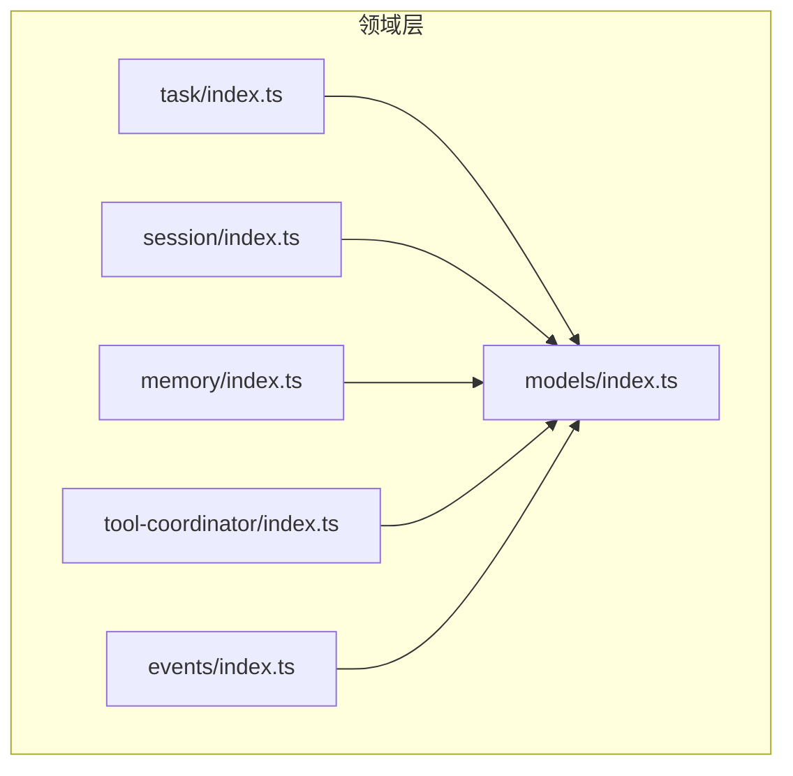
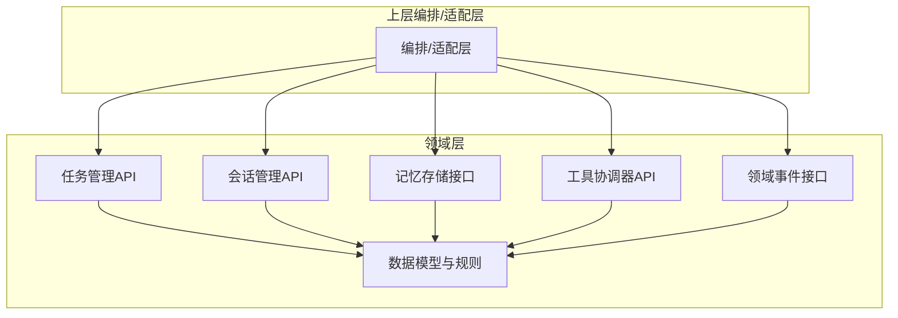
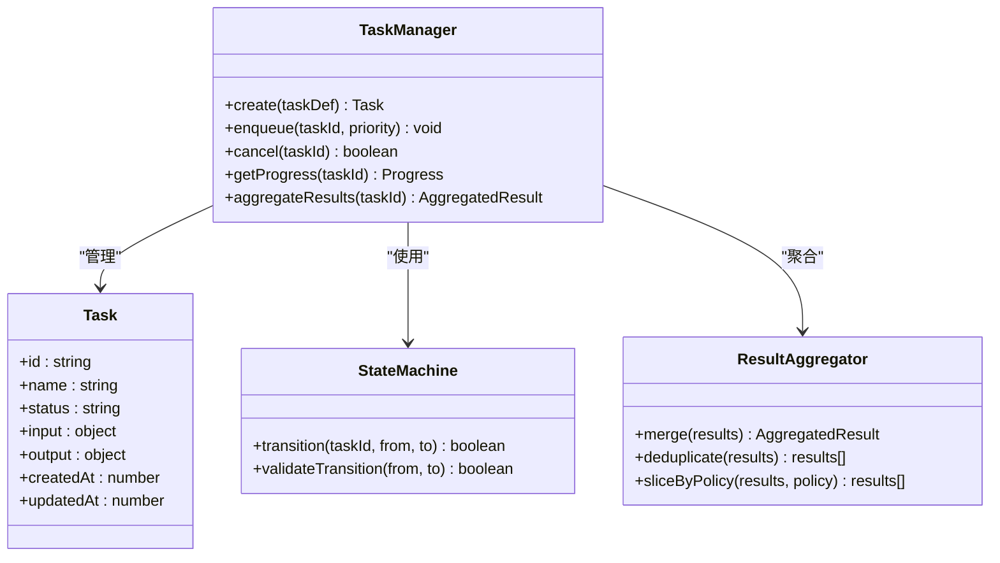
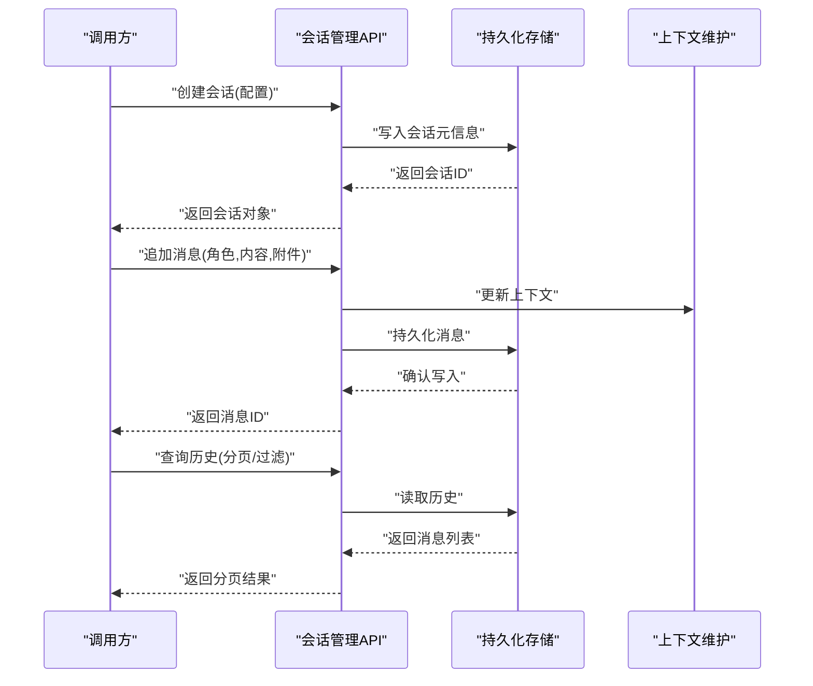
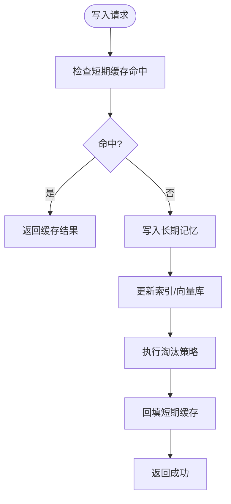
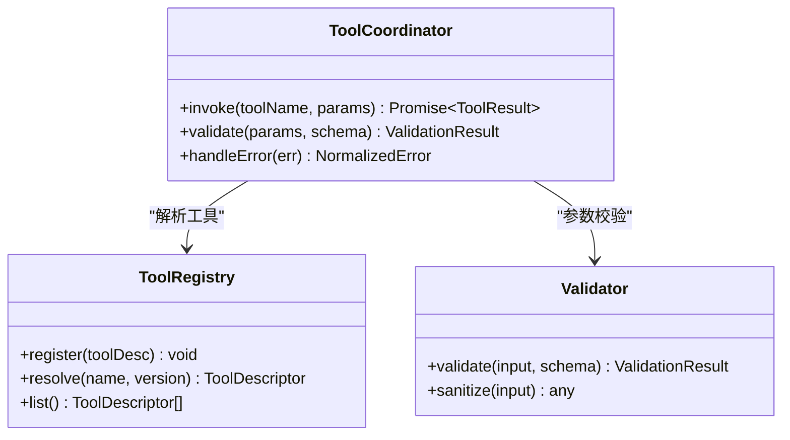
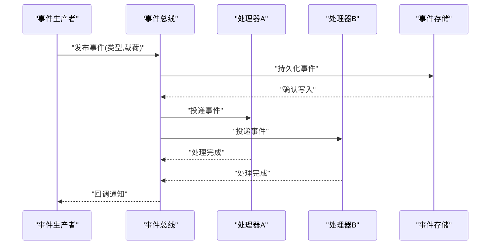
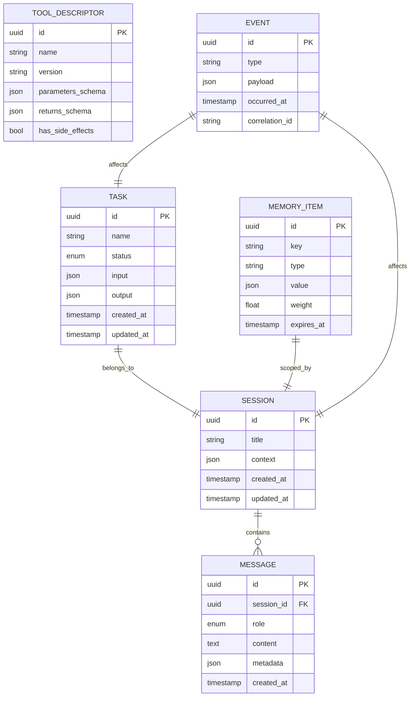
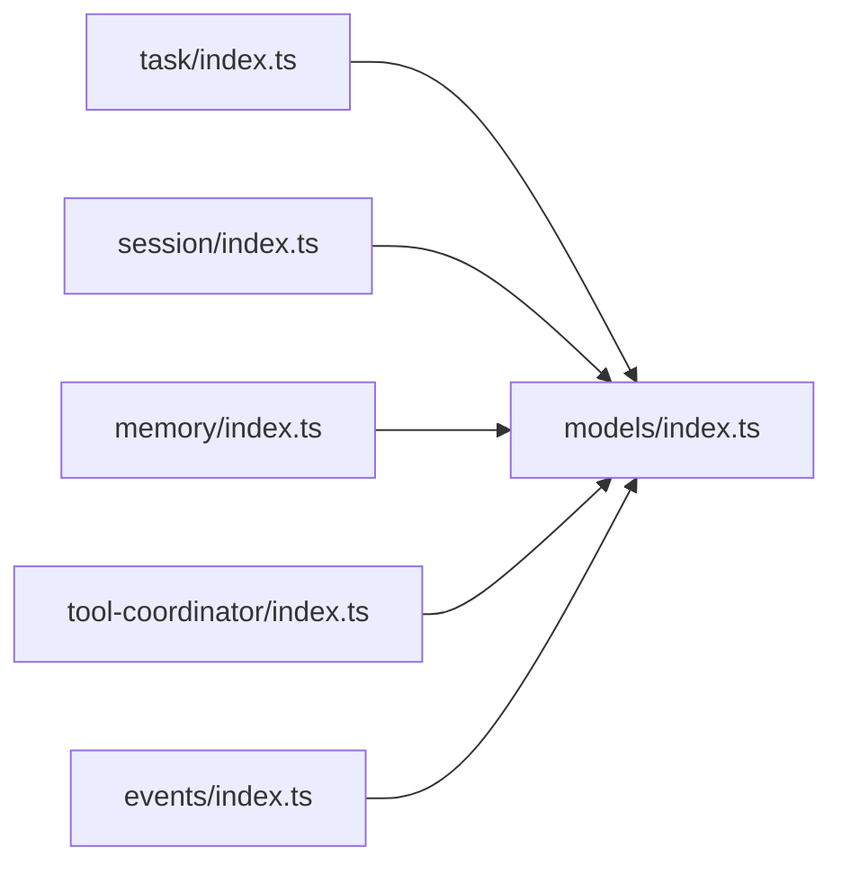

# 领域层API

<cite>
**本文引用的文件**   
- [engine/packages/domain-layer/src/task/index.ts](file://engine/packages/domain-layer/src/task/index.ts)
- [engine/packages/domain-layer/src/session/index.ts](file://engine/packages/domain-layer/src/session/index.ts)
- [engine/packages/domain-layer/src/memory/index.ts](file://engine/packages/domain-layer/src/memory/index.ts)
- [engine/packages/domain-layer/src/tool-coordinator/index.ts](file://engine/packages/domain-layer/src/tool-coordinator/index.ts)
- [engine/packages/domain-layer/src/events/index.ts](file://engine/packages/domain-layer/src/events/index.ts)
- [engine/packages/domain-layer/src/models/index.ts](file://engine/packages/domain-layer/src/models/index.ts)
</cite>

## 目录
1. [简介](#简介)
2. [项目结构](#项目结构)
3. [核心组件](#核心组件)
4. [架构总览](#架构总览)
5. [详细组件分析](#详细组件分析)
6. [依赖分析](#依赖分析)
7. [性能考虑](#性能考虑)
8. [故障排查指南](#故障排查指南)
9. [结论](#结论)
10. [附录](#附录)

## 简介
本文件面向KCoder引擎的领域层API，聚焦以下能力：任务管理、会话管理、记忆存储、工具协调器与领域事件。文档从系统架构、数据流、处理逻辑、集成点、错误处理与性能特性等维度进行系统化说明，并提供可视化图示与可操作的排障建议，帮助读者快速理解并正确使用领域层接口。

## 项目结构
领域层位于 engine/packages/domain-layer，采用按“领域能力”划分的包组织方式，每个子目录对应一个核心能力域（如 task、session、memory、tool-coordinator、events、models），并通过各自的 index.ts 暴露统一API入口。

图表来源
- [engine/packages/domain-layer/src/task/index.ts](file://engine/packages/domain-layer/src/task/index.ts)
- [engine/packages/domain-layer/src/session/index.ts](file://engine/packages/domain-layer/src/session/index.ts)
- [engine/packages/domain-layer/src/memory/index.ts](file://engine/packages/domain-layer/src/memory/index.ts)
- [engine/packages/domain-layer/src/tool-coordinator/index.ts](file://engine/packages/domain-layer/src/tool-coordinator/index.ts)
- [engine/packages/domain-layer/src/events/index.ts](file://engine/packages/domain-layer/src/events/index.ts)
- [engine/packages/domain-layer/src/models/index.ts](file://engine/packages/domain-layer/src/models/index.ts)

章节来源
- [engine/packages/domain-layer/src/task/index.ts](file://engine/packages/domain-layer/src/task/index.ts)
- [engine/packages/domain-layer/src/session/index.ts](file://engine/packages/domain-layer/src/session/index.ts)
- [engine/packages/domain-layer/src/memory/index.ts](file://engine/packages/domain-layer/src/memory/index.ts)
- [engine/packages/domain-layer/src/tool-coordinator/index.ts](file://engine/packages/domain-layer/src/tool-coordinator/index.ts)
- [engine/packages/domain-layer/src/events/index.ts](file://engine/packages/domain-layer/src/events/index.ts)
- [engine/packages/domain-layer/src/models/index.ts](file://engine/packages/domain-layer/src/models/index.ts)

## 核心组件
- 任务管理API：提供Task定义、状态机转换、执行调度与结果聚合能力。
- 会话管理API：提供Session创建、消息历史、上下文维护与持久化存储。
- 记忆存储接口：支持短期/长期记忆、向量检索与缓存策略。
- 工具协调器API：负责工具注册、调用协议、参数校验与结果处理。
- 领域事件接口：实现事件发布订阅、事件溯源与状态同步机制。
- 数据模型与业务规则：集中定义领域实体、约束与不变式。

章节来源
- [engine/packages/domain-layer/src/task/index.ts](file://engine/packages/domain-layer/src/task/index.ts)
- [engine/packages/domain-layer/src/session/index.ts](file://engine/packages/domain-layer/src/session/index.ts)
- [engine/packages/domain-layer/src/memory/index.ts](file://engine/packages/domain-layer/src/memory/index.ts)
- [engine/packages/domain-layer/src/tool-coordinator/index.ts](file://engine/packages/domain-layer/src/tool-coordinator/index.ts)
- [engine/packages/domain-layer/src/events/index.ts](file://engine/packages/domain-layer/src/events/index.ts)
- [engine/packages/domain-layer/src/models/index.ts](file://engine/packages/domain-layer/src/models/index.ts)

## 架构总览
领域层通过清晰的边界将“业务语义”与“基础设施实现”解耦。上层编排层或适配器层仅依赖领域层导出的接口，领域层内部以模型为中心，结合事件驱动与协作对象完成复杂流程。

图表来源
- [engine/packages/domain-layer/src/task/index.ts](file://engine/packages/domain-layer/src/task/index.ts)
- [engine/packages/domain-layer/src/session/index.ts](file://engine/packages/domain-layer/src/session/index.ts)
- [engine/packages/domain-layer/src/memory/index.ts](file://engine/packages/domain-layer/src/memory/index.ts)
- [engine/packages/domain-layer/src/tool-coordinator/index.ts](file://engine/packages/domain-layer/src/tool-coordinator/index.ts)
- [engine/packages/domain-layer/src/events/index.ts](file://engine/packages/domain-layer/src/events/index.ts)
- [engine/packages/domain-layer/src/models/index.ts](file://engine/packages/domain-layer/src/models/index.ts)

## 详细组件分析

### 任务管理API
职责范围
- Task定义：描述任务的元信息、输入输出、依赖关系与生命周期。
- 状态转换：定义合法状态集合与转换条件，保证状态机一致性。
- 执行调度：负责任务入队、优先级、重试、超时与取消。
- 结果聚合：汇总子任务或步骤的执行结果，形成最终产出。

关键概念
- 任务状态：例如待执行、运行中、成功、失败、取消等。
- 执行上下文：包含运行时所需的环境变量、资源句柄与中间产物。
- 结果聚合器：合并多源结果，去重、排序与裁剪。

图表来源
- [engine/packages/domain-layer/src/task/index.ts](file://engine/packages/domain-layer/src/task/index.ts)

章节来源
- [engine/packages/domain-layer/src/task/index.ts](file://engine/packages/domain-layer/src/task/index.ts)

### 会话管理API
职责范围
- Session创建：初始化会话上下文、分配ID与初始配置。
- 消息历史：追加、查询、分页与清理历史消息。
- 上下文维护：维护对话上下文、系统提示、用户偏好与外部注入信息。
- 持久化存储：将会话与消息落盘，支持恢复与迁移。

关键概念
- 会话上下文：包含当前轮次、引用片段、工具调用记录与临时状态。
- 消息类型：用户消息、助手消息、系统消息与工具结果消息。
- 持久化策略：增量写入、事务性提交与压缩归档。

图表来源
- [engine/packages/domain-layer/src/session/index.ts](file://engine/packages/domain-layer/src/session/index.ts)

章节来源
- [engine/packages/domain-layer/src/session/index.ts](file://engine/packages/domain-layer/src/session/index.ts)

### 记忆存储接口
职责范围
- 短期记忆：会话内高频访问的轻量缓存，具备TTL与淘汰策略。
- 长期记忆：跨会话的结构化知识，支持索引与检索。
- 向量检索：基于嵌入向量的相似度搜索与召回。
- 缓存策略：多级缓存、写穿透/回退、热点保护与一致性保障。

关键概念
- 记忆项：键值对、标签、权重与过期时间。
- 检索器：关键词匹配、向量相似度与混合检索。
- 缓存层：内存缓存、磁盘缓存与远端缓存的组合。

图表来源
- [engine/packages/domain-layer/src/memory/index.ts](file://engine/packages/domain-layer/src/memory/index.ts)

章节来源
- [engine/packages/domain-layer/src/memory/index.ts](file://engine/packages/domain-layer/src/memory/index.ts)

### 工具协调器API
职责范围
- 工具注册：声明式注册工具元数据、权限与版本。
- 调用协议：统一的输入输出契约、错误码与限流策略。
- 参数验证：类型校验、必填字段、范围与格式约束。
- 结果处理：标准化响应、错误归一化与结果裁剪。

关键概念
- 工具描述：名称、版本、参数Schema、返回值Schema与副作用标记。
- 调用链：前置校验、执行器、后置处理与审计日志。
- 安全与配额：权限控制、速率限制与预算上限。

图表来源
- [engine/packages/domain-layer/src/tool-coordinator/index.ts](file://engine/packages/domain-layer/src/tool-coordinator/index.ts)

章节来源
- [engine/packages/domain-layer/src/tool-coordinator/index.ts](file://engine/packages/domain-layer/src/tool-coordinator/index.ts)

### 领域事件接口
职责范围
- 事件发布订阅：基于主题的事件分发与消费者订阅。
- 事件溯源：不可变事件序列，支持回放与重建状态。
- 状态同步：通过事件驱动确保各子系统状态一致。

关键概念
- 事件：领域事实的不可变记录，包含时间戳与关联ID。
- 处理器：针对特定事件的幂等处理逻辑。
- 投影：由事件派生的只读视图，用于查询与展示。

图表来源
- [engine/packages/domain-layer/src/events/index.ts](file://engine/packages/domain-layer/src/events/index.ts)

章节来源
- [engine/packages/domain-layer/src/events/index.ts](file://engine/packages/domain-layer/src/events/index.ts)

### 数据模型与业务规则
职责范围
- 实体定义：Task、Session、Message、MemoryItem、ToolDescriptor、Event等核心实体。
- 约束与不变式：唯一性、外键关系、枚举取值、非空与长度限制。
- 规则校验：业务规则在模型层集中表达，避免散落各处。

图表来源
- [engine/packages/domain-layer/src/models/index.ts](file://engine/packages/domain-layer/src/models/index.ts)

章节来源
- [engine/packages/domain-layer/src/models/index.ts](file://engine/packages/domain-layer/src/models/index.ts)

## 依赖分析
- 低耦合高内聚：每个能力域通过独立index.ts暴露最小接口集，减少跨域依赖。
- 模型中心化：所有领域实体与规则集中在models模块，其他组件复用同一份定义。
- 事件解耦：通过事件总线降低组件间直接调用，提升可扩展性与可测试性。

图表来源
- [engine/packages/domain-layer/src/task/index.ts](file://engine/packages/domain-layer/src/task/index.ts)
- [engine/packages/domain-layer/src/session/index.ts](file://engine/packages/domain-layer/src/session/index.ts)
- [engine/packages/domain-layer/src/memory/index.ts](file://engine/packages/domain-layer/src/memory/index.ts)
- [engine/packages/domain-layer/src/tool-coordinator/index.ts](file://engine/packages/domain-layer/src/tool-coordinator/index.ts)
- [engine/packages/domain-layer/src/events/index.ts](file://engine/packages/domain-layer/src/events/index.ts)
- [engine/packages/domain-layer/src/models/index.ts](file://engine/packages/domain-layer/src/models/index.ts)

章节来源
- [engine/packages/domain-layer/src/task/index.ts](file://engine/packages/domain-layer/src/task/index.ts)
- [engine/packages/domain-layer/src/session/index.ts](file://engine/packages/domain-layer/src/session/index.ts)
- [engine/packages/domain-layer/src/memory/index.ts](file://engine/packages/domain-layer/src/memory/index.ts)
- [engine/packages/domain-layer/src/tool-coordinator/index.ts](file://engine/packages/domain-layer/src/tool-coordinator/index.ts)
- [engine/packages/domain-layer/src/events/index.ts](file://engine/packages/domain-layer/src/events/index.ts)
- [engine/packages/domain-layer/src/models/index.ts](file://engine/packages/domain-layer/src/models/index.ts)

## 性能考虑
- 任务调度：优先队列+批处理，避免频繁锁竞争；合理设置超时与重试退避。
- 会话持久化：增量写入与批量提交，定期压缩历史消息，减少I/O压力。
- 记忆检索：向量索引预构建与分片，冷热分层存储，热点数据常驻内存。
- 工具调用：参数校验前置，短路失败路径；结果裁剪与流式返回降低内存峰值。
- 事件处理：幂等消费与顺序保证，背压与限流防止雪崩。

## 故障排查指南
- 任务卡死：检查状态机转换是否被阻断、是否存在未释放的资源或死锁。
- 会话丢失：核对持久化事务是否提交、备份与恢复流程是否完整。
- 记忆不一致：确认缓存与长期存储的一致性策略，排查并发写入冲突。
- 工具调用异常：查看参数校验错误与错误归一化后的堆栈，定位上游服务问题。
- 事件积压：观察事件总线堆积量与消费者吞吐，调整并行度与重试策略。

章节来源
- [engine/packages/domain-layer/src/task/index.ts](file://engine/packages/domain-layer/src/task/index.ts)
- [engine/packages/domain-layer/src/session/index.ts](file://engine/packages/domain-layer/src/session/index.ts)
- [engine/packages/domain-layer/src/memory/index.ts](file://engine/packages/domain-layer/src/memory/index.ts)
- [engine/packages/domain-layer/src/tool-coordinator/index.ts](file://engine/packages/domain-layer/src/tool-coordinator/index.ts)
- [engine/packages/domain-layer/src/events/index.ts](file://engine/packages/domain-layer/src/events/index.ts)

## 结论
领域层API围绕“任务、会话、记忆、工具与事件”五大能力构建，通过清晰的数据模型与事件驱动机制，实现了高内聚、低耦合与强一致的业务语义。遵循本文档的接口约定与最佳实践，可在保证稳定性的同时获得良好的扩展性与可观测性。

## 附录
- 术语表
  - 任务：一次可执行的领域工作单元。
  - 会话：一次对话的生命周期与上下文载体。
  - 记忆：短期与长期知识的统一抽象。
  - 工具：可被调用的外部能力封装。
  - 事件：领域事实的不可变记录。
- 参考入口
  - 任务管理：[engine/packages/domain-layer/src/task/index.ts](file://engine/packages/domain-layer/src/task/index.ts)
  - 会话管理：[engine/packages/domain-layer/src/session/index.ts](file://engine/packages/domain-layer/src/session/index.ts)
  - 记忆存储：[engine/packages/domain-layer/src/memory/index.ts](file://engine/packages/domain-layer/src/memory/index.ts)
  - 工具协调器：[engine/packages/domain-layer/src/tool-coordinator/index.ts](file://engine/packages/domain-layer/src/tool-coordinator/index.ts)
  - 领域事件：[engine/packages/domain-layer/src/events/index.ts](file://engine/packages/domain-layer/src/events/index.ts)
  - 数据模型：[engine/packages/domain-layer/src/models/index.ts](file://engine/packages/domain-layer/src/models/index.ts)