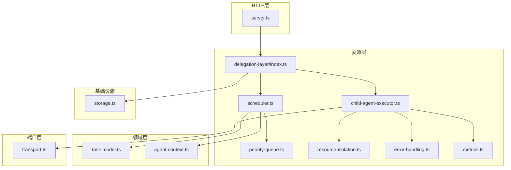
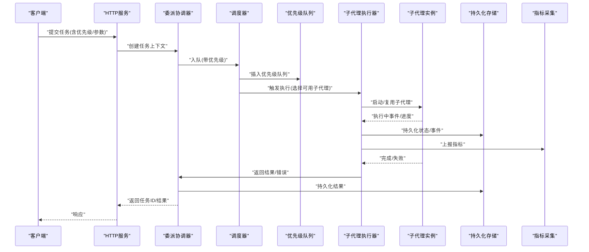
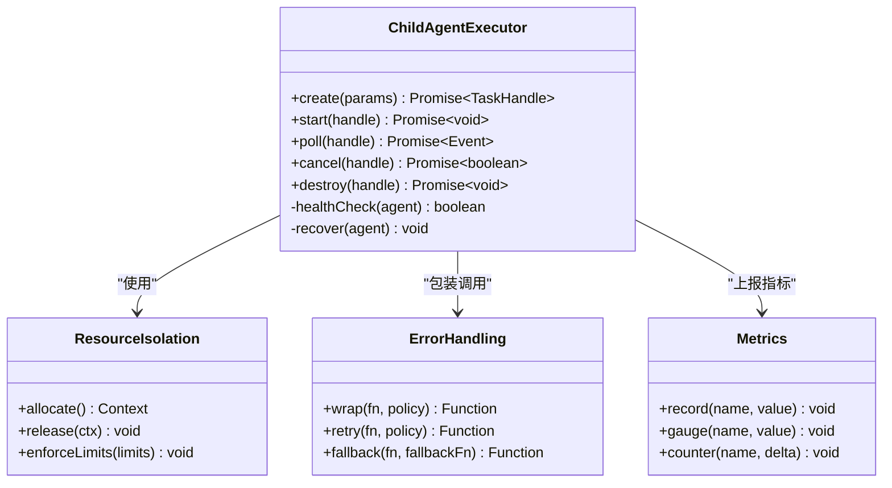
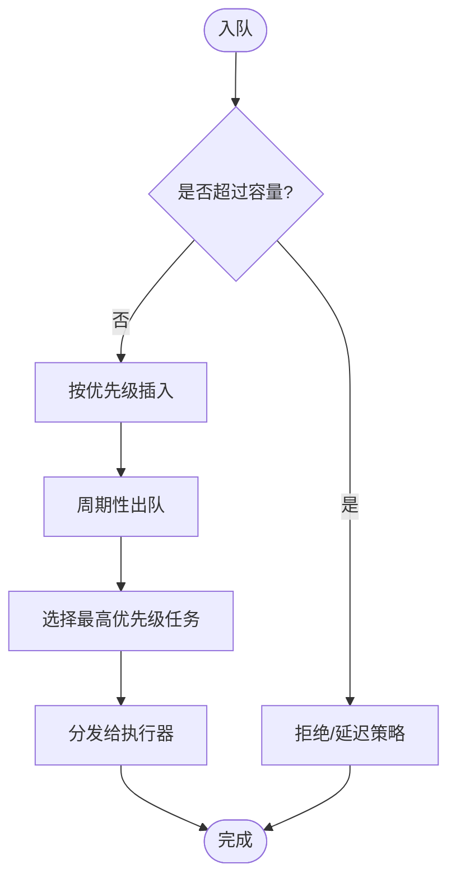
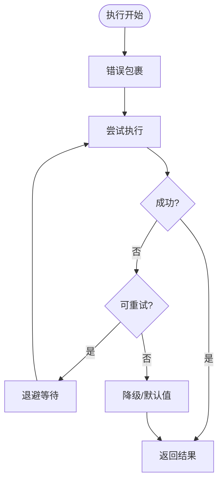
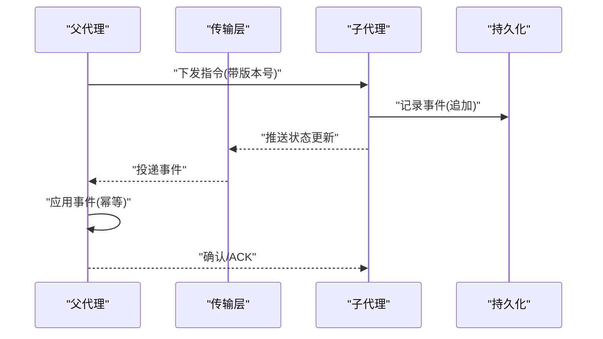
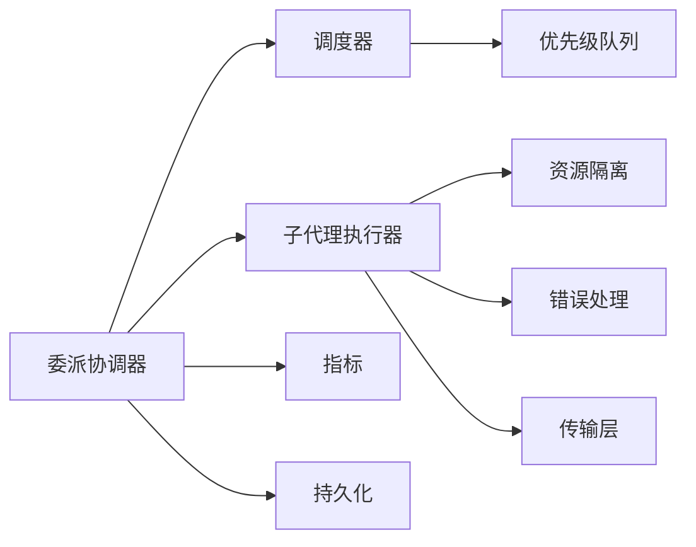

# 任务委派

<cite>
**本文引用的文件**   
- [README.md](file://engine/README.md)
- [package.json](file://engine/package.json)
- [delegation-layer/index.ts](file://engine/packages/delegation-layer/index.ts)
- [delegation-layer/child-agent-executor.ts](file://engine/packages/delegation-layer/child-agent-executor.ts)
- [delegation-layer/task-state-store.ts](file://engine/packages/delegation-layer/task-state-store.ts)
- [delegation-layer/scheduler.ts](file://engine/packages/delegation-layer/scheduler.ts)
- [delegation-layer/priority-queue.ts](file://engine/packages/delegation-layer/priority-queue.ts)
- [delegation-layer/resource-isolation.ts](file://engine/packages/delegation-layer/resource-isolation.ts)
- [delegation-layer/error-handling.ts](file://engine/packages/delegation-layer/error-handling.ts)
- [delegation-layer/metrics.ts](file://engine/packages/delegation-layer/metrics.ts)
- [domain-layer/task-model.ts](file://engine/packages/domain-layer/task-model.ts)
- [domain-layer/agent-context.ts](file://engine/packages/domain-layer/agent-context.ts)
- [ports-layer/transport.ts](file://engine/packages/ports-layer/transport.ts)
- [http-layer/server.ts](file://engine/packages/http-layer/server.ts)
- [infrastructure/storage.ts](file://engine/packages/infrastructure/storage.ts)
- [tests/child-agent-executor.test.ts](file://engine/tests/child-agent-executor.test.ts)
- [tests/delegation-runtime.test.ts](file://engine/tests/delegation-runtime.test.ts)
- [tests/delegation-terminal-state.test.ts](file://engine/tests/delegation-terminal-state.test.ts)
</cite>

## 目录
1. [简介](#简介)
2. [项目结构](#项目结构)
3. [核心组件](#核心组件)
4. [架构总览](#架构总览)
5. [详细组件分析](#详细组件分析)
6. [依赖关系分析](#依赖关系分析)
7. [性能考量](#性能考量)
8. [故障排查指南](#故障排查指南)
9. [结论](#结论)
10. [附录](#附录)

## 简介
本文件面向KCoder的任务委派系统，系统性阐述从任务创建、调度、执行到结果聚合的完整流程；深入说明子代理管理机制（创建、生命周期、资源隔离）、父子代理状态同步与一致性保障、错误处理策略（异常捕获、重试、降级）、并发控制与负载均衡、优先级调度与资源分配策略；并提供API接口文档、使用示例、性能监控与调试工具指南、分布式扩展方案以及复杂任务编排的最佳实践。

## 项目结构
KCoder引擎采用多包分层架构，任务委派相关能力主要分布在以下包：
- delegation-layer：委派运行时、子代理执行器、调度器、优先级队列、资源隔离、错误处理、指标采集等
- domain-layer：领域模型（任务、上下文、事件）
- ports-layer：跨进程/网络传输抽象
- http-layer：HTTP服务暴露API
- infrastructure：持久化存储、文件系统、配置等

图表来源
- [delegation-layer/index.ts](file://engine/packages/delegation-layer/index.ts)
- [delegation-layer/child-agent-executor.ts](file://engine/packages/delegation-layer/child-agent-executor.ts)
- [delegation-layer/scheduler.ts](file://engine/packages/delegation-layer/scheduler.ts)
- [delegation-layer/priority-queue.ts](file://engine/packages/delegation-layer/priority-queue.ts)
- [delegation-layer/resource-isolation.ts](file://engine/packages/delegation-layer/resource-isolation.ts)
- [delegation-layer/error-handling.ts](file://engine/packages/delegation-layer/error-handling.ts)
- [delegation-layer/metrics.ts](file://engine/packages/delegation-layer/metrics.ts)
- [domain-layer/task-model.ts](file://engine/packages/domain-layer/task-model.ts)
- [domain-layer/agent-context.ts](file://engine/packages/domain-layer/agent-context.ts)
- [ports-layer/transport.ts](file://engine/packages/ports-layer/transport.ts)
- [http-layer/server.ts](file://engine/packages/http-layer/server.ts)
- [infrastructure/storage.ts](file://engine/packages/infrastructure/storage.ts)

章节来源
- [README.md](file://engine/README.md)
- [package.json](file://engine/package.json)

## 核心组件
- 委派入口与协调器：负责对外暴露委派能力、编排调度与子代理生命周期管理
- 子代理执行器：封装子代理的创建、启动、运行、终止与资源回收
- 调度器与优先级队列：基于优先级的任务入队、出队与公平性保障
- 资源隔离：为每个子代理提供独立的内存/文件/网络访问边界
- 错误处理：统一异常捕获、可配置重试、熔断与降级策略
- 指标与可观测性：采集任务耗时、成功率、失败原因、资源占用等
- 领域模型：任务定义、上下文、事件流与状态机
- 传输层：进程内或跨进程/网络的可靠消息通道
- HTTP服务：REST API暴露任务提交、查询、取消、结果拉取等能力
- 持久化：任务状态、事件日志、结果快照的落盘与恢复

章节来源
- [delegation-layer/index.ts](file://engine/packages/delegation-layer/index.ts)
- [delegation-layer/child-agent-executor.ts](file://engine/packages/delegation-layer/child-agent-executor.ts)
- [delegation-layer/scheduler.ts](file://engine/packages/delegation-layer/scheduler.ts)
- [delegation-layer/priority-queue.ts](file://engine/packages/delegation-layer/priority-queue.ts)
- [delegation-layer/resource-isolation.ts](file://engine/packages/delegation-layer/resource-isolation.ts)
- [delegation-layer/error-handling.ts](file://engine/packages/delegation-layer/error-handling.ts)
- [delegation-layer/metrics.ts](file://engine/packages/delegation-layer/metrics.ts)
- [domain-layer/task-model.ts](file://engine/packages/domain-layer/task-model.ts)
- [domain-layer/agent-context.ts](file://engine/packages/domain-layer/agent-context.ts)
- [ports-layer/transport.ts](file://engine/packages/ports-layer/transport.ts)
- [http-layer/server.ts](file://engine/packages/http-layer/server.ts)
- [infrastructure/storage.ts](file://engine/packages/infrastructure/storage.ts)

## 架构总览
任务委派系统以“父代理-子代理”为核心，通过调度器将任务按优先级分发至空闲子代理执行，子代理在隔离环境中运行并上报状态与结果，最终由父代理聚合输出。

图表来源
- [http-layer/server.ts](file://engine/packages/http-layer/server.ts)
- [delegation-layer/index.ts](file://engine/packages/delegation-layer/index.ts)
- [delegation-layer/scheduler.ts](file://engine/packages/delegation-layer/scheduler.ts)
- [delegation-layer/priority-queue.ts](file://engine/packages/delegation-layer/priority-queue.ts)
- [delegation-layer/child-agent-executor.ts](file://engine/packages/delegation-layer/child-agent-executor.ts)
- [infrastructure/storage.ts](file://engine/packages/infrastructure/storage.ts)
- [delegation-layer/metrics.ts](file://engine/packages/delegation-layer/metrics.ts)

## 详细组件分析

### 子代理执行器与生命周期
- 职责：创建子代理实例、绑定资源隔离环境、驱动执行、收集事件与结果、清理资源
- 生命周期：初始化→就绪→运行→完成/失败→回收
- 关键行为：
  - 按需创建与池化复用，避免频繁开销
  - 健康检查与自动重启
  - 超时与中断支持
  - 资源配额与限制（CPU/内存/IO）

图表来源
- [delegation-layer/child-agent-executor.ts](file://engine/packages/delegation-layer/child-agent-executor.ts)
- [delegation-layer/resource-isolation.ts](file://engine/packages/delegation-layer/resource-isolation.ts)
- [delegation-layer/error-handling.ts](file://engine/packages/delegation-layer/error-handling.ts)
- [delegation-layer/metrics.ts](file://engine/packages/delegation-layer/metrics.ts)

章节来源
- [delegation-layer/child-agent-executor.ts](file://engine/packages/delegation-layer/child-agent-executor.ts)
- [tests/child-agent-executor.test.ts](file://engine/tests/child-agent-executor.test.ts)

### 调度器与优先级队列
- 职责：维护任务队列、按优先级出队、公平性与饥饿保护、背压控制
- 关键特性：
  - 多级优先级（如紧急/高/普通/低）
  - 时间衰减与动态优先级调整
  - 容量上限与丢弃策略（拒绝/排队/延迟）
  - 与执行器解耦，支持水平扩展

图表来源
- [delegation-layer/scheduler.ts](file://engine/packages/delegation-layer/scheduler.ts)
- [delegation-layer/priority-queue.ts](file://engine/packages/delegation-layer/priority-queue.ts)

章节来源
- [delegation-layer/scheduler.ts](file://engine/packages/delegation-layer/scheduler.ts)
- [delegation-layer/priority-queue.ts](file://engine/packages/delegation-layer/priority-queue.ts)

### 资源隔离与环境
- 目标：确保子代理间互不影响，防止资源争用与越权访问
- 机制：
  - 独立上下文与作用域
  - 文件路径白名单/沙箱
  - 网络访问策略与代理
  - 资源配额（CPU/内存/句柄）

章节来源
- [delegation-layer/resource-isolation.ts](file://engine/packages/delegation-layer/resource-isolation.ts)

### 错误处理与容错
- 异常捕获：对子代理执行链路进行统一包裹，记录堆栈与上下文
- 重试策略：指数退避、抖动、最大次数、条件重试（仅幂等操作）
- 降级处理：当依赖不可用时返回缓存/默认值或快速失败
- 熔断与限流：保护下游与自身稳定性

图表来源
- [delegation-layer/error-handling.ts](file://engine/packages/delegation-layer/error-handling.ts)

章节来源
- [delegation-layer/error-handling.ts](file://engine/packages/delegation-layer/error-handling.ts)

### 状态同步与一致性
- 设计要点：
  - 事件溯源：所有变更以事件形式持久化，支持回放与重建状态
  - 幂等写入：重复事件不会导致状态不一致
  - 最终一致性：父子代理间通过事件总线/传输层异步同步
  - 冲突解决：基于版本戳/向量时钟合并

图表来源
- [domain-layer/task-model.ts](file://engine/packages/domain-layer/task-model.ts)
- [ports-layer/transport.ts](file://engine/packages/ports-layer/transport.ts)
- [infrastructure/storage.ts](file://engine/packages/infrastructure/storage.ts)

章节来源
- [domain-layer/task-model.ts](file://engine/packages/domain-layer/task-model.ts)
- [domain-layer/agent-context.ts](file://engine/packages/domain-layer/agent-context.ts)
- [ports-layer/transport.ts](file://engine/packages/ports-layer/transport.ts)
- [infrastructure/storage.ts](file://engine/packages/infrastructure/storage.ts)

### 并发控制与负载均衡
- 并发控制：
  - 全局并发上限与每子代理并发度
  - 信号量/令牌桶限流
  - 背压：队列满时拒绝或延迟
- 负载均衡：
  - 最少活跃连接/最短队列优先
  - 亲和性：相同任务族路由到同一子代理以提升缓存命中
  - 健康感知：剔除不健康节点

章节来源
- [delegation-layer/scheduler.ts](file://engine/packages/delegation-layer/scheduler.ts)
- [delegation-layer/child-agent-executor.ts](file://engine/packages/delegation-layer/child-agent-executor.ts)

### 优先级调度与资源分配
- 优先级维度：业务重要性、SLA、截止时间、成本预算
- 资源分配：
  - 按优先级分配更高配额（CPU/内存）
  - 抢占式调度（谨慎使用，需考虑上下文保存）
  - 公平份额：保证低优先级任务不被饿死

章节来源
- [delegation-layer/priority-queue.ts](file://engine/packages/delegation-layer/priority-queue.ts)
- [delegation-layer/resource-isolation.ts](file://engine/packages/delegation-layer/resource-isolation.ts)

### API接口文档与使用示例
- 提交任务
  - 方法：POST /api/tasks
  - 请求体：包含任务类型、参数、优先级、超时、重试策略等
  - 响应：任务ID、预计完成时间
- 查询任务
  - 方法：GET /api/tasks/:id
  - 响应：当前状态、进度、结果摘要
- 取消任务
  - 方法：DELETE /api/tasks/:id
  - 响应：取消是否成功
- 获取结果
  - 方法：GET /api/tasks/:id/result
  - 响应：结构化结果或错误信息
- 批量操作
  - 方法：POST /api/tasks/batch
  - 请求体：任务列表
  - 响应：各任务ID映射

使用示例（概念性步骤）
- 调用提交接口获得任务ID
- 轮询查询接口获取进度
- 完成后拉取结果
- 若失败，根据错误码决定重试或人工介入

章节来源
- [http-layer/server.ts](file://engine/packages/http-layer/server.ts)
- [delegation-layer/index.ts](file://engine/packages/delegation-layer/index.ts)

### 性能监控与调试工具
- 指标采集：
  - 任务级：创建/开始/完成耗时、重试次数、失败原因分布
  - 系统级：队列长度、子代理数量、资源利用率
- 日志与追踪：
  - 结构化日志（任务ID、子代理ID、阶段）
  - 分布式追踪ID贯穿父子代理
- 调试建议：
  - 开启详细日志级别
  - 导出指标到监控系统
  - 回放事件定位问题

章节来源
- [delegation-layer/metrics.ts](file://engine/packages/delegation-layer/metrics.ts)
- [delegation-layer/child-agent-executor.ts](file://engine/packages/delegation-layer/child-agent-executor.ts)

### 分布式任务处理扩展方案
- 横向扩展：
  - 无状态调度器+外部消息队列（如Redis/RabbitMQ/Kafka）
  - 子代理作为工作节点注册到注册中心
- 状态与一致性：
  - 外部持久化（数据库/对象存储）
  - 事件总线实现跨节点广播
- 弹性伸缩：
  - 基于队列深度与资源使用率自动扩缩容
- 安全与治理：
  - 鉴权与授权
  - 速率限制与配额

章节来源
- [ports-layer/transport.ts](file://engine/packages/ports-layer/transport.ts)
- [infrastructure/storage.ts](file://engine/packages/infrastructure/storage.ts)

### 复杂任务编排案例与最佳实践
- 案例一：代码审查流水线
  - 步骤：静态分析→规则校验→报告生成→通知
  - 要点：并行执行独立步骤、失败分支回滚、结果聚合
- 案例二：重构与测试联动
  - 步骤：规划→修改→单元测试→集成测试→提交
  - 要点：强一致性要求、事务性提交、失败快速失败
- 最佳实践：
  - 明确任务边界与幂等性
  - 合理设置超时与重试
  - 使用优先级区分SLA
  - 保留完整审计日志

章节来源
- [domain-layer/task-model.ts](file://engine/packages/domain-layer/task-model.ts)
- [domain-layer/agent-context.ts](file://engine/packages/domain-layer/agent-context.ts)

## 依赖关系分析
- 内部依赖：
  - 委派协调器依赖调度器、执行器、错误处理、指标
  - 执行器依赖资源隔离、错误处理、传输层
  - 调度器依赖优先级队列、领域模型
- 外部依赖：
  - 持久化存储（磁盘/数据库）
  - 传输层（进程内/网络）
  - HTTP服务（可选）

图表来源
- [delegation-layer/index.ts](file://engine/packages/delegation-layer/index.ts)
- [delegation-layer/scheduler.ts](file://engine/packages/delegation-layer/scheduler.ts)
- [delegation-layer/priority-queue.ts](file://engine/packages/delegation-layer/priority-queue.ts)
- [delegation-layer/child-agent-executor.ts](file://engine/packages/delegation-layer/child-agent-executor.ts)
- [delegation-layer/resource-isolation.ts](file://engine/packages/delegation-layer/resource-isolation.ts)
- [delegation-layer/error-handling.ts](file://engine/packages/delegation-layer/error-handling.ts)
- [delegation-layer/metrics.ts](file://engine/packages/delegation-layer/metrics.ts)
- [ports-layer/transport.ts](file://engine/packages/ports-layer/transport.ts)
- [infrastructure/storage.ts](file://engine/packages/infrastructure/storage.ts)

章节来源
- [delegation-layer/index.ts](file://engine/packages/delegation-layer/index.ts)
- [delegation-layer/scheduler.ts](file://engine/packages/delegation-layer/scheduler.ts)
- [delegation-layer/child-agent-executor.ts](file://engine/packages/delegation-layer/child-agent-executor.ts)

## 性能考量
- 减少上下文切换：复用子代理、批处理任务
- 降低序列化开销：使用高效编码格式
- 优化I/O：异步非阻塞、缓冲与预取
- 控制内存峰值：流式处理、分页读取
- 监控热点：识别慢任务与瓶颈点，针对性优化

[本节为通用指导，无需特定文件引用]

## 故障排查指南
- 常见问题：
  - 任务卡住：检查超时、锁竞争、依赖可用性
  - 结果不一致：核对事件顺序与幂等性
  - 资源耗尽：查看配额与泄漏点
- 定位手段：
  - 启用详细日志与追踪ID
  - 导出指标并设置告警阈值
  - 回放事件重建状态
- 恢复策略：
  - 自动重试与降级
  - 手动补偿与重放

章节来源
- [delegation-layer/error-handling.ts](file://engine/packages/delegation-layer/error-handling.ts)
- [delegation-layer/metrics.ts](file://engine/packages/delegation-layer/metrics.ts)
- [tests/delegation-terminal-state.test.ts](file://engine/tests/delegation-terminal-state.test.ts)

## 结论
KCoder的任务委派系统通过清晰的层次划分与模块化设计，实现了高内聚、低耦合的可扩展任务执行框架。借助优先级调度、资源隔离、错误容错与可观测性能力，系统能够在复杂场景下稳定运行，并为分布式扩展与复杂编排提供坚实基础。

[本节为总结性内容，无需特定文件引用]

## 附录
- 术语表：
  - 父代理：负责编排与聚合的主代理
  - 子代理：实际执行任务的隔离单元
  - 事件溯源：以事件序列表达状态变更的设计模式
- 参考测试：
  - 子代理执行器行为验证
  - 委派运行时端到端流程
  - 终态一致性保障

章节来源
- [tests/child-agent-executor.test.ts](file://engine/tests/child-agent-executor.test.ts)
- [tests/delegation-runtime.test.ts](file://engine/tests/delegation-runtime.test.ts)
- [tests/delegation-terminal-state.test.ts](file://engine/tests/delegation-terminal-state.test.ts)