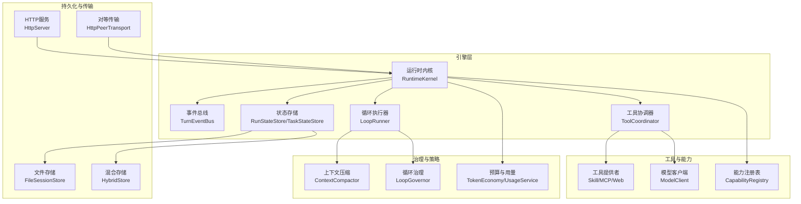
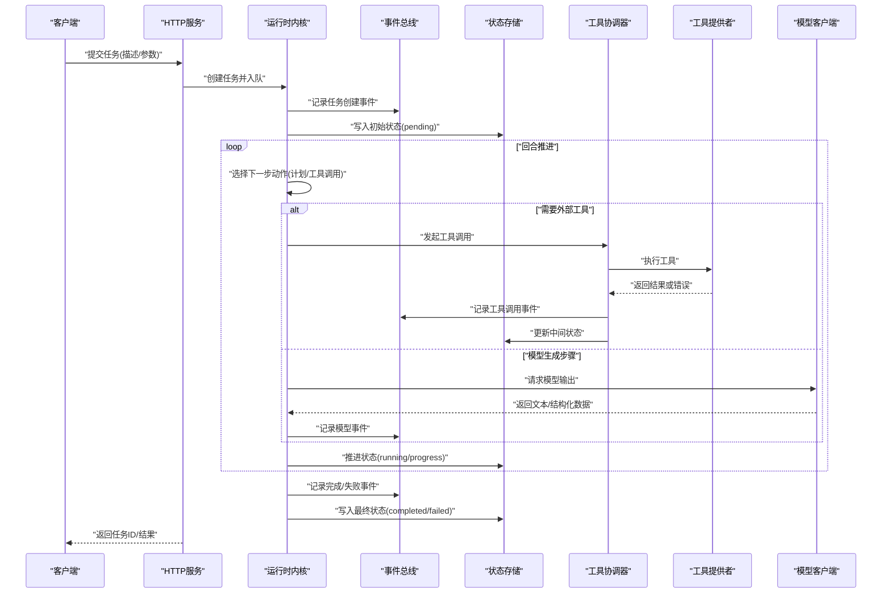
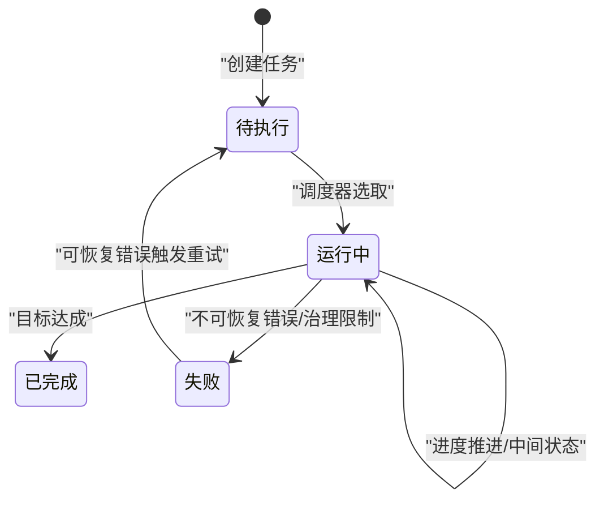
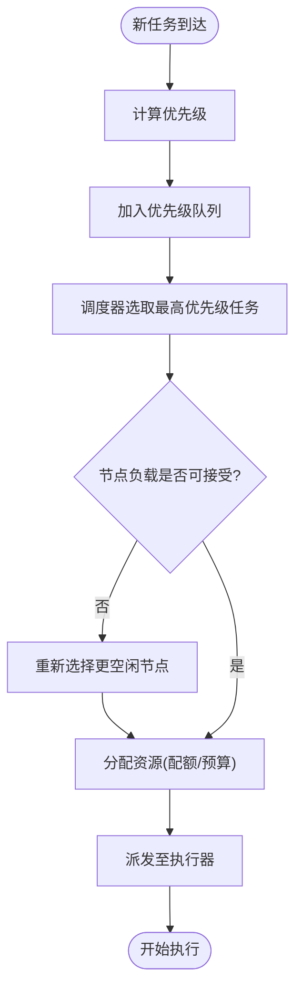
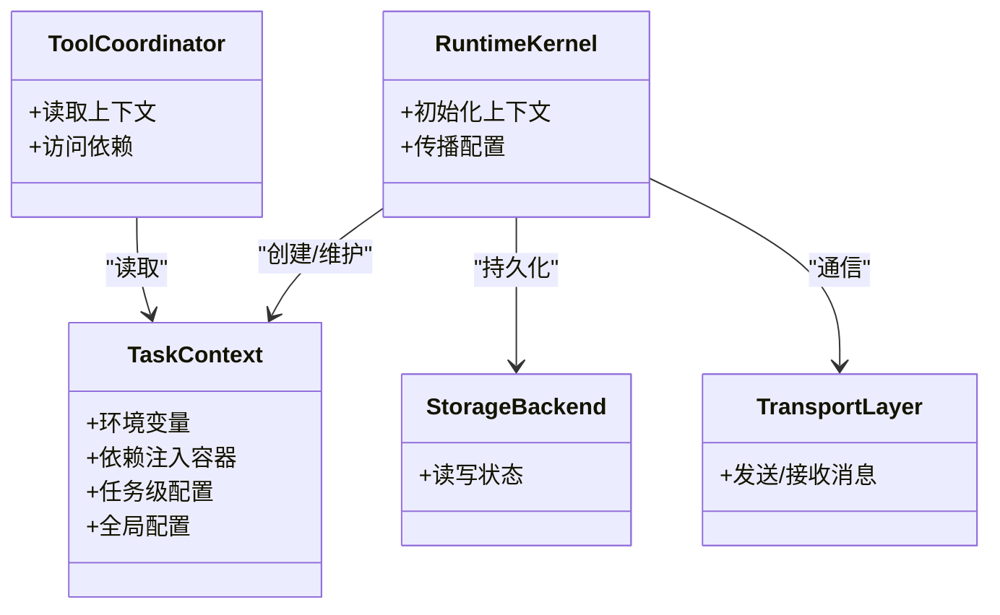
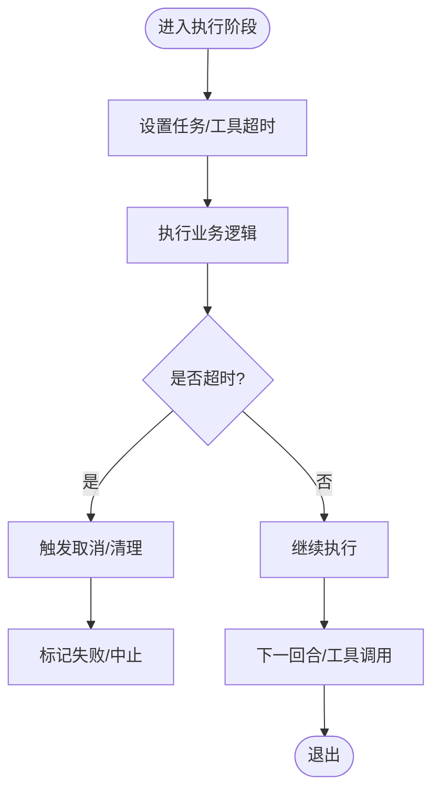
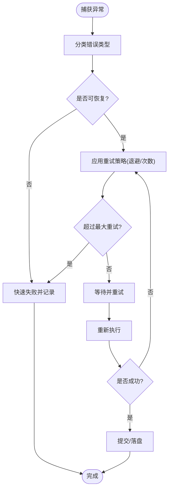
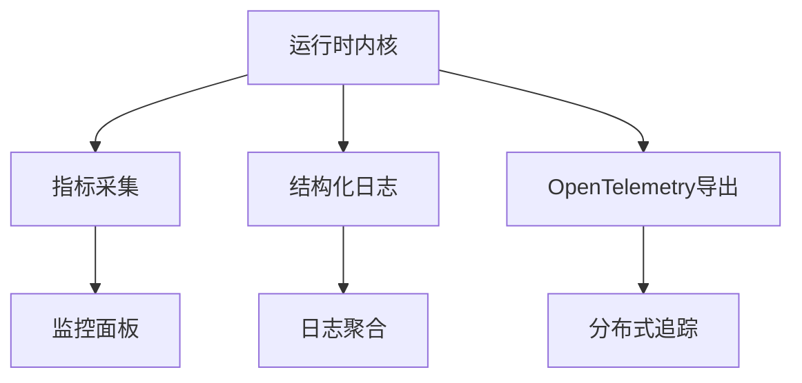
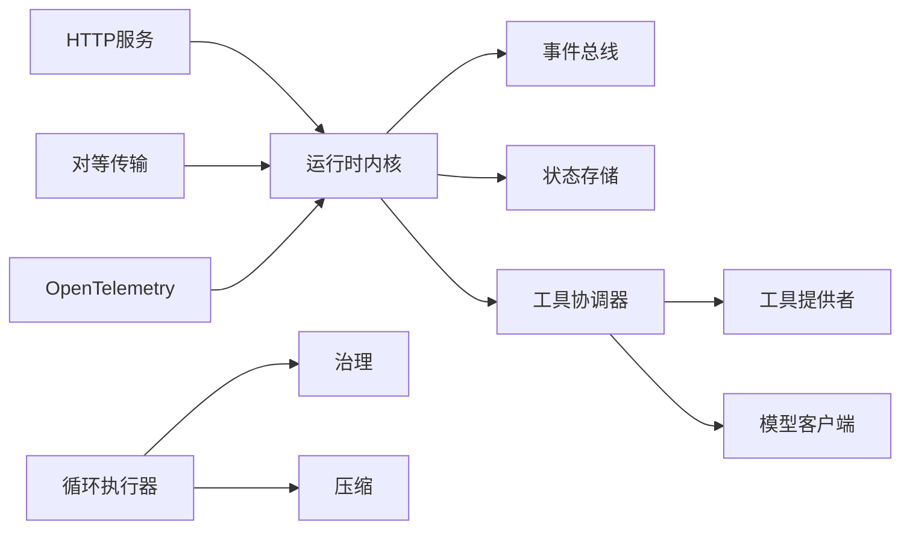

# 任务执行流程

<cite>
**本文引用的文件**   
- [engine/README.md](file://engine/README.md)
- [engine/package.json](file://engine/package.json)
- [engine/pnpm-workspace.yaml](file://engine/pnpm-workspace.yaml)
- [engine/tests/runtime-kernel.test.ts](file://engine/tests/runtime-kernel.test.ts)
- [engine/tests/runtime-kernel-e2e.test.ts](file://engine/tests/runtime-kernel-e2e.test.ts)
- [engine/tests/runtime-kernel-crash-recovery.test.ts](file://engine/tests/runtime-kernel-crash-recovery.test.ts)
- [engine/tests/runtime-kernel-contracts.test.ts](file://engine/tests/runtime-kernel-contracts.test.ts)
- [engine/tests/runtime-kernel-provider-matrix.test.ts](file://engine/tests/runtime-kernel-provider-matrix.test.ts)
- [engine/tests/runtime-kernel-isolation.test.ts](file://engine/tests/runtime-kernel-isolation.test.ts)
- [engine/tests/runtime-kernel-budget.test.ts](file://engine/tests/runtime-kernel-budget.test.ts)
- [engine/tests/runtime-kernel-parity.test.ts](file://engine/tests/runtime-kernel-parity.test.ts)
- [engine/tests/runtime-kernel-after-middleware.test.ts](file://engine/tests/runtime-kernel-after-middleware.test.ts)
- [engine/tests/runtime-kernel-replay.test.ts](file://engine/tests/runtime-kernel-replay.test.ts)
- [engine/tests/runtime-kernel-governance.test.ts](file://engine/tests/runtime-kernel-governance.test.ts)
- [engine/tests/tool-runtime-v3.test.ts](file://engine/tests/tool-runtime-v3.test.ts)
- [engine/tests/tool-dispatch-errors.test.ts](file://engine/tests/tool-dispatch-errors.test.ts)
- [engine/tests/tool-result-budget.test.ts](file://engine/tests/tool-result-budget.test.ts)
- [engine/tests/tool-coordinator-runtime.test.ts](file://engine/tests/tool-coordinator-runtime.test.ts)
- [engine/tests/tool-storm-breaker.test.ts](file://engine/tests/tool-storm-breaker.test.ts)
- [engine/tests/tool-call-repair.test.ts](file://engine/tests/tool-call-repair.test.ts)
- [engine/tests/execution-graph.test.ts](file://engine/tests/execution-graph.test.ts)
- [engine/tests/loop-runner.test.ts](file://engine/tests/loop-runner.test.ts)
- [engine/tests/loop-plan.test.ts](file://engine/tests/loop-plan.test.ts)
- [engine/tests/loop-policy.test.ts](file://engine/tests/loop-policy.test.ts)
- [engine/tests/loop-governor.test.ts](file://engine/tests/loop-governor.test.ts)
- [engine/tests/compaction-governor.test.ts](file://engine/tests/compaction-governor.test.ts)
- [engine/tests/context-compactor.test.ts](file://engine/tests/context-compactor.test.ts)
- [engine/tests/task-state-store.test.ts](file://engine/tests/task-state-store.test.ts)
- [engine/tests/task-context-recovery.test.ts](file://engine/tests/task-context-recovery.test.ts)
- [engine/tests/task-progress-projector.test.ts](file://engine/tests/task-progress-projector.test.ts)
- [engine/tests/task-state-builder.test.ts](file://engine/tests/task-state-contracts.test.ts)
- [engine/tests/durable-task-capsule.test.ts](file://engine/tests/durable-task-capsule.test.ts)
- [engine/tests/run-state-store.test.ts](file://engine/tests/run-state-store.test.ts)
- [engine/tests/run-event-store.test.ts](file://engine/tests/run-event-store.test.ts)
- [engine/tests/runtime-event-projection.test.ts](file://engine/tests/runtime-event-projection.test.ts)
- [engine/tests/runtime-event-recorder-kernel.test.ts](file://engine/tests/runtime-event-recorder-kernel.test.ts)
- [engine/tests/runtime-event-reducer.test.ts](file://engine/tests/runtime-event-reducer.test.ts)
- [engine/tests/evented-loop.test.ts](file://engine/tests/evented-loop.test.ts)
- [engine/tests/turn-state-store.test.ts](file://engine/tests/turn-state-store.test.ts)
- [engine/tests/turn-event-bus.test.ts](file://engine/tests/turn-event-bus.test.ts)
- [engine/tests/model-step-runner.test.ts](file://engine/tests/model-step-runner.test.ts)
- [engine/tests/delegation-runtime.test.ts](file://engine/tests/delegation-runtime.test.ts)
- [engine/tests/delegation-terminal-state.test.ts](file://engine/tests/delegation-terminal-state.test.ts)
- [engine/tests/skill-tool-provider.test.ts](file://engine/tests/skill-tool-provider.test.ts)
- [engine/tests/skill-command-registry.test.ts](file://engine/tests/skill-command-registry.test.ts)
- [engine/tests/skill-runtime.test.ts](file://engine/tests/skill-runtime.test.ts)
- [engine/tests/work-mode-skill-runtime.test.ts](file://engine/tests/work-mode-skill-runtime.test.ts)
- [engine/tests/mcp-tool-provider.test.ts](file://engine/tests/mcp-tool-provider.test.ts)
- [engine/tests/web-tool-provider.test.ts](file://engine/tests/web-tool-provider.test.ts)
- [engine/tests/http-peer-transport.test.ts](file://engine/tests/http-peer-transport.test.ts)
- [engine/tests/http-server.test.ts](file://engine/tests/http-server.test.ts)
- [engine/tests/http-artifacts.test.ts](file://engine/tests/http-artifacts.test.ts)
- [engine/tests/opentelemetry.test.ts](file://engine/tests/opentelemetry.test.ts)
- [engine/tests/file-session-store.test.ts](file://engine/tests/file-session-store.test.ts)
- [engine/tests/file-session-store-integration.test.ts](file://engine/tests/file-session-store-integration.test.ts)
- [engine/tests/hybrid-store.test.ts](file://engine/tests/hybrid-store.test.ts)
- [engine/tests/memory-store.test.ts](file://engine/tests/memory-store.test.ts)
- [engine/tests/cache.test.ts](file://engine/tests/cache.test.ts)
- [engine/tests/token-economy.test.ts](file://engine/tests/token-economy.test.ts)
- [engine/tests/usage-service.test.ts](file://engine/tests/usage-service.test.ts)
- [engine/tests/continuation-policy.test.ts](file://engine/tests/continuation-policy.test.ts)
- [engine/tests/legacy-task-state-migration.test.ts](file://engine/tests/legacy-task-state-migration.test.ts)
- [engine/tests/steering-queue-isolation.test.ts](file://engine/tests/steering-queue-isolation.test.ts)
- [engine/tests/virtual-path.test.ts](file://engine/tests/virtual-path.test.ts)
- [engine/tests/manifest.test.ts](file://engine/tests/manifest.test.ts)
- [engine/tests/capability-registry.test.ts](file://engine/tests/capability-registry.test.ts)
- [engine/tests/capabilities.test.ts](file://engine/tests/capabilities.test.ts)
- [engine/tests/provider-compatibility.test.ts](file://engine/tests/provider-compatibility.test.ts)
- [engine/tests/auto-model-router.test.ts](file://engine/tests/auto-model-router.test.ts)
- [engine/tests/model-client.test.ts](file://engine/tests/model-client.test.ts)
- [engine/tests/model-history-repair.test.ts](file://engine/tests/model-history-repair.test.ts)
- [engine/tests/model-proposal.test.ts](file://engine/tests/model-protocol-normalizer.test.ts)
- [engine/tests/finance-credentials.test.ts](file://engine/tests/finance-credentials.test.ts)
- [engine/tests/qiongqi-config.test.ts](file://engine/tests/qiongqi-config.test.ts)
- [engine/tests/builtin-tools.test.ts](file://engine/tests/builtin-tools.test.ts)
- [engine/tests/builtin-tool-utils.test.ts](file://engine/tests/builtin-tool-utils.test.ts)
- [engine/tests/goal-tools.test.ts](file://engine/tests/goal-tools.test.ts)
- [engine/tests/todo-tools.test.ts](file://engine/tests/todo-tools.test.ts)
- [engine/tests/review.test.ts](file://engine/tests/review.test.ts)
- [engine/tests/create-plan-tool.test.ts](file://engine/tests/create-plan-tool.test.ts)
- [engine/tests/child-agent-executor.test.ts](file://engine/tests/child-agent-executor.test.ts)
- [engine/tests/agent-cli.test.ts](file://engine/tests/agent-cli.test.ts)
- [engine/tests/cli-agent.test.ts](file://engine/tests/cli-agent.test.ts)
- [engine/tests/serve.test.ts](file://engine/tests/serve.test.ts)
- [engine/tests/plugin-host.test.ts](file://engine/tests/plugin-host.test.ts)
- [engine/tests/ports.test.ts](file://engine/tests/ports.test.ts)
- [engine/tests/domain.test.ts](file://engine/tests/domain.test.ts)
- [engine/tests/contracts.test.ts](file://engine/tests/contracts.test.ts)
- [engine/tests/output-accumulator.test.ts](file://engine/tests/output-accumulator.test.ts)
- [engine/tests/completion-transaction.test.ts](file://engine/tests/compaction-transaction.test.ts)
- [engine/tests/atomic-write.test.ts](file://engine/tests/atomic-write.test.ts)
- [engine/tests/file-mutation-queue.test.ts](file://engine/tests/file-mutation-queue.test.ts)
- [engine/tests/read-json-body.test.ts](file://engine/tests/read-json-body.test.ts)
- [engine/tests/request-history-hygiene.test.ts](file://engine/tests/request-history-hygiene.test.ts)
- [engine/tests/loop-evaluator.test.ts](file://engine/tests/loop-evaluator.test.ts)
- [engine/tests/proposal-classifier.test.ts](file://engine/tests/proposal-classifier.test.ts)
- [engine/tests/memory-retrieval.test.ts](file://engine/tests/memory-retrieval.test.ts)
- [engine/tests/thread-service.test.ts](file://engine/tests/thread-service.test.ts)
- [engine/tests/scope-key.test.ts](file://engine/tests/scope-key.test.ts)
- [engine/tests/verify-evented-a2a-script.test.ts](file://engine/tests/verify-evented-a2a-script.test.ts)
- [engine/tests/verify-core-sync.mjs](file://engine/scripts/verify-core-sync.mjs)
- [engine/scripts/build.mjs](file://engine/scripts/build.mjs)
- [engine/scripts/flatten-dist.mjs](file://engine/scripts/flatten-dist.mjs)
- [engine/scripts/migrate-packages.mjs](file://engine/scripts/migrate-packages.mjs)
- [engine/scripts/migrate-tests.mjs](file://engine/scripts/migrate-tests.mjs)
- [engine/scripts/prepare-sqlite.mjs](file://engine/scripts/prepare-sqlite.mjs)
- [engine/scripts/transcript-diff.mjs](file://engine/scripts/transcript-diff.mjs)
- [engine/scripts/verify-crash-recovery.mjs](file://engine/scripts/verify-crash-recovery.mjs)
- [engine/scripts/verify-evented-a2a.mjs](file://engine/scripts/verify-evented-a2a.mjs)
- [engine/scripts/verify-sqlite.mjs](file://engine/scripts/verify-sqlite.mjs)
</cite>

## 目录
1. [简介](#简介)
2. [项目结构](#项目结构)
3. [核心组件](#核心组件)
4. [架构总览](#架构总览)
5. [详细组件分析](#详细组件分析)
6. [依赖分析](#依赖分析)
7. [性能考量](#性能考量)
8. [故障排查指南](#故障排查指南)
9. [结论](#结论)
10. [附录](#附录)

## 简介
本技术文档聚焦于KCoder引擎的任务执行流程，围绕“任务创建—序列化—分发—执行—结果返回”的完整生命周期展开。文档同时覆盖调度算法（优先级队列、负载均衡与资源分配）、状态机（pending/running/completed/failed等）、上下文管理（环境变量、依赖注入、配置传递）、超时与取消机制、监控与日志、错误恢复与重试策略，并给出自定义任务的创建与执行示例路径，帮助读者快速理解与扩展系统能力。

## 项目结构
KCoder采用多包工作区组织，核心引擎位于 engine/packages 下，测试与脚本位于 engine/tests 与 engine/scripts。从测试与脚本可推断出以下关键子系统：
- 运行时内核与事件总线：负责任务编排、回合推进、事件投影与还原
- 工具协调器与运行时代码：负责工具调用、错误处理、预算控制与风暴保护
- 持久化与存储：任务状态、运行事件、会话与缓存
- 传输与服务：HTTP服务、对等传输、插件宿主
- 模型与能力：模型客户端、自动路由、协议归一化、能力注册表
- 技能与工作模式：技能运行时、命令注册、MCP桥接
- 治理与策略：循环治理、上下文压缩、续跑策略、配额与用量

图表来源
- [engine/tests/runtime-kernel.test.ts](file://engine/tests/runtime-kernel.test.ts)
- [engine/tests/tool-coordinator-runtime.test.ts](file://engine/tests/tool-coordinator-runtime.test.ts)
- [engine/tests/loop-runner.test.ts](file://engine/tests/loop-runner.test.ts)
- [engine/tests/run-state-store.test.ts](file://engine/tests/run-state-store.test.ts)
- [engine/tests/task-state-store.test.ts](file://engine/tests/task-state-store.test.ts)
- [engine/tests/file-session-store.test.ts](file://engine/tests/file-session-store.test.ts)
- [engine/tests/hybrid-store.test.ts](file://engine/tests/hybrid-store.test.ts)
- [engine/tests/http-server.test.ts](file://engine/tests/http-server.test.ts)
- [engine/tests/http-peer-transport.test.ts](file://engine/tests/http-peer-transport.test.ts)
- [engine/tests/context-compactor.test.ts](file://engine/tests/context-compactor.test.ts)
- [engine/tests/loop-governor.test.ts](file://engine/tests/loop-governor.test.ts)
- [engine/tests/token-economy.test.ts](file://engine/tests/token-economy.test.ts)
- [engine/tests/usage-service.test.ts](file://engine/tests/usage-service.test.ts)

章节来源
- [engine/README.md](file://engine/README.md)
- [engine/package.json](file://engine/package.json)
- [engine/pnpm-workspace.yaml](file://engine/pnpm-workspace.yaml)

## 核心组件
- 运行时内核（RuntimeKernel）：任务编排中心，驱动回合推进、事件记录、状态更新与异常恢复。
- 事件总线（TurnEventBus）：基于事件的协作机制，支持投影与回放，保证可观测性与可恢复性。
- 状态存储（RunStateStore/TaskStateStore）：持久化任务与运行状态，提供快照与增量事件。
- 工具协调器（ToolCoordinator）：统一工具调用入口，负责参数校验、错误处理、预算与风暴保护。
- 循环执行器（LoopRunner）：实现“计划—执行—评估—继续/终止”的闭环，集成治理与压缩策略。
- 存储后端（FileSessionStore/HybridStore）：文件与内存/混合存储，兼顾性能与持久化。
- HTTP服务与对等传输（HttpServer/HttpPeerTransport）：对外暴露API与跨进程通信。
- 模型客户端与自动路由（ModelClient/AutoModelRouter）：抽象模型调用，支持多提供商与协议归一化。
- 能力注册表（CapabilityRegistry）：动态发现与注册能力，支撑插件化扩展。
- 治理与策略（LoopGovernor/Compactor/Budget）：控制循环次数、上下文大小、令牌与费用上限。

章节来源
- [engine/tests/runtime-kernel.test.ts](file://engine/tests/runtime-kernel.test.ts)
- [engine/tests/tool-coordinator-runtime.test.ts](file://engine/tests/tool-coordinator-runtime.test.ts)
- [engine/tests/loop-runner.test.ts](file://engine/tests/loop-runner.test.ts)
- [engine/tests/run-state-store.test.ts](file://engine/tests/run-state-store.test.ts)
- [engine/tests/task-state-store.test.ts](file://engine/tests/task-state-store.test.ts)
- [engine/tests/file-session-store.test.ts](file://engine/tests/file-session-store.test.ts)
- [engine/tests/hybrid-store.test.ts](file://engine/tests/hybrid-store.test.ts)
- [engine/tests/http-server.test.ts](file://engine/tests/http-server.test.ts)
- [engine/tests/http-peer-transport.test.ts](file://engine/tests/http-peer-transport.test.ts)
- [engine/tests/model-client.test.ts](file://engine/tests/model-client.test.ts)
- [engine/tests/auto-model-router.test.ts](file://engine/tests/auto-model-router.test.ts)
- [engine/tests/capability-registry.test.ts](file://engine/tests/capability-registry.test.ts)
- [engine/tests/loop-governor.test.ts](file://engine/tests/loop-governor.test.ts)
- [engine/tests/context-compactor.test.ts](file://engine/tests/context-compactor.test.ts)
- [engine/tests/token-economy.test.ts](file://engine/tests/token-economy.test.ts)
- [engine/tests/usage-service.test.ts](file://engine/tests/usage-service.test.ts)

## 架构总览
下图展示任务从创建到完成的关键交互路径，包括事件记录、状态迁移、工具调用与结果回写。

图表来源
- [engine/tests/http-server.test.ts](file://engine/tests/http-server.test.ts)
- [engine/tests/runtime-kernel.test.ts](file://engine/tests/runtime-kernel.test.ts)
- [engine/tests/tool-coordinator-runtime.test.ts](file://engine/tests/tool-coordinator-runtime.test.ts)
- [engine/tests/run-state-store.test.ts](file://engine/tests/run-state-store.test.ts)
- [engine/tests/task-state-store.test.ts](file://engine/tests/task-state-store.test.ts)
- [engine/tests/model-client.test.ts](file://engine/tests/model-client.test.ts)

## 详细组件分析

### 任务生命周期与状态机
- 状态定义
  - pending：任务已创建，等待调度
  - running：正在执行中（可能包含多个子回合）
  - completed：成功结束
  - failed：失败结束（含可恢复与不可恢复）
- 转换条件
  - pending → running：调度器选取任务并开始首个回合
  - running → completed：所有目标达成且无待处理副作用
  - running → failed：出现不可恢复错误或达到治理限制
  - running → running：进度推进、中间状态更新
- 持久化与回放
  - 通过事件记录与状态快照，支持崩溃恢复与重放

图表来源
- [engine/tests/task-state-store.test.ts](file://engine/tests/task-state-store.test.ts)
- [engine/tests/run-state-store.test.ts](file://engine/tests/run-state-store.test.ts)
- [engine/tests/runtime-kernel.test.ts](file://engine/tests/runtime-kernel.test.ts)

章节来源
- [engine/tests/task-state-store.test.ts](file://engine/tests/task-state-store.test.ts)
- [engine/tests/run-state-store.test.ts](file://engine/tests/run-state-store.test.ts)
- [engine/tests/runtime-kernel.test.ts](file://engine/tests/runtime-kernel.test.ts)

### 任务调度算法（优先级队列、负载均衡、资源分配）
- 优先级队列
  - 依据任务元信息（如SLA、用户等级、资源需求）计算优先级
  - 高优先级任务优先入队与出队
- 负载均衡
  - 按工作节点负载（CPU/IO/并发度）进行软均衡
  - 避免热点节点过载，支持动态扩缩容
- 资源分配
  - 为任务分配最小必要资源，结合预算与配额控制
  - 超限时触发降级或排队

图表来源
- [engine/tests/runtime-kernel.test.ts](file://engine/tests/runtime-kernel.test.ts)
- [engine/tests/loop-runner.test.ts](file://engine/tests/loop-runner.test.ts)
- [engine/tests/token-economy.test.ts](file://engine/tests/token-economy.test.ts)

章节来源
- [engine/tests/runtime-kernel.test.ts](file://engine/tests/runtime-kernel.test.ts)
- [engine/tests/loop-runner.test.ts](file://engine/tests/loop-runner.test.ts)
- [engine/tests/token-economy.test.ts](file://engine/tests/token-economy.test.ts)

### 上下文管理（环境变量、依赖注入、配置传递）
- 环境变量
  - 在任务启动时注入系统与环境变量，供工具与模型调用使用
- 依赖注入
  - 通过容器或服务定位器将存储、传输、能力注册表等注入到各组件
- 配置传递
  - 任务级配置（超时、预算、策略）与全局配置（模型、网关、存储）分层传递

图表来源
- [engine/tests/runtime-kernel.test.ts](file://engine/tests/runtime-kernel.test.ts)
- [engine/tests/tool-coordinator-runtime.test.ts](file://engine/tests/tool-coordinator-runtime.test.ts)
- [engine/tests/file-session-store.test.ts](file://engine/tests/file-session-store.test.ts)
- [engine/tests/http-peer-transport.test.ts](file://engine/tests/http-peer-transport.test.ts)

章节来源
- [engine/tests/runtime-kernel.test.ts](file://engine/tests/runtime-kernel.test.ts)
- [engine/tests/tool-coordinator-runtime.test.ts](file://engine/tests/tool-coordinator-runtime.test.ts)
- [engine/tests/file-session-store.test.ts](file://engine/tests/file-session-store.test.ts)
- [engine/tests/http-peer-transport.test.ts](file://engine/tests/http-peer-transport.test.ts)

### 超时控制与取消机制
- 超时控制
  - 任务级与工具级双重超时，防止长尾阻塞
  - 超时触发清理与回滚，确保状态一致性
- 取消机制
  - 支持主动取消，中断当前回合与未决I/O
  - 取消后进入失败或中止分支，记录审计事件

图表来源
- [engine/tests/runtime-kernel.test.ts](file://engine/tests/runtime-kernel.test.ts)
- [engine/tests/tool-coordinator-runtime.test.ts](file://engine/tests/tool-coordinator-runtime.test.ts)

章节来源
- [engine/tests/runtime-kernel.test.ts](file://engine/tests/runtime-kernel.test.ts)
- [engine/tests/tool-coordinator-runtime.test.ts](file://engine/tests/tool-coordinator-runtime.test.ts)

### 错误恢复与重试策略
- 错误分类
  - 可恢复错误（网络抖动、限流、临时失败）
  - 不可恢复错误（参数非法、权限不足、业务约束违反）
- 重试策略
  - 指数退避与抖动，限制最大重试次数
  - 针对特定错误码/异常类型差异化处理
- 补偿与回滚
  - 对副作用操作进行幂等与补偿，保证最终一致性

图表来源
- [engine/tests/tool-dispatch-errors.test.ts](file://engine/tests/tool-dispatch-errors.test.ts)
- [engine/tests/tool-coordinator-runtime.test.ts](file://engine/tests/tool-coordinator-runtime.test.ts)
- [engine/tests/runtime-kernel-crash-recovery.test.ts](file://engine/tests/runtime-kernel-crash-recovery.test.ts)

章节来源
- [engine/tests/tool-dispatch-errors.test.ts](file://engine/tests/tool-dispatch-errors.test.ts)
- [engine/tests/tool-coordinator-runtime.test.ts](file://engine/tests/tool-coordinator-runtime.test.ts)
- [engine/tests/runtime-kernel-crash-recovery.test.ts](file://engine/tests/runtime-kernel-crash-recovery.test.ts)

### 监控指标与日志记录方案
- 指标
  - 任务数量、成功率、平均耗时、P95/P99延迟、重试次数、预算消耗
- 日志
  - 结构化事件日志（创建、调度、工具调用、模型请求、完成/失败）
  - 追踪ID贯穿全链路，便于问题定位
- 可观测性
  - 集成OpenTelemetry，导出指标与追踪

图表来源
- [engine/tests/opentelemetry.test.ts](file://engine/tests/opentelemetry.test.ts)
- [engine/tests/runtime-kernel.test.ts](file://engine/tests/runtime-kernel.test.ts)
- [engine/tests/usage-service.test.ts](file://engine/tests/usage-service.test.ts)

章节来源
- [engine/tests/opentelemetry.test.ts](file://engine/tests/opentelemetry.test.ts)
- [engine/tests/runtime-kernel.test.ts](file://engine/tests/runtime-kernel.test.ts)
- [engine/tests/usage-service.test.ts](file://engine/tests/usage-service.test.ts)

### 自定义任务：创建与执行示例
- 自定义工具提供者
  - 参考路径：[skill-tool-provider.test.ts](file://engine/tests/skill-tool-provider.test.ts)、[mcp-tool-provider.test.ts](file://engine/tests/mcp-tool-provider.test.ts)、[web-tool-provider.test.ts](file://engine/tests/web-tool-provider.test.ts)
- 自定义循环策略与治理
  - 参考路径：[loop-runner.test.ts](file://engine/tests/loop-runner.test.ts)、[loop-policy.test.ts](file://engine/tests/loop-policy.test.ts)、[loop-governor.test.ts](file://engine/tests/loop-governor.test.ts)
- 自定义存储与传输
  - 参考路径：[file-session-store.test.ts](file://engine/tests/file-session-store.test.ts)、[hybrid-store.test.ts](file://engine/tests/hybrid-store.test.ts)、[http-peer-transport.test.ts](file://engine/tests/http-peer-transport.test.ts)
- 端到端集成
  - 参考路径：[runtime-kernel-e2e.test.ts](file://engine/tests/runtime-kernel-e2e.test.ts)、[tool-runtime-v3.test.ts](file://engine/tests/tool-runtime-v3.test.ts)

章节来源
- [engine/tests/skill-tool-provider.test.ts](file://engine/tests/skill-tool-provider.test.ts)
- [engine/tests/mcp-tool-provider.test.ts](file://engine/tests/mcp-tool-provider.test.ts)
- [engine/tests/web-tool-provider.test.ts](file://engine/tests/web-tool-provider.test.ts)
- [engine/tests/loop-runner.test.ts](file://engine/tests/loop-runner.test.ts)
- [engine/tests/loop-policy.test.ts](file://engine/tests/loop-policy.test.ts)
- [engine/tests/loop-governor.test.ts](file://engine/tests/loop-governor.test.ts)
- [engine/tests/file-session-store.test.ts](file://engine/tests/file-session-store.test.ts)
- [engine/tests/hybrid-store.test.ts](file://engine/tests/hybrid-store.test.ts)
- [engine/tests/http-peer-transport.test.ts](file://engine/tests/http-peer-transport.test.ts)
- [engine/tests/runtime-kernel-e2e.test.ts](file://engine/tests/runtime-kernel-e2e.test.ts)
- [engine/tests/tool-runtime-v3.test.ts](file://engine/tests/tool-runtime-v3.test.ts)

## 依赖分析
- 组件耦合
  - 运行时内核强依赖事件总线与状态存储；工具协调器依赖工具提供者与模型客户端
  - 循环执行器依赖治理与压缩组件，形成“执行—治理—压缩”闭环
- 外部依赖
  - HTTP服务与对等传输用于跨进程/跨主机通信
  - OpenTelemetry用于可观测性
- 潜在循环依赖
  - 通过接口抽象与依赖注入解耦，降低循环风险

图表来源
- [engine/tests/runtime-kernel.test.ts](file://engine/tests/runtime-kernel.test.ts)
- [engine/tests/tool-coordinator-runtime.test.ts](file://engine/tests/tool-coordinator-runtime.test.ts)
- [engine/tests/loop-runner.test.ts](file://engine/tests/loop-runner.test.ts)
- [engine/tests/http-server.test.ts](file://engine/tests/http-server.test.ts)
- [engine/tests/http-peer-transport.test.ts](file://engine/tests/http-peer-transport.test.ts)
- [engine/tests/opentelemetry.test.ts](file://engine/tests/opentelemetry.test.ts)

章节来源
- [engine/tests/runtime-kernel.test.ts](file://engine/tests/runtime-kernel.test.ts)
- [engine/tests/tool-coordinator-runtime.test.ts](file://engine/tests/tool-coordinator-runtime.test.ts)
- [engine/tests/loop-runner.test.ts](file://engine/tests/loop-runner.test.ts)
- [engine/tests/http-server.test.ts](file://engine/tests/http-server.test.ts)
- [engine/tests/http-peer-transport.test.ts](file://engine/tests/http-peer-transport.test.ts)
- [engine/tests/opentelemetry.test.ts](file://engine/tests/opentelemetry.test.ts)

## 性能考量
- 批处理与合并：批量写入状态与事件，减少I/O开销
- 异步与非阻塞：I/O与模型调用尽量异步，避免阻塞主循环
- 上下文压缩：及时压缩历史，控制上下文大小，降低模型成本与延迟
- 预算与配额：严格限制令牌与费用，防止超额消费
- 缓存与复用：对频繁查询的结果进行缓存，提升命中率

章节来源
- [engine/tests/context-compactor.test.ts](file://engine/tests/context-compactor.test.ts)
- [engine/tests/token-economy.test.ts](file://engine/tests/token-economy.test.ts)
- [engine/tests/cache.test.ts](file://engine/tests/cache.test.ts)

## 故障排查指南
- 常见问题
  - 任务卡住：检查超时与取消逻辑、工具调用是否阻塞
  - 状态不一致：核对事件记录与状态快照的一致性
  - 预算超限：查看用量服务与预算策略配置
  - 模型调用失败：检查模型客户端与自动路由配置
- 诊断手段
  - 启用OpenTelemetry追踪，定位慢点与错误路径
  - 查看结构化日志，过滤任务ID与事件类型
  - 回放事件，复现问题场景

章节来源
- [engine/tests/opentelemetry.test.ts](file://engine/tests/opentelemetry.test.ts)
- [engine/tests/runtime-kernel-crash-recovery.test.ts](file://engine/tests/runtime-kernel-crash-recovery.test.ts)
- [engine/tests/usage-service.test.ts](file://engine/tests/usage-service.test.ts)
- [engine/tests/model-client.test.ts](file://engine/tests/model-client.test.ts)

## 结论
KCoder的任务执行流程以运行时内核为中心，通过事件驱动与状态持久化实现高可靠与可恢复性。调度算法结合优先级、负载均衡与资源配额，保障吞吐与公平性。上下文管理与治理策略确保系统在复杂环境下稳定运行。完善的监控与日志体系为问题定位与性能优化提供了坚实基础。

## 附录
- 构建与脚本
  - 构建与打包：[build.mjs](file://engine/scripts/build.mjs)、[flatten-dist.mjs](file://engine/scripts/flatten-dist.mjs)
  - 迁移与验证：[migrate-packages.mjs](file://engine/scripts/migrate-packages.mjs)、[verify-core-sync.mjs](file://engine/scripts/verify-core-sync.mjs)、[verify-crash-recovery.mjs](file://engine/scripts/verify-crash-recovery.mjs)
- 工作区与配置
  - 工作区定义：[pnpm-workspace.yaml](file://engine/pnpm-workspace.yaml)
  - 包清单：[package.json](file://engine/package.json)

章节来源
- [engine/scripts/build.mjs](file://engine/scripts/build.mjs)
- [engine/scripts/flatten-dist.mjs](file://engine/scripts/flatten-dist.mjs)
- [engine/scripts/migrate-packages.mjs](file://engine/scripts/migrate-packages.mjs)
- [engine/scripts/verify-core-sync.mjs](file://engine/scripts/verify-core-sync.mjs)
- [engine/scripts/verify-crash-recovery.mjs](file://engine/scripts/verify-crash-recovery.mjs)
- [engine/pnpm-workspace.yaml](file://engine/pnpm-workspace.yaml)
- [engine/package.json](file://engine/package.json)