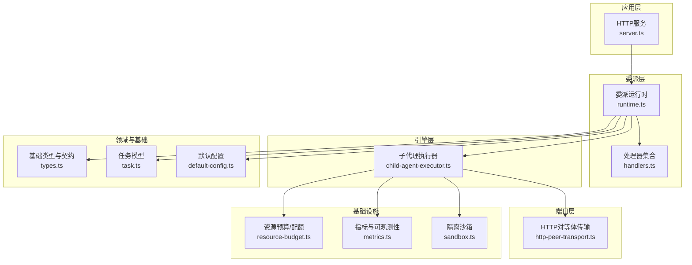
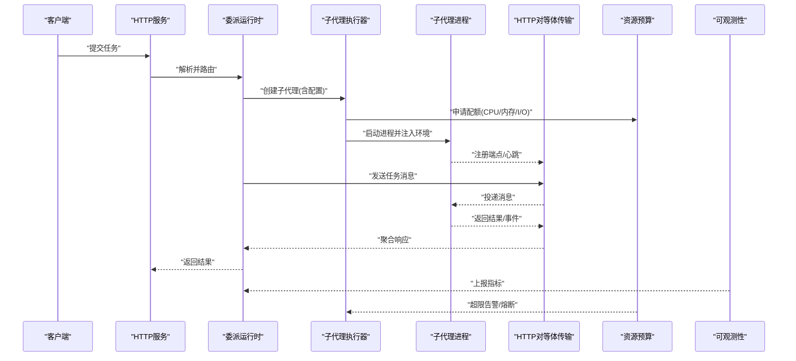
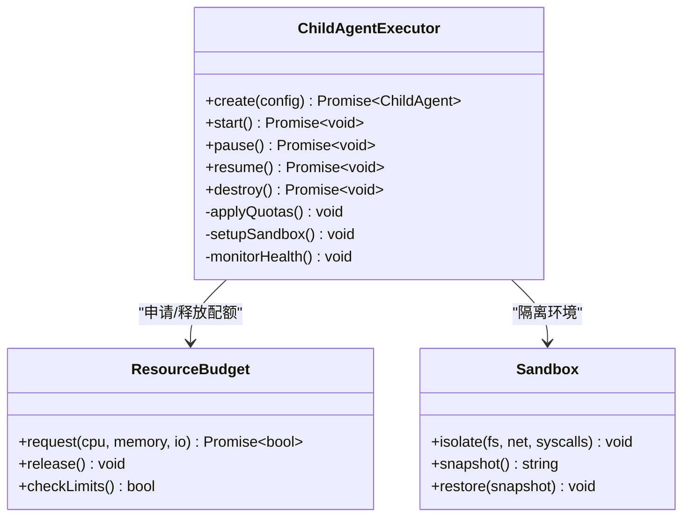
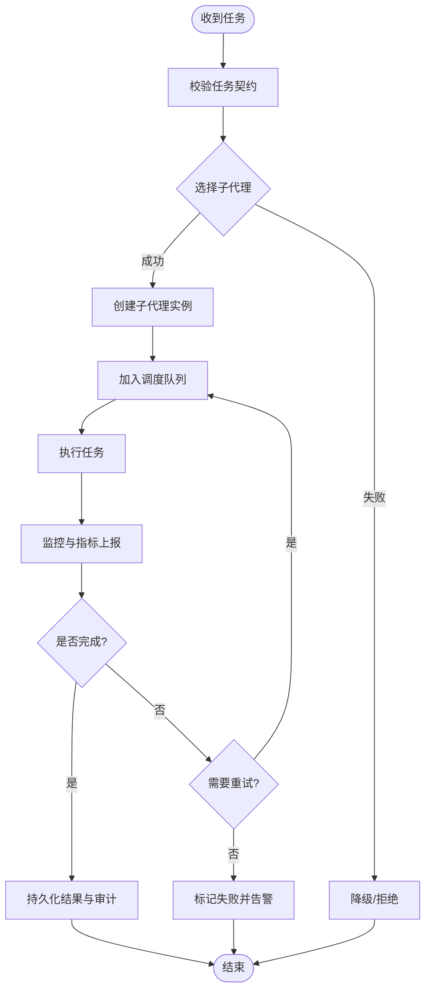
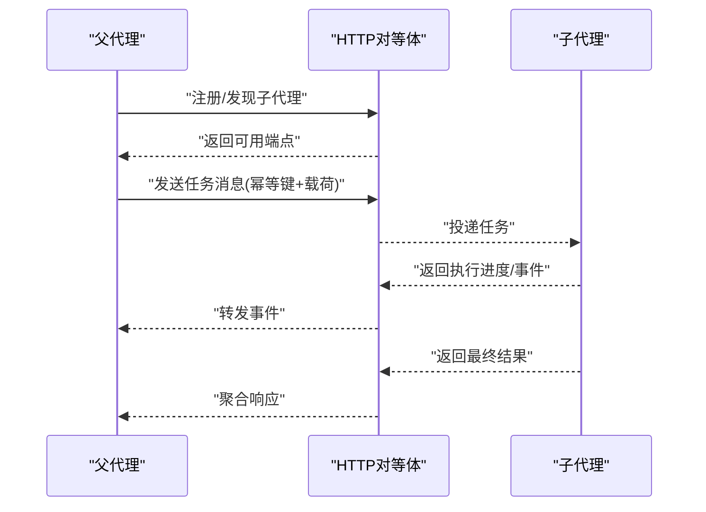
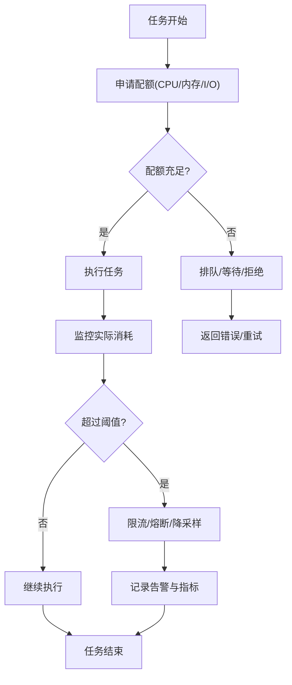
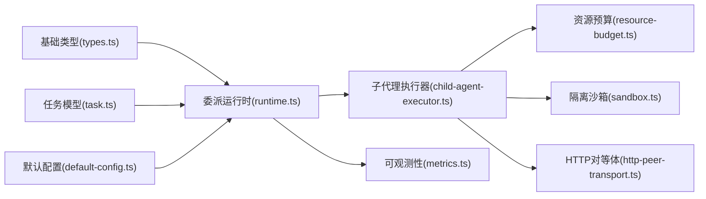

# 子代理管理

<cite>
**本文引用的文件**   
- [engine/packages/engine/src/child-agent-executor.ts](file://engine/packages/engine/src/child-agent-executor.ts)
- [engine/tests/child-agent-executor.test.ts](file://engine/tests/child-agent-executor.test.ts)
- [engine/packages/delegation-layer/src/runtime.ts](file://engine/packages/delegation-layer/src/runtime.ts)
- [engine/packages/delegation-layer/src/handlers.ts](file://engine/packages/delegation-layer/src/handlers.ts)
- [engine/packages/http-layer/src/server.ts](file://engine/packages/http-layer/src/server.ts)
- [engine/packages/foundation/src/types.ts](file://engine/packages/foundation/src/types.ts)
- [engine/packages/domain-layer/src/models/task.ts](file://engine/packages/domain-layer/src/models/task.ts)
- [engine/packages/ports-layer/src/transport/http-peer-transport.ts](file://engine/packages/ports-layer/src/transport/http-peer-transport.ts)
- [engine/packages/infrastructure/src/budget/resource-budget.ts](file://engine/packages/infrastructure/src/budget/resource-budget.ts)
- [engine/packages/infrastructure/src/observability/metrics.ts](file://engine/packages/infrastructure/src/observability/metrics.ts)
- [engine/packages/infrastructure/src/isolation/sandbox.ts](file://engine/packages/infrastructure/src/isolation/sandbox.ts)
- [engine/packages/presets/src/default-config.ts](file://engine/packages/presets/src/default-config.ts)
</cite>

## 目录
1. [简介](#简介)
2. [项目结构](#项目结构)
3. [核心组件](#核心组件)
4. [架构总览](#架构总览)
5. [详细组件分析](#详细组件分析)
6. [依赖关系分析](#依赖关系分析)
7. [性能考量](#性能考量)
8. [故障排查指南](#故障排查指南)
9. [结论](#结论)
10. [附录：API与配置](#附录api与配置)

## 简介
本技术文档围绕KCoder引擎中的“子代理管理系统”展开，聚焦以下目标：
- 子代理的创建机制：实例初始化、资源分配与环境隔离
- 生命周期管理：启动、运行、暂停、恢复、销毁
- 通信协议：父子代理间的数据交换格式与消息传递机制
- 资源限制与配额：CPU、内存、I/O控制策略
- 监控与健康检查：指标采集、健康探针、告警
- 错误处理与异常恢复：重试、熔断、回滚、状态持久化
- 配置项与扩展点：可插拔能力、默认配置、自定义接入
- API接口与使用示例：面向上层调用的稳定契约

## 项目结构
子代理管理相关代码主要分布在以下包中：
- engine/packages/engine：子代理执行器（进程/沙箱级）
- engine/packages/delegation-layer：委派运行时与处理器（任务编排、调度）
- engine/packages/http-layer：HTTP服务与对外暴露的API
- engine/packages/foundation：基础类型与契约定义
- engine/packages/domain-layer：领域模型（任务、会话等）
- engine/packages/ports-layer：传输层抽象与HTTP对等体实现
- engine/packages/infrastructure：基础设施（预算/配额、可观测性、隔离沙箱）
- engine/packages/presets：默认配置与预设

图表来源
- [engine/packages/http-layer/src/server.ts](file://engine/packages/http-layer/src/server.ts)
- [engine/packages/delegation-layer/src/runtime.ts](file://engine/packages/delegation-layer/src/runtime.ts)
- [engine/packages/delegation-layer/src/handlers.ts](file://engine/packages/delegation-layer/src/handlers.ts)
- [engine/packages/engine/src/child-agent-executor.ts](file://engine/packages/engine/src/child-agent-executor.ts)
- [engine/packages/ports-layer/src/transport/http-peer-transport.ts](file://engine/packages/ports-layer/src/transport/http-peer-transport.ts)
- [engine/packages/infrastructure/src/budget/resource-budget.ts](file://engine/packages/infrastructure/src/budget/resource-budget.ts)
- [engine/packages/infrastructure/src/observability/metrics.ts](file://engine/packages/infrastructure/src/observability/metrics.ts)
- [engine/packages/infrastructure/src/isolation/sandbox.ts](file://engine/packages/infrastructure/src/isolation/sandbox.ts)
- [engine/packages/foundation/src/types.ts](file://engine/packages/foundation/src/types.ts)
- [engine/packages/domain-layer/src/models/task.ts](file://engine/packages/domain-layer/src/models/task.ts)
- [engine/packages/presets/src/default-config.ts](file://engine/packages/presets/src/default-config.ts)

章节来源
- [engine/packages/engine/src/child-agent-executor.ts](file://engine/packages/engine/src/child-agent-executor.ts)
- [engine/packages/delegation-layer/src/runtime.ts](file://engine/packages/delegation-layer/src/runtime.ts)
- [engine/packages/http-layer/src/server.ts](file://engine/packages/http-layer/src/server.ts)
- [engine/packages/foundation/src/types.ts](file://engine/packages/foundation/src/types.ts)
- [engine/packages/domain-layer/src/models/task.ts](file://engine/packages/domain-layer/src/models/task.ts)
- [engine/packages/ports-layer/src/transport/http-peer-transport.ts](file://engine/packages/ports-layer/src/transport/http-peer-transport.ts)
- [engine/packages/infrastructure/src/budget/resource-budget.ts](file://engine/packages/infrastructure/src/budget/resource-budget.ts)
- [engine/packages/infrastructure/src/observability/metrics.ts](file://engine/packages/infrastructure/src/observability/metrics.ts)
- [engine/packages/infrastructure/src/isolation/sandbox.ts](file://engine/packages/infrastructure/src/isolation/sandbox.ts)
- [engine/packages/presets/src/default-config.ts](file://engine/packages/presets/src/default-config.ts)

## 核心组件
- 子代理执行器：负责子代理进程的创建、环境准备、资源配额注入、生命周期管理与结果回收。
- 委派运行时：将父代理的任务分解为子代理任务，进行路由、编排与状态同步。
- 传输层（HTTP对等体）：定义父子代理间的消息协议、序列化/反序列化、超时与重试策略。
- 资源预算模块：提供CPU、内存、I/O配额与限流策略，并在执行期动态调整。
- 可观测性模块：采集指标、追踪上下文、健康探针与日志上报。
- 隔离沙箱：文件系统、网络、系统调用等资源的隔离边界。
- 基础类型与领域模型：统一契约、任务实体、事件与状态机定义。
- 默认配置：预置的配额、超时、重试、并发度等参数。

章节来源
- [engine/packages/engine/src/child-agent-executor.ts](file://engine/packages/engine/src/child-agent-executor.ts)
- [engine/packages/delegation-layer/src/runtime.ts](file://engine/packages/delegation-layer/src/runtime.ts)
- [engine/packages/ports-layer/src/transport/http-peer-transport.ts](file://engine/packages/ports-layer/src/transport/http-peer-transport.ts)
- [engine/packages/infrastructure/src/budget/resource-budget.ts](file://engine/packages/infrastructure/src/budget/resource-budget.ts)
- [engine/packages/infrastructure/src/observability/metrics.ts](file://engine/packages/infrastructure/src/observability/metrics.ts)
- [engine/packages/infrastructure/src/isolation/sandbox.ts](file://engine/packages/infrastructure/src/isolation/sandbox.ts)
- [engine/packages/foundation/src/types.ts](file://engine/packages/foundation/src/types.ts)
- [engine/packages/domain-layer/src/models/task.ts](file://engine/packages/domain-layer/src/models/task.ts)
- [engine/packages/presets/src/default-config.ts](file://engine/packages/presets/src/default-config.ts)

## 架构总览
子代理管理的整体流程如下：
- 父代理通过HTTP服务接收外部请求，委派运行时将其转换为子代理任务。
- 执行器根据任务规格创建子代理进程，注入隔离环境与资源配额。
- 父子代理通过HTTP对等体传输消息，遵循统一的协议格式。
- 可观测性模块持续采集指标与健康状态；预算模块在运行期限制资源消耗。
- 当出现异常或资源耗尽时，执行器触发恢复策略（重试、降级、回滚）。

图表来源
- [engine/packages/http-layer/src/server.ts](file://engine/packages/http-layer/src/server.ts)
- [engine/packages/delegation-layer/src/runtime.ts](file://engine/packages/delegation-layer/src/runtime.ts)
- [engine/packages/engine/src/child-agent-executor.ts](file://engine/packages/engine/src/child-agent-executor.ts)
- [engine/packages/ports-layer/src/transport/http-peer-transport.ts](file://engine/packages/ports-layer/src/transport/http-peer-transport.ts)
- [engine/packages/infrastructure/src/budget/resource-budget.ts](file://engine/packages/infrastructure/src/budget/resource-budget.ts)
- [engine/packages/infrastructure/src/observability/metrics.ts](file://engine/packages/infrastructure/src/observability/metrics.ts)

## 详细组件分析

### 子代理执行器（进程/沙箱级）
职责与要点：
- 实例初始化：加载默认配置、合并用户配置、校验参数。
- 资源分配：向预算模块申请CPU、内存、I/O配额，设置超时与限流。
- 环境隔离：通过沙箱限制文件系统访问、网络权限、系统调用。
- 生命周期：启动→运行→暂停→恢复→销毁，支持优雅停机与状态快照。
- 结果回收：收集标准输出、错误输出、退出码、指标与审计日志。

图表来源
- [engine/packages/engine/src/child-agent-executor.ts](file://engine/packages/engine/src/child-agent-executor.ts)
- [engine/packages/infrastructure/src/budget/resource-budget.ts](file://engine/packages/infrastructure/src/budget/resource-budget.ts)
- [engine/packages/infrastructure/src/isolation/sandbox.ts](file://engine/packages/infrastructure/src/isolation/sandbox.ts)

章节来源
- [engine/packages/engine/src/child-agent-executor.ts](file://engine/packages/engine/src/child-agent-executor.ts)
- [engine/tests/child-agent-executor.test.ts](file://engine/tests/child-agent-executor.test.ts)
- [engine/packages/infrastructure/src/budget/resource-budget.ts](file://engine/packages/infrastructure/src/budget/resource-budget.ts)
- [engine/packages/infrastructure/src/isolation/sandbox.ts](file://engine/packages/infrastructure/src/isolation/sandbox.ts)

### 委派运行时（任务编排与调度）
职责与要点：
- 任务建模：基于领域模型构建任务实体，包含上下文、依赖、优先级与约束。
- 路由与分发：按能力/标签选择合适子代理，支持多实例与负载均衡。
- 状态同步：维护任务状态机（待执行、运行中、暂停、完成、失败），持久化关键事件。
- 中间件治理：插入审计、限流、重试、熔断等横切逻辑。

图表来源
- [engine/packages/delegation-layer/src/runtime.ts](file://engine/packages/delegation-layer/src/runtime.ts)
- [engine/packages/delegation-layer/src/handlers.ts](file://engine/packages/delegation-layer/src/handlers.ts)
- [engine/packages/domain-layer/src/models/task.ts](file://engine/packages/domain-layer/src/models/task.ts)

章节来源
- [engine/packages/delegation-layer/src/runtime.ts](file://engine/packages/delegation-layer/src/runtime.ts)
- [engine/packages/delegation-layer/src/handlers.ts](file://engine/packages/delegation-layer/src/handlers.ts)
- [engine/packages/domain-layer/src/models/task.ts](file://engine/packages/domain-layer/src/models/task.ts)

### 通信协议（父子代理间数据交换）
协议要点：
- 传输方式：基于HTTP的对等体传输，支持长连接与流式响应。
- 消息格式：统一的消息信封，包含ID、类型、时间戳、载荷、签名与版本。
- 语义约定：心跳、任务投递、结果上报、事件推送、控制命令（暂停/恢复/销毁）。
- 可靠性：幂等键、去重、超时重试、断线重连、顺序保证（可选）。

图表来源
- [engine/packages/ports-layer/src/transport/http-peer-transport.ts](file://engine/packages/ports-layer/src/transport/http-peer-transport.ts)
- [engine/packages/foundation/src/types.ts](file://engine/packages/foundation/src/types.ts)

章节来源
- [engine/packages/ports-layer/src/transport/http-peer-transport.ts](file://engine/packages/ports-layer/src/transport/http-peer-transport.ts)
- [engine/packages/foundation/src/types.ts](file://engine/packages/foundation/src/types.ts)

### 资源限制与配额管理
策略与要点：
- CPU配额：按核数或百分比限制，支持突发与削峰。
- 内存配额：软/硬阈值，超限时触发GC或终止。
- I/O配额：读写速率限制、并发句柄上限、磁盘空间预留。
- 动态调整：根据负载与健康状况在线扩缩容与配额再平衡。

图表来源
- [engine/packages/infrastructure/src/budget/resource-budget.ts](file://engine/packages/infrastructure/src/budget/resource-budget.ts)

章节来源
- [engine/packages/infrastructure/src/budget/resource-budget.ts](file://engine/packages/infrastructure/src/budget/resource-budget.ts)

### 监控与健康检查
机制与要点：
- 指标采集：延迟、吞吐、错误率、资源利用率、配额使用率。
- 健康探针：存活探针、就绪探针、依赖健康（存储、网络、模型服务）。
- 告警规则：阈值、趋势、复合条件，支持分级通知。
- 审计日志：操作轨迹、敏感行为、合规留痕。

章节来源
- [engine/packages/infrastructure/src/observability/metrics.ts](file://engine/packages/infrastructure/src/observability/metrics.ts)

### 错误处理与异常恢复
策略与要点：
- 重试与退避：指数退避、抖动、最大重试次数。
- 熔断与降级：快速失败、缓存兜底、只读模式。
- 状态回滚：事务性更新、补偿操作、快照恢复。
- 崩溃恢复：进程重启、状态重建、断点续跑。

章节来源
- [engine/packages/engine/src/child-agent-executor.ts](file://engine/packages/engine/src/child-agent-executor.ts)
- [engine/packages/delegation-layer/src/runtime.ts](file://engine/packages/delegation-layer/src/runtime.ts)

### 配置选项与自定义扩展点
- 默认配置：来自预设包，覆盖配额、超时、重试、并发度、日志级别等。
- 扩展点：
  - 传输适配器：替换HTTP对等体实现（如gRPC、WebSocket）。
  - 预算策略：自定义配额算法与阈值策略。
  - 沙箱策略：定制隔离边界与白名单。
  - 处理器插件：新增任务类型与业务逻辑。
  - 可观测性插件：对接不同指标后端与日志系统。

章节来源
- [engine/packages/presets/src/default-config.ts](file://engine/packages/presets/src/default-config.ts)
- [engine/packages/ports-layer/src/transport/http-peer-transport.ts](file://engine/packages/ports-layer/src/transport/http-peer-transport.ts)
- [engine/packages/infrastructure/src/budget/resource-budget.ts](file://engine/packages/infrastructure/src/budget/resource-budget.ts)
- [engine/packages/infrastructure/src/isolation/sandbox.ts](file://engine/packages/infrastructure/src/isolation/sandbox.ts)
- [engine/packages/delegation-layer/src/handlers.ts](file://engine/packages/delegation-layer/src/handlers.ts)

## 依赖关系分析
- 松耦合设计：执行器依赖预算与沙箱，但不直接感知具体实现细节。
- 明确契约：基础类型与领域模型作为跨层契约，降低耦合。
- 可扩展性：传输、预算、沙箱、处理器均可插拔替换。
- 潜在循环依赖：需避免运行时与执行器互相引用，建议通过接口与事件解耦。

图表来源
- [engine/packages/foundation/src/types.ts](file://engine/packages/foundation/src/types.ts)
- [engine/packages/domain-layer/src/models/task.ts](file://engine/packages/domain-layer/src/models/task.ts)
- [engine/packages/presets/src/default-config.ts](file://engine/packages/presets/src/default-config.ts)
- [engine/packages/delegation-layer/src/runtime.ts](file://engine/packages/delegation-layer/src/runtime.ts)
- [engine/packages/engine/src/child-agent-executor.ts](file://engine/packages/engine/src/child-agent-executor.ts)
- [engine/packages/infrastructure/src/budget/resource-budget.ts](file://engine/packages/infrastructure/src/budget/resource-budget.ts)
- [engine/packages/infrastructure/src/isolation/sandbox.ts](file://engine/packages/infrastructure/src/isolation/sandbox.ts)
- [engine/packages/ports-layer/src/transport/http-peer-transport.ts](file://engine/packages/ports-layer/src/transport/http-peer-transport.ts)
- [engine/packages/infrastructure/src/observability/metrics.ts](file://engine/packages/infrastructure/src/observability/metrics.ts)

章节来源
- [engine/packages/foundation/src/types.ts](file://engine/packages/foundation/src/types.ts)
- [engine/packages/domain-layer/src/models/task.ts](file://engine/packages/domain-layer/src/models/task.ts)
- [engine/packages/presets/src/default-config.ts](file://engine/packages/presets/src/default-config.ts)
- [engine/packages/delegation-layer/src/runtime.ts](file://engine/packages/delegation-layer/src/runtime.ts)
- [engine/packages/engine/src/child-agent-executor.ts](file://engine/packages/engine/src/child-agent-executor.ts)
- [engine/packages/infrastructure/src/budget/resource-budget.ts](file://engine/packages/infrastructure/src/budget/resource-budget.ts)
- [engine/packages/infrastructure/src/isolation/sandbox.ts](file://engine/packages/infrastructure/src/isolation/sandbox.ts)
- [engine/packages/ports-layer/src/transport/http-peer-transport.ts](file://engine/packages/ports-layer/src/transport/http-peer-transport.ts)
- [engine/packages/infrastructure/src/observability/metrics.ts](file://engine/packages/infrastructure/src/observability/metrics.ts)

## 性能考量
- 批处理与流水线：批量投递任务、并行执行、结果聚合，减少上下文切换开销。
- 背压与限流：根据下游能力与资源水位动态调节入队速率。
- 连接复用：HTTP连接池、长连接、零拷贝传输，降低握手与序列化成本。
- 指标采样：高频指标采用自适应采样，避免观测开销影响主路径。
- 资源预热：按需预创建子代理实例，缩短冷启动延迟。

[本节为通用指导，不直接分析具体文件]

## 故障排查指南
常见问题与定位步骤：
- 子代理无法启动：检查配额申请是否成功、沙箱隔离是否过严、环境变量是否正确。
- 通信失败：验证对等体端点可达性、消息签名与版本兼容、超时与重试配置。
- 资源耗尽：查看预算模块告警、指标曲线，确认配额阈值与任务规模匹配。
- 健康检查失败：检查存活/就绪探针、依赖服务状态、日志与审计记录。
- 异常恢复：确认重试退避策略、熔断阈值、快照恢复路径是否生效。

章节来源
- [engine/packages/engine/src/child-agent-executor.ts](file://engine/packages/engine/src/child-agent-executor.ts)
- [engine/packages/ports-layer/src/transport/http-peer-transport.ts](file://engine/packages/ports-layer/src/transport/http-peer-transport.ts)
- [engine/packages/infrastructure/src/budget/resource-budget.ts](file://engine/packages/infrastructure/src/budget/resource-budget.ts)
- [engine/packages/infrastructure/src/observability/metrics.ts](file://engine/packages/infrastructure/src/observability/metrics.ts)

## 结论
子代理管理系统通过清晰的层次划分与可插拔设计，实现了高内聚、低耦合的资源隔离与弹性伸缩。借助统一的通信协议、完善的监控与健康检查、稳健的错误恢复策略，以及灵活的配置与扩展点，系统能够在复杂工程场景下稳定运行并提供良好的可观测性与可控性。

[本节为总结性内容，不直接分析具体文件]

## 附录：API与配置

### 管理API概览
- 创建子代理：POST /agents/create
  - 请求体：包含任务规格、资源配额、隔离策略、超时与重试参数
  - 响应：子代理ID、初始状态、端点信息
- 启动/停止：POST /agents/{id}/start | POST /agents/{id}/stop
- 暂停/恢复：POST /agents/{id}/pause | POST /agents/{id}/resume
- 销毁：DELETE /agents/{id}
- 查询状态：GET /agents/{id}/status
- 获取指标：GET /agents/{id}/metrics
- 健康检查：GET /healthz | GET /readyz

说明：
- 所有API均基于HTTP服务暴露，由委派运行时解析并路由至执行器。
- 请求与响应遵循基础类型契约，确保跨层一致性。

章节来源
- [engine/packages/http-layer/src/server.ts](file://engine/packages/http-layer/src/server.ts)
- [engine/packages/delegation-layer/src/runtime.ts](file://engine/packages/delegation-layer/src/runtime.ts)
- [engine/packages/foundation/src/types.ts](file://engine/packages/foundation/src/types.ts)

### 配置选项摘要
- 资源配额：cpu、memory、io_rate、max_concurrency
- 超时与重试：timeout、retry_max、backoff_base、backoff_jitter
- 隔离策略：fs_whitelist、net_allowlist、syscalls_policy
- 可观测性：metrics_interval、log_level、tracing_enabled
- 默认配置：来自预设包的默认值，可在运行时覆盖

章节来源
- [engine/packages/presets/src/default-config.ts](file://engine/packages/presets/src/default-config.ts)
- [engine/packages/infrastructure/src/budget/resource-budget.ts](file://engine/packages/infrastructure/src/budget/resource-budget.ts)
- [engine/packages/infrastructure/src/isolation/sandbox.ts](file://engine/packages/infrastructure/src/isolation/sandbox.ts)
- [engine/packages/infrastructure/src/observability/metrics.ts](file://engine/packages/infrastructure/src/observability/metrics.ts)