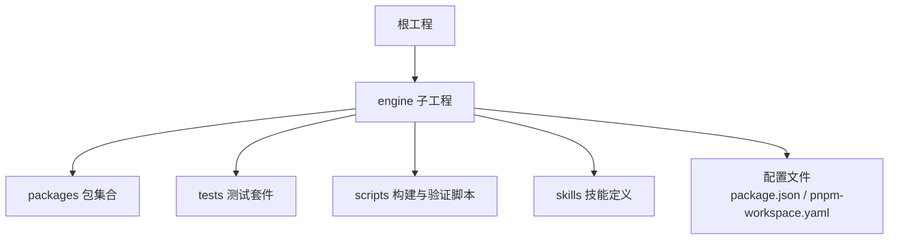
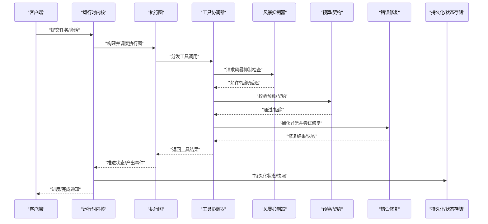
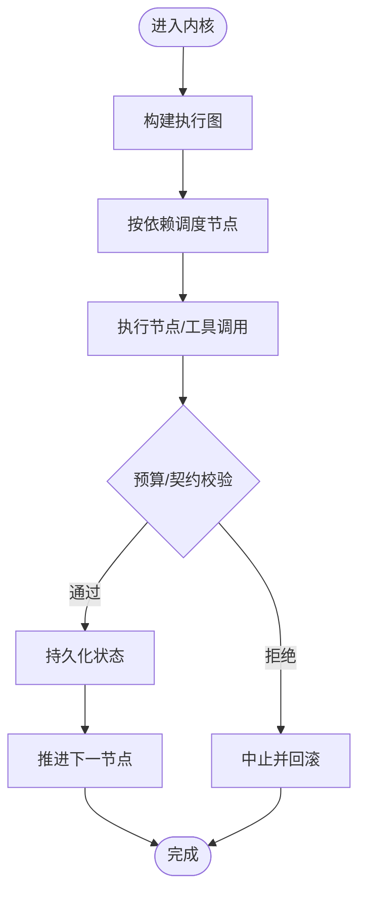
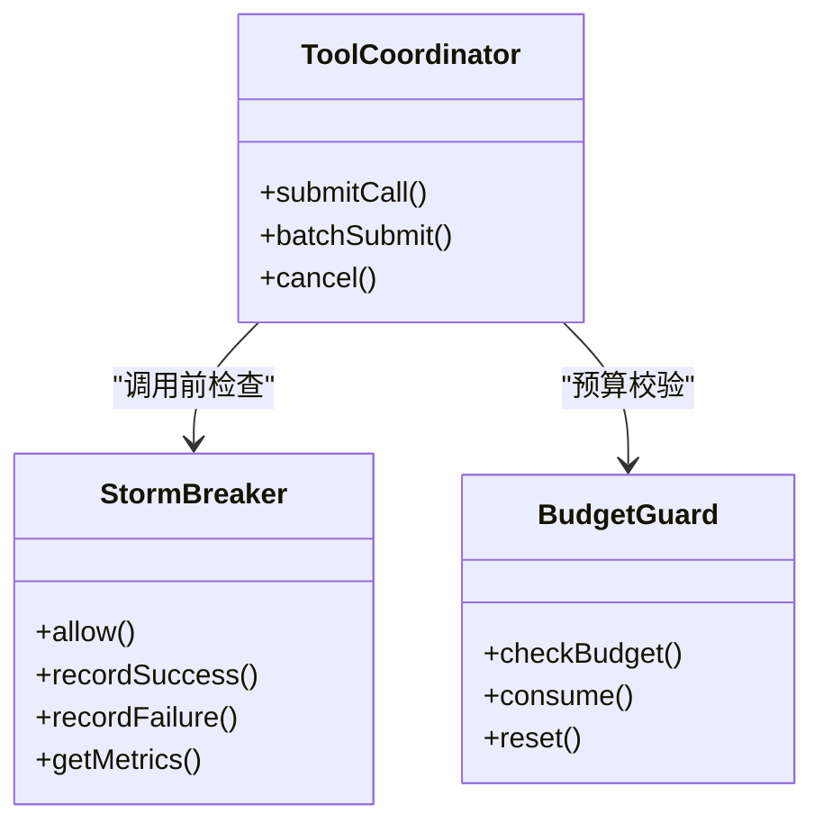
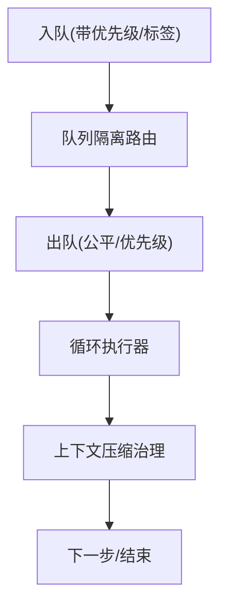
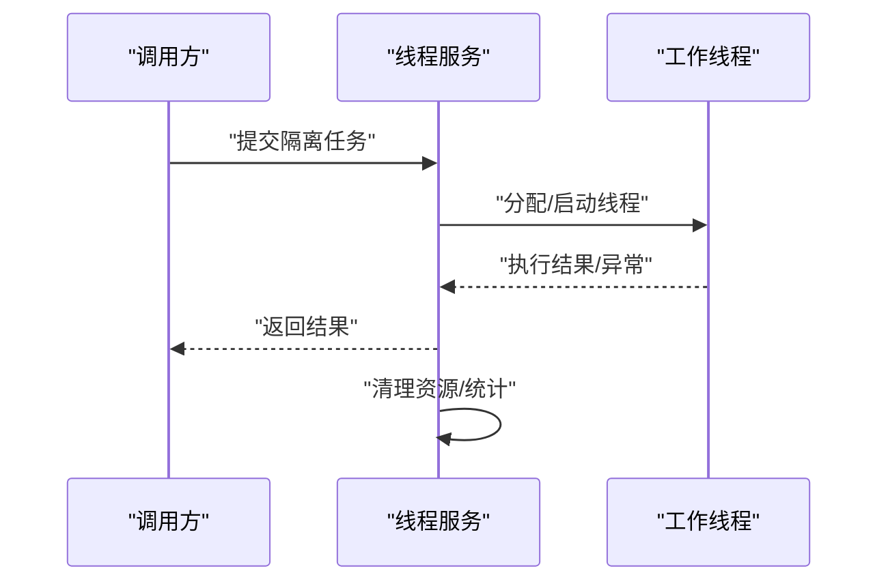
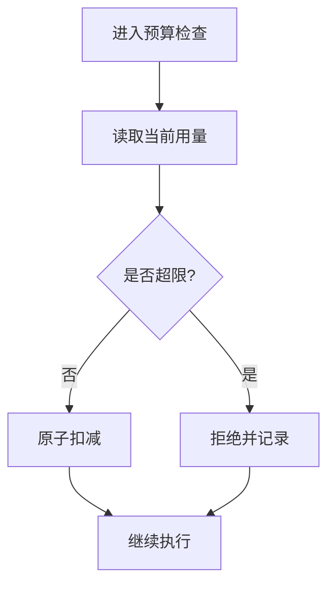
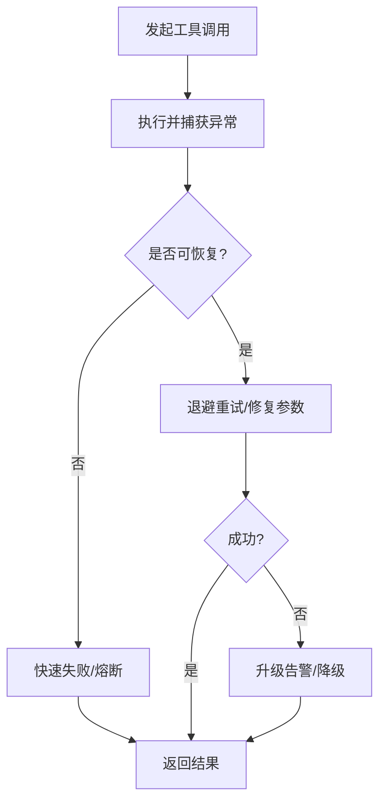
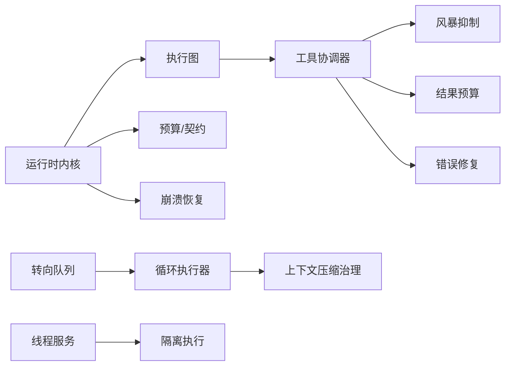

# 并发控制

<cite>
**本文引用的文件**   
- [engine/package.json](file://engine/package.json)
- [engine/pnpm-workspace.yaml](file://engine/pnpm-workspace.yaml)
- [engine/README.md](file://engine/README.md)
- [engine/tests/runtime-kernel.test.ts](file://engine/tests/runtime-kernel.test.ts)
- [engine/tests/tool-runtime-v3.test.ts](file://engine/tests/tool-runtime-v3.test.ts)
- [engine/tests/tool-coordinator-runtime.test.ts](file://engine/tests/tool-coordinator-runtime.test.ts)
- [engine/tests/tool-storm-breaker.test.ts](file://engine/tests/tool-storm-breaker.test.ts)
- [engine/tests/steering-queue-isolation.test.ts](file://engine/tests/steering-queue-isolation.test.ts)
- [engine/tests/thread-service.test.ts](file://engine/tests/thread-service.test.ts)
- [engine/tests/execution-graph.test.ts](file://engine/tests/execution-graph.test.ts)
- [engine/tests/loop-runner.test.ts](file://engine/tests/loop-runner.test.ts)
- [engine/tests/compaction-governor.test.ts](file://engine/tests/compaction-governor.test.ts)
- [engine/tests/runtime-kernel-contracts.test.ts](file://engine/tests/runtime-kernel-contracts.test.ts)
- [engine/tests/runtime-kernel-crash-recovery.test.ts](file://engine/tests/runtime-kernel-crash-recovery.test.ts)
- [engine/tests/runtime-kernel-e2e.test.ts](file://engine/tests/runtime-kernel-e2e.test.ts)
- [engine/tests/runtime-middleware-governance.test.ts](file://engine/tests/runtime-middleware-governance.test.ts)
- [engine/tests/runtime-kernel-provider-matrix.test.ts](file://engine/tests/runtime-kernel-provider-matrix.test.ts)
- [engine/tests/runtime-kernel-isolation.test.ts](file://engine/tests/runtime-kernel-isolation.test.ts)
- [engine/tests/runtime-kernel-budget.test.ts](file://engine/tests/runtime-kernel-budget.test.ts)
- [engine/tests/runtime-kernel-replay.test.ts](file://engine/tests/runtime-kernel-replay.test.ts)
- [engine/tests/tool-call-repair.test.ts](file://engine/tests/tool-call-repair.test.ts)
- [engine/tests/tool-dispatch-errors.test.ts](file://engine/tests/tool-dispatch-errors.test.ts)
- [engine/tests/tool-result-budget.test.ts](file://engine/tests/tool-result-budget.test.ts)
- [engine/tests/tool-storm-breaker.test.ts](file://engine/tests/tool-storm-breaker.test.ts)
</cite>

## 目录
1. [简介](#简介)
2. [项目结构](#项目结构)
3. [核心组件](#核心组件)
4. [架构总览](#架构总览)
5. [详细组件分析](#详细组件分析)
6. [依赖关系分析](#依赖关系分析)
7. [性能考量](#性能考量)
8. [故障排查指南](#故障排查指南)
9. [结论](#结论)
10. [附录](#附录)

## 简介
本技术文档聚焦于KCoder引擎的并发控制系统，围绕任务调度、线程与协程管理、锁与互斥访问、资源竞争检测与死锁预防、优先级与公平性、并发性能监控、并发安全数据结构与操作模式、配置与调优、诊断与调试技巧以及高并发优化实践展开。文档以仓库中的测试用例与工程配置为依据，提炼出可落地的并发模型与最佳实践，帮助读者在复杂AI工具链与多提供者环境下构建稳定高效的运行时。

## 项目结构
KCoder采用monorepo组织方式，核心并发相关能力集中在engine子工程中，通过pnpm workspace进行包管理与依赖编排。测试覆盖广泛，涉及运行时内核、工具协调器、风暴抑制、队列隔离、崩溃恢复、预算治理等关键并发主题。

图表来源
- [engine/package.json](file://engine/package.json)
- [engine/pnpm-workspace.yaml](file://engine/pnpm-workspace.yaml)

章节来源
- [engine/package.json](file://engine/package.json)
- [engine/pnpm-workspace.yaml](file://engine/pnpm-workspace.yaml)
- [engine/README.md](file://engine/README.md)

## 核心组件
基于测试用例与工程结构，可将并发控制的核心组件归纳为以下类别：
- 运行时内核与执行图：负责任务生命周期、状态机流转、事件总线与中间件治理。
- 工具协调器与风暴抑制：对工具调用进行编排、限流与风暴保护，避免雪崩。
- 调度与队列：包括转向队列隔离、循环执行器、上下文压缩治理器等。
- 线程服务与隔离：提供线程级或进程级隔离能力，保障稳定性与安全性。
- 预算与契约：对资源使用（如token、时间）进行约束与审计。
- 错误处理与修复：对工具调用失败进行重试、修复与降级。

章节来源
- [engine/tests/runtime-kernel.test.ts](file://engine/tests/runtime-kernel.test.ts)
- [engine/tests/tool-coordinator-runtime.test.ts](file://engine/tests/tool-coordinator-runtime.test.ts)
- [engine/tests/tool-storm-breaker.test.ts](file://engine/tests/tool-storm-breaker.test.ts)
- [engine/tests/steering-queue-isolation.test.ts](file://engine/tests/steering-queue-isolation.test.ts)
- [engine/tests/thread-service.test.ts](file://engine/tests/thread-service.test.ts)
- [engine/tests/execution-graph.test.ts](file://engine/tests/execution-graph.test.ts)
- [engine/tests/loop-runner.test.ts](file://engine/tests/loop-runner.test.ts)
- [engine/tests/compaction-governor.test.ts](file://engine/tests/compaction-governor.test.ts)
- [engine/tests/runtime-kernel-contracts.test.ts](file://engine/tests/runtime-kernel-contracts.test.ts)
- [engine/tests/runtime-kernel-budget.test.ts](file://engine/tests/runtime-kernel-budget.test.ts)
- [engine/tests/tool-call-repair.test.ts](file://engine/tests/tool-call-repair.test.ts)
- [engine/tests/tool-dispatch-errors.test.ts](file://engine/tests/tool-dispatch-errors.test.ts)
- [engine/tests/tool-result-budget.test.ts](file://engine/tests/tool-result-budget.test.ts)

## 架构总览
下图展示了KCoder运行时内核与并发控制的关键交互路径，涵盖任务提交、执行图调度、工具协调、风暴抑制、预算与契约校验、错误修复与结果回传。

图表来源
- [engine/tests/runtime-kernel.test.ts](file://engine/tests/runtime-kernel.test.ts)
- [engine/tests/tool-coordinator-runtime.test.ts](file://engine/tests/tool-coordinator-runtime.test.ts)
- [engine/tests/tool-storm-breaker.test.ts](file://engine/tests/tool-storm-breaker.test.ts)
- [engine/tests/runtime-kernel-contracts.test.ts](file://engine/tests/runtime-kernel-contracts.test.ts)
- [engine/tests/tool-call-repair.test.ts](file://engine/tests/tool-call-repair.test.ts)
- [engine/tests/runtime-kernel-crash-recovery.test.ts](file://engine/tests/runtime-kernel-crash-recovery.test.ts)

## 详细组件分析

### 运行时内核与执行图
- 职责：维护任务生命周期、事件驱动的状态机、执行图的拓扑与调度；提供中间件治理与合约校验。
- 并发要点：
  - 事件总线与消息传递：通过事件驱动解耦各阶段，降低直接耦合带来的竞态风险。
  - 执行图调度：将复杂流程拆分为节点与边，按依赖顺序并行执行无环部分，提升吞吐。
  - 中间件治理：在关键路径插入预算、审计、日志、熔断等横切逻辑。
- 典型场景：
  - 端到端运行：从任务创建到完成的全链路跟踪与回放。
  - 崩溃恢复：基于持久化状态进行断点续跑。

图表来源
- [engine/tests/runtime-kernel.test.ts](file://engine/tests/runtime-kernel.test.ts)
- [engine/tests/execution-graph.test.ts](file://engine/tests/execution-graph.test.ts)
- [engine/tests/runtime-kernel-contracts.test.ts](file://engine/tests/runtime-kernel-contracts.test.ts)
- [engine/tests/runtime-kernel-crash-recovery.test.ts](file://engine/tests/runtime-kernel-crash-recovery.test.ts)

章节来源
- [engine/tests/runtime-kernel.test.ts](file://engine/tests/runtime-kernel.test.ts)
- [engine/tests/execution-graph.test.ts](file://engine/tests/execution-graph.test.ts)
- [engine/tests/runtime-kernel-contracts.test.ts](file://engine/tests/runtime-kernel-contracts.test.ts)
- [engine/tests/runtime-kernel-crash-recovery.test.ts](file://engine/tests/runtime-kernel-crash-recovery.test.ts)

### 工具协调器与风暴抑制
- 职责：统一编排工具调用，实施限流、去重、退避与风暴抑制，防止下游过载。
- 并发要点：
  - 并发度控制：限制同时运行的工具调用数量，避免资源耗尽。
  - 风暴抑制：基于速率、错误率、延迟阈值动态调整流量。
  - 错误修复：对可恢复错误进行重试、参数修正或降级策略。
- 典型场景：
  - 批量工具调用：在有限并发下最大化吞吐。
  - 外部API风暴：突发流量下的自我保护。

图表来源
- [engine/tests/tool-coordinator-runtime.test.ts](file://engine/tests/tool-coordinator-runtime.test.ts)
- [engine/tests/tool-storm-breaker.test.ts](file://engine/tests/tool-storm-breaker.test.ts)
- [engine/tests/tool-result-budget.test.ts](file://engine/tests/tool-result-budget.test.ts)

章节来源
- [engine/tests/tool-coordinator-runtime.test.ts](file://engine/tests/tool-coordinator-runtime.test.ts)
- [engine/tests/tool-storm-breaker.test.ts](file://engine/tests/tool-storm-breaker.test.ts)
- [engine/tests/tool-result-budget.test.ts](file://engine/tests/tool-result-budget.test.ts)
- [engine/tests/tool-call-repair.test.ts](file://engine/tests/tool-call-repair.test.ts)
- [engine/tests/tool-dispatch-errors.test.ts](file://engine/tests/tool-dispatch-errors.test.ts)

### 调度与队列：转向队列隔离与循环执行器
- 职责：为不同任务或上下文提供隔离的调度通道，支持循环执行与上下文压缩治理。
- 并发要点：
  - 队列隔离：避免跨任务干扰，保证公平性与可观测性。
  - 循环执行：支持迭代式任务，具备退出条件与超时保护。
  - 上下文压缩：在长对话或多轮交互中控制内存增长。
- 典型场景：
  - 多会话并行：每个会话拥有独立队列，互不阻塞。
  - 长时间任务：循环执行器配合压缩治理器，保持资源可控。

图表来源
- [engine/tests/steering-queue-isolation.test.ts](file://engine/tests/steering-queue-isolation.test.ts)
- [engine/tests/loop-runner.test.ts](file://engine/tests/loop-runner.test.ts)
- [engine/tests/compaction-governor.test.ts](file://engine/tests/compaction-governor.test.ts)

章节来源
- [engine/tests/steering-queue-isolation.test.ts](file://engine/tests/steering-queue-isolation.test.ts)
- [engine/tests/loop-runner.test.ts](file://engine/tests/loop-runner.test.ts)
- [engine/tests/compaction-governor.test.ts](file://engine/tests/compaction-governor.test.ts)

### 线程服务与隔离
- 职责：提供线程级或进程级隔离能力，确保关键路径不受其他任务影响。
- 并发要点：
  - 隔离边界：明确共享资源与私有资源的边界。
  - 资源回收：及时释放线程/进程资源，避免泄漏。
  - 健康检查：监控线程存活与负载，自动扩容或降级。
- 典型场景：
  - 敏感操作：在隔离环境中执行高风险任务。
  - 第三方库：在不兼容的库之间进行隔离。

图表来源
- [engine/tests/thread-service.test.ts](file://engine/tests/thread-service.test.ts)

章节来源
- [engine/tests/thread-service.test.ts](file://engine/tests/thread-service.test.ts)

### 预算与契约
- 职责：对资源使用进行约束与审计，确保系统稳定与成本可控。
- 并发要点：
  - 原子扣减：并发访问预算时保证一致性。
  - 快速失败：超过阈值立即拒绝，避免放大问题。
  - 可观测性：记录预算消耗与违约事件。
- 典型场景：
  - Token/费用上限：防止超额消费。
  - 时间/配额限制：保障SLA与公平性。

图表来源
- [engine/tests/runtime-kernel-contracts.test.ts](file://engine/tests/runtime-kernel-contracts.test.ts)
- [engine/tests/runtime-kernel-budget.test.ts](file://engine/tests/runtime-kernel-budget.test.ts)
- [engine/tests/tool-result-budget.test.ts](file://engine/tests/tool-result-budget.test.ts)

章节来源
- [engine/tests/runtime-kernel-contracts.test.ts](file://engine/tests/runtime-kernel-contracts.test.ts)
- [engine/tests/runtime-kernel-budget.test.ts](file://engine/tests/runtime-kernel-budget.test.ts)
- [engine/tests/tool-result-budget.test.ts](file://engine/tests/tool-result-budget.test.ts)

### 错误处理与修复
- 职责：捕获工具调用异常，进行重试、参数修复、降级与补偿。
- 并发要点：
  - 幂等性：重试需保证幂等，避免副作用放大。
  - 退避策略：指数退避与抖动，避免再次引发风暴。
  - 熔断与短路：持续失败时快速失败，保护上游。
- 典型场景：
  - 网络抖动：自动重试与切换提供者。
  - 参数错误：自动修正并重试。

图表来源
- [engine/tests/tool-call-repair.test.ts](file://engine/tests/tool-call-repair.test.ts)
- [engine/tests/tool-dispatch-errors.test.ts](file://engine/tests/tool-dispatch-errors.test.ts)

章节来源
- [engine/tests/tool-call-repair.test.ts](file://engine/tests/tool-call-repair.test.ts)
- [engine/tests/tool-dispatch-errors.test.ts](file://engine/tests/tool-dispatch-errors.test.ts)

## 依赖关系分析
KCoder通过pnpm workspace管理多个包，测试用例覆盖了运行时内核、工具协调、风暴抑制、预算与契约、错误修复等模块之间的协作关系。下图展示主要模块间的依赖与交互方向。

图表来源
- [engine/tests/runtime-kernel.test.ts](file://engine/tests/runtime-kernel.test.ts)
- [engine/tests/tool-coordinator-runtime.test.ts](file://engine/tests/tool-coordinator-runtime.test.ts)
- [engine/tests/tool-storm-breaker.test.ts](file://engine/tests/tool-storm-breaker.test.ts)
- [engine/tests/steering-queue-isolation.test.ts](file://engine/tests/steering-queue-isolation.test.ts)
- [engine/tests/loop-runner.test.ts](file://engine/tests/loop-runner.test.ts)
- [engine/tests/compaction-governor.test.ts](file://engine/tests/compaction-governor.test.ts)
- [engine/tests/thread-service.test.ts](file://engine/tests/thread-service.test.ts)
- [engine/tests/runtime-kernel-contracts.test.ts](file://engine/tests/runtime-kernel-contracts.test.ts)
- [engine/tests/runtime-kernel-crash-recovery.test.ts](file://engine/tests/runtime-kernel-crash-recovery.test.ts)

章节来源
- [engine/package.json](file://engine/package.json)
- [engine/pnpm-workspace.yaml](file://engine/pnpm-workspace.yaml)

## 性能考量
- 吞吐量与延迟：
  - 通过执行图并行无环节点、工具协调器的并发度控制与风暴抑制，平衡吞吐与延迟。
  - 结合预算与契约快速失败，减少无效计算与网络开销。
- 资源利用率：
  - 线程服务与隔离机制避免热点资源争用，提高整体利用率。
  - 上下文压缩治理器控制内存增长，避免GC压力。
- 公平性与优先级：
  - 转向队列隔离与优先级调度确保关键任务优先获得资源，同时维持公平性。
- 可观测性：
  - 在关键路径埋点，采集吞吐、延迟、错误率、预算消耗等指标，支撑容量规划与调优。

[本节为通用指导，无需具体文件引用]

## 故障排查指南
- 常见问题定位：
  - 风暴与雪崩：检查风暴抑制器阈值与退避策略，观察错误率与延迟趋势。
  - 预算超支：核对预算扣减逻辑与快速失败路径，确认是否出现重复扣减。
  - 队列积压：查看队列长度与出队速率，评估是否需要扩容或调整优先级。
  - 崩溃恢复：验证状态持久化与回放路径，确认断点续跑是否生效。
- 诊断工具与技巧：
  - 启用详细日志与追踪ID，关联一次请求的全链路事件。
  - 使用回放与回放测试，复现问题并验证修复效果。
  - 针对工具调用错误，利用错误修复与重试策略进行自愈。

章节来源
- [engine/tests/tool-storm-breaker.test.ts](file://engine/tests/tool-storm-breaker.test.ts)
- [engine/tests/runtime-kernel-budget.test.ts](file://engine/tests/runtime-kernel-budget.test.ts)
- [engine/tests/steering-queue-isolation.test.ts](file://engine/tests/steering-queue-isolation.test.ts)
- [engine/tests/runtime-kernel-crash-recovery.test.ts](file://engine/tests/runtime-kernel-crash-recovery.test.ts)
- [engine/tests/tool-dispatch-errors.test.ts](file://engine/tests/tool-dispatch-errors.test.ts)

## 结论
KCoder的并发控制系统以事件驱动的执行图为核心，结合工具协调、风暴抑制、预算与契约、错误修复与崩溃恢复，构建了在高并发与不稳定外部依赖环境下的稳健运行时。通过队列隔离、线程服务与上下文压缩治理，系统在吞吐、延迟与资源利用率方面取得良好平衡。建议在生产环境中完善可观测性与自动化治理策略，持续优化并发参数与降级预案。

[本节为总结性内容，无需具体文件引用]

## 附录
- 配置与调优建议：
  - 根据业务峰值与SLA设定风暴抑制阈值与退避策略。
  - 合理设置工具并发度与队列容量，避免过度排队导致延迟上升。
  - 预算与契约阈值应结合历史数据与成本目标动态调整。
- 最佳实践：
  - 所有外部调用应具备幂等与重试能力。
  - 关键路径增加熔断与短路，防止故障扩散。
  - 定期演练崩溃恢复与回放，确保RTO/RPO达标。

[本节为通用指导，无需具体文件引用]