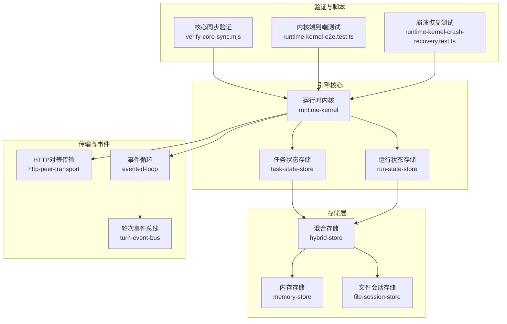
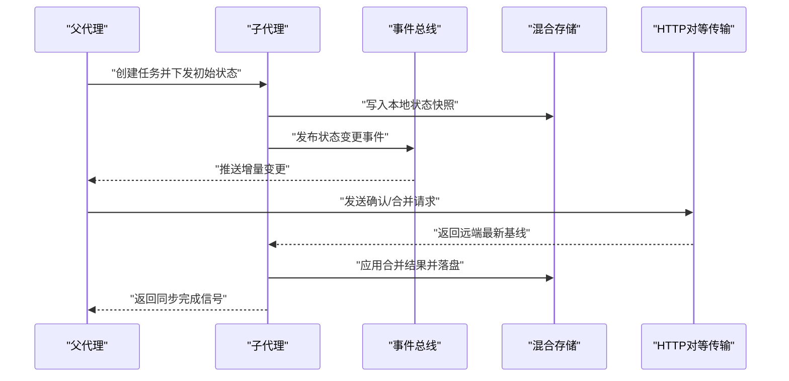
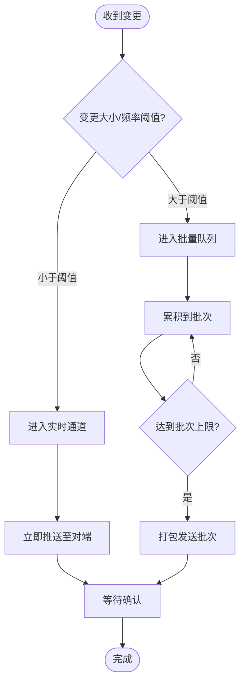
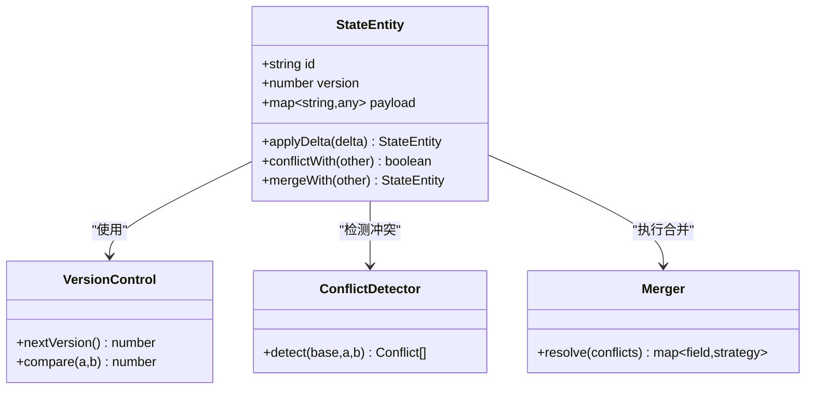
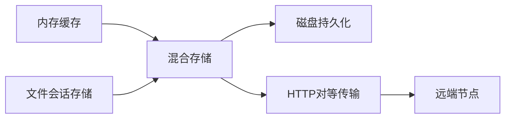
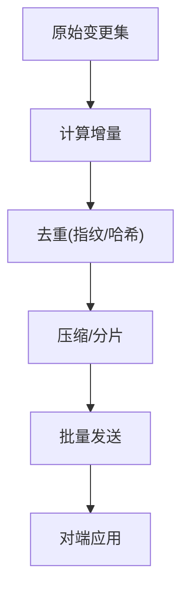
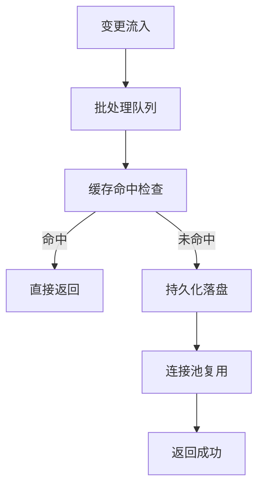
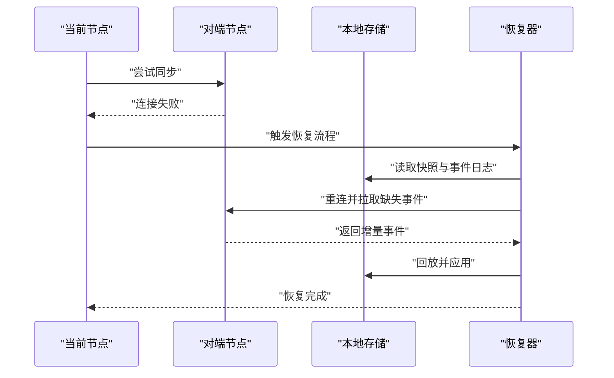
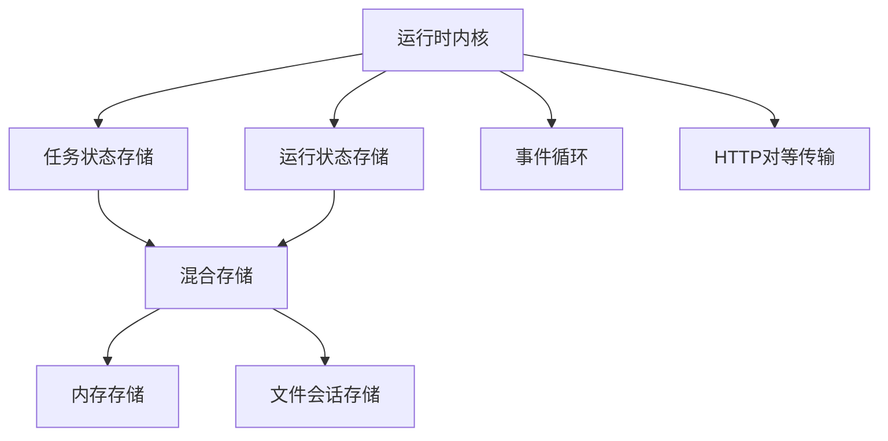

# 状态同步机制

<cite>
**本文引用的文件**   
- [engine/README.md](file://engine/README.md)
- [engine/package.json](file://engine/package.json)
- [engine/pnpm-workspace.yaml](file://engine/pnpm-workspace.yaml)
- [engine/scripts/verify-core-sync.mjs](file://engine/scripts/verify-core-sync.mjs)
- [engine/tests/runtime-kernel.test.ts](file://engine/tests/runtime-kernel.test.ts)
- [engine/tests/runtime-kernel-crash-recovery.test.ts](file://engine/tests/runtime-kernel-crash-recovery.test.ts)
- [engine/tests/run-state-store.test.ts](file://engine/tests/run-state-store.test.ts)
- [engine/tests/task-state-store.test.ts](file://engine/tests/task-state-store.test.ts)
- [engine/tests/hybrid-store.test.ts](file://engine/tests/hybrid-store.test.ts)
- [engine/tests/file-session-store.test.ts](file://engine/tests/file-session-store.test.ts)
- [engine/tests/memory-store.test.ts](file://engine/tests/memory-store.test.ts)
- [engine/tests/cache.test.ts](file://engine/tests/cache.test.ts)
- [engine/tests/http-server.test.ts](file://engine/tests/http-server.test.ts)
- [engine/tests/http-peer-transport.test.ts](file://engine/tests/http-peer-transport.test.ts)
- [engine/tests/evented-loop.test.ts](file://engine/tests/evented-loop.test.ts)
- [engine/tests/turn-event-bus.test.ts](file://engine/tests/turn-event-bus.test.ts)
- [engine/tests/tool-runtime-v3.test.ts](file://engine/tests/tool-runtime-v3.test.ts)
- [engine/tests/runtime-kernel-e2e.test.ts](file://engine/tests/runtime-kernel-e2e.test.ts)
</cite>

## 目录
1. [简介](#简介)
2. [项目结构](#项目结构)
3. [核心组件](#核心组件)
4. [架构总览](#架构总览)
5. [详细组件分析](#详细组件分析)
6. [依赖关系分析](#依赖关系分析)
7. [性能考虑](#性能考虑)
8. [故障恢复指南](#故障恢复指南)
9. [监控与调试](#监控与调试)
10. [结论](#结论)

## 简介
本技术文档聚焦于KCoder引擎中的“状态同步机制”，围绕父子代理间的状态一致性、实时与批量同步策略、冲突检测与合并、版本控制、存储分层（内存缓存/持久化/分布式）、事件驱动更新、增量压缩与去重、批处理与连接池优化，以及断线重连与数据补偿等主题进行系统化说明。文档以仓库中测试与脚本为证据来源，结合工程实践给出可操作的指导与图示。

## 项目结构
KCoder采用多包工作区组织，核心能力分布在packages下，并通过scripts提供验证与迁移工具；tests覆盖关键路径与边界场景。与状态同步相关的重点位置包括：
- 运行时内核与任务状态：runtime-kernel、task-state-store、run-state-store
- 存储层：hybrid-store、memory-store、file-session-store
- 传输与事件：http-peer-transport、evented-loop、turn-event-bus
- 端到端与恢复：runtime-kernel-e2e、runtime-kernel-crash-recovery
- 同步验证：verify-core-sync



图表来源
- [engine/tests/runtime-kernel.test.ts](file://engine/tests/runtime-kernel.test.ts)
- [engine/tests/task-state-store.test.ts](file://engine/tests/task-state-store.test.ts)
- [engine/tests/run-state-store.test.ts](file://engine/tests/run-state-store.test.ts)
- [engine/tests/hybrid-store.test.ts](file://engine/tests/hybrid-store.test.ts)
- [engine/tests/memory-store.test.ts](file://engine/tests/memory-store.test.ts)
- [engine/tests/file-session-store.test.ts](file://engine/tests/file-session-store.test.ts)
- [engine/tests/http-peer-transport.test.ts](file://engine/tests/http-peer-transport.test.ts)
- [engine/tests/evented-loop.test.ts](file://engine/tests/evented-loop.test.ts)
- [engine/tests/turn-event-bus.test.ts](file://engine/tests/turn-event-bus.test.ts)
- [engine/scripts/verify-core-sync.mjs](file://engine/scripts/verify-core-sync.mjs)
- [engine/tests/runtime-kernel-e2e.test.ts](file://engine/tests/runtime-kernel-e2e.test.ts)
- [engine/tests/runtime-kernel-crash-recovery.test.ts](file://engine/tests/runtime-kernel-crash-recovery.test.ts)

章节来源
- [engine/README.md](file://engine/README.md)
- [engine/package.json](file://engine/package.json)
- [engine/pnpm-workspace.yaml](file://engine/pnpm-workspace.yaml)

## 核心组件
- 运行时内核：协调任务生命周期、状态推进、事件分发与持久化提交点。
- 任务状态存储：维护任务级状态快照与变更序列，支撑回放与一致性校验。
- 运行状态存储：维护全局运行期状态，如会话、上下文、资源句柄等。
- 混合存储：在内存与持久化之间做分层读写与落盘策略，兼顾性能与可靠性。
- 内存存储：低延迟的键值或对象缓存，用于热路径与中间结果。
- 文件会话存储：将会话与状态片段持久化为文件，便于恢复与审计。
- HTTP对等传输：进程间或节点间的双向通信通道，承载状态增量与指令。
- 事件循环与事件总线：基于事件的驱动模型，解耦状态变更与消费方。
- 同步验证脚本：自动化校验核心同步契约与一致性约束。

章节来源
- [engine/tests/runtime-kernel.test.ts](file://engine/tests/runtime-kernel.test.ts)
- [engine/tests/task-state-store.test.ts](file://engine/tests/task-state-store.test.ts)
- [engine/tests/run-state-store.test.ts](file://engine/tests/run-state-store.test.ts)
- [engine/tests/hybrid-store.test.ts](file://engine/tests/hybrid-store.test.ts)
- [engine/tests/memory-store.test.ts](file://engine/tests/memory-store.test.ts)
- [engine/tests/file-session-store.test.ts](file://engine/tests/file-session-store.test.ts)
- [engine/tests/http-peer-transport.test.ts](file://engine/tests/http-peer-transport.test.ts)
- [engine/tests/evented-loop.test.ts](file://engine/tests/evented-loop.test.ts)
- [engine/tests/turn-event-bus.test.ts](file://engine/tests/turn-event-bus.test.ts)
- [engine/scripts/verify-core-sync.mjs](file://engine/scripts/verify-core-sync.mjs)

## 架构总览
下图展示父子代理间状态同步的整体流程：父代理作为协调者，子代理执行具体任务；状态通过事件循环与事件总线传播，经由混合存储落盘，并通过HTTP对等传输实现跨进程/节点的增量同步。



图表来源
- [engine/tests/runtime-kernel.test.ts](file://engine/tests/runtime-kernel.test.ts)
- [engine/tests/turn-event-bus.test.ts](file://engine/tests/turn-event-bus.test.ts)
- [engine/tests/hybrid-store.test.ts](file://engine/tests/hybrid-store.test.ts)
- [engine/tests/http-peer-transport.test.ts](file://engine/tests/http-peer-transport.test.ts)

## 详细组件分析

### 父子代理状态同步策略
- 实时同步：基于事件驱动的增量推送，适用于高频小变更，降低端到端延迟。
- 批量同步：按时间窗口或变更阈值聚合，减少网络往返与序列化开销，适用于大体积或低频变更。
- 选择策略：根据变更大小、频率与网络状况动态切换；在事件总线侧做节流与合并。



图表来源
- [engine/tests/turn-event-bus.test.ts](file://engine/tests/turn-event-bus.test.ts)
- [engine/tests/http-peer-transport.test.ts](file://engine/tests/http-peer-transport.test.ts)

章节来源
- [engine/tests/turn-event-bus.test.ts](file://engine/tests/turn-event-bus.test.ts)
- [engine/tests/http-peer-transport.test.ts](file://engine/tests/http-peer-transport.test.ts)

### 一致性保证：冲突检测、合并策略与版本控制
- 版本控制：每个状态实体携带版本号或向量时钟，确保有序与可比较。
- 冲突检测：当两端同时修改同一字段时，依据版本与语义规则判定是否冲突。
- 合并策略：支持字段级合并、最后写入优先或业务自定义合并器；合并后生成新版本。
- 幂等性：所有同步操作具备幂等特性，避免重复应用导致不一致。



图表来源
- [engine/tests/task-state-store.test.ts](file://engine/tests/task-state-store.test.ts)
- [engine/tests/run-state-store.test.ts](file://engine/tests/run-state-store.test.ts)
- [engine/tests/hybrid-store.test.ts](file://engine/tests/hybrid-store.test.ts)

章节来源
- [engine/tests/task-state-store.test.ts](file://engine/tests/task-state-store.test.ts)
- [engine/tests/run-state-store.test.ts](file://engine/tests/run-state-store.test.ts)
- [engine/tests/hybrid-store.test.ts](file://engine/tests/hybrid-store.test.ts)

### 状态存储架构：内存缓存、持久化与分布式
- 内存缓存：用于热路径与中间态，提升读取与写放大场景的性能。
- 持久化：文件会话存储提供可靠落盘，支持断点续传与回放。
- 分布式：通过HTTP对等传输与事件总线，将状态扩散到多个节点，形成最终一致视图。
- 混合策略：读多写少走内存，写多读少走持久化；必要时触发回写与压缩。



图表来源
- [engine/tests/hybrid-store.test.ts](file://engine/tests/hybrid-store.test.ts)
- [engine/tests/memory-store.test.ts](file://engine/tests/memory-store.test.ts)
- [engine/tests/file-session-store.test.ts](file://engine/tests/file-session-store.test.ts)
- [engine/tests/http-peer-transport.test.ts](file://engine/tests/http-peer-transport.test.ts)

章节来源
- [engine/tests/hybrid-store.test.ts](file://engine/tests/hybrid-store.test.ts)
- [engine/tests/memory-store.test.ts](file://engine/tests/memory-store.test.ts)
- [engine/tests/file-session-store.test.ts](file://engine/tests/file-session-store.test.ts)
- [engine/tests/http-peer-transport.test.ts](file://engine/tests/http-peer-transport.test.ts)

### 事件驱动的状态监听与通知
- 事件总线：统一注册订阅者，按主题路由状态变更事件。
- 事件循环：解耦生产与消费，支持背压与重试。
- 订阅模型：支持一次性订阅与长期订阅，适配UI刷新与后台任务。

```mermaid
sequenceDiagram
participant Producer as "状态生产者"
participant Loop as "事件循环"
participant Bus as "事件总线"
participant SubA as "订阅者A"
participant SubB as "订阅者B"
Producer->>Loop : "产生状态变更"
Loop->>Bus : "投递事件"
Bus-->>SubA : "推送事件"
Bus-->>SubB : "推送事件"
SubA-->>Bus : "确认/回执"
SubB-->>Bus : "确认/回执"
```

图表来源
- [engine/tests/evented-loop.test.ts](file://engine/tests/evented-loop.test.ts)
- [engine/tests/turn-event-bus.test.ts](file://engine/tests/turn-event-bus.test.ts)

章节来源
- [engine/tests/evented-loop.test.ts](file://engine/tests/evented-loop.test.ts)
- [engine/tests/turn-event-bus.test.ts](file://engine/tests/turn-event-bus.test.ts)

### 状态压缩与优化：增量同步与数据去重
- 增量同步：仅传输差异字段或变更序列，减少带宽占用。
- 数据去重：基于内容哈希或字段指纹，避免重复传输相同变更。
- 压缩策略：对大批量变更进行分片与压缩，结合批量通道发送。



图表来源
- [engine/tests/hybrid-store.test.ts](file://engine/tests/hybrid-store.test.ts)
- [engine/tests/http-peer-transport.test.ts](file://engine/tests/http-peer-transport.test.ts)

章节来源
- [engine/tests/hybrid-store.test.ts](file://engine/tests/hybrid-store.test.ts)
- [engine/tests/http-peer-transport.test.ts](file://engine/tests/http-peer-transport.test.ts)

### 性能优化：批处理、缓存与连接池
- 批处理：将多次小变更合并为一次提交，降低锁竞争与落盘次数。
- 缓存策略：热点数据常驻内存，冷数据按需加载；设置TTL与淘汰策略。
- 连接池管理：复用HTTP连接，限制并发度，避免雪崩。



图表来源
- [engine/tests/cache.test.ts](file://engine/tests/cache.test.ts)
- [engine/tests/hybrid-store.test.ts](file://engine/tests/hybrid-store.test.ts)
- [engine/tests/http-peer-transport.test.ts](file://engine/tests/http-peer-transport.test.ts)

章节来源
- [engine/tests/cache.test.ts](file://engine/tests/cache.test.ts)
- [engine/tests/hybrid-store.test.ts](file://engine/tests/hybrid-store.test.ts)
- [engine/tests/http-peer-transport.test.ts](file://engine/tests/http-peer-transport.test.ts)

### 故障恢复：断线重连与数据补偿
- 断线重连：检测到连接异常后指数退避重连，保持会话连续性。
- 数据补偿：基于事件回放与持久化快照，补齐缺失变更，恢复一致状态。
- 幂等应用：确保重放不引入副作用。



图表来源
- [engine/tests/runtime-kernel-crash-recovery.test.ts](file://engine/tests/runtime-kernel-crash-recovery.test.ts)
- [engine/tests/file-session-store.test.ts](file://engine/tests/file-session-store.test.ts)
- [engine/tests/http-peer-transport.test.ts](file://engine/tests/http-peer-transport.test.ts)

章节来源
- [engine/tests/runtime-kernel-crash-recovery.test.ts](file://engine/tests/runtime-kernel-crash-recovery.test.ts)
- [engine/tests/file-session-store.test.ts](file://engine/tests/file-session-store.test.ts)
- [engine/tests/http-peer-transport.test.ts](file://engine/tests/http-peer-transport.test.ts)

## 依赖关系分析
- 耦合与内聚：运行时内核与状态存储高内聚，通过接口与事件总线松耦合外部系统。
- 直接依赖：内核依赖任务/运行状态存储、事件循环与传输层。
- 间接依赖：混合存储依赖内存与文件存储；传输层依赖连接池与重试策略。
- 外部集成：HTTP对等传输对接远端服务或同构节点。



图表来源
- [engine/tests/runtime-kernel.test.ts](file://engine/tests/runtime-kernel.test.ts)
- [engine/tests/task-state-store.test.ts](file://engine/tests/task-state-store.test.ts)
- [engine/tests/run-state-store.test.ts](file://engine/tests/run-state-store.test.ts)
- [engine/tests/hybrid-store.test.ts](file://engine/tests/hybrid-store.test.ts)
- [engine/tests/memory-store.test.ts](file://engine/tests/memory-store.test.ts)
- [engine/tests/file-session-store.test.ts](file://engine/tests/file-session-store.test.ts)
- [engine/tests/http-peer-transport.test.ts](file://engine/tests/http-peer-transport.test.ts)
- [engine/tests/evented-loop.test.ts](file://engine/tests/evented-loop.test.ts)

章节来源
- [engine/tests/runtime-kernel.test.ts](file://engine/tests/runtime-kernel.test.ts)
- [engine/tests/task-state-store.test.ts](file://engine/tests/task-state-store.test.ts)
- [engine/tests/run-state-store.test.ts](file://engine/tests/run-state-store.test.ts)
- [engine/tests/hybrid-store.test.ts](file://engine/tests/hybrid-store.test.ts)
- [engine/tests/memory-store.test.ts](file://engine/tests/memory-store.test.ts)
- [engine/tests/file-session-store.test.ts](file://engine/tests/file-session-store.test.ts)
- [engine/tests/http-peer-transport.test.ts](file://engine/tests/http-peer-transport.test.ts)
- [engine/tests/evented-loop.test.ts](file://engine/tests/evented-loop.test.ts)

## 性能考虑
- 批处理窗口与阈值：平衡延迟与吞吐，避免过大批次导致抖动。
- 缓存命中率与淘汰：关注热点键分布，合理设置TTL与容量上限。
- 连接池并发与超时：防止连接泄漏与拥塞，配合重试与熔断。
- 增量与去重收益：在高并发写场景下显著降低带宽与CPU消耗。
- 落盘策略：顺序写与刷盘间隔调优，避免频繁fsync造成阻塞。

[本节为通用性能建议，无需特定文件引用]

## 故障恢复指南
- 断线重连：
  - 检测连接异常后立即触发恢复流程。
  - 使用指数退避与最大重试次数，避免风暴。
- 数据补偿：
  - 从最近快照开始回放事件日志，直至追平对端。
  - 幂等应用，确保重复回放无副作用。
- 一致性校验：
  - 使用同步验证脚本定期比对两端状态摘要。
  - 发现不一致时自动触发全量或增量修复。

章节来源
- [engine/tests/runtime-kernel-crash-recovery.test.ts](file://engine/tests/runtime-kernel-crash-recovery.test.ts)
- [engine/tests/file-session-store.test.ts](file://engine/tests/file-session-store.test.ts)
- [engine/scripts/verify-core-sync.mjs](file://engine/scripts/verify-core-sync.mjs)

## 监控与调试
- 关键指标：
  - 同步延迟：端到端事件到达时间。
  - 批处理大小与频率：批次规模与调度周期。
  - 缓存命中率与淘汰率：内存压力与健康度。
  - 连接池利用率与错误率：网络稳定性。
  - 落盘耗时与I/O吞吐：持久化健康度。
- 调试工具：
  - 事件追踪：记录事件ID、类型、消费者与回执。
  - 状态快照导出：导出最近快照与事件日志供离线分析。
  - 端到端用例：参考内核端到端测试，复现问题路径。
  - 工具链集成：结合OpenTelemetry或其他观测平台采集指标。

章节来源
- [engine/tests/runtime-kernel-e2e.test.ts](file://engine/tests/runtime-kernel-e2e.test.ts)
- [engine/tests/tool-runtime-v3.test.ts](file://engine/tests/tool-runtime-v3.test.ts)
- [engine/tests/http-server.test.ts](file://engine/tests/http-server.test.ts)

## 结论
KCoder的状态同步机制以事件驱动为核心，结合混合存储与HTTP对等传输，实现了高效可靠的父子代理状态一致性保障。通过实时与批量双通道、增量与去重、批处理与连接池优化，系统在延迟与吞吐之间取得良好平衡。完善的断线重连与数据补偿策略确保了鲁棒性，而监控与调试手段为运维提供了可见性与可控性。建议在大规模部署中持续评估阈值参数与资源配额，并结合业务特征定制合并策略与压缩方案。