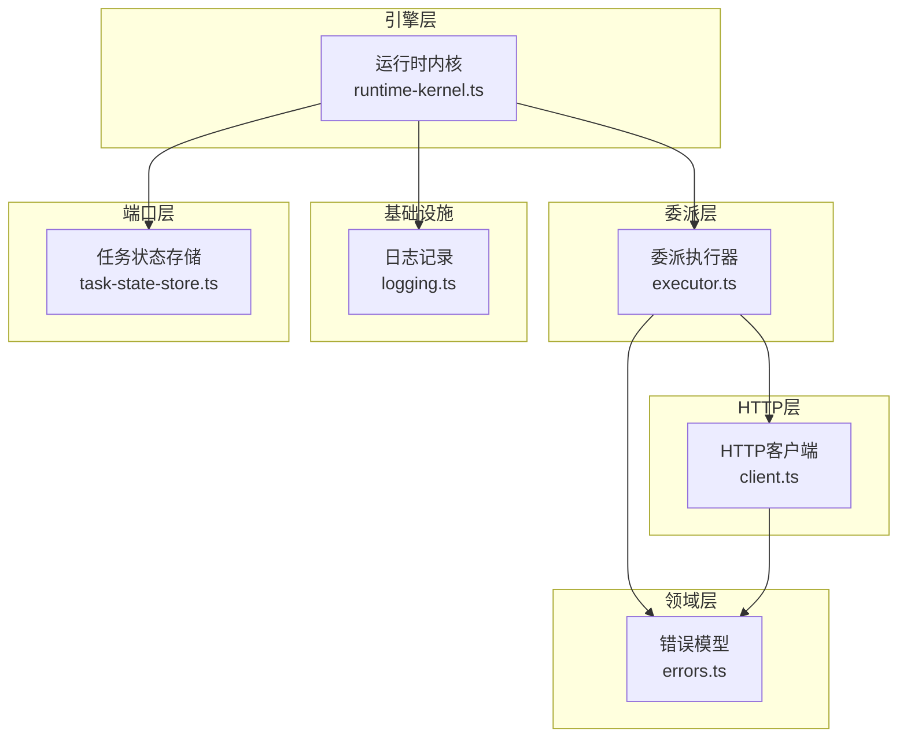
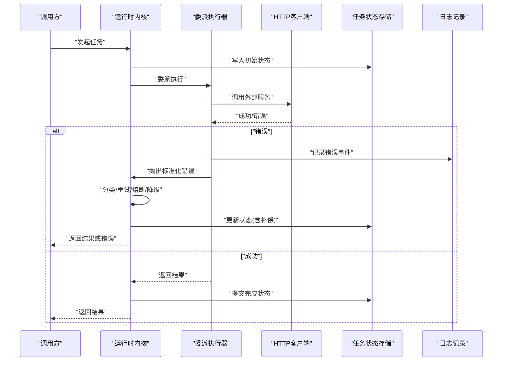
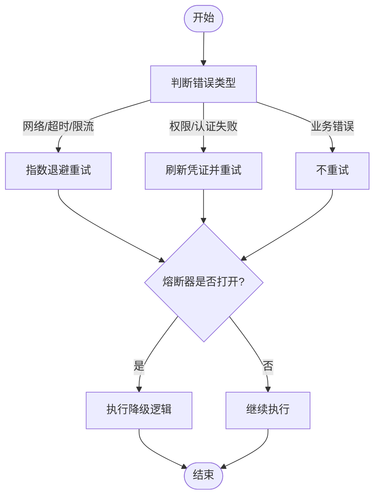
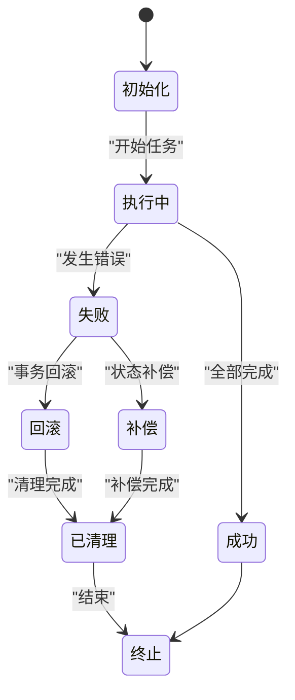
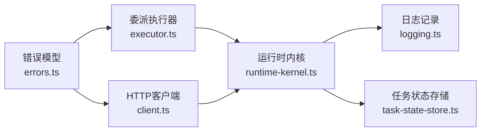

# 错误处理策略

<cite>
**本文引用的文件**   
- [engine/packages/domain-layer/src/errors.ts](file://engine/packages/domain-layer/src/errors.ts)
- [engine/packages/engine/src/runtime-kernel.ts](file://engine/packages/engine/src/runtime-kernel.ts)
- [engine/packages/delegation-layer/src/executor.ts](file://engine/packages/delegation-layer/src/executor.ts)
- [engine/packages/http-layer/src/client.ts](file://engine/packages/http-layer/src/client.ts)
- [engine/packages/foundation/src/retry.ts](file://engine/packages/foundation/src/retry.ts)
- [engine/packages/infrastructure/src/logging.ts](file://engine/packages/infrastructure/src/logging.ts)
- [engine/packages/ports-layer/src/task-state-store.ts](file://engine/packages/ports-layer/src/task-state-store.ts)
- [engine/tests/tool-dispatch-errors.test.ts](file://engine/tests/tool-dispatch-errors.test.ts)
- [engine/tests/runtime-kernel-crash-recovery.test.ts](file://engine/tests/runtime-kernel-crash-recovery.test.ts)
- [engine/tests/tool-storm-breaker.test.ts](file://engine/tests/tool-storm-breaker.test.ts)
</cite>

## 目录
1. [简介](#简介)
2. [项目结构](#项目结构)
3. [核心组件](#核心组件)
4. [架构总览](#架构总览)
5. [详细组件分析](#详细组件分析)
6. [依赖关系分析](#依赖关系分析)
7. [性能考量](#性能考量)
8. [故障排查指南](#故障排查指南)
9. [结论](#结论)
10. [附录](#附录)

## 简介
本文件面向KCoder在任务委派过程中的错误处理策略，覆盖错误分类、异常捕获与传播、重试与熔断降级、恢复与幂等、监控告警、日志规范与查询方法、常见场景与最佳实践，以及测试与模拟工具使用指南。目标是帮助开发者快速定位问题、统一错误语义、提升系统稳定性与可观测性。

## 项目结构
KCoder采用分层与多包协作的架构：领域层定义错误类型与契约；引擎运行时负责调度与容错；委派层执行子任务；HTTP层负责外部调用；基础设施提供日志与存储；端口层抽象持久化接口；测试覆盖关键路径。

图表来源
- [engine/packages/domain-layer/src/errors.ts](file://engine/packages/domain-layer/src/errors.ts)
- [engine/packages/engine/src/runtime-kernel.ts](file://engine/packages/engine/src/runtime-kernel.ts)
- [engine/packages/delegation-layer/src/executor.ts](file://engine/packages/delegation-layer/src/executor.ts)
- [engine/packages/http-layer/src/client.ts](file://engine/packages/http-layer/src/client.ts)
- [engine/packages/infrastructure/src/logging.ts](file://engine/packages/infrastructure/src/logging.ts)
- [engine/packages/ports-layer/src/task-state-store.ts](file://engine/packages/ports-layer/src/task-state-store.ts)

章节来源
- [engine/packages/domain-layer/src/errors.ts](file://engine/packages/domain-layer/src/errors.ts)
- [engine/packages/engine/src/runtime-kernel.ts](file://engine/packages/engine/src/runtime-kernel.ts)
- [engine/packages/delegation-layer/src/executor.ts](file://engine/packages/delegation-layer/src/executor.ts)
- [engine/packages/http-layer/src/client.ts](file://engine/packages/http-layer/src/client.ts)
- [engine/packages/infrastructure/src/logging.ts](file://engine/packages/infrastructure/src/logging.ts)
- [engine/packages/ports-layer/src/task-state-store.ts](file://engine/packages/ports-layer/src/task-state-store.ts)

## 核心组件
- 错误模型与分类：在领域层集中定义网络错误、执行错误、超时错误、权限错误等标准类型，并附带上下文字段（如请求ID、任务ID、堆栈片段）。
- 运行时内核：负责编排任务生命周期、捕获异常、标准化错误、触发重试/熔断/降级、持久化状态变更。
- 委派执行器：将具体动作委派给子执行器或工具，统一包装返回结果与错误，确保错误向上冒泡时携带必要上下文。
- HTTP客户端：封装对外部服务的调用，区分连接失败、超时、服务端错误、鉴权失败等，映射为领域错误。
- 基础设施日志：结构化记录错误事件，包含时间戳、级别、追踪ID、错误码、消息、上下文快照。
- 任务状态存储：以事务方式更新任务状态，支持回滚与补偿，保证最终一致性。

章节来源
- [engine/packages/domain-layer/src/errors.ts](file://engine/packages/domain-layer/src/errors.ts)
- [engine/packages/engine/src/runtime-kernel.ts](file://engine/packages/engine/src/runtime-kernel.ts)
- [engine/packages/delegation-layer/src/executor.ts](file://engine/packages/delegation-layer/src/executor.ts)
- [engine/packages/http-layer/src/client.ts](file://engine/packages/http-layer/src/client.ts)
- [engine/packages/infrastructure/src/logging.ts](file://engine/packages/infrastructure/src/logging.ts)
- [engine/packages/ports-layer/src/task-state-store.ts](file://engine/packages/ports-layer/src/task-state-store.ts)

## 架构总览
下图展示一次任务调用的端到端流程，包括错误捕获、分类、重试、熔断与降级、状态持久化与日志上报。

图表来源
- [engine/packages/engine/src/runtime-kernel.ts](file://engine/packages/engine/src/runtime-kernel.ts)
- [engine/packages/delegation-layer/src/executor.ts](file://engine/packages/delegation-layer/src/executor.ts)
- [engine/packages/http-layer/src/client.ts](file://engine/packages/http-layer/src/client.ts)
- [engine/packages/ports-layer/src/task-state-store.ts](file://engine/packages/ports-layer/src/task-state-store.ts)
- [engine/packages/infrastructure/src/logging.ts](file://engine/packages/infrastructure/src/logging.ts)

## 详细组件分析

### 错误分类与标准化
- 网络错误：连接失败、DNS解析失败、TLS握手失败等，通常由底层网络库抛出，需转换为领域错误并保留原始错误码与URL。
- 执行错误：业务逻辑异常、参数校验失败、资源不可用等，应包含错误码、用户可读消息与调试信息。
- 超时错误：请求或操作超过阈值，需区分客户端超时与服务端处理慢，附带耗时统计。
- 权限错误：鉴权失败、令牌过期、无访问权限等，需提示重试策略（如刷新令牌）与降级路径。
- 标准化：所有错误对象包含统一字段（类型、代码、消息、上下文快照、追踪ID），便于日志聚合与可视化。

章节来源
- [engine/packages/domain-layer/src/errors.ts](file://engine/packages/domain-layer/src/errors.ts)

### 异常捕获与传播机制
- 捕获点：在执行器与HTTP客户端边界进行try/catch，捕获未预期异常并转为领域错误。
- 传播规则：错误沿调用链向上传播，每层追加上下文（任务ID、步骤ID、调用栈片段），避免丢失根因。
- 兜底策略：顶层捕获未知错误，记录完整上下文并返回通用错误响应，防止进程崩溃。

章节来源
- [engine/packages/delegation-layer/src/executor.ts](file://engine/packages/delegation-layer/src/executor.ts)
- [engine/packages/http-layer/src/client.ts](file://engine/packages/http-layer/src/client.ts)
- [engine/packages/engine/src/runtime-kernel.ts](file://engine/packages/engine/src/runtime-kernel.ts)

### 重试策略：指数退避、熔断器与降级
- 指数退避：对瞬时错误（如网络抖动、限流）采用指数退避+随机抖动，限制最大重试次数与总时长。
- 熔断器：当错误率或延迟超过阈值时打开熔断，快速失败以避免雪崩；半开状态探测恢复。
- 降级处理：在熔断或依赖不可用时，返回缓存数据、默认值或友好提示，保障核心链路可用。

图表来源
- [engine/packages/foundation/src/retry.ts](file://engine/packages/foundation/src/retry.ts)
- [engine/packages/engine/src/runtime-kernel.ts](file://engine/packages/engine/src/runtime-kernel.ts)
- [engine/packages/delegation-layer/src/executor.ts](file://engine/packages/delegation-layer/src/executor.ts)

章节来源
- [engine/packages/foundation/src/retry.ts](file://engine/packages/foundation/src/retry.ts)
- [engine/packages/engine/src/runtime-kernel.ts](file://engine/packages/engine/src/runtime-kernel.ts)
- [engine/packages/delegation-layer/src/executor.ts](file://engine/packages/delegation-layer/src/executor.ts)

### 错误恢复机制：事务回滚、状态补偿与幂等性
- 事务回滚：在状态更新阶段使用事务，若后续步骤失败则回滚到一致状态。
- 状态补偿：对部分成功的中间状态，通过补偿动作撤销副作用（如删除临时文件、取消待发送消息）。
- 幂等性：对可重入操作引入幂等键，确保重复执行不会产生副作用。

图表来源
- [engine/packages/ports-layer/src/task-state-store.ts](file://engine/packages/ports-layer/src/task-state-store.ts)
- [engine/packages/engine/src/runtime-kernel.ts](file://engine/packages/engine/src/runtime-kernel.ts)

章节来源
- [engine/packages/ports-layer/src/task-state-store.ts](file://engine/packages/ports-layer/src/task-state-store.ts)
- [engine/packages/engine/src/runtime-kernel.ts](file://engine/packages/engine/src/runtime-kernel.ts)

### 错误监控与告警系统
- 错误收集：在关键路径记录结构化错误事件，包含错误码、消息、上下文快照、追踪ID、耗时。
- 分析与可视化：基于日志与指标构建仪表盘，展示错误趋势、热点错误、依赖健康度。
- 告警策略：按错误类型与严重级别设置阈值，触发通知（邮件、IM、工单），并关联SOP。

章节来源
- [engine/packages/infrastructure/src/logging.ts](file://engine/packages/infrastructure/src/logging.ts)
- [engine/packages/engine/src/runtime-kernel.ts](file://engine/packages/engine/src/runtime-kernel.ts)

### 错误日志记录规范与查询方法
- 记录规范：
  - 固定字段：时间戳、级别、追踪ID、任务ID、错误类型、错误码、消息、上下文快照、堆栈摘要。
  - 敏感信息脱敏：隐藏密钥、令牌、个人信息。
  - 层级清晰：入口、边界、内部处理分别记录，便于定位。
- 查询方法：
  - 按追踪ID检索全链路日志。
  - 按错误类型与错误码聚合统计。
  - 按时间段与任务维度过滤。
  - 结合指标看板查看错误率与P95/P99延迟。

章节来源
- [engine/packages/infrastructure/src/logging.ts](file://engine/packages/infrastructure/src/logging.ts)

### 常见错误场景与最佳实践
- 网络抖动：启用指数退避与随机抖动，限制最大重试次数；配合熔断器避免级联失败。
- 服务端限流：识别限流响应，增加等待与重试；必要时切换备用端点或走降级路径。
- 鉴权失败：自动刷新令牌并重试一次；多次失败提示用户重新登录。
- 超时：区分客户端与服务端超时，调整阈值与并发度；对长耗时操作采用异步与进度上报。
- 资源不足：检测磁盘、内存、句柄等资源，提前告警与优雅退出。
- 幂等设计：为写操作生成幂等键，避免重复提交导致数据不一致。

[本节为概念性指导，无需列出具体文件来源]

### 测试方法与模拟工具
- 单元测试：
  - 工具分发错误：验证错误分类、上下文附加与传播。
  - 运行时崩溃恢复：验证事务回滚与状态补偿。
  - 风暴熔断：验证熔断器阈值与半开探测。
- 集成测试：
  - 模拟HTTP错误：注入连接失败、超时、限流、鉴权失败等场景。
  - 模拟存储异常：验证回滚与补偿路径。
- 模拟工具：
  - 使用本地Mock服务器返回不同错误码与延迟。
  - 使用混沌工程注入网络分区与高延迟。
  - 使用断点与条件断点复现特定错误分支。

章节来源
- [engine/tests/tool-dispatch-errors.test.ts](file://engine/tests/tool-dispatch-errors.test.ts)
- [engine/tests/runtime-kernel-crash-recovery.test.ts](file://engine/tests/runtime-kernel-crash-recovery.test.ts)
- [engine/tests/tool-storm-breaker.test.ts](file://engine/tests/tool-storm-breaker.test.ts)

## 依赖关系分析
- 低耦合：领域错误模型独立于实现细节，便于替换HTTP客户端与存储后端。
- 明确边界：执行器与HTTP客户端作为边界层，负责错误转换与上下文增强。
- 可观测性：日志与状态存储在错误路径上强耦合，便于回溯与审计。

图表来源
- [engine/packages/domain-layer/src/errors.ts](file://engine/packages/domain-layer/src/errors.ts)
- [engine/packages/delegation-layer/src/executor.ts](file://engine/packages/delegation-layer/src/executor.ts)
- [engine/packages/http-layer/src/client.ts](file://engine/packages/http-layer/src/client.ts)
- [engine/packages/engine/src/runtime-kernel.ts](file://engine/packages/engine/src/runtime-kernel.ts)
- [engine/packages/infrastructure/src/logging.ts](file://engine/packages/infrastructure/src/logging.ts)
- [engine/packages/ports-layer/src/task-state-store.ts](file://engine/packages/ports-layer/src/task-state-store.ts)

章节来源
- [engine/packages/domain-layer/src/errors.ts](file://engine/packages/domain-layer/src/errors.ts)
- [engine/packages/delegation-layer/src/executor.ts](file://engine/packages/delegation-layer/src/executor.ts)
- [engine/packages/http-layer/src/client.ts](file://engine/packages/http-layer/src/client.ts)
- [engine/packages/engine/src/runtime-kernel.ts](file://engine/packages/engine/src/runtime-kernel.ts)
- [engine/packages/infrastructure/src/logging.ts](file://engine/packages/infrastructure/src/logging.ts)
- [engine/packages/ports-layer/src/task-state-store.ts](file://engine/packages/ports-layer/src/task-state-store.ts)

## 性能考量
- 重试与熔断：合理设置退避基数、抖动范围、最大重试次数与熔断阈值，避免放大负载。
- 日志开销：控制日志级别与采样率，避免高频错误导致I/O瓶颈。
- 状态存储：批量更新与事务合并，减少锁竞争与持久化压力。
- 超时配置：根据依赖SLA动态调整超时，避免过早失败或长时间阻塞。

[本节为通用指导，无需列出具体文件来源]

## 故障排查指南
- 快速定位：
  - 使用追踪ID检索全链路日志。
  - 按错误类型与错误码筛选热点错误。
  - 检查熔断器状态与重试计数。
- 常见问题：
  - 网络错误频发：检查DNS、代理、证书与带宽。
  - 超时频繁：评估服务端处理能力与并发度。
  - 权限错误：确认令牌有效期与权限范围。
- 恢复建议：
  - 立即回滚与补偿，确保状态一致。
  - 启用降级与缓存，优先保障核心功能。
  - 升级监控告警阈值，及时通知运维。

章节来源
- [engine/packages/infrastructure/src/logging.ts](file://engine/packages/infrastructure/src/logging.ts)
- [engine/packages/engine/src/runtime-kernel.ts](file://engine/packages/engine/src/runtime-kernel.ts)

## 结论
KCoder的错误处理策略以领域错误模型为核心，通过边界层的标准化转换、内核的统一编排与恢复机制，结合重试、熔断与降级，构建了稳健的任务委派体系。完善的日志与监控提升了可观测性与排障效率，测试与模拟工具保障了策略的正确性与鲁棒性。遵循本文规范与最佳实践，可显著提升系统的稳定性与用户体验。

[本节为总结性内容，无需列出具体文件来源]

## 附录
- 术语表：
  - 指数退避：重试间隔随尝试次数呈指数增长。
  - 熔断器：在错误率过高时快速失败，保护系统。
  - 幂等性：同一操作多次执行结果一致且无副作用。
- 参考测试用例：
  - 工具分发错误：[tool-dispatch-errors.test.ts](file://engine/tests/tool-dispatch-errors.test.ts)
  - 运行时崩溃恢复：[runtime-kernel-crash-recovery.test.ts](file://engine/tests/runtime-kernel-crash-recovery.test.ts)
  - 风暴熔断：[tool-storm-breaker.test.ts](file://engine/tests/tool-storm-breaker.test.ts)