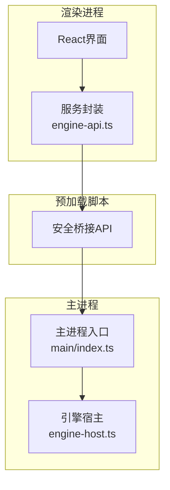
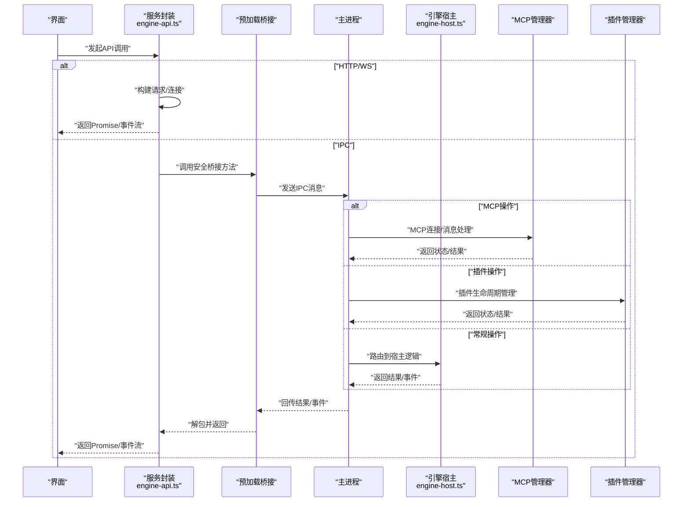
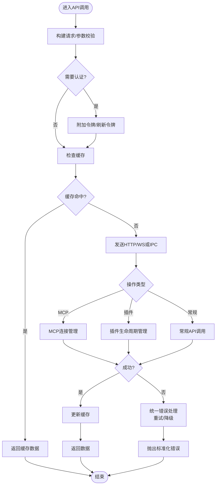
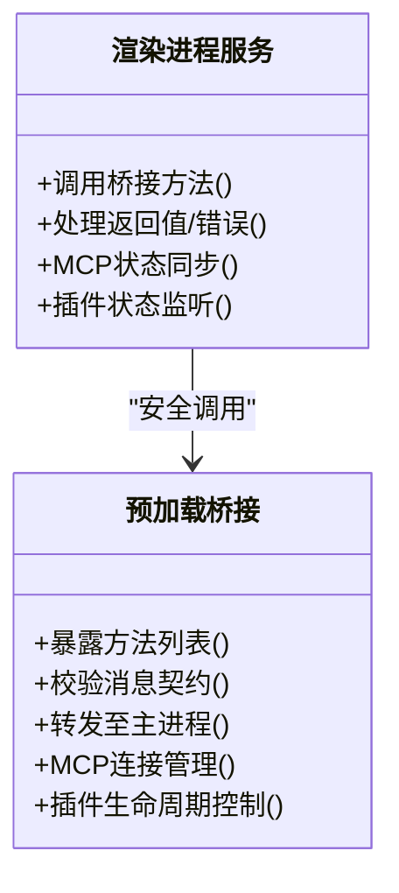
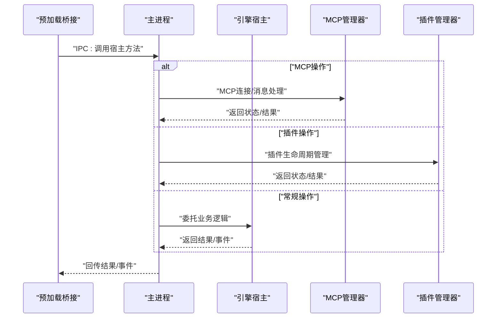
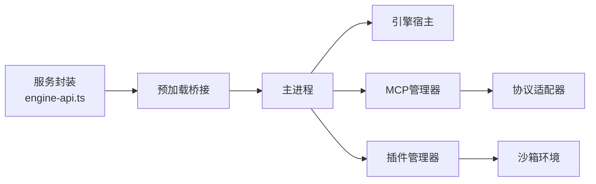

# API集成层

<cite>
**本文引用的文件**   
- [engine-api.ts](file://app/renderer/src/services/engine-api.ts)
- [index.ts（预加载）](file://app/preload/index.ts)
- [index.ts（主进程入口）](file://app/main/index.ts)
- [engine-host.ts](file://app/main/engine-host.ts)
</cite>

## 更新摘要
**变更内容**   
- 新增MCP连接管理功能，支持模型上下文协议的实时通信
- 增强插件管理系统，提供插件生命周期控制和状态同步
- 扩展后端API集成，实现数据持久化和实时更新机制
- 优化服务封装层，增加新的端点和服务函数

## 目录
1. [简介](#简介)
2. [项目结构](#项目结构)
3. [核心组件](#核心组件)
4. [架构总览](#架构总览)
5. [详细组件分析](#详细组件分析)
6. [依赖关系分析](#依赖关系分析)
7. [性能考虑](#性能考虑)
8. [故障排查指南](#故障排查指南)
9. [结论](#结论)
10. [附录](#附录)

## 简介
本文件面向KCoder的API集成层，聚焦渲染进程中的服务封装模块与Electron主进程的通信机制。文档围绕以下目标展开：
- 深入解释 engine-api.ts 的服务封装设计：HTTP请求封装、WebSocket连接管理、IPC通信接口
- 详细说明错误处理机制：统一错误捕获、重试策略、降级处理
- 解释缓存策略：请求缓存、响应缓存、缓存失效策略
- 说明认证与授权：令牌管理、权限验证、安全传输
- 详细介绍与Electron主进程的通信：预加载脚本作用、安全隔离、消息传递协议
- 提供API调用的性能优化方案：请求合并、并发控制、超时处理
- 包含API测试方法与调试技巧

**更新** 新增了MCP连接管理和插件管理功能的详细说明，包括数据持久化和实时状态更新机制。

## 项目结构
本项目采用Electron多进程架构：
- 渲染进程：React应用与服务封装层（engine-api.ts），负责发起HTTP/WS请求、维护本地状态、调用IPC接口
- 预加载脚本：暴露安全的桥接API给渲染进程，屏蔽原生Node能力，实现最小暴露面
- 主进程：承载engine-host等宿主逻辑，负责与引擎后端交互、资源管理与跨进程通信

章节来源
- [engine-api.ts:1-200](file://app/renderer/src/services/engine-api.ts#L1-L200)
- [index.ts（预加载）:1-200](file://app/preload/index.ts#L1-L200)
- [index.ts（主进程入口）:1-200](file://app/main/index.ts#L1-L200)
- [engine-host.ts:1-200](file://app/main/engine-host.ts#L1-L200)

## 核心组件
- 服务封装层（engine-api.ts）
  - HTTP请求封装：统一的请求构建、拦截器、错误归一化、重试与超时
  - WebSocket连接管理：连接生命周期、断线重连、心跳保活、事件分发
  - IPC通信接口：对预加载桥接的安全调用封装，抽象出业务方法
  - **新增** MCP连接管理：模型上下文协议的连接建立、消息路由、状态同步
  - **新增** 插件管理服务：插件安装、卸载、启停控制、版本管理
- 预加载脚本（preload/index.ts）
  - 暴露最小化的安全API，限制渲染进程直接访问Node/Electron原生能力
  - 定义IPC通道命名空间与消息契约
  - **新增** MCP和插件管理的IPC通道定义
- 主进程（main/index.ts, engine-host.ts）
  - 注册IPC处理器，转发到引擎宿主或外部服务
  - 管理引擎实例、会话、资源清理
  - **新增** MCP连接池管理和插件生命周期控制

章节来源
- [engine-api.ts:1-200](file://app/renderer/src/services/engine-api.ts#L1-L200)
- [index.ts（预加载）:1-200](file://app/preload/index.ts#L1-L200)
- [index.ts（主进程入口）:1-200](file://app/main/index.ts#L1-L200)
- [engine-host.ts:1-200](file://app/main/engine-host.ts#L1-L200)

## 架构总览
下图展示从UI到引擎宿主的端到端调用路径，包括HTTP/WS与IPC两条主线，以及新增的MCP连接和插件管理流程。

**图表来源**
- [engine-api.ts:1-200](file://app/renderer/src/services/engine-api.ts#L1-L200)
- [index.ts（预加载）:1-200](file://app/preload/index.ts#L1-L200)
- [index.ts（主进程入口）:1-200](file://app/main/index.ts#L1-L200)
- [engine-host.ts:1-200](file://app/main/engine-host.ts#L1-L200)

## 详细组件分析

### 服务封装层（engine-api.ts）
职责边界
- 统一HTTP客户端：封装基础URL、默认头、序列化/反序列化、错误归一化
- WebSocket管理器：建立连接、自动重连、心跳检测、事件订阅/发布
- IPC封装：将预加载暴露的方法包装为业务友好的函数，处理参数校验与错误映射
- 缓存层：请求去重、响应缓存、失效策略（按键+时间+条件）
- 认证与授权：注入令牌、刷新令牌、权限检查
- 错误处理：统一异常类型、重试退避、降级策略
- 性能优化：请求合并、并发上限、超时控制
- **新增** MCP连接管理：连接池维护、消息路由、状态同步、错误恢复
- **新增** 插件管理：插件发现、安装、卸载、版本控制、依赖管理

关键流程
- HTTP请求流程：构建请求 -> 附加认证 -> 命中缓存？ -> 发送请求 -> 解析响应 -> 更新缓存 -> 返回数据
- WS连接流程：初始化 -> 握手 -> 心跳 -> 监听事件 -> 断线重连 -> 恢复订阅
- IPC调用流程：参数校验 -> 调用预加载桥接 -> 等待主进程处理 -> 错误映射 -> 返回
- **新增** MCP连接流程：连接建立 -> 协议协商 -> 消息路由 -> 状态同步 -> 异常处理
- **新增** 插件管理流程：插件发现 -> 依赖检查 -> 安装部署 -> 生命周期控制 -> 状态监控

**图表来源**
- [engine-api.ts:1-200](file://app/renderer/src/services/engine-api.ts#L1-L200)

章节来源
- [engine-api.ts:1-200](file://app/renderer/src/services/engine-api.ts#L1-L200)

### 预加载脚本与安全桥接（preload/index.ts）
职责边界
- 暴露最小API集合，避免渲染进程直接访问Node/Electron
- 定义IPC通道命名空间与消息契约，确保类型一致
- 对敏感操作进行白名单校验与上下文绑定
- **新增** MCP相关IPC通道：连接管理、消息发送、状态监听
- **新增** 插件管理IPC通道：插件操作、状态查询、事件订阅

安全要点
- 仅暴露必要方法，拒绝任意eval或动态执行
- 对IPC消息进行签名/版本校验（如适用）
- 限制可访问的主进程模块范围
- **新增** MCP和插件操作的权限验证

**图表来源**
- [index.ts（预加载）:1-200](file://app/preload/index.ts#L1-L200)

章节来源
- [index.ts（预加载）:1-200](file://app/preload/index.ts#L1-L200)

### 主进程与引擎宿主（main/index.ts, engine-host.ts）
职责边界
- 注册IPC处理器，根据通道名路由到具体逻辑
- 管理引擎宿主实例，处理会话、任务、资源生命周期
- 对外部服务（HTTP/WS）进行代理与鉴权转发
- **新增** MCP连接池管理：连接复用、负载均衡、故障转移
- **新增** 插件管理器：插件注册、依赖解析、沙箱隔离、热重载
- **新增** 数据持久化：配置存储、状态快照、增量同步

**图表来源**
- [index.ts（主进程入口）:1-200](file://app/main/index.ts#L1-L200)
- [engine-host.ts:1-200](file://app/main/engine-host.ts#L1-L200)

章节来源
- [index.ts（主进程入口）:1-200](file://app/main/index.ts#L1-L200)
- [engine-host.ts:1-200](file://app/main/engine-host.ts#L1-L200)

## 依赖关系分析
- 渲染进程服务依赖预加载桥接以进行IPC调用
- 主进程依赖引擎宿主完成实际业务处理
- 服务封装层内部可能依赖网络库、缓存存储、日志与监控模块
- **新增** MCP管理器依赖协议适配器和连接池
- **新增** 插件管理器依赖沙箱环境和依赖解析器

**图表来源**
- [engine-api.ts:1-200](file://app/renderer/src/services/engine-api.ts#L1-L200)
- [index.ts（预加载）:1-200](file://app/preload/index.ts#L1-L200)
- [index.ts（主进程入口）:1-200](file://app/main/index.ts#L1-L200)
- [engine-host.ts:1-200](file://app/main/engine-host.ts#L1-L200)

章节来源
- [engine-api.ts:1-200](file://app/renderer/src/services/engine-api.ts#L1-L200)
- [index.ts（预加载）:1-200](file://app/preload/index.ts#L1-L200)
- [index.ts（主进程入口）:1-200](file://app/main/index.ts#L1-L200)
- [engine-host.ts:1-200](file://app/main/engine-host.ts#L1-L200)

## 性能考虑
- 请求合并：对短时间内的相同请求进行聚合，减少重复网络开销
- 并发控制：限制同时进行的请求数量，避免雪崩
- 超时处理：为HTTP/WS设置合理超时，结合重试退避提升稳定性
- 缓存策略：
  - 请求缓存：基于URL/参数生成唯一键，避免重复计算
  - 响应缓存：按TTL与条件失效，支持手动失效
  - 失效策略：按资源变更事件触发失效，或基于版本号/时间戳
- 连接复用：WS长连接复用，减少握手成本
- 背压与节流：在高频事件场景下对回调进行节流与队列化
- **新增** MCP连接池：连接复用、负载均衡、故障转移
- **新增** 插件懒加载：按需加载插件，减少启动时间
- **新增** 增量同步：只同步变更的数据，减少网络传输

[本节为通用性能建议，不直接分析具体文件]

## 故障排查指南
- 统一错误捕获
  - 在网络层与IPC层捕获异常，转换为标准化错误对象
  - 记录上下文信息（请求ID、时间戳、用户态）
- 重试策略
  - 针对瞬时错误（网络抖动、限流）实施指数退避重试
  - 对幂等请求启用重试，非幂等需谨慎
- 降级处理
  - 当上游不可用时返回缓存或空数据，提示用户
  - 切换备用通道（例如从WS降级为轮询）
- 调试技巧
  - 开启详细日志，输出请求/响应摘要与错误堆栈
  - 使用浏览器/开发者工具查看网络面板与IPC消息
  - 在主进程侧打印IPC路由与处理耗时
- **新增** MCP连接调试
  - 监控连接状态和消息路由
  - 记录协议协商过程和错误信息
- **新增** 插件问题诊断
  - 检查插件依赖和版本兼容性
  - 监控插件内存使用和CPU占用

章节来源
- [engine-api.ts:1-200](file://app/renderer/src/services/engine-api.ts#L1-L200)
- [index.ts（预加载）:1-200](file://app/preload/index.ts#L1-L200)
- [index.ts（主进程入口）:1-200](file://app/main/index.ts#L1-L200)
- [engine-host.ts:1-200](file://app/main/engine-host.ts#L1-L200)

## 结论
通过服务封装层、预加载桥接与主进程宿主的分层设计，KCoder实现了安全、稳定且高性能的API集成。统一错误处理、缓存与重试机制提升了用户体验与系统韧性；IPC最小暴露面保障了安全性。**新增的MCP连接管理和插件管理系统进一步增强了系统的可扩展性和实时性**。建议在后续迭代中持续完善监控指标、灰度策略与自动化测试覆盖。

[本节为总结性内容，不直接分析具体文件]

## 附录

### 认证与授权机制
- 令牌管理
  - 集中式令牌存储与注入，支持自动刷新
  - 令牌过期前主动续期，避免中断
- 权限验证
  - 在服务层校验用户角色与资源访问权限
  - 对敏感IPC方法进行白名单与上下文校验
- 安全传输
  - 强制HTTPS/WSS，禁用不安全协议
  - 对IPC消息进行签名与版本校验（如适用）

章节来源
- [engine-api.ts:1-200](file://app/renderer/src/services/engine-api.ts#L1-L200)
- [index.ts（预加载）:1-200](file://app/preload/index.ts#L1-L200)

### 缓存策略详解
- 请求缓存
  - 基于请求特征生成唯一键，避免重复请求
- 响应缓存
  - 支持TTL、条件失效、手动失效
- 失效策略
  - 基于资源变更事件、版本号或时间窗口
  - 批量失效与选择性失效

章节来源
- [engine-api.ts:1-200](file://app/renderer/src/services/engine-api.ts#L1-L200)

### API测试方法与调试技巧
- 单元测试
  - 对服务封装层进行Mock网络与IPC，验证错误处理与重试逻辑
- 集成测试
  - 使用测试服务器模拟上游服务，验证端到端流程
- 调试技巧
  - 打开详细日志，观察请求/响应与IPC消息
  - 使用断点与回放工具复现问题
- **新增** MCP连接测试
  - 模拟MCP服务器进行端到端测试
  - 验证连接建立、消息路由和状态同步
- **新增** 插件测试
  - 使用沙箱环境测试插件功能
  - 验证插件生命周期和错误处理

章节来源
- [engine-api.ts:1-200](file://app/renderer/src/services/engine-api.ts#L1-L200)
- [index.ts（预加载）:1-200](file://app/preload/index.ts#L1-L200)
- [index.ts（主进程入口）:1-200](file://app/main/index.ts#L1-L200)
- [engine-host.ts:1-200](file://app/main/engine-host.ts#L1-L200)

### MCP连接管理
- 连接池管理
  - 连接复用和负载均衡
  - 自动重连和故障转移
- 消息路由
  - 基于消息类型的智能路由
  - 异步消息处理和状态跟踪
- 状态同步
  - 实时状态更新和事件通知
  - 连接健康检查和监控

### 插件管理系统
- 插件生命周期
  - 插件发现、安装、卸载、启停控制
  - 版本管理和依赖解析
- 沙箱隔离
  - 插件运行环境隔离
  - 资源限制和安全检查
- 热重载
  - 插件更新无需重启应用
  - 状态保持和迁移支持