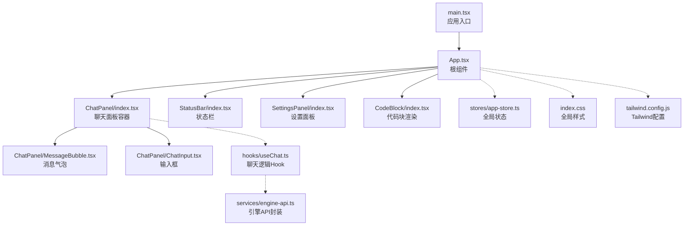
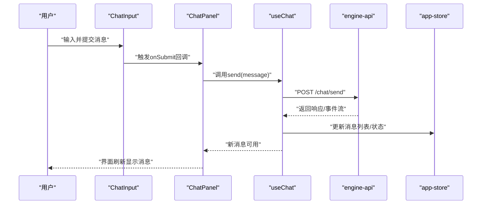
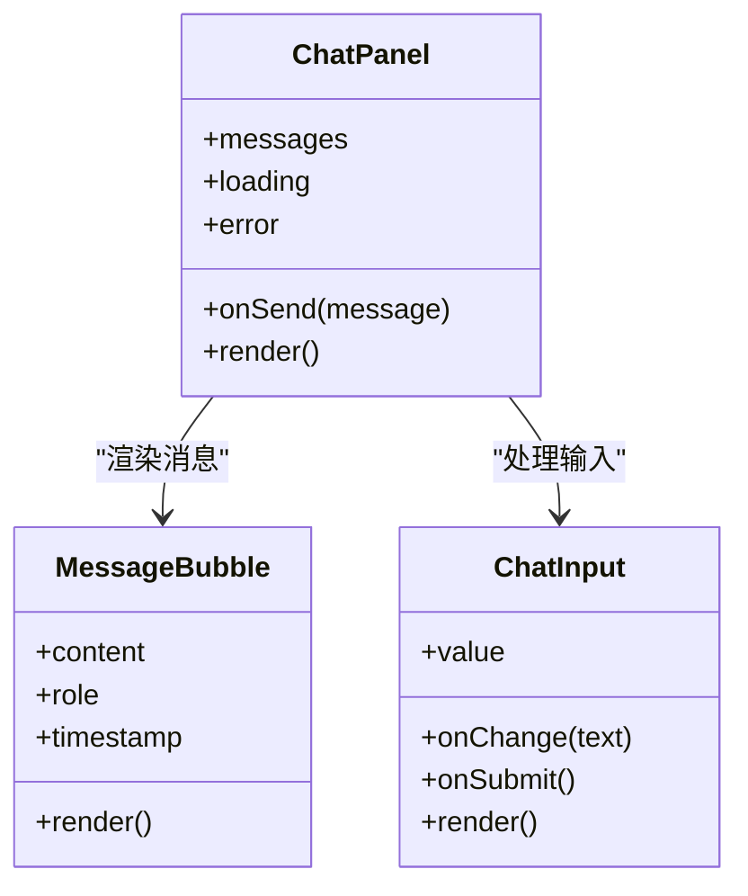
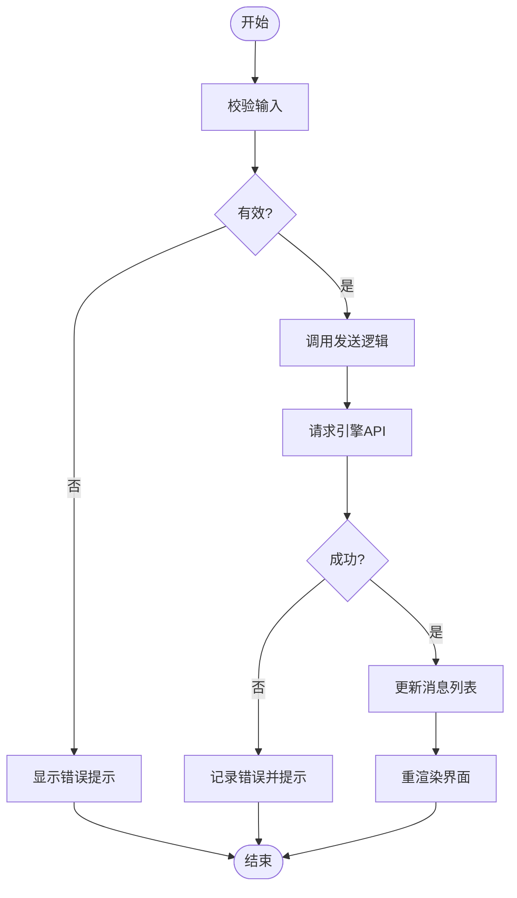
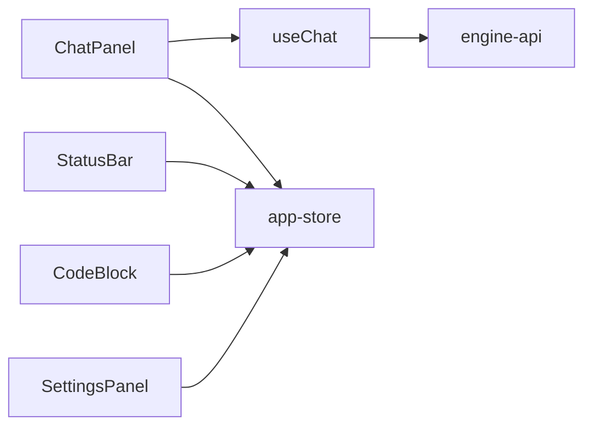

# React组件体系

<cite>
**本文引用的文件**   
- [main.tsx](file://app/renderer/src/main.tsx)
- [App.tsx](file://app/renderer/src/App.tsx)
- [ChatPanel/index.tsx](file://app/renderer/src/components/ChatPanel/index.tsx)
- [ChatPanel/MessageBubble.tsx](file://app/renderer/src/components/ChatPanel/MessageBubble.tsx)
- [ChatPanel/ChatInput.tsx](file://app/renderer/src/components/ChatPanel/ChatInput.tsx)
- [StatusBar/index.tsx](file://app/renderer/src/components/StatusBar/index.tsx)
- [CodeBlock/index.tsx](file://app/renderer/src/components/CodeBlock/index.tsx)
- [SettingsPanel/index.tsx](file://app/renderer/src/components/SettingsPanel/index.tsx)
- [useChat.ts](file://app/renderer/src/hooks/useChat.ts)
- [engine-api.ts](file://app/renderer/src/services/engine-api.ts)
- [app-store.ts](file://app/renderer/src/stores/app-store.ts)
- [index.css](file://app/renderer/src/index.css)
- [tailwind.config.js](file://app/renderer/src/tailwind.config.js)
</cite>

## 目录
1. [简介](#简介)
2. [项目结构](#项目结构)
3. [核心组件](#核心组件)
4. [架构总览](#架构总览)
5. [详细组件分析](#详细组件分析)
6. [依赖关系分析](#依赖关系分析)
7. [性能考虑](#性能考虑)
8. [故障排查指南](#故障排查指南)
9. [结论](#结论)
10. [附录](#附录)

## 简介
本文件面向KCoder的React前端渲染层，系统化梳理组件层次、通信机制、状态管理、样式与主题、生命周期与错误边界、性能优化策略，以及测试与调试方法。目标是帮助开发者快速理解并高效扩展聊天面板、侧边栏、状态栏等核心UI模块，同时保证可维护性与一致性。

## 项目结构
渲染层位于 app/renderer/src，采用“功能域+共享能力”的组织方式：
- components：按功能划分组件目录（如 ChatPanel、StatusBar、CodeBlock、SettingsPanel）
- hooks：自定义Hook封装业务逻辑（如 useChat）
- services：对外部引擎或API的封装（如 engine-api）
- stores：全局状态存储（如 app-store）
- App.tsx：根组件，组织页面布局与路由/视图切换
- main.tsx：应用入口，挂载根组件、初始化全局配置

图表来源
- [main.tsx](file://app/renderer/src/main.tsx)
- [App.tsx](file://app/renderer/src/App.tsx)
- [ChatPanel/index.tsx](file://app/renderer/src/components/ChatPanel/index.tsx)
- [ChatPanel/MessageBubble.tsx](file://app/renderer/src/components/ChatPanel/MessageBubble.tsx)
- [ChatPanel/ChatInput.tsx](file://app/renderer/src/components/ChatPanel/ChatInput.tsx)
- [StatusBar/index.tsx](file://app/renderer/src/components/StatusBar/index.tsx)
- [SettingsPanel/index.tsx](file://app/renderer/src/components/SettingsPanel/index.tsx)
- [CodeBlock/index.tsx](file://app/renderer/src/components/CodeBlock/index.tsx)
- [useChat.ts](file://app/renderer/src/hooks/useChat.ts)
- [engine-api.ts](file://app/renderer/src/services/engine-api.ts)
- [app-store.ts](file://app/renderer/src/stores/app-store.ts)
- [index.css](file://app/renderer/src/index.css)
- [tailwind.config.js](file://app/renderer/src/tailwind.config.js)

章节来源
- [main.tsx](file://app/renderer/src/main.tsx)
- [App.tsx](file://app/renderer/src/App.tsx)

## 核心组件
- ChatPanel 聊天面板
  - 职责：承载对话列表、消息渲染、用户输入；协调消息发送与接收流程
  - 子组件：MessageBubble（单条消息展示）、ChatInput（输入与提交）
  - 数据流：从 useChat Hook 获取消息列表与发送函数，必要时读取 app-store 的全局上下文
- StatusBar 状态栏
  - 职责：显示应用运行状态、连接信息、操作提示等
  - 数据来源：app-store 或本地状态，通过 props 向子项传递
- CodeBlock 代码块
  - 职责：高亮与格式化展示代码片段，支持复制、折叠等交互
  - 复用策略：在 ChatPanel 的消息内容中按需嵌入
- SettingsPanel 设置面板
  - 职责：提供用户偏好与引擎参数配置入口
  - 集成点：与 app-store 双向同步，持久化到后端或本地存储

章节来源
- [ChatPanel/index.tsx](file://app/renderer/src/components/ChatPanel/index.tsx)
- [ChatPanel/MessageBubble.tsx](file://app/renderer/src/components/ChatPanel/MessageBubble.tsx)
- [ChatPanel/ChatInput.tsx](file://app/renderer/src/components/ChatPanel/ChatInput.tsx)
- [StatusBar/index.tsx](file://app/renderer/src/components/StatusBar/index.tsx)
- [CodeBlock/index.tsx](file://app/renderer/src/components/CodeBlock/index.tsx)
- [SettingsPanel/index.tsx](file://app/renderer/src/components/SettingsPanel/index.tsx)

## 架构总览
整体采用“容器组件 + 展示组件 + Hook + Store + Service”的分层模式：
- 容器组件：负责编排数据与行为（如 ChatPanel）
- 展示组件：纯UI呈现（如 MessageBubble、ChatInput）
- Hook：封装复杂逻辑与副作用（如 useChat）
- Store：集中式状态（如 app-store）
- Service：外部通信（如 engine-api）

图表来源
- [ChatPanel/index.tsx](file://app/renderer/src/components/ChatPanel/index.tsx)
- [ChatPanel/ChatInput.tsx](file://app/renderer/src/components/ChatPanel/ChatInput.tsx)
- [useChat.ts](file://app/renderer/src/hooks/useChat.ts)
- [engine-api.ts](file://app/renderer/src/services/engine-api.ts)
- [app-store.ts](file://app/renderer/src/stores/app-store.ts)

## 详细组件分析

### ChatPanel 聊天面板
- 设计模式
  - 容器组件：聚合 useChat 的状态与动作，向下分发 props
  - 组合模式：组合 MessageBubble 与 ChatInput，形成完整对话体验
- 关键职责
  - 维护消息列表与滚动定位
  - 处理发送、加载、错误状态
  - 与 app-store 同步上下文（如会话ID、模型选择）
- 复用策略
  - 将消息渲染与输入逻辑解耦为独立子组件
  - 通过 props 暴露最小接口，便于在不同布局中复用

图表来源
- [ChatPanel/index.tsx](file://app/renderer/src/components/ChatPanel/index.tsx)
- [ChatPanel/MessageBubble.tsx](file://app/renderer/src/components/ChatPanel/MessageBubble.tsx)
- [ChatPanel/ChatInput.tsx](file://app/renderer/src/components/ChatPanel/ChatInput.tsx)

章节来源
- [ChatPanel/index.tsx](file://app/renderer/src/components/ChatPanel/index.tsx)
- [ChatPanel/MessageBubble.tsx](file://app/renderer/src/components/ChatPanel/MessageBubble.tsx)
- [ChatPanel/ChatInput.tsx](file://app/renderer/src/components/ChatPanel/ChatInput.tsx)

### StatusBar 状态栏
- 设计模式
  - 展示型组件：以只读形式呈现系统状态
  - 订阅模式：监听 app-store 的变化进行局部更新
- 关键职责
  - 显示连接状态、当前模型、任务进度等
  - 提供轻量操作入口（如重置、查看日志）
- 复用策略
  - 通过 props 注入不同状态源，适配多场景

章节来源
- [StatusBar/index.tsx](file://app/renderer/src/components/StatusBar/index.tsx)

### CodeBlock 代码块
- 设计模式
  - 展示型组件：专注代码渲染与交互
- 关键职责
  - 语法高亮、行号、复制、折叠
  - 安全渲染（防XSS）
- 复用策略
  - 作为通用富文本节点被 ChatPanel 或其他内容区域复用

章节来源
- [CodeBlock/index.tsx](file://app/renderer/src/components/CodeBlock/index.tsx)

### SettingsPanel 设置面板
- 设计模式
  - 表单驱动：基于字段映射与校验
- 关键职责
  - 编辑引擎参数、主题、快捷键等
  - 保存与回滚
- 复用策略
  - 通过统一的数据契约与验证规则，便于扩展新的设置项

章节来源
- [SettingsPanel/index.tsx](file://app/renderer/src/components/SettingsPanel/index.tsx)

### 概念性概览
以下流程图展示了“发送消息”的端到端处理路径，适用于理解组件间协作与数据流向。

[此图为概念流程，不直接映射具体源码文件]

## 依赖关系分析
- 组件内聚与耦合
  - ChatPanel 对 useChat 与 app-store 存在较强依赖，但通过 Hook 与 Store 抽象降低与具体实现的耦合
  - StatusBar 仅依赖 app-store 的只读切片，保持低耦合
- 外部依赖
  - engine-api 封装网络请求、重试、错误归一化
  - Tailwind 与 CSS 变量提供主题与样式基础
- 可能的循环依赖
  - 建议避免组件与 Hook/Store 之间的相互导入，确保单向依赖链

图表来源
- [ChatPanel/index.tsx](file://app/renderer/src/components/ChatPanel/index.tsx)
- [useChat.ts](file://app/renderer/src/hooks/useChat.ts)
- [engine-api.ts](file://app/renderer/src/services/engine-api.ts)
- [app-store.ts](file://app/renderer/src/stores/app-store.ts)
- [StatusBar/index.tsx](file://app/renderer/src/components/StatusBar/index.tsx)
- [CodeBlock/index.tsx](file://app/renderer/src/components/CodeBlock/index.tsx)
- [SettingsPanel/index.tsx](file://app/renderer/src/components/SettingsPanel/index.tsx)

章节来源
- [useChat.ts](file://app/renderer/src/hooks/useChat.ts)
- [engine-api.ts](file://app/renderer/src/services/engine-api.ts)
- [app-store.ts](file://app/renderer/src/stores/app-store.ts)

## 性能考虑
- 渲染优化
  - 使用 React.memo 包裹展示型组件（如 MessageBubble、CodeBlock），减少不必要的重渲染
  - 对长列表实现虚拟滚动或分页加载，控制DOM节点数量
- 状态更新
  - 将频繁更新的局部状态下沉至子组件，避免父组件全量重渲染
  - 使用不可变数据结构与增量更新，提高比较效率
- 网络与I/O
  - 对引擎API请求做去抖与节流，避免重复请求
  - 失败重试与退避策略，提升稳定性
- 资源加载
  - 懒加载非首屏组件（如 SettingsPanel）
  - 代码分割与按需引入第三方库（如语法高亮）

[本节为通用指导，不直接分析具体文件]

## 故障排查指南
- 常见问题定位
  - 消息未显示：检查 useChat 的发送流程与 app-store 更新是否生效
  - 输入无响应：确认 ChatInput 的 onChange/onSubmit 绑定是否正确
  - 状态栏异常：核对 app-store 对应字段是否存在与类型是否匹配
- 调试方法
  - 在关键Hook与Service处添加日志输出，追踪数据流
  - 使用浏览器开发者工具的时间线面板分析重渲染热点
  - 针对网络问题，捕获并打印请求/响应摘要
- 错误边界
  - 为易崩溃的展示组件（如 CodeBlock）包裹错误边界，避免整页崩溃
  - 统一错误提示与上报，便于问题回溯

章节来源
- [useChat.ts](file://app/renderer/src/hooks/useChat.ts)
- [engine-api.ts](file://app/renderer/src/services/engine-api.ts)
- [app-store.ts](file://app/renderer/src/stores/app-store.ts)

## 结论
KCoder的React组件体系遵循清晰的层次与职责分离：容器组件编排数据与行为，展示组件专注UI呈现，Hook封装复杂逻辑，Store集中状态，Service隔离外部依赖。通过合理的props传递、事件处理与状态共享，结合性能优化与错误边界策略，能够构建稳定、可扩展且易于维护的前端界面。建议在后续迭代中持续完善测试覆盖与主题定制能力，进一步提升开发效率与用户体验。

## 附录

### 组件通信机制
- Props传递
  - 自上而下传递数据与回调，保持单向数据流
- 事件处理
  - 子组件通过回调通知父组件，父组件决定状态变更
- 状态共享
  - 通过 app-store 提供跨组件共享状态，Hook与组件按需订阅

章节来源
- [ChatPanel/index.tsx](file://app/renderer/src/components/ChatPanel/index.tsx)
- [app-store.ts](file://app/renderer/src/stores/app-store.ts)

### 生命周期管理与错误边界
- 生命周期
  - 使用Effect钩子管理副作用（如订阅、定时器、网络请求）
  - 清理函数确保资源释放，避免内存泄漏
- 错误边界
  - 在高风险组件外层包裹错误边界，捕获渲染期错误并降级展示

章节来源
- [useChat.ts](file://app/renderer/src/hooks/useChat.ts)
- [CodeBlock/index.tsx](file://app/renderer/src/components/CodeBlock/index.tsx)

### 样式组织与主题定制
- 样式组织
  - 使用Tailwind原子类进行快速布局与样式定义
  - index.css 存放全局样式与CSS变量
- 主题定制
  - 通过Tailwind配置扩展颜色、字体、间距等主题变量
  - 利用CSS变量实现运行时主题切换

章节来源
- [index.css](file://app/renderer/src/index.css)
- [tailwind.config.js](file://app/renderer/src/tailwind.config.js)

### 最佳实践与代码规范
- 组件拆分
  - 单一职责，尽量将大组件拆分为小且可复用的子组件
- 命名约定
  - 组件名使用PascalCase，文件名与目录名保持一致
- 类型安全
  - 使用TypeScript严格模式，明确Props与State类型
- 可测试性
  - 将业务逻辑抽离至Hook或服务层，便于单元测试

[本节为通用指导，不直接分析具体文件]

### 测试策略与调试方法
- 单元测试
  - 对Hook与服务层进行断言，模拟网络与状态变化
- 组件测试
  - 使用渲染与交互测试框架验证用户流程
- 集成测试
  - 端到端验证消息发送、状态更新与界面反馈
- 调试技巧
  - 使用控制台日志与断点定位问题
  - 借助时间线与性能面板分析瓶颈

[本节为通用指导，不直接分析具体文件]