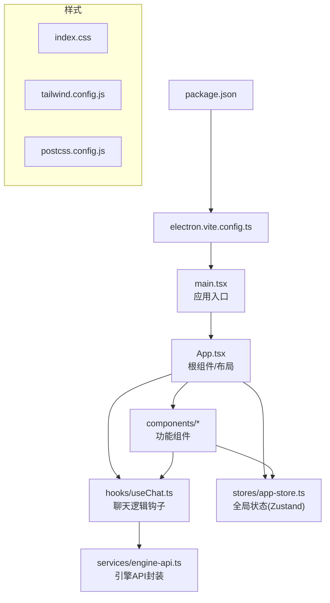
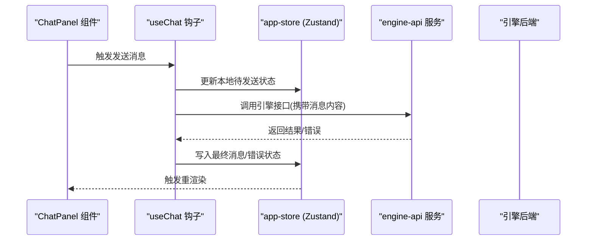
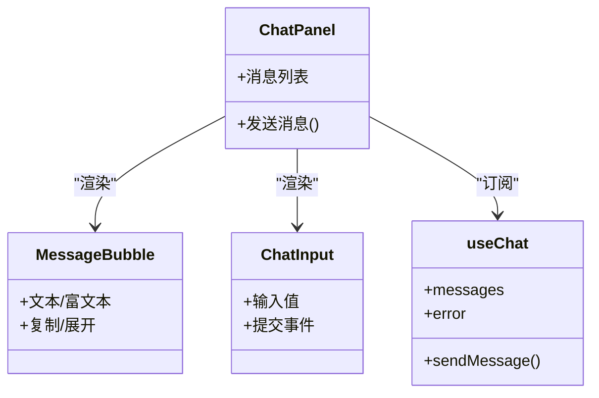
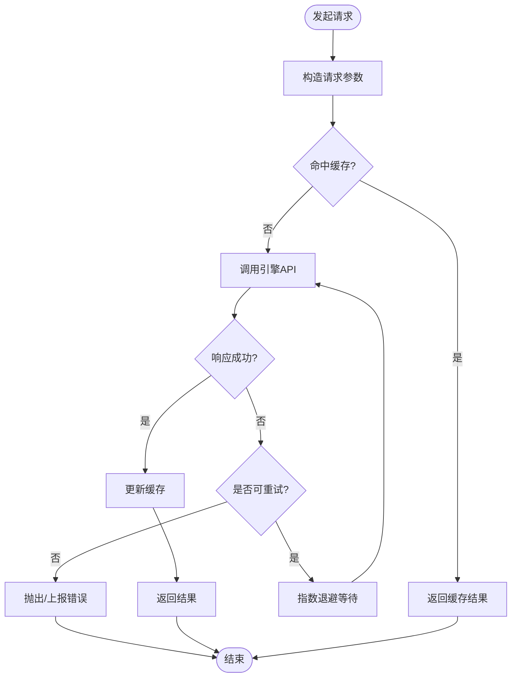
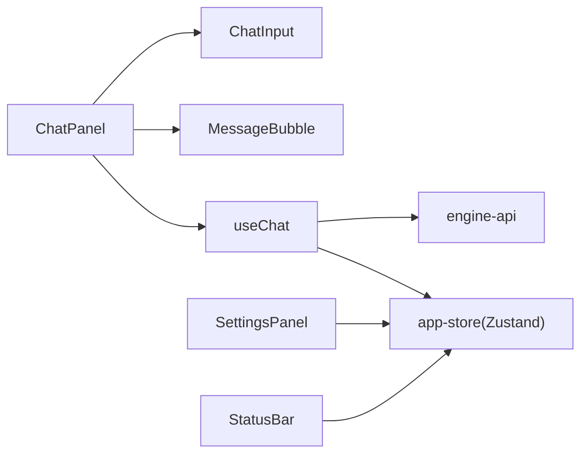

# 前端架构

<cite>
**本文引用的文件**   
- [app/renderer/src/main.tsx](file://app/renderer/src/main.tsx)
- [app/renderer/src/App.tsx](file://app/renderer/src/App.tsx)
- [app/renderer/src/index.css](file://app/renderer/src/index.css)
- [app/renderer/src/hooks/useChat.ts](file://app/renderer/src/hooks/useChat.ts)
- [app/renderer/src/services/engine-api.ts](file://app/renderer/src/services/engine-api.ts)
- [app/renderer/src/stores/app-store.ts](file://app/renderer/src/stores/app-store.ts)
- [app/renderer/src/components/ChatPanel/index.tsx](file://app/renderer/src/components/ChatPanel/index.tsx)
- [app/renderer/src/components/ChatPanel/MessageBubble.tsx](file://app/renderer/src/components/ChatPanel/MessageBubble.tsx)
- [app/renderer/src/components/ChatPanel/ChatInput.tsx](file://app/renderer/src/components/ChatPanel/ChatInput.tsx)
- [app/renderer/src/components/CodeBlock/index.tsx](file://app/renderer/src/components/CodeBlock/index.tsx)
- [app/renderer/src/components/SettingsPanel/index.tsx](file://app/renderer/src/components/SettingsPanel/index.tsx)
- [app/renderer/src/components/StatusBar/index.tsx](file://app/renderer/src/components/StatusBar/index.tsx)
- [app/tailwind.config.js](file://app/tailwind.config.js)
- [app/postcss.config.js](file://app/postcss.config.js)
- [app/electron.vite.config.ts](file://app/electron.vite.config.ts)
- [app/package.json](file://app/package.json)
</cite>

## 目录
1. [简介](#简介)
2. [项目结构](#项目结构)
3. [核心组件](#核心组件)
4. [架构总览](#架构总览)
5. [详细组件分析](#详细组件分析)
6. [依赖关系分析](#依赖关系分析)
7. [性能考虑](#性能考虑)
8. [故障排查指南](#故障排查指南)
9. [结论](#结论)
10. [附录](#附录)

## 简介
本文件面向KCoder的前端架构，聚焦于Electron渲染进程中的React应用。文档围绕以下目标展开：
- React组件体系设计：层次结构、复用策略与样式组织
- 状态管理架构：Zustand使用、数据流设计与状态持久化
- 路由与导航系统：页面跳转、参数传递与权限控制（当前实现说明）
- API集成层：引擎API封装、错误处理、重试机制与缓存策略
- 样式系统：Tailwind CSS配置、主题定制与响应式设计
- 构建与打包：Vite配置、代码分割与懒加载
- 性能优化最佳实践：代码优化、内存管理与渲染优化
- 测试策略与调试方法
- 跨浏览器兼容性方案

## 项目结构
前端位于 app/renderer 目录，采用基于功能分区的目录组织方式：
- components：按功能域划分的UI组件（如聊天面板、代码块、设置面板、状态栏）
- hooks：可复用的业务逻辑钩子（如 useChat）
- services：对外部服务或引擎的API封装
- stores：基于Zustand的全局状态管理
- main.tsx：应用入口，挂载根组件
- App.tsx：顶层布局与路由容器（当前为单页应用）
- index.css：全局样式入口
- tailwind.config.js / postcss.config.js：样式系统与构建配置
- electron.vite.config.ts：Vite + Electron 构建配置
- package.json：依赖与脚本

图表来源
- [app/renderer/src/main.tsx](file://app/renderer/src/main.tsx)
- [app/renderer/src/App.tsx](file://app/renderer/src/App.tsx)
- [app/renderer/src/hooks/useChat.ts](file://app/renderer/src/hooks/useChat.ts)
- [app/renderer/src/services/engine-api.ts](file://app/renderer/src/services/engine-api.ts)
- [app/renderer/src/stores/app-store.ts](file://app/renderer/src/stores/app-store.ts)
- [app/renderer/src/index.css](file://app/renderer/src/index.css)
- [app/tailwind.config.js](file://app/tailwind.config.js)
- [app/postcss.config.js](file://app/postcss.config.js)
- [app/electron.vite.config.ts](file://app/electron.vite.config.ts)
- [app/package.json](file://app/package.json)

章节来源
- [app/renderer/src/main.tsx](file://app/renderer/src/main.tsx)
- [app/renderer/src/App.tsx](file://app/renderer/src/App.tsx)
- [app/renderer/src/index.css](file://app/renderer/src/index.css)
- [app/tailwind.config.js](file://app/tailwind.config.js)
- [app/postcss.config.js](file://app/postcss.config.js)
- [app/electron.vite.config.ts](file://app/electron.vite.config.ts)
- [app/package.json](file://app/package.json)

## 核心组件
- 聊天面板 ChatPanel
  - 职责：展示消息列表、输入框与发送交互；聚合消息气泡与输入组件
  - 关键子组件：MessageBubble（消息气泡）、ChatInput（输入区）
  - 数据源：通过 useChat 钩子获取并操作状态
- 代码块 CodeBlock
  - 职责：高亮/格式化显示代码片段，支持复制等辅助能力
- 设置面板 SettingsPanel
  - 职责：提供用户偏好与引擎相关配置项
- 状态栏 StatusBar
  - 职责：展示应用运行状态、连接信息、版本等

组件复用策略
- 将通用交互拆分为独立组件（如 MessageBubble、ChatInput），在多处复用
- 通过 props 暴露最小必要接口，保持组件内聚
- 复杂交互逻辑下沉至 hooks（useChat），避免在组件中堆积副作用

章节来源
- [app/renderer/src/components/ChatPanel/index.tsx](file://app/renderer/src/components/ChatPanel/index.tsx)
- [app/renderer/src/components/ChatPanel/MessageBubble.tsx](file://app/renderer/src/components/ChatPanel/MessageBubble.tsx)
- [app/renderer/src/components/ChatPanel/ChatInput.tsx](file://app/renderer/src/components/ChatPanel/ChatInput.tsx)
- [app/renderer/src/components/CodeBlock/index.tsx](file://app/renderer/src/components/CodeBlock/index.tsx)
- [app/renderer/src/components/SettingsPanel/index.tsx](file://app/renderer/src/components/SettingsPanel/index.tsx)
- [app/renderer/src/components/StatusBar/index.tsx](file://app/renderer/src/components/StatusBar/index.tsx)

## 架构总览
整体采用“组件 -> 钩子 -> 状态 -> API”的分层模式：
- 组件层：负责视图与用户交互
- 钩子层：封装业务逻辑与副作用（如网络请求、事件订阅）
- 状态层：Zustand store 作为单一事实来源，供组件订阅
- API层：统一封装对引擎的调用，集中处理错误、重试与缓存

图表来源
- [app/renderer/src/components/ChatPanel/index.tsx](file://app/renderer/src/components/ChatPanel/index.tsx)
- [app/renderer/src/hooks/useChat.ts](file://app/renderer/src/hooks/useChat.ts)
- [app/renderer/src/stores/app-store.ts](file://app/renderer/src/stores/app-store.ts)
- [app/renderer/src/services/engine-api.ts](file://app/renderer/src/services/engine-api.ts)

## 详细组件分析

### 聊天面板 ChatPanel
- 组件层次
  - ChatPanel 组合 MessageBubble 与 ChatInput
  - 通过 useChat 获取消息列表与发送函数
- 数据流
  - 用户输入 -> ChatInput 回调 -> useChat -> Zustand store -> 组件重渲染
- 错误处理
  - 在 useChat 中捕获异常并写入错误状态，由组件提示用户
- 性能优化
  - 仅订阅必要的 store 切片，减少不必要重渲染
  - 长列表建议结合虚拟滚动（可扩展）

图表来源
- [app/renderer/src/components/ChatPanel/index.tsx](file://app/renderer/src/components/ChatPanel/index.tsx)
- [app/renderer/src/components/ChatPanel/MessageBubble.tsx](file://app/renderer/src/components/ChatPanel/MessageBubble.tsx)
- [app/renderer/src/components/ChatPanel/ChatInput.tsx](file://app/renderer/src/components/ChatPanel/ChatInput.tsx)
- [app/renderer/src/hooks/useChat.ts](file://app/renderer/src/hooks/useChat.ts)

章节来源
- [app/renderer/src/components/ChatPanel/index.tsx](file://app/renderer/src/components/ChatPanel/index.tsx)
- [app/renderer/src/components/ChatPanel/MessageBubble.tsx](file://app/renderer/src/components/ChatPanel/MessageBubble.tsx)
- [app/renderer/src/components/ChatPanel/ChatInput.tsx](file://app/renderer/src/components/ChatPanel/ChatInput.tsx)
- [app/renderer/src/hooks/useChat.ts](file://app/renderer/src/hooks/useChat.ts)

### 代码块 CodeBlock
- 职责：安全地渲染代码片段，提供语法高亮与复制能力
- 扩展点：可通过插件或主题切换高亮风格
- 性能：大段代码建议使用惰性加载与增量渲染

章节来源
- [app/renderer/src/components/CodeBlock/index.tsx](file://app/renderer/src/components/CodeBlock/index.tsx)

### 设置面板 SettingsPanel
- 职责：读取/保存用户偏好与引擎配置
- 与状态层：读写 app-store 中的设置项
- 与API层：必要时持久化到本地存储或远端配置中心

章节来源
- [app/renderer/src/components/SettingsPanel/index.tsx](file://app/renderer/src/components/SettingsPanel/index.tsx)
- [app/renderer/src/stores/app-store.ts](file://app/renderer/src/stores/app-store.ts)

### 状态栏 StatusBar
- 职责：展示应用运行状态、连接状态、版本信息等
- 数据来源：app-store 中的全局状态

章节来源
- [app/renderer/src/components/StatusBar/index.tsx](file://app/renderer/src/components/StatusBar/index.tsx)
- [app/renderer/src/stores/app-store.ts](file://app/renderer/src/stores/app-store.ts)

### 状态管理：Zustand 与数据流
- 设计要点
  - 单一事实来源：app-store 集中管理应用状态
  - 细粒度订阅：组件只订阅所需字段，降低重渲染范围
  - 副作用隔离：网络请求与持久化放在 hooks 或服务层
- 持久化策略
  - 本地持久化：将关键设置与会话快照落盘（如 localStorage/Electron 持久化）
  - 恢复策略：启动时从持久化存储恢复状态
- 并发与一致性
  - 使用原子更新与不可变更新模式，避免竞态条件
  - 对异步操作进行去抖/节流与幂等处理

章节来源
- [app/renderer/src/stores/app-store.ts](file://app/renderer/src/stores/app-store.ts)
- [app/renderer/src/hooks/useChat.ts](file://app/renderer/src/hooks/useChat.ts)

### API集成层：引擎API封装
- 职责
  - 统一封装对引擎的HTTP/IPC调用
  - 集中处理错误、重试、超时与缓存
- 错误处理
  - 区分网络错误、业务错误与未知错误，提供友好提示
  - 记录错误上下文（时间戳、请求ID、参数摘要）
- 重试机制
  - 指数退避重试，限制最大重试次数
  - 针对幂等请求启用自动重试
- 缓存策略
  - 读多写少场景启用短期缓存（内存+磁盘）
  - 缓存失效策略：按资源键与过期时间管理

图表来源
- [app/renderer/src/services/engine-api.ts](file://app/renderer/src/services/engine-api.ts)

章节来源
- [app/renderer/src/services/engine-api.ts](file://app/renderer/src/services/engine-api.ts)

### 路由与导航系统
- 现状说明
  - 当前为单页应用，未引入专用路由库
  - 页面切换可通过条件渲染或轻量级路由方案实现
- 推荐方案
  - 使用轻量路由（如 react-router）实现页面级路由
  - 参数传递：URL query 与路径参数
  - 权限控制：基于角色/能力的守卫中间件，在进入页面前后校验

[本节为概念性说明，不直接分析具体文件]

### 样式系统：Tailwind CSS 与主题
- 配置要点
  - tailwind.config.js：定义主题色、字体、断点、自定义插件
  - postcss.config.js：启用 Tailwind 与必要的 PostCSS 插件
  - index.css：导入 Tailwind 基础样式与应用样式
- 主题定制
  - 通过配置扩展颜色、字号、圆角、阴影等设计令牌
  - 支持暗色/亮色主题切换（通过类名或媒体查询）
- 响应式设计
  - 使用断点适配不同屏幕尺寸
  - 移动端优先的布局策略

章节来源
- [app/tailwind.config.js](file://app/tailwind.config.js)
- [app/postcss.config.js](file://app/postcss.config.js)
- [app/renderer/src/index.css](file://app/renderer/src/index.css)

### 构建与打包：Vite + Electron
- Vite 配置
  - electron.vite.config.ts：整合 Electron 主/预加载/渲染进程构建
  - 代码分割：按需拆分模块，提升首屏加载速度
  - 懒加载：路由级与组件级懒加载
- 产物与优化
  - 生产环境压缩、Tree-shaking、资源哈希
  - 静态资源与字体优化

章节来源
- [app/electron.vite.config.ts](file://app/electron.vite.config.ts)
- [app/package.json](file://app/package.json)

## 依赖关系分析
- 组件依赖
  - ChatPanel 依赖 useChat、MessageBubble、ChatInput
  - 其他组件各自关注自身领域，尽量低耦合
- 状态依赖
  - 所有需要共享状态的组件通过 app-store 订阅
- API 依赖
  - useChat 与 SettingsPanel 可能依赖 engine-api 进行数据交互

图表来源
- [app/renderer/src/components/ChatPanel/index.tsx](file://app/renderer/src/components/ChatPanel/index.tsx)
- [app/renderer/src/hooks/useChat.ts](file://app/renderer/src/hooks/useChat.ts)
- [app/renderer/src/stores/app-store.ts](file://app/renderer/src/stores/app-store.ts)
- [app/renderer/src/services/engine-api.ts](file://app/renderer/src/services/engine-api.ts)
- [app/renderer/src/components/SettingsPanel/index.tsx](file://app/renderer/src/components/SettingsPanel/index.tsx)
- [app/renderer/src/components/StatusBar/index.tsx](file://app/renderer/src/components/StatusBar/index.tsx)

章节来源
- [app/renderer/src/components/ChatPanel/index.tsx](file://app/renderer/src/components/ChatPanel/index.tsx)
- [app/renderer/src/hooks/useChat.ts](file://app/renderer/src/hooks/useChat.ts)
- [app/renderer/src/stores/app-store.ts](file://app/renderer/src/stores/app-store.ts)
- [app/renderer/src/services/engine-api.ts](file://app/renderer/src/services/engine-api.ts)
- [app/renderer/src/components/SettingsPanel/index.tsx](file://app/renderer/src/components/SettingsPanel/index.tsx)
- [app/renderer/src/components/StatusBar/index.tsx](file://app/renderer/src/components/StatusBar/index.tsx)

## 性能考虑
- 渲染优化
  - 使用 React.memo 包裹纯展示组件，减少不必要的重渲染
  - 列表渲染采用虚拟化（如 react-window）以优化大数据量
- 状态优化
  - 细粒度订阅 Zustand 切片，避免整树更新
  - 合并频繁的状态更新，使用批量更新
- 网络优化
  - 合理缓存热点数据，缩短响应时间
  - 请求去抖与节流，避免重复请求
- 资源优化
  - 图片与字体按需加载与压缩
  - 使用 HTTP/2 与 CDN 加速静态资源
- 内存管理
  - 及时清理定时器、事件监听器与订阅
  - 避免闭包持有大对象引用导致泄漏

[本节提供通用指导，不直接分析具体文件]

## 故障排查指南
- 常见问题定位
  - 检查 useChat 的错误分支与日志输出
  - 查看 engine-api 的重试与错误上报逻辑
  - 确认 Zustand store 的状态变更是否符合预期
- 调试技巧
  - 使用 React DevTools 检查组件树与状态
  - 使用 Network 面板观察请求与缓存命中情况
  - 在关键路径添加结构化日志（包含请求ID、时间戳、参数摘要）
- 恢复策略
  - 失败后提供重试按钮与降级展示
  - 本地缓存兜底，保证离线可用

章节来源
- [app/renderer/src/hooks/useChat.ts](file://app/renderer/src/hooks/useChat.ts)
- [app/renderer/src/services/engine-api.ts](file://app/renderer/src/services/engine-api.ts)
- [app/renderer/src/stores/app-store.ts](file://app/renderer/src/stores/app-store.ts)

## 结论
KCoder 前端采用清晰的组件分层与状态管理架构，结合 Tailwind CSS 与 Vite 构建工具链，具备良好的可维护性与扩展性。建议在后续迭代中完善路由与权限控制、增强错误监控与性能指标采集，并持续优化大数据量渲染与网络请求体验。

## 附录
- 术语
  - Zustand：轻量级状态管理库
  - Tailwind CSS：实用优先的CSS框架
  - Vite：现代前端构建工具
- 参考文件
  - 入口与根组件：main.tsx、App.tsx
  - 状态与服务：app-store.ts、engine-api.ts
  - 样式与构建：index.css、tailwind.config.js、postcss.config.js、electron.vite.config.ts