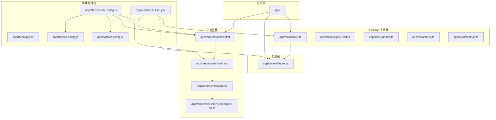
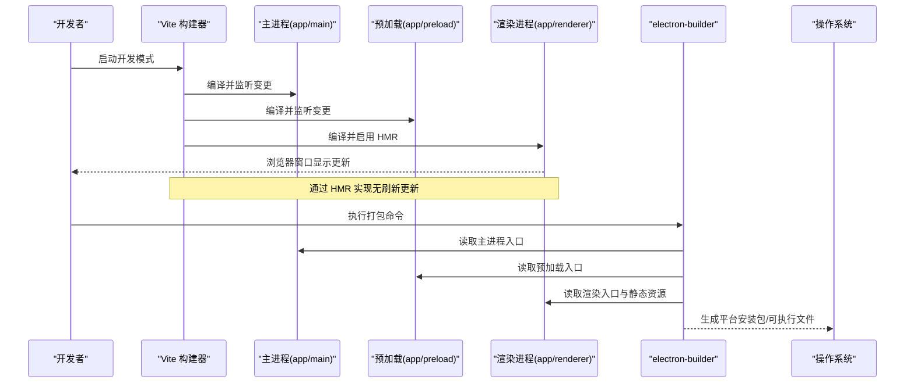
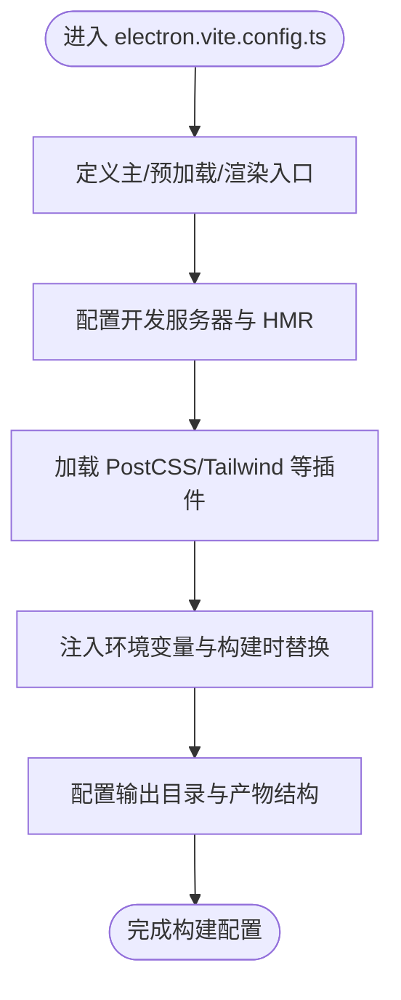
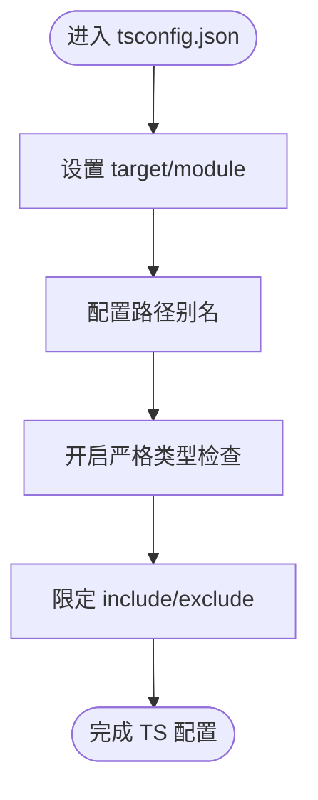
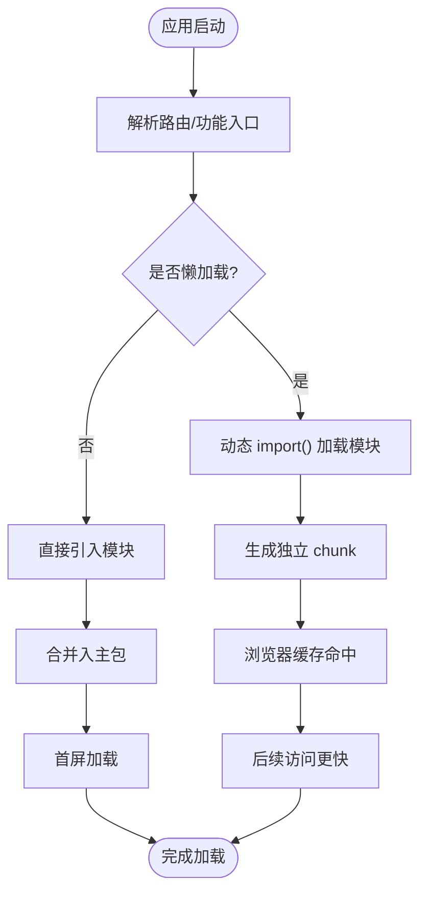
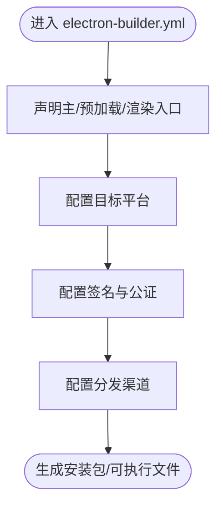
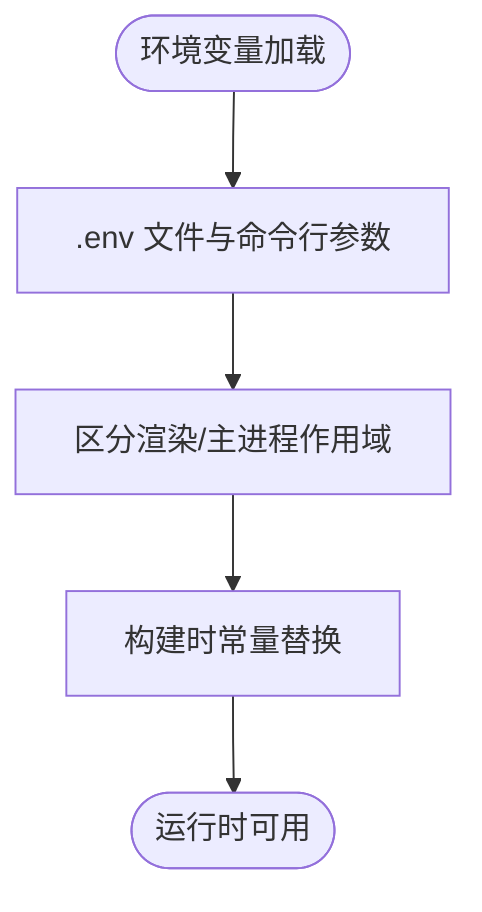
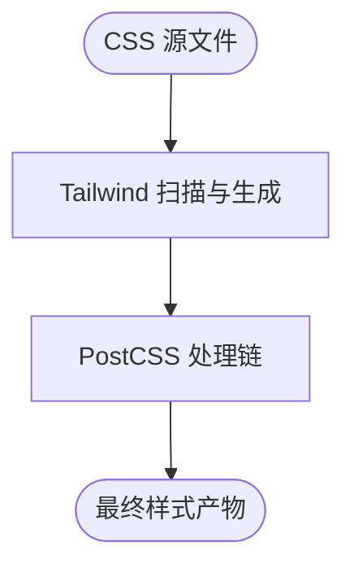
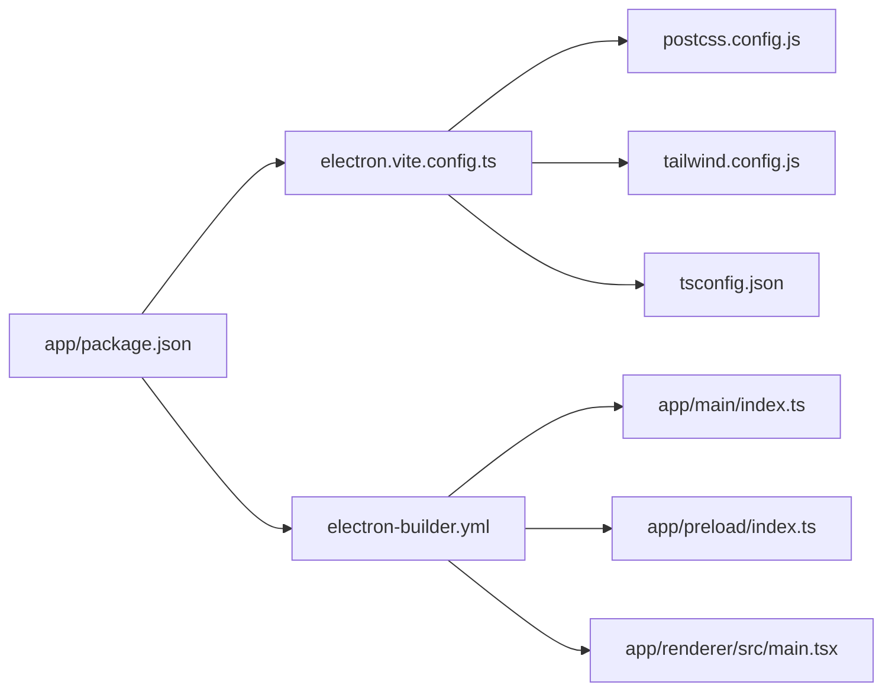

# 构建和打包配置

<cite>
**本文引用的文件**   
- [electron.vite.config.ts](file://app/electron.vite.config.ts)
- [tsconfig.json](file://app/tsconfig.json)
- [package.json](file://app/package.json)
- [electron-builder.yml](file://app/electron-builder.yml)
- [index.html](file://app/renderer/index.html)
- [main.tsx](file://app/renderer/src/main.tsx)
- [App.tsx](file://app/renderer/src/App.tsx)
- [engine-api.ts](file://app/renderer/src/services/engine-api.ts)
- [postcss.config.js](file://app/postcss.config.js)
- [tailwind.config.js](file://app/tailwind.config.js)
</cite>

## 目录
1. [简介](#简介)
2. [项目结构](#项目结构)
3. [核心组件](#核心组件)
4. [架构总览](#架构总览)
5. [详细组件分析](#详细组件分析)
6. [依赖关系分析](#依赖关系分析)
7. [性能考虑](#性能考虑)
8. [故障排查指南](#故障排查指南)
9. [结论](#结论)
10. [附录](#附录)

## 简介
本文件聚焦于 KCode 的前端构建与打包配置，围绕 Vite + Electron 的构建链路展开，覆盖以下主题：
- electron.vite.config.ts 的核心配置、开发服务器与热重载机制
- TypeScript 编译配置（路径别名、类型检查）
- 代码分割与懒加载策略（动态导入、路由级拆分、资源优化）
- 打包与发布配置（electron-builder、多平台打包、签名验证）
- 环境变量管理、配置文件处理、构建时替换
- 构建性能优化方案（并行构建、缓存、增量编译）
- 构建调试与问题排查方法

## 项目结构
KCode 采用 monorepo 组织方式，前端渲染进程位于 app/renderer，主进程位于 app/main，预加载脚本位于 app/preload。构建相关的关键文件集中在 app 目录下：
- 构建配置：electron.vite.config.ts、tsconfig.json、postcss.config.js、tailwind.config.js
- 打包配置：electron-builder.yml
- 入口与页面：renderer/index.html、renderer/src/main.tsx、renderer/src/App.tsx
- 运行时服务调用示例：renderer/src/services/engine-api.ts

图表来源
- [electron.vite.config.ts](file://app/electron.vite.config.ts)
- [tsconfig.json](file://app/tsconfig.json)
- [electron-builder.yml](file://app/electron-builder.yml)
- [index.html](file://app/renderer/index.html)
- [main.tsx](file://app/renderer/src/main.tsx)
- [App.tsx](file://app/renderer/src/App.tsx)
- [engine-api.ts](file://app/renderer/src/services/engine-api.ts)
- [postcss.config.js](file://app/postcss.config.js)
- [tailwind.config.js](file://app/tailwind.config.js)

章节来源
- [electron.vite.config.ts](file://app/electron.vite.config.ts)
- [tsconfig.json](file://app/tsconfig.json)
- [package.json](file://app/package.json)
- [electron-builder.yml](file://app/electron-builder.yml)
- [index.html](file://app/renderer/index.html)
- [main.tsx](file://app/renderer/src/main.tsx)
- [App.tsx](file://app/renderer/src/App.tsx)
- [engine-api.ts](file://app/renderer/src/services/engine-api.ts)
- [postcss.config.js](file://app/postcss.config.js)
- [tailwind.config.js](file://app/tailwind.config.js)

## 核心组件
本节从构建视角梳理关键配置与职责：
- Vite + Electron 构建配置：统一开发/生产构建、插件链、输出目录、HMR 行为
- TypeScript 编译：目标版本、模块系统、路径别名、严格模式与类型检查
- 样式管线：PostCSS 与 Tailwind 集成
- 打包与发布：electron-builder 产物、平台、签名、分发渠道
- 环境变量与构建时替换：定义、注入、作用域隔离

章节来源
- [electron.vite.config.ts](file://app/electron.vite.config.ts)
- [tsconfig.json](file://app/tsconfig.json)
- [postcss.config.js](file://app/postcss.config.js)
- [tailwind.config.js](file://app/tailwind.config.js)
- [electron-builder.yml](file://app/electron-builder.yml)
- [package.json](file://app/package.json)

## 架构总览
下图展示了 Vite 在开发/生产阶段如何驱动 Electron 主进程与渲染进程的构建与运行，以及 HMR 与打包产物的流向。

图表来源
- [electron.vite.config.ts](file://app/electron.vite.config.ts)
- [electron-builder.yml](file://app/electron-builder.yml)
- [index.html](file://app/renderer/index.html)
- [main.tsx](file://app/renderer/src/main.tsx)

## 详细组件分析

### Vite + Electron 构建配置（electron.vite.config.ts）
- 构建目标与入口
  - 主进程入口指向 app/main/index.ts
  - 预加载入口指向 app/preload/index.ts
  - 渲染进程入口指向 app/renderer/src/main.tsx，并通过 index.html 注入
- 开发服务器与 HMR
  - 开发模式下为渲染进程提供本地开发服务器，支持热重载
  - 主进程与预加载脚本通常以 Node 环境运行，不启用浏览器 HMR，但可通过 Vite 的 watch 能力触发重启或重新加载
- 插件与样式管线
  - 集成 PostCSS 与 Tailwind，确保 CSS 在开发与生产一致
- 输出与产物
  - 生产构建输出到指定 dist 目录，供 electron-builder 消费
- 环境变量与构建时替换
  - 通过 Vite 的环境变量机制注入到渲染进程；主/预加载使用 Node 环境变量
  - 可在构建时进行常量替换，减少运行时判断分支

图表来源
- [electron.vite.config.ts](file://app/electron.vite.config.ts)
- [postcss.config.js](file://app/postcss.config.js)
- [tailwind.config.js](file://app/tailwind.config.js)

章节来源
- [electron.vite.config.ts](file://app/electron.vite.config.ts)
- [postcss.config.js](file://app/postcss.config.js)
- [tailwind.config.js](file://app/tailwind.config.js)

### TypeScript 编译配置（tsconfig.json）
- 目标与模块
  - 设置 ES 目标与模块系统，确保与 Vite/Electron 兼容
- 路径别名
  - 配置 @/* 等路径映射，提升可读性与引用稳定性
- 类型检查与严格性
  - 开启严格模式，统一类型约束，提高健壮性
- 包含与排除
  - 限定编译范围，避免无关文件参与构建，提升速度

图表来源
- [tsconfig.json](file://app/tsconfig.json)

章节来源
- [tsconfig.json](file://app/tsconfig.json)

### 代码分割与懒加载策略
- 动态导入
  - 对大型组件或功能模块使用动态 import() 实现按需加载，降低首屏体积
- 路由级代码分割
  - 若存在路由，建议按路由维度拆分 chunk，结合 Vite 的默认分包策略
- 第三方库拆分
  - 将稳定且体积大的依赖抽离为独立 chunk，利用浏览器缓存提升重复访问性能
- 资源优化
  - 图片、字体等资源按需引入，必要时进行压缩与格式转换

图表来源
- [main.tsx](file://app/renderer/src/main.tsx)
- [App.tsx](file://app/renderer/src/App.tsx)
- [engine-api.ts](file://app/renderer/src/services/engine-api.ts)

章节来源
- [main.tsx](file://app/renderer/src/main.tsx)
- [App.tsx](file://app/renderer/src/App.tsx)
- [engine-api.ts](file://app/renderer/src/services/engine-api.ts)

### 打包与发布配置（electron-builder）
- 产物与入口
  - 指定主进程、预加载与渲染入口，确保打包器能找到正确文件
- 多平台打包
  - 配置目标平台（如 Windows、macOS、Linux），按需选择单平台或多平台构建
- 签名与公证
  - 配置证书与签名参数，满足商店上架或安全要求
- 分发渠道
  - 可选 GitHub Releases、S3 等，自动上传产物并提供下载链接

图表来源
- [electron-builder.yml](file://app/electron-builder.yml)

章节来源
- [electron-builder.yml](file://app/electron-builder.yml)

### 环境变量管理与构建时替换
- 环境变量来源
  - .env 系列文件与环境变量注入，区分开发/生产环境
- 作用域隔离
  - 渲染进程通过 Vite 注入；主/预加载使用 Node 环境变量
- 构建时替换
  - 对常量进行替换，减少运行时分支，提升性能与可维护性

图表来源
- [electron.vite.config.ts](file://app/electron.vite.config.ts)
- [package.json](file://app/package.json)

章节来源
- [electron.vite.config.ts](file://app/electron.vite.config.ts)
- [package.json](file://app/package.json)

### 样式管线（PostCSS + Tailwind）
- PostCSS 负责 CSS 处理链，Tailwind 提供原子化样式
- 开发/生产一致性由 Vite 插件链保障

图表来源
- [postcss.config.js](file://app/postcss.config.js)
- [tailwind.config.js](file://app/tailwind.config.js)

章节来源
- [postcss.config.js](file://app/postcss.config.js)
- [tailwind.config.js](file://app/tailwind.config.js)

## 依赖关系分析
构建期依赖关系如下：
- electron.vite.config.ts 依赖 PostCSS 与 Tailwind 配置
- electron-builder.yml 依赖主/预加载/渲染入口与静态资源
- tsconfig.json 影响所有 TypeScript 文件的编译与类型检查
- package.json 中的脚本命令串联开发、构建与打包流程

图表来源
- [electron.vite.config.ts](file://app/electron.vite.config.ts)
- [postcss.config.js](file://app/postcss.config.js)
- [tailwind.config.js](file://app/tailwind.config.js)
- [tsconfig.json](file://app/tsconfig.json)
- [electron-builder.yml](file://app/electron-builder.yml)
- [package.json](file://app/package.json)

章节来源
- [electron.vite.config.ts](file://app/electron.vite.config.ts)
- [postcss.config.js](file://app/postcss.config.js)
- [tailwind.config.js](file://app/tailwind.config.js)
- [tsconfig.json](file://app/tsconfig.json)
- [electron-builder.yml](file://app/electron-builder.yml)
- [package.json](file://app/package.json)

## 性能考虑
- 并行构建
  - 充分利用 Vite 的并发编译能力，合理划分模块边界，避免大单体
- 缓存策略
  - 启用 Vite 的依赖预构建与文件系统缓存；合理使用浏览器缓存头
- 增量编译
  - 保持模块粒度清晰，减少跨模块耦合，提升增量构建速度
- 代码分割
  - 路由级与功能级拆分，优先加载关键路径，非关键路径延迟加载
- 资源优化
  - 图片/字体压缩与格式转换，按需引入，避免冗余资源
- 构建产物分析
  - 定期分析 bundle 大小，识别热点依赖，持续优化

[本节为通用指导，无需源码引用]

## 故障排查指南
- 开发模式无法热重载
  - 确认渲染进程开发服务器已启用，检查端口占用与代理配置
  - 主/预加载变更需重启进程，确认 Vite 的 watch 与重启逻辑
- 环境变量未生效
  - 区分渲染/主进程作用域，确认构建时替换是否正确
  - 检查 .env 文件命名与作用域前缀
- 打包失败或产物缺失
  - 核对 electron-builder.yml 中入口与资源路径
  - 检查权限与签名证书配置
- 样式异常
  - 确认 PostCSS/Tailwind 插件顺序与配置
  - 清理缓存后重试构建
- 类型错误导致构建中断
  - 根据 tsconfig 严格模式提示修复类型问题
  - 临时关闭严格选项定位问题后再恢复

章节来源
- [electron.vite.config.ts](file://app/electron.vite.config.ts)
- [electron-builder.yml](file://app/electron-builder.yml)
- [tsconfig.json](file://app/tsconfig.json)
- [postcss.config.js](file://app/postcss.config.js)
- [tailwind.config.js](file://app/tailwind.config.js)

## 结论
通过对 Vite + Electron 构建配置的系统梳理，明确了开发/生产构建链路、TypeScript 编译策略、代码分割与懒加载实践、打包发布流程以及性能优化与排障要点。遵循上述最佳实践，可显著提升构建效率、产物质量与用户体验。

[本节为总结，无需源码引用]

## 附录
- 常用命令参考
  - 开发：启动 Vite 开发服务器与 Electron 应用
  - 构建：执行生产构建，生成 dist 产物
  - 打包：基于 electron-builder 生成各平台安装包
- 关键路径清单
  - 构建配置：app/electron.vite.config.ts
  - 类型配置：app/tsconfig.json
  - 打包配置：app/electron-builder.yml
  - 样式配置：app/postcss.config.js、app/tailwind.config.js
  - 入口文件：app/renderer/index.html、app/renderer/src/main.tsx、app/main/index.ts、app/preload/index.ts

章节来源
- [electron.vite.config.ts](file://app/electron.vite.config.ts)
- [tsconfig.json](file://app/tsconfig.json)
- [electron-builder.yml](file://app/electron-builder.yml)
- [postcss.config.js](file://app/postcss.config.js)
- [tailwind.config.js](file://app/tailwind.config.js)
- [index.html](file://app/renderer/index.html)
- [main.tsx](file://app/renderer/src/main.tsx)