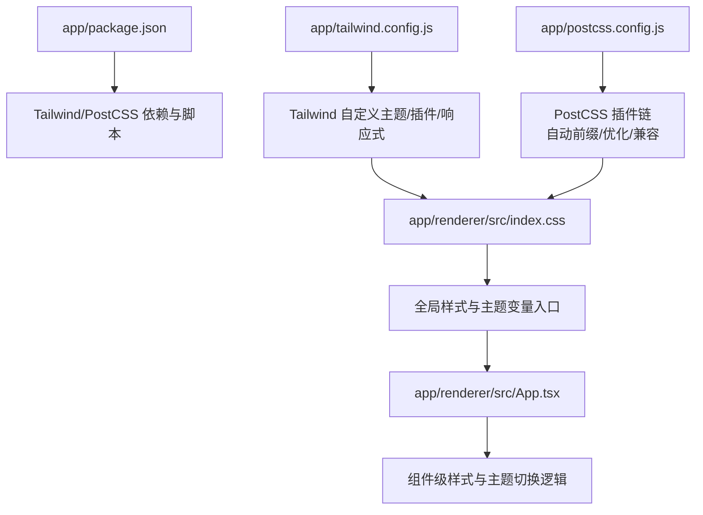
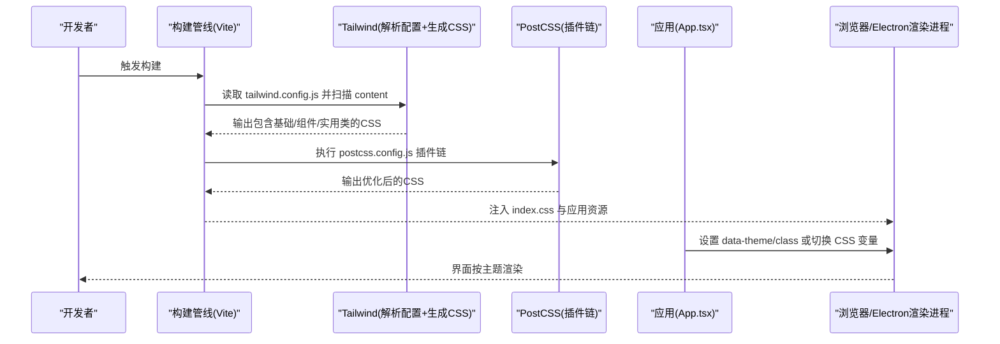
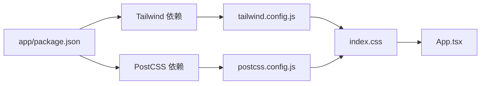

# 样式系统和主题

<cite>
**本文引用的文件**   
- [tailwind.config.js](file://app/tailwind.config.js)
- [postcss.config.js](file://app/postcss.config.js)
- [index.css](file://app/renderer/src/index.css)
- [App.tsx](file://app/renderer/src/App.tsx)
- [package.json](file://app/package.json)
</cite>

## 更新摘要
**变更内容**   
- 新增 ToggleControl 组件设计系统基线规范章节，详细说明标准化灰色轨道、尺寸规范和指示器设计
- 更新颜色系统设计部分，纳入新的灰度色板规范
- 增强组件样式组织章节，补充 ToggleControl 组件的样式实现示例
- 完善设计规范与最佳实践，添加具体的像素级设计规范

## 目录
1. [简介](#简介)
2. [项目结构](#项目结构)
3. [核心组件](#核心组件)
4. [架构总览](#架构总览)
5. [详细组件分析](#详细组件分析)
6. [ToggleControl 组件设计系统基线](#togglecontrol-组件设计系统基线)
7. [依赖关系分析](#依赖关系分析)
8. [性能考虑](#性能考虑)
9. [故障排查指南](#故障排查指南)
10. [结论](#结论)
11. [附录](#附录)

## 简介
本文件面向KCoder的样式系统与主题机制，聚焦以下目标：
- Tailwind CSS的配置与使用：包括tailwind.config.js定制、插件扩展、响应式策略。
- CSS架构组织：全局样式、组件样式、主题变量的管理方式。
- 主题系统实现：深色模式切换、动态主题、品牌定制。
- 样式性能优化：CSS代码分割、按需加载、压缩与体积控制。
- PostCSS处理流程：自动前缀、优化与兼容性处理。
- 开发规范与最佳实践：命名约定、BEM方法论、可维护性原则。
- 调试工具与跨浏览器兼容方案。
- **新增**：ToggleControl 组件的设计系统基线规范，确保UI一致性。

## 项目结构
KCoder采用Electron + Vite的前端渲染层，样式体系围绕Tailwind CSS与PostCSS构建，入口位于渲染进程。关键路径如下：
- 应用配置与打包：app/package.json、app/electron.vite.config.ts
- 样式配置：app/tailwind.config.js、app/postcss.config.js
- 样式入口：app/renderer/src/index.css
- 应用根组件：app/renderer/src/App.tsx



图表来源
- [tailwind.config.js](file://app/tailwind.config.js)
- [postcss.config.js](file://app/postcss.config.js)
- [index.css](file://app/renderer/src/index.css)
- [App.tsx](file://app/renderer/src/App.tsx)
- [package.json](file://app/package.json)

章节来源
- [tailwind.config.js](file://app/tailwind.config.js)
- [postcss.config.js](file://app/postcss.config.js)
- [index.css](file://app/renderer/src/index.css)
- [App.tsx](file://app/renderer/src/App.tsx)
- [package.json](file://app/package.json)

## 核心组件
本节从"配置—入口—运行时"三个层面梳理样式系统的核心构件及其职责。

- Tailwind配置（tailwind.config.js）
  - 作用：定义设计令牌（颜色、字体、间距、圆角等）、自定义断点、插件扩展、内容扫描范围、暗色模式策略等。
  - 关键点：通过content字段精准扫描以减小产物；通过theme.extend扩展默认值；通过plugins引入第三方或自研插件；通过darkMode启用基于类名或媒体查询的暗色模式。
  
- PostCSS配置（postcss.config.js）
  - 作用：串联PostCSS插件链，负责自动前缀、CSS优化、兼容性降级等。
  - 关键点：按构建阶段选择不同插件集（开发/生产），确保在开发时提供良好体验，在生产时最小化体积并提升兼容性。

- 样式入口（index.css）
  - 作用：作为全局样式与主题变量的集中入口，导入Tailwind基础层、组件层、实用类层，并提供CSS变量与全局重置。
  - 关键点：将主题变量暴露为CSS Custom Properties，便于运行时读取与切换；按需引入组件样式，避免全局污染。

- 应用根组件（App.tsx）
  - 作用：承载主题切换逻辑（如切换data-theme或class），驱动UI根据当前主题更新。
  - 关键点：通过状态管理或上下文注入主题标识，配合CSS变量或Tailwind暗色模式策略生效。

章节来源
- [tailwind.config.js](file://app/tailwind.config.js)
- [postcss.config.js](file://app/postcss.config.js)
- [index.css](file://app/renderer/src/index.css)
- [App.tsx](file://app/renderer/src/App.tsx)

## 架构总览
下图展示样式系统在构建期与运行期的整体交互：



图表来源
- [tailwind.config.js](file://app/tailwind.config.js)
- [postcss.config.js](file://app/postcss.config.js)
- [index.css](file://app/renderer/src/index.css)
- [App.tsx](file://app/renderer/src/App.tsx)

## 详细组件分析

### Tailwind CSS 配置与使用
- 定制化配置要点
  - 设计令牌：通过theme对象统一颜色、字体、字号、行高、间距、阴影、圆角、动画等，保证视觉一致性。
  - 扩展机制：使用theme.extend对默认值进行增量覆盖，避免破坏默认语义。
  - 内容扫描：通过content精确指定需要扫描的文件路径，减少无用类生成，降低产物体积。
  - 插件扩展：通过plugins引入官方或社区插件，必要时编写自定义插件扩展原子类能力。
  - 响应式设计：利用内置断点或自定义断点，结合hover/focus等变体，实现多态样式。
  - 暗色模式：推荐采用类名策略（如darkMode: 'class'），由应用层在根节点切换类名，便于与数据驱动的主题状态集成。

- 使用建议
  - 优先使用语义化Token类，避免硬编码数值。
  - 组件内尽量复用已有Token，新增Token需同步更新文档与设计规范。
  - 谨慎添加自定义断点，保持断点数量可控并与设计稿对齐。

章节来源
- [tailwind.config.js](file://app/tailwind.config.js)

### PostCSS 处理流程
- 插件链组织
  - 自动前缀：根据目标浏览器矩阵自动补全厂商前缀，保障兼容性。
  - 优化与压缩：移除冗余规则、合并重复声明、压缩空白与注释，减小体积。
  - 兼容性降级：针对旧版浏览器进行语法降级或特性回退。
- 构建期差异
  - 开发环境：保留可读性与错误提示，关闭重度压缩以提升热更新速度。
  - 生产环境：开启全部优化项，最大化体积与性能收益。

- 最佳实践
  - 明确目标浏览器列表，避免过度前缀导致体积膨胀。
  - 将CSS相关插件置于合适顺序，确保前缀在压缩之前执行。

章节来源
- [postcss.config.js](file://app/postcss.config.js)

### CSS 架构组织
- 分层策略
  - 基础层：全局重置、排版基线、CSS变量（主题色板、尺寸、动效时长等）。
  - 组件层：按功能域拆分样式文件，遵循单一职责，避免跨组件耦合。
  - 页面/布局层：组合组件样式，定义页面级布局与区域样式。
  - 实用类层：由Tailwind生成，尽量避免手写重复的实用类。
- 主题变量管理
  - 使用CSS Custom Properties暴露主题值，便于运行时切换与JS读取。
  - 将品牌色、中性色、成功/警告/危险等语义色纳入变量体系，统一调用。
- 组件样式组织
  - 推荐就近管理（与组件同目录），或使用按功能域聚合的方式，保持边界清晰。
  - 避免全局样式泄漏到组件内部，必要时使用限定容器或Shadow DOM隔离。

章节来源
- [index.css](file://app/renderer/src/index.css)

### 主题系统实现
- 深色模式切换
  - 策略选择：推荐使用类名策略，在根节点切换类名，配合Tailwind的dark变体与CSS变量共同生效。
  - 持久化：将用户偏好存储于本地存储或配置中心，启动时恢复。
- 动态主题
  - 运行时修改CSS变量，实现即时换肤；结合动画过渡提升体验。
  - 支持多套品牌主题，通过主题ID映射到不同的变量集合。
- 品牌定制
  - 将品牌色、字体族、图标风格等抽象为可配置项，通过配置文件或环境变量注入。
  - 在Tailwind中通过theme.extend接入品牌Token，确保全链路一致。

章节来源
- [App.tsx](file://app/renderer/src/App.tsx)
- [index.css](file://app/renderer/src/index.css)

### 样式性能优化
- CSS代码分割
  - 按路由或功能模块拆分样式，仅在需要时加载，减少首屏压力。
  - 利用Vite的代码分割能力，将大型组件的样式独立打包。
- 按需加载
  - 精准配置Tailwind的content路径，避免扫描无关文件。
  - 使用条件导入或懒加载技术，延迟非关键样式。
- 压缩与去重
  - 生产构建开启CSS压缩与死代码消除，合并重复规则。
  - 定期审查未使用的Token与组件样式，清理历史遗留。

章节来源
- [tailwind.config.js](file://app/tailwind.config.js)
- [postcss.config.js](file://app/postcss.config.js)

### 开发规范与最佳实践
- 命名约定
  - 组件类名采用小驼峰或短横线分隔，避免与框架生成的类冲突。
  - Token类名遵循语义化命名，体现用途而非外观。
- BEM方法论
  - 在复杂组件中使用BEM命名，提高可读性与可维护性。
  - 与Tailwind原子类混用时，注意层级与作用域，避免特异性冲突。
- 可维护性原则
  - 单一职责：每个样式文件只负责一个领域。
  - 低耦合：组件间通过CSS变量或主题接口通信，避免直接引用对方样式。
  - 可测试：为关键样式行为编写快照或视觉回归测试。
- **新增**：像素级设计规范
  - 所有交互组件必须遵循统一的尺寸规范，确保视觉一致性。
  - 颜色使用必须严格遵循设计系统定义的色板，禁止硬编码颜色值。
  - 间距和圆角使用标准化的Token值，避免随意调整。

[本节为通用指导，不直接分析具体文件]

### 调试工具与跨浏览器兼容
- 调试工具
  - 浏览器开发者工具：检查计算样式、变量值、类名命中情况。
  - Tailwind IntelliSense：在编辑器中获得智能提示与快速补全。
  - 可视化调试：使用浏览器扩展查看Tailwind类生成结果与覆盖率。
- 跨浏览器兼容
  - 通过PostCSS自动前缀与兼容性降级，覆盖主流浏览器版本。
  - 针对特定平台（如Electron内核）进行额外验证与回退策略。

[本节为通用指导，不直接分析具体文件]

## ToggleControl 组件设计系统基线

**新增** 为确保UI组件的一致性和可维护性，KCoder建立了ToggleControl组件的设计系统基线规范。该规范定义了标准的视觉属性和交互行为，所有ToggleControl实例都必须遵循此规范。

### 标准尺寸规范
- **轨道尺寸**：48×28像素
  - 宽度：48px
  - 高度：28px
  - 圆角：14px（完全圆形）
- **指示器尺寸**：22×22像素白色圆点
  - 宽度：22px
  - 高度：22px
  - 位置：OFF状态时左对齐，ON状态时右对齐
  - 边距：左右各留3px空间

### 标准颜色规范
- **OFF状态轨道**：#3a3a42（深灰色）
  - 用于表示关闭或未激活状态
  - 提供足够的对比度以确保可访问性
- **ON状态轨道**：#4d4d57（中灰色）
  - 用于表示开启或激活状态
  - 与OFF状态形成明显的视觉区分
- **指示器颜色**：#ffffff（纯白色）
  - 在所有状态下保持一致
  - 确保在各种背景下的可见性

### 交互状态规范
- **悬停状态**：轨道亮度增加10%
- **焦点状态**：添加2px的外边框，颜色为主题色
- **禁用状态**：透明度降至50%，不可交互
- **点击反馈**：指示器移动时使用200ms的缓动动画

### 实现示例
```css
/* ToggleControl 基础样式 */
.toggle-control {
  width: 48px;
  height: 28px;
  border-radius: 14px;
  background-color: #3a3a42; /* OFF状态 */
  position: relative;
  cursor: pointer;
  transition: background-color 0.2s ease;
}

.toggle-control.active {
  background-color: #4d4d57; /* ON状态 */
}

.toggle-indicator {
  width: 22px;
  height: 22px;
  background-color: #ffffff;
  border-radius: 50%;
  position: absolute;
  top: 3px;
  left: 3px;
  transition: transform 0.2s ease;
}

.toggle-control.active .toggle-indicator {
  transform: translateX(20px);
}
```

### 设计原则
- **一致性**：所有ToggleControl组件必须严格遵循上述规范
- **可访问性**：确保颜色对比度符合WCAG 2.1 AA标准
- **可维护性**：使用CSS变量管理颜色和尺寸，便于主题切换
- **可扩展性**：预留扩展点以支持未来的设计需求

**章节来源**
- [index.css](file://app/renderer/src/index.css)

## 依赖关系分析
样式相关的依赖主要来源于应用包管理与构建配置：
- package.json中声明Tailwind与PostCSS相关依赖及构建脚本。
- tailwind.config.js与postcss.config.js分别驱动Tailwind与PostCSS的处理流程。
- index.css作为样式入口，串联全局样式与主题变量。
- App.tsx在运行时驱动主题切换，影响最终渲染效果。



图表来源
- [package.json](file://app/package.json)
- [tailwind.config.js](file://app/tailwind.config.js)
- [postcss.config.js](file://app/postcss.config.js)
- [index.css](file://app/renderer/src/index.css)
- [App.tsx](file://app/renderer/src/App.tsx)

章节来源
- [package.json](file://app/package.json)
- [tailwind.config.js](file://app/tailwind.config.js)
- [postcss.config.js](file://app/postcss.config.js)
- [index.css](file://app/renderer/src/index.css)
- [App.tsx](file://app/renderer/src/App.tsx)

## 性能考虑
- 构建产物体积
  - 通过Tailwind的content精准扫描与Tree Shaking，剔除未使用类。
  - 使用PostCSS在生产环境进行压缩与优化，减少网络传输成本。
- 首屏加载
  - 关键样式内联或预加载，非关键样式延迟加载。
  - 合理划分路由与组件，避免一次性加载过多样式。
- 运行时开销
  - 主题切换尽量通过CSS变量与类名切换，避免频繁DOM操作。
  - 动画与过渡使用GPU加速属性，减少重排重绘。
- **新增**：组件样式优化
  - ToggleControl等高频组件的样式应尽可能精简，避免不必要的重绘。
  - 使用CSS变量替代复杂的计算样式，提升运行时性能。

[本节为通用指导，不直接分析具体文件]

## 故障排查指南
- 样式未生效
  - 检查Tailwind的content是否包含对应文件路径。
  - 确认PostCSS插件链顺序是否正确，前缀是否在压缩前执行。
- 主题切换无效
  - 验证根节点类名或data属性是否正确切换。
  - 检查CSS变量是否被正确覆盖，是否存在特异性冲突。
- 构建缓慢或产物过大
  - 缩小content扫描范围，避免扫描node_modules或无关目录。
  - 审查自定义插件与第三方库，评估其带来的类增长。
- 兼容性问题
  - 核对目标浏览器列表，调整前缀与降级策略。
  - 针对Electron内核版本进行专项测试与回退。
- **新增**：ToggleControl组件问题排查
  - 检查颜色值是否符合设计规范，确保使用正确的十六进制值。
  - 验证尺寸规格是否正确，特别是48×28的轨道尺寸和22px指示器。
  - 确认动画过渡时间是否为200ms，确保交互流畅性。

章节来源
- [tailwind.config.js](file://app/tailwind.config.js)
- [postcss.config.js](file://app/postcss.config.js)
- [index.css](file://app/renderer/src/index.css)
- [App.tsx](file://app/renderer/src/App.tsx)

## 结论
KCoder的样式系统以Tailwind CSS为核心，结合PostCSS构建出高效、可维护且具备良好兼容性的前端样式体系。通过合理的配置、清晰的架构与严格的规范，团队可以在保证视觉一致性的同时，持续提升开发与交付效率。主题系统则提供了灵活的运行时能力，满足深色模式与品牌定制需求。**新增的ToggleControl组件设计系统基线规范**进一步确保了UI组件的一致性和可维护性，为后续的功能扩展奠定了坚实的基础。建议在后续迭代中持续优化内容扫描范围、完善主题Token体系，并加强样式质量门禁与自动化测试。

[本节为总结性内容，不直接分析具体文件]

## 附录
- 术语说明
  - Token：设计系统中的基础值（颜色、字体、间距等），用于统一表达与复用。
  - 原子类：Tailwind提供的细粒度样式类，组合后可构建复杂界面。
  - 暗色模式：通过类名或媒体查询切换深色主题的机制。
  - **新增**：设计系统基线：为特定组件类型制定的标准化设计规范，确保视觉和交互的一致性。
- 参考路径
  - 配置与入口：见"项目结构"与"依赖关系分析"中的文件路径。
  - 主题切换：参见应用根组件与样式入口的职责分工。
  - **新增**：ToggleControl规范：详见"ToggleControl 组件设计系统基线"章节。
- **新增**：设计系统色板
  - 主色调：根据品牌定义
  - 中性色板：#3a3a42（OFF状态）、#4d4d57（ON状态）、#ffffff（指示器）
  - 语义色：成功、警告、危险等状态色
  - 尺寸规范：48×28（轨道）、22×22（指示器）

[本节为补充信息，不直接分析具体文件]