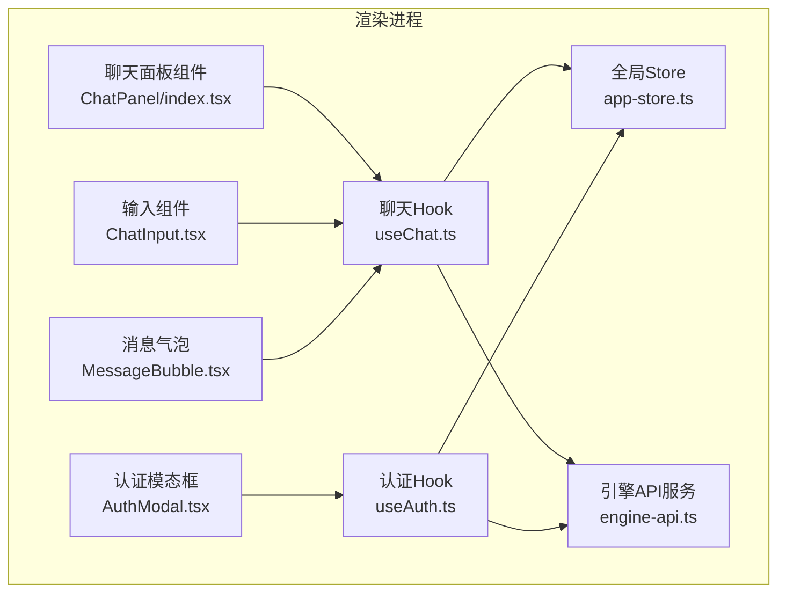
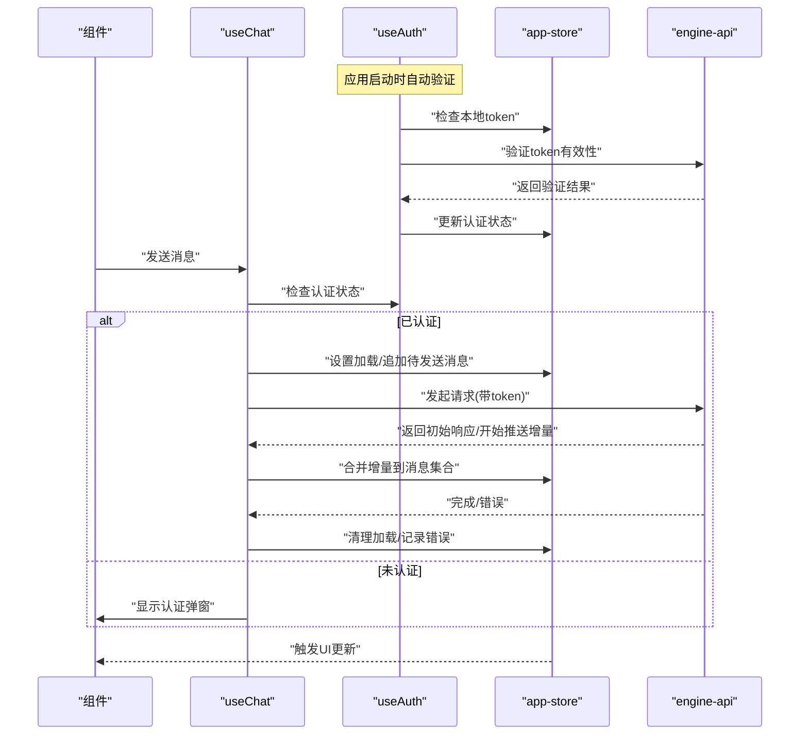
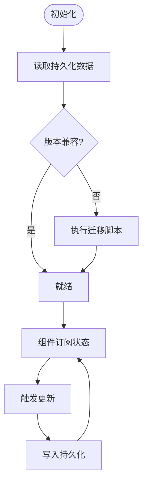
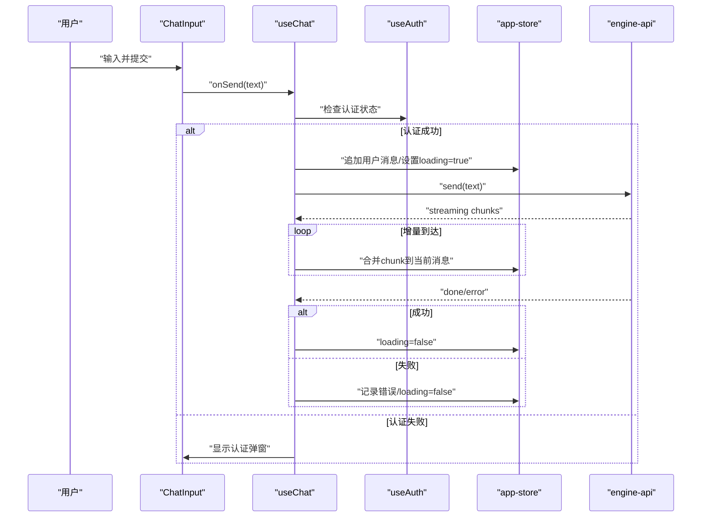
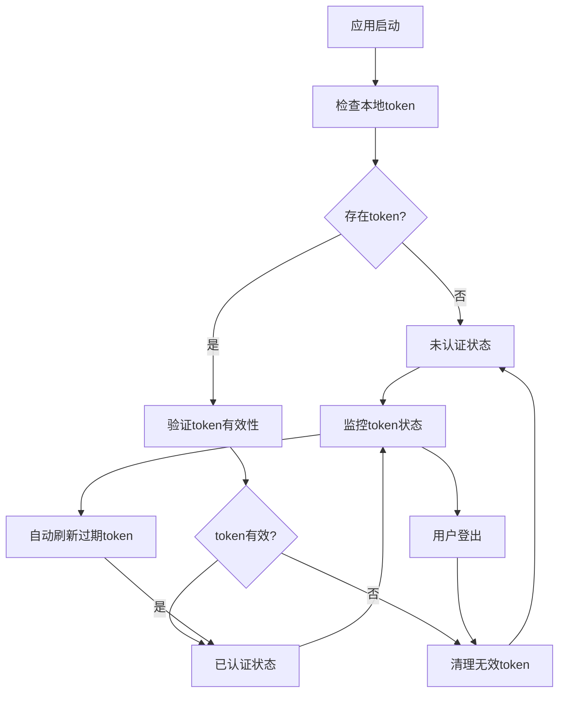
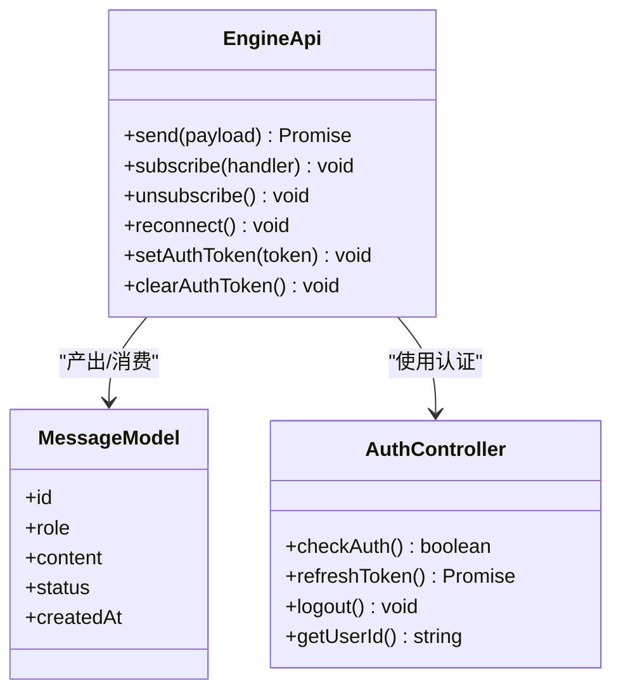
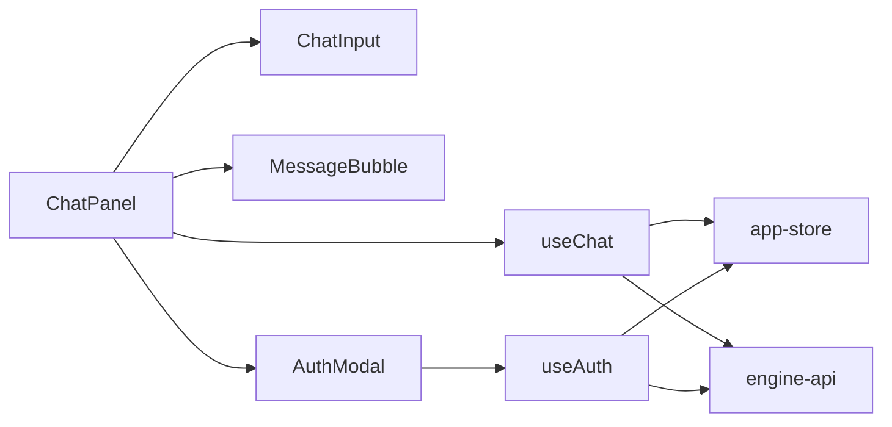
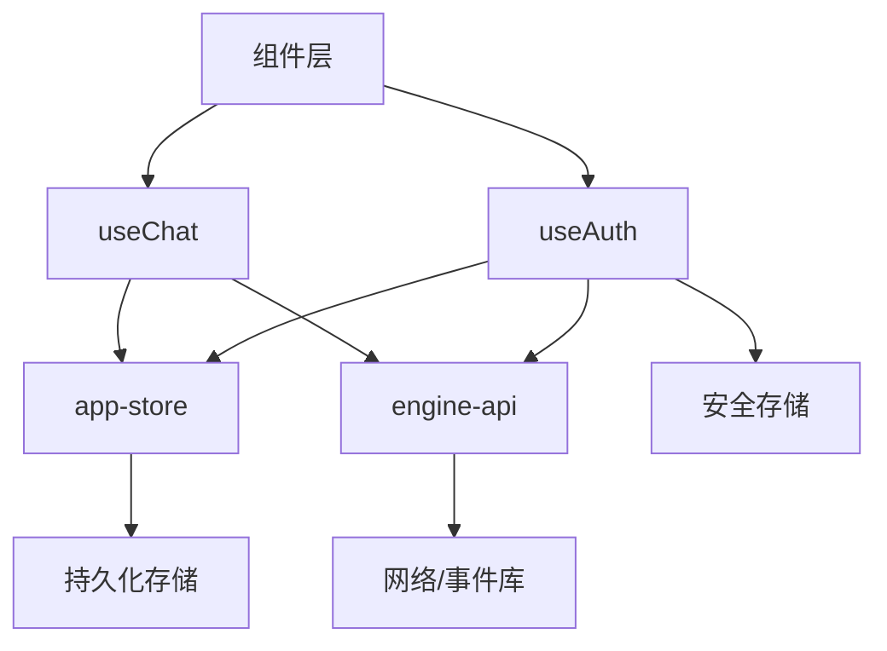

# 状态管理

<cite>
**本文引用的文件**   
- [app-store.ts](file://app/renderer/src/stores/app-store.ts)
- [useChat.ts](file://app/renderer/src/hooks/useChat.ts)
- [useAuth.ts](file://app/renderer/src/hooks/useAuth.ts)
- [engine-api.ts](file://app/renderer/src/services/engine-api.ts)
- [index.tsx](file://app/renderer/src/components/ChatPanel/index.tsx)
- [MessageBubble.tsx](file://app/renderer/src/components/ChatPanel/MessageBubble.tsx)
- [AuthModal.tsx](file://app/renderer/src/components/AuthModal.tsx)
</cite>

## 更新摘要
**所做更改**
- 新增认证状态管理章节，详细介绍useAuth.ts钩子的实现与使用
- 更新核心组件部分，增加认证控制器说明
- 扩展架构总览，包含认证流程的数据流图
- 完善详细组件分析，添加认证Hook的专门分析
- 更新依赖关系分析，反映认证模块的集成方式

## 目录
1. [简介](#简介)
2. [项目结构](#项目结构)
3. [核心组件](#核心组件)
4. [架构总览](#架构总览)
5. [详细组件分析](#详细组件分析)
6. [依赖关系分析](#依赖关系分析)
7. [性能考虑](#性能考虑)
8. [故障排查指南](#故障排查指南)
9. [结论](#结论)
10. [附录](#附录)

## 简介
本技术文档聚焦于KCoder渲染进程中的状态管理系统，围绕Zustand的全局状态与自定义Hook的状态封装展开，系统阐述单向数据流、状态更新策略、异步处理、持久化机制、选择器与性能优化、以及与引擎API的集成方式。文档同时提供最佳实践与调试建议，帮助读者在复杂交互场景下构建稳定、可维护的前端状态层。

**更新** 新增了前端认证状态管理的核心控制器useAuth.ts，负责token持久化和自动验证功能。

## 项目结构
与状态管理直接相关的代码位于渲染进程前端：
- 全局状态定义与访问入口：stores/app-store.ts
- 聊天领域状态封装与业务操作：hooks/useChat.ts
- **新增** 认证状态管理与token处理：hooks/useAuth.ts
- 与引擎通信的服务层：services/engine-api.ts
- 使用状态的UI组件：components/ChatPanel/*, components/AuthModal.tsx

**图表来源**
- [index.tsx](file://app/renderer/src/components/ChatPanel/index.tsx)
- [MessageBubble.tsx](file://app/renderer/src/components/ChatPanel/MessageBubble.tsx)
- [AuthModal.tsx](file://app/renderer/src/components/AuthModal.tsx)
- [useChat.ts](file://app/renderer/src/hooks/useChat.ts)
- [useAuth.ts](file://app/renderer/src/hooks/useAuth.ts)
- [app-store.ts](file://app/renderer/src/stores/app-store.ts)
- [engine-api.ts](file://app/renderer/src/services/engine-api.ts)

**章节来源**
- [app-store.ts](file://app/renderer/src/stores/app-store.ts)
- [useChat.ts](file://app/renderer/src/hooks/useChat.ts)
- [useAuth.ts](file://app/renderer/src/hooks/useAuth.ts)
- [engine-api.ts](file://app/renderer/src/services/engine-api.ts)
- [index.tsx](file://app/renderer/src/components/ChatPanel/index.tsx)
- [MessageBubble.tsx](file://app/renderer/src/components/ChatPanel/MessageBubble.tsx)
- [AuthModal.tsx](file://app/renderer/src/components/AuthModal.tsx)

## 核心组件
- 全局状态（Zustand Store）
  - 职责：集中管理应用级状态（如会话列表、当前会话、消息集合、加载与错误状态等），暴露读写方法与订阅能力。
  - 设计要点：
    - 通过选择器拆分状态片段，避免无关重渲染。
    - 将副作用与纯状态分离，尽量在actions中调用外部服务。
    - 为关键状态提供不可变更新策略，确保时间旅行与调试友好。
- 聊天领域Hook（useChat）
  - 职责：封装与聊天相关的状态与行为（发送消息、接收增量、错误处理、加载态控制等），向上层组件暴露简洁接口。
  - 设计要点：
    - 内部组合多个store切片或派生状态，对外仅暴露必要方法。
    - 对异步流程进行统一编排，保证状态一致性。
    - 提供重试、取消与节流等策略，提升用户体验。
- **新增** 认证控制器Hook（useAuth）
  - 职责：作为前端认证状态管理的核心控制器，处理token持久化、自动验证、登录状态管理等认证相关逻辑。
  - 设计要点：
    - 统一管理认证状态，包括用户信息、token有效期、登录状态等。
    - 实现token的自动刷新与过期处理机制。
    - 提供安全的token存储与清理策略。
    - 支持多环境配置与认证模式切换。
- 引擎API服务（engine-api）
  - 职责：负责与后端引擎通信，包括请求构造、响应解析、错误分类、实时事件接入等。
  - 设计要点：
    - 将网络异常、协议错误、业务错误分层抽象，便于上层统一处理。
    - 支持流式/增量返回的数据聚合，映射到本地消息模型。
    - **新增** 集成认证中间件，自动附加token到请求头。

**章节来源**
- [app-store.ts](file://app/renderer/src/stores/app-store.ts)
- [useChat.ts](file://app/renderer/src/hooks/useChat.ts)
- [useAuth.ts](file://app/renderer/src/hooks/useAuth.ts)
- [engine-api.ts](file://app/renderer/src/services/engine-api.ts)

## 架构总览
整体采用"组件 → Hook → Store + Service"的单向数据流模式，并集成了认证状态管理：
- 组件触发用户交互，调用Hook暴露的方法。
- Hook协调Store的更新与Service的调用，必要时订阅引擎事件。
- Store作为单一事实源，驱动UI最小化重渲染。
- 引擎API负责与远端同步，将结果落盘或推送到Store。
- **新增** 认证Hook在应用启动时自动验证token，确保用户会话的连续性。

**图表来源**
- [useChat.ts](file://app/renderer/src/hooks/useChat.ts)
- [useAuth.ts](file://app/renderer/src/hooks/useAuth.ts)
- [app-store.ts](file://app/renderer/src/stores/app-store.ts)
- [engine-api.ts](file://app/renderer/src/services/engine-api.ts)

## 详细组件分析

### 全局状态（app-store.ts）
- 状态切片建议
  - 会话相关：会话列表、当前会话ID、会话元信息。
  - 消息相关：消息数组、分页游标、搜索索引。
  - 运行态：加载标志、错误对象、统计指标。
  - **新增** 认证相关：用户信息、token状态、认证模式。
- 更新策略
  - 原子性更新：将一次业务动作拆分为多个小步骤，每步都保持状态一致。
  - 幂等性：对重复提交进行去抖/防抖或基于唯一ID的去重。
  - 不可变更新：使用新引用替换旧状态，便于比较与缓存。
- 选择器与性能
  - 按组件所需的最小状态片段进行订阅，减少重渲染范围。
  - 对大型集合使用结构化共享或分片存储，降低序列化/反序列化开销。
- 持久化与迁移
  - 本地存储：将关键状态序列化为JSON并写入持久化介质。
  - 版本迁移：在读取时检测版本并进行字段补齐/类型转换。
  - 冲突解决：多标签页或多实例下的最后写入优先或合并策略。

**图表来源**
- [app-store.ts](file://app/renderer/src/stores/app-store.ts)

**章节来源**
- [app-store.ts](file://app/renderer/src/stores/app-store.ts)

### 聊天Hook（useChat.ts）
- 职责边界
  - 封装"发送消息、接收增量、错误恢复、加载控制"等业务流程。
  - 组合Store的读写方法与Engine API的调用，屏蔽底层细节。
- 数据流
  - 入参校验与预处理（如清空输入、生成消息ID）。
  - 立即乐观更新（显示用户消息与加载态）。
  - 调用引擎API，处理成功/失败/中断分支。
  - 增量合并策略（按位置插入、去重、截断超长内容）。
- 错误与恢复
  - 区分网络错误、服务端错误、业务错误。
  - 提供重试次数上限、退避策略与用户提示。
  - 崩溃恢复：从持久化快照恢复未完成的对话。

**图表来源**
- [useChat.ts](file://app/renderer/src/hooks/useChat.ts)
- [useAuth.ts](file://app/renderer/src/hooks/useAuth.ts)
- [engine-api.ts](file://app/renderer/src/services/engine-api.ts)
- [app-store.ts](file://app/renderer/src/stores/app-store.ts)

**章节来源**
- [useChat.ts](file://app/renderer/src/hooks/useChat.ts)
- [engine-api.ts](file://app/renderer/src/services/engine-api.ts)
- [app-store.ts](file://app/renderer/src/stores/app-store.ts)

### **新增** 认证Hook（useAuth.ts）
- 职责边界
  - 作为前端认证状态管理的核心控制器，统一管理用户认证生命周期。
  - 处理token的获取、存储、验证、刷新与清理。
  - 提供认证状态查询与变更通知机制。
- 核心功能
  - **Token持久化**：安全存储用户token，支持加密与自动清理。
  - **自动验证**：应用启动时自动检查token有效性，维持用户会话。
  - **状态同步**：与全局store同步认证状态，确保UI实时更新。
  - **错误处理**：统一处理认证失败、token过期、网络异常等情况。
- 数据流设计
  - 初始化阶段：从本地存储加载token，验证有效性。
  - 运行时：监听token变化，自动刷新过期token。
  - 退出登录：清理所有认证相关数据，重置状态。

**图表来源**
- [useAuth.ts](file://app/renderer/src/hooks/useAuth.ts)

**章节来源**
- [useAuth.ts](file://app/renderer/src/hooks/useAuth.ts)

### 引擎API集成（engine-api.ts）
- 通信模型
  - REST/HTTP：用于一次性请求与批量操作。
  - SSE/WebSocket：用于流式增量输出与实时事件。
- 错误处理
  - 网络层：超时、断网、DNS失败。
  - 协议层：状态码、鉴权失败、参数校验错误。
  - 业务层：任务拒绝、配额不足、模型不可用。
- 状态映射
  - 将远端事件转换为本地消息模型，保证顺序性与完整性。
  - 心跳/保活机制，自动重连与指数退避。
- **新增** 认证集成
  - 自动附加token到请求头，支持Bearer认证。
  - 处理401未授权响应，触发token刷新或重新登录。
  - 支持多认证模式的动态切换。

**图表来源**
- [engine-api.ts](file://app/renderer/src/services/engine-api.ts)
- [useAuth.ts](file://app/renderer/src/hooks/useAuth.ts)

**章节来源**
- [engine-api.ts](file://app/renderer/src/services/engine-api.ts)

### 组件与状态绑定
- ChatPanel/index.tsx
  - 订阅消息列表与滚动位置，渲染消息流。
  - 透传发送回调给子组件。
- MessageBubble.tsx
  - 根据消息状态展示不同样式（加载中、完成、错误）。
- **新增** AuthModal.tsx
  - 处理用户认证交互，支持多种登录方式。
  - 与useAuth Hook集成，实时更新认证状态。
  - 提供友好的错误提示与重试机制。

**图表来源**
- [index.tsx](file://app/renderer/src/components/ChatPanel/index.tsx)
- [MessageBubble.tsx](file://app/renderer/src/components/ChatPanel/MessageBubble.tsx)
- [AuthModal.tsx](file://app/renderer/src/components/AuthModal.tsx)
- [useChat.ts](file://app/renderer/src/hooks/useChat.ts)
- [useAuth.ts](file://app/renderer/src/hooks/useAuth.ts)
- [app-store.ts](file://app/renderer/src/stores/app-store.ts)
- [engine-api.ts](file://app/renderer/src/services/engine-api.ts)

**章节来源**
- [index.tsx](file://app/renderer/src/components/ChatPanel/index.tsx)
- [MessageBubble.tsx](file://app/renderer/src/components/ChatPanel/MessageBubble.tsx)
- [AuthModal.tsx](file://app/renderer/src/components/AuthModal.tsx)

## 依赖关系分析
- 耦合度
  - Hook对Store与API存在强依赖，但通过清晰的接口隔离，降低了组件层的耦合。
  - Store应尽量不感知具体UI实现，只暴露领域语义化的方法。
  - **新增** useAuth作为独立的认证控制器，与其他业务Hook解耦，提高可测试性。
- 循环依赖
  - 避免Hook与Store互相import；若出现，应抽取公共类型或工具模块。
  - **新增** 认证Hook与引擎API之间的依赖通过接口抽象，避免循环引用。
- 外部依赖
  - 引擎API可能依赖网络库、事件总线、持久化存储等，需明确其生命周期与错误传播路径。
  - **新增** 认证模块依赖安全存储、加密库、会话管理等基础设施。

**图表来源**
- [useChat.ts](file://app/renderer/src/hooks/useChat.ts)
- [useAuth.ts](file://app/renderer/src/hooks/useAuth.ts)
- [app-store.ts](file://app/renderer/src/stores/app-store.ts)
- [engine-api.ts](file://app/renderer/src/services/engine-api.ts)

**章节来源**
- [useChat.ts](file://app/renderer/src/hooks/useChat.ts)
- [useAuth.ts](file://app/renderer/src/hooks/useAuth.ts)
- [app-store.ts](file://app/renderer/src/stores/app-store.ts)
- [engine-api.ts](file://app/renderer/src/services/engine-api.ts)

## 性能考虑
- 选择器粒度
  - 按组件维度切分状态订阅，避免整树重渲染。
  - **新增** 认证状态变更频率较低，可使用更粗粒度的选择器。
- 不可变更新
  - 使用浅比较即可判断变更，配合React.memo减少渲染。
- 大列表优化
  - 虚拟滚动、分页加载、增量更新。
- 计算缓存
  - 对派生状态进行记忆化，避免重复计算。
  - **新增** token验证结果缓存，避免频繁的网络请求。
- 内存管理
  - 及时解绑事件监听与定时器。
  - 长连接断开后清理本地缓存与中间态。
  - **新增** 认证相关资源在用户登出时彻底清理。

## 故障排查指南
- 常见问题定位
  - 状态不同步：检查是否多处修改同一状态且未遵循不可变更新。
  - 重复渲染：确认选择器是否过粗或返回了新引用。
  - 异步竞态：为请求添加唯一ID，并在完成后比对ID以丢弃过期响应。
  - 持久化不一致：核对版本迁移逻辑与写入时机。
  - **新增** 认证问题：检查token存储格式、过期时间、刷新逻辑。
- 调试技巧
  - 启用时间旅行与状态快照对比。
  - 打印关键action与副作用返回值，追踪数据流向。
  - 对引擎API增加请求/响应日志与错误分类统计。
  - **新增** 认证流程日志：记录token获取、验证、刷新全过程。

**章节来源**
- [app-store.ts](file://app/renderer/src/stores/app-store.ts)
- [useChat.ts](file://app/renderer/src/hooks/useChat.ts)
- [useAuth.ts](file://app/renderer/src/hooks/useAuth.ts)
- [engine-api.ts](file://app/renderer/src/services/engine-api.ts)

## 结论
通过将Zustand全局状态与领域Hook解耦，并结合引擎API的稳健集成，KCoder实现了清晰、可扩展且高性能的状态管理体系。**新增的认证状态管理模块**进一步增强了系统的安全性与用户体验，通过统一的认证控制器实现了token的自动化管理与安全存储。遵循单向数据流、不可变更新与细粒度选择器的原则，可在复杂交互场景下保障UI的一致性与流畅性。配合完善的错误处理与持久化机制，系统具备良好的可维护性与可观测性。

## 附录
- 最佳实践清单
  - 单一事实源：所有状态变更必须经过Store。
  - 语义化Action：命名体现业务意图，便于追踪与测试。
  - 错误分层：网络/协议/业务错误分别处理与上报。
  - 渐进增强：先乐观更新，再回滚或修正。
  - 可观测性：埋点关键状态变化与耗时。
  - **新增** 安全优先：敏感数据加密存储，定期清理过期凭证。
- 调试工具建议
  - 浏览器扩展或内置面板：查看状态快照、回放操作、导出日志。
  - 单元测试：覆盖关键Hook与Store的边界条件与并发场景。
  - **新增** 认证测试：模拟token过期、网络异常、并发登录等场景。