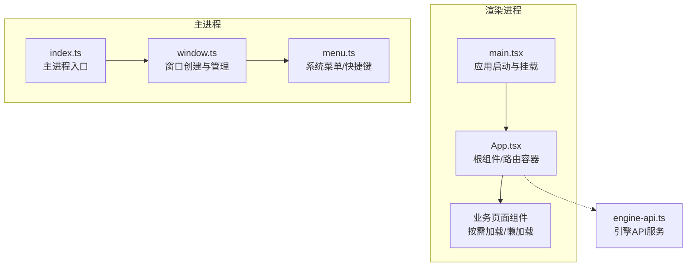
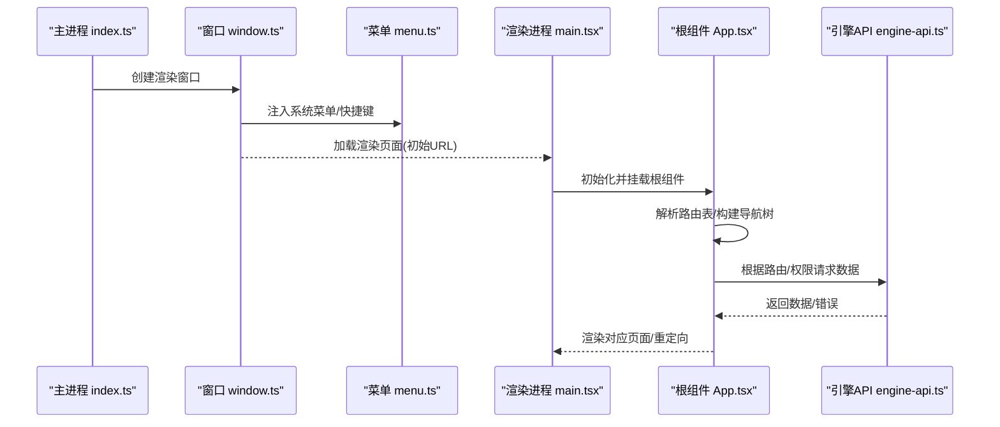
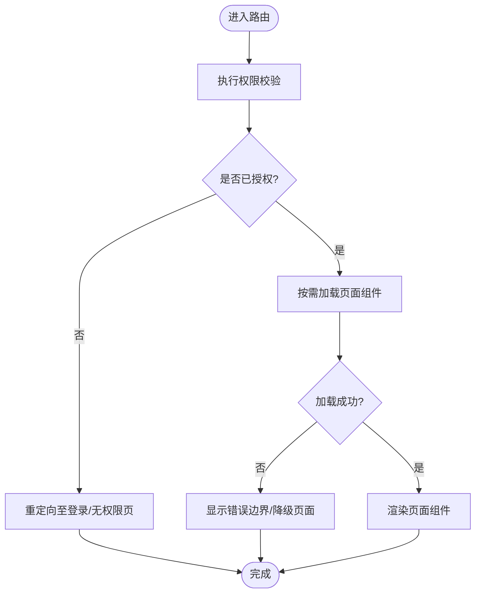
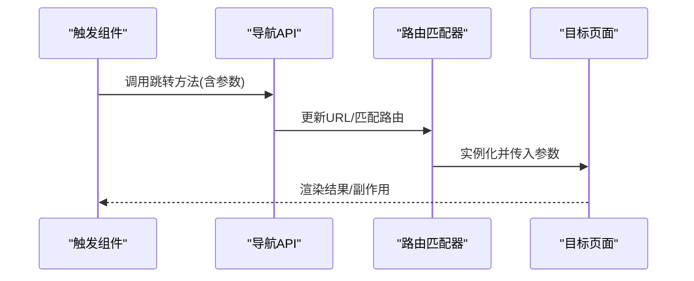
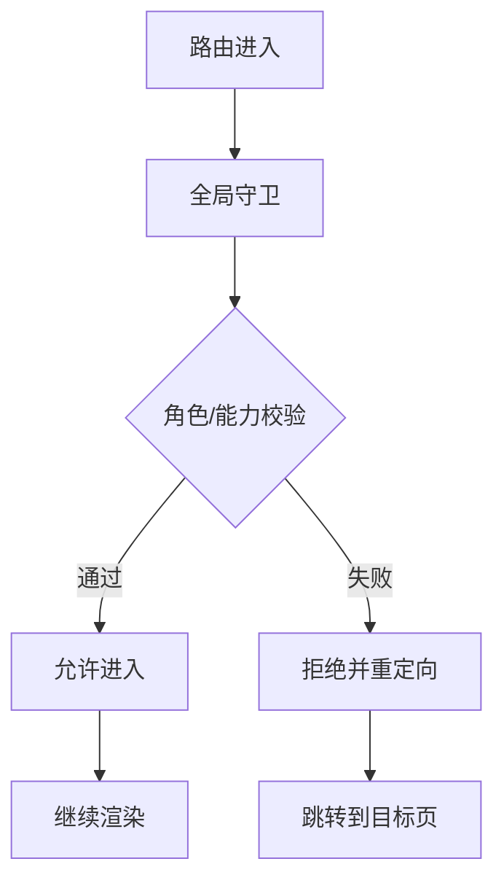
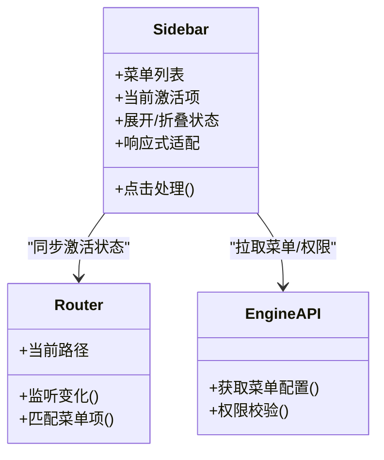
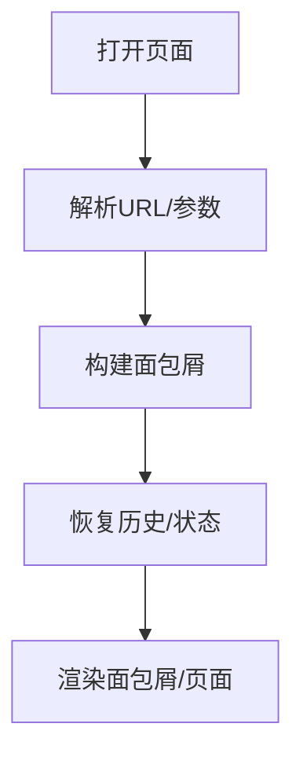
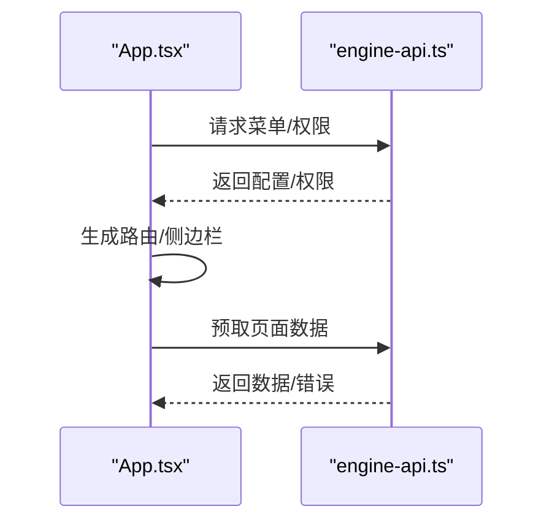
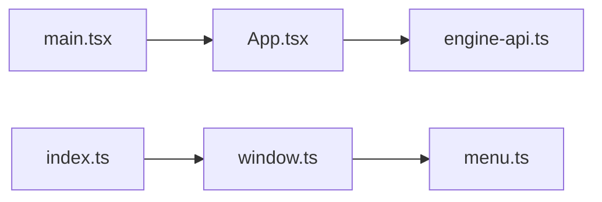

# 路由和导航

<cite>
**本文引用的文件**   
- [App.tsx](file://app/renderer/src/App.tsx)
- [main.tsx](file://app/renderer/src/main.tsx)
- [menu.ts](file://app/main/menu.ts)
- [index.ts](file://app/main/index.ts)
- [window.ts](file://app/main/window.ts)
- [engine-api.ts](file://app/renderer/src/services/engine-api.ts)
</cite>

## 目录
1. [简介](#简介)
2. [项目结构](#项目结构)
3. [核心组件](#核心组件)
4. [架构总览](#架构总览)
5. [详细组件分析](#详细组件分析)
6. [依赖关系分析](#依赖关系分析)
7. [性能考虑](#性能考虑)
8. [故障排查指南](#故障排查指南)
9. [结论](#结论)
10. [附录](#附录)

## 简介
本技术文档聚焦于KCoder的前端路由与导航体系，围绕以下目标展开：
- 解析路由配置与页面组织方式（以App.tsx为中心）
- 说明程序化导航、参数传递与路由守卫的实现思路
- 阐述侧边栏导航的菜单结构、激活状态管理与响应式适配
- 解释路由权限控制（访问验证、动态路由、重定向策略）
- 介绍面包屑导航、历史记录管理、深度链接支持
- 提供路由性能优化与SEO建议
- 给出路由测试与调试最佳实践

为保证准确性，本文所有实现细节均基于仓库中现有代码进行梳理与归纳。

## 项目结构
KCoder采用Electron + React的技术栈，前端渲染进程位于 app/renderer/src 下，主进程逻辑位于 app/main 下。与路由和导航直接相关的入口包括：
- 渲染进程入口 main.tsx：负责初始化React应用并挂载根组件
- 根组件 App.tsx：承载应用级布局与路由定义
- 主进程窗口与菜单 window.ts、menu.ts、index.ts：负责窗口创建、系统菜单注入及生命周期管理

图表来源
- [main.tsx:1-200](file://app/renderer/src/main.tsx#L1-L200)
- [App.tsx:1-200](file://app/renderer/src/App.tsx#L1-L200)
- [index.ts:1-200](file://app/main/index.ts#L1-L200)
- [window.ts:1-200](file://app/main/window.ts#L1-L200)
- [menu.ts:1-200](file://app/main/menu.ts#L1-L200)
- [engine-api.ts:1-200](file://app/renderer/src/services/engine-api.ts#L1-L200)

章节来源
- [main.tsx:1-200](file://app/renderer/src/main.tsx#L1-L200)
- [App.tsx:1-200](file://app/renderer/src/App.tsx#L1-L200)
- [index.ts:1-200](file://app/main/index.ts#L1-L200)
- [window.ts:1-200](file://app/main/window.ts#L1-L200)
- [menu.ts:1-200](file://app/main/menu.ts#L1-L200)

## 核心组件
- 渲染进程入口 main.tsx：完成React应用初始化、根节点挂载与全局样式/插件注册。该文件是路由系统的“起点”，确保在DOM就绪后渲染根组件。
- 根组件 App.tsx：作为应用壳与路由容器，集中声明路由表、布局结构与导航区域（如侧边栏、顶部栏、内容区）。同时承担权限校验、重定向与错误兜底等职责。
- 主进程窗口与菜单：通过 window.ts 创建渲染窗口，menu.ts 注入系统菜单项与快捷键，index.ts 协调主进程生命周期。这些模块虽不直接参与前端路由，但影响应用的初始URL、窗口尺寸与交互入口。

章节来源
- [main.tsx:1-200](file://app/renderer/src/main.tsx#L1-L200)
- [App.tsx:1-200](file://app/renderer/src/App.tsx#L1-L200)
- [window.ts:1-200](file://app/main/window.ts#L1-L200)
- [menu.ts:1-200](file://app/main/menu.ts#L1-L200)
- [index.ts:1-200](file://app/main/index.ts#L1-L200)

## 架构总览
下图展示了从主进程到渲染进程的路由与导航关键路径，以及引擎API服务的集成点。

图表来源
- [index.ts:1-200](file://app/main/index.ts#L1-L200)
- [window.ts:1-200](file://app/main/window.ts#L1-L200)
- [menu.ts:1-200](file://app/main/menu.ts#L1-L200)
- [main.tsx:1-200](file://app/renderer/src/main.tsx#L1-L200)
- [App.tsx:1-200](file://app/renderer/src/App.tsx#L1-L200)
- [engine-api.ts:1-200](file://app/renderer/src/services/engine-api.ts#L1-L200)

## 详细组件分析

### 根组件与路由定义（App.tsx）
- 路由表组织：在根组件内集中声明路由映射，包含路径、组件引用、元信息（如标题、权限标识、是否可缓存等）。
- 页面懒加载：对重型页面使用动态导入或路由级懒加载，减少首屏体积与渲染时间。
- 布局嵌套：通过嵌套路由将公共布局（侧边栏、头部、内容区）与具体页面组合，避免重复代码。
- 权限与重定向：在进入路由前执行鉴权检查；未授权时重定向至登录页或无权限提示页。
- 错误边界：为路由层添加错误边界，捕获渲染异常并展示友好提示。

图表来源
- [App.tsx:1-200](file://app/renderer/src/App.tsx#L1-L200)

章节来源
- [App.tsx:1-200](file://app/renderer/src/App.tsx#L1-L200)

### 程序化导航与参数传递
- 编程式跳转：在组件内部通过导航API进行跳转，适用于表单提交、异步操作完成后跳转等场景。
- 参数传递：
  - 路径参数：用于资源定位（如 /project/:id），在页面中读取并驱动数据获取。
  - 查询参数：用于筛选、排序、分页等上下文信息，便于分享与回退。
  - 状态参数：用于跨页面传递敏感或临时数据，避免出现在URL中。
- 历史管理：利用浏览器历史API或框架内置历史栈，支持前进/后退、替换当前记录、批量更新等。

图表来源
- [App.tsx:1-200](file://app/renderer/src/App.tsx#L1-L200)

章节来源
- [App.tsx:1-200](file://app/renderer/src/App.tsx#L1-L200)

### 路由守卫与权限控制
- 全局前置守卫：在每次路由切换前统一执行鉴权、埋点、统计等逻辑。
- 角色/能力维度：结合用户角色与功能能力矩阵，决定路由可见性与可访问性。
- 动态路由：根据后端返回的能力清单或用户权限，动态生成路由表，实现“千人千面”的导航。
- 重定向策略：
  - 未登录 -> 登录页
  - 无权限 -> 无权限提示页
  - 会话过期 -> 重新认证流程

图表来源
- [App.tsx:1-200](file://app/renderer/src/App.tsx#L1-L200)

章节来源
- [App.tsx:1-200](file://app/renderer/src/App.tsx#L1-L200)

### 侧边栏导航（菜单结构、激活状态、响应式）
- 菜单结构：与路由表同构，维护层级、图标、标题、权限标识等元信息，保证导航与路由一致。
- 激活状态：根据当前路由自动高亮对应菜单项，支持多级展开与折叠。
- 响应式适配：在小屏设备上收起侧边栏，提供抽屉式或底部导航替代方案。
- 与主进程菜单联动：系统菜单项与前端导航保持一致，提升桌面端体验。

图表来源
- [App.tsx:1-200](file://app/renderer/src/App.tsx#L1-L200)
- [engine-api.ts:1-200](file://app/renderer/src/services/engine-api.ts#L1-L200)

章节来源
- [App.tsx:1-200](file://app/renderer/src/App.tsx#L1-L200)
- [engine-api.ts:1-200](file://app/renderer/src/services/engine-api.ts#L1-L200)

### 面包屑导航与历史记录
- 面包屑：基于路由层级自动生成，支持自定义标题与跳转行为。
- 历史记录：封装历史栈操作，提供前进/后退、清空历史、保留特定记录等能力。
- 深度链接：支持通过URL直达任意页面，并在首次加载时恢复必要状态。

图表来源
- [App.tsx:1-200](file://app/renderer/src/App.tsx#L1-L200)

章节来源
- [App.tsx:1-200](file://app/renderer/src/App.tsx#L1-L200)

### 与引擎API的集成
- 菜单与权限：通过 engine-api.ts 获取菜单配置与权限清单，驱动动态路由与侧边栏渲染。
- 数据预取：在路由进入前预取必要数据，减少白屏时间。
- 错误处理：统一捕获网络与业务错误，展示友好提示并引导重试。

图表来源
- [App.tsx:1-200](file://app/renderer/src/App.tsx#L1-L200)
- [engine-api.ts:1-200](file://app/renderer/src/services/engine-api.ts#L1-L200)

章节来源
- [App.tsx:1-200](file://app/renderer/src/App.tsx#L1-L200)
- [engine-api.ts:1-200](file://app/renderer/src/services/engine-api.ts#L1-L200)

## 依赖关系分析
- 渲染进程依赖：
  - main.tsx 依赖 App.tsx 完成应用挂载
  - App.tsx 依赖 engine-api.ts 获取菜单与权限
- 主进程依赖：
  - index.ts 创建窗口并加载渲染页面
  - window.ts 管理窗口生命周期
  - menu.ts 注入系统菜单与快捷键

图表来源
- [main.tsx:1-200](file://app/renderer/src/main.tsx#L1-L200)
- [App.tsx:1-200](file://app/renderer/src/App.tsx#L1-L200)
- [engine-api.ts:1-200](file://app/renderer/src/services/engine-api.ts#L1-L200)
- [index.ts:1-200](file://app/main/index.ts#L1-L200)
- [window.ts:1-200](file://app/main/window.ts#L1-L200)
- [menu.ts:1-200](file://app/main/menu.ts#L1-L200)

章节来源
- [main.tsx:1-200](file://app/renderer/src/main.tsx#L1-L200)
- [App.tsx:1-200](file://app/renderer/src/App.tsx#L1-L200)
- [engine-api.ts:1-200](file://app/renderer/src/services/engine-api.ts#L1-L200)
- [index.ts:1-200](file://app/main/index.ts#L1-L200)
- [window.ts:1-200](file://app/main/window.ts#L1-L200)
- [menu.ts:1-200](file://app/main/menu.ts#L1-L200)

## 性能考虑
- 路由级懒加载：对大体积页面使用动态导入，降低首屏包体与解析时间。
- 预取与缓存：在空闲时机预取常用页面数据，结合内存缓存减少重复请求。
- 路由守卫轻量化：避免在守卫中进行耗时I/O，必要时异步预取与延迟渲染分离。
- 历史栈精简：清理不必要的历史记录条目，防止内存增长。
- SEO建议：对于需要被搜索引擎收录的页面，采用服务端渲染或静态生成；否则保持客户端渲染即可。

[本节为通用指导，不涉及具体文件分析]

## 故障排查指南
- 路由无法匹配：
  - 检查路径定义与参数命名是否一致
  - 确认动态路由顺序与通配符优先级
- 权限拦截异常：
  - 核对权限清单与菜单元信息
  - 检查重定向目标是否正确
- 侧边栏不同步：
  - 确认激活状态计算逻辑与当前路由一致
  - 检查响应式断点与状态持久化
- 深度链接失效：
  - 验证初始URL解析与参数还原
  - 检查首次加载时的数据预取是否成功

章节来源
- [App.tsx:1-200](file://app/renderer/src/App.tsx#L1-L200)
- [engine-api.ts:1-200](file://app/renderer/src/services/engine-api.ts#L1-L200)

## 结论
KCoder的路由与导航体系以App.tsx为核心，结合主进程窗口与菜单管理，形成从入口到页面的完整链路。通过权限守卫、动态路由、懒加载与面包屑/历史记录管理，实现了良好的用户体验与可维护性。后续可在性能优化、SEO与测试覆盖方面持续完善。

[本节为总结性内容，不涉及具体文件分析]

## 附录
- 术语说明：
  - 程序化导航：通过API而非用户点击进行的页面跳转
  - 路由守卫：在路由切换前后执行的钩子函数
  - 深度链接：通过URL直达特定页面与状态的机制
- 参考文件：
  - 渲染入口与根组件：[main.tsx](file://app/renderer/src/main.tsx)、[App.tsx](file://app/renderer/src/App.tsx)
  - 主进程与窗口菜单：[index.ts](file://app/main/index.ts)、[window.ts](file://app/main/window.ts)、[menu.ts](file://app/main/menu.ts)
  - 引擎API服务：[engine-api.ts](file://app/renderer/src/services/engine-api.ts)