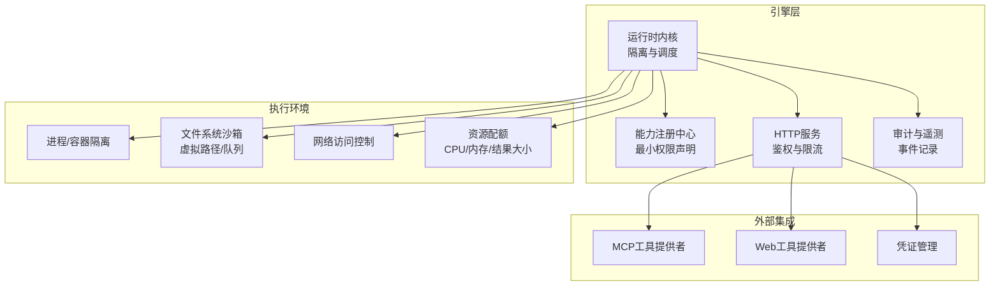
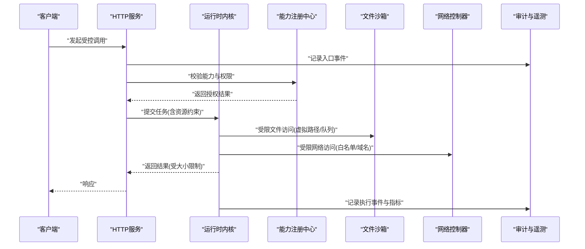
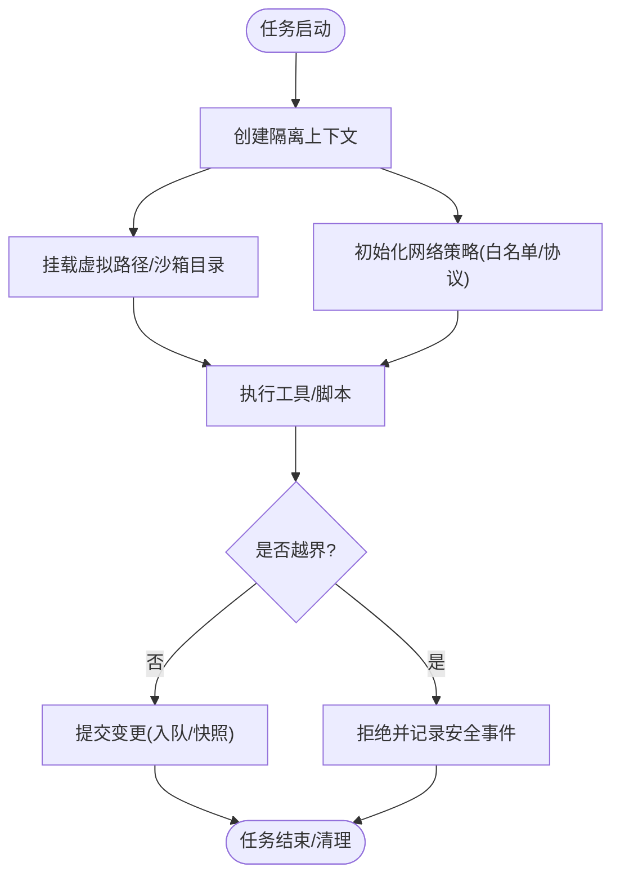
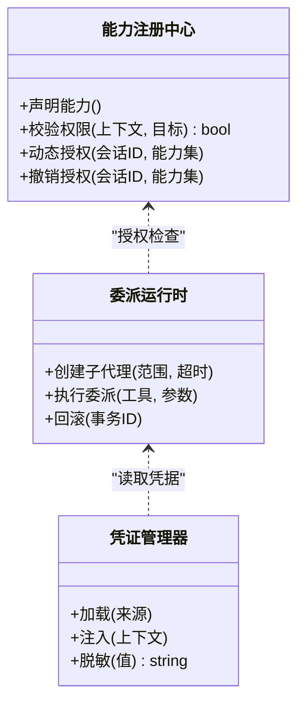
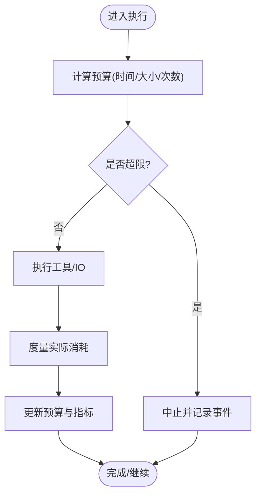
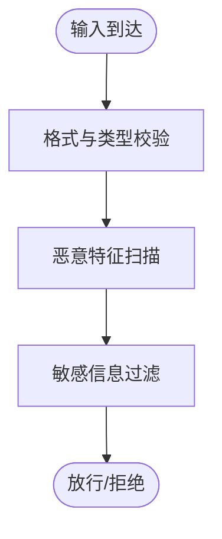
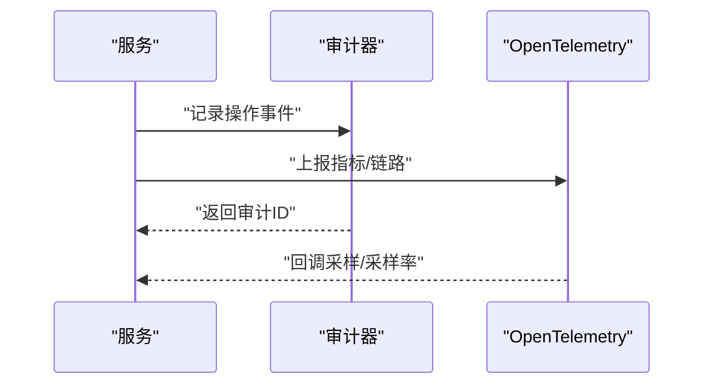
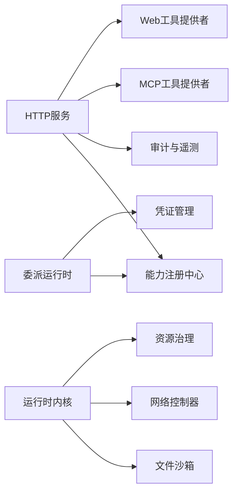

# 安全沙箱与隔离

<cite>
**本文引用的文件**   
- [engine/README.md](file://engine/README.md)
- [engine/Dockerfile](file://engine/Dockerfile)
- [engine/docker-compose.yml](file://engine/docker-compose.yml)
- [engine/config.example.json](file://engine/config.example.json)
- [engine/package.json](file://engine/package.json)
- [engine/tests/runtime-kernel-isolation.test.ts](file://engine/tests/runtime-kernel-isolation.test.ts)
- [engine/tests/command-audit.test.ts](file://engine/tests/command-audit.test.ts)
- [engine/tests/tool-result-budget.test.ts](file://engine/tests/tool-result-budget.test.ts)
- [engine/tests/runtime-kernel-budget.test.ts](file://engine/tests/runtime-kernel-budget.test.ts)
- [engine/tests/http-server-observability.test.ts](file://engine/tests/http-server-observability.test.ts)
- [engine/tests/capabilities.test.ts](file://engine/tests/capabilities.test.ts)
- [engine/tests/delegation-runtime.test.ts](file://engine/tests/delegation-runtime.test.ts)
- [engine/tests/tool-call-repair.test.ts](file://engine/tests/tool-call-repair.test.ts)
- [engine/tests/tool-storm-breaker.test.ts](file://engine/tests/tool-storm-breaker.test.ts)
- [engine/tests/file-mutation-queue.test.ts](file://engine/tests/file-mutation-queue.test.ts)
- [engine/tests/virtual-path.test.ts](file://engine/tests/virtual-path.test.ts)
- [engine/tests/mcp-config.test.ts](file://engine/tests/mcp-config.test.ts)
- [engine/tests/mcp-tool-provider.test.ts](file://engine/tests/mcp-tool-provider.test.ts)
- [engine/tests/web-tool-provider.test.ts](file://engine/tests/web-tool-provider.test.ts)
- [engine/tests/finance-credentials.test.ts](file://engine/tests/finance-credentials.test.ts)
- [engine/tests/request-history-hygiene.test.ts](file://engine/tests/request-history-hygiene.test.ts)
- [engine/tests/opentelemetry.test.ts](file://engine/tests/opentelemetry.test.ts)
- [engine/skills/security-review/SKILL.md](file://engine/skills/security-review/SKILL.md)
- [engine/skills/security-review/skill.json](file://engine/skills/security-review/skill.json)
</cite>

## 目录
1. [简介](#简介)
2. [项目结构](#项目结构)
3. [核心组件](#核心组件)
4. [架构总览](#架构总览)
5. [详细组件分析](#详细组件分析)
6. [依赖关系分析](#依赖关系分析)
7. [性能考虑](#性能考虑)
8. [故障排查指南](#故障排查指南)
9. [结论](#结论)
10. [附录](#附录)

## 简介
本文件面向KCoder引擎的安全沙箱与隔离机制，围绕执行环境隔离、权限控制、资源限制、输入输出过滤、审计与日志、安全配置、漏洞修复与应急响应等主题进行系统化说明。文档以仓库中的测试用例与配置文件为依据，提炼出可落地的实现要点与最佳实践，帮助读者理解并正确部署KCoder的安全能力。

## 项目结构
KCoder采用多包（monorepo）工程组织，与安全相关的关键位置包括：
- engine 子项目：包含运行时内核、工具链、能力注册、HTTP服务、Docker化部署与示例配置。
- tests 目录：覆盖隔离、预算、审计、能力、委派、网络访问、凭证处理、遥测等安全相关场景。
- skills/security-review：提供安全审查技能定义与使用说明。
- Dockerfile/docker-compose.yml：容器化运行与编排配置。
- config.example.json：运行时配置样例，涵盖能力、网络、存储等策略项。

[此图为概念性结构图，不直接映射具体源码文件]

## 核心组件
- 运行时内核与隔离：负责任务编排、上下文隔离、进程/容器边界、状态持久化与恢复。
- 能力注册与授权：基于“能力”模型声明工具与资源的访问范围，遵循最小权限原则。
- HTTP服务与网关：对外暴露受控API，承载鉴权、限流、审计与可观测性。
- 审计与遥测：统一采集操作事件、安全事件与指标，支持合规报告。
- 资源治理：对CPU、内存、结果大小、调用风暴等进行限制与熔断。
- 文件与网络沙箱：通过虚拟路径、变更队列与网络白名单控制I/O。
- 委派与协作：在受限范围内允许子代理或远程工具执行，具备超时与回滚。

章节来源
- [engine/README.md](file://engine/README.md)
- [engine/tests/runtime-kernel-isolation.test.ts](file://engine/tests/runtime-kernel-isolation.test.ts)
- [engine/tests/capabilities.test.ts](file://engine/tests/capabilities.test.ts)
- [engine/tests/http-server-observability.test.ts](file://engine/tests/http-server-observability.test.ts)
- [engine/tests/tool-result-budget.test.ts](file://engine/tests/tool-result-budget.test.ts)
- [engine/tests/runtime-kernel-budget.test.ts](file://engine/tests/runtime-kernel-budget.test.ts)
- [engine/tests/file-mutation-queue.test.ts](file://engine/tests/file-mutation-queue.test.ts)
- [engine/tests/virtual-path.test.ts](file://engine/tests/virtual-path.test.ts)
- [engine/tests/mcp-config.test.ts](file://engine/tests/mcp-config.test.ts)
- [engine/tests/mcp-tool-provider.test.ts](file://engine/tests/mcp-tool-provider.test.ts)
- [engine/tests/web-tool-provider.test.ts](file://engine/tests/web-tool-provider.test.ts)
- [engine/tests/finance-credentials.test.ts](file://engine/tests/finance-credentials.test.ts)
- [engine/tests/request-history-hygiene.test.ts](file://engine/tests/request-history-hygiene.test.ts)
- [engine/tests/opentelemetry.test.ts](file://engine/tests/opentelemetry.test.ts)
- [engine/tests/tool-call-repair.test.ts](file://engine/tests/tool-call-repair.test.ts)
- [engine/tests/tool-storm-breaker.test.ts](file://engine/tests/tool-storm-breaker.test.ts)
- [engine/tests/delegation-runtime.test.ts](file://engine/tests/delegation-runtime.test.ts)

## 架构总览
下图展示了从请求进入、能力校验、资源治理到执行与审计的端到端流程。

图表来源
- [engine/tests/http-server-observability.test.ts](file://engine/tests/http-server-observability.test.ts)
- [engine/tests/runtime-kernel-isolation.test.ts](file://engine/tests/runtime-kernel-isolation.test.ts)
- [engine/tests/capabilities.test.ts](file://engine/tests/capabilities.test.ts)
- [engine/tests/file-mutation-queue.test.ts](file://engine/tests/file-mutation-queue.test.ts)
- [engine/tests/virtual-path.test.ts](file://engine/tests/virtual-path.test.ts)
- [engine/tests/mcp-tool-provider.test.ts](file://engine/tests/mcp-tool-provider.test.ts)
- [engine/tests/web-tool-provider.test.ts](file://engine/tests/web-tool-provider.test.ts)
- [engine/tests/opentelemetry.test.ts](file://engine/tests/opentelemetry.test.ts)

## 详细组件分析

### 执行环境隔离
- 进程隔离与容器化：通过容器镜像与编排将执行环境与宿主解耦，限制系统调用与共享资源。
- 运行时内核隔离：为每个任务维护独立上下文、状态与生命周期，避免跨任务数据泄漏。
- 文件系统沙箱：使用虚拟路径与变更队列，确保写入行为可控、可审计、可回滚。
- 网络访问控制：仅允许白名单域名/协议，阻断敏感端口与内网探测。

图表来源
- [engine/tests/runtime-kernel-isolation.test.ts](file://engine/tests/runtime-kernel-isolation.test.ts)
- [engine/tests/file-mutation-queue.test.ts](file://engine/tests/file-mutation-queue.test.ts)
- [engine/tests/virtual-path.test.ts](file://engine/tests/virtual-path.test.ts)
- [engine/Dockerfile](file://engine/Dockerfile)
- [engine/docker-compose.yml](file://engine/docker-compose.yml)

章节来源
- [engine/tests/runtime-kernel-isolation.test.ts](file://engine/tests/runtime-kernel-isolation.test.ts)
- [engine/tests/file-mutation-queue.test.ts](file://engine/tests/file-mutation-queue.test.ts)
- [engine/tests/virtual-path.test.ts](file://engine/tests/virtual-path.test.ts)
- [engine/Dockerfile](file://engine/Dockerfile)
- [engine/docker-compose.yml](file://engine/docker-compose.yml)

### 权限控制系统
- 最小权限原则：能力声明驱动，按需授予工具与资源访问。
- 能力注册与动态授权：在运行时根据上下文动态评估授权，支持撤销与细粒度范围。
- 委派与协作：子代理或远程工具在限定范围内执行，具备超时与回退。
- 凭证与敏感信息：集中管理与脱敏，禁止硬编码与明文传输。

图表来源
- [engine/tests/capabilities.test.ts](file://engine/tests/capabilities.test.ts)
- [engine/tests/delegation-runtime.test.ts](file://engine/tests/delegation-runtime.test.ts)
- [engine/tests/finance-credentials.test.ts](file://engine/tests/finance-credentials.test.ts)

章节来源
- [engine/tests/capabilities.test.ts](file://engine/tests/capabilities.test.ts)
- [engine/tests/delegation-runtime.test.ts](file://engine/tests/delegation-runtime.test.ts)
- [engine/tests/finance-credentials.test.ts](file://engine/tests/finance-credentials.test.ts)

### 资源限制机制
- CPU与内存配额：在容器与内核层设置上限，防止资源耗尽。
- 结果大小限制：对工具返回体进行裁剪与校验，避免大对象攻击。
- 调用风暴熔断：检测异常高频调用，触发限流与降级。
- 任务预算：按任务维度累计消耗，超限即终止。

图表来源
- [engine/tests/tool-result-budget.test.ts](file://engine/tests/tool-result-budget.test.ts)
- [engine/tests/runtime-kernel-budget.test.ts](file://engine/tests/runtime-kernel-budget.test.ts)
- [engine/tests/tool-storm-breaker.test.ts](file://engine/tests/tool-storm-breaker.test.ts)

章节来源
- [engine/tests/tool-result-budget.test.ts](file://engine/tests/tool-result-budget.test.ts)
- [engine/tests/runtime-kernel-budget.test.ts](file://engine/tests/runtime-kernel-budget.test.ts)
- [engine/tests/tool-storm-breaker.test.ts](file://engine/tests/tool-storm-breaker.test.ts)

### 输入输出过滤
- 恶意代码检测：对输入脚本/模板进行静态检查与白名单校验。
- 敏感信息过滤：对输出进行正则/规则匹配，自动脱敏或丢弃。
- 格式验证：严格校验JSON/结构化数据，拒绝畸形负载。
- 历史清洗：请求历史中剔除敏感字段，降低泄露风险。

图表来源
- [engine/tests/request-history-hygiene.test.ts](file://engine/tests/request-history-hygiene.test.ts)
- [engine/tests/tool-call-repair.test.ts](file://engine/tests/tool-call-repair.test.ts)

章节来源
- [engine/tests/request-history-hygiene.test.ts](file://engine/tests/request-history-hygiene.test.ts)
- [engine/tests/tool-call-repair.test.ts](file://engine/tests/tool-call-repair.test.ts)

### 安全审计与日志记录
- 操作审计：记录关键动作（授权、文件变更、网络访问、错误）。
- 安全事件追踪：异常、越权、熔断、资源告警等事件聚合。
- 合规性报告：导出审计日志与指标，满足合规要求。
- OpenTelemetry集成：标准化遥测数据，便于集中分析与告警。

图表来源
- [engine/tests/command-audit.test.ts](file://engine/tests/command-audit.test.ts)
- [engine/tests/http-server-observability.test.ts](file://engine/tests/http-server-observability.test.ts)
- [engine/tests/opentelemetry.test.ts](file://engine/tests/opentelemetry.test.ts)

章节来源
- [engine/tests/command-audit.test.ts](file://engine/tests/command-audit.test.ts)
- [engine/tests/http-server-observability.test.ts](file://engine/tests/http-server-observability.test.ts)
- [engine/tests/opentelemetry.test.ts](file://engine/tests/opentelemetry.test.ts)

### 安全配置指南
- 白名单管理：域名、协议、IP段、工具名、能力集合需显式声明。
- 黑名单规则：危险命令、高危函数、敏感路径、可疑模式应拦截。
- 安全策略配置：通过配置样例启用/调整各项开关，如网络、存储、预算、审计。
- 能力与委派策略：默认拒绝，按需开启；委派需设置超时与回滚点。

章节来源
- [engine/config.example.json](file://engine/config.example.json)
- [engine/tests/mcp-config.test.ts](file://engine/tests/mcp-config.test.ts)
- [engine/tests/mcp-tool-provider.test.ts](file://engine/tests/mcp-tool-provider.test.ts)
- [engine/tests/web-tool-provider.test.ts](file://engine/tests/web-tool-provider.test.ts)

### 安全漏洞检测与修复最佳实践
- 依赖与镜像扫描：构建阶段引入扫描，阻断已知漏洞版本。
- 运行时防护：结合熔断、预算与沙箱，降低利用面。
- 快速修复：热更新能力与策略配置，缩短暴露窗口。
- 回归验证：自动化测试覆盖安全用例，确保修复有效。

章节来源
- [engine/Dockerfile](file://engine/Dockerfile)
- [engine/tests/tool-storm-breaker.test.ts](file://engine/tests/tool-storm-breaker.test.ts)
- [engine/tests/tool-call-repair.test.ts](file://engine/tests/tool-call-repair.test.ts)

### 威胁防御与应急响应流程
- 威胁建模：识别资产、攻击面与潜在威胁，制定缓解措施。
- 实时检测：基于审计与遥测建立告警阈值与规则。
- 应急流程：发现—隔离—取证—修复—复盘—加固。
- 演练与复盘：定期红蓝对抗与桌面推演，完善预案。

章节来源
- [engine/tests/http-server-observability.test.ts](file://engine/tests/http-server-observability.test.ts)
- [engine/tests/opentelemetry.test.ts](file://engine/tests/opentelemetry.test.ts)
- [engine/skills/security-review/SKILL.md](file://engine/skills/security-review/SKILL.md)
- [engine/skills/security-review/skill.json](file://engine/skills/security-review/skill.json)

## 依赖关系分析
- 内部依赖：HTTP服务依赖能力注册与审计模块；内核依赖文件沙箱与网络控制器；委派运行时依赖能力与凭证管理。
- 外部依赖：容器运行时、操作系统内核特性、OpenTelemetry后端、MCP/Web工具提供方。
- 耦合与内聚：通过能力与接口契约降低耦合；通过沙箱与预算提升内聚。
- 循环依赖：应避免在能力、审计与内核之间形成环状依赖，建议通过事件总线或消息队列解耦。

图表来源
- [engine/tests/capabilities.test.ts](file://engine/tests/capabilities.test.ts)
- [engine/tests/http-server-observability.test.ts](file://engine/tests/http-server-observability.test.ts)
- [engine/tests/file-mutation-queue.test.ts](file://engine/tests/file-mutation-queue.test.ts)
- [engine/tests/mcp-tool-provider.test.ts](file://engine/tests/mcp-tool-provider.test.ts)
- [engine/tests/web-tool-provider.test.ts](file://engine/tests/web-tool-provider.test.ts)
- [engine/tests/finance-credentials.test.ts](file://engine/tests/finance-credentials.test.ts)

章节来源
- [engine/tests/capabilities.test.ts](file://engine/tests/capabilities.test.ts)
- [engine/tests/http-server-observability.test.ts](file://engine/tests/http-server-observability.test.ts)
- [engine/tests/file-mutation-queue.test.ts](file://engine/tests/file-mutation-queue.test.ts)
- [engine/tests/mcp-tool-provider.test.ts](file://engine/tests/mcp-tool-provider.test.ts)
- [engine/tests/web-tool-provider.test.ts](file://engine/tests/web-tool-provider.test.ts)
- [engine/tests/finance-credentials.test.ts](file://engine/tests/finance-credentials.test.ts)

## 性能考虑
- 预算与熔断：合理设置CPU/内存/结果大小阈值，避免雪崩。
- 异步与批处理：文件变更入队、批量写入减少锁竞争。
- 缓存与复用：只读数据与能力元数据缓存，降低开销。
- 可观测性：采样与分级日志，避免审计成为瓶颈。

[本节为通用指导，不直接分析具体文件]

## 故障排查指南
- 常见症状
  - 任务被意外中断：检查预算与熔断策略。
  - 文件写入失败：确认虚拟路径与变更队列状态。
  - 网络访问被拒：核对白名单与协议策略。
  - 审计缺失：检查审计器与OpenTelemetry链路。
- 定位步骤
  - 查看审计事件与遥测指标，定位异常时间点。
  - 复现实例并开启更细粒度日志。
  - 逐步关闭非必需能力，缩小问题域。
- 修复建议
  - 调整预算与超时参数。
  - 修正能力声明与白名单。
  - 修复工具调用与输入校验逻辑。

章节来源
- [engine/tests/runtime-kernel-budget.test.ts](file://engine/tests/runtime-kernel-budget.test.ts)
- [engine/tests/file-mutation-queue.test.ts](file://engine/tests/file-mutation-queue.test.ts)
- [engine/tests/mcp-config.test.ts](file://engine/tests/mcp-config.test.ts)
- [engine/tests/opentelemetry.test.ts](file://engine/tests/opentelemetry.test.ts)

## 结论
KCoder通过“能力+沙箱+预算+审计”的组合拳，构建了纵深防御体系。建议在部署时严格遵循最小权限、白名单与预算策略，持续完善审计与遥测，并以自动化测试保障安全回归。面对新威胁，应快速迭代策略与补丁，保持系统的韧性与可观测性。

## 附录
- 参考配置与部署
  - 容器镜像与编排：见Dockerfile与docker-compose.yml。
  - 运行时配置样例：见config.example.json。
  - 包与脚本：见package.json与工作区配置。

章节来源
- [engine/Dockerfile](file://engine/Dockerfile)
- [engine/docker-compose.yml](file://engine/docker-compose.yml)
- [engine/config.example.json](file://engine/config.example.json)
- [engine/package.json](file://engine/package.json)