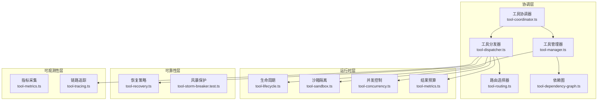
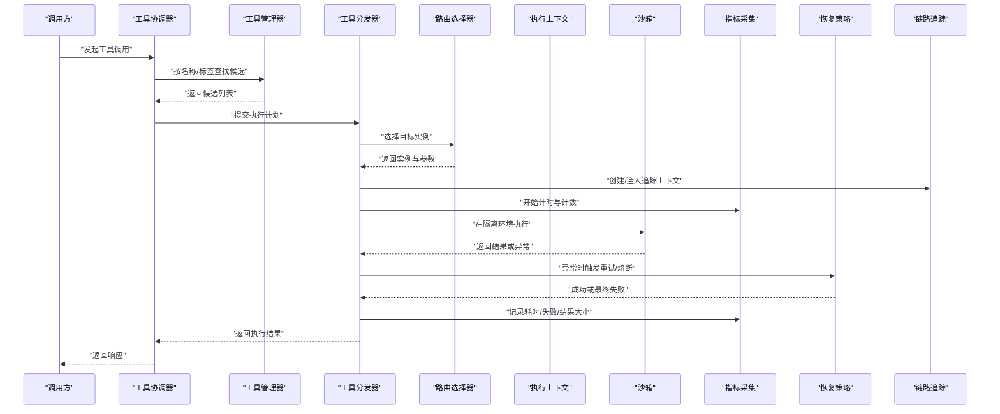
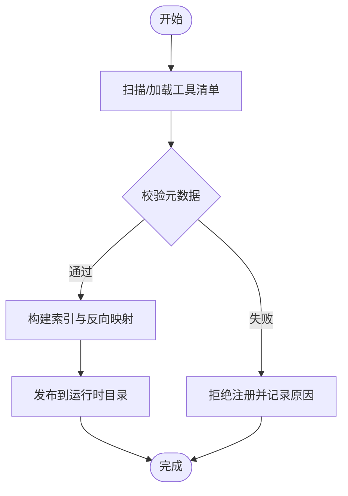
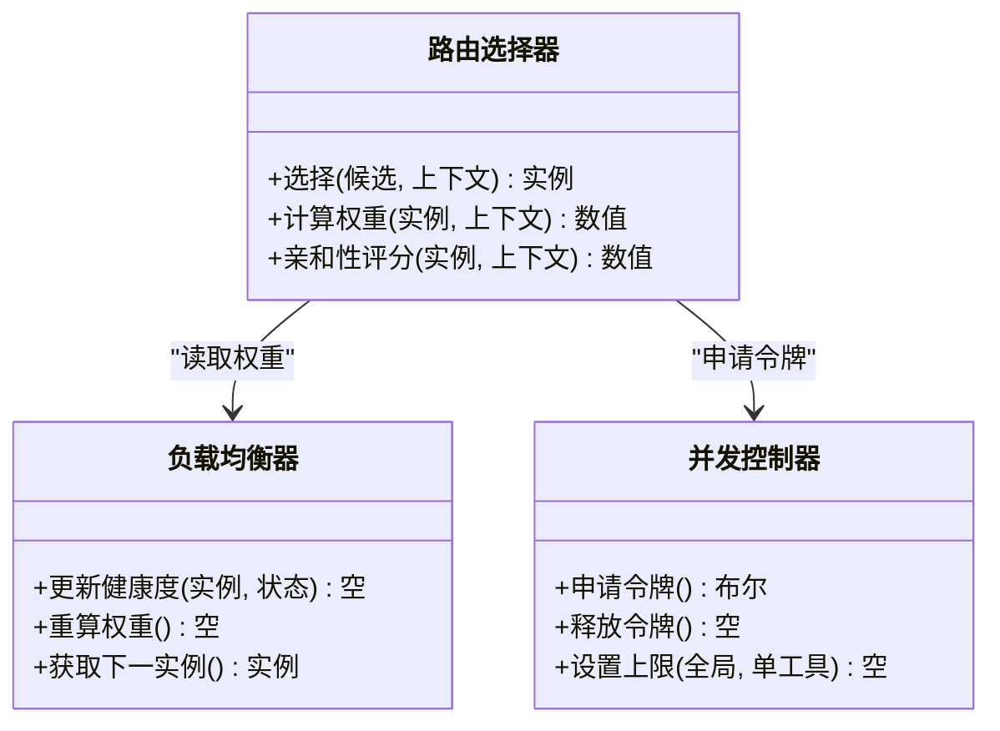
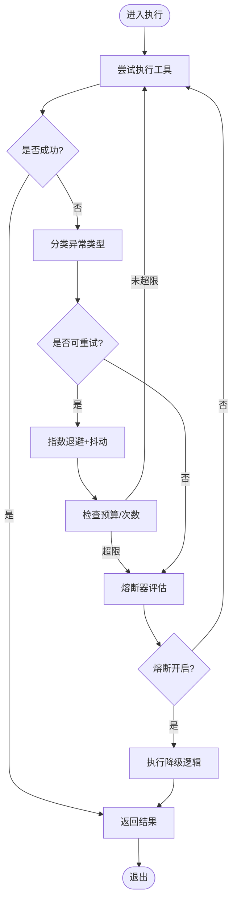
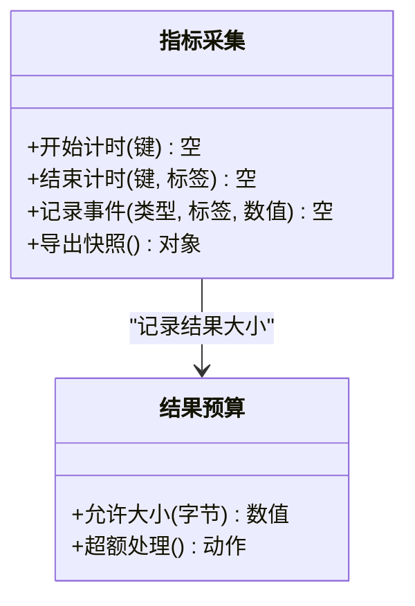
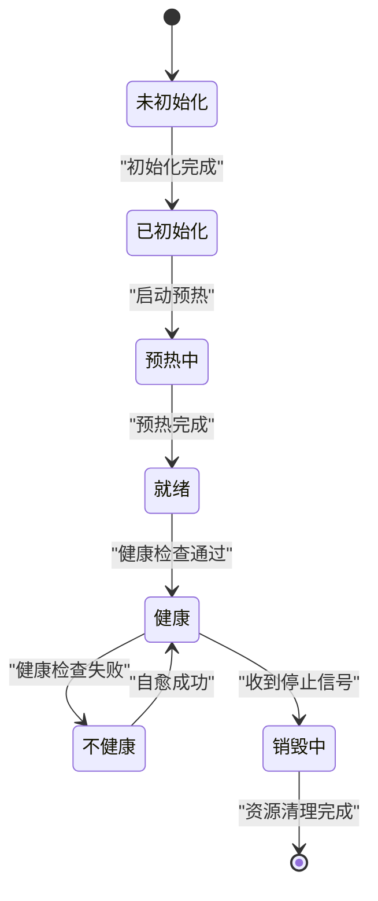
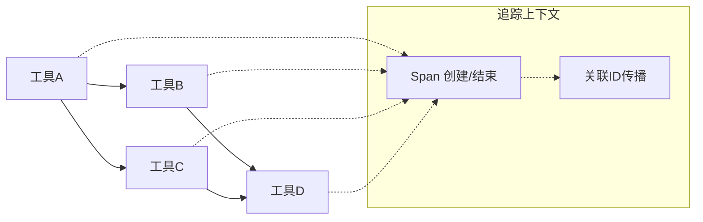
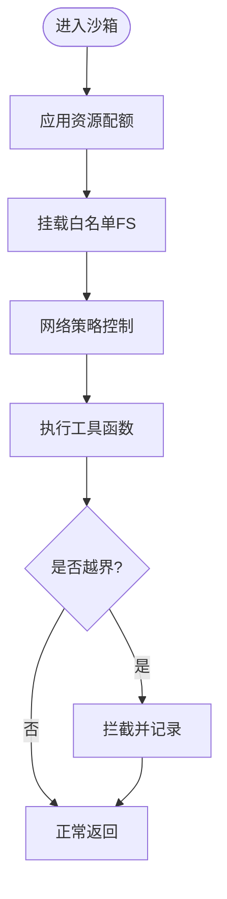
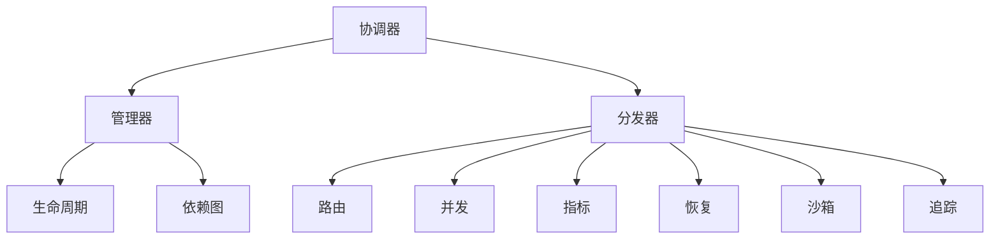

# 工具协调器

<cite>
**本文引用的文件**   
- [engine/packages/engine/src/tool-coordinator.ts](file://engine/packages/engine/src/tool-coordinator.ts)
- [engine/packages/engine/src/tool-dispatcher.ts](file://engine/packages/engine/src/tool-dispatcher.ts)
- [engine/packages/engine/src/tool-manager.ts](file://engine/packages/engine/src/tool-manager.ts)
- [engine/packages/engine/src/tool-metadata.ts](file://engine/packages/engine/src/tool-metadata.ts)
- [engine/packages/engine/src/tool-lifecycle.ts](file://engine/packages/engine/src/tool-lifecycle.ts)
- [engine/packages/engine/src/tool-sandbox.ts](file://engine/packages/engine/src/tool-sandbox.ts)
- [engine/packages/engine/src/tool-metrics.ts](file://engine/packages/engine/src/tool-metrics.ts)
- [engine/packages/engine/src/tool-recovery.ts](file://engine/packages/engine/src/tool-recovery.ts)
- [engine/packages/engine/src/tool-tracing.ts](file://engine/packages/engine/src/tool-tracing.ts)
- [engine/packages/engine/src/tool-routing.ts](file://engine/packages/engine/src/tool-routing.ts)
- [engine/packages/engine/src/tool-concurrency.ts](file://engine/packages/engine/src/tool-concurrency.ts)
- [engine/packages/engine/src/tool-dependency-graph.ts](file://engine/packages/engine/src/tool-dependency-graph.ts)
- [tests/tool-coordinator-runtime.test.ts](file://engine/tests/tool-coordinator-runtime.test.ts)
- [tests/tool-dispatch-errors.test.ts](file://engine/tests/tool-dispatch-errors.test.ts)
- [tests/tool-result-budget.test.ts](file://engine/tests/tool-result-budget.test.ts)
- [tests/tool-storm-breaker.test.ts](file://engine/tests/tool-storm-breaker.test.ts)
</cite>

## 目录
1. [简介](#简介)
2. [项目结构](#项目结构)
3. [核心组件](#核心组件)
4. [架构总览](#架构总览)
5. [详细组件分析](#详细组件分析)
6. [依赖关系分析](#依赖关系分析)
7. [性能考量](#性能考量)
8. [故障排查指南](#故障排查指南)
9. [结论](#结论)
10. [附录](#附录)

## 简介
本文件为 KCoder 引擎中的“工具协调器”提供全面技术文档。围绕工具的发现与注册、元数据管理、执行调度（路由/负载均衡/并发控制）、错误恢复（异常捕获/重试/熔断降级）、性能监控（调用统计/延迟分析/资源使用）、生命周期管理（初始化/预热/销毁）、依赖管理与调用链追踪，以及开发规范、安全沙箱与隔离、测试策略与调试方法、集成最佳实践与性能优化建议进行系统化说明。

## 项目结构
工具协调器位于 engine 子工程内，采用分层与模块化组织：
- 协调层：负责工具发现、注册、编排与调度
- 运行时层：负责执行上下文、并发控制、资源配额与结果预算
- 可观测性层：负责指标采集、链路追踪与审计
- 可靠性层：负责错误恢复、熔断降级与风暴保护
- 安全层：负责沙箱隔离、权限约束与环境隔离
- 依赖图：负责声明式依赖解析与拓扑排序

图表来源
- [engine/packages/engine/src/tool-coordinator.ts](file://engine/packages/engine/src/tool-coordinator.ts)
- [engine/packages/engine/src/tool-manager.ts](file://engine/packages/engine/src/tool-manager.ts)
- [engine/packages/engine/src/tool-dispatcher.ts](file://engine/packages/engine/src/tool-dispatcher.ts)
- [engine/packages/engine/src/tool-routing.ts](file://engine/packages/engine/src/tool-routing.ts)
- [engine/packages/engine/src/tool-concurrency.ts](file://engine/packages/engine/src/tool-concurrency.ts)
- [engine/packages/engine/src/tool-metrics.ts](file://engine/packages/engine/src/tool-metrics.ts)
- [engine/packages/engine/src/tool-recovery.ts](file://engine/packages/engine/src/tool-recovery.ts)
- [engine/packages/engine/src/tool-lifecycle.ts](file://engine/packages/engine/src/tool-lifecycle.ts)
- [engine/packages/engine/src/tool-sandbox.ts](file://engine/packages/engine/src/tool-sandbox.ts)
- [engine/packages/engine/src/tool-tracing.ts](file://engine/packages/engine/src/tool-tracing.ts)
- [engine/packages/engine/src/tool-dependency-graph.ts](file://engine/packages/engine/src/tool-dependency-graph.ts)
- [tests/tool-storm-breaker.test.ts](file://engine/tests/tool-storm-breaker.test.ts)

章节来源
- [engine/packages/engine/src/tool-coordinator.ts](file://engine/packages/engine/src/tool-coordinator.ts)
- [engine/packages/engine/src/tool-manager.ts](file://engine/packages/engine/src/tool-manager.ts)
- [engine/packages/engine/src/tool-dispatcher.ts](file://engine/packages/engine/src/tool-dispatcher.ts)

## 核心组件
- 工具协调器：对外入口，统一编排工具发现、注册、调度与治理策略。
- 工具管理器：维护工具清单、版本与能力标签，提供查询与过滤。
- 工具分发器：根据请求上下文与策略选择具体实例，并驱动执行。
- 路由选择器：基于名称、标签、权重与亲和性进行路由决策。
- 并发控制器：限制全局与单工具并发度，避免过载。
- 指标与预算：记录调用次数、耗时分布、失败率与结果大小预算。
- 恢复策略：封装重试、退避、熔断与降级逻辑。
- 沙箱隔离：为工具执行提供受限环境与资源配额。
- 生命周期：管理工具初始化、预热、健康检查与销毁。
- 依赖图：解析工具间依赖，生成可执行顺序与冲突检测。
- 链路追踪：贯穿一次调用的全链路上下文与采样上报。

章节来源
- [engine/packages/engine/src/tool-coordinator.ts](file://engine/packages/engine/src/tool-coordinator.ts)
- [engine/packages/engine/src/tool-manager.ts](file://engine/packages/engine/src/tool-manager.ts)
- [engine/packages/engine/src/tool-dispatcher.ts](file://engine/packages/engine/src/tool-dispatcher.ts)
- [engine/packages/engine/src/tool-metrics.ts](file://engine/packages/engine/src/tool-metrics.ts)
- [engine/packages/engine/src/tool-recovery.ts](file://engine/packages/engine/src/tool-recovery.ts)
- [engine/packages/engine/src/tool-lifecycle.ts](file://engine/packages/engine/src/tool-lifecycle.ts)
- [engine/packages/engine/src/tool-sandbox.ts](file://engine/packages/engine/src/tool-sandbox.ts)
- [engine/packages/engine/src/tool-dependency-graph.ts](file://engine/packages/engine/src/tool-dependency-graph.ts)
- [engine/packages/engine/src/tool-tracing.ts](file://engine/packages/engine/src/tool-tracing.ts)

## 架构总览
工具协调器作为中枢，将上层任务分解为工具调用序列，通过分发器选择合适实例，在沙箱中受控执行，期间由并发控制器限流、指标系统采集、恢复策略兜底，并由依赖图保证执行顺序正确。

图表来源
- [engine/packages/engine/src/tool-coordinator.ts](file://engine/packages/engine/src/tool-coordinator.ts)
- [engine/packages/engine/src/tool-dispatcher.ts](file://engine/packages/engine/src/tool-dispatcher.ts)
- [engine/packages/engine/src/tool-routing.ts](file://engine/packages/engine/src/tool-routing.ts)
- [engine/packages/engine/src/tool-metrics.ts](file://engine/packages/engine/src/tool-metrics.ts)
- [engine/packages/engine/src/tool-recovery.ts](file://engine/packages/engine/src/tool-recovery.ts)
- [engine/packages/engine/src/tool-sandbox.ts](file://engine/packages/engine/src/tool-sandbox.ts)
- [engine/packages/engine/src/tool-tracing.ts](file://engine/packages/engine/src/tool-tracing.ts)

## 详细组件分析

### 工具注册与元数据管理
- 发现机制：支持静态清单与动态扫描；通过能力标签与版本信息进行筛选。
- 注册流程：校验签名、合并默认配置、写入索引、建立反向映射。
- 元数据结构：包含名称、版本、能力标签、输入输出模式、权限需求、资源上限等。
- 变更治理：增量更新、灰度发布、回滚策略与一致性校验。

图表来源
- [engine/packages/engine/src/tool-manager.ts](file://engine/packages/engine/src/tool-manager.ts)
- [engine/packages/engine/src/tool-metadata.ts](file://engine/packages/engine/src/tool-metadata.ts)

章节来源
- [engine/packages/engine/src/tool-manager.ts](file://engine/packages/engine/src/tool-manager.ts)
- [engine/packages/engine/src/tool-metadata.ts](file://engine/packages/engine/src/tool-metadata.ts)

### 执行调度算法（路由/负载均衡/并发）
- 路由策略：按名称精确匹配、按标签模糊匹配、按亲和性与权重加权随机。
- 负载均衡：基于实例健康度、负载因子与队列长度动态调整权重。
- 并发控制：全局令牌桶与每工具信号量组合，防止雪崩。
- 超时与抢占：可配置的硬超时与软抢占，保障整体SLA。

图表来源
- [engine/packages/engine/src/tool-routing.ts](file://engine/packages/engine/src/tool-routing.ts)
- [engine/packages/engine/src/tool-concurrency.ts](file://engine/packages/engine/src/tool-concurrency.ts)
- [engine/packages/engine/src/tool-dispatcher.ts](file://engine/packages/engine/src/tool-dispatcher.ts)

章节来源
- [engine/packages/engine/src/tool-dispatcher.ts](file://engine/packages/engine/src/tool-dispatcher.ts)
- [engine/packages/engine/src/tool-routing.ts](file://engine/packages/engine/src/tool-routing.ts)
- [engine/packages/engine/src/tool-concurrency.ts](file://engine/packages/engine/src/tool-concurrency.ts)

### 错误恢复策略（异常捕获/重试/熔断降级）
- 异常分类：参数错误、运行时错误、外部依赖错误、资源不足。
- 重试策略：指数退避、抖动、最大次数与条件重试（幂等优先）。
- 熔断降级：滑动窗口错误率阈值、半开探测、快速失败与默认值降级。
- 风暴保护：突发流量抑制与背压，避免级联失败。

图表来源
- [engine/packages/engine/src/tool-recovery.ts](file://engine/packages/engine/src/tool-recovery.ts)
- [tests/tool-storm-breaker.test.ts](file://engine/tests/tool-storm-breaker.test.ts)

章节来源
- [engine/packages/engine/src/tool-recovery.ts](file://engine/packages/engine/src/tool-recovery.ts)
- [tests/tool-storm-breaker.test.ts](file://engine/tests/tool-storm-breaker.test.ts)

### 性能监控（调用统计/延迟分析/资源使用）
- 指标维度：QPS、P50/P95/P99延迟、错误率、结果大小、CPU/内存占用。
- 采样策略：关键路径全采样，常规路径按比例采样。
- 聚合与上报：本地聚合窗口、批量上报、降采样与压缩。
- 告警规则：阈值与趋势结合，避免误报。

图表来源
- [engine/packages/engine/src/tool-metrics.ts](file://engine/packages/engine/src/tool-metrics.ts)
- [tests/tool-result-budget.test.ts](file://engine/tests/tool-result-budget.test.ts)

章节来源
- [engine/packages/engine/src/tool-metrics.ts](file://engine/packages/engine/src/tool-metrics.ts)
- [tests/tool-result-budget.test.ts](file://engine/tests/tool-result-budget.test.ts)

### 生命周期管理（初始化/预热/销毁）
- 初始化：加载配置、建立连接池、校验依赖。
- 预热：按需预取缓存、建立长连接、填充热路径。
- 健康检查：周期性探针、自动剔除不健康实例。
- 销毁：优雅关闭、资源回收、持久化状态落盘。

图表来源
- [engine/packages/engine/src/tool-lifecycle.ts](file://engine/packages/engine/src/tool-lifecycle.ts)

章节来源
- [engine/packages/engine/src/tool-lifecycle.ts](file://engine/packages/engine/src/tool-lifecycle.ts)

### 依赖管理与调用链追踪
- 依赖解析：声明式依赖表、拓扑排序、循环依赖检测。
- 执行顺序：DAG 驱动，满足依赖后并行推进。
- 调用链追踪：跨进程/线程的上下文传播、采样与关联ID。
- 审计日志：关键步骤留痕，便于回溯与合规。

图表来源
- [engine/packages/engine/src/tool-dependency-graph.ts](file://engine/packages/engine/src/tool-dependency-graph.ts)
- [engine/packages/engine/src/tool-tracing.ts](file://engine/packages/engine/src/tool-tracing.ts)

章节来源
- [engine/packages/engine/src/tool-dependency-graph.ts](file://engine/packages/engine/src/tool-dependency-graph.ts)
- [engine/packages/engine/src/tool-tracing.ts](file://engine/packages/engine/src/tool-tracing.ts)

### 安全沙箱与执行环境隔离
- 进程/容器隔离：独立命名空间、最小权限原则。
- 资源限制：CPU/内存/IO/网络配额与配额超时报错。
- 文件系统白名单：只读挂载、临时目录隔离。
- 代码注入防护：禁用危险API、严格输入校验。

图表来源
- [engine/packages/engine/src/tool-sandbox.ts](file://engine/packages/engine/src/tool-sandbox.ts)

章节来源
- [engine/packages/engine/src/tool-sandbox.ts](file://engine/packages/engine/src/tool-sandbox.ts)

### 工具开发指南（接口规范/参数验证/返回值处理）
- 接口规范：统一的输入输出模式、错误码约定、幂等要求。
- 参数验证：必填字段、类型约束、范围与格式校验。
- 返回值处理：结构化响应、分页与游标、大结果分片。
- 文档与示例：自动生成 API 文档与契约测试用例。

章节来源
- [engine/packages/engine/src/tool-metadata.ts](file://engine/packages/engine/src/tool-metadata.ts)
- [engine/packages/engine/src/tool-manager.ts](file://engine/packages/engine/src/tool-manager.ts)

### 测试策略与调试方法
- 单元测试：覆盖边界条件、异常分支与预算限制。
- 集成测试：端到端调用链、依赖注入与沙箱环境。
- 混沌测试：模拟高延迟、丢包与节点宕机。
- 调试技巧：启用详细日志、采样追踪、回放与断点。

章节来源
- [tests/tool-coordinator-runtime.test.ts](file://engine/tests/tool-coordinator-runtime.test.ts)
- [tests/tool-dispatch-errors.test.ts](file://engine/tests/tool-dispatch-errors.test.ts)
- [tests/tool-result-budget.test.ts](file://engine/tests/tool-result-budget.test.ts)
- [tests/tool-storm-breaker.test.ts](file://engine/tests/tool-storm-breaker.test.ts)

## 依赖关系分析
- 松耦合：协调器仅依赖抽象接口，便于替换实现。
- 内聚性：各模块职责单一，变更影响面可控。
- 外部依赖：指标与追踪可插拔，适配不同后端。
- 潜在环：依赖图需严格检测，避免循环引用。

图表来源
- [engine/packages/engine/src/tool-coordinator.ts](file://engine/packages/engine/src/tool-coordinator.ts)
- [engine/packages/engine/src/tool-manager.ts](file://engine/packages/engine/src/tool-manager.ts)
- [engine/packages/engine/src/tool-dispatcher.ts](file://engine/packages/engine/src/tool-dispatcher.ts)
- [engine/packages/engine/src/tool-routing.ts](file://engine/packages/engine/src/tool-routing.ts)
- [engine/packages/engine/src/tool-concurrency.ts](file://engine/packages/engine/src/tool-concurrency.ts)
- [engine/packages/engine/src/tool-metrics.ts](file://engine/packages/engine/src/tool-metrics.ts)
- [engine/packages/engine/src/tool-recovery.ts](file://engine/packages/engine/src/tool-recovery.ts)
- [engine/packages/engine/src/tool-lifecycle.ts](file://engine/packages/engine/src/tool-lifecycle.ts)
- [engine/packages/engine/src/tool-sandbox.ts](file://engine/packages/engine/src/tool-sandbox.ts)
- [engine/packages/engine/src/tool-dependency-graph.ts](file://engine/packages/engine/src/tool-dependency-graph.ts)
- [engine/packages/engine/src/tool-tracing.ts](file://engine/packages/engine/src/tool-tracing.ts)

章节来源
- [engine/packages/engine/src/tool-coordinator.ts](file://engine/packages/engine/src/tool-coordinator.ts)
- [engine/packages/engine/src/tool-manager.ts](file://engine/packages/engine/src/tool-manager.ts)
- [engine/packages/engine/src/tool-dispatcher.ts](file://engine/packages/engine/src/tool-dispatcher.ts)

## 性能考量
- 批处理与合并：对短小且同类的工具调用进行批处理，降低开销。
- 连接复用：数据库/HTTP/消息通道连接池复用，减少握手成本。
- 缓存策略：热点结果缓存、失效策略与一致性保证。
- 自适应限流：根据延迟与错误率动态调整并发与权重。
- 结果裁剪：大结果按需切片与流式传输，避免内存峰值。

## 故障排查指南
- 常见问题：
  - 工具注册失败：检查元数据完整性与签名校验。
  - 路由命中为空：确认标签与亲和性配置。
  - 频繁熔断：观察错误率与下游健康度，调整阈值。
  - 结果过大被截断：调整预算或启用分片。
- 定位手段：
  - 查看指标面板与慢调用TopN。
  - 拉取链路追踪详情，定位瓶颈节点。
  - 启用调试日志与回放，复现场景。
  - 在沙箱中单独运行工具，排除环境问题。

章节来源
- [tests/tool-dispatch-errors.test.ts](file://engine/tests/tool-dispatch-errors.test.ts)
- [tests/tool-result-budget.test.ts](file://engine/tests/tool-result-budget.test.ts)
- [tests/tool-storm-breaker.test.ts](file://engine/tests/tool-storm-breaker.test.ts)

## 结论
工具协调器以“可发现、可编排、可观测、可恢复、可隔离”为核心设计目标，通过清晰的职责划分与完善的治理机制，支撑大规模工具生态的稳定运行。遵循本文的开发与集成规范，可在保证性能与安全的前提下，快速扩展与迭代工具集。

## 附录
- 术语表：
  - 工具：具备明确输入输出与副作用的最小执行单元。
  - 实例：同一工具的不同部署副本。
  - 预算：对结果大小、资源消耗的上限约束。
  - 熔断：在错误率过高时快速失败以避免级联故障。
- 参考实现路径：
  - 协调器与分发器：[engine/packages/engine/src/tool-coordinator.ts](file://engine/packages/engine/src/tool-coordinator.ts)、[engine/packages/engine/src/tool-dispatcher.ts](file://engine/packages/engine/src/tool-dispatcher.ts)
  - 元数据与生命周期：[engine/packages/engine/src/tool-metadata.ts](file://engine/packages/engine/src/tool-metadata.ts)、[engine/packages/engine/src/tool-lifecycle.ts](file://engine/packages/engine/src/tool-lifecycle.ts)
  - 沙箱与追踪：[engine/packages/engine/src/tool-sandbox.ts](file://engine/packages/engine/src/tool-sandbox.ts)、[engine/packages/engine/src/tool-tracing.ts](file://engine/packages/engine/src/tool-tracing.ts)
  - 指标与恢复：[engine/packages/engine/src/tool-metrics.ts](file://engine/packages/engine/src/tool-metrics.ts)、[engine/packages/engine/src/tool-recovery.ts](file://engine/packages/engine/src/tool-recovery.ts)
  - 依赖图与并发：[engine/packages/engine/src/tool-dependency-graph.ts](file://engine/packages/engine/src/tool-dependency-graph.ts)、[engine/packages/engine/src/tool-concurrency.ts](file://engine/packages/engine/src/tool-concurrency.ts)
  - 路由选择：[engine/packages/engine/src/tool-routing.ts](file://engine/packages/engine/src/tool-routing.ts)
  - 测试用例：[tests/tool-coordinator-runtime.test.ts](file://engine/tests/tool-coordinator-runtime.test.ts)、[tests/tool-dispatch-errors.test.ts](file://engine/tests/tool-dispatch-errors.test.ts)、[tests/tool-result-budget.test.ts](file://engine/tests/tool-result-budget.test.ts)、[tests/tool-storm-breaker.test.ts](file://engine/tests/tool-storm-breaker.test.ts)