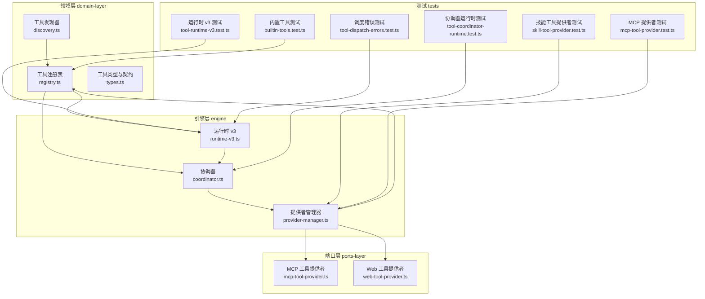
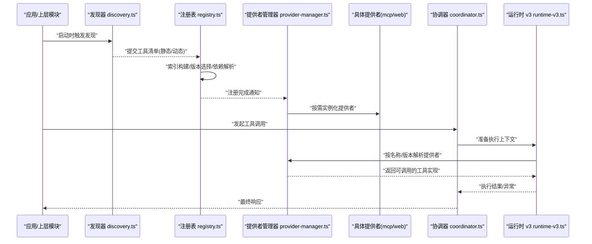
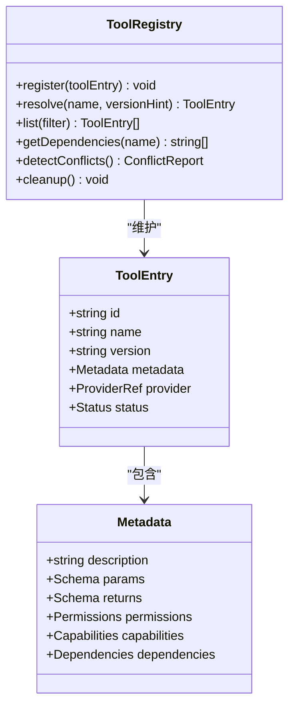
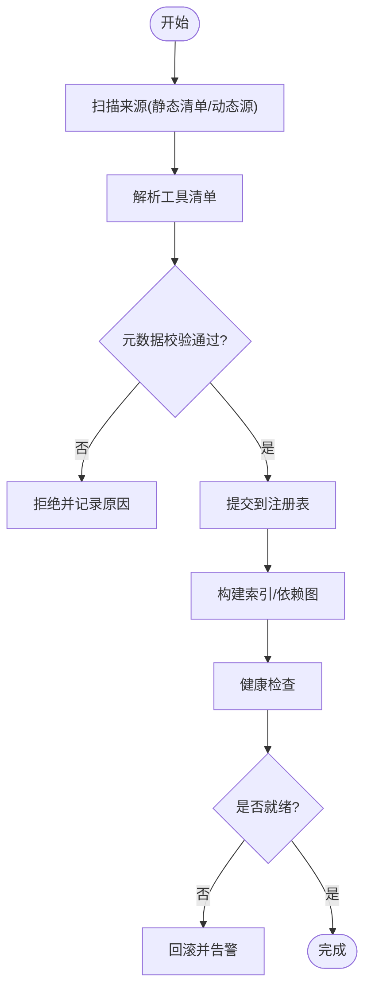
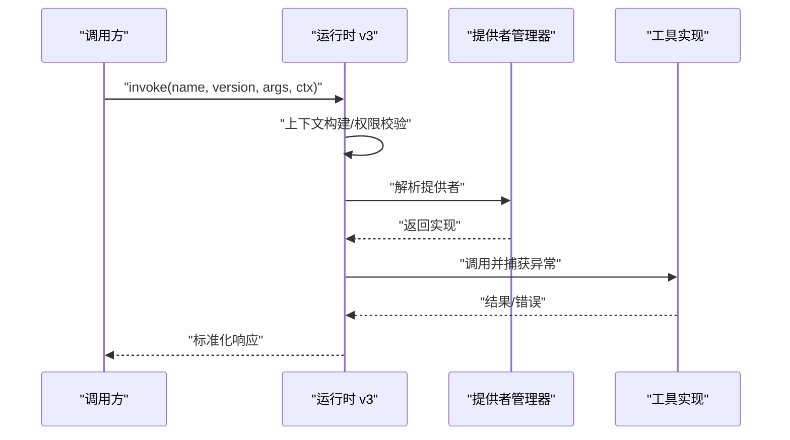
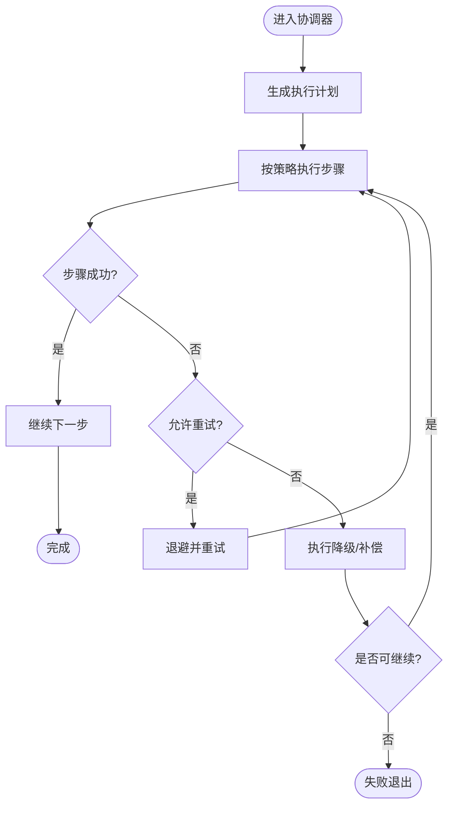
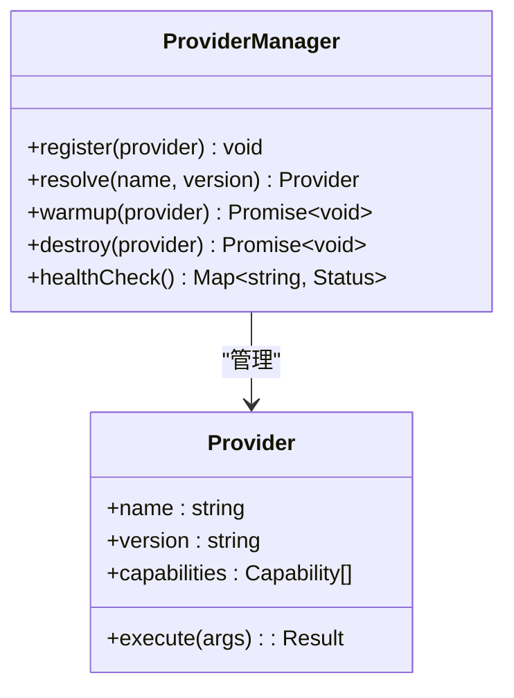
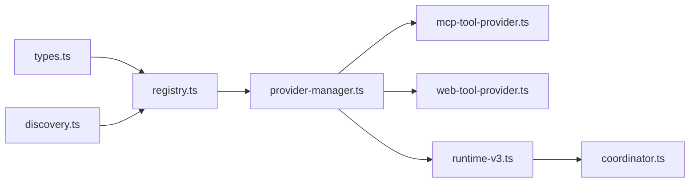

# 工具注册与管理

<cite>
**本文引用的文件**   
- [engine/packages/domain-layer/src/tool/registry.ts](file://engine/packages/domain-layer/src/tool/registry.ts)
- [engine/packages/domain-layer/src/tool/types.ts](file://engine/packages/domain-layer/src/tool/types.ts)
- [engine/packages/domain-layer/src/tool/discovery.ts](file://engine/packages/domain-layer/src/tool/discovery.ts)
- [engine/packages/engine/src/tool/runtime-v3.ts](file://engine/packages/engine/src/tool/runtime-v3.ts)
- [engine/packages/engine/src/tool/coordinator.ts](file://engine/packages/engine/src/tool/coordinator.ts)
- [engine/packages/engine/src/tool/provider-manager.ts](file://engine/packages/engine/src/tool/provider-manager.ts)
- [engine/packages/ports-layer/src/mcp-tool-provider.ts](file://engine/packages/ports-layer/src/mcp-tool-provider.ts)
- [engine/packages/ports-layer/src/web-tool-provider.ts](file://engine/packages/ports-layer/src/web-tool-provider.ts)
- [engine/tests/builtin-tools.test.ts](file://engine/tests/builtin-tools.test.ts)
- [engine/tests/skill-tool-provider.test.ts](file://engine/tests/skill-tool-provider.test.ts)
- [engine/tests/mcp-tool-provider.test.ts](file://engine/tests/mcp-tool-provider.test.ts)
- [engine/tests/tool-runtime-v3.test.ts](file://engine/tests/tool-runtime-v3.test.ts)
- [engine/tests/tool-coordinator-runtime.test.ts](file://engine/tests/tool-coordinator-runtime.test.ts)
- [engine/tests/tool-dispatch-errors.test.ts](file://engine/tests/tool-dispatch-errors.test.ts)
</cite>

## 目录
1. [简介](#简介)
2. [项目结构](#项目结构)
3. [核心组件](#核心组件)
4. [架构总览](#架构总览)
5. [详细组件分析](#详细组件分析)
6. [依赖关系分析](#依赖关系分析)
7. [性能考量](#性能考量)
8. [故障排除指南](#故障排除指南)
9. [结论](#结论)
10. [附录](#附录)

## 简介
本技术文档聚焦于KCoder引擎中的“工具注册与管理”子系统，围绕以下目标展开：
- 工具的发现机制：静态注册与动态加载的实现原理
- 工具元数据管理：描述、参数定义、返回值类型、权限控制等属性的存储与校验
- 工具注册表：索引、版本管理、依赖解析
- 生命周期钩子：初始化、预热、销毁等阶段处理逻辑
- 冲突检测与解决策略
- 注册API接口规范与最佳实践
- 调试与故障排除方法

## 项目结构
工具注册与管理相关代码主要分布在领域层（domain-layer）、引擎层（engine）以及端口层（ports-layer），并通过测试用例覆盖关键路径。

图表来源
- [engine/packages/domain-layer/src/tool/registry.ts](file://engine/packages/domain-layer/src/tool/registry.ts)
- [engine/packages/domain-layer/src/tool/types.ts](file://engine/packages/domain-layer/src/tool/types.ts)
- [engine/packages/domain-layer/src/tool/discovery.ts](file://engine/packages/domain-layer/src/tool/discovery.ts)
- [engine/packages/engine/src/tool/runtime-v3.ts](file://engine/packages/engine/src/tool/runtime-v3.ts)
- [engine/packages/engine/src/tool/coordinator.ts](file://engine/packages/engine/src/tool/coordinator.ts)
- [engine/packages/engine/src/tool/provider-manager.ts](file://engine/packages/engine/src/tool/provider-manager.ts)
- [engine/packages/ports-layer/src/mcp-tool-provider.ts](file://engine/packages/ports-layer/src/mcp-tool-provider.ts)
- [engine/packages/ports-layer/src/web-tool-provider.ts](file://engine/packages/ports-layer/src/web-tool-provider.ts)
- [engine/tests/builtin-tools.test.ts](file://engine/tests/builtin-tools.test.ts)
- [engine/tests/skill-tool-provider.test.ts](file://engine/tests/skill-tool-provider.test.ts)
- [engine/tests/mcp-tool-provider.test.ts](file://engine/tests/mcp-tool-provider.test.ts)
- [engine/tests/tool-runtime-v3.test.ts](file://engine/tests/tool-runtime-v3.test.ts)
- [engine/tests/tool-coordinator-runtime.test.ts](file://engine/tests/tool-coordinator-runtime.test.ts)
- [engine/tests/tool-dispatch-errors.test.ts](file://engine/tests/tool-dispatch-errors.test.ts)

章节来源
- [engine/packages/domain-layer/src/tool/registry.ts](file://engine/packages/domain-layer/src/tool/registry.ts)
- [engine/packages/domain-layer/src/tool/types.ts](file://engine/packages/domain-layer/src/tool/types.ts)
- [engine/packages/domain-layer/src/tool/discovery.ts](file://engine/packages/domain-layer/src/tool/discovery.ts)
- [engine/packages/engine/src/tool/runtime-v3.ts](file://engine/packages/engine/src/tool/runtime-v3.ts)
- [engine/packages/engine/src/tool/coordinator.ts](file://engine/packages/engine/src/tool/coordinator.ts)
- [engine/packages/engine/src/tool/provider-manager.ts](file://engine/packages/engine/src/tool/provider-manager.ts)
- [engine/packages/ports-layer/src/mcp-tool-provider.ts](file://engine/packages/ports-layer/src/mcp-tool-provider.ts)
- [engine/packages/ports-layer/src/web-tool-provider.ts](file://engine/packages/ports-layer/src/web-tool-provider.ts)
- [engine/tests/builtin-tools.test.ts](file://engine/tests/builtin-tools.test.ts)
- [engine/tests/skill-tool-provider.test.ts](file://engine/tests/skill-tool-provider.test.ts)
- [engine/tests/mcp-tool-provider.test.ts](file://engine/tests/mcp-tool-provider.test.ts)
- [engine/tests/tool-runtime-v3.test.ts](file://engine/tests/tool-runtime-v3.test.ts)
- [engine/tests/tool-coordinator-runtime.test.ts](file://engine/tests/tool-coordinator-runtime.test.ts)
- [engine/tests/tool-dispatch-errors.test.ts](file://engine/tests/tool-dispatch-errors.test.ts)

## 核心组件
- 工具类型与契约（types.ts）：定义工具元数据模型、参数/返回类型、权限与能力标记、版本与依赖声明等基础结构。
- 工具注册表（registry.ts）：维护全局工具索引、版本选择、依赖解析、冲突检测与合并策略。
- 工具发现器（discovery.ts）：扫描并聚合来自不同来源的工具清单，支持静态注册与动态加载。
- 运行时 v3（runtime-v3.ts）：执行上下文、参数校验、结果序列化、超时与预算控制、可观测性埋点。
- 协调器（coordinator.ts）：编排调用链、重试与降级、并行/串行执行、错误恢复。
- 提供者管理器（provider-manager.ts）：统一接入多种提供者（内置、MCP、Web、技能等），负责实例化、生命周期管理与路由。
- 端口层提供者（mcp-tool-provider.ts, web-tool-provider.ts）：将外部协议或HTTP服务暴露为统一工具接口。

章节来源
- [engine/packages/domain-layer/src/tool/types.ts](file://engine/packages/domain-layer/src/tool/types.ts)
- [engine/packages/domain-layer/src/tool/registry.ts](file://engine/packages/domain-layer/src/tool/registry.ts)
- [engine/packages/domain-layer/src/tool/discovery.ts](file://engine/packages/domain-layer/src/tool/discovery.ts)
- [engine/packages/engine/src/tool/runtime-v3.ts](file://engine/packages/engine/src/tool/runtime-v3.ts)
- [engine/packages/engine/src/tool/coordinator.ts](file://engine/packages/engine/src/tool/coordinator.ts)
- [engine/packages/engine/src/tool/provider-manager.ts](file://engine/packages/engine/src/tool/provider-manager.ts)
- [engine/packages/ports-layer/src/mcp-tool-provider.ts](file://engine/packages/ports-layer/src/mcp-tool-provider.ts)
- [engine/packages/ports-layer/src/web-tool-provider.ts](file://engine/packages/ports-layer/src/web-tool-provider.ts)

## 架构总览
下图展示了从“发现—注册—提供—编排—执行”的端到端流程，以及各组件间的职责边界。

图表来源
- [engine/packages/domain-layer/src/tool/discovery.ts](file://engine/packages/domain-layer/src/tool/discovery.ts)
- [engine/packages/domain-layer/src/tool/registry.ts](file://engine/packages/domain-layer/src/tool/registry.ts)
- [engine/packages/engine/src/tool/provider-manager.ts](file://engine/packages/engine/src/tool/provider-manager.ts)
- [engine/packages/ports-layer/src/mcp-tool-provider.ts](file://engine/packages/ports-layer/src/mcp-tool-provider.ts)
- [engine/packages/ports-layer/src/web-tool-provider.ts](file://engine/packages/ports-layer/src/web-tool-provider.ts)
- [engine/packages/engine/src/tool/coordinator.ts](file://engine/packages/engine/src/tool/coordinator.ts)
- [engine/packages/engine/src/tool/runtime-v3.ts](file://engine/packages/engine/src/tool/runtime-v3.ts)

## 详细组件分析

### 工具类型与契约（types.ts）
- 工具元数据字段
  - 标识与版本：唯一ID、语义化版本、兼容范围
  - 描述与分类：人类可读说明、标签、能力域
  - 参数与返回：JSON Schema 风格定义、必填项、默认值、枚举约束、自定义校验规则
  - 权限与能力：访问级别、所需能力标记、资源限制
  - 依赖与条件：运行环境要求、前置工具、外部服务依赖
- 设计要点
  - 强类型契约确保跨模块一致性与可验证性
  - 可扩展的扩展点用于插件注入额外属性
  - 版本兼容性矩阵驱动选择策略

章节来源
- [engine/packages/domain-layer/src/tool/types.ts](file://engine/packages/domain-layer/src/tool/types.ts)

### 工具注册表（registry.ts）
- 功能职责
  - 工具索引：以名称+版本为键的快速查找
  - 版本管理：根据依赖与兼容性选择最优版本
  - 依赖解析：拓扑排序与循环依赖检测
  - 冲突检测：同名工具的多版本共存策略与覆盖规则
  - 变更合并：增量注册时的幂等更新与回滚
- 数据结构
  - 工具条目：包含元数据、提供者引用、状态位
  - 索引表：名称→版本列表映射
  - 依赖图：节点为工具，边为依赖关系
- 算法复杂度
  - 索引查询 O(1)
  - 依赖解析 O(V+E)，其中V为工具数，E为依赖边数
  - 冲突检测在注册时进行，最坏 O(V^2)

图表来源
- [engine/packages/domain-layer/src/tool/registry.ts](file://engine/packages/domain-layer/src/tool/registry.ts)
- [engine/packages/domain-layer/src/tool/types.ts](file://engine/packages/domain-layer/src/tool/types.ts)

章节来源
- [engine/packages/domain-layer/src/tool/registry.ts](file://engine/packages/domain-layer/src/tool/registry.ts)
- [engine/packages/domain-layer/src/tool/types.ts](file://engine/packages/domain-layer/src/tool/types.ts)

### 工具发现器（discovery.ts）
- 静态注册
  - 通过配置或源码内联声明工具清单
  - 启动阶段一次性加载，适合内置与稳定能力
- 动态加载
  - 监听文件系统/远程清单/消息总线事件
  - 增量注册与热更新，支持灰度发布
- 发现策略
  - 命名空间隔离：避免跨包冲突
  - 优先级与覆盖：明确覆盖顺序与合并策略
  - 健康检查：加载后对工具进行最小可用验证

图表来源
- [engine/packages/domain-layer/src/tool/discovery.ts](file://engine/packages/domain-layer/src/tool/discovery.ts)
- [engine/packages/domain-layer/src/tool/registry.ts](file://engine/packages/domain-layer/src/tool/registry.ts)

章节来源
- [engine/packages/domain-layer/src/tool/discovery.ts](file://engine/packages/domain-layer/src/tool/discovery.ts)
- [engine/packages/domain-layer/src/tool/registry.ts](file://engine/packages/domain-layer/src/tool/registry.ts)

### 运行时 v3（runtime-v3.ts）
- 执行上下文
  - 请求上下文、追踪ID、用户身份与权限令牌
  - 资源配额、超时、重试策略
- 参数校验与结果序列化
  - 基于元数据的参数校验与自动转换
  - 输出规范化与错误包装
- 可观测性
  - 指标采集、日志打点、链路追踪
- 错误处理
  - 标准化错误码与诊断信息
  - 失败降级与补偿动作

图表来源
- [engine/packages/engine/src/tool/runtime-v3.ts](file://engine/packages/engine/src/tool/runtime-v3.ts)
- [engine/packages/engine/src/tool/provider-manager.ts](file://engine/packages/engine/src/tool/provider-manager.ts)

章节来源
- [engine/packages/engine/src/tool/runtime-v3.ts](file://engine/packages/engine/src/tool/runtime-v3.ts)
- [engine/packages/engine/src/tool/provider-manager.ts](file://engine/packages/engine/src/tool/provider-manager.ts)

### 协调器（coordinator.ts）
- 编排能力
  - 串行/并行执行、分支与汇聚
  - 重试、熔断、超时与降级
- 错误恢复
  - 部分失败容忍、补偿事务
  - 可重放与断点续跑
- 性能优化
  - 批量调用、缓存中间结果
  - 资源池与限流

图表来源
- [engine/packages/engine/src/tool/coordinator.ts](file://engine/packages/engine/src/tool/coordinator.ts)

章节来源
- [engine/packages/engine/src/tool/coordinator.ts](file://engine/packages/engine/src/tool/coordinator.ts)

### 提供者管理器（provider-manager.ts）
- 职责
  - 统一管理多来源提供者（内置、MCP、Web、技能等）
  - 生命周期管理：创建、预热、销毁
  - 路由与负载均衡：按名称/版本/能力选择提供者
- 集成点
  - 与注册表协作获取工具清单
  - 与运行时对接执行入口
  - 与可观测性系统对接上报指标

图表来源
- [engine/packages/engine/src/tool/provider-manager.ts](file://engine/packages/engine/src/tool/provider-manager.ts)
- [engine/packages/ports-layer/src/mcp-tool-provider.ts](file://engine/packages/ports-layer/src/mcp-tool-provider.ts)
- [engine/packages/ports-layer/src/web-tool-provider.ts](file://engine/packages/ports-layer/src/web-tool-provider.ts)

章节来源
- [engine/packages/engine/src/tool/provider-manager.ts](file://engine/packages/engine/src/tool/provider-manager.ts)
- [engine/packages/ports-layer/src/mcp-tool-provider.ts](file://engine/packages/ports-layer/src/mcp-tool-provider.ts)
- [engine/packages/ports-layer/src/web-tool-provider.ts](file://engine/packages/ports-layer/src/web-tool-provider.ts)

### 端口层提供者（mcp-tool-provider.ts, web-tool-provider.ts）
- MCP 提供者
  - 通过标准协议桥接外部工具
  - 连接管理、会话复用、错误转译
- Web 提供者
  - HTTP/HTTPS 调用封装
  - 鉴权头注入、重试与熔断

章节来源
- [engine/packages/ports-layer/src/mcp-tool-provider.ts](file://engine/packages/ports-layer/src/mcp-tool-provider.ts)
- [engine/packages/ports-layer/src/web-tool-provider.ts](file://engine/packages/ports-layer/src/web-tool-provider.ts)

### 生命周期钩子
- 初始化
  - 注册表构建索引、提供者实例化、依赖图校验
- 预热
  - 冷启动优化：预建立连接、缓存热点工具元数据
- 运行中
  - 健康检查、动态更新、灰度切换
- 销毁
  - 优雅关闭：停止新任务、等待进行中任务结束、释放资源

章节来源
- [engine/packages/engine/src/tool/provider-manager.ts](file://engine/packages/engine/src/tool/provider-manager.ts)
- [engine/packages/domain-layer/src/tool/registry.ts](file://engine/packages/domain-layer/src/tool/registry.ts)

### 冲突检测与解决策略
- 冲突类型
  - 同名不同版本：选择策略（最高兼容、指定版本、灰度）
  - 同名同版本：覆盖策略（优先级、命名空间隔离）
  - 依赖冲突：版本不兼容、循环依赖
- 解决策略
  - 显式版本锁定
  - 命名空间前缀隔离
  - 依赖提升与替换
  - 回滚与快照

章节来源
- [engine/packages/domain-layer/src/tool/registry.ts](file://engine/packages/domain-layer/src/tool/registry.ts)
- [engine/packages/domain-layer/src/tool/types.ts](file://engine/packages/domain-layer/src/tool/types.ts)

### API 接口规范与最佳实践
- 注册接口
  - 输入：工具清单（含元数据、版本、依赖）
  - 输出：注册结果（成功/失败及原因）
  - 幂等：重复注册应无副作用
- 查询接口
  - 按名称/版本/能力过滤
  - 返回工具摘要与可用性状态
- 执行接口
  - 入参：名称、版本、参数、上下文
  - 出参：标准化结果或错误
- 最佳实践
  - 使用语义化版本与兼容性矩阵
  - 明确权限与能力标记，遵循最小权限原则
  - 提供清晰的参数Schema与示例
  - 为长耗时操作设置超时与重试上限
  - 启用可观测性以便定位问题

章节来源
- [engine/packages/domain-layer/src/tool/types.ts](file://engine/packages/domain-layer/src/tool/types.ts)
- [engine/packages/engine/src/tool/runtime-v3.ts](file://engine/packages/engine/src/tool/runtime-v3.ts)

## 依赖关系分析
- 组件耦合
  - 注册表与发现器：低耦合，通过清单对象交互
  - 运行时与提供者管理器：通过抽象接口解耦
  - 协调器与运行时：编排与执行的清晰分层
- 外部依赖
  - MCP/Web 提供者作为外部协议适配层
- 潜在循环依赖
  - 通过接口抽象与延迟加载避免

图表来源
- [engine/packages/domain-layer/src/tool/types.ts](file://engine/packages/domain-layer/src/tool/types.ts)
- [engine/packages/domain-layer/src/tool/registry.ts](file://engine/packages/domain-layer/src/tool/registry.ts)
- [engine/packages/domain-layer/src/tool/discovery.ts](file://engine/packages/domain-layer/src/tool/discovery.ts)
- [engine/packages/engine/src/tool/provider-manager.ts](file://engine/packages/engine/src/tool/provider-manager.ts)
- [engine/packages/ports-layer/src/mcp-tool-provider.ts](file://engine/packages/ports-layer/src/mcp-tool-provider.ts)
- [engine/packages/ports-layer/src/web-tool-provider.ts](file://engine/packages/ports-layer/src/web-tool-provider.ts)
- [engine/packages/engine/src/tool/runtime-v3.ts](file://engine/packages/engine/src/tool/runtime-v3.ts)
- [engine/packages/engine/src/tool/coordinator.ts](file://engine/packages/engine/src/tool/coordinator.ts)

章节来源
- [engine/packages/domain-layer/src/tool/types.ts](file://engine/packages/domain-layer/src/tool/types.ts)
- [engine/packages/domain-layer/src/tool/registry.ts](file://engine/packages/domain-layer/src/tool/registry.ts)
- [engine/packages/domain-layer/src/tool/discovery.ts](file://engine/packages/domain-layer/src/tool/discovery.ts)
- [engine/packages/engine/src/tool/provider-manager.ts](file://engine/packages/engine/src/tool/provider-manager.ts)
- [engine/packages/ports-layer/src/mcp-tool-provider.ts](file://engine/packages/ports-layer/src/mcp-tool-provider.ts)
- [engine/packages/ports-layer/src/web-tool-provider.ts](file://engine/packages/ports-layer/src/web-tool-provider.ts)
- [engine/packages/engine/src/tool/runtime-v3.ts](file://engine/packages/engine/src/tool/runtime-v3.ts)
- [engine/packages/engine/src/tool/coordinator.ts](file://engine/packages/engine/src/tool/coordinator.ts)

## 性能考量
- 索引与查找
  - 使用哈希索引实现O(1)查找；对大规模工具集建议分区索引
- 依赖解析
  - 采用拓扑排序与缓存结果，避免重复计算
- 执行路径
  - 批处理与并行化减少往返开销
  - 连接复用与对象池降低GC压力
- 内存与CPU
  - 元数据懒加载与大对象池化
  - 监控热点路径并进行针对性优化

[本节为通用指导，无需特定文件来源]

## 故障排除指南
- 常见问题
  - 工具未找到：检查名称/版本与命名空间
  - 参数校验失败：核对Schema与必填项
  - 超时/重试过多：调整超时与退避策略
  - 依赖冲突：查看依赖图与版本矩阵
- 诊断手段
  - 开启详细日志与追踪ID
  - 使用健康检查接口定位提供者状态
  - 回放最近一次失败的执行上下文
- 参考测试
  - 内置工具、MCP提供者、运行时v3、协调器、调度错误的测试用例可作为行为基线与复现模板

章节来源
- [engine/tests/builtin-tools.test.ts](file://engine/tests/builtin-tools.test.ts)
- [engine/tests/mcp-tool-provider.test.ts](file://engine/tests/mcp-tool-provider.test.ts)
- [engine/tests/tool-runtime-v3.test.ts](file://engine/tests/tool-runtime-v3.test.ts)
- [engine/tests/tool-coordinator-runtime.test.ts](file://engine/tests/tool-coordinator-runtime.test.ts)
- [engine/tests/tool-dispatch-errors.test.ts](file://engine/tests/tool-dispatch-errors.test.ts)

## 结论
KCoder的工具注册与管理子系统通过清晰的层次划分与严格的契约定义，实现了高内聚、低耦合的工具生态。静态注册保障稳定性，动态加载增强灵活性；注册表提供可靠的索引与依赖管理；运行时与协调器共同保证执行质量与可观测性。遵循本文档的API规范与最佳实践，可有效降低集成成本并提升系统可靠性。

[本节为总结性内容，无需特定文件来源]

## 附录
- 术语
  - 工具：具备明确输入输出与行为的原子能力单元
  - 提供者：承载工具实现的载体，可本地或远程
  - 元数据：描述工具特性与约束的结构化信息
- 版本策略
  - 语义化版本与向后兼容矩阵
  - 灰度发布与快速回滚

[本节为补充说明，无需特定文件来源]