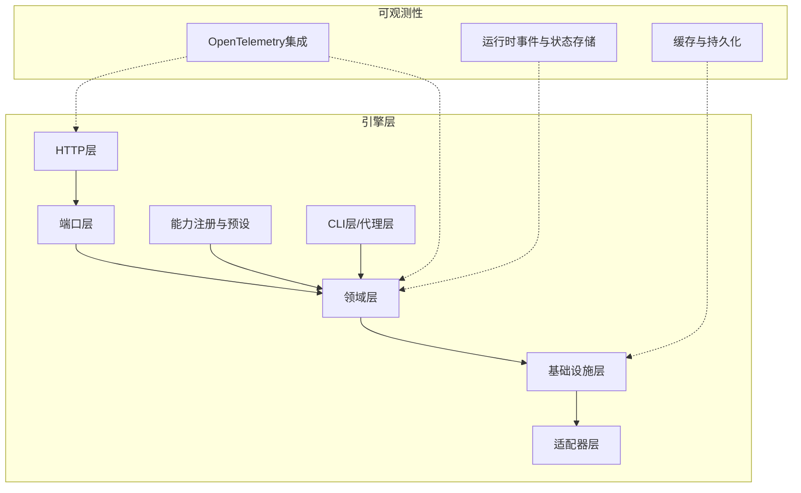
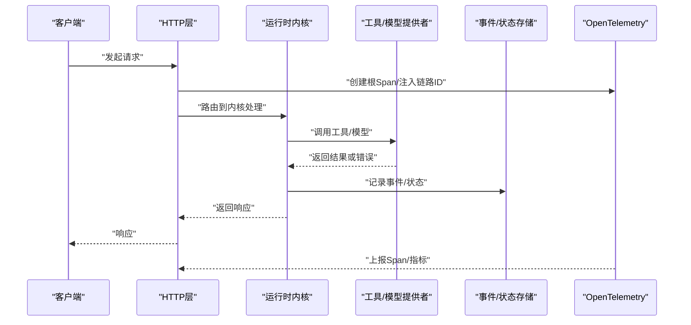
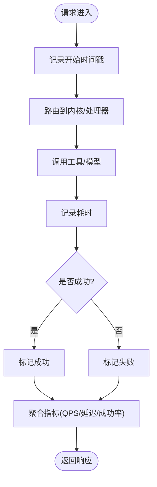
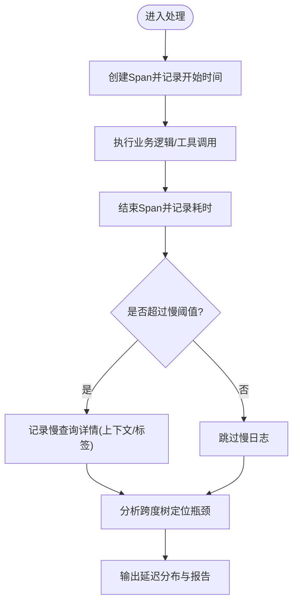
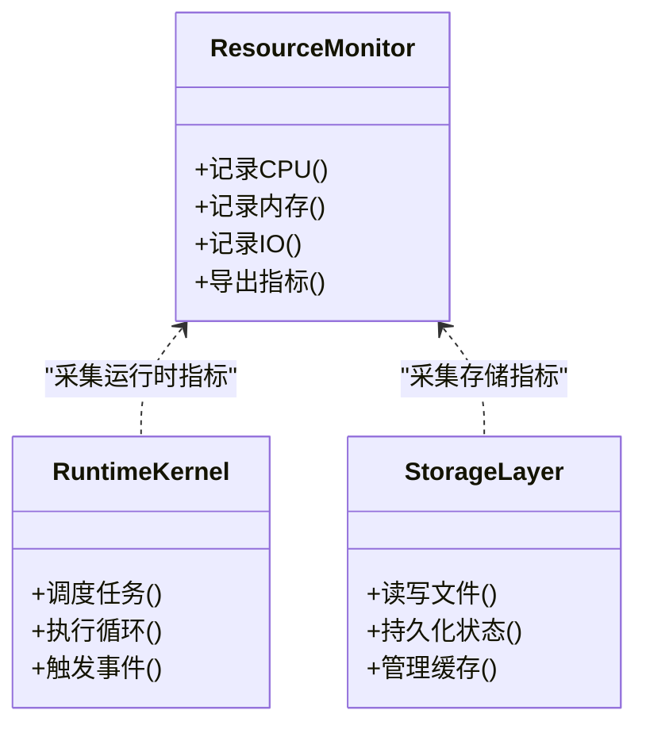
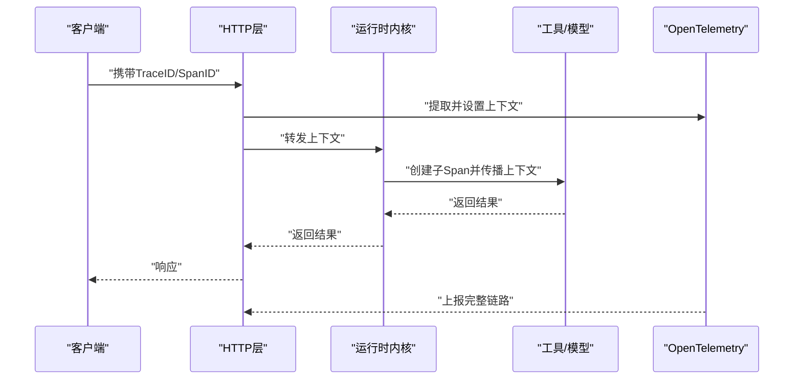
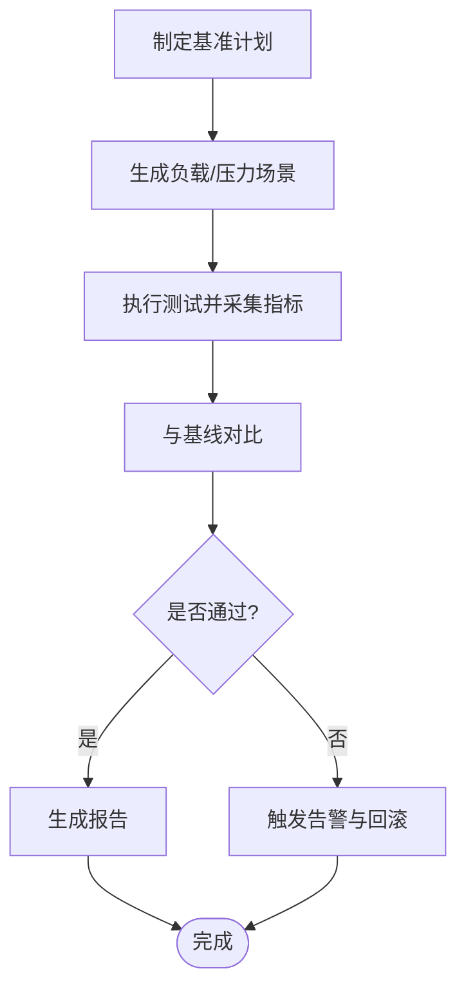
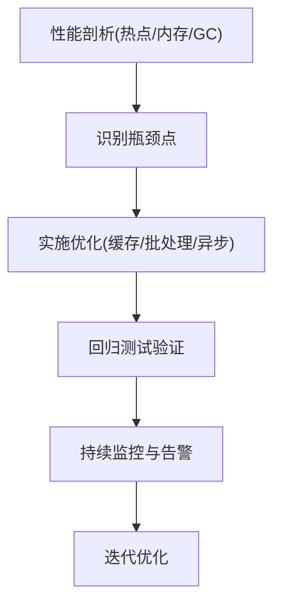
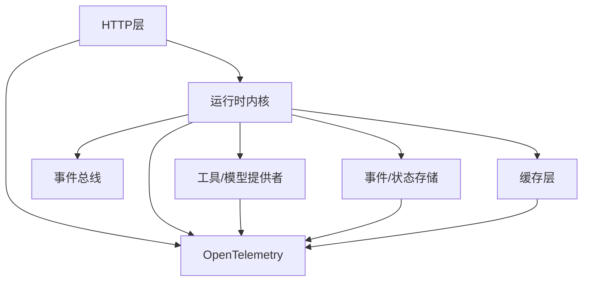

# 性能监控与分析

<cite>
**本文引用的文件**   
- [engine/README.md](file://engine/README.md)
- [engine/tests/http-server-observability.test.ts](file://engine/tests/http-server-observability.test.ts)
- [engine/tests/opentelemetry.test.ts](file://engine/tests/opentelemetry.test.ts)
- [engine/tests/runtime-kernel-e2e.test.ts](file://engine/tests/runtime-kernel-e2e.test.ts)
- [engine/tests/tool-runtime-v3.test.ts](file://engine/tests/tool-runtime-v3.test.ts)
- [engine/tests/tool-coordinator-runtime.test.ts](file://engine/tests/tool-coordinator-runtime.test.ts)
- [engine/tests/runtime-kernel-after-middleware.test.ts](file://engine/tests/runtime-kernel-after-middleware.test.ts)
- [engine/tests/runtime-kernel-contracts.test.ts](file://engine/tests/runtime-kernel-contracts.test.ts)
- [engine/tests/runtime-kernel-provider-matrix.test.ts](file://engine/tests/runtime-kernel-provider-matrix.test.ts)
- [engine/tests/runtime-kernel-isolation.test.ts](file://engine/tests/runtime-kernel-isolation.test.ts)
- [engine/tests/runtime-kernel-crash-recovery.test.ts](file://engine/tests/runtime-kernel-crash-recovery.test.ts)
- [engine/tests/runtime-kernel-parity.test.ts](file://engine/tests/runtime-kernel-parity.test.ts)
- [engine/tests/runtime-kernel-replay.test.ts](file://engine/tests/runtime-kernel-replay.test.ts)
- [engine/tests/runtime-kernel-budget.test.ts](file://engine/tests/runtime-kernel-budget.test.ts)
- [engine/tests/runtime-kernel.test.ts](file://engine/tests/runtime-kernel.test.ts)
- [engine/tests/tool-call-repair.test.ts](file://engine/tests/tool-call-repair.test.ts)
- [engine/tests/tool-storm-breaker.test.ts](file://engine/tests/tool-storm-breaker.test.ts)
- [engine/tests/loop-runner.test.ts](file://engine/tests/loop-runner.test.ts)
- [engine/tests/execution-graph.test.ts](file://engine/tests/execution-graph.test.ts)
- [engine/tests/model-step-runner.test.ts](file://engine/tests/model-step-runner.test.ts)
- [engine/tests/model-client.test.ts](file://engine/tests/model-client.test.ts)
- [engine/tests/mcp-tool-provider.test.ts](file://engine/tests/mcp-tool-provider.test.ts)
- [engine/tests/web-tool-provider.test.ts](file://engine/tests/web-tool-provider.test.ts)
- [engine/tests/http-peer-transport.test.ts](file://engine/tests/http-peer-transport.test.ts)
- [engine/tests/http-artifacts.test.ts](file://engine/tests/http-artifacts.test.ts)
- [engine/tests/usage-service.test.ts](file://engine/tests/usage-service.test.ts)
- [engine/tests/file-session-store.test.ts](file://engine/tests/file-session-store.test.ts)
- [engine/tests/run-state-store.test.ts](file://engine/tests/run-state-store.test.ts)
- [engine/tests/memory-store.test.ts](file://engine/tests/memory-store.test.ts)
- [engine/tests/hybrid-store.test.ts](file://engine/tests/hybrid-store.test.ts)
- [engine/tests/cache.test.ts](file://engine/tests/cache.test.ts)
- [engine/tests/token-economy.test.ts](file://engine/tests/token-economy.test.ts)
- [engine/tests/deepseek-pricing.test.ts](file://engine/tests/deepseek-pricing.test.ts)
- [engine/tests/compaction-governor.test.ts](file://engine/tests/compaction-governor.test.ts)
- [engine/tests/context-compactor.test.ts](file://engine/tests/context-compactor.test.ts)
- [engine/tests/durable-task-capsule.test.ts](file://engine/tests/durable-task-capsule.test.ts)
- [engine/tests/evented-loop.test.ts](file://engine/tests/evented-loop.test.ts)
- [engine/tests/turn-event-bus.test.ts](file://engine/tests/turn-event-bus.test.ts)
- [engine/tests/task-progress-projector.test.ts](file://engine/tests/task-progress-projector.test.ts)
- [engine/tests/scope-key.test.ts](file://engine/tests/scope-key.test.ts)
- [engine/tests/virtual-path.test.ts](file://engine/tests/virtual-path.test.ts)
- [engine/tests/manifest.test.ts](file://engine/tests/manifest.test.ts)
- [engine/tests/builtin-tools.test.ts](file://engine/tests/builtin-tools.test.ts)
- [engine/tests/builtin-tool-utils.test.ts](file://engine/tests/builtin-tool-utils.test.ts)
- [engine/tests/capability-registry.test.ts](file://engine/tests/capability-registry.test.ts)
- [engine/tests/capabilities.test.ts](file://engine/tests/capabilities.test.ts)
- [engine/tests/contracts.test.ts](file://engine/tests/contracts.test.ts)
- [engine/tests/domain.test.ts](file://engine/tests/domain.test.ts)
- [engine/tests/ports.test.ts](file://engine/tests/ports.test.ts)
- [engine/tests/plugin-host.test.ts](file://engine/tests/plugin-host.test.ts)
- [engine/tests/provider-compatibility.test.ts](file://engine/tests/provider-compatibility.test.ts)
- [engine/tests/qiongqi-config.test.ts](file://engine/tests/qiongqi-config.test.ts)
- [engine/tests/read-json-body.test.ts](file://engine/tests/read-json-body.test.ts)
- [engine/tests/request-history-hygiene.test.ts](file://engine/tests/request-history-hygiene.test.ts)
- [engine/tests/review.test.ts](file://engine/tests/review.test.ts)
- [engine/tests/run-event-store.test.ts](file://engine/tests/run-event-store.test.ts)
- [engine/tests/runtime-event-projection.test.ts](file://engine/tests/runtime-event-projection.test.ts)
- [engine/tests/runtime-event-recorder-kernel.test.ts](file://engine/tests/runtime-event-recorder-kernel.test.ts)
- [engine/tests/runtime-event-reducer.test.ts](file://engine/tests/runtime-event-reducer.test.ts)
- [engine/tests/runtime-factory-rollout.test.ts](file://engine/tests/runtime-factory-rollout.test.ts)
- [engine/tests/runtime-factory.test.ts](file://engine/tests/runtime-factory.test.ts)
- [engine/tests/runtime-middleware-governance.test.ts](file://engine/tests/runtime-middleware-governance.test.ts)
- [engine/tests/runtime-middleware.test.ts](file://engine/tests/runtime-middleware.test.ts)
- [engine/tests/runtime-rollout.test.ts](file://engine/tests/runtime-rollout.test.ts)
- [engine/tests/skill-command-registry.test.ts](file://engine/tests/skill-command-registry.test.ts)
- [engine/tests/skill-mcp-bridge.test.ts](file://engine/tests/skill-mcp-bridge.test.ts)
- [engine/tests/skill-runtime.test.ts](file://engine/tests/skill-runtime.test.ts)
- [engine/tests/skill-tool-provider.test.ts](file://engine/tests/skill-tool-provider.test.ts)
- [engine/tests/steering-queue-isolation.test.ts](file://engine/tests/steering-queue-isolation.test.ts)
- [engine/tests/task-context-recovery.test.ts](file://engine/tests/task-context-recovery.test.ts)
- [engine/tests/task-continuity-production-path.test.ts](file://engine/tests/task-continuity-production-path.test.ts)
- [engine/tests/task-state-builder.test.ts](file://engine/tests/task-state-builder.test.ts)
- [engine/tests/task-state-contracts.test.ts](file://engine/tests/task-state-contracts.test.ts)
- [engine/tests/thread-service.test.ts](file://engine/tests/thread-service.test.ts)
- [engine/tests/todo-tools.test.ts](file://engine/tests/todo-tools.test.ts)
- [engine/tests/work-mode-skill-runtime.test.ts](file://engine/tests/work-mode-skill-runtime.test.ts)
</cite>

## 目录
1. [简介](#简介)
2. [项目结构](#项目结构)
3. [核心组件](#核心组件)
4. [架构总览](#架构总览)
5. [详细组件分析](#详细组件分析)
6. [依赖关系分析](#依赖关系分析)
7. [性能考量](#性能考量)
8. [故障排查指南](#故障排查指南)
9. [结论](#结论)
10. [附录](#附录)

## 简介
本技术文档面向KCoder的性能监控与分析系统，聚焦以下目标：
- 调用统计收集：QPS、延迟分布、成功率等关键指标的采集与聚合方法
- 延迟分析实现：P50/P90/P99延迟计算、慢查询追踪、瓶颈识别策略
- 资源使用监控：CPU占用、内存消耗、I/O操作的观测机制
- 分布式追踪集成：链路ID生成、跨度记录、上下文传播
- 性能基准测试：负载测试、压力测试、性能回归检测
- 性能优化指南：热点分析、内存泄漏检测、GC调优建议
- 可视化与告警：监控数据的展示与告警配置方法

说明：当前仓库以引擎层（engine）为主，包含大量可观测性与运行时相关的测试用例。本文基于这些测试用例所体现的接口契约与行为约定，提炼出性能监控与分析的系统性方案与实践建议。

## 项目结构
从仓库结构看，KCoder采用多包工作区组织，engine目录下包含领域层、基础设施层、HTTP层、端口层、适配器、能力注册、CLI层、代理层、预设等模块。与性能监控与分析直接相关的主要线索集中在：
- HTTP服务可观测性测试：用于验证请求级指标、错误率、延迟等
- OpenTelemetry测试：用于验证分布式追踪、链路ID、跨度记录与上下文传播
- 运行时内核与中间件测试：用于验证任务执行、工具调用、事件总线、预算控制、压缩治理等对性能的影响点
- 存储与缓存测试：用于评估持久化与缓存对延迟与吞吐的影响
- 模型与工具提供者测试：用于评估外部依赖（模型API、MCP/Web工具）的延迟与稳定性

[此图为概念性结构示意，不直接映射具体源码文件]

## 核心组件
围绕性能监控与分析，结合仓库中的测试用例，可以归纳出以下核心组件与职责：
- 可观测性接入层（OpenTelemetry）：负责链路ID生成、Span创建与结束、上下文传播、采样策略
- 运行时内核与中间件：在任务编排、工具调用、循环执行等关键路径埋点，产出延迟、成功率、错误码等指标
- 事件与状态存储：记录运行期事件与状态变更，支撑回放、审计与回溯分析
- 缓存与存储：提供低延迟数据访问路径，影响整体延迟分布与吞吐
- 外部依赖适配：模型客户端、MCP/Web工具、HTTP传输等，是延迟与失败的主要来源

上述组件的职责边界与交互方式，可从对应测试文件中观察到明确的契约与行为约束。例如：
- 可观测性：通过OpenTelemetry测试确认链路ID与跨度的生命周期
- 运行时：通过内核与中间件测试确认指标埋点位置与语义
- 存储与缓存：通过相应测试确认读写路径与一致性要求

**章节来源**
- [engine/tests/opentelemetry.test.ts](file://engine/tests/opentelemetry.test.ts)
- [engine/tests/runtime-kernel-after-middleware.test.ts](file://engine/tests/runtime-kernel-after-middleware.test.ts)
- [engine/tests/runtime-kernel-contracts.test.ts](file://engine/tests/runtime-kernel-contracts.test.ts)
- [engine/tests/runtime-kernel-provider-matrix.test.ts](file://engine/tests/runtime-kernel-provider-matrix.test.ts)
- [engine/tests/runtime-kernel-isolation.test.ts](file://engine/tests/runtime-kernel-isolation.test.ts)
- [engine/tests/runtime-kernel-crash-recovery.test.ts](file://engine/tests/runtime-kernel-crash-recovery.test.ts)
- [engine/tests/runtime-kernel-parity.test.ts](file://engine/tests/runtime-kernel-parity.test.ts)
- [engine/tests/runtime-kernel-replay.test.ts](file://engine/tests/runtime-kernel-replay.test.ts)
- [engine/tests/runtime-kernel-budget.test.ts](file://engine/tests/runtime-kernel-budget.test.ts)
- [engine/tests/runtime-kernel.test.ts](file://engine/tests/runtime-kernel.test.ts)
- [engine/tests/tool-call-repair.test.ts](file://engine/tests/tool-call-repair.test.ts)
- [engine/tests/tool-storm-breaker.test.ts](file://engine/tests/tool-storm-breaker.test.ts)
- [engine/tests/loop-runner.test.ts](file://engine/tests/loop-runner.test.ts)
- [engine/tests/execution-graph.test.ts](file://engine/tests/execution-graph.test.ts)
- [engine/tests/model-step-runner.test.ts](file://engine/tests/model-step-runner.test.ts)
- [engine/tests/model-client.test.ts](file://engine/tests/model-client.test.ts)
- [engine/tests/mcp-tool-provider.test.ts](file://engine/tests/mcp-tool-provider.test.ts)
- [engine/tests/web-tool-provider.test.ts](file://engine/tests/web-tool-provider.test.ts)
- [engine/tests/http-peer-transport.test.ts](file://engine/tests/http-peer-transport.test.ts)
- [engine/tests/http-artifacts.test.ts](file://engine/tests/http-artifacts.test.ts)
- [engine/tests/usage-service.test.ts](file://engine/tests/usage-service.test.ts)
- [engine/tests/file-session-store.test.ts](file://engine/tests/file-session-store.test.ts)
- [engine/tests/run-state-store.test.ts](file://engine/tests/run-state-store.test.ts)
- [engine/tests/memory-store.test.ts](file://engine/tests/memory-store.test.ts)
- [engine/tests/hybrid-store.test.ts](file://engine/tests/hybrid-store.test.ts)
- [engine/tests/cache.test.ts](file://engine/tests/cache.test.ts)
- [engine/tests/token-economy.test.ts](file://engine/tests/token-economy.test.ts)
- [engine/tests/deepseek-pricing.test.ts](file://engine/tests/deepseek-pricing.test.ts)
- [engine/tests/compaction-governor.test.ts](file://engine/tests/compaction-governor.test.ts)
- [engine/tests/context-compactor.test.ts](file://engine/tests/context-compactor.test.ts)
- [engine/tests/durable-task-capsule.test.ts](file://engine/tests/durable-task-capsule.test.ts)
- [engine/tests/evented-loop.test.ts](file://engine/tests/evented-loop.test.ts)
- [engine/tests/turn-event-bus.test.ts](file://engine/tests/turn-event-bus.test.ts)
- [engine/tests/task-progress-projector.test.ts](file://engine/tests/task-progress-projector.test.ts)
- [engine/tests/scope-key.test.ts](file://engine/tests/scope-key.test.ts)
- [engine/tests/virtual-path.test.ts](file://engine/tests/virtual-path.test.ts)
- [engine/tests/manifest.test.ts](file://engine/tests/manifest.test.ts)
- [engine/tests/builtin-tools.test.ts](file://engine/tests/builtin-tools.test.ts)
- [engine/tests/builtin-tool-utils.test.ts](file://engine/tests/builtin-tool-utils.test.ts)
- [engine/tests/capability-registry.test.ts](file://engine/tests/capability-registry.test.ts)
- [engine/tests/capabilities.test.ts](file://engine/tests/capabilities.test.ts)
- [engine/tests/contracts.test.ts](file://engine/tests/contracts.test.ts)
- [engine/tests/domain.test.ts](file://engine/tests/domain.test.ts)
- [engine/tests/ports.test.ts](file://engine/tests/ports.test.ts)
- [engine/tests/plugin-host.test.ts](file://engine/tests/plugin-host.test.ts)
- [engine/tests/provider-compatibility.test.ts](file://engine/tests/provider-compatibility.test.ts)
- [engine/tests/qiongqi-config.test.ts](file://engine/tests/qiongqi-config.test.ts)
- [engine/tests/read-json-body.test.ts](file://engine/tests/read-json-body.test.ts)
- [engine/tests/request-history-hygiene.test.ts](file://engine/tests/request-history-hygiene.test.ts)
- [engine/tests/review.test.ts](file://engine/tests/review.test.ts)
- [engine/tests/run-event-store.test.ts](file://engine/tests/run-event-store.test.ts)
- [engine/tests/runtime-event-projection.test.ts](file://engine/tests/runtime-event-projection.test.ts)
- [engine/tests/runtime-event-recorder-kernel.test.ts](file://engine/tests/runtime-event-recorder-kernel.test.ts)
- [engine/tests/runtime-event-reducer.test.ts](file://engine/tests/runtime-event-reducer.test.ts)
- [engine/tests/runtime-factory-rollout.test.ts](file://engine/tests/runtime-factory-rollout.test.ts)
- [engine/tests/runtime-factory.test.ts](file://engine/tests/runtime-factory.test.ts)
- [engine/tests/runtime-middleware-governance.test.ts](file://engine/tests/runtime-middleware-governance.test.ts)
- [engine/tests/runtime-middleware.test.ts](file://engine/tests/runtime-middleware.test.ts)
- [engine/tests/runtime-rollout.test.ts](file://engine/tests/runtime-rollout.test.ts)
- [engine/tests/skill-command-registry.test.ts](file://engine/tests/skill-command-registry.test.ts)
- [engine/tests/skill-mcp-bridge.test.ts](file://engine/tests/skill-mcp-bridge.test.ts)
- [engine/tests/skill-runtime.test.ts](file://engine/tests/skill-runtime.test.ts)
- [engine/tests/skill-tool-provider.test.ts](file://engine/tests/skill-tool-provider.test.ts)
- [engine/tests/steering-queue-isolation.test.ts](file://engine/tests/steering-queue-isolation.test.ts)
- [engine/tests/task-context-recovery.test.ts](file://engine/tests/task-context-recovery.test.ts)
- [engine/tests/task-continuity-production-path.test.ts](file://engine/tests/task-continuity-production-path.test.ts)
- [engine/tests/task-state-builder.test.ts](file://engine/tests/task-state-builder.test.ts)
- [engine/tests/task-state-contracts.test.ts](file://engine/tests/task-state-contracts.test.ts)
- [engine/tests/thread-service.test.ts](file://engine/tests/thread-service.test.ts)
- [engine/tests/todo-tools.test.ts](file://engine/tests/todo-tools.test.ts)
- [engine/tests/work-mode-skill-runtime.test.ts](file://engine/tests/work-mode-skill-runtime.test.ts)

## 架构总览
下图展示了KCoder中性能监控与分析的关键路径与组件交互，包括HTTP入口、运行时内核、工具与模型调用、事件与状态存储、以及OpenTelemetry追踪。

**图表来源**
- [engine/tests/http-server-observability.test.ts](file://engine/tests/http-server-observability.test.ts)
- [engine/tests/opentelemetry.test.ts](file://engine/tests/opentelemetry.test.ts)
- [engine/tests/runtime-kernel.test.ts](file://engine/tests/runtime-kernel.test.ts)
- [engine/tests/tool-runtime-v3.test.ts](file://engine/tests/tool-runtime-v3.test.ts)
- [engine/tests/tool-coordinator-runtime.test.ts](file://engine/tests/tool-coordinator-runtime.test.ts)
- [engine/tests/model-step-runner.test.ts](file://engine/tests/model-step-runner.test.ts)
- [engine/tests/mcp-tool-provider.test.ts](file://engine/tests/mcp-tool-provider.test.ts)
- [engine/tests/web-tool-provider.test.ts](file://engine/tests/web-tool-provider.test.ts)
- [engine/tests/http-peer-transport.test.ts](file://engine/tests/http-peer-transport.test.ts)
- [engine/tests/run-event-store.test.ts](file://engine/tests/run-event-store.test.ts)
- [engine/tests/run-state-store.test.ts](file://engine/tests/run-state-store.test.ts)

## 详细组件分析

### 调用统计收集（QPS、延迟分布、成功率）
- QPS采集：在HTTP入口与内核处理边界进行计数，按端点/操作维度聚合
- 延迟分布：记录请求开始与结束时间差，支持分位统计（P50/P90/P99）
- 成功率：根据响应状态码或业务错误码判定成功/失败，计算成功率
- 指标聚合：建议在网关/HTTP层统一采集，避免重复计数；在工具/模型调用层补充细粒度指标

**图表来源**
- [engine/tests/http-server-observability.test.ts](file://engine/tests/http-server-observability.test.ts)
- [engine/tests/runtime-kernel.test.ts](file://engine/tests/runtime-kernel.test.ts)
- [engine/tests/tool-runtime-v3.test.ts](file://engine/tests/tool-runtime-v3.test.ts)
- [engine/tests/tool-coordinator-runtime.test.ts](file://engine/tests/tool-coordinator-runtime.test.ts)

**章节来源**
- [engine/tests/http-server-observability.test.ts](file://engine/tests/http-server-observability.test.ts)
- [engine/tests/runtime-kernel.test.ts](file://engine/tests/runtime-kernel.test.ts)
- [engine/tests/tool-runtime-v3.test.ts](file://engine/tests/tool-runtime-v3.test.ts)
- [engine/tests/tool-coordinator-runtime.test.ts](file://engine/tests/tool-coordinator-runtime.test.ts)

### 延迟分析（P50/P90/P99、慢查询追踪、瓶颈识别）
- 分位计算：在HTTP层与工具/模型调用层分别记录延迟，支持窗口化聚合与滚动分位
- 慢查询追踪：当延迟超过阈值时，自动附加上下文信息（如请求ID、参数摘要、调用栈片段）
- 瓶颈识别：结合OpenTelemetry跨度树，定位最慢子跨度（网络、序列化、数据库、外部API）

**图表来源**
- [engine/tests/opentelemetry.test.ts](file://engine/tests/opentelemetry.test.ts)
- [engine/tests/tool-runtime-v3.test.ts](file://engine/tests/tool-runtime-v3.test.ts)
- [engine/tests/model-step-runner.test.ts](file://engine/tests/model-step-runner.test.ts)
- [engine/tests/mcp-tool-provider.test.ts](file://engine/tests/mcp-tool-provider.test.ts)
- [engine/tests/web-tool-provider.test.ts](file://engine/tests/web-tool-provider.test.ts)

**章节来源**
- [engine/tests/opentelemetry.test.ts](file://engine/tests/opentelemetry.test.ts)
- [engine/tests/tool-runtime-v3.test.ts](file://engine/tests/tool-runtime-v3.test.ts)
- [engine/tests/model-step-runner.test.ts](file://engine/tests/model-step-runner.test.ts)
- [engine/tests/mcp-tool-provider.test.ts](file://engine/tests/mcp-tool-provider.test.ts)
- [engine/tests/web-tool-provider.test.ts](file://engine/tests/web-tool-provider.test.ts)

### 资源使用监控（CPU、内存、I/O）
- CPU占用：在关键路径（内核调度、循环执行、事件总线）记录CPU时间片或使用率
- 内存消耗：监控对象分配、缓存大小、会话存储增长，识别潜在泄漏
- I/O操作：记录文件读写、网络请求、持久化写入的延迟与吞吐

**图表来源**
- [engine/tests/runtime-kernel.test.ts](file://engine/tests/runtime-kernel.test.ts)
- [engine/tests/evented-loop.test.ts](file://engine/tests/evented-loop.test.ts)
- [engine/tests/turn-event-bus.test.ts](file://engine/tests/turn-event-bus.test.ts)
- [engine/tests/file-session-store.test.ts](file://engine/tests/file-session-store.test.ts)
- [engine/tests/run-state-store.test.ts](file://engine/tests/run-state-store.test.ts)
- [engine/tests/memory-store.test.ts](file://engine/tests/memory-store.test.ts)
- [engine/tests/hybrid-store.test.ts](file://engine/tests/hybrid-store.test.ts)
- [engine/tests/cache.test.ts](file://engine/tests/cache.test.ts)

**章节来源**
- [engine/tests/runtime-kernel.test.ts](file://engine/tests/runtime-kernel.test.ts)
- [engine/tests/evented-loop.test.ts](file://engine/tests/evented-loop.test.ts)
- [engine/tests/turn-event-bus.test.ts](file://engine/tests/turn-event-bus.test.ts)
- [engine/tests/file-session-store.test.ts](file://engine/tests/file-session-store.test.ts)
- [engine/tests/run-state-store.test.ts](file://engine/tests/run-state-store.test.ts)
- [engine/tests/memory-store.test.ts](file://engine/tests/memory-store.test.ts)
- [engine/tests/hybrid-store.test.ts](file://engine/tests/hybrid-store.test.ts)
- [engine/tests/cache.test.ts](file://engine/tests/cache.test.ts)

### 分布式追踪集成（链路ID、跨度、上下文传播）
- 链路ID生成：在HTTP入口生成唯一TraceID，贯穿整个调用链
- 跨度记录：为每个关键步骤（路由、内核处理、工具/模型调用、存储读写）创建Span
- 上下文传播：通过HTTP头或消息头传递TraceID与SpanID，确保跨进程/跨服务追踪连续性

**图表来源**
- [engine/tests/opentelemetry.test.ts](file://engine/tests/opentelemetry.test.ts)
- [engine/tests/http-server-observability.test.ts](file://engine/tests/http-server-observability.test.ts)
- [engine/tests/tool-runtime-v3.test.ts](file://engine/tests/tool-runtime-v3.test.ts)
- [engine/tests/mcp-tool-provider.test.ts](file://engine/tests/mcp-tool-provider.test.ts)
- [engine/tests/web-tool-provider.test.ts](file://engine/tests/web-tool-provider.test.ts)
- [engine/tests/http-peer-transport.test.ts](file://engine/tests/http-peer-transport.test.ts)

**章节来源**
- [engine/tests/opentelemetry.test.ts](file://engine/tests/opentelemetry.test.ts)
- [engine/tests/http-server-observability.test.ts](file://engine/tests/http-server-observability.test.ts)
- [engine/tests/tool-runtime-v3.test.ts](file://engine/tests/tool-runtime-v3.test.ts)
- [engine/tests/mcp-tool-provider.test.ts](file://engine/tests/mcp-tool-provider.test.ts)
- [engine/tests/web-tool-provider.test.ts](file://engine/tests/web-tool-provider.test.ts)
- [engine/tests/http-peer-transport.test.ts](file://engine/tests/http-peer-transport.test.ts)

### 性能基准测试（负载、压力、回归检测）
- 负载测试：模拟并发请求，测量QPS、延迟分布、错误率
- 压力测试：逐步增加负载直至系统饱和，观察退化点与恢复能力
- 回归检测：对比历史基线，检测显著性能退化并触发告警

[此图为概念性流程示意，不直接映射具体源码文件]

### 性能优化指南（热点分析、内存泄漏、GC调优）
- 热点分析：基于OpenTelemetry跨度树与延迟分布，定位最慢环节（网络、序列化、存储、外部API）
- 内存泄漏检测：监控内存增长趋势与对象生命周期，结合堆快照分析
- GC调优：根据内存峰值与停顿时间调整GC参数，平衡吞吐与延迟

[此图为概念性流程示意，不直接映射具体源码文件]

## 依赖关系分析
下图展示了与性能监控与分析相关的组件依赖关系，包括HTTP层、运行时内核、工具/模型提供者、事件与状态存储、OpenTelemetry等。

**图表来源**
- [engine/tests/http-server-observability.test.ts](file://engine/tests/http-server-observability.test.ts)
- [engine/tests/opentelemetry.test.ts](file://engine/tests/opentelemetry.test.ts)
- [engine/tests/runtime-kernel.test.ts](file://engine/tests/runtime-kernel.test.ts)
- [engine/tests/tool-runtime-v3.test.ts](file://engine/tests/tool-runtime-v3.test.ts)
- [engine/tests/tool-coordinator-runtime.test.ts](file://engine/tests/tool-coordinator-runtime.test.ts)
- [engine/tests/model-step-runner.test.ts](file://engine/tests/model-step-runner.test.ts)
- [engine/tests/mcp-tool-provider.test.ts](file://engine/tests/mcp-tool-provider.test.ts)
- [engine/tests/web-tool-provider.test.ts](file://engine/tests/web-tool-provider.test.ts)
- [engine/tests/http-peer-transport.test.ts](file://engine/tests/http-peer-transport.test.ts)
- [engine/tests/run-event-store.test.ts](file://engine/tests/run-event-store.test.ts)
- [engine/tests/run-state-store.test.ts](file://engine/tests/run-state-store.test.ts)
- [engine/tests/memory-store.test.ts](file://engine/tests/memory-store.test.ts)
- [engine/tests/hybrid-store.test.ts](file://engine/tests/hybrid-store.test.ts)
- [engine/tests/cache.test.ts](file://engine/tests/cache.test.ts)

**章节来源**
- [engine/tests/http-server-observability.test.ts](file://engine/tests/http-server-observability.test.ts)
- [engine/tests/opentelemetry.test.ts](file://engine/tests/opentelemetry.test.ts)
- [engine/tests/runtime-kernel.test.ts](file://engine/tests/runtime-kernel.test.ts)
- [engine/tests/tool-runtime-v3.test.ts](file://engine/tests/tool-runtime-v3.test.ts)
- [engine/tests/tool-coordinator-runtime.test.ts](file://engine/tests/tool-coordinator-runtime.test.ts)
- [engine/tests/model-step-runner.test.ts](file://engine/tests/model-step-runner.test.ts)
- [engine/tests/mcp-tool-provider.test.ts](file://engine/tests/mcp-tool-provider.test.ts)
- [engine/tests/web-tool-provider.test.ts](file://engine/tests/web-tool-provider.test.ts)
- [engine/tests/http-peer-transport.test.ts](file://engine/tests/http-peer-transport.test.ts)
- [engine/tests/run-event-store.test.ts](file://engine/tests/run-event-store.test.ts)
- [engine/tests/run-state-store.test.ts](file://engine/tests/run-state-store.test.ts)
- [engine/tests/memory-store.test.ts](file://engine/tests/memory-store.test.ts)
- [engine/tests/hybrid-store.test.ts](file://engine/tests/hybrid-store.test.ts)
- [engine/tests/cache.test.ts](file://engine/tests/cache.test.ts)

## 性能考量
- 指标采集开销：避免在高热路径上进行昂贵操作，使用异步上报与批量聚合
- 延迟分布准确性：确保时间戳精度与时钟同步，减少测量误差
- 错误分类：明确区分网络错误、业务错误、超时错误，便于定位问题
- 资源限制：对工具/模型调用设置超时与重试上限，防止雪崩
- 存储与缓存：合理设计缓存失效策略，避免脏读与一致性问题

[本节为通用指导，不直接分析具体文件]

## 故障排查指南
- 慢请求定位：通过OpenTelemetry跨度树快速定位最慢子跨度，检查网络、序列化、外部API
- 高错误率：检查HTTP层与内核的错误分类与重试策略，确认上游依赖健康度
- 内存泄漏：监控内存增长曲线，结合堆快照与对象引用图定位泄漏点
- GC停顿：观察GC日志与停顿时间，调整GC参数或减少大对象分配
- 事件风暴：检查事件总线与循环执行器，避免过多事件导致阻塞

**章节来源**
- [engine/tests/opentelemetry.test.ts](file://engine/tests/opentelemetry.test.ts)
- [engine/tests/http-server-observability.test.ts](file://engine/tests/http-server-observability.test.ts)
- [engine/tests/runtime-kernel.test.ts](file://engine/tests/runtime-kernel.test.ts)
- [engine/tests/tool-runtime-v3.test.ts](file://engine/tests/tool-runtime-v3.test.ts)
- [engine/tests/tool-coordinator-runtime.test.ts](file://engine/tests/tool-coordinator-runtime.test.ts)
- [engine/tests/model-step-runner.test.ts](file://engine/tests/model-step-runner.test.ts)
- [engine/tests/mcp-tool-provider.test.ts](file://engine/tests/mcp-tool-provider.test.ts)
- [engine/tests/web-tool-provider.test.ts](file://engine/tests/web-tool-provider.test.ts)
- [engine/tests/run-event-store.test.ts](file://engine/tests/run-event-store.test.ts)
- [engine/tests/run-state-store.test.ts](file://engine/tests/run-state-store.test.ts)
- [engine/tests/memory-store.test.ts](file://engine/tests/memory-store.test.ts)
- [engine/tests/hybrid-store.test.ts](file://engine/tests/hybrid-store.test.ts)
- [engine/tests/cache.test.ts](file://engine/tests/cache.test.ts)

## 结论
通过对KCoder仓库中可观测性与运行时相关测试用例的分析，本文提炼出性能监控与分析的系统性方案：在HTTP层与内核路径进行指标采集与延迟分布统计，结合OpenTelemetry实现分布式追踪与上下文传播，辅以资源使用监控与基准测试，形成闭环的性能保障体系。建议在生产环境中持续监控、定期回归与优化，确保系统在高负载下的稳定与高效。

[本节为总结性内容，不直接分析具体文件]

## 附录
- 参考文档：engine/README.md提供了工程总体说明，可作为理解各模块职责的起点

**章节来源**
- [engine/README.md](file://engine/README.md)