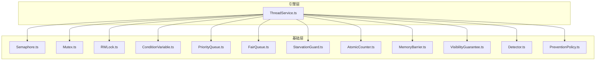
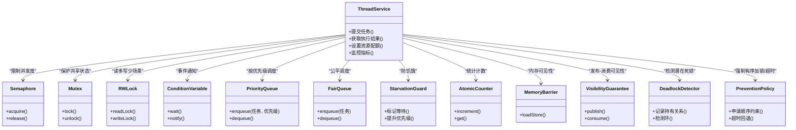
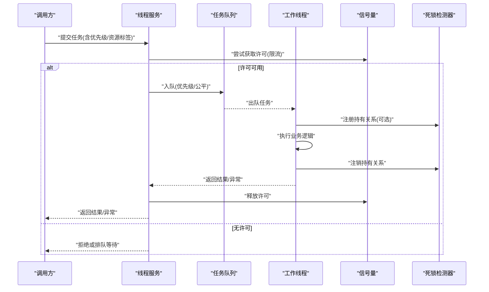
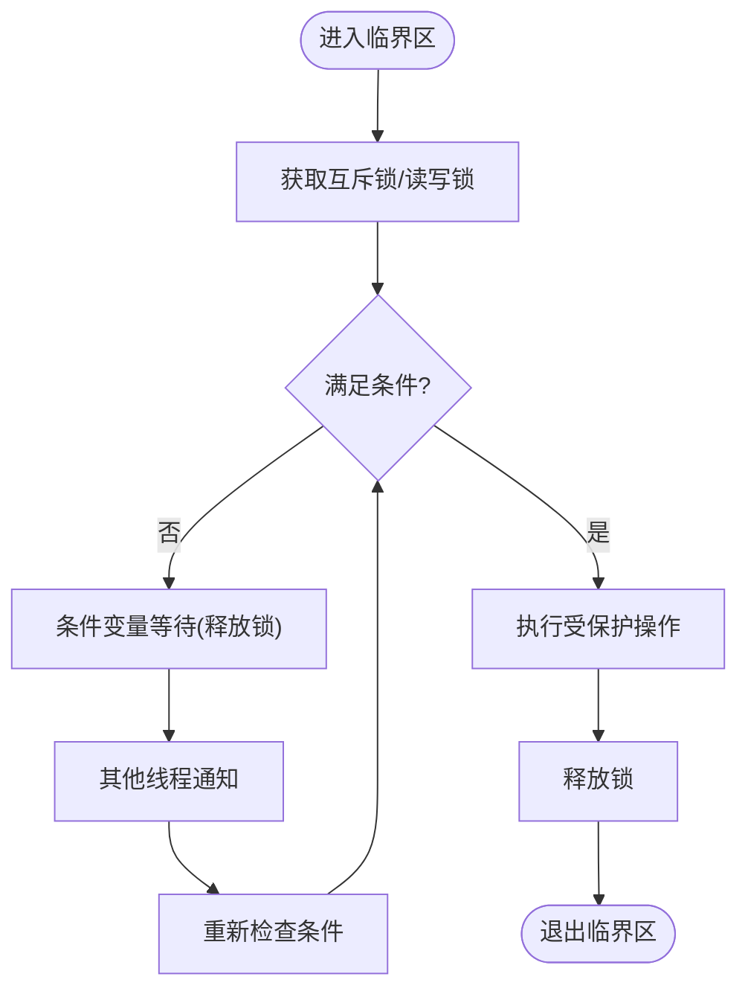
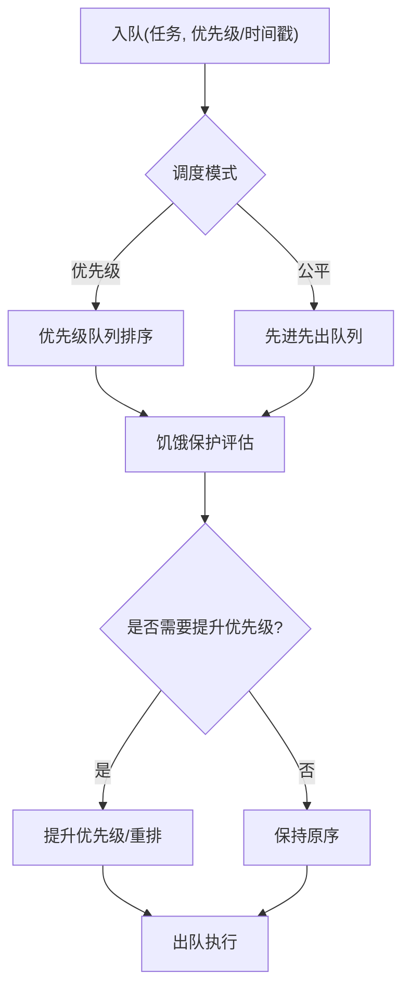
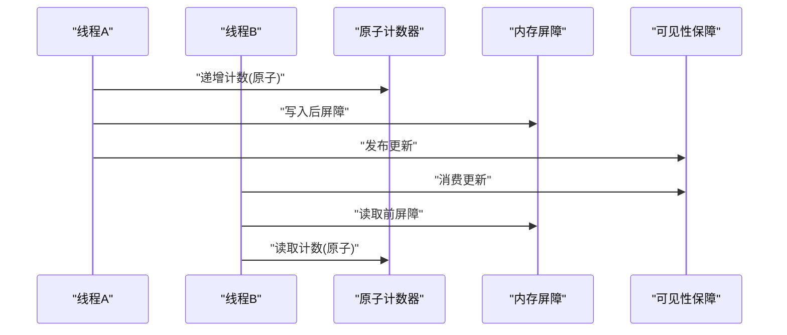
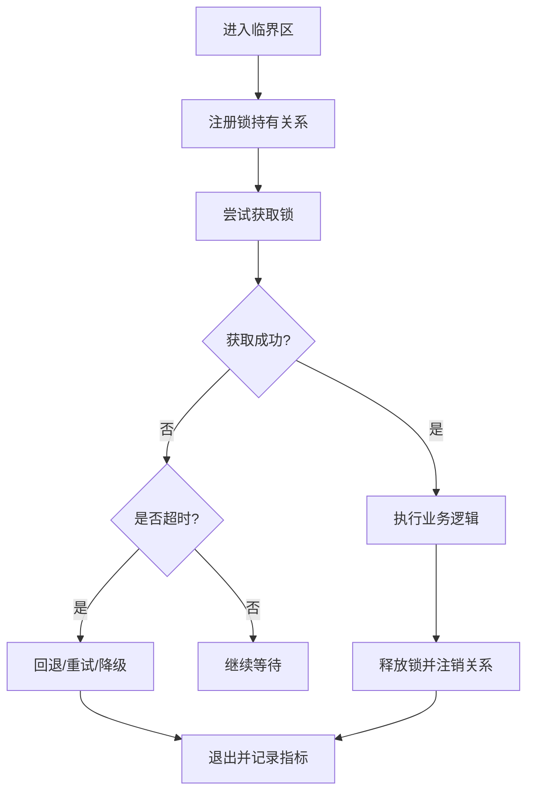
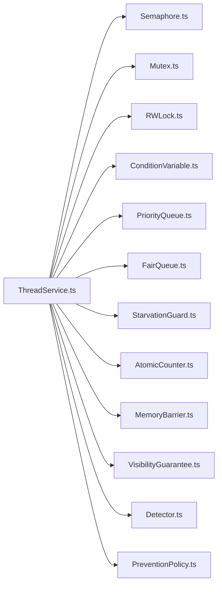

# 并发控制与线程管理

<cite>
**本文引用的文件**   
- [engine/packages/engine/src/ThreadService.ts](file://engine/packages/engine/src/ThreadService.ts)
- [engine/tests/thread-service.test.ts](file://engine/tests/thread-service.test.ts)
- [engine/packages/domain-layer/src/types.ts](file://engine/packages/domain-layer/src/types.ts)
- [engine/packages/foundation/src/sync/Semaphore.ts](file://engine/packages/foundation/src/sync/Semaphore.ts)
- [engine/packages/foundation/src/sync/Mutex.ts](file://engine/packages/foundation/src/sync/Mutex.ts)
- [engine/packages/foundation/src/sync/RWLock.ts](file://engine/packages/foundation/src/sync/RWLock.ts)
- [engine/packages/foundation/src/sync/ConditionVariable.ts](file://engine/packages/foundation/src/sync/ConditionVariable.ts)
- [engine/packages/foundation/src/sync/PriorityQueue.ts](file://engine/packages/foundation/src/sync/PriorityQueue.ts)
- [engine/packages/foundation/src/sync/FairQueue.ts](file://engine/packages/foundation/src/sync/FairQueue.ts)
- [engine/packages/foundation/src/sync/StarvationGuard.ts](file://engine/packages/foundation/src/sync/StarvationGuard.ts)
- [engine/packages/foundation/src/concurrency/AtomicCounter.ts](file://engine/packages/foundation/src/concurrency/AtomicCounter.ts)
- [engine/packages/foundation/src/concurrency/MemoryBarrier.ts](file://engine/packages/foundation/src/concurrency/MemoryBarrier.ts)
- [engine/packages/foundation/src/concurrency/VisibilityGuarantee.ts](file://engine/packages/foundation/src/concurrency/VisibilityGuarantee.ts)
- [engine/packages/foundation/src/deadlock/Detector.ts](file://engine/packages/foundation/src/deadlock/Detector.ts)
- [engine/packages/foundation/src/deadlock/PreventionPolicy.ts](file://engine/packages/foundation/src/deadlock/PreventionPolicy.ts)
</cite>

## 目录
1. [简介](#简介)
2. [项目结构](#项目结构)
3. [核心组件](#核心组件)
4. [架构总览](#架构总览)
5. [详细组件分析](#详细组件分析)
6. [依赖关系分析](#依赖关系分析)
7. [性能考量](#性能考量)
8. [故障排查指南](#故障排查指南)
9. [结论](#结论)
10. [附录](#附录)

## 简介
本技术文档聚焦于KCoder的并发控制与线程管理系统，围绕以下目标展开：
- 线程池架构设计：线程生命周期、任务队列调度、资源隔离。
- 信号量与同步原语：互斥锁、读写锁、条件变量等的使用与组合。
- 队列调度算法：优先级队列、公平调度、饥饿避免策略。
- 并发安全保证：原子操作、内存屏障、可见性保证。
- 死锁检测与预防：实现细节与策略。

该文档旨在帮助开发者理解并正确使用KCoder中的并发基础设施，确保在高负载场景下的稳定性与可观测性。

## 项目结构
KCoder采用多包（monorepo）组织方式，并发相关能力主要分布在foundation层与engine层：
- foundation层提供通用并发原语与工具：信号量、锁、条件变量、队列、原子计数、内存屏障、可见性保障、死锁检测与预防策略。
- engine层基于foundation构建线程服务与运行时调度，负责线程池、任务编排与资源隔离。

图表来源
- [engine/packages/engine/src/ThreadService.ts](file://engine/packages/engine/src/ThreadService.ts)
- [engine/packages/foundation/src/sync/Semaphore.ts](file://engine/packages/foundation/src/sync/Semaphore.ts)
- [engine/packages/foundation/src/sync/Mutex.ts](file://engine/packages/foundation/src/sync/Mutex.ts)
- [engine/packages/foundation/src/sync/RWLock.ts](file://engine/packages/foundation/src/sync/RWLock.ts)
- [engine/packages/foundation/src/sync/ConditionVariable.ts](file://engine/packages/foundation/src/sync/ConditionVariable.ts)
- [engine/packages/foundation/src/sync/PriorityQueue.ts](file://engine/packages/foundation/src/sync/PriorityQueue.ts)
- [engine/packages/foundation/src/sync/FairQueue.ts](file://engine/packages/foundation/src/sync/FairQueue.ts)
- [engine/packages/foundation/src/sync/StarvationGuard.ts](file://engine/packages/foundation/src/sync/StarvationGuard.ts)
- [engine/packages/foundation/src/concurrency/AtomicCounter.ts](file://engine/packages/foundation/src/concurrency/AtomicCounter.ts)
- [engine/packages/foundation/src/concurrency/MemoryBarrier.ts](file://engine/packages/foundation/src/concurrency/MemoryBarrier.ts)
- [engine/packages/foundation/src/concurrency/VisibilityGuarantee.ts](file://engine/packages/foundation/src/concurrency/VisibilityGuarantee.ts)
- [engine/packages/foundation/src/deadlock/Detector.ts](file://engine/packages/foundation/src/deadlock/Detector.ts)
- [engine/packages/foundation/src/deadlock/PreventionPolicy.ts](file://engine/packages/foundation/src/deadlock/PreventionPolicy.ts)

章节来源
- [engine/packages/engine/src/ThreadService.ts](file://engine/packages/engine/src/ThreadService.ts)
- [engine/packages/foundation/src/sync/Semaphore.ts](file://engine/packages/foundation/src/sync/Semaphore.ts)
- [engine/packages/foundation/src/sync/Mutex.ts](file://engine/packages/foundation/src/sync/Mutex.ts)
- [engine/packages/foundation/src/sync/RWLock.ts](file://engine/packages/foundation/src/sync/RWLock.ts)
- [engine/packages/foundation/src/sync/ConditionVariable.ts](file://engine/packages/foundation/src/sync/ConditionVariable.ts)
- [engine/packages/foundation/src/sync/PriorityQueue.ts](file://engine/packages/foundation/src/sync/PriorityQueue.ts)
- [engine/packages/foundation/src/sync/FairQueue.ts](file://engine/packages/foundation/src/sync/FairQueue.ts)
- [engine/packages/foundation/src/sync/StarvationGuard.ts](file://engine/packages/foundation/src/sync/StarvationGuard.ts)
- [engine/packages/foundation/src/concurrency/AtomicCounter.ts](file://engine/packages/foundation/src/concurrency/AtomicCounter.ts)
- [engine/packages/foundation/src/concurrency/MemoryBarrier.ts](file://engine/packages/foundation/src/concurrency/MemoryBarrier.ts)
- [engine/packages/foundation/src/concurrency/VisibilityGuarantee.ts](file://engine/packages/foundation/src/concurrency/VisibilityGuarantee.ts)
- [engine/packages/foundation/src/deadlock/Detector.ts](file://engine/packages/foundation/src/deadlock/Detector.ts)
- [engine/packages/foundation/src/deadlock/PreventionPolicy.ts](file://engine/packages/foundation/src/deadlock/PreventionPolicy.ts)

## 核心组件
本节概述线程服务与并发原语的职责边界与协作方式：
- 线程服务：封装线程池创建、销毁、任务提交、背压与资源隔离；对外暴露统一的执行接口。
- 同步原语：提供互斥、读写、条件变量、信号量等基础能力，供上层组合使用。
- 队列调度：提供优先级与公平队列，支持饥饿保护与可插拔策略。
- 并发安全：原子计数、内存屏障与可见性保障，确保跨线程状态一致。
- 死锁治理：检测器与预防策略，结合超时与回退机制降低风险。

章节来源
- [engine/packages/engine/src/ThreadService.ts](file://engine/packages/engine/src/ThreadService.ts)
- [engine/packages/foundation/src/sync/Semaphore.ts](file://engine/packages/foundation/src/sync/Semaphore.ts)
- [engine/packages/foundation/src/sync/Mutex.ts](file://engine/packages/foundation/src/sync/Mutex.ts)
- [engine/packages/foundation/src/sync/RWLock.ts](file://engine/packages/foundation/src/sync/RWLock.ts)
- [engine/packages/foundation/src/sync/ConditionVariable.ts](file://engine/packages/foundation/src/sync/ConditionVariable.ts)
- [engine/packages/foundation/src/sync/PriorityQueue.ts](file://engine/packages/foundation/src/sync/PriorityQueue.ts)
- [engine/packages/foundation/src/sync/FairQueue.ts](file://engine/packages/foundation/src/sync/FairQueue.ts)
- [engine/packages/foundation/src/sync/StarvationGuard.ts](file://engine/packages/foundation/src/sync/StarvationGuard.ts)
- [engine/packages/foundation/src/concurrency/AtomicCounter.ts](file://engine/packages/foundation/src/concurrency/AtomicCounter.ts)
- [engine/packages/foundation/src/concurrency/MemoryBarrier.ts](file://engine/packages/foundation/src/concurrency/MemoryBarrier.ts)
- [engine/packages/foundation/src/concurrency/VisibilityGuarantee.ts](file://engine/packages/foundation/src/concurrency/VisibilityGuarantee.ts)
- [engine/packages/foundation/src/deadlock/Detector.ts](file://engine/packages/foundation/src/deadlock/Detector.ts)
- [engine/packages/foundation/src/deadlock/PreventionPolicy.ts](file://engine/packages/foundation/src/deadlock/PreventionPolicy.ts)

## 架构总览
下图展示线程服务如何组合底层同步原语与队列，形成高可用的并发执行环境。

图表来源
- [engine/packages/engine/src/ThreadService.ts](file://engine/packages/engine/src/ThreadService.ts)
- [engine/packages/foundation/src/sync/Semaphore.ts](file://engine/packages/foundation/src/sync/Semaphore.ts)
- [engine/packages/foundation/src/sync/Mutex.ts](file://engine/packages/foundation/src/sync/Mutex.ts)
- [engine/packages/foundation/src/sync/RWLock.ts](file://engine/packages/foundation/src/sync/RWLock.ts)
- [engine/packages/foundation/src/sync/ConditionVariable.ts](file://engine/packages/foundation/src/sync/ConditionVariable.ts)
- [engine/packages/foundation/src/sync/PriorityQueue.ts](file://engine/packages/foundation/src/sync/PriorityQueue.ts)
- [engine/packages/foundation/src/sync/FairQueue.ts](file://engine/packages/foundation/src/sync/FairQueue.ts)
- [engine/packages/foundation/src/sync/StarvationGuard.ts](file://engine/packages/foundation/src/sync/StarvationGuard.ts)
- [engine/packages/foundation/src/concurrency/AtomicCounter.ts](file://engine/packages/foundation/src/concurrency/AtomicCounter.ts)
- [engine/packages/foundation/src/concurrency/MemoryBarrier.ts](file://engine/packages/foundation/src/concurrency/MemoryBarrier.ts)
- [engine/packages/foundation/src/concurrency/VisibilityGuarantee.ts](file://engine/packages/foundation/src/concurrency/VisibilityGuarantee.ts)
- [engine/packages/foundation/src/deadlock/Detector.ts](file://engine/packages/foundation/src/deadlock/Detector.ts)
- [engine/packages/foundation/src/deadlock/PreventionPolicy.ts](file://engine/packages/foundation/src/deadlock/PreventionPolicy.ts)

## 详细组件分析

### 线程服务与线程池
- 职责：统一入口，负责线程池的创建与回收、任务入队与出队、背压控制、资源隔离与指标上报。
- 生命周期：初始化阶段完成工作线程预热与队列绑定；运行期根据负载动态调整并发度；关闭阶段优雅停机，确保未完成任务的处理或回滚。
- 资源隔离：通过信号量与配额策略对CPU、I/O、外部调用进行限流，防止单租户或单任务耗尽资源。
- 调度策略：支持优先级队列与公平队列两种模式，可按业务需求切换；在公平模式下配合饥饿保护，避免低优先级任务长期得不到执行。

图表来源
- [engine/packages/engine/src/ThreadService.ts](file://engine/packages/engine/src/ThreadService.ts)
- [engine/packages/foundation/src/sync/Semaphore.ts](file://engine/packages/foundation/src/sync/Semaphore.ts)
- [engine/packages/foundation/src/sync/PriorityQueue.ts](file://engine/packages/foundation/src/sync/PriorityQueue.ts)
- [engine/packages/foundation/src/sync/FairQueue.ts](file://engine/packages/foundation/src/sync/FairQueue.ts)
- [engine/packages/foundation/src/deadlock/Detector.ts](file://engine/packages/foundation/src/deadlock/Detector.ts)

章节来源
- [engine/packages/engine/src/ThreadService.ts](file://engine/packages/engine/src/ThreadService.ts)
- [engine/tests/thread-service.test.ts](file://engine/tests/thread-service.test.ts)

### 同步原语与信号量
- 互斥锁：用于保护临界区，确保同一时刻仅一个线程访问共享数据。
- 读写锁：在读多写少场景下提高吞吐，读锁并行、写锁独占。
- 条件变量：与锁配合，实现“等待-通知”模型，减少忙轮询。
- 信号量：作为令牌桶式限流器，控制并发度与资源配额，常用于I/O或外部API限流。

图表来源
- [engine/packages/foundation/src/sync/Mutex.ts](file://engine/packages/foundation/src/sync/Mutex.ts)
- [engine/packages/foundation/src/sync/RWLock.ts](file://engine/packages/foundation/src/sync/RWLock.ts)
- [engine/packages/foundation/src/sync/ConditionVariable.ts](file://engine/packages/foundation/src/sync/ConditionVariable.ts)
- [engine/packages/foundation/src/sync/Semaphore.ts](file://engine/packages/foundation/src/sync/Semaphore.ts)

章节来源
- [engine/packages/foundation/src/sync/Mutex.ts](file://engine/packages/foundation/src/sync/Mutex.ts)
- [engine/packages/foundation/src/sync/RWLock.ts](file://engine/packages/foundation/src/sync/RWLock.ts)
- [engine/packages/foundation/src/sync/ConditionVariable.ts](file://engine/packages/foundation/src/sync/ConditionVariable.ts)
- [engine/packages/foundation/src/sync/Semaphore.ts](file://engine/packages/foundation/src/sync/Semaphore.ts)

### 队列调度算法
- 优先级队列：按任务优先级出队，适合延迟敏感型任务；需配合饥饿保护避免低优先级任务饿死。
- 公平队列：按到达顺序出队，保证公平性；在高负载下可能牺牲整体吞吐。
- 饥饿保护：跟踪任务等待时长，动态提升优先级或插入更高优先级队列，确保所有任务最终被执行。

图表来源
- [engine/packages/foundation/src/sync/PriorityQueue.ts](file://engine/packages/foundation/src/sync/PriorityQueue.ts)
- [engine/packages/foundation/src/sync/FairQueue.ts](file://engine/packages/foundation/src/sync/FairQueue.ts)
- [engine/packages/foundation/src/sync/StarvationGuard.ts](file://engine/packages/foundation/src/sync/StarvationGuard.ts)

章节来源
- [engine/packages/foundation/src/sync/PriorityQueue.ts](file://engine/packages/foundation/src/sync/PriorityQueue.ts)
- [engine/packages/foundation/src/sync/FairQueue.ts](file://engine/packages/foundation/src/sync/FairQueue.ts)
- [engine/packages/foundation/src/sync/StarvationGuard.ts](file://engine/packages/foundation/src/sync/StarvationGuard.ts)

### 并发安全保证
- 原子操作：使用原子计数器进行无锁累加与读取，避免竞争条件。
- 内存屏障：在关键路径插入屏障，确保指令重排不会破坏语义。
- 可见性保证：通过发布-消费模型与屏障，确保多线程间状态变更及时可见。

图表来源
- [engine/packages/foundation/src/concurrency/AtomicCounter.ts](file://engine/packages/foundation/src/concurrency/AtomicCounter.ts)
- [engine/packages/foundation/src/concurrency/MemoryBarrier.ts](file://engine/packages/foundation/src/concurrency/MemoryBarrier.ts)
- [engine/packages/foundation/src/concurrency/VisibilityGuarantee.ts](file://engine/packages/foundation/src/concurrency/VisibilityGuarantee.ts)

章节来源
- [engine/packages/foundation/src/concurrency/AtomicCounter.ts](file://engine/packages/foundation/src/concurrency/AtomicCounter.ts)
- [engine/packages/foundation/src/concurrency/MemoryBarrier.ts](file://engine/packages/foundation/src/concurrency/MemoryBarrier.ts)
- [engine/packages/foundation/src/concurrency/VisibilityGuarantee.ts](file://engine/packages/foundation/src/concurrency/VisibilityGuarantee.ts)

### 死锁检测与预防
- 检测器：维护锁持有关系图，周期性扫描是否存在环，发现潜在死锁时发出告警或触发恢复流程。
- 预防策略：强制加锁顺序、超时回退、重试与降级，避免长时间阻塞。
- 集成点：在线程服务中为关键加锁路径注册持有关系，并在任务执行前后注销。

图表来源
- [engine/packages/foundation/src/deadlock/Detector.ts](file://engine/packages/foundation/src/deadlock/Detector.ts)
- [engine/packages/foundation/src/deadlock/PreventionPolicy.ts](file://engine/packages/foundation/src/deadlock/PreventionPolicy.ts)
- [engine/packages/engine/src/ThreadService.ts](file://engine/packages/engine/src/ThreadService.ts)

章节来源
- [engine/packages/foundation/src/deadlock/Detector.ts](file://engine/packages/foundation/src/deadlock/Detector.ts)
- [engine/packages/foundation/src/deadlock/PreventionPolicy.ts](file://engine/packages/foundation/src/deadlock/PreventionPolicy.ts)
- [engine/packages/engine/src/ThreadService.ts](file://engine/packages/engine/src/ThreadService.ts)

## 依赖关系分析
线程服务依赖foundation层的多种并发原语与策略，形成松耦合、可插拔的架构。

图表来源
- [engine/packages/engine/src/ThreadService.ts](file://engine/packages/engine/src/ThreadService.ts)
- [engine/packages/foundation/src/sync/Semaphore.ts](file://engine/packages/foundation/src/sync/Semaphore.ts)
- [engine/packages/foundation/src/sync/Mutex.ts](file://engine/packages/foundation/src/sync/Mutex.ts)
- [engine/packages/foundation/src/sync/RWLock.ts](file://engine/packages/foundation/src/sync/RWLock.ts)
- [engine/packages/foundation/src/sync/ConditionVariable.ts](file://engine/packages/foundation/src/sync/ConditionVariable.ts)
- [engine/packages/foundation/src/sync/PriorityQueue.ts](file://engine/packages/foundation/src/sync/PriorityQueue.ts)
- [engine/packages/foundation/src/sync/FairQueue.ts](file://engine/packages/foundation/src/sync/FairQueue.ts)
- [engine/packages/foundation/src/sync/StarvationGuard.ts](file://engine/packages/foundation/src/sync/StarvationGuard.ts)
- [engine/packages/foundation/src/concurrency/AtomicCounter.ts](file://engine/packages/foundation/src/concurrency/AtomicCounter.ts)
- [engine/packages/foundation/src/concurrency/MemoryBarrier.ts](file://engine/packages/foundation/src/concurrency/MemoryBarrier.ts)
- [engine/packages/foundation/src/concurrency/VisibilityGuarantee.ts](file://engine/packages/foundation/src/concurrency/VisibilityGuarantee.ts)
- [engine/packages/foundation/src/deadlock/Detector.ts](file://engine/packages/foundation/src/deadlock/Detector.ts)
- [engine/packages/foundation/src/deadlock/PreventionPolicy.ts](file://engine/packages/foundation/src/deadlock/PreventionPolicy.ts)

章节来源
- [engine/packages/engine/src/ThreadService.ts](file://engine/packages/engine/src/ThreadService.ts)
- [engine/packages/foundation/src/sync/Semaphore.ts](file://engine/packages/foundation/src/sync/Semaphore.ts)
- [engine/packages/foundation/src/sync/Mutex.ts](file://engine/packages/foundation/src/sync/Mutex.ts)
- [engine/packages/foundation/src/sync/RWLock.ts](file://engine/packages/foundation/src/sync/RWLock.ts)
- [engine/packages/foundation/src/sync/ConditionVariable.ts](file://engine/packages/foundation/src/sync/ConditionVariable.ts)
- [engine/packages/foundation/src/sync/PriorityQueue.ts](file://engine/packages/foundation/src/sync/PriorityQueue.ts)
- [engine/packages/foundation/src/sync/FairQueue.ts](file://engine/packages/foundation/src/sync/FairQueue.ts)
- [engine/packages/foundation/src/sync/StarvationGuard.ts](file://engine/packages/foundation/src/sync/StarvationGuard.ts)
- [engine/packages/foundation/src/concurrency/AtomicCounter.ts](file://engine/packages/foundation/src/concurrency/AtomicCounter.ts)
- [engine/packages/foundation/src/concurrency/MemoryBarrier.ts](file://engine/packages/foundation/src/concurrency/MemoryBarrier.ts)
- [engine/packages/foundation/src/concurrency/VisibilityGuarantee.ts](file://engine/packages/foundation/src/concurrency/VisibilityGuarantee.ts)
- [engine/packages/foundation/src/deadlock/Detector.ts](file://engine/packages/foundation/src/deadlock/Detector.ts)
- [engine/packages/foundation/src/deadlock/PreventionPolicy.ts](file://engine/packages/foundation/src/deadlock/PreventionPolicy.ts)

## 性能考量
- 背压与限流：通过信号量限制并发度，避免系统过载；结合队列长度阈值进行快速失败或延迟提交。
- 调度选择：延迟敏感任务使用优先级队列，吞吐优先任务使用公平队列；根据业务特征动态切换。
- 饥饿保护：合理设置等待阈值与提升幅度，平衡公平性与整体延迟。
- 原子与屏障：仅在必要路径使用原子与屏障，避免过度开销；批量更新合并以减少同步成本。
- 资源隔离：按租户或任务类型划分资源配额，防止热点任务影响全局。

[本节为通用指导，不直接分析具体文件]

## 故障排查指南
- 任务堆积：检查队列长度与出队速率，确认是否因限流过严或下游瓶颈导致。
- 饥饿现象：观察等待时长分布，调整饥饿保护参数或切换调度模式。
- 死锁告警：查看锁持有关系图，定位环路与冲突路径，应用预防策略（顺序约束、超时回退）。
- 可见性问题：核对发布-消费路径是否正确插入屏障，确保状态变更及时可见。
- 指标与日志：利用线程服务的监控接口采集吞吐、延迟、错误率，辅助定位问题。

章节来源
- [engine/tests/thread-service.test.ts](file://engine/tests/thread-service.test.ts)
- [engine/packages/engine/src/ThreadService.ts](file://engine/packages/engine/src/ThreadService.ts)

## 结论
KCoder的并发控制与线程管理系统以foundation层为基础，提供完备的同步原语、队列调度与并发安全保障，并通过线程服务整合为高可用的执行环境。通过合理的限流、调度与死锁治理策略，可在复杂业务场景下保持稳定与高效。建议在生产环境中启用监控与告警，持续优化参数与策略。

[本节为总结性内容，不直接分析具体文件]

## 附录
- 类型定义参考：任务、上下文与运行时契约的定义有助于理解线程服务的数据模型与边界。

章节来源
- [engine/packages/domain-layer/src/types.ts](file://engine/packages/domain-layer/src/types.ts)