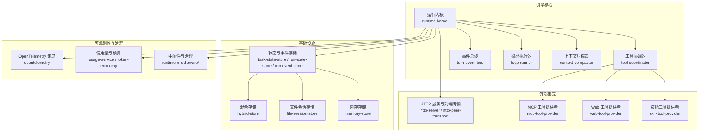
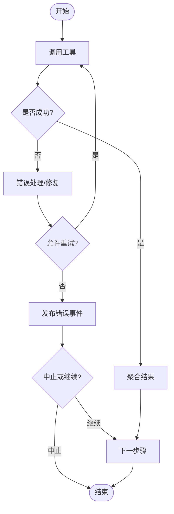
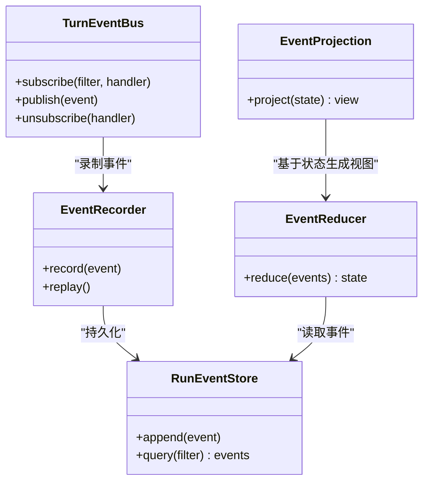
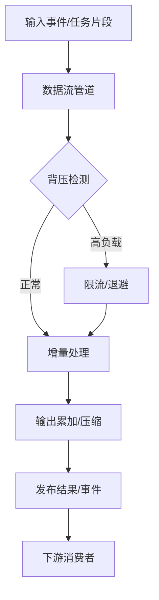
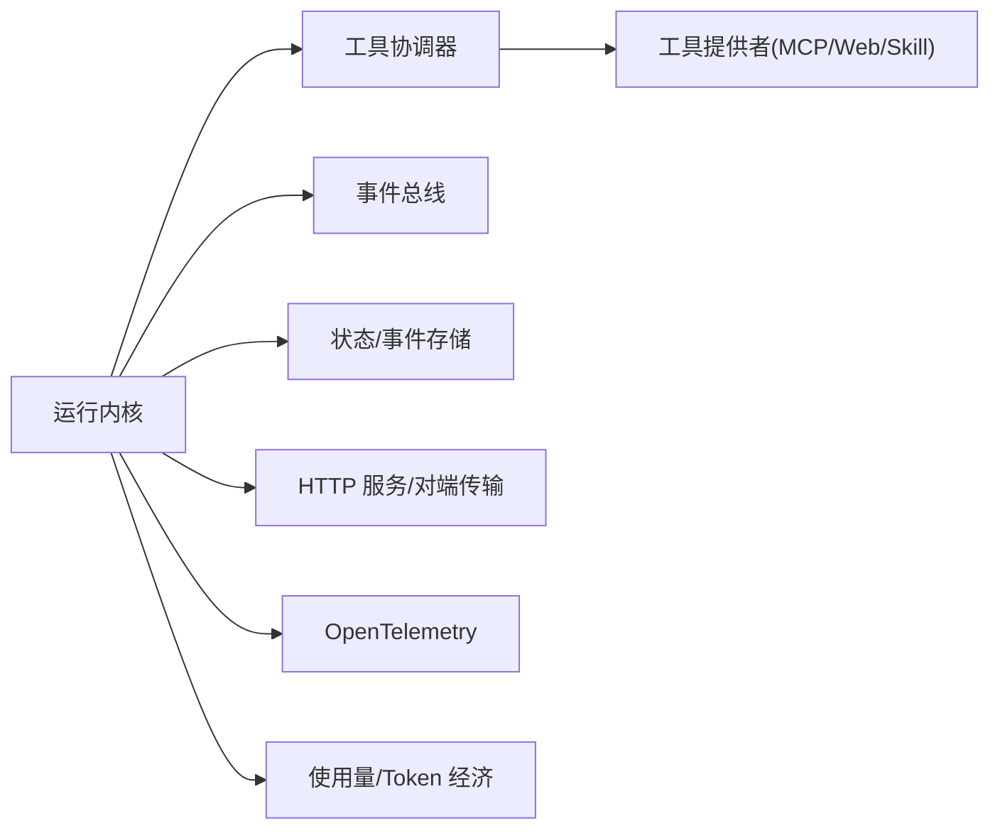

# 异步执行模型

<cite>
**本文引用的文件**   
- [engine/README.md](file://engine/README.md)
- [engine/package.json](file://engine/package.json)
- [engine/tsconfig.json](file://engine/tsconfig.json)
- [engine/tests/evented-loop.test.ts](file://engine/tests/evented-loop.test.ts)
- [engine/tests/runtime-kernel.test.ts](file://engine/tests/runtime-kernel.test.ts)
- [engine/tests/tool-runtime-v3.test.ts](file://engine/tests/tool-runtime-v3.test.ts)
- [engine/tests/turn-event-bus.test.ts](file://engine/tests/turn-event-bus.test.ts)
- [engine/tests/execution-graph.test.ts](file://engine/tests/execution-graph.test.ts)
- [engine/tests/tool-coordinator-runtime.test.ts](file://engine/tests/tool-coordinator-runtime.test.ts)
- [engine/tests/runtime-kernel-after-middleware.test.ts](file://engine/tests/runtime-kernel-after-middleware.test.ts)
- [engine/tests/runtime-kernel-contracts.test.ts](file://engine/tests/runtime-kernel-contracts.test.ts)
- [engine/tests/runtime-kernel-crash-recovery.test.ts](file://engine/tests/runtime-kernel-crash-recovery.test.ts)
- [engine/tests/runtime-kernel-provider-matrix.test.ts](file://engine/tests/runtime-kernel-provider-matrix.test.ts)
- [engine/tests/runtime-kernel-isolation.test.ts](file://engine/tests/runtime-kernel-isolation.test.ts)
- [engine/tests/runtime-kernel-e2e.test.ts](file://engine/tests/runtime-kernel-e2e.test.ts)
- [engine/tests/runtime-kernel-replay.test.ts](file://engine/tests/runtime-kernel-replay.test.ts)
- [engine/tests/runtime-kernel-budget.test.ts](file://engine/tests/runtime-kernel-budget.test.ts)
- [engine/tests/runtime-kernel-parity.test.ts](file://engine/tests/runtime-kernel-parity.test.ts)
- [engine/tests/runtime-middleware-governance.test.ts](file://engine/tests/runtime-middleware-governance.test.ts)
- [engine/tests/runtime-middleware.test.ts](file://engine/tests/runtime-middleware.test.ts)
- [engine/tests/runtime-factory.test.ts](file://engine/tests/runtime-factory.test.ts)
- [engine/tests/runtime-factory-rollout.test.ts](file://engine/tests/runtime-factory-rollout.test.ts)
- [engine/tests/tool-call-repair.test.ts](file://engine/tests/tool-call-repair.test.ts)
- [engine/tests/tool-dispatch-errors.test.ts](file://engine/tests/tool-dispatch-errors.test.ts)
- [engine/tests/tool-result-budget.test.ts](file://engine/tests/tool-result-budget.test.ts)
- [engine/tests/tool-storm-breaker.test.ts](file://engine/tests/tool-storm-breaker.test.ts)
- [engine/tests/loop-runner.test.ts](file://engine/tests/loop-runner.test.ts)
- [engine/tests/loop-policy.test.ts](file://engine/tests/loop-policy.test.ts)
- [engine/tests/loop-plan.test.ts](file://engine/tests/loop-plan.test.ts)
- [engine/tests/loop-evaluator.test.ts](file://engine/tests/loop-evaluator.test.ts)
- [engine/tests/compaction-governor.test.ts](file://engine/tests/compaction-governor.test.ts)
- [engine/tests/context-compactor.test.ts](file://engine/tests/context-compactor.test.ts)
- [engine/tests/durable-task-capsule.test.ts](file://engine/tests/durable-task-capsule.test.ts)
- [engine/tests/task-state-store.test.ts](file://engine/tests/task-state-store.test.ts)
- [engine/tests/run-state-store.test.ts](file://engine/tests/run-state-store.test.ts)
- [engine/tests/run-event-store.test.ts](file://engine/tests/run-event-store.test.ts)
- [engine/tests/runtime-event-projection.test.ts](file://engine/tests/runtime-event-projection.test.ts)
- [engine/tests/runtime-event-recorder-kernel.test.ts](file://engine/tests/runtime-event-recorder-kernel.test.ts)
- [engine/tests/runtime-event-reducer.test.ts](file://engine/tests/runtime-event-reducer.test.ts)
- [engine/tests/output-accumulator.test.ts](file://engine/tests/output-accumulator.test.ts)
- [engine/tests/memory-store.test.ts](file://engine/tests/memory-store.test.ts)
- [engine/tests/hybrid-store.test.ts](file://engine/tests/hybrid-store.test.ts)
- [engine/tests/file-session-store.test.ts](file://engine/tests/file-session-store.test.ts)
- [engine/tests/file-session-store-integration.test.ts](file://engine/tests/file-session-store-integration.test.ts)
- [engine/tests/steering-queue-isolation.test.ts](file://engine/tests/steering-queue-isolation.test.ts)
- [engine/tests/skill-tool-provider.test.ts](file://engine/tests/skill-tool-provider.test.ts)
- [engine/tests/mcp-tool-provider.test.ts](file://engine/tests/mcp-tool-provider.test.ts)
- [engine/tests/web-tool-provider.test.ts](file://engine/tests/web-tool-provider.test.ts)
- [engine/tests/http-peer-transport.test.ts](file://engine/tests/http-peer-transport.test.ts)
- [engine/tests/http-server.test.ts](file://engine/tests/http-server.test.ts)
- [engine/tests/http-artifacts.test.ts](file://engine/tests/http-artifacts.test.ts)
- [engine/tests/opentelemetry.test.ts](file://engine/tests/opentelemetry.test.ts)
- [engine/tests/usage-service.test.ts](file://engine/tests/usage-service.test.ts)
- [engine/tests/token-economy.test.ts](file://engine/tests/token-economy.test.ts)
- [engine/tests/model-client.test.ts](file://engine/tests/model-client.test.ts)
- [engine/tests/model-history-repair.test.ts](file://engine/tests/model-history-repair.test.ts)
- [engine/tests/model-step-runner.test.ts](file://engine/tests/model-step-runner.test.ts)
- [engine/tests/capability-registry.test.ts](file://engine/tests/capability-registry.test.ts)
- [engine/tests/capabilities.test.ts](file://engine/tests/capabilities.test.ts)
- [engine/tests/provider-compatibility.test.ts](file://engine/tests/provider-compatibility.test.ts)
- [engine/tests/delegation-runtime.test.ts](file://engine/tests/delegation-runtime.test.ts)
- [engine/tests/delegation-terminal-state.test.ts](file://engine/tests/delegation-terminal-state.test.ts)
- [engine/tests/child-agent-executor.test.ts](file://engine/tests/child-agent-executor.test.ts)
- [engine/tests/effect-commit.test.ts](file://engine/tests/effect-commit.test.ts)
- [engine/tests/effect-result-store.test.ts](file://engine/tests/effect-result-store.test.ts)
- [engine/tests/contracts.test.ts](file://engine/tests/contracts.test.ts)
- [engine/tests/domain.test.ts](file://engine/tests/domain.test.ts)
- [engine/tests/manifest.test.ts](file://engine/tests/manifest.test.ts)
- [engine/tests/builtin-tools.test.ts](file://engine/tests/builtin-tools.test.ts)
- [engine/tests/builtin-tool-utils.test.ts](file://engine/tests/builtin-tool-utils.test.ts)
- [engine/tests/goal-tools.test.ts](file://engine/tests/goal-tools.test.ts)
- [engine/tests/todo-tools.test.ts](file://engine/tests/todo-tools.test.ts)
- [engine/tests/review.test.ts](file://engine/tests/review.test.ts)
- [engine/tests/security-review.test.ts](file://engine/tests/security-review.test.ts)
- [engine/tests/tdd-cycle.md](file://engine/skills/tdd/tdd-cycle.md)
- [engine/skills/code-review/SKILL.md](file://engine/skills/code-review/SKILL.md)
- [engine/skills/debugging/SKILL.md](file://engine/skills/debugging/SKILL.md)
- [engine/skills/git-worktrees/SKILL.md](file://engine/skills/git-worktrees/SKILL.md)
- [engine/skills/goal/SKILL.md](file://engine/skills/goal/SKILL.md)
- [engine/skills/planning/SKILL.md](file://engine/skills/planning/SKILL.md)
- [engine/skills/refactoring/SKILL.md](file://engine/skills/refactoring/SKILL.md)
- [engine/skills/review/SKILL.md](file://engine/skills/review/SKILL.md)
- [engine/skills/security-review/SKILL.md](file://engine/skills/security-review/SKILL.md)
- [engine/skills/web/SKILL.md](file://engine/skills/web/SKILL.md)
</cite>

## 目录
1. [简介](#简介)
2. [项目结构](#项目结构)
3. [核心组件](#核心组件)
4. [架构总览](#架构总览)
5. [详细组件分析](#详细组件分析)
6. [依赖分析](#依赖分析)
7. [性能考虑](#性能考虑)
8. [故障排查指南](#故障排查指南)
9. [结论](#结论)
10. [附录](#附录)

## 简介
本技术文档围绕 KCoder 引擎的异步执行模型展开，聚焦以下主题：
- Promise 链式调用机制：错误传播、结果聚合、超时处理
- 事件驱动架构：事件总线设计、订阅发布模式、事件过滤与投影
- 流式处理机制：数据流管道、背压控制、增量计算
- 异步编程最佳实践：错误恢复、资源清理、性能优化
- 监控与调试：可观测性、回放与审计、指标采集

通过结合测试用例与工程配置，本文提供从高层架构到代码级实现路径的系统化说明，帮助读者快速理解并正确使用 KCoder 的异步能力。

## 项目结构
KCoder 采用多包工作区组织，引擎核心位于 engine 目录，包含领域层、运行时内核、工具协调器、中间件、持久化、HTTP 传输、可观测性等模块。测试覆盖广泛，涵盖事件循环、运行内核、工具运行时、任务状态、事件存储、回放、预算治理等关键路径。



图表来源
- [engine/tests/runtime-kernel.test.ts](file://engine/tests/runtime-kernel.test.ts)
- [engine/tests/tool-coordinator-runtime.test.ts](file://engine/tests/tool-coordinator-runtime.test.ts)
- [engine/tests/turn-event-bus.test.ts](file://engine/tests/turn-event-bus.test.ts)
- [engine/tests/loop-runner.test.ts](file://engine/tests/loop-runner.test.ts)
- [engine/tests/context-compactor.test.ts](file://engine/tests/context-compactor.test.ts)
- [engine/tests/task-state-store.test.ts](file://engine/tests/task-state-store.test.ts)
- [engine/tests/run-state-store.test.ts](file://engine/tests/run-state-store.test.ts)
- [engine/tests/run-event-store.test.ts](file://engine/tests/run-event-store.test.ts)
- [engine/tests/hybrid-store.test.ts](file://engine/tests/hybrid-store.test.ts)
- [engine/tests/file-session-store.test.ts](file://engine/tests/file-session-store-integration.test.ts)
- [engine/tests/memory-store.test.ts](file://engine/tests/memory-store.test.ts)
- [engine/tests/http-server.test.ts](file://engine/tests/http-server.test.ts)
- [engine/tests/http-peer-transport.test.ts](file://engine/tests/http-peer-transport.test.ts)
- [engine/tests/mcp-tool-provider.test.ts](file://engine/tests/mcp-tool-provider.test.ts)
- [engine/tests/web-tool-provider.test.ts](file://engine/tests/web-tool-provider.test.ts)
- [engine/tests/skill-tool-provider.test.ts](file://engine/tests/skill-tool-provider.test.ts)
- [engine/tests/opentelemetry.test.ts](file://engine/tests/opentelemetry.test.ts)
- [engine/tests/usage-service.test.ts](file://engine/tests/usage-service.test.ts)
- [engine/tests/token-economy.test.ts](file://engine/tests/token-economy.test.ts)
- [engine/tests/runtime-middleware.test.ts](file://engine/tests/runtime-middleware.test.ts)

章节来源
- [engine/README.md](file://engine/README.md)
- [engine/package.json](file://engine/package.json)
- [engine/tsconfig.json](file://engine/tsconfig.json)

## 核心组件
- 运行内核（Runtime Kernel）：编排任务生命周期、调度工具调用、管理中间件与治理策略、对接事件总线与存储。
- 工具协调器（Tool Coordinator）：统一工具发现、参数校验、调用编排、结果聚合与错误修复。
- 事件总线（Turn Event Bus）：基于订阅发布的消息通道，支持事件过滤、投影与回放。
- 循环执行器（Loop Runner）：驱动迭代式执行流程，结合策略与评估器进行终止判定。
- 上下文压缩器（Context Compactor）：在长对话或复杂任务中压缩历史，维持上下文窗口。
- 存储层（State & Event Stores）：任务状态、运行状态、事件日志的持久化与查询。
- 可观测性与治理：OpenTelemetry 追踪、使用量统计、Token 经济、中间件治理。

章节来源
- [engine/tests/runtime-kernel.test.ts](file://engine/tests/runtime-kernel.test.ts)
- [engine/tests/tool-coordinator-runtime.test.ts](file://engine/tests/tool-coordinator-runtime.test.ts)
- [engine/tests/turn-event-bus.test.ts](file://engine/tests/turn-event-bus.test.ts)
- [engine/tests/loop-runner.test.ts](file://engine/tests/loop-runner.test.ts)
- [engine/tests/context-compactor.test.ts](file://engine/tests/context-compactor.test.ts)
- [engine/tests/task-state-store.test.ts](file://engine/tests/task-state-store.test.ts)
- [engine/tests/run-state-store.test.ts](file://engine/tests/run-state-store.test.ts)
- [engine/tests/run-event-store.test.ts](file://engine/tests/run-event-store.test.ts)
- [engine/tests/opentelemetry.test.ts](file://engine/tests/opentelemetry.test.ts)
- [engine/tests/usage-service.test.ts](file://engine/tests/usage-service.test.ts)
- [engine/tests/token-economy.test.ts](file://engine/tests/token-economy.test.ts)

## 架构总览
下图展示了异步执行的关键路径：请求进入运行内核，经中间件治理后由工具协调器分发至具体工具提供者；执行过程中产生事件写入事件总线与事件存储；循环执行器根据策略推进任务；上下文压缩器按需压缩历史；最终结果聚合返回。

```mermaid
sequenceDiagram
participant Client as "客户端"
participant Kernel as "运行内核"
participant MW as "中间件/治理"
participant Coord as "工具协调器"
participant Provider as "工具提供者"
participant EventBus as "事件总线"
participant Store as "事件/状态存储"
participant Loop as "循环执行器"
participant Compactor as "上下文压缩器"
Client->>Kernel : "发起任务"
Kernel->>MW : "前置中间件"
MW-->>Kernel : "放行/拒绝"
Kernel->>Coord : "规划并调度工具调用"
Coord->>Provider : "调用工具"
Provider-->>Coord : "返回结果/异常"
Coord->>EventBus : "发布执行事件"
EventBus->>Store : "持久化事件"
Coord-->>Kernel : "聚合结果"
Kernel->>Loop : "推进下一轮"
Loop->>Compactor : "必要时压缩上下文"
Compactor-->>Loop : "压缩完成"
Loop-->>Kernel : "继续/结束"
Kernel-->>Client : "返回最终结果"
```

图表来源
- [engine/tests/runtime-kernel.test.ts](file://engine/tests/runtime-kernel.test.ts)
- [engine/tests/tool-coordinator-runtime.test.ts](file://engine/tests/tool-coordinator-runtime.test.ts)
- [engine/tests/turn-event-bus.test.ts](file://engine/tests/turn-event-bus.test.ts)
- [engine/tests/loop-runner.test.ts](file://engine/tests/loop-runner.test.ts)
- [engine/tests/context-compactor.test.ts](file://engine/tests/context-compactor.test.ts)
- [engine/tests/run-event-store.test.ts](file://engine/tests/run-event-store.test.ts)
- [engine/tests/task-state-store.test.ts](file://engine/tests/task-state-store.test.ts)

## 详细组件分析

### Promise 链式调用机制
- 错误传播
  - 工具调用失败时，协调器捕获异常并通过事件总线广播错误事件，供上层中间件与监听者处理。
  - 运行内核在中间件链中拦截错误，决定是否重试、降级或终止。
- 结果聚合
  - 协调器将多次工具调用的结果按策略合并，形成统一的输出对象，便于后续步骤消费。
- 超时处理
  - 循环执行器与工具协调器配合，为单次调用与整轮执行设置超时阈值，避免长时间阻塞。
- 参考实现路径
  - 工具调用与错误修复：[engine/tests/tool-call-repair.test.ts](file://engine/tests/tool-call-repair.test.ts)
  - 工具调用错误分发：[engine/tests/tool-dispatch-errors.test.ts](file://engine/tests/tool-dispatch-errors.test.ts)
  - 工具结果预算控制：[engine/tests/tool-result-budget.test.ts](file://engine/tests/tool-result-budget.test.ts)
  - 风暴保护与熔断：[engine/tests/tool-storm-breaker.test.ts](file://engine/tests/tool-storm-breaker.test.ts)
  - 运行内核契约与行为：[engine/tests/runtime-kernel-contracts.test.ts](file://engine/tests/runtime-kernel-contracts.test.ts)



图表来源
- [engine/tests/tool-call-repair.test.ts](file://engine/tests/tool-call-repair.test.ts)
- [engine/tests/tool-dispatch-errors.test.ts](file://engine/tests/tool-dispatch-errors.test.ts)
- [engine/tests/tool-result-budget.test.ts](file://engine/tests/tool-result-budget.test.ts)
- [engine/tests/tool-storm-breaker.test.ts](file://engine/tests/tool-storm-breaker.test.ts)
- [engine/tests/runtime-kernel-contracts.test.ts](file://engine/tests/runtime-kernel-contracts.test.ts)

章节来源
- [engine/tests/tool-call-repair.test.ts](file://engine/tests/tool-call-repair.test.ts)
- [engine/tests/tool-dispatch-errors.test.ts](file://engine/tests/tool-dispatch-errors.test.ts)
- [engine/tests/tool-result-budget.test.ts](file://engine/tests/tool-result-budget.test.ts)
- [engine/tests/tool-storm-breaker.test.ts](file://engine/tests/tool-storm-breaker.test.ts)
- [engine/tests/runtime-kernel-contracts.test.ts](file://engine/tests/runtime-kernel-contracts.test.ts)

### 事件驱动架构
- 事件总线设计
  - 基于订阅发布模式，支持强类型事件与过滤器，确保监听者仅接收相关事件。
  - 事件记录器与投影器将事件转换为可查询的状态视图，支撑回放与审计。
- 订阅发布模式
  - 运行内核在关键阶段发布事件（如工具调用开始/结束、错误、进度），监听者可实时响应。
- 事件过滤与投影
  - 通过过滤器选择感兴趣的事件子集，投影器将事件序列映射为业务状态，用于 UI 展示与决策。
- 参考实现路径
  - 事件总线测试：[engine/tests/turn-event-bus.test.ts](file://engine/tests/turn-event-bus.test.ts)
  - 事件投影与回放：[engine/tests/runtime-event-projection.test.ts](file://engine/tests/runtime-event-projection.test.ts)、[engine/tests/runtime-kernel-replay.test.ts](file://engine/tests/runtime-kernel-replay.test.ts)
  - 事件录制与还原：[engine/tests/runtime-event-recorder-kernel.test.ts](file://engine/tests/runtime-event-recorder-kernel.test.ts)、[engine/tests/runtime-event-reducer.test.ts](file://engine/tests/runtime-event-reducer.test.ts)
  - 事件存储：[engine/tests/run-event-store.test.ts](file://engine/tests/run-event-store.test.ts)



图表来源
- [engine/tests/turn-event-bus.test.ts](file://engine/tests/turn-event-bus.test.ts)
- [engine/tests/runtime-event-recorder-kernel.test.ts](file://engine/tests/runtime-event-recorder-kernel.test.ts)
- [engine/tests/runtime-event-reducer.test.ts](file://engine/tests/runtime-event-reducer.test.ts)
- [engine/tests/runtime-event-projection.test.ts](file://engine/tests/runtime-event-projection.test.ts)
- [engine/tests/run-event-store.test.ts](file://engine/tests/run-event-store.test.ts)

章节来源
- [engine/tests/turn-event-bus.test.ts](file://engine/tests/turn-event-bus.test.ts)
- [engine/tests/runtime-event-projection.test.ts](file://engine/tests/runtime-event-projection.test.ts)
- [engine/tests/runtime-kernel-replay.test.ts](file://engine/tests/runtime-kernel-replay.test.ts)
- [engine/tests/runtime-event-recorder-kernel.test.ts](file://engine/tests/runtime-event-recorder-kernel.test.ts)
- [engine/tests/runtime-event-reducer.test.ts](file://engine/tests/runtime-event-reducer.test.ts)
- [engine/tests/run-event-store.test.ts](file://engine/tests/run-event-store.test.ts)

### 流式处理机制
- 数据流管道
  - 工具调用与结果聚合构成数据管道，事件总线作为管道间的通信介质，支持增量产出与消费。
- 背压处理
  - 循环执行器与工具协调器协同，当下游处理能力不足时，通过策略限制并发与速率，防止过载。
- 增量计算
  - 上下文压缩器与输出累加器在长任务中逐步更新状态，减少重复计算与内存占用。
- 参考实现路径
  - 循环执行与策略：[engine/tests/loop-runner.test.ts](file://engine/tests/loop-runner.test.ts)、[engine/tests/loop-policy.test.ts](file://engine/tests/loop-policy.test.ts)
  - 上下文压缩：[engine/tests/context-compactor.test.ts](file://engine/tests/context-compactor.test.ts)、[engine/tests/compaction-governor.test.ts](file://engine/tests/compaction-governor.test.ts)
  - 输出累加：[engine/tests/output-accumulator.test.ts](file://engine/tests/output-accumulator.test.ts)
  - 事件驱动 A2A 验证脚本：[engine/scripts/verify-evented-a2a.mjs](file://engine/scripts/verify-evented-a2a.mjs)



图表来源
- [engine/tests/loop-runner.test.ts](file://engine/tests/loop-runner.test.ts)
- [engine/tests/loop-policy.test.ts](file://engine/tests/loop-policy.test.ts)
- [engine/tests/context-compactor.test.ts](file://engine/tests/context-compactor.test.ts)
- [engine/tests/compaction-governor.test.ts](file://engine/tests/compaction-governor.test.ts)
- [engine/tests/output-accumulator.test.ts](file://engine/tests/output-accumulator.test.ts)
- [engine/scripts/verify-evented-a2a.mjs](file://engine/scripts/verify-evented-a2a.mjs)

章节来源
- [engine/tests/loop-runner.test.ts](file://engine/tests/loop-runner.test.ts)
- [engine/tests/loop-policy.test.ts](file://engine/tests/loop-policy.test.ts)
- [engine/tests/context-compactor.test.ts](file://engine/tests/context-compactor.test.ts)
- [engine/tests/compaction-governor.test.ts](file://engine/tests/compaction-governor.test.ts)
- [engine/tests/output-accumulator.test.ts](file://engine/tests/output-accumulator.test.ts)
- [engine/scripts/verify-evented-a2a.mjs](file://engine/scripts/verify-evented-a2a.mjs)

### 异步编程最佳实践
- 错误恢复
  - 使用工具调用修复与风暴保护，结合重试策略与熔断机制，提高鲁棒性。
- 资源清理
  - 在中间件与运行内核中确保资源释放与事务回滚，避免泄漏。
- 性能优化
  - 合理设置并发度与超时，利用上下文压缩与输出累加降低开销。
- 参考实现路径
  - 工具调用修复：[engine/tests/tool-call-repair.test.ts](file://engine/tests/tool-call-repair.test.ts)
  - 风暴保护：[engine/tests/tool-storm-breaker.test.ts](file://engine/tests/tool-storm-breaker.test.ts)
  - 中间件治理：[engine/tests/runtime-middleware.test.ts](file://engine/tests/runtime-middleware.test.ts)、[engine/tests/runtime-middleware-governance.test.ts](file://engine/tests/runtime-middleware-governance.test.ts)
  - 预算与 Token 经济：[engine/tests/runtime-kernel-budget.test.ts](file://engine/tests/runtime-kernel-budget.test.ts)、[engine/tests/token-economy.test.ts](file://engine/tests/token-economy.test.ts)

章节来源
- [engine/tests/tool-call-repair.test.ts](file://engine/tests/tool-call-repair.test.ts)
- [engine/tests/tool-storm-breaker.test.ts](file://engine/tests/tool-storm-breaker.test.ts)
- [engine/tests/runtime-middleware.test.ts](file://engine/tests/runtime-middleware.test.ts)
- [engine/tests/runtime-middleware-governance.test.ts](file://engine/tests/runtime-middleware-governance.test.ts)
- [engine/tests/runtime-kernel-budget.test.ts](file://engine/tests/runtime-kernel-budget.test.ts)
- [engine/tests/token-economy.test.ts](file://engine/tests/token-economy.test.ts)

### 监控与调试工具使用方法
- OpenTelemetry 集成
  - 启用追踪与指标采集，关联工具调用、事件与任务生命周期。
- 回放与审计
  - 通过事件录制与还原，复现问题场景，定位根因。
- 使用量统计
  - 收集 Token 消耗与调用次数，辅助成本分析与容量规划。
- 参考实现路径
  - OpenTelemetry：[engine/tests/opentelemetry.test.ts](file://engine/tests/opentelemetry.test.ts)
  - 事件录制与回放：[engine/tests/runtime-event-recorder-kernel.test.ts](file://engine/tests/runtime-event-recorder-kernel.test.ts)、[engine/tests/runtime-kernel-replay.test.ts](file://engine/tests/runtime-kernel-replay.test.ts)
  - 使用量服务：[engine/tests/usage-service.test.ts](file://engine/tests/usage-service.test.ts)

章节来源
- [engine/tests/opentelemetry.test.ts](file://engine/tests/opentelemetry.test.ts)
- [engine/tests/runtime-event-recorder-kernel.test.ts](file://engine/tests/runtime-event-recorder-kernel.test.ts)
- [engine/tests/runtime-kernel-replay.test.ts](file://engine/tests/runtime-kernel-replay.test.ts)
- [engine/tests/usage-service.test.ts](file://engine/tests/usage-service.test.ts)

## 依赖分析
- 组件耦合与内聚
  - 运行内核与工具协调器紧密协作，但通过事件总线与存储解耦，提升可测试性与可扩展性。
- 直接/间接依赖
  - 工具提供者（MCP/Web/Skill）通过协调器接入，HTTP 服务与对端传输提供远程能力。
- 潜在循环依赖
  - 事件总线与中间件应避免双向引用，保持单向依赖关系。
- 外部依赖与集成点
  - OpenTelemetry、HTTP 服务、MCP 协议、文件系统与混合存储。
- 接口契约与实现细节
  - 运行内核契约、任务状态与事件存储接口定义清晰，便于替换实现。



图表来源
- [engine/tests/runtime-kernel.test.ts](file://engine/tests/runtime-kernel.test.ts)
- [engine/tests/tool-coordinator-runtime.test.ts](file://engine/tests/tool-coordinator-runtime.test.ts)
- [engine/tests/turn-event-bus.test.ts](file://engine/tests/turn-event-bus.test.ts)
- [engine/tests/mcp-tool-provider.test.ts](file://engine/tests/mcp-tool-provider.test.ts)
- [engine/tests/web-tool-provider.test.ts](file://engine/tests/web-tool-provider.test.ts)
- [engine/tests/skill-tool-provider.test.ts](file://engine/tests/skill-tool-provider.test.ts)
- [engine/tests/http-server.test.ts](file://engine/tests/http-server.test.ts)
- [engine/tests/http-peer-transport.test.ts](file://engine/tests/http-peer-transport.test.ts)
- [engine/tests/opentelemetry.test.ts](file://engine/tests/opentelemetry.test.ts)
- [engine/tests/usage-service.test.ts](file://engine/tests/usage-service.test.ts)
- [engine/tests/token-economy.test.ts](file://engine/tests/token-economy.test.ts)

章节来源
- [engine/tests/runtime-kernel.test.ts](file://engine/tests/runtime-kernel.test.ts)
- [engine/tests/tool-coordinator-runtime.test.ts](file://engine/tests/tool-coordinator-runtime.test.ts)
- [engine/tests/turn-event-bus.test.ts](file://engine/tests/turn-event-bus.test.ts)
- [engine/tests/mcp-tool-provider.test.ts](file://engine/tests/mcp-tool-provider.test.ts)
- [engine/tests/web-tool-provider.test.ts](file://engine/tests/web-tool-provider.test.ts)
- [engine/tests/skill-tool-provider.test.ts](file://engine/tests/skill-tool-provider.test.ts)
- [engine/tests/http-server.test.ts](file://engine/tests/http-server.test.ts)
- [engine/tests/http-peer-transport.test.ts](file://engine/tests/http-peer-transport.test.ts)
- [engine/tests/opentelemetry.test.ts](file://engine/tests/opentelemetry.test.ts)
- [engine/tests/usage-service.test.ts](file://engine/tests/usage-service.test.ts)
- [engine/tests/token-economy.test.ts](file://engine/tests/token-economy.test.ts)

## 性能考虑
- 并发与限流
  - 依据工具提供者能力与系统负载动态调整并发度，避免雪崩。
- 超时与重试
  - 为单次调用与整轮执行设置合理超时，结合指数退避与最大重试次数。
- 上下文压缩
  - 在长任务中定期压缩历史，减少内存与 I/O 压力。
- 输出累加
  - 增量聚合结果，避免全量重建，提升吞吐。
- 预算与 Token 经济
  - 控制调用成本，防止超额消耗。

[本节为通用指导，不直接分析具体文件]

## 故障排查指南
- 常见问题
  - 工具调用失败：检查错误分发与修复逻辑，确认风暴保护是否触发。
  - 事件丢失或不一致：验证事件录制、存储与回放链路。
  - 性能瓶颈：观察 OpenTelemetry 指标，定位慢调用与热点路径。
  - 预算超限：核对使用量统计与 Token 经济策略。
- 参考实现路径
  - 崩溃恢复与隔离：[engine/tests/runtime-kernel-crash-recovery.test.ts](file://engine/tests/runtime-kernel-crash-recovery.test.ts)、[engine/tests/runtime-kernel-isolation.test.ts](file://engine/tests/runtime-kernel-isolation.test.ts)
  - 端到端与回归：[engine/tests/runtime-kernel-e2e.test.ts](file://engine/tests/runtime-kernel-e2e.test.ts)、[engine/tests/runtime-kernel-parity.test.ts](file://engine/tests/runtime-kernel-parity.test.ts)
  - 中间件后置处理：[engine/tests/runtime-kernel-after-middleware.test.ts](file://engine/tests/runtime-kernel-after-middleware.test.ts)
  - 提供者矩阵兼容性：[engine/tests/runtime-kernel-provider-matrix.test.ts](file://engine/tests/runtime-kernel-provider-matrix.test.ts)

章节来源
- [engine/tests/runtime-kernel-crash-recovery.test.ts](file://engine/tests/runtime-kernel-crash-recovery.test.ts)
- [engine/tests/runtime-kernel-isolation.test.ts](file://engine/tests/runtime-kernel-isolation.test.ts)
- [engine/tests/runtime-kernel-e2e.test.ts](file://engine/tests/runtime-kernel-e2e.test.ts)
- [engine/tests/runtime-kernel-parity.test.ts](file://engine/tests/runtime-kernel-parity.test.ts)
- [engine/tests/runtime-kernel-after-middleware.test.ts](file://engine/tests/runtime-kernel-after-middleware.test.ts)
- [engine/tests/runtime-kernel-provider-matrix.test.ts](file://engine/tests/runtime-kernel-provider-matrix.test.ts)

## 结论
KCoder 的异步执行模型以运行内核为核心，结合事件总线、工具协调器与循环执行器，构建了高内聚、低耦合的异步编排体系。Promise 链式调用机制保障错误传播与结果聚合，事件驱动架构提供强大的订阅发布与回放能力，流式处理机制实现高效的数据管道与背压控制。通过完善的监控与调试工具，开发者能够快速定位问题并优化性能。遵循本文的最佳实践，可在保证稳定性的同时获得良好的扩展性与可维护性。

[本节为总结，不直接分析具体文件]

## 附录
- 相关技能与工具
  - 代码审查、调试、Git 工作树、目标规划、重构、安全审查、Web 工具等技能定义与使用说明。
- 参考实现路径
  - 技能清单与说明：[engine/skills/code-review/SKILL.md](file://engine/skills/code-review/SKILL.md)、[engine/skills/debugging/SKILL.md](file://engine/skills/debugging/SKILL.md)、[engine/skills/git-worktrees/SKILL.md](file://engine/skills/git-worktrees/SKILL.md)、[engine/skills/goal/SKILL.md](file://engine/skills/goal/SKILL.md)、[engine/skills/planning/SKILL.md](file://engine/skills/planning/SKILL.md)、[engine/skills/refactoring/SKILL.md](file://engine/skills/refactoring/SKILL.md)、[engine/skills/review/SKILL.md](file://engine/skills/review/SKILL.md)、[engine/skills/security-review/SKILL.md](file://engine/skills/security-review/SKILL.md)、[engine/skills/web/SKILL.md](file://engine/skills/web/SKILL.md)
  - TDD 周期说明：[engine/skills/tdd/tdd-cycle.md](file://engine/skills/tdd/tdd-cycle.md)

[本节为补充信息，不直接分析具体文件]