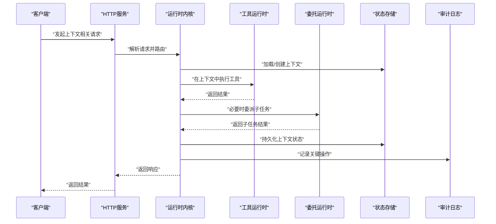
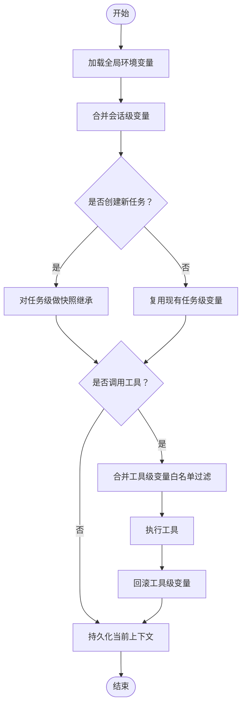
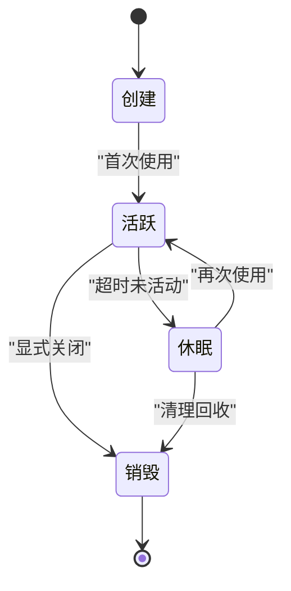
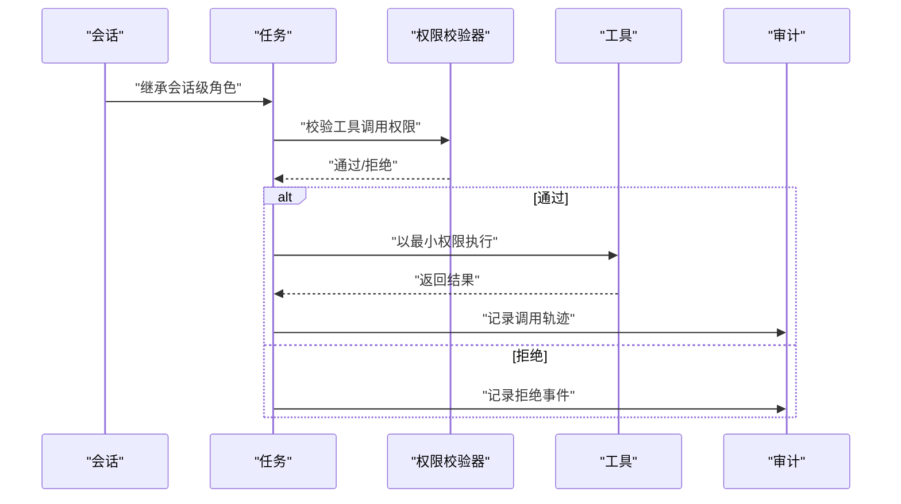
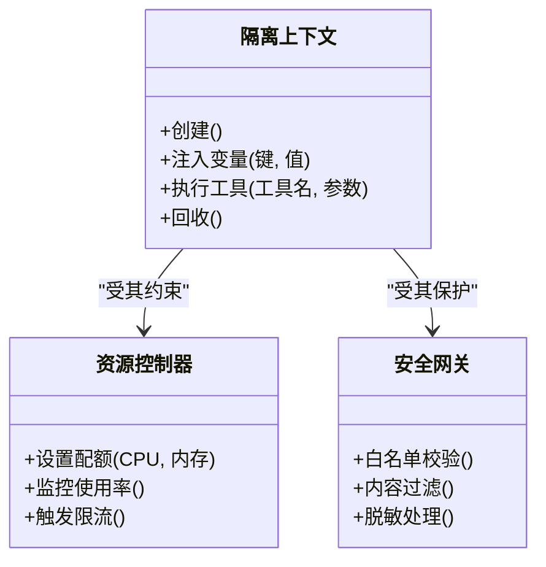
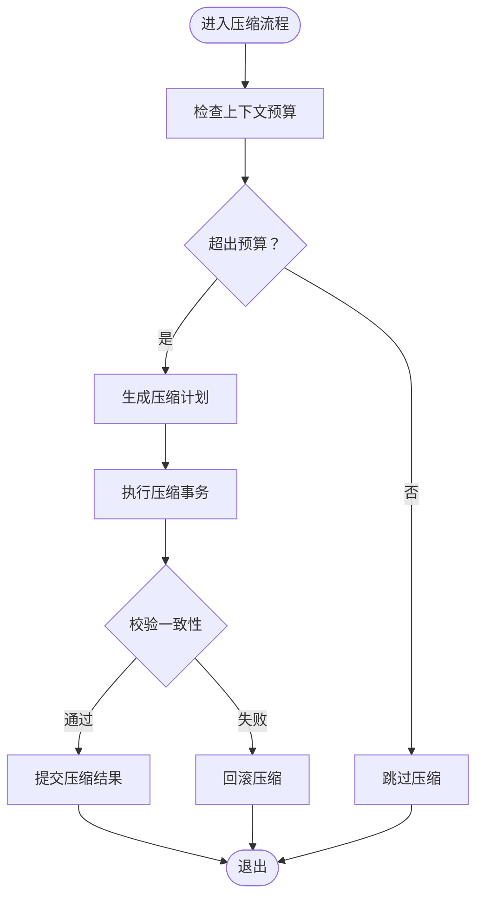
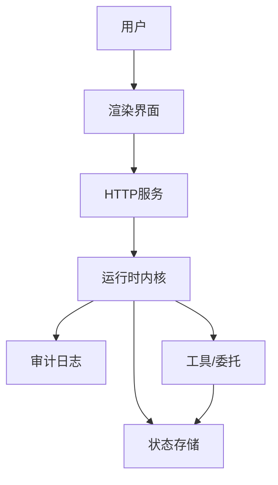
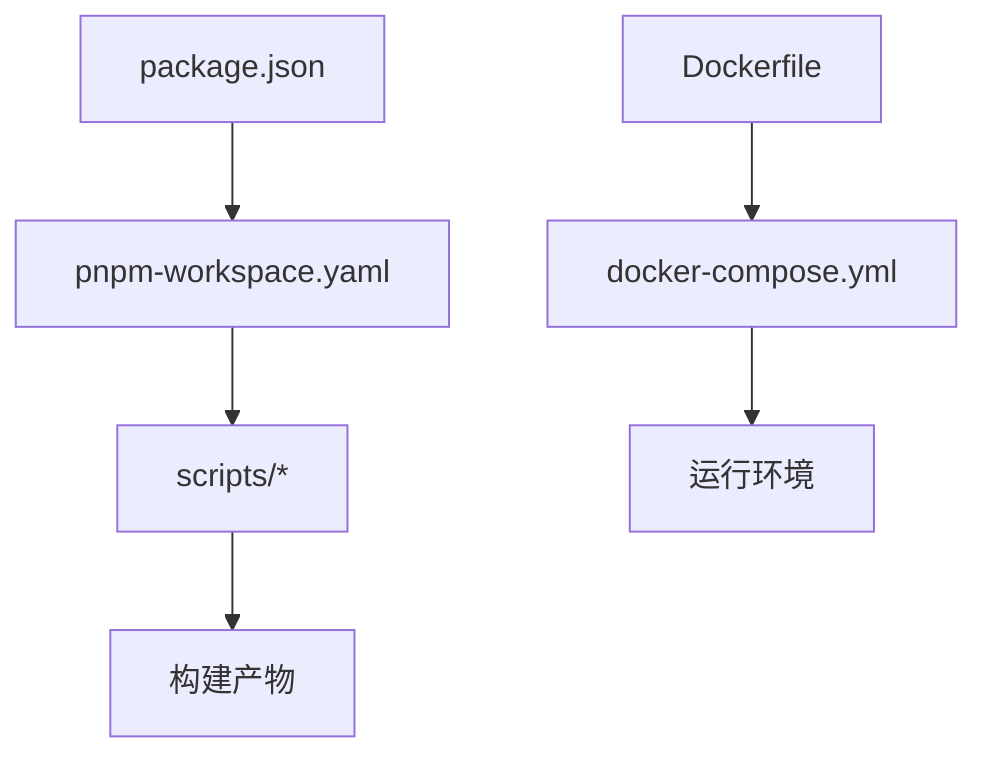

# 执行上下文管理

<cite>
**本文引用的文件**   
- [engine/README.md](file://engine/README.md)
- [engine/package.json](file://engine/package.json)
- [engine/pnpm-workspace.yaml](file://engine/pnpm-workspace.yaml)
- [engine/tsconfig.json](file://engine/tsconfig.json)
- [engine/config.example.json](file://engine/config.example.json)
- [engine/Dockerfile](file://engine/Dockerfile)
- [engine/docker-compose.yml](file://engine/docker-compose.yml)
- [engine/scripts/build.mjs](file://engine/scripts/build.mjs)
- [engine/scripts/migrate-packages.mjs](file://engine/scripts/migrate-packages.mjs)
- [engine/scripts/scaffold-packages.mjs](file://engine/scripts/scaffold-packages.mjs)
- [engine/tests/runtime-kernel-isolation.test.ts](file://engine/tests/runtime-kernel-isolation.test.ts)
- [engine/tests/task-context-recovery.test.ts](file://engine/tests/task-context-recovery.test.ts)
- [engine/tests/file-session-store.test.ts](file://engine/tests/file-session-store.test.ts)
- [engine/tests/run-state-store.test.ts](file://engine/tests/run-state-store.test.ts)
- [engine/tests/tool-runtime-v3.test.ts](file://engine/tests/tool-runtime-v3.test.ts)
- [engine/tests/delegation-runtime.test.ts](file://engine/tests/delegation-runtime.test.ts)
- [engine/tests/turn-state-store.test.ts](file://engine/tests/turn-state-store.test.ts)
- [engine/tests/memory-store.test.ts](file://engine/tests/memory-store.test.ts)
- [engine/tests/hybrid-store.test.ts](file://engine/tests/hybrid-store.test.ts)
- [engine/tests/compaction-governor.test.ts](file://engine/tests/compaction-governor.test.ts)
- [engine/tests/context-compactor.test.ts](file://engine/tests/context-compactor.test.ts)
- [engine/tests/command-audit.test.ts](file://engine/tests/command-audit.test.ts)
- [engine/tests/http-server.test.ts](file://engine/tests/http-server.test.ts)
- [engine/tests/runtime-kernel-e2e.test.ts](file://engine/tests/runtime-kernel-e2e.test.ts)
</cite>

## 目录
1. [简介](#简介)
2. [项目结构](#项目结构)
3. [核心组件](#核心组件)
4. [架构总览](#架构总览)
5. [详细组件分析](#详细组件分析)
6. [依赖分析](#依赖分析)
7. [性能考虑](#性能考虑)
8. [故障排查指南](#故障排查指南)
9. [结论](#结论)
10. [附录](#附录)

## 简介
本技术文档聚焦于KCoder引擎侧的执行上下文管理系统，围绕以下目标展开：
- 环境变量传递机制：作用域、继承与动态更新
- 用户会话管理：生命周期、状态持久化与并发访问控制
- 权限信息传递：角色继承、权限验证与审计日志
- 上下文隔离：沙箱环境、资源限制与安全边界
- 上下文切换的性能优化与调试技巧

为便于读者快速定位，文档在关键章节末尾提供“章节来源”，并在涉及具体代码结构的图表中标注“图表来源”。

## 项目结构
KCoder采用多包工作区组织，引擎核心位于 engine/packages 下，测试用例集中于 engine/tests。与执行上下文相关的主题主要分布在运行时内核、任务与会话存储、工具运行时、委托运行时以及HTTP服务层等模块中。

```mermaid
graph TB
subgraph "引擎根"
A["engine/README.md"]
B["engine/package.json"]
C["engine/pnpm-workspace.yaml"]
D["engine/tsconfig.json"]
E["engine/config.example.json"]
F["engine/Dockerfile"]
G["engine/docker-compose.yml"]
H["engine/scripts/*"]
end
subgraph "测试覆盖与上下文相关"
T1["runtime-kernel-isolation.test.ts"]
T2["task-context-recovery.test.ts"]
T3["file-session-store.test.ts"]
T4["run-state-store.test.ts"]
T5["tool-runtime-v3.test.ts"]
T6["delegation-runtime.test.ts"]
T7["turn-state-store.test.ts"]
T8["memory-store.test.ts"]
T9["hybrid-store.test.ts"]
T10["compaction-governor.test.ts"]
T11["context-compactor.test.ts"]
T12["command-audit.test.ts"]
T13["http-server.test.ts"]
T14["runtime-kernel-e2e.test.ts"]
end
A --> T1
B --> T3
C --> T5
D --> T6
E --> T7
F --> T8
G --> T9
H --> T10
A --> T11
B --> T12
C --> T13
D --> T14
```

图表来源
- [engine/README.md](file://engine/README.md)
- [engine/package.json](file://engine/package.json)
- [engine/pnpm-workspace.yaml](file://engine/pnpm-workspace.yaml)
- [engine/tsconfig.json](file://engine/tsconfig.json)
- [engine/config.example.json](file://engine/config.example.json)
- [engine/Dockerfile](file://engine/Dockerfile)
- [engine/docker-compose.yml](file://engine/docker-compose.yml)
- [engine/scripts/build.mjs](file://engine/scripts/build.mjs)
- [engine/tests/runtime-kernel-isolation.test.ts](file://engine/tests/runtime-kernel-isolation.test.ts)
- [engine/tests/task-context-recovery.test.ts](file://engine/tests/task-context-recovery.test.ts)
- [engine/tests/file-session-store.test.ts](file://engine/tests/file-session-store.test.ts)
- [engine/tests/run-state-store.test.ts](file://engine/tests/run-state-store.test.ts)
- [engine/tests/tool-runtime-v3.test.ts](file://engine/tests/tool-runtime-v3.test.ts)
- [engine/tests/delegation-runtime.test.ts](file://engine/tests/delegation-runtime.test.ts)
- [engine/tests/turn-state-store.test.ts](file://engine/tests/turn-state-store.test.ts)
- [engine/tests/memory-store.test.ts](file://engine/tests/memory-store.test.ts)
- [engine/tests/hybrid-store.test.ts](file://engine/tests/hybrid-store.test.ts)
- [engine/tests/compaction-governor.test.ts](file://engine/tests/compaction-governor.test.ts)
- [engine/tests/context-compactor.test.ts](file://engine/tests/context-compactor.test.ts)
- [engine/tests/command-audit.test.ts](file://engine/tests/command-audit.test.ts)
- [engine/tests/http-server.test.ts](file://engine/tests/http-server.test.ts)
- [engine/tests/runtime-kernel-e2e.test.ts](file://engine/tests/runtime-kernel-e2e.test.ts)

章节来源
- [engine/README.md](file://engine/README.md)
- [engine/package.json](file://engine/package.json)
- [engine/pnpm-workspace.yaml](file://engine/pnpm-workspace.yaml)
- [engine/tsconfig.json](file://engine/tsconfig.json)
- [engine/config.example.json](file://engine/config.example.json)
- [engine/Dockerfile](file://engine/Dockerfile)
- [engine/docker-compose.yml](file://engine/docker-compose.yml)
- [engine/scripts/build.mjs](file://engine/scripts/build.mjs)

## 核心组件
围绕执行上下文管理，系统由以下核心能力组成：
- 运行时内核与上下文隔离：负责创建、隔离与回收执行上下文，确保不同任务/会话之间的环境与状态互不干扰
- 任务与会话状态存储：提供持久化与恢复能力，保障上下文在进程重启或异常后仍可恢复
- 工具运行时与委托运行时：在执行上下文中调用工具与子代理，支持权限与资源的细粒度控制
- 轮次状态与压缩治理：维护对话轮次上下文并实施压缩策略，平衡上下文长度与性能
- HTTP服务与审计：对外暴露上下文操作接口，记录关键操作的审计日志

章节来源
- [engine/tests/runtime-kernel-isolation.test.ts](file://engine/tests/runtime-kernel-isolation.test.ts)
- [engine/tests/task-context-recovery.test.ts](file://engine/tests/task-context-recovery.test.ts)
- [engine/tests/file-session-store.test.ts](file://engine/tests/file-session-store.test.ts)
- [engine/tests/run-state-store.test.ts](file://engine/tests/run-state-store.test.ts)
- [engine/tests/tool-runtime-v3.test.ts](file://engine/tests/tool-runtime-v3.test.ts)
- [engine/tests/delegation-runtime.test.ts](file://engine/tests/delegation-runtime.test.ts)
- [engine/tests/turn-state-store.test.ts](file://engine/tests/turn-state-store.test.ts)
- [engine/tests/compaction-governor.test.ts](file://engine/tests/compaction-governor.test.ts)
- [engine/tests/context-compactor.test.ts](file://engine/tests/context-compactor.test.ts)
- [engine/tests/command-audit.test.ts](file://engine/tests/command-audit.test.ts)
- [engine/tests/http-server.test.ts](file://engine/tests/http-server.test.ts)

## 架构总览
下图展示了执行上下文在系统中的流转路径：从HTTP入口到内核调度，再到工具/委托执行，最后落盘至状态存储，并通过审计与压缩治理进行闭环。

图表来源
- [engine/tests/http-server.test.ts](file://engine/tests/http-server.test.ts)
- [engine/tests/runtime-kernel-e2e.test.ts](file://engine/tests/runtime-kernel-e2e.test.ts)
- [engine/tests/tool-runtime-v3.test.ts](file://engine/tests/tool-runtime-v3.test.ts)
- [engine/tests/delegation-runtime.test.ts](file://engine/tests/delegation-runtime.test.ts)
- [engine/tests/run-state-store.test.ts](file://engine/tests/run-state-store.test.ts)
- [engine/tests/command-audit.test.ts](file://engine/tests/command-audit.test.ts)

## 详细组件分析

### 环境变量与作用域管理
- 作用域层次
  - 全局级：来自配置与环境注入的默认变量
  - 会话级：随用户会话创建而绑定，跨轮次保持
  - 任务级：任务启动时继承会话级，并可局部覆盖
  - 工具级：工具执行期间临时注入，执行结束后自动清理
- 继承规则
  - 自顶向下继承：全局→会话→任务→工具
  - 显式覆盖优先：更内层作用域的键会覆盖外层同名键
  - 白名单过滤：仅允许受控键进入工具作用域，避免敏感泄露
- 动态更新
  - 会话级可在运行期追加/删除键值
  - 任务级在创建时快照继承，后续变更不影响已存在任务
  - 工具级在每次调用前合并，调用后回滚

图表来源
- [engine/tests/runtime-kernel-isolation.test.ts](file://engine/tests/runtime-kernel-isolation.test.ts)
- [engine/tests/tool-runtime-v3.test.ts](file://engine/tests/tool-runtime-v3.test.ts)
- [engine/tests/task-context-recovery.test.ts](file://engine/tests/task-context-recovery.test.ts)

章节来源
- [engine/tests/runtime-kernel-isolation.test.ts](file://engine/tests/runtime-kernel-isolation.test.ts)
- [engine/tests/tool-runtime-v3.test.ts](file://engine/tests/tool-runtime-v3.test.ts)
- [engine/tests/task-context-recovery.test.ts](file://engine/tests/task-context-recovery.test.ts)

### 用户会话管理与持久化
- 生命周期
  - 创建：初始化会话ID、基础上下文、权限基线
  - 活跃：承载任务与轮次，支持上下文增量更新
  - 休眠：长时间无活动可冻结以减少资源占用
  - 销毁：释放资源并归档必要审计数据
- 状态持久化
  - 会话级状态写入文件/混合存储，保证进程重启后可恢复
  - 轮次级状态独立落盘，支持回放与断点续跑
- 并发访问控制
  - 读写锁/队列化写操作，避免竞态导致的状态不一致
  - 读多写少场景下采用快照读取，提升吞吐

图表来源
- [engine/tests/file-session-store.test.ts](file://engine/tests/file-session-store.test.ts)
- [engine/tests/run-state-store.test.ts](file://engine/tests/run-state-store.test.ts)
- [engine/tests/turn-state-store.test.ts](file://engine/tests/turn-state-store.test.ts)

章节来源
- [engine/tests/file-session-store.test.ts](file://engine/tests/file-session-store.test.ts)
- [engine/tests/run-state-store.test.ts](file://engine/tests/run-state-store.test.ts)
- [engine/tests/turn-state-store.test.ts](file://engine/tests/turn-state-store.test.ts)

### 权限信息传递与审计
- 角色继承
  - 会话级角色作为基线，任务级可提升或缩小权限范围
  - 工具级按最小权限原则注入，仅包含所需能力
- 权限验证
  - 在工具调用前进行鉴权检查，拒绝越权操作
  - 对敏感操作进行二次校验与审批流（可选）
- 审计日志
  - 记录关键上下文变更、权限授予与工具调用轨迹
  - 支持按会话/任务维度检索与导出

图表来源
- [engine/tests/command-audit.test.ts](file://engine/tests/command-audit.test.ts)
- [engine/tests/tool-runtime-v3.test.ts](file://engine/tests/tool-runtime-v3.test.ts)
- [engine/tests/delegation-runtime.test.ts](file://engine/tests/delegation-runtime.test.ts)

章节来源
- [engine/tests/command-audit.test.ts](file://engine/tests/command-audit.test.ts)
- [engine/tests/tool-runtime-v3.test.ts](file://engine/tests/tool-runtime-v3.test.ts)
- [engine/tests/delegation-runtime.test.ts](file://engine/tests/delegation-runtime.test.ts)

### 上下文隔离与安全边界
- 沙箱环境
  - 每个任务拥有独立的变量与作用域，防止跨任务污染
  - 工具执行在受限环境中运行，限制系统调用与网络访问
- 资源限制
  - CPU/内存配额与超时控制，避免单任务拖垮整体
  - I/O速率限制与磁盘配额，保护宿主稳定性
- 安全边界
  - 输入输出白名单与内容过滤
  - 敏感信息脱敏与最小可见性原则

图表来源
- [engine/tests/runtime-kernel-isolation.test.ts](file://engine/tests/runtime-kernel-isolation.test.ts)
- [engine/tests/tool-runtime-v3.test.ts](file://engine/tests/tool-runtime-v3.test.ts)

章节来源
- [engine/tests/runtime-kernel-isolation.test.ts](file://engine/tests/runtime-kernel-isolation.test.ts)
- [engine/tests/tool-runtime-v3.test.ts](file://engine/tests/tool-runtime-v3.test.ts)

### 上下文切换与压缩治理
- 上下文切换
  - 切换前保存当前轮次快照，切换后按需加载历史摘要
  - 使用惰性加载减少冷启动开销
- 压缩治理
  - 基于策略的上下文压缩，保留关键语义与决策依据
  - 压缩事务保证一致性，失败可回滚

图表来源
- [engine/tests/compaction-governor.test.ts](file://engine/tests/compaction-governor.test.ts)
- [engine/tests/context-compactor.test.ts](file://engine/tests/context-compactor.test.ts)

章节来源
- [engine/tests/compaction-governor.test.ts](file://engine/tests/compaction-governor.test.ts)
- [engine/tests/context-compactor.test.ts](file://engine/tests/context-compactor.test.ts)

### 概念性概览
下图展示一个典型的用户交互到上下文落盘的端到端流程，帮助非技术读者理解上下文在系统中的位置与职责。

[此图为概念性流程图，无需图表来源]

## 依赖分析
- 包与工作区
  - 多包工作区定义与脚本构建流程影响上下文模块的编译与发布
- 外部集成
  - Docker与Compose用于容器化部署，隔离宿主机资源
  - HTTP服务作为上下文管理的对外入口

图表来源
- [engine/package.json](file://engine/package.json)
- [engine/pnpm-workspace.yaml](file://engine/pnpm-workspace.yaml)
- [engine/scripts/build.mjs](file://engine/scripts/build.mjs)
- [engine/Dockerfile](file://engine/Dockerfile)
- [engine/docker-compose.yml](file://engine/docker-compose.yml)

章节来源
- [engine/package.json](file://engine/package.json)
- [engine/pnpm-workspace.yaml](file://engine/pnpm-workspace.yaml)
- [engine/scripts/build.mjs](file://engine/scripts/build.mjs)
- [engine/Dockerfile](file://engine/Dockerfile)
- [engine/docker-compose.yml](file://engine/docker-compose.yml)

## 性能考虑
- 上下文快照与惰性加载：减少冷启动与切换延迟
- 压缩治理：控制上下文大小，降低模型调用成本
- 并发控制：队列化写操作，避免频繁落盘导致的阻塞
- 资源配额：CPU/内存/IO限额，防止热点任务抢占资源
- 缓存策略：对只读上下文片段进行缓存，提高读取性能

[本节为通用指导，无需章节来源]

## 故障排查指南
- 常见问题
  - 上下文丢失：检查会话/任务状态存储是否成功落盘与恢复
  - 权限拒绝：核对角色继承链与工具级最小权限注入
  - 性能抖动：关注压缩治理与资源配额是否触发限流
- 诊断手段
  - 启用审计日志，按会话/任务维度检索关键操作
  - 使用隔离测试用例复现问题，确认作用域与继承规则
  - 结合HTTP服务测试，验证端到端链路

章节来源
- [engine/tests/command-audit.test.ts](file://engine/tests/command-audit.test.ts)
- [engine/tests/runtime-kernel-isolation.test.ts](file://engine/tests/runtime-kernel-isolation.test.ts)
- [engine/tests/http-server.test.ts](file://engine/tests/http-server.test.ts)

## 结论
KCoder的执行上下文管理通过分层作用域、严格的权限与审计、完善的持久化与压缩治理，实现了高可靠、高隔离、高性能的运行环境。建议在工程实践中遵循最小权限、快照与惰性加载、以及压缩事务一致性的最佳实践，以获得稳定且高效的上下文体验。

[本节为总结性内容，无需章节来源]

## 附录
- 配置参考
  - 示例配置文件用于设定默认上下文行为与资源配额
- 构建与部署
  - 构建脚本与工作区配置决定上下文模块的打包与分发
  - Docker与Compose提供容器化隔离与编排能力

章节来源
- [engine/config.example.json](file://engine/config.example.json)
- [engine/scripts/build.mjs](file://engine/scripts/build.mjs)
- [engine/Dockerfile](file://engine/Dockerfile)
- [engine/docker-compose.yml](file://engine/docker-compose.yml)