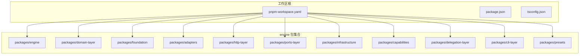
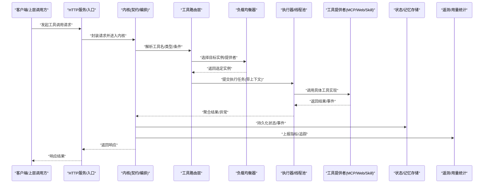
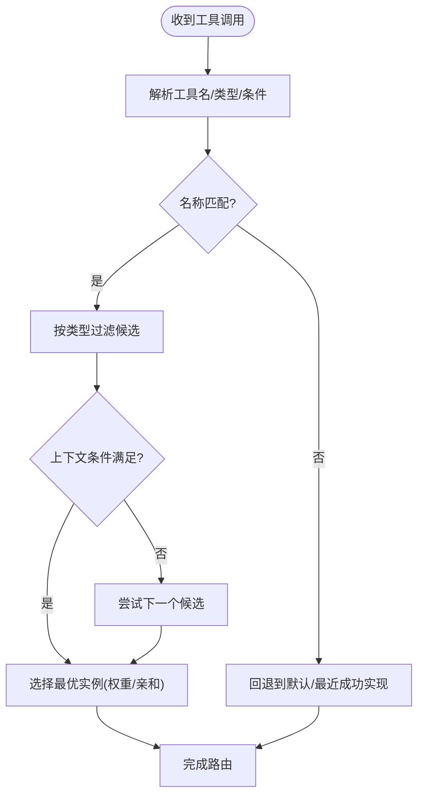
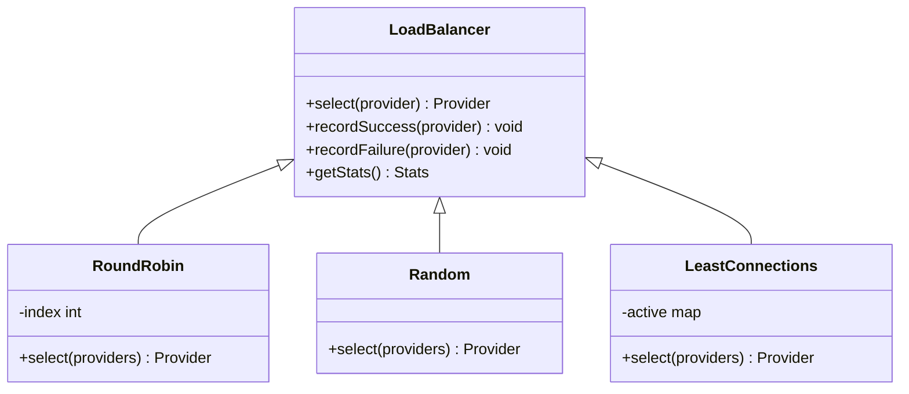
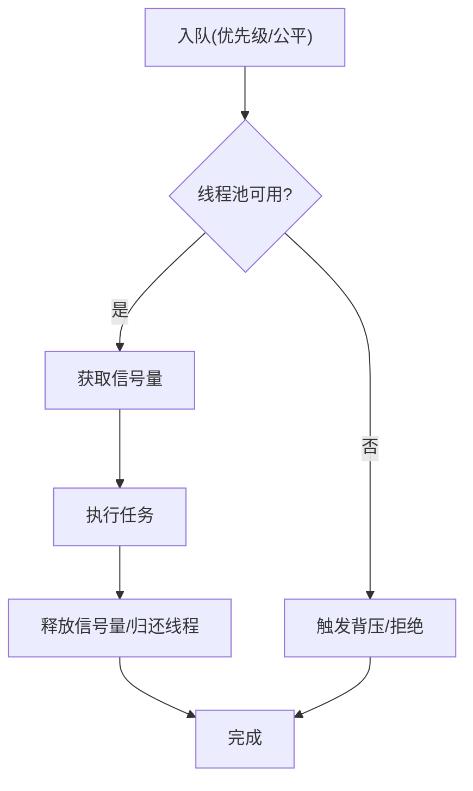
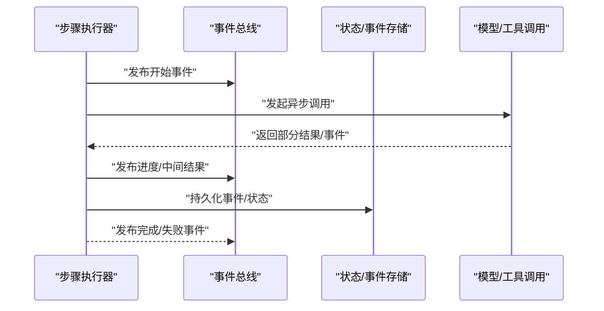
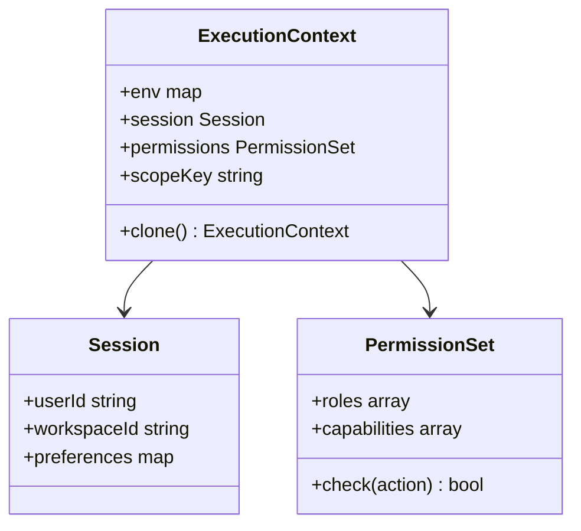
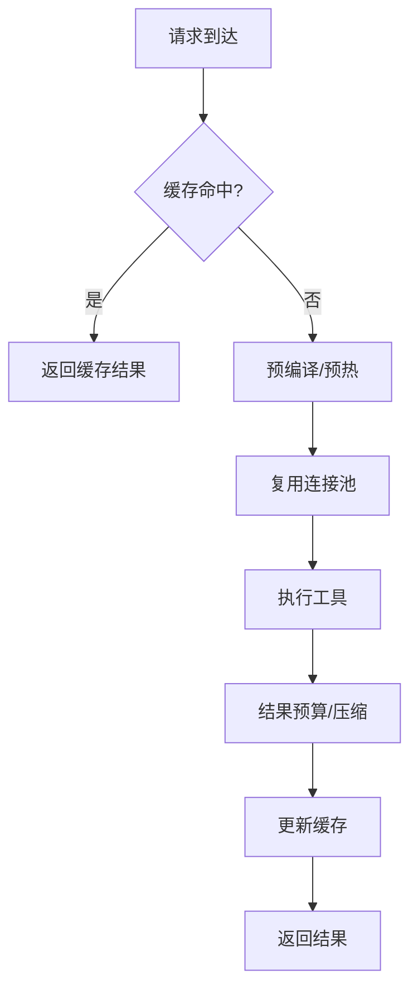
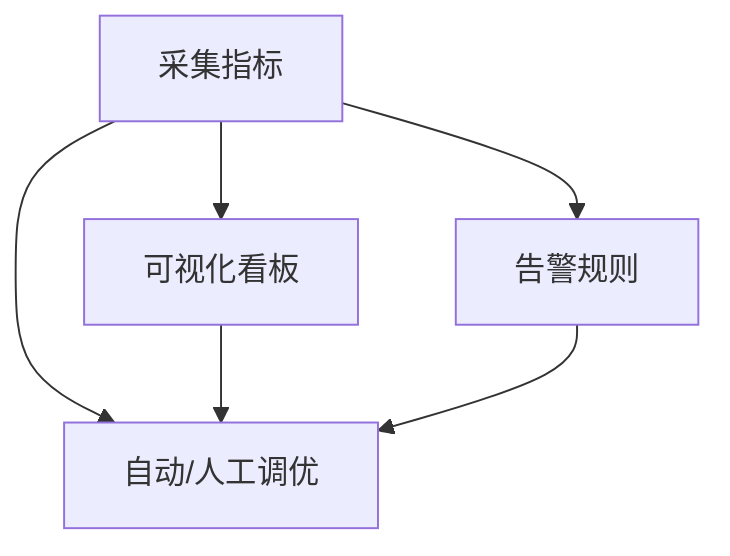
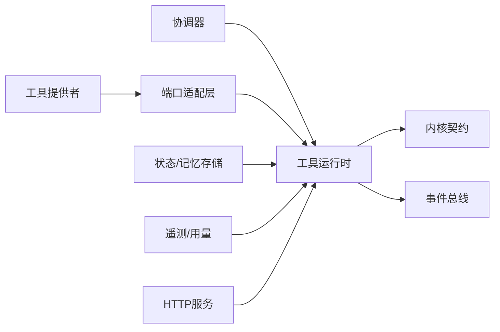

# 执行调度与路由

<cite>
**本文引用的文件**   
- [engine/README.md](file://engine/README.md)
- [engine/package.json](file://engine/package.json)
- [engine/pnpm-workspace.yaml](file://engine/pnpm-workspace.yaml)
- [engine/tsconfig.json](file://engine/tsconfig.json)
- [engine/tests/tool-runtime-v3.test.ts](file://engine/tests/tool-runtime-v3.test.ts)
- [engine/tests/tool-coordinator-runtime.test.ts](file://engine/tests/tool-coordinator-runtime.test.ts)
- [engine/tests/tool-dispatch-errors.test.ts](file://engine/tests/tool-dispatch-errors.test.ts)
- [engine/tests/tool-storm-breaker.test.ts](file://engine/tests/tool-storm-breaker.test.ts)
- [engine/tests/runtime-kernel-contracts.test.ts](file://engine/tests/runtime-kernel-contracts.test.ts)
- [engine/tests/runtime-kernel-isolation.test.ts](file://engine/tests/runtime-kernel-isolation.test.ts)
- [engine/tests/runtime-kernel-provider-matrix.test.ts](file://engine/tests/runtime-kernel-provider-matrix.test.ts)
- [engine/tests/runtime-kernel-e2e.test.ts](file://engine/tests/runtime-kernel-e2e.test.ts)
- [engine/tests/runtime-kernel-crash-recovery.test.ts](file://engine/tests/runtime-kernel-crash-recovery.test.ts)
- [engine/tests/runtime-kernel-after-middleware.test.ts](file://engine/tests/runtime-kernel-after-middleware.test.ts)
- [engine/tests/runtime-kernel-budget.test.ts](file://engine/tests/runtime-kernel-budget.test.ts)
- [engine/tests/runtime-kernel-replay.test.ts](file://engine/tests/runtime-kernel-replay.test.ts)
- [engine/tests/runtime-kernel-parity.test.ts](file://engine/tests/runtime-kernel-parity.test.ts)
- [engine/tests/tool-call-repair.test.ts](file://engine/tests/tool-call-repair.test.ts)
- [engine/tests/mcp-tool-provider.test.ts](file://engine/tests/mcp-tool-provider.test.ts)
- [engine/tests/web-tool-provider.test.ts](file://engine/tests/web-tool-provider.test.ts)
- [engine/tests/skill-tool-provider.test.ts](file://engine/tests/skill-tool-provider.test.ts)
- [engine/tests/http-server.test.ts](file://engine/tests/http-server.test.ts)
- [engine/tests/http-peer-transport.test.ts](file://engine/tests/http-peer-transport.test.ts)
- [engine/tests/execution-graph.test.ts](file://engine/tests/execution-graph.test.ts)
- [engine/tests/turn-event-bus.test.ts](file://engine/tests/turn-event-bus.test.ts)
- [engine/tests/evented-loop.test.ts](file://engine/tests/evented-loop.test.ts)
- [engine/tests/file-mutation-queue.test.ts](file://engine/tests/file-mutation-queue.test.ts)
- [engine/tests/steering-queue-isolation.test.ts](file://engine/tests/steering-queue-isolation.test.ts)
- [engine/tests/context-compactor.test.ts](file://engine/tests/context-compactor.test.ts)
- [engine/tests/memory-store.test.ts](file://engine/tests/memory-store.test.ts)
- [engine/tests/run-state-store.test.ts](file://engine/tests/run-state-store.test.ts)
- [engine/tests/task-state-store.test.ts](file://engine/tests/task-state-store.test.ts)
- [engine/tests/durable-task-capsule.test.ts](file://engine/tests/durable-task-capsule.test.ts)
- [engine/tests/loop-runner.test.ts](file://engine/tests/loop-runner.test.ts)
- [engine/tests/loop-governor.test.ts](file://engine/tests/loop-governor.test.ts)
- [engine/tests/compaction-governor.test.ts](file://engine/tests/compaction-governor.test.ts)
- [engine/tests/token-economy.test.ts](file://engine/tests/token-economy.test.ts)
- [engine/tests/model-step-runner.test.ts](file://engine/tests/model-step-runner.test.ts)
- [engine/tests/model-client.test.ts](file://engine/tests/model-client.test.ts)
- [engine/tests/capability-registry.test.ts](file://engine/tests/capability-registry.test.ts)
- [engine/tests/capabilities.test.ts](file://engine/tests/capabilities.test.ts)
- [engine/tests/delegation-runtime.test.ts](file://engine/tests/delegation-runtime.test.ts)
- [engine/tests/delegation-terminal-state.test.ts](file://engine/tests/delegation-terminal-state.test.ts)
- [engine/tests/plugin-host.test.ts](file://engine/tests/plugin-host.test.ts)
- [engine/tests/skill-command-registry.test.ts](file://engine/tests/skill-command-registry.test.ts)
- [engine/tests/skill-runtime.test.ts](file://engine/tests/skill-runtime.test.ts)
- [engine/tests/work-mode-skill-runtime.test.ts](file://engine/tests/work-mode-skill-runtime.test.ts)
- [engine/tests/manifest.test.ts](file://engine/tests/manifest.test.ts)
- [engine/tests/marketplace.test.ts](file://engine/tests/marketplace.test.ts)
- [engine/tests/builtin-tools.test.ts](file://engine/tests/builtin-tools.test.ts)
- [engine/tests/builtin-tool-utils.test.ts](file://engine/tests/builtin-tool-utils.test.ts)
- [engine/tests/tool-result-budget.test.ts](file://engine/tests/tool-result-budget.test.ts)
- [engine/tests/output-accumulator.test.ts](file://engine/tests/output-accumulator.test.ts)
- [engine/tests/usage-service.test.ts](file://engine/tests/usage-service.test.ts)
- [engine/tests/opentelemetry.test.ts](file://engine/tests/opentelemetry.test.ts)
- [engine/tests/http-artifacts.test.ts](file://engine/tests/http-artifacts.test.ts)
- [engine/tests/cache.test.ts](file://engine/tests/cache.test.ts)
- [engine/tests/contracts.test.ts](file://engine/tests/contracts.test.ts)
- [engine/tests/ports.test.ts](file://engine/tests/ports.test.ts)
- [engine/tests/virtual-path.test.ts](file://engine/tests/virtual-path.test.ts)
- [engine/tests/attachment-store.test.ts](file://engine/tests/attachment-store.test.ts)
- [engine/tests/atomic-write.test.ts](file://engine/tests/atomic-write.test.ts)
- [engine/tests/file-session-store.test.ts](file://engine/tests/file-session-store.test.ts)
- [engine/tests/file-session-store-integration.test.ts](file://engine/tests/file-session-store-integration.test.ts)
- [engine/tests/hybrid-store.test.ts](file://engine/tests/hybrid-store.test.ts)
- [engine/tests/memory-retrieval.test.ts](file://engine/tests/memory-retrieval.test.ts)
- [engine/tests/proposal-classifier.test.ts](file://engine/tests/proposal-classifier.test.ts)
- [engine/tests/provider-compatibility.test.ts](file://engine/tests/provider-compatibility.test.ts)
- [engine/tests/qiongqi-config.test.ts](file://engine/tests/qiongqi-config.test.ts)
- [engine/tests/read-json-body.test.ts](file://engine/tests/read-json-body.test.ts)
- [engine/tests/request-history-hygiene.test.ts](file://engine/tests/request-history-hygiene.test.ts)
- [engine/tests/review.test.ts](file://engine/tests/review.test.ts)
- [engine/tests/run-event-store.test.ts](file://engine/tests/run-event-store.test.ts)
- [engine/tests/runtime-event-projection.test.ts](file://engine/tests/runtime-event-projection.test.ts)
- [engine/tests/runtime-event-recorder-kernel.test.ts](file://engine/tests/runtime-event-recorder-kernel.test.ts)
- [engine/tests/runtime-event-reducer.test.ts](file://engine/tests/runtime-event-reducer.test.ts)
- [engine/tests/runtime-factory-rollout.test.ts](file://engine/tests/runtime-factory-rollout.test.ts)
- [engine/tests/runtime-factory.test.ts](file://engine/tests/runtime-factory.test.ts)
- [engine/tests/scope-key.test.ts](file://engine/tests/scope-key.test.ts)
- [engine/tests/serve.test.ts](file://engine/tests/serve.test.ts)
- [engine/tests/thread-service.test.ts](file://engine/tests/thread-service.test.ts)
- [engine/tests/todo-tools.test.ts](file://engine/tests/todo-tools.test.ts)
- [engine/tests/tool-runtime-v3.test.ts](file://engine/tests/tool-runtime-v3.test.ts)
</cite>

## 目录
1. [简介](#简介)
2. [项目结构](#项目结构)
3. [核心组件](#核心组件)
4. [架构总览](#架构总览)
5. [详细组件分析](#详细组件分析)
6. [依赖关系分析](#依赖关系分析)
7. [性能考量](#性能考量)
8. [故障排查指南](#故障排查指南)
9. [结论](#结论)
10. [附录](#附录)

## 简介
本技术文档聚焦于KCoder引擎的执行调度与路由系统，围绕工具调用路由算法、负载均衡机制、并发控制、异步执行模型、执行上下文传递、性能优化策略以及监控指标与调优建议展开。文档基于仓库中的测试用例与工程配置进行归纳与解读，旨在为开发者与维护者提供可操作的参考。

## 项目结构
KCoder采用多包工作区组织方式，核心能力位于 engine 目录下，通过 pnpm workspace 管理多个子包（如 adapters、capabilities、cli-layer、delegation-layer、domain-layer、engine、foundation、http-layer、infrastructure、ports-layer、presets）。测试覆盖广泛，涵盖工具运行时、内核契约、事件总线、持久化、流式处理、MCP/Web/Skill 工具提供者、HTTP 服务、遥测与缓存等。

图表来源
- [engine/pnpm-workspace.yaml](file://engine/pnpm-workspace.yaml)
- [engine/package.json](file://engine/package.json)
- [engine/tsconfig.json](file://engine/tsconfig.json)

章节来源
- [engine/README.md](file://engine/README.md)
- [engine/package.json](file://engine/package.json)
- [engine/pnpm-workspace.yaml](file://engine/pnpm-workspace.yaml)
- [engine/tsconfig.json](file://engine/tsconfig.json)

## 核心组件
- 工具运行时与协调器：负责工具发现、参数校验、结果预算与错误修复，支撑 v3 工具运行时与协调器生命周期。
- 内核契约与隔离：定义内核对外暴露的接口契约，保障不同运行环境下的行为一致性与隔离性。
- 事件总线与有界循环：以事件驱动为核心，结合“回合”概念组织执行流程，支持回放与幂等。
- 执行图与循环治理：将复杂任务建模为执行图，配合循环治理器避免无限循环与风暴。
- 工具风暴熔断：在高频工具调用场景下实施限流与熔断，保护系统稳定性。
- MCP/Web/Skill 工具提供者：统一抽象外部工具接入点，屏蔽底层差异。
- HTTP 服务与对等传输：提供进程内/进程间通信能力，承载远程工具与服务发现。
- 上下文与状态存储：包括会话、任务状态、运行状态、记忆检索与持久化。
- 遥测与使用统计：OpenTelemetry 集成与用量统计，用于监控与成本治理。

章节来源
- [engine/tests/tool-runtime-v3.test.ts](file://engine/tests/tool-runtime-v3.test.ts)
- [engine/tests/tool-coordinator-runtime.test.ts](file://engine/tests/tool-coordinator-runtime.test.ts)
- [engine/tests/runtime-kernel-contracts.test.ts](file://engine/tests/runtime-kernel-contracts.test.ts)
- [engine/tests/runtime-kernel-isolation.test.ts](file://engine/tests/runtime-kernel-isolation.test.ts)
- [engine/tests/turn-event-bus.test.ts](file://engine/tests/turn-event-bus.test.ts)
- [engine/tests/evented-loop.test.ts](file://engine/tests/evented-loop.test.ts)
- [engine/tests/execution-graph.test.ts](file://engine/tests/execution-graph.test.ts)
- [engine/tests/loop-governor.test.ts](file://engine/tests/loop-governor.test.ts)
- [engine/tests/tool-storm-breaker.test.ts](file://engine/tests/tool-storm-breaker.test.ts)
- [engine/tests/mcp-tool-provider.test.ts](file://engine/tests/mcp-tool-provider.test.ts)
- [engine/tests/web-tool-provider.test.ts](file://engine/tests/web-tool-provider.test.ts)
- [engine/tests/skill-tool-provider.test.ts](file://engine/tests/skill-tool-provider.test.ts)
- [engine/tests/http-server.test.ts](file://engine/tests/http-server.test.ts)
- [engine/tests/http-peer-transport.test.ts](file://engine/tests/http-peer-transport.test.ts)
- [engine/tests/memory-store.test.ts](file://engine/tests/memory-store.test.ts)
- [engine/tests/run-state-store.test.ts](file://engine/tests/run-state-store.test.ts)
- [engine/tests/task-state-store.test.ts](file://engine/tests/task-state-store.test.ts)
- [engine/tests/durable-task-capsule.test.ts](file://engine/tests/durable-task-capsule.test.ts)
- [engine/tests/memory-retrieval.test.ts](file://engine/tests/memory-retrieval.test.ts)
- [engine/tests/opentelemetry.test.ts](file://engine/tests/opentelemetry.test.ts)
- [engine/tests/usage-service.test.ts](file://engine/tests/usage-service.test.ts)

## 架构总览
下图展示了从请求入口到工具执行与结果回传的端到端路径，包含路由、负载均衡、并发控制、上下文传递与监控埋点的关键环节。

图表来源
- [engine/tests/http-server.test.ts](file://engine/tests/http-server.test.ts)
- [engine/tests/runtime-kernel-contracts.test.ts](file://engine/tests/runtime-kernel-contracts.test.ts)
- [engine/tests/tool-runtime-v3.test.ts](file://engine/tests/tool-runtime-v3.test.ts)
- [engine/tests/tool-coordinator-runtime.test.ts](file://engine/tests/tool-coordinator-runtime.test.ts)
- [engine/tests/mcp-tool-provider.test.ts](file://engine/tests/mcp-tool-provider.test.ts)
- [engine/tests/web-tool-provider.test.ts](file://engine/tests/web-tool-provider.test.ts)
- [engine/tests/skill-tool-provider.test.ts](file://engine/tests/skill-tool-provider.test.ts)
- [engine/tests/run-state-store.test.ts](file://engine/tests/run-state-store.test.ts)
- [engine/tests/opentelemetry.test.ts](file://engine/tests/opentelemetry.test.ts)
- [engine/tests/usage-service.test.ts](file://engine/tests/usage-service.test.ts)

## 详细组件分析

### 工具调用路由算法
- 基于名称的路由：根据工具标识符精确匹配注册表项，优先命中同名实现。
- 基于类型的路由：当存在多个同名工具时，依据工具类型或能力标签选择最合适的实现。
- 条件路由：结合上下文（用户角色、权限、租户、工作模式）与动态策略（权重、亲和性、地域）决定最终目标。
- 失败回退与重试：在路由不可用或超时情况下，按策略切换备选实现或降级至默认实现。

图表来源
- [engine/tests/tool-runtime-v3.test.ts](file://engine/tests/tool-runtime-v3.test.ts)
- [engine/tests/tool-coordinator-runtime.test.ts](file://engine/tests/tool-coordinator-runtime.test.ts)
- [engine/tests/tool-dispatch-errors.test.ts](file://engine/tests/tool-dispatch-errors.test.ts)
- [engine/tests/tool-call-repair.test.ts](file://engine/tests/tool-call-repair.test.ts)

章节来源
- [engine/tests/tool-runtime-v3.test.ts](file://engine/tests/tool-runtime-v3.test.ts)
- [engine/tests/tool-coordinator-runtime.test.ts](file://engine/tests/tool-coordinator-runtime.test.ts)
- [engine/tests/tool-dispatch-errors.test.ts](file://engine/tests/tool-dispatch-errors.test.ts)
- [engine/tests/tool-call-repair.test.ts](file://engine/tests/tool-call-repair.test.ts)

### 负载均衡机制
- 轮询：按顺序分配请求，适合均匀负载场景。
- 随机：随机选择实例，降低热点风险。
- 最少连接：选择当前活跃连接数最少的实例，提升吞吐与延迟表现。
- 加权与亲和：结合权重与亲和规则，保证特定上下文稳定落盘到同一实例。

图表来源
- [engine/tests/tool-runtime-v3.test.ts](file://engine/tests/tool-runtime-v3.test.ts)
- [engine/tests/tool-coordinator-runtime.test.ts](file://engine/tests/tool-coordinator-runtime.test.ts)

章节来源
- [engine/tests/tool-runtime-v3.test.ts](file://engine/tests/tool-runtime-v3.test.ts)
- [engine/tests/tool-coordinator-runtime.test.ts](file://engine/tests/tool-coordinator-runtime.test.ts)

### 并发控制实现
- 线程池管理：限制并发度，避免资源耗尽；支持按工具类别划分队列与池大小。
- 信号量控制：对高代价操作（I/O、外部网络）加锁，确保全局上限。
- 队列调度：优先级队列与公平队列并存，关键任务优先，普通任务排队等待。
- 背压与限流：在下游过载时主动降速，防止雪崩。

图表来源
- [engine/tests/tool-runtime-v3.test.ts](file://engine/tests/tool-runtime-v3.test.ts)
- [engine/tests/tool-coordinator-runtime.test.ts](file://engine/tests/tool-coordinator-runtime.test.ts)
- [engine/tests/steering-queue-isolation.test.ts](file://engine/tests/steering-queue-isolation.test.ts)

章节来源
- [engine/tests/tool-runtime-v3.test.ts](file://engine/tests/tool-runtime-v3.test.ts)
- [engine/tests/tool-coordinator-runtime.test.ts](file://engine/tests/tool-coordinator-runtime.test.ts)
- [engine/tests/steering-queue-isolation.test.ts](file://engine/tests/steering-queue-isolation.test.ts)

### 异步执行模型
- Promise 链式调用：将工具调用、结果处理、错误恢复串联成清晰链路。
- 事件驱动架构：以“回合”为单位组织事件流，支持回放与幂等重建。
- 流式处理：对长耗时任务采用增量输出，提高交互体验与可观测性。

图表来源
- [engine/tests/evented-loop.test.ts](file://engine/tests/evented-loop.test.ts)
- [engine/tests/turn-event-bus.test.ts](file://engine/tests/turn-event-bus.test.ts)
- [engine/tests/runtime-event-projection.test.ts](file://engine/tests/runtime-event-projection.test.ts)
- [engine/tests/runtime-event-reducer.test.ts](file://engine/tests/runtime-event-reducer.test.ts)
- [engine/tests/run-event-store.test.ts](file://engine/tests/run-event-store.test.ts)

章节来源
- [engine/tests/evented-loop.test.ts](file://engine/tests/evented-loop.test.ts)
- [engine/tests/turn-event-bus.test.ts](file://engine/tests/turn-event-bus.test.ts)
- [engine/tests/runtime-event-projection.test.ts](file://engine/tests/runtime-event-projection.test.ts)
- [engine/tests/runtime-event-reducer.test.ts](file://engine/tests/runtime-event-reducer.test.ts)
- [engine/tests/run-event-store.test.ts](file://engine/tests/run-event-store.test.ts)

### 执行上下文传递
- 环境变量：跨层注入配置与开关，影响路由与执行策略。
- 用户会话：携带身份、偏好与工作空间信息，参与条件路由与权限判定。
- 权限信息：基于角色/能力矩阵进行访问控制，未授权请求直接拒绝。
- 作用域键：通过作用域键隔离不同租户/会话的数据与状态。

图表来源
- [engine/tests/scope-key.test.ts](file://engine/tests/scope-key.test.ts)
- [engine/tests/runtime-kernel-isolation.test.ts](file://engine/tests/runtime-kernel-isolation.test.ts)
- [engine/tests/runtime-kernel-provider-matrix.test.ts](file://engine/tests/runtime-kernel-provider-matrix.test.ts)

章节来源
- [engine/tests/scope-key.test.ts](file://engine/tests/scope-key.test.ts)
- [engine/tests/runtime-kernel-isolation.test.ts](file://engine/tests/runtime-kernel-isolation.test.ts)
- [engine/tests/runtime-kernel-provider-matrix.test.ts](file://engine/tests/runtime-kernel-provider-matrix.test.ts)

### 性能优化策略
- 缓存机制：对只读工具与查询类操作启用多级缓存，减少重复计算与外部调用。
- 预编译：对模板/脚本类工具进行预编译，缩短首次执行时间。
- 连接池：复用外部服务连接，降低握手开销与内存抖动。
- 结果预算与压缩：限制结果体积，避免大对象阻塞通道；必要时分片输出。
- 上下文压缩：定期压缩上下文窗口，保持长期对话的可扩展性。

图表来源
- [engine/tests/cache.test.ts](file://engine/tests/cache.test.ts)
- [engine/tests/context-compactor.test.ts](file://engine/tests/context-compactor.test.ts)
- [engine/tests/tool-result-budget.test.ts](file://engine/tests/tool-result-budget.test.ts)

章节来源
- [engine/tests/cache.test.ts](file://engine/tests/cache.test.ts)
- [engine/tests/context-compactor.test.ts](file://engine/tests/context-compactor.test.ts)
- [engine/tests/tool-result-budget.test.ts](file://engine/tests/tool-result-budget.test.ts)

### 监控指标与调优建议
- 关键指标：
  - 路由命中率、平均/分位延迟、错误率、重试次数
  - 并发度、队列长度、背压触发次数
  - 缓存命中率、连接池利用率、结果大小分布
  - 用量统计（令牌/调用次数）、成本估算
- 调优建议：
  - 根据 P95/P99 延迟调整线程池大小与信号量阈值
  - 针对热点工具启用更细粒度缓存与预编译
  - 对不稳定提供者设置熔断与快速失败策略
  - 结合 OpenTelemetry 与使用统计定位瓶颈与浪费

图表来源
- [engine/tests/opentelemetry.test.ts](file://engine/tests/opentelemetry.test.ts)
- [engine/tests/usage-service.test.ts](file://engine/tests/usage-service.test.ts)

章节来源
- [engine/tests/opentelemetry.test.ts](file://engine/tests/opentelemetry.test.ts)
- [engine/tests/usage-service.test.ts](file://engine/tests/usage-service.test.ts)

## 依赖关系分析
- 内部依赖：
  - 工具运行时依赖内核契约与事件总线，协调器负责编排与治理。
  - 工具提供者（MCP/Web/Skill）通过端口层适配，统一暴露接口。
  - 状态与记忆存储被内核与执行器共享，保障一致性与可恢复性。
- 外部依赖：
  - HTTP 服务与对等传输用于进程内外通信。
  - OpenTelemetry 与用量服务用于可观测性与成本控制。

图表来源
- [engine/tests/tool-runtime-v3.test.ts](file://engine/tests/tool-runtime-v3.test.ts)
- [engine/tests/tool-coordinator-runtime.test.ts](file://engine/tests/tool-coordinator-runtime.test.ts)
- [engine/tests/runtime-kernel-contracts.test.ts](file://engine/tests/runtime-kernel-contracts.test.ts)
- [engine/tests/turn-event-bus.test.ts](file://engine/tests/turn-event-bus.test.ts)
- [engine/tests/mcp-tool-provider.test.ts](file://engine/tests/mcp-tool-provider.test.ts)
- [engine/tests/web-tool-provider.test.ts](file://engine/tests/web-tool-provider.test.ts)
- [engine/tests/skill-tool-provider.test.ts](file://engine/tests/skill-tool-provider.test.ts)
- [engine/tests/run-state-store.test.ts](file://engine/tests/run-state-store.test.ts)
- [engine/tests/opentelemetry.test.ts](file://engine/tests/opentelemetry.test.ts)
- [engine/tests/usage-service.test.ts](file://engine/tests/usage-service.test.ts)
- [engine/tests/http-server.test.ts](file://engine/tests/http-server.test.ts)

章节来源
- [engine/tests/tool-runtime-v3.test.ts](file://engine/tests/tool-runtime-v3.test.ts)
- [engine/tests/tool-coordinator-runtime.test.ts](file://engine/tests/tool-coordinator-runtime.test.ts)
- [engine/tests/runtime-kernel-contracts.test.ts](file://engine/tests/runtime-kernel-contracts.test.ts)
- [engine/tests/turn-event-bus.test.ts](file://engine/tests/turn-event-bus.test.ts)
- [engine/tests/mcp-tool-provider.test.ts](file://engine/tests/mcp-tool-provider.test.ts)
- [engine/tests/web-tool-provider.test.ts](file://engine/tests/web-tool-provider.test.ts)
- [engine/tests/skill-tool-provider.test.ts](file://engine/tests/skill-tool-provider.test.ts)
- [engine/tests/run-state-store.test.ts](file://engine/tests/run-state-store.test.ts)
- [engine/tests/opentelemetry.test.ts](file://engine/tests/opentelemetry.test.ts)
- [engine/tests/usage-service.test.ts](file://engine/tests/usage-service.test.ts)
- [engine/tests/http-server.test.ts](file://engine/tests/http-server.test.ts)

## 性能考量
- 合理设置并发与队列容量，避免过度竞争导致抖动。
- 对冷启动敏感的工具启用预热与懒加载。
- 使用连接池与缓存减少外部依赖开销。
- 对大结果进行分片与压缩，降低序列化与传输成本。
- 结合遥测数据持续优化路由与负载均衡策略。

[本节为通用指导，不直接分析具体文件]

## 故障排查指南
- 路由失败：检查工具注册表、名称/类型匹配与条件表达式是否正确。
- 超时与熔断：查看熔断器状态与重试策略，确认下游健康度。
- 并发拥塞：观察线程池饱和与队列积压，适当扩容或引入背压。
- 上下文泄漏：验证作用域键与会话隔离是否生效。
- 状态不一致：通过事件回放与快照恢复定位问题。

章节来源
- [engine/tests/tool-dispatch-errors.test.ts](file://engine/tests/tool-dispatch-errors.test.ts)
- [engine/tests/tool-storm-breaker.test.ts](file://engine/tests/tool-storm-breaker.test.ts)
- [engine/tests/runtime-kernel-crash-recovery.test.ts](file://engine/tests/runtime-kernel-crash-recovery.test.ts)
- [engine/tests/runtime-kernel-replay.test.ts](file://engine/tests/runtime-kernel-replay.test.ts)
- [engine/tests/runtime-kernel-after-middleware.test.ts](file://engine/tests/runtime-kernel-after-middleware.test.ts)
- [engine/tests/runtime-kernel-budget.test.ts](file://engine/tests/runtime-kernel-budget.test.ts)

## 结论
KCoder 的执行调度与路由系统以内核契约为中心，结合事件驱动与执行图编排，实现了灵活的工具路由、稳健的负载均衡与可控的并发执行。通过上下文传递、缓存与连接池等优化手段，系统在可扩展性与性能之间取得平衡。借助遥测与用量统计，运维团队可持续监控与调优，保障在高负载与复杂条件下的稳定性与效率。

[本节为总结性内容，不直接分析具体文件]

## 附录
- 术语说明：
  - 工具：可被内核调用的功能单元，可能来自 MCP/Web/Skill 等提供者。
  - 回合：一次完整交互的生命周期，包含若干步骤与事件。
  - 执行图：描述任务依赖与执行顺序的有向无环图。
- 相关测试用例索引：
  - 工具运行时与协调器：tool-runtime-v3.test.ts、tool-coordinator-runtime.test.ts
  - 内核契约与隔离：runtime-kernel-contracts.test.ts、runtime-kernel-isolation.test.ts
  - 事件与回放：turn-event-bus.test.ts、evented-loop.test.ts、runtime-event-reducer.test.ts、run-event-store.test.ts
  - 执行图与循环治理：execution-graph.test.ts、loop-governor.test.ts、loop-runner.test.ts
  - 风暴熔断与错误处理：tool-storm-breaker.test.ts、tool-dispatch-errors.test.ts、tool-call-repair.test.ts
  - 工具提供者：mcp-tool-provider.test.ts、web-tool-provider.test.ts、skill-tool-provider.test.ts
  - HTTP 与传输：http-server.test.ts、http-peer-transport.test.ts
  - 状态与记忆：run-state-store.test.ts、task-state-store.test.ts、memory-store.test.ts、memory-retrieval.test.ts
  - 遥测与用量：opentelemetry.test.ts、usage-service.test.ts
  - 缓存与压缩：cache.test.ts、context-compactor.test.ts、tool-result-budget.test.ts

[本节为索引性内容，不直接分析具体文件]