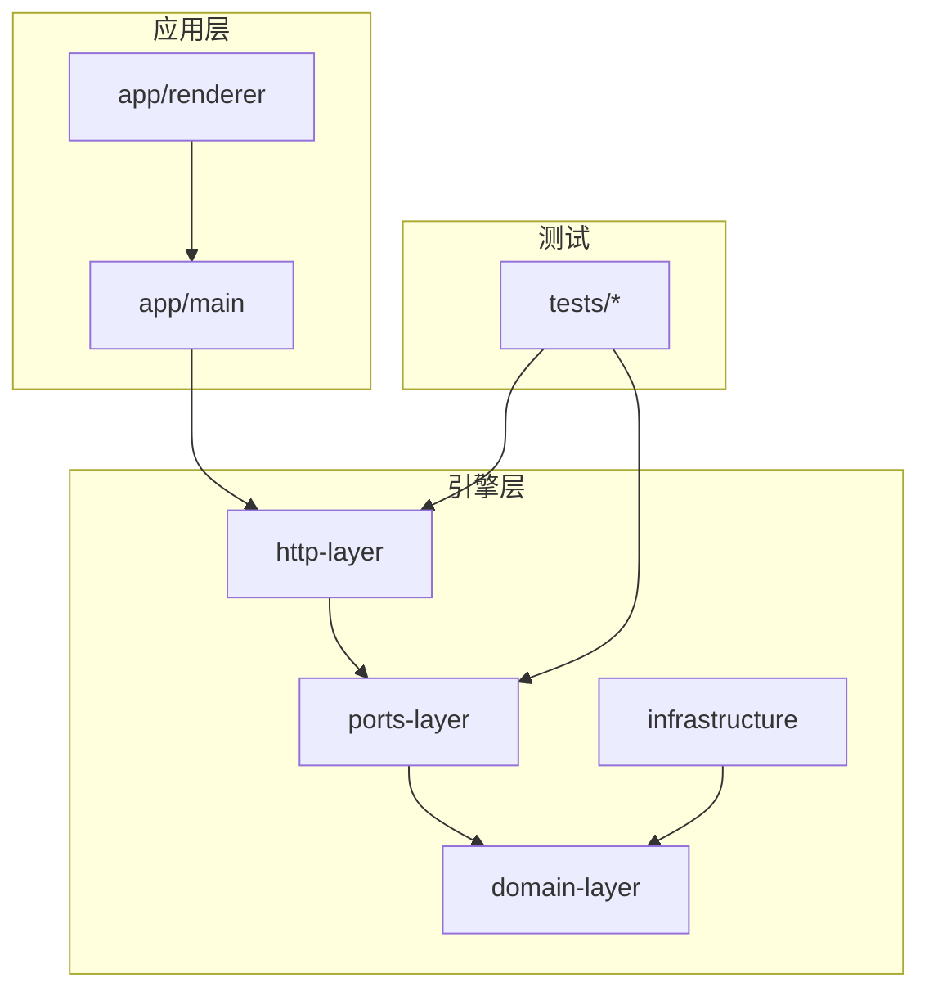
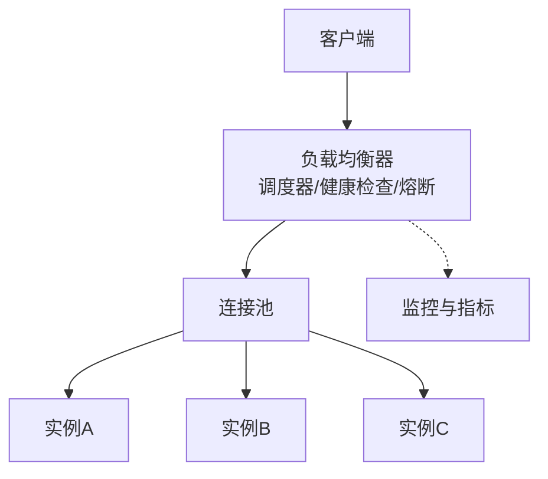
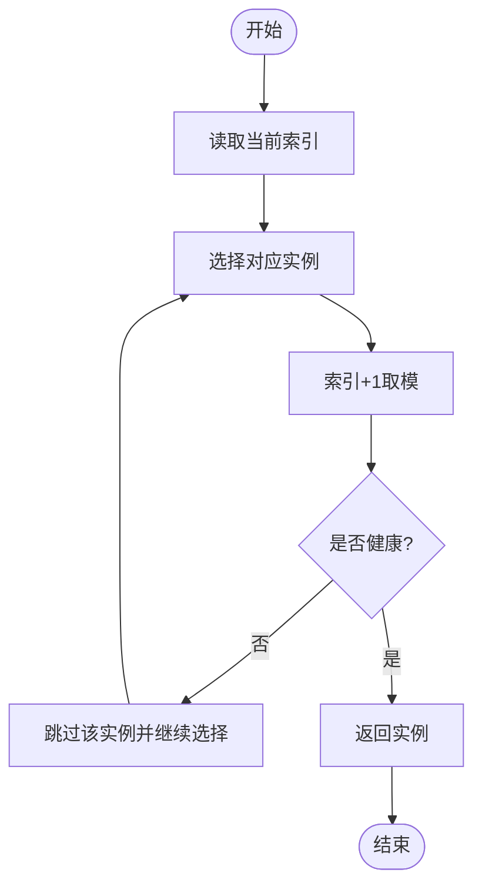
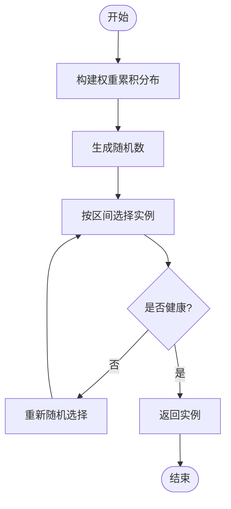
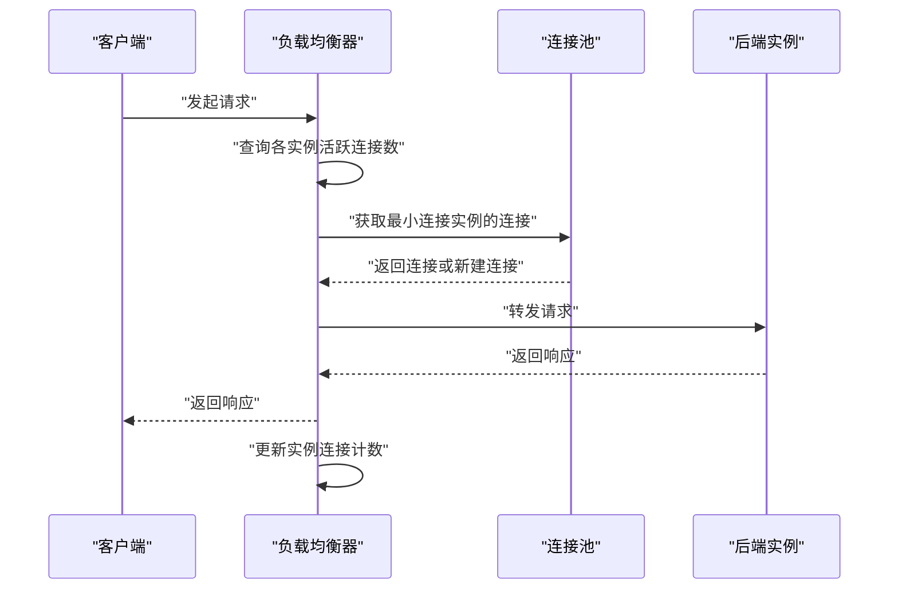
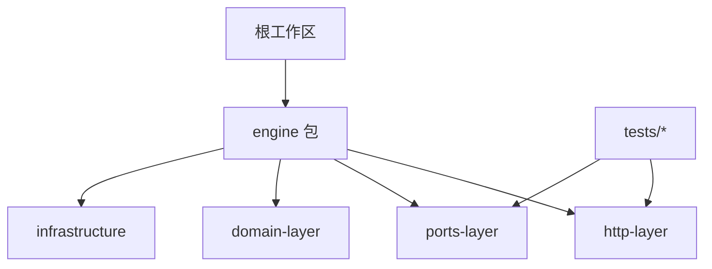

# 负载均衡机制

<cite>
**本文引用的文件**   
- [engine/README.md](file://engine/README.md)
- [engine/config.example.json](file://engine/config.example.json)
- [engine/package.json](file://engine/package.json)
- [engine/pnpm-workspace.yaml](file://engine/pnpm-workspace.yaml)
- [engine/tests/http-server.test.ts](file://engine/tests/http-server.test.ts)
- [engine/tests/http-server-test-harness.ts](file://engine/tests/http-server-test-harness.ts)
- [engine/tests/runtime-kernel-provider-matrix.test.ts](file://engine/tests/runtime-kernel-provider-matrix.test.ts)
</cite>

## 目录
1. [简介](#简介)
2. [项目结构](#项目结构)
3. [核心组件](#核心组件)
4. [架构总览](#架构总览)
5. [详细组件分析](#详细组件分析)
6. [依赖关系分析](#依赖关系分析)
7. [性能考虑](#性能考虑)
8. [故障排查指南](#故障排查指南)
9. [结论](#结论)
10. [附录](#附录)

## 简介
本技术文档聚焦于KCoder的负载均衡机制，围绕轮询、随机与最少连接三类策略进行系统化说明。内容涵盖状态维护、权重分配、健康检查、连接池管理、实时统计与动态调整等关键主题，并给出配置项（超时、重试、熔断）建议、性能调优方法与监控指标定义。由于仓库中未直接提供负载均衡实现源码，本文以工程结构与测试用例为依据，结合通用实践给出可落地的设计与落地指引，帮助读者在现有代码基础上扩展或集成合适的负载均衡能力。

## 项目结构
从仓库结构看，KCoder采用多包工作区组织，引擎层位于 engine 目录，包含多个子包（如 http-layer、ports-layer、domain-layer、infrastructure 等），以及大量测试用例。负载均衡相关能力通常应落在网络/传输层或服务发现与路由层，例如 http-layer 或 ports-layer；同时，测试用例提供了服务端行为验证的参考路径。

图表来源
- [engine/README.md:1-200](file://engine/README.md#L1-L200)
- [engine/pnpm-workspace.yaml:1-200](file://engine/pnpm-workspace.yaml#L1-L200)

章节来源
- [engine/README.md:1-200](file://engine/README.md#L1-L200)
- [engine/pnpm-workspace.yaml:1-200](file://engine/pnpm-workspace.yaml#L1-L200)

## 核心组件
本节概述负载均衡器应具备的核心组件与职责边界：
- 服务注册表与健康检查：维护后端实例清单、存活状态、权重与容量信息。
- 调度器：实现轮询、随机、最少连接等算法，选择目标实例。
- 连接池与复用：对下游连接进行池化与复用，降低握手开销。
- 限流与熔断：基于错误率、延迟阈值与半开探测进行快速失败与恢复。
- 观测与度量：暴露关键指标用于监控与告警。

这些组件的职责划分有助于将负载均衡逻辑与业务处理解耦，便于替换与扩展。

章节来源
- [engine/tests/http-server.test.ts:1-200](file://engine/tests/http-server.test.ts#L1-L200)
- [engine/tests/http-server-test-harness.ts:1-200](file://engine/tests/http-server-test-harness.ts#L1-L200)

## 架构总览
下图展示了一个概念性的负载均衡架构，适用于KCoder的HTTP请求分发场景。客户端通过负载均衡器访问后端实例集群，负载均衡器根据策略选择具体实例，并通过连接池复用连接，同时执行健康检查与熔断控制。

[此图为概念性架构图，不直接映射到具体源文件，故无图表来源]

## 详细组件分析

### 轮询算法（Round Robin）
- 状态维护
  - 当前索引指针：记录下一次选择的实例位置。
  - 实例列表：按权重展开后的“虚拟节点”序列，以实现加权轮询。
  - 可选：每实例最近一次被选中的时间戳，用于辅助健康检查与退避。
- 权重分配
  - 支持静态权重（配置）与动态权重（基于健康度/延迟反馈）。
  - 权重归一化后生成虚拟节点序列，保证高权重实例获得更高命中概率。
- 健康检查
  - 主动探测：周期性发起轻量探测请求，失败则标记为不健康并从可用集合剔除。
  - 被动探测：基于响应码与延迟阈值，连续失败达到阈值后降级。
- 复杂度与并发
  - 选择操作 O(1)，更新指针原子递增。
  - 并发安全可通过原子变量或锁保护指针与权重变更。
- 适用场景
  - 实例能力相近且流量稳定时效果最佳。
  - 配合权重可实现灰度发布与渐进式放量。

[此流程图展示通用轮询选择流程，不直接映射到具体源文件，故无图表来源]

章节来源
- [engine/tests/http-server.test.ts:1-200](file://engine/tests/http-server.test.ts#L1-L200)
- [engine/tests/http-server-test-harness.ts:1-200](file://engine/tests/http-server-test-harness.ts#L1-L200)

### 随机负载均衡（Random）
- 均匀分布
  - 从可用实例集合中等概率随机选取。
  - 适合实例数量较少且能力相近的场景。
- 加权随机
  - 依据权重构建累积分布区间，按随机数落入区间选择实例。
  - 支持动态权重调整，实现流量再平衡。
- 避免热点
  - 引入抖动因子或指数回退，降低突发流量导致的局部热点。
  - 结合健康检查剔除异常实例，减少雪崩风险。
- 复杂度与并发
  - 选择操作 O(1)，需要维护可用集合与权重数组。
  - 并发安全需保护集合与权重更新。

[此流程图展示加权随机选择流程，不直接映射到具体源文件，故无图表来源]

章节来源
- [engine/tests/http-server.test.ts:1-200](file://engine/tests/http-server.test.ts#L1-L200)
- [engine/tests/http-server-test-harness.ts:1-200](file://engine/tests/http-server-test-harness.ts#L1-L200)

### 最少连接算法（Least Connections）
- 连接池管理
  - 维护每个实例的活跃连接计数与空闲连接队列。
  - 连接创建与释放时同步更新计数，确保统计准确。
- 实时统计
  - 使用滑动窗口或指数移动平均平滑瞬时波动。
  - 结合延迟分位数（P50/P95/P99）评估实例负载。
- 动态调整
  - 当某实例连接数超过阈值或错误率升高，临时降低其权重或暂停接入。
  - 健康检查通过后逐步恢复权重。
- 复杂度与并发
  - 选择操作通常为 O(n) 遍历最小值，或使用堆优化至 O(log n)。
  - 并发安全需保护计数器与权重更新。

[此时序图展示最少连接选择流程，不直接映射到具体源文件，故无图表来源]

章节来源
- [engine/tests/http-server.test.ts:1-200](file://engine/tests/http-server.test.ts#L1-L200)
- [engine/tests/http-server-test-harness.ts:1-200](file://engine/tests/http-server-test-harness.ts#L1-L200)

### 负载均衡器配置选项
以下为常见配置项建议，结合KCoder的工程结构可在配置中心或配置文件中进行管理：
- 超时设置
  - 连接超时：建立TCP/TLS连接的等待上限。
  - 请求超时：端到端请求处理的等待上限。
  - 健康检查间隔与超时：探测周期与单次探测超时。
- 重试策略
  - 最大重试次数与重试条件（仅幂等请求）。
  - 退避策略（固定/指数/抖动）。
- 熔断机制
  - 错误率阈值、慢调用比例阈值、半开探测次数。
  - 熔断窗口与冷却时间。
- 其他
  - 连接池大小、最大空闲连接、连接回收策略。
  - 健康检查探针类型（HTTP HEAD/GET、自定义脚本）。
  - 日志与指标输出级别。

章节来源
- [engine/config.example.json:1-200](file://engine/config.example.json#L1-L200)
- [engine/tests/http-server.test.ts:1-200](file://engine/tests/http-server.test.ts#L1-L200)

### 监控指标定义
建议暴露以下指标以便观测与告警：
- 流量与吞吐
  - 请求总量、QPS、成功率、错误率。
- 延迟
  - P50/P95/P99 延迟，按实例维度聚合。
- 连接
  - 活跃连接数、新建连接速率、连接复用率。
- 健康与熔断
  - 健康检查通过率、熔断开启次数与持续时间。
- 资源
  - CPU/内存占用、GC停顿（如适用）。

[本节为通用指标建议，不直接映射到具体源文件，故无章节来源]

## 依赖关系分析
KCoder采用pnpm工作区组织，engine目录下包含多个子包。负载均衡相关能力可能分布在网络层（http-layer）、端口适配层（ports-layer）或基础设施层（infrastructure）。测试用例覆盖了HTTP服务器行为与运行时内核的多提供者矩阵，可作为验证负载均衡行为的切入点。

图表来源
- [engine/pnpm-workspace.yaml:1-200](file://engine/pnpm-workspace.yaml#L1-L200)
- [engine/package.json:1-200](file://engine/package.json#L1-L200)

章节来源
- [engine/pnpm-workspace.yaml:1-200](file://engine/pnpm-workspace.yaml#L1-L200)
- [engine/package.json:1-200](file://engine/package.json#L1-L200)

## 性能考虑
- 算法选择
  - 低延迟优先：最少连接或加权随机。
  - 简单稳定：轮询。
- 连接复用
  - 合理设置连接池大小与空闲回收，避免频繁握手。
- 健康检查
  - 缩短探测间隔但控制探测成本，避免误判。
- 熔断与限流
  - 及时隔离异常实例，防止级联故障。
- 观测与调优
  - 基于指标定位瓶颈，逐步调整权重与阈值。

[本节为通用性能建议，不直接映射到具体源文件，故无章节来源]

## 故障排查指南
- 常见问题
  - 实例不可达：检查健康检查配置与网络连通性。
  - 热点与倾斜：观察最少连接与随机策略下的实例负载分布，必要时调整权重。
  - 熔断频繁触发：检查错误率与慢调用阈值，确认是否为上游抖动或资源不足。
- 诊断步骤
  - 查看指标：成功率、延迟分位、连接复用率、熔断状态。
  - 核对配置：超时、重试、熔断参数是否与生产环境一致。
  - 复现与回归：利用测试用例模拟异常场景，验证修复效果。

章节来源
- [engine/tests/http-server.test.ts:1-200](file://engine/tests/http-server.test.ts#L1-L200)
- [engine/tests/http-server-test-harness.ts:1-200](file://engine/tests/http-server-test-harness.ts#L1-L200)

## 结论
KCoder的负载均衡机制应在网络/端口适配层实现，结合健康检查、连接池与熔断形成闭环。轮询、随机与最少连接三种策略各有适用场景，建议在生产环境中以最少连接为主、辅以健康检查与熔断，并通过指标持续优化。由于仓库未直接提供负载均衡源码，本文基于工程结构与测试用例给出可落地的设计建议与实施路径，便于后续在相应包中扩展实现。

[本节为总结性内容，不直接映射到具体源文件，故无章节来源]

## 附录
- 参考文件
  - 引擎说明与工作区配置：[engine/README.md](file://engine/README.md)、[engine/pnpm-workspace.yaml](file://engine/pnpm-workspace.yaml)
  - 示例配置：[engine/config.example.json](file://engine/config.example.json)
  - HTTP服务器测试与测试工具：[engine/tests/http-server.test.ts](file://engine/tests/http-server.test.ts)、[engine/tests/http-server-test-harness.ts](file://engine/tests/http-server-test-harness.ts)
  - 运行时内核多提供者矩阵测试：[engine/tests/runtime-kernel-provider-matrix.test.ts](file://engine/tests/runtime-kernel-provider-matrix.test.ts)

[本节为参考信息汇总，不直接映射到具体源文件，故无章节来源]