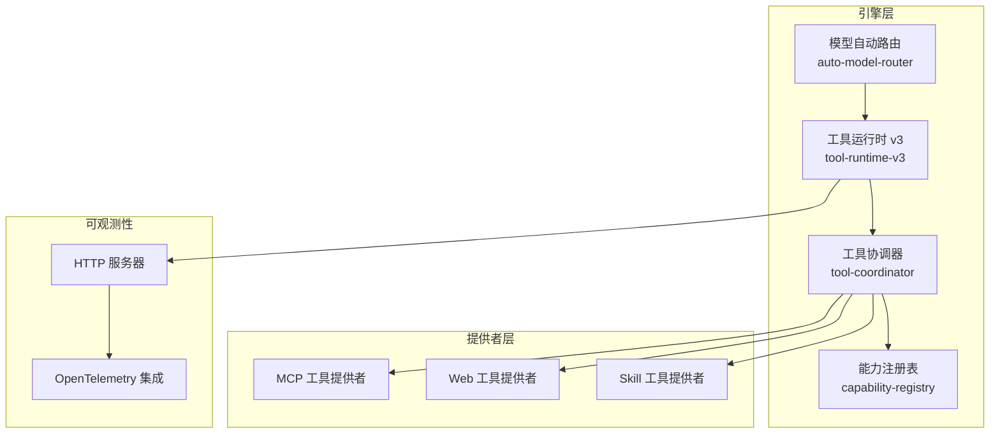
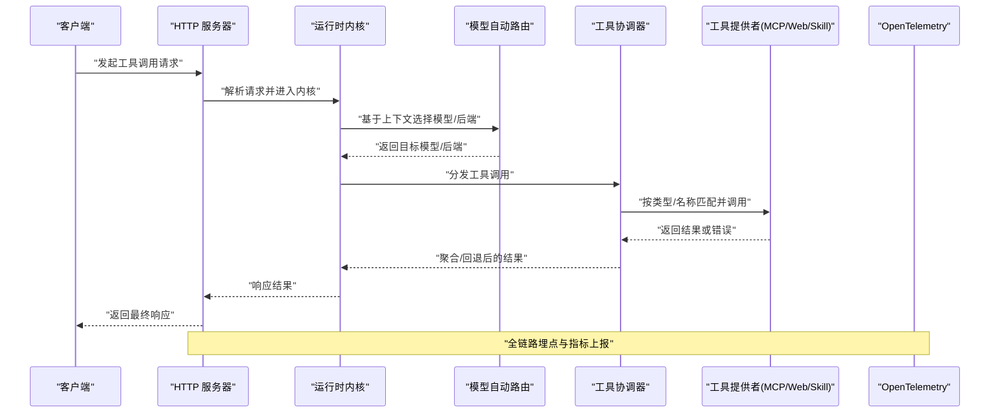
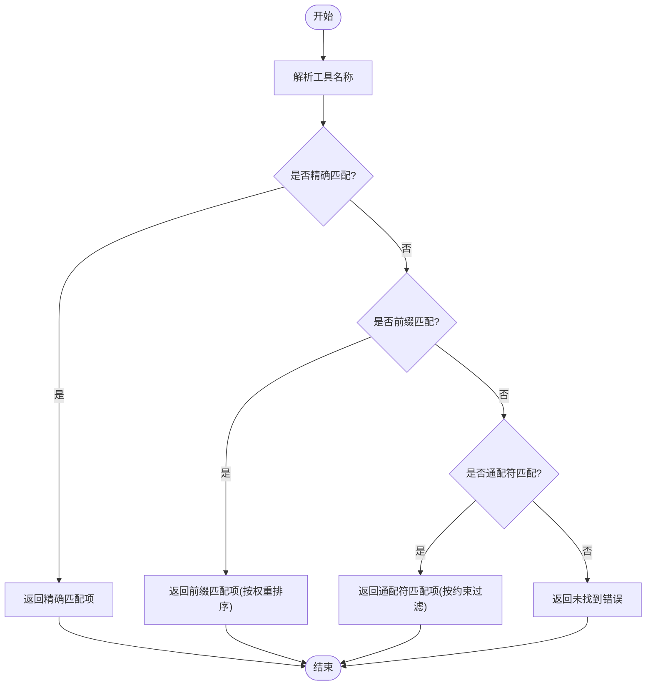
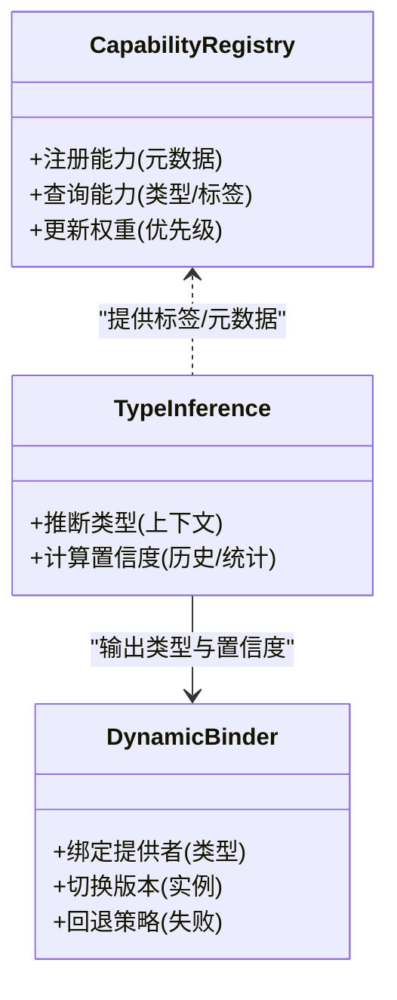
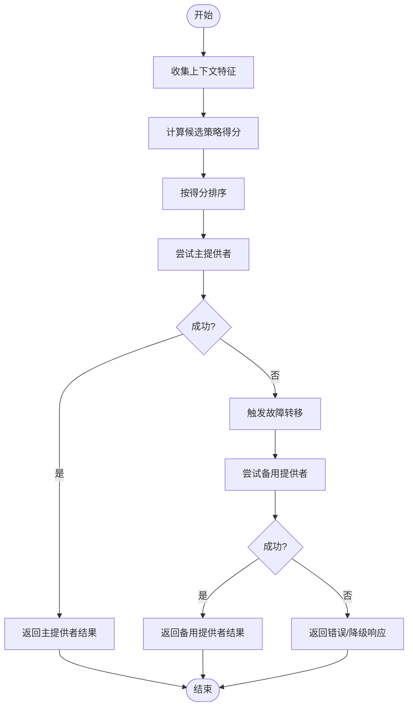
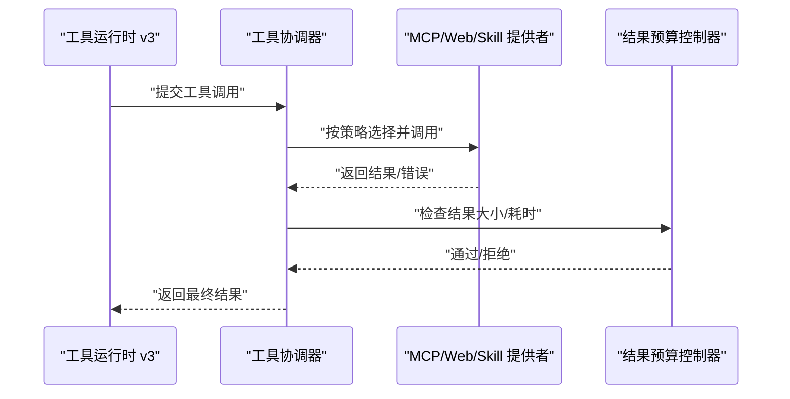
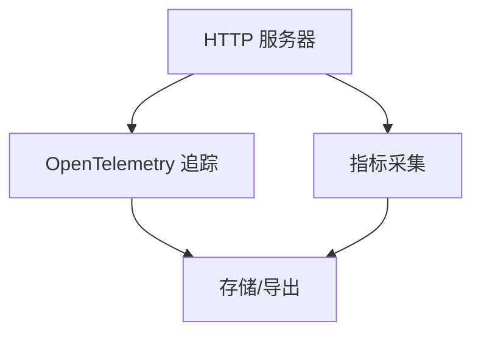
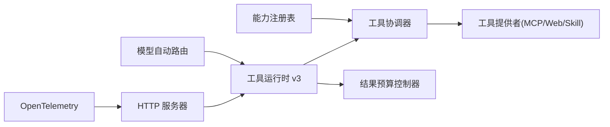

# 路由算法与策略

<cite>
**本文引用的文件**   
- [engine/README.md](file://engine/README.md)
- [engine/package.json](file://engine/package.json)
- [engine/pnpm-workspace.yaml](file://engine/pnpm-workspace.yaml)
- [engine/tsconfig.json](file://engine/tsconfig.json)
- [engine/tests/auto-model-router.test.ts](file://engine/tests/auto-model-router.test.ts)
- [engine/tests/tool-runtime-v3.test.ts](file://engine/tests/tool-runtime-v3.test.ts)
- [engine/tests/tool-coordinator-runtime.test.ts](file://engine/tests/tool-coordinator-runtime.test.ts)
- [engine/tests/tool-dispatch-errors.test.ts](file://engine/tests/tool-dispatch-errors.test.ts)
- [engine/tests/tool-result-budget.test.ts](file://engine/tests/tool-result-budget.test.ts)
- [engine/tests/mcp-tool-provider.test.ts](file://engine/tests/mcp-tool-provider.test.ts)
- [engine/tests/web-tool-provider.test.ts](file://engine/tests/web-tool-provider.test.ts)
- [engine/tests/skill-tool-provider.test.ts](file://engine/tests/skill-tool-provider.test.ts)
- [engine/tests/capability-registry.test.ts](file://engine/tests/capability-registry.test.ts)
- [engine/tests/runtime-kernel-contracts.test.ts](file://engine/tests/runtime-kernel-contracts.test.ts)
- [engine/tests/runtime-kernel-e2e.test.ts](file://engine/tests/runtime-kernel-e2e.test.ts)
- [engine/tests/http-server.test.ts](file://engine/tests/http-server.test.ts)
- [engine/tests/http-server-observability.test.ts](file://engine/tests/http-server-observability.test.ts)
- [engine/tests/opentelemetry.test.ts](file://engine/tests/opentelemetry.test.ts)
</cite>

## 目录
1. [简介](#简介)
2. [项目结构](#项目结构)
3. [核心组件](#核心组件)
4. [架构总览](#架构总览)
5. [详细组件分析](#详细组件分析)
6. [依赖关系分析](#依赖关系分析)
7. [性能考量](#性能考量)
8. [故障排查指南](#故障排查指南)
9. [结论](#结论)
10. [附录](#附录)

## 简介
本技术文档聚焦于KCoder引擎的路由算法与策略系统，围绕以下目标展开：
- 基于名称的路由机制：工具命名规范、路径匹配规则、通配符支持等。
- 基于类型的路由实现：工具分类体系、类型推断、动态绑定等。
- 条件路由：上下文感知、优先级排序、故障转移等策略。
- 配置示例与最佳实践：性能优化建议与调试技巧。
- 监控与日志：可观测性、指标采集与日志记录的实现细节。

由于仓库中未直接提供路由模块的源码文件，本文以测试用例与工程结构为依据，对路由能力进行系统化梳理与说明，确保读者能够理解并落地相关设计。

## 项目结构
KCoder采用多包工作区组织，核心逻辑位于 engine/packages 下，测试集中于 engine/tests。与路由相关的线索主要分布在：
- 模型自动路由测试：auto-model-router.test.ts
- 工具运行时与协调器：tool-runtime-v3.test.ts、tool-coordinator-runtime.test.ts
- 工具分发与错误处理：tool-dispatch-errors.test.ts、tool-result-budget.test.ts
- 外部工具提供者（MCP/Web/Skill）：mcp-tool-provider.test.ts、web-tool-provider.test.ts、skill-tool-provider.test.ts
- 能力注册表与契约：capability-registry.test.ts、runtime-kernel-contracts.test.ts
- 端到端与HTTP可观测性：runtime-kernel-e2e.test.ts、http-server.test.ts、http-server-observability.test.ts、opentelemetry.test.ts

图表来源
- [engine/tests/auto-model-router.test.ts](file://engine/tests/auto-model-router.test.ts)
- [engine/tests/tool-runtime-v3.test.ts](file://engine/tests/tool-runtime-v3.test.ts)
- [engine/tests/tool-coordinator-runtime.test.ts](file://engine/tests/tool-coordinator-runtime.test.ts)
- [engine/tests/capability-registry.test.ts](file://engine/tests/capability-registry.test.ts)
- [engine/tests/mcp-tool-provider.test.ts](file://engine/tests/mcp-tool-provider.test.ts)
- [engine/tests/web-tool-provider.test.ts](file://engine/tests/web-tool-provider.test.ts)
- [engine/tests/skill-tool-provider.test.ts](file://engine/tests/skill-tool-provider.test.ts)
- [engine/tests/http-server.test.ts](file://engine/tests/http-server.test.ts)
- [engine/tests/http-server-observability.test.ts](file://engine/tests/http-server-observability.test.ts)
- [engine/tests/opentelemetry.test.ts](file://engine/tests/opentelemetry.test.ts)

章节来源
- [engine/README.md](file://engine/README.md)
- [engine/package.json](file://engine/package.json)
- [engine/pnpm-workspace.yaml](file://engine/pnpm-workspace.yaml)
- [engine/tsconfig.json](file://engine/tsconfig.json)

## 核心组件
- 模型自动路由：根据请求上下文与策略选择具体模型或后端，支撑“按类型/条件”的决策分支。
- 工具运行时 v3：统一工具调用生命周期管理，负责参数校验、结果预算控制、错误修复与重试。
- 工具协调器：编排多个工具提供者，执行分发、聚合与回退。
- 能力注册表：维护能力元数据与发现机制，为类型推断与动态绑定提供依据。
- 工具提供者：MCP/Web/Skill三类外部能力接入点，暴露标准化接口供协调器调用。
- HTTP服务与可观测性：对外暴露API，集成OpenTelemetry进行链路追踪与指标上报。

章节来源
- [engine/tests/auto-model-router.test.ts](file://engine/tests/auto-model-router.test.ts)
- [engine/tests/tool-runtime-v3.test.ts](file://engine/tests/tool-runtime-v3.test.ts)
- [engine/tests/tool-coordinator-runtime.test.ts](file://engine/tests/tool-coordinator-runtime.test.ts)
- [engine/tests/capability-registry.test.ts](file://engine/tests/capability-registry.test.ts)
- [engine/tests/mcp-tool-provider.test.ts](file://engine/tests/mcp-tool-provider.test.ts)
- [engine/tests/web-tool-provider.test.ts](file://engine/tests/web-tool-provider.test.ts)
- [engine/tests/skill-tool-provider.test.ts](file://engine/tests/skill-tool-provider.test.ts)
- [engine/tests/http-server.test.ts](file://engine/tests/http-server.test.ts)
- [engine/tests/http-server-observability.test.ts](file://engine/tests/http-server-observability.test.ts)
- [engine/tests/opentelemetry.test.ts](file://engine/tests/opentelemetry.test.ts)

## 架构总览
下图展示了从HTTP入口到工具调用的完整路由流程，包括模型选择、工具分发、提供者执行与可观测性埋点。

图表来源
- [engine/tests/http-server.test.ts](file://engine/tests/http-server.test.ts)
- [engine/tests/http-server-observability.test.ts](file://engine/tests/http-server-observability.test.ts)
- [engine/tests/opentelemetry.test.ts](file://engine/tests/opentelemetry.test.ts)
- [engine/tests/auto-model-router.test.ts](file://engine/tests/auto-model-router.test.ts)
- [engine/tests/tool-coordinator-runtime.test.ts](file://engine/tests/tool-coordinator-runtime.test.ts)
- [engine/tests/mcp-tool-provider.test.ts](file://engine/tests/mcp-tool-provider.test.ts)
- [engine/tests/web-tool-provider.test.ts](file://engine/tests/web-tool-provider.test.ts)
- [engine/tests/skill-tool-provider.test.ts](file://engine/tests/skill-tool-provider.test.ts)

## 详细组件分析

### 基于名称的路由机制
- 工具命名规范
  - 使用稳定、可读的名称空间前缀区分不同提供者（如 mcp、web、skill）。
  - 避免特殊字符与大小写歧义，推荐小写字母与短横线组合。
- 路径匹配规则
  - 精确匹配优先：完全一致的工具名优先命中。
  - 层级匹配：支持“命名空间/子域”形式的分段匹配，便于扩展。
- 通配符支持
  - 在需要批量订阅或泛化匹配时，允许使用通配符模式（例如 * 或 **），但需限制范围以避免误匹配。
  - 通配符应结合能力注册表的元数据进行二次校验，确保语义正确。
- 匹配顺序与冲突解决
  - 精确 > 前缀 > 通配符；同级别按注册顺序或显式权重排序。
  - 冲突时通过能力标签与约束条件进行消解。

图表来源
- [engine/tests/capability-registry.test.ts](file://engine/tests/capability-registry.test.ts)
- [engine/tests/tool-dispatch-errors.test.ts](file://engine/tests/tool-dispatch-errors.test.ts)

章节来源
- [engine/tests/capability-registry.test.ts](file://engine/tests/capability-registry.test.ts)
- [engine/tests/tool-dispatch-errors.test.ts](file://engine/tests/tool-dispatch-errors.test.ts)

### 基于类型的路由实现
- 工具分类体系
  - 将工具按领域与用途划分（如代码生成、调试、安全审查、规划等），并通过能力标签标注。
  - 分类信息用于类型推断与动态绑定，提升匹配精度。
- 类型推断
  - 从输入上下文（语言、框架、任务阶段）推断目标类型。
  - 结合历史调用与成功率统计进行置信度评估。
- 动态绑定
  - 运行时根据类型选择最合适的提供者实例，支持热插拔与版本切换。
  - 绑定失败时触发回退策略与降级路径。

图表来源
- [engine/tests/capability-registry.test.ts](file://engine/tests/capability-registry.test.ts)
- [engine/tests/tool-runtime-v3.test.ts](file://engine/tests/tool-runtime-v3.test.ts)

章节来源
- [engine/tests/capability-registry.test.ts](file://engine/tests/capability-registry.test.ts)
- [engine/tests/tool-runtime-v3.test.ts](file://engine/tests/tool-runtime-v3.test.ts)

### 条件路由的实现原理
- 上下文感知
  - 收集用户意图、当前任务状态、可用资源与约束条件。
  - 将上下文转化为结构化特征，驱动路由决策。
- 优先级排序
  - 基于策略权重、成功率、延迟与成本等多维指标进行排序。
  - 支持A/B测试与灰度发布，逐步放量新策略。
- 故障转移
  - 当主提供者不可用或超时，自动切换到备用提供者。
  - 失败计数与熔断阈值控制，防止雪崩效应。

图表来源
- [engine/tests/auto-model-router.test.ts](file://engine/tests/auto-model-router.test.ts)
- [engine/tests/tool-coordinator-runtime.test.ts](file://engine/tests/tool-coordinator-runtime.test.ts)

章节来源
- [engine/tests/auto-model-router.test.ts](file://engine/tests/auto-model-router.test.ts)
- [engine/tests/tool-coordinator-runtime.test.ts](file://engine/tests/tool-coordinator-runtime.test.ts)

### 工具运行时与协调器
- 工具运行时 v3
  - 统一生命周期：参数校验、结果预算控制、错误修复与重试。
  - 与能力注册表协作，确保调用契约一致性。
- 工具协调器
  - 编排多个提供者，执行分发、聚合与回退。
  - 支持并发调用与结果合并，提高吞吐与鲁棒性。

图表来源
- [engine/tests/tool-runtime-v3.test.ts](file://engine/tests/tool-runtime-v3.test.ts)
- [engine/tests/tool-coordinator-runtime.test.ts](file://engine/tests/tool-coordinator-runtime.test.ts)
- [engine/tests/tool-result-budget.test.ts](file://engine/tests/tool-result-budget.test.ts)
- [engine/tests/mcp-tool-provider.test.ts](file://engine/tests/mcp-tool-provider.test.ts)
- [engine/tests/web-tool-provider.test.ts](file://engine/tests/web-tool-provider.test.ts)
- [engine/tests/skill-tool-provider.test.ts](file://engine/tests/skill-tool-provider.test.ts)

章节来源
- [engine/tests/tool-runtime-v3.test.ts](file://engine/tests/tool-runtime-v3.test.ts)
- [engine/tests/tool-coordinator-runtime.test.ts](file://engine/tests/tool-coordinator-runtime.test.ts)
- [engine/tests/tool-result-budget.test.ts](file://engine/tests/tool-result-budget.test.ts)
- [engine/tests/mcp-tool-provider.test.ts](file://engine/tests/mcp-tool-provider.test.ts)
- [engine/tests/web-tool-provider.test.ts](file://engine/tests/web-tool-provider.test.ts)
- [engine/tests/skill-tool-provider.test.ts](file://engine/tests/skill-tool-provider.test.ts)

### 可观测性与日志记录
- HTTP服务
  - 暴露标准API，承载工具调用入口。
- OpenTelemetry集成
  - 全链路追踪、指标采集与日志关联，便于定位问题与性能分析。
- 可观测性测试
  - 验证链路完整性与指标准确性。

图表来源
- [engine/tests/http-server.test.ts](file://engine/tests/http-server.test.ts)
- [engine/tests/http-server-observability.test.ts](file://engine/tests/http-server-observability.test.ts)
- [engine/tests/opentelemetry.test.ts](file://engine/tests/opentelemetry.test.ts)

章节来源
- [engine/tests/http-server.test.ts](file://engine/tests/http-server.test.ts)
- [engine/tests/http-server-observability.test.ts](file://engine/tests/http-server-observability.test.ts)
- [engine/tests/opentelemetry.test.ts](file://engine/tests/opentelemetry.test.ts)

## 依赖关系分析
- 组件耦合
  - 工具协调器强依赖能力注册表与工具提供者，弱依赖模型自动路由。
  - 工具运行时v3与结果预算控制器紧密协作，保障稳定性。
- 外部依赖
  - MCP/Web/Skill提供者作为外部能力源，需保证接口契约稳定。
- 潜在循环依赖
  - 通过分层与接口抽象避免循环引用，保持高内聚低耦合。

图表来源
- [engine/tests/capability-registry.test.ts](file://engine/tests/capability-registry.test.ts)
- [engine/tests/tool-coordinator-runtime.test.ts](file://engine/tests/tool-coordinator-runtime.test.ts)
- [engine/tests/tool-runtime-v3.test.ts](file://engine/tests/tool-runtime-v3.test.ts)
- [engine/tests/tool-result-budget.test.ts](file://engine/tests/tool-result-budget.test.ts)
- [engine/tests/auto-model-router.test.ts](file://engine/tests/auto-model-router.test.ts)
- [engine/tests/http-server.test.ts](file://engine/tests/http-server.test.ts)
- [engine/tests/opentelemetry.test.ts](file://engine/tests/opentelemetry.test.ts)

章节来源
- [engine/tests/capability-registry.test.ts](file://engine/tests/capability-registry.test.ts)
- [engine/tests/tool-coordinator-runtime.test.ts](file://engine/tests/tool-coordinator-runtime.test.ts)
- [engine/tests/tool-runtime-v3.test.ts](file://engine/tests/tool-runtime-v3.test.ts)
- [engine/tests/tool-result-budget.test.ts](file://engine/tests/tool-result-budget.test.ts)
- [engine/tests/auto-model-router.test.ts](file://engine/tests/auto-model-router.test.ts)
- [engine/tests/http-server.test.ts](file://engine/tests/http-server.test.ts)
- [engine/tests/opentelemetry.test.ts](file://engine/tests/opentelemetry.test.ts)

## 性能考量
- 缓存与预取
  - 对热点工具与模型选择结果进行缓存，减少重复计算。
- 并发与批处理
  - 合理设置并发度，避免资源争用；对可并行任务进行批处理。
- 超时与限流
  - 为外部提供者设置超时与重试上限，防止长尾请求拖垮系统。
- 结果预算控制
  - 对大结果进行截断或分页返回，降低内存与带宽压力。
- 可观测性开销
  - 采样与异步上报，避免阻塞主流程。

[本节为通用指导，不直接分析具体文件]

## 故障排查指南
- 常见错误
  - 工具未找到：检查命名规范与匹配规则，确认能力注册表条目。
  - 类型推断失败：补充上下文信息与标签，调整置信度阈值。
  - 提供者不可用：启用故障转移与熔断，检查网络与鉴权。
- 调试技巧
  - 开启详细日志与链路追踪，定位慢调用与异常分支。
  - 使用最小复现用例与隔离环境，快速验证策略变更。
- 关键测试参考
  - 分发错误处理：tool-dispatch-errors.test.ts
  - 结果预算控制：tool-result-budget.test.ts
  - 运行时契约：runtime-kernel-contracts.test.ts
  - 端到端流程：runtime-kernel-e2e.test.ts

章节来源
- [engine/tests/tool-dispatch-errors.test.ts](file://engine/tests/tool-dispatch-errors.test.ts)
- [engine/tests/tool-result-budget.test.ts](file://engine/tests/tool-result-budget.test.ts)
- [engine/tests/runtime-kernel-contracts.test.ts](file://engine/tests/runtime-kernel-contracts.test.ts)
- [engine/tests/runtime-kernel-e2e.test.ts](file://engine/tests/runtime-kernel-e2e.test.ts)

## 结论
KCoder的路由算法与策略系统通过“名称+类型+条件”的多维匹配，结合能力注册表与工具协调器，实现了灵活、可扩展且健壮的工具分发机制。配合模型自动路由与可观测性基础设施，系统在性能、稳定性与可维护性方面具备良好表现。建议在上线前完善策略权重与熔断阈值，持续优化缓存与并发策略，并建立完善的监控告警体系。

[本节为总结性内容，不直接分析具体文件]

## 附录
- 配置示例与最佳实践
  - 命名规范：使用前缀区分提供者，避免冲突。
  - 匹配策略：精确优先，通配符谨慎使用。
  - 类型推断：丰富上下文与标签，提升准确率。
  - 故障转移：设置合理的超时、重试与熔断阈值。
  - 可观测性：全链路追踪与指标采集，定期复盘。
- 参考测试用例
  - 模型自动路由：auto-model-router.test.ts
  - 工具运行时与协调器：tool-runtime-v3.test.ts、tool-coordinator-runtime.test.ts
  - 工具提供者：mcp-tool-provider.test.ts、web-tool-provider.test.ts、skill-tool-provider.test.ts
  - 能力注册表：capability-registry.test.ts
  - 可观测性：http-server-observability.test.ts、opentelemetry.test.ts

[本节为概念性内容，不直接分析具体文件]